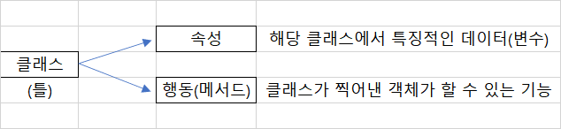

# Chapter 10. 객체 지향 프로그래밍


## 01. 객체 지향 프로그래밍의 이해


### 1.1 객체 지향 프로그래밍을 배우는 이유

* 객체 지향 프로그래밍은 함수처럼 어떤 기능을 함수 코드에 묶어 두는 것이 아니라, 그런 기능을 묶은 하나의 단일 프로그램을 객체라고 하는 코드에 넣어 다른 프로그래머가 재사용할 수 있도록 하는, 컴퓨터 공학의 오래된 프로그래밍 기법 중 하나이다.


### 1.2 클래스

* 클래스는 틀이라고 생각할 수 있다. 클래스를 설계할 때 다음과 같이 2가지를 고려해야 한다.



```python
class Pen:
    def setColor(self, color):
        self.color = color
    def write(self, sentence):
        print(sentence)
```

* 예를 들어, Pen이라는 클래스를 만들면 펜의 색상이나 굵기 등은 해당 클래스의 속성(변수)라고 할 수 있고, 쓰기, 그리기 등은 해당 클래스의 행동(메서드)라고 할 수 있다.


### 1.3 객체

* 객체는 클래스(틀)로 찍어낸 실제(붕어빵)과 같다

```python
class Pen:
    def setColor(self, color):
        self.color = color
    def write(self, sentence):
        print(sentence)
        
red = Pen()
red.setColor('red')
red.write('빨간색입니다')

# 빨간색입니다
```

* 예를 들어, red라는 이름의 객체를 생성하고, 'red' 값을 인자로 지정한다. 그리고 red가 가지고 있는 메소드인 red.write() 를 통해 전달된 문장이 출력되는 것을 볼 수 있다.


### 1.4 인스턴스

* 인스턴스는 객체랑 혼용되는 개념이다. 객체와 같이 클래스로 만들어낸 상태를 의미하는 것은 동일하지만 특정 객체가 어느 클래스의 객체인지 관계를 위주로 설명할 때, 사용되는 용어이다.
* 예를 들어, 펜 클래스, 지우개 클래새, 연필 클래스를 정의하고 각각의 객체가 어느 클래스에 속하는지 확인하기 위해 isinstance()를 사용해보자

```python
class Pen:
    pass
class Eraser:
    pass
class Pencil:
    pass

pen = Pen()
eraser = Eraser()
pencil = Pencil()

print(isinstance(pen, Pen), isinstance(pen, Eraser), isinstance(pen,Pencil))
print(isinstance(eraser, Pen), isinstance(eraser, Eraser), isinstance(eraser,Pencil))
print(isinstance(pencil, Pen), isinstance(pencil, Eraser), isinstance(pencil,Pencil))

# True False False
# False True False
# False False True
```

* 객체와 인스턴스는 모두 클래스를 통해 만들어낸 하나의 실제를 가진다. 엄밀히 따지면 인스턴스는 객체에 포함되는 개념이라고 할 수 있다.
* 앞선 예시로 객체와 인스턴스를 표현하자면, Pen 클래스의 객체로 red가 선언되었으며, red는 Pen 클래스의 인스턴스라고 표현할 수 있다.


## 02. 파이썬의 객체 지향 프로그래밍


* 클래스에 대해 배우기 전 파이썬에서 자주사용하는 작명 기법에 대해 알아보자

| 작명 기법  |                             설명                             |
| :--------: | :----------------------------------------------------------: |
| snake_case | 띄어쓰기 부분에 '_'를 추가하여 변수의 이름을 지정함, 파이썬 함수나 변수명에 사용됨 |
| CamelCase  | 띄어쓰기 부분에 대문자를 사용하여 변수의 이름을 지정함, 낙타의 혹처럼 생겼다하여 Camel 이라고 명명, 파이썬 클래스명에 사용됨 |


### 2.1 클래스 구현하기


#### 1. 속성의 선언

```python
class SoccerPlayer(object):
    def __init__(self, name, position, back_number):
        self.name = name
        self.position = position
        self.back_number = back_number
```

* `__init__()` 함수는 class에서 사용할 변수를 정의하는 함수이다.
* `__init__` 함수의 첫번째 매개변수는 반드시 `self`를 사용해야 한다. self 변수는 클래스에서 생성된 인스턴스에 접근하는 예약어이다.
* 대표적인 예약 함수로 `__init__`, `__str__`, `__add__` 등이 있다. 이러한 함수들은 약속된 형태의 작업을 수행할 수 있도록 도와준다.


#### 2. 함수의 선언

```python
class SoccerPlayer(object):
    def change_back_number(self, new_number):
        print('선수의 등번호를 변경한다: From %d to %d'%(self.back_number, new_nember))
        self.back_number = new_number
```

* 클래스 내에서의 함수도 기존 함수와 크게 다르지 않다. 차이점이 있다면 바로 self 를 매개변수에 반드시 넣어햐 한다는 것이다. self가 있어야만 실제로 인스턴스가 사용할 수 있는 함수로 선언된다.


#### 3. _쓰임

```python
for _ in range(10):
    print('hello')
```

* 일반적으로 _의 쓰임은 개수에 따라 나눌 수 있다. _1개는 이후로 쓰이지 않을 변수에 특별한 이름을 부여하고 싶지 않을 때 사용한다.


### 2.2 인스턴스 사용하기

```python
class SoccerPlayer(object):
    def __init__(self, name, position, back_number):
        self.name = name
        self.position = position
        self.back_number = back_number
    
    def change_back_number(self, new_number):
        print('선수의 등번호를 변경한다: From %d to %d' %(self.back_number, new_number))
        self.back_number = new_number
        
    def __str__(self):
        return 'Hello, My name is %s. I play in %s in center.' %(self.name, self.position)
    
# SoccerPlayer를 사용하는 instance 코드
jinhyun = SoccerPlayer('jinhyun', 'MF', 10)

print('현재 선수의 등번호는:', jinhyun.back_number)
jinhyun.change_back_number(5)
print('현재 선수의 등번호는:', jinhyun.back_number)
print(jinhyun)

# 현재 선수의 등번호는: 10
# 선수의 등번호를 변경한다: From 10 to 5
# 현재 선수의 등번호는: 5
# Hello, My name is jinhyun. I play in MF in center.
```

* 인스턴스가 생성된 후에는 해당 인스턴스의 이름으로 값을 할당하거나 함수를 부르면 되지만, 클래스 내에서는 self로 호출된다. 즉, 생성된 인스턴스인 jinhyun과 클래스 내 self가 같은 역활을 하는 것이다.
* `__str__`함수로 선언된 부분이 print()  함수를 사용하면 반환되는 함수이다.


## 03. 객체 지향 프로그래밍의 특징


### 3.1 상속

* 상속은 부모 클래스에 정의된 속성과 메서드를 자식 클래스가 물려받아 사용하는 것이다.

```python
class Person(object):
    def __init__(self, name, age, gender):
        self.name = name
        self.age = age
        self.gender = gender
        
    def about_me(self): # 메서드 선언
        print('저의 이름은', self.name, '이고요, 제 나이는', str(self.age),'살입니다')
        
class Employee(Person): # 부모 클래스 Person으로부터 상속
    def __init__(self, name, age, gender, salary, hire_data):
        super().__init__(name, age, gender) # 부모 객체 사용
        self.salary = salary
        self.hire_data = hire_data # 속성값 추가
        
    def do_work(self): # 새로운 메서드 추가
        print('열심히 일을 한다')
        
    def about_me(self): # 부모 클래스 함수 재정의
        super().about_me() # 부모 클래스 함수 사용
        print('제 급여는',self.salary, '원이고, 제 입사일은', self.hire_data,'입니다')
```

* 기존 함수를 사용하면서 새로운 내용을 추가하기 위해서는 자식 클래스에 `__init__` 함수를 생성하면서 `super().__init__(매개변수)` 를 사용해야한다. 여기서 `super()`는 부모클래스를 가리킨다.  즉, 부모 클래스의 `__init__` 함수를 그대로 사용한다는 뜻이다.
* 오버라이딩은 상속 시 이름과 필요한 매개변수는 그대로 유지하면서 함수의 수행 코드를 변경하는 것이다. 같은 방식으로 about_me 함수가 오버라이딩된 것을 확인할 수 있다.
* 파이썬에서는 이외에도 다양한 상속 기능을 지원한다. 예를 들어, 1개 이상의 클래스 특징을 상속하는 다중상속을 지원하기도 한다.


### 3.2 다형성

* 다형성은 같은 이름의 메서드가 다른 기능을 할 수 있도록 하는 것을 말한다. 사실 이 기능은 상속에서 이미 확인했다. 예를 들어, about_me의 함수를 부모 클래스와 자식 클래스가 서로 다르게 구현했는데, 이것도 일종의 다형성이다.

```python
class Animal:
    def __init__(self, name):
        self.name =  name
    def talk(self):
        raise NotImplementedError('Subclass must implement abstrack method')
        
class Cat(Animal):
    def talk(self):
        return 'Meow!'
    
class Dog(Animal):
    def talk(self):
        return 'Woof! Woof!'
    
animals = [Cat('Missy'), Cat('Mr.Mistoffelees'), Dog('Lassie')]
for animal in animals:
    print(animal.name + ': ' + animal.talk())
    
# Missy: Meow!
# Mr. Mistoffelees: Meow!
# Lassie: Woof! Woof!
```

* NotImplementedError 클래스는 자식 클래스에만 해당 함수를 사용할 수 있도록 한다


### 3.3 가시성

* 가시성은 객체의 정보를 볼 수 있는 레벨을 조절하여 객체의 정보 접근을 숨기는 것을 말하며, 다양한 이름으로 불린다. 파이썬에서는 가시성이라고 하지만 좀 더 중요한 핵심 개념은 캡슐화와 정보 은닉이다.
* 정보 접근을 조절하는 이유는 초기에 객체 지향 프로그래밍인 자바나 C++ 같은 언어는 컴파일러 언어이기 떄문에, 컴파일된 코드를 라이브러리 형태의 제품으로 판매하던 시절이 있었기 때문이다. 더불어 복잡한 로직을 알 필요없이 필요한 사용법만 알면 되기에 이해가 맞물렸기 때문이다.

```python
class Product(object):
    pass

class Inventory(object):
    def __init__(self):
        self.__items = []
    def add_new_item(self, product):
        if type(product) == Product:
            self.__items.append(product)
            print('new item added')
        else:
            raise ValueError('Invalid Item')
    def get_number_of_item(self):
        return len(self.__items)
    
my_inventory = Inventory()
my_inventory.add_new_item(Product())
my_inventory.add_new_item(Product())

my_inventory.__items

# nem item added
# nem item added
# 에러
```

* 클래스 내부용으로만 변수를 사용하고 싶다면 `__변수명` 형태로 변수를 선언한다. 즉, 가시성을 클래스 내로 한정하면서 값이 다른게 들어가는 것을 막을 수 있다. 이를 정보 은닉이라고 한다.

```python
class Inventory(object):
    def __init__(self):
        self.__items = [] # private 변수로 선언(타인이 접근 못 함)
        
    @property # property 데코레이터(숨겨진 변수 반환)
    def items(self):
        return self.__items
```

* 내부용 변수를 외부에서 사용하려면 데코레이터라고 불리는 @property 를 사용하면 된다.

