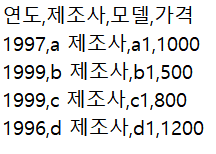
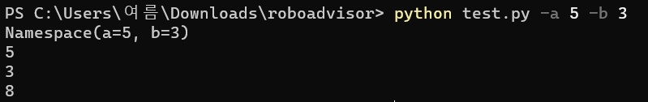
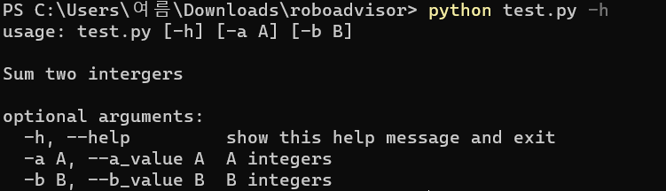

# Chapter 13. CSV와 로그 관리


## 01. CSV


### 1.1 csv의 개념

* CSV (Comma Separate Values) 는 콤마(,)를 기준으로 나누어진 값이라고 이해하면 된다.  흔히 테이블 데이터라고 불리는 엑셀 형태의 데이터를 텍스트 형태로 다루는 형식이다. 하지만 엑셀은 MS 오피스에서만 작동하는 바이너리 파일 형식이지만, csv 파일은 어디서나 사용할 수 있도록 텍스트 데이터를 사용한다.



* 제일 상단에 필드,헤더, 열 이름 이라고 부르는 행이다
* 두 번째 줄부터는 각 필드의 실제 데이터가 있는데, 이러한 한 줄 형식의 데이터는 하나의 객체를 가리킨다. 위 예시에서는 각 줄의 데이터가 하나의 제품 개체를 표현한다. 이는 앞서 배운 '클래스 - 인스턴스' 개념으로 각 행의 데이터가 인스턴스라고 이해하면 된다.
* 데이터의 분류는 기준이 되는 문자에 따라 TSV(Tab~), SSV(Single-blank) 등으로 구분한다.
* 일반적으로 CSV라고 하면 이 모든 자료형을 포하한 것을 뜻하며, 'Character-Separated Values' 라고 구분하여 호칭한다.


### 1.2 csv 파일 만들기

* csv 파일은 엑셀을 사용하여 간단히 만들 수 있다. (다른 이름으로 저장)
* 기존 엑셀 파일은 바이너리 파일로 저장되어 메모장으로 볼 수 없지만, csv 파일은 메모장에서도 확인할 수 있다.


### 1.3 csv 파일 다루기


파이썬으로 csv 파일을 다루는 방법에는 크게 3가지가 있다.

* 파일 객체 사용하기
* csv 객체 사용하기
* PANDAS 객체 사용하기


#### 1. 파일 객체를 사용하여 데이터 다루기

```python
line_counter = 0 #파일의 총 줄 수를 세는 변수
data_header = [] # 데이터의 필드값을 저장하는 리스트
customer_list = [] # customer의 개별 리스트를 저장하는 리스트

with open('customers.csv') as customer_data: # customer.csv 파일을 customer_data 객체에 저장

    while 1:
        data = customer_data.readline() # customer.csv의 데이터 변수에 한 줄씩 저장
        if not data: break # 데이터가 없을 때, 반복문 종료
        if line_counter == 0: # 첫번째 데이터는 데이터의 필드
            data_header = data.split(',') # 데이터의 필드는 data_header 리스트에 저장, 데이터 저장 시 ',' 로 분리

        else:
            customer_list.append(data.split(',')) # 일반 데이터는 customer_list 객체에 저장, 데이터 저장시 ',' 로 분리

        line_counter += 1

print('Header:', data_header) # 데이터 필드값 출력
for i in range(0,10): # 데이터 출력(샘플 10개만)
    print('Data',i,':',customer_list[i])
print(len(customer_list)) # 전체 데이터 크기 출력
```

```text
Header: ['customerNumber', 'customerName', 'contactLastName', 'contactFirstName', 'phone', 'addressLine1', 'addressLine2', 'city', 'state', 'postalCode', 'country', 'salesRepEmployeeNumber', 'creditLimit\n']
Data 0 : ['103', 'Atelier graphique', 'Schmitt', 'Carine ', '40.32.2555', '"54', ' rue Royale"', 'NULL', 'Nantes', 'NULL', '44000', 'France', 
'1370', '21000\n']
Data 1 : ['112', 'Signal Gift Stores', 'King', 'Jean', '7025551838', '8489 Strong St.', 'NULL', 'Las Vegas', 'NV', '83030', 'USA', '1166', '71800\n']
Data 2 : ['114', '"Australian Collectors', ' Co."', 'Ferguson', 'Peter', '03 9520 4555', '636 St Kilda Road', 'Level 3', 'Melbourne', 'Victoria', '3004', 'Australia', '1611', '117300\n']
...

```


* 읽은 정보를 csv 파일에 쓰는 코드

```python
line_counter = 0
data_header = []
employee = []
customer_USA_only_list = []
customer = None

with open('customers.csv', 'r') as customer_data:
    while 1:
        data = customer_data.readline()
        if not data:
            break
        if line_counter == 0:
            data_header = data.split(',')
        else:
            customer = data.split(',')

            if customer[10].upper() == 'USA': # customer 데이터의 offset 10번째 값
                customer_USA_only_list.append(customer) # 즉, country 필드가 'USA' 것만 customer_USA_only_list에 저장
        line_counter += 1

print('Header:', data_header)
for i in range(0,10):
    print('Data:',customer_USA_only_list[i])
print(len(customer_USA_only_list))

with open('customer_USA_only.csv', 'w') as customer_USA_only_csv:
    for customer in customer_USA_only_list:
        customer_USA_only_csv.write(','.join(customer).strip('\n')+'\n') # customer_USA_only_list 객체에 있는 데이터를 customer_USA_only.csv 파일에 쓰기
```

```text
Header: ['customerNumber', 'customerName', 'contactLastName', 'contactFirstName', 'phone', 'addressLine1', 'addressLine2', 'city', 'state', 'postalCode', 'country', 'salesRepEmployeeNumber', 'creditLimit\n']
Data: ['112', 'Signal Gift Stores', 'King', 'Jean', '7025551838', '8489 Strong St.', 'NULL', 'Las Vegas', 'NV', '83030', 'USA', '1166', '71800\n']
Data: ['124', 'Mini Gifts Distributors Ltd.', 'Nelson', 'Susan', '4155551450', '5677 Strong St.', 'NULL', 'San Rafael', 'CA', '97562', 'USA', 
'1165', '210500\n']
...
```

```text
# customer_USA_only.csv
112,Signal Gift Stores,King,Jean,7025551838,8489 Strong St.,NULL,Las Vegas,NV,83030,USA,1166,71800
124,Mini Gifts Distributors Ltd.,Nelson,Susan,4155551450,5677 Strong St.,NULL,San Rafael,CA,97562,USA,1165,210500
...
```


#### 2. csv 객체 사용하기

```python
import csv
f = open('korea_floating_poppulation_data.csv', 'r')
reader = csv.reader(
    f, # 연결할 대상 파일 객체
    delimiter = ',', # 데이터를 분리하는 기준 
    quotechar = '', # 데이터를 묶을 때 사용하는 문자
    quoting = csv.QUOTE_ALL # 데이터를 묶는 기준
)
```

|       구분       |                             설명                             |
| :--------------: | :----------------------------------------------------------: |
|    QUOTE_ALL     | 모든 데이터를 자료형에 상관없이 묶는다. 모든 데이터를 문자열형으로 처리한다. |
|  QUOTE_MINIMAL   | 최소한의 데이터만 묶는다. 예를 들어, ',' 같은 데이터가 포함된 데이터만 묶는다 |
| QUOTE_NONNUMERIC | 숫자 데이터가 아닌 경우에만 묶는다. 이 경우, 데이터를 읽어 올 때 묶이지 않은 데이터는 csv 객체에 의해 실수형으로 읽어 오게 된다. |
|    QUOTE_NONE    |              데이터를 묶는 작업을 하지 않는다.               |


* 데이터를 읽어 올때는 reader() 함수를, 데이터를 쓸 때는 writer() 함수를 사용한다.

```python
import csv # csv 객체 호출

seoung_nam_data = [] # 기본 변수명 선언
header = []
rownum = 0

with open('korea_floating_population_data.csv', 'r', encoding = 'cp949') as p_file: # 불러들일 데이터를 선언함, 한글 처리를 위한 'cp949'
    csv_data = csv.reader(p_file) # csv 객체를 이용해 csv_data 읽기, 특별히 데이터를 나누는 기준을 정하지 않음
    for row in csv_data:
        if rownum == 0:
            header = row # 첫번째 줄은 데이터 필드로 따로 저장
        location = row[7] # '행정구역' 필드 데이터 추출
        if location.find(u'성남시') != -1:
            seoung_nam_data.append(row) # '행정구역' 데이터에 성남시가 있으면 seoung_nam_data 리스트에 추가
        rownum += 1

with open('seoung_nam_floating_population_data.csv', 'w', encoding = 'utf8') as s_p_file:
    writer = csv.writer(s_p_file, delimiter='\t', quotechar="'", quoting=csv.QUOTE_ALL) # csv.writer를 사용해 csv 파일 만들기
    writer.writerow(header) # 제목 필드 파일에 쓰기
    for row in seoung_nam_data:
        writer.writerow(row) # seoung_nam_data의 정보를 리스트에 쓰기 
```


## 02. 로그 관리


### 2.1 로깅의 개념

* 프로그램이 실행되는 동안 일어나는 정보를 파일이나 기록으로 남기는 일을 로깅이라고 한다.


### 2.2 기본 로그 관리 모듈: logging

* 로그 데이터 관리의 다양한 요구 조건 (파일에 남기기, 레벨별로 남기기, 모듈별로 남기기 등) 을 만족시키기 위해서는 이를 위한 프로그램이 따로 필요하다. 파이썬에서는 logging 이라는  이름의 모듈을 사용할 수 있다.

```python
import logging

logging.debug('틀렸잖아')
logging.info('확인해')
logging.warning('조심해')
logging.error('에러 났어')
logging.critical('망했다')

#WARNING:root:조심해
#ERROR:root:에러 났어
#CRITICAL:root:망했다
```


* 로깅 레벨
  * 파이썬 로깅을 실행할 때 로깅 레벨을 지정할 수 있다.  프로그램의 진행 상황이나 실행 단계에 따라 이 출력을 설정할 수 있다. 즉,  필요한 곳에 로깅을 출력하는 코드를 넣고, 설정에 따라 실행 시점에 출력 여부를 조정할 수 있다. 로깅의 출력 단계는 다음과 같이 5단계로 나눈다.

|   단계   |                             개요                             |                             예시                             |
| :------: | :----------------------------------------------------------: | :----------------------------------------------------------: |
|  DEBUG   |           개발 시 처리를 기록하는 로그 정보를 남김           |    다음 함수로 A를 호출함<br /> 변수 A를 ㅁㅁ으로 변경함     |
|   INFO   |              처리가 진행되는 동안의 정보를 알림              | 서버가 시작되었음<br /> 서버가 종료됨<br /> 사용자 A가 프로그램에 접속함 |
| WARNNING | 사용자가 잘못 입력한 정보나 처리는 가능하지만 의도치 않은 정보가 들어 왔을 때 알림 | 문자열 입력을 기대했으나, 정수형이 입력됨, 문자열 casting 으로 처리함<br /> 함수에 인수로 이차워 리스트를 기대했으나, 일차원 리스트가 들어옴, 이차원리스트로 변환 후 처리 |
|  ERROR   | 잘못된 처리로 에러가 발생하였지만, 프로그램은 동작할 수 있을을 알림 | 파일에 기록해야하는데 파일이 없음, 예외처리 후 사용자에게 알림<br /> 외부 서비스와 연결 불가 |
| CRITICAL | 잘못된 처리로 데이터가 손실되었거나 프로그램이 더는 동작할 수 없음을 알림 | 잘못된 접근으로 해당 파일이 삭제됨<br /> 사용자에 의한 강제 종료 |


* 파이썬에서 로깅을 사용하기 위해서는 Logger 객체를 활용해야 한다. 위 코드는 Logger 객체를 따로 만들지 않았는데, 이는 기본 logging 모듈이 Logger를 사용하고 있기 때문이다.

```python
import logging

logger = logging.getLogger('main') # Logger 선언
stream_hander = logging.StreamHandler() # Logger의 출력 방법 선언
logger.addHandler(stream_hander) # Logger의 출력 등록
```

* 3행에서 객체를 획득하고, 4행에서 출력 방법을 선택한다. 출력하는 공간은 파일이나 화면, 다른 네트워크 등을 선택할 수 있는데, 이를 StreamHandler라고 한다. StreamHandler의 역활은 출력 공간 지정이다. 마지막 5행에서 해당 핸들러를 이미 만든 Logger 객체에 추가하는 작업으로 로깅 준비는 끝난다.


* 다음 코드는 해당 Logger가 어느 레벨을 사용해 출력할 것인가를 지정하는 코드이다. 1행에서 DEBUG 레벨을 지정하였으므로 모든 레벨의 로깅 정보를 출력한다.

```python
import logging

logger = logging.getLogger('main')
stream_hander = logging.StreamHandler()
logger.addHandler(stream_hander)

logger.setLevel(logging.DEBUG)
logger.debug('틀렸잖아')
logger.info('확인해')
logger.warning('조심해')
logger.error('에러났어')
logger.critical('망했다')

#틀렸잖아
#확인해
#조심해
#에러났어
#망했다
```


* CRITICAL만 출력으로 지정하면 CRITICAL 정보인 '망했다' 만 화면에 출력된다

```python
import logging

logger = logging.getLogger('main')
stream_hander = logging.StreamHandler()
logger.addHandler(stream_hander)

logger.setLevel(logging.CRITICAL)
logger.debug('틀렸잖아')
logger.info('확인해')
logger.warning('조심해')
logger.error('에러났어')
logger.critical('망했다')

# 망했다
```


## 03. 설정 저장


### 3.1 설정 저장이 필요한 이유

* 이전 절에서 `logger.setLevel(logging.CRITICAL)` 과 같은 방식으로 코드에 레벨을 지정했다. 하지만 이렇게 레벨을 지정하면 몇 가지 문제점이 발생한다.
  *  첫째, 사용자가 프로그램을 실행할 때 로깅 레벨을 지정하기 위해 코드를 수정해야 한다. 다른 사람이 작성한 프로그램 같은 경우, 일일히 다 읽으면서 수정해야 한다.
  * 둘째, 설정값이 너무 많아질 수 있다. 위에서는 1개의 레벨 설정만 있었지만, 만약 10개 넘는 설정값이 있다면 코드를 하나하나 찾아가면서 수정해야한다.
* 위와 같은 이유로 우리는 프로그램을 사용할 때, 기본 설정을 하고 저장을 해서 사용해야 한다.


### 3.2 파이썬에서의 설정 저장

* configparser와 argparse는 설정 저장을 지원하는 모듈이다
* configparser는 설정 자체를 저장하는 것으로, 실행 시점에 설정이 저장된 파일을 읽어와 설정을 적용하는 기능을 제공한다. argparse는 실행 시점의 설정 변수를 직접 지정한다.
* configparser가 훨씬 편해 보이지만, 머신러닝이나 간략한 프로그램에서는 argparse를 훤씬 더 많이 사용한다.


### 3.3 configparser 모듈

* configparser 모듈은 프로그램의 실행 설정값을 어떤 특정 파일에 저장하여 사용하는 방식이다. 앞에서 배운 딕셔너리와 비슷하게 설정 파일 안에 키와 값을 넣고, 이를 호출하여 사용한다.

```text
# example.cfg

[SectionOne]
Status: Single
Name: Derek
Value: Yes
Age: 30
Single: True

[SectionTwo]
FavoriteColor = Green

[SectionThree]
FamilyName: Johnson
```


* `example.cfg` 설정 파일을 사용하는 코드는 다음과 같다

```python
import configparser # 1. configparser 모듈 호출
config = configparser.ConfigParser() # 2. configparser에서 ConfigParser 객체 생성

config.read('example.cfg') # 3. 특정 파일 안에 있는 설정 정보 읽어오기
config.sections() # 4. 해당 파일의 scetion 정보 읽어오기

for key in config['SectionOne']: # 5. 'SectionOne' 에 있는 키 출력
    print(key)

config['SectionOne']['status'] # 6. 'SectionOne'의 'status' 키의 값 출력

#status
#name
#value
#age
#single
```


### 3.4 argparse 모듈

* argparse 모듈은 저장된 파일을 사용하는 것이 아니라 프로그램을 콘솔 창에서 실행할 때 세팅을 설정하는 방식이다. 거의 모든 프로그램은 실행 시점의 설정 기능을 제공한다. 파이썬 인터프리터도 일종의 콘솔 프로그램이므로 이러한 종류의 설정 기능을 제공한다. 일반적으로 실행 시점의 설정 파일을 커맨드-라인 옵션이라고 한다. 파이썬을 처음 실행할 때 `python --v`나 `python -h`를 누르면 파이썬 실행과 관련된 도움말을 확인할 수 있다.
* 이 프로그램은 콘솔창에서 프로그램을 실행할 때, 2개의 명령 행 옵션을 넣고 이를 더하는 결과를 출력하는 프로그램이다.

```python
import argparse # argparse 모듈의 호출

parser = argparse.ArgumentParser(description='Sum two intergers') # 기본 설정 도움말
parser.add_argument('-a','--a_value',dest='a',help='A integers',type=int) # a 인수 추가
parser.add_argument('-b','--b_value',dest='b',help='B integers',type=int) # b 인수 추가

args = parser.parse_args() # 입력된 커맨드 라인 인수 파싱

print(args) # 결과 출력
print(args.a)
print(args.b)
print(args.a + args.b)
```

* 3행에서는 ArgumentParser 객체를 만들고, 기본적인 도움말을 description 변수에 등록한다.
* 5,6행 에서는 새로운 인수를 추가한다. 인수를 추가할 때는 -을 이용하여 짧게 쓸 때 사용하는 이름, --을 이용하여 길게 쓸 때 사용하는 이름, 인수의 표시 이름, 도움말, 자료형 등을 함께 등록할 수 있다.
* 8행에서는 명령을 통해 커맨드 라인에 입력된 인수를 불러와 args 변수에 할당한다.
* 10~13행에서는 각각의 값을 입력하면 실행 결과가 출력된다.
* 위에 코드를 `test.py`로 저장하고, cmd 창에서 `python test.py -a 5 -b 3`을 입력하면 다음과 같이 출력된다.



```text
Namespace(a=5, b=3) # 값이 저장된 형태는 'Namespace' 객체
5 # a 인수의 값 출력
3 # b 인수의 값 출력
8 # a인수와 b 인수의 덧셈
```


* 만약 커맨드 -라인 인수에 대한 정보를 모른다면 `python test.py -h`를 입력하면 -h 옵션을 사용하면 해당 값들의 자세한 사용법을 확인할 수 있다.

