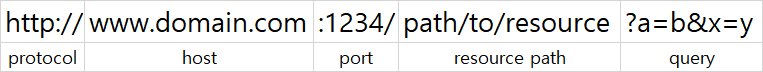
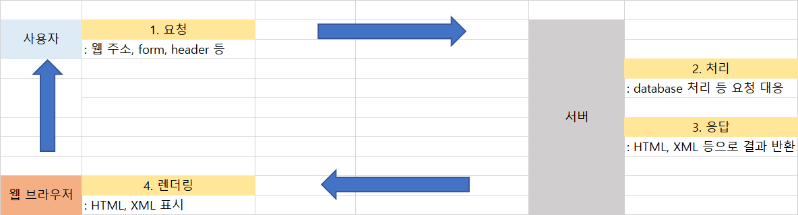
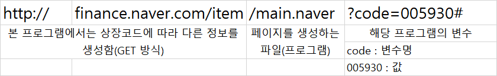

# Chapter 14. 웹 스크래핑


## 01. 웹의 이해


### 1.1 웹의 개념

* 월드 와이드 웹(Word Wide Web)은 인터넷에 연결된 컴퓨터를 이용하여 사람들과 정보를 공유할 수 있도록 거미줄처럼 엮인 공간이다. 

+ 웹을 개발한 원래 목적은 물리학자들이 편하게 여러가지 정보를 교환하기 위해서였다. 당시 웹의 출현은 이메일과 함께 조직에서 정보를 교환하기 위한 가장 혁신적인 방법으로 인식되었다.


### 1.2 웹 컴포넌트: HTML과 HTTP

웹은 다양한 컴포넌트로 이루어져 있는데, 이 중 특히 중요한 컴포넌트는 HTML과 HTTP 이다.


#### 1. HTML

* HTML(Hyper Text Markup Languaage)은 웹상의 정보를 구조적으로 표현하기 위한 언어이다. 웹에서는 일종의 신문처럼 여러 정보를 구조적으로 표현한다. 예를 들어, 제목, 단락, 이러한 구조 정보를 태그라는 개념을 사용하여 표현한 것이 바로 HTML이다.

```text
<title> Hello, World </title> # 제목 요소, 값은 Hello, World
```

* 태그는 <> 둘러싸고, 해당 태그를 끝낼 때는 /를 사용해서 </> 종료한다.


#### 2. HTTP

* HTTP(Hypertext Transaction Protocol)는 인터넷에서 컴퓨터 간에 정보를 주고받을 때 사용하는 일종의 약속을 말하며, 프로토콜이라고 한다. 일종의 텍스트 데이터 교환을 뜻하는데, 컴퓨터 간데 정보를 주고 받을 때는 어떤 컴퓨터가 접속하는지, 그 컴퓨터가 어떤 운영 체제를 사용하는지, 언제 접속했는지, 문서의 제목이 무엇인지 등 HTML을 주고받을 때 필요한 다양한 정보를 주고받는 포맷을 사전에 정의하는 것이다. 최근에는 보안 문제 때문에 HTTP가 아닌 HTTPS(Hyper Transaction Protocol Secure)를 주로 사용한다. 이 외에도 FTP, SSH 등이 있다.


### 1.3 웹의 동작 순서


* HTML과 HTTP를 사용해서 어떻게 웹을 컴퓨터에서 볼 수 있을까?  우리가 웹에 있는 정보를 보기 위해 먼저 웹 브라우저를 시작하고, 거기에 주소 정보를 입력한다. 주소 정보의 공식 이름은 URL(Uniform Resouce Location) 이라고 하며,  다음과 같이 다양한 요소로 구성되어 있다.




* URL에는 해당 서버가 위치한 인터넷 주소 정보인 도메인 네임(domain name) 이 있다. 흔히 도메인 정보 또는 서버 주소라고도 하는 이 주소를 통해 웹의 정보를 제공하는 서버에 접속한다. 단순히 서버에 접속한다고 하지만, 사실 이 또한 매우 긴 프로세서를 거친다. 컴퓨터는 우리가 아는 도메인 주소를 직접적으로 알지지 못한다. 일반적으로 인터넷 프로토콜 주소(Internet Protocol address, IP) 라고 부르는 주소값을 가진다. 예를 들어, '203.252.143.23' 처럼 4개의 공간에 0~255의 값이 붙어 있는 형식이다. 이를 IPv4라고 한다. 최근에는 인터넷에 접속할 수 있는 기기가 기하급수적으로 늘어나면서 4개의 공간만으로는 인터넷 주소의 수요를 맞출 수 없어 IPv6라는 인터넷 주소 체계를 사용하기 시작하였다. 이 IP 주소를 컴퓨터 주소로 생각하면 이 주소에 접속하기 위해 사용하는 도메인 네임과 연결하기 위한 도메인 네임 서버(Domain Name Server, DNS)가 운영된다. 즉 우리가 웹브라우저에 접속하여 URL 주소를 입력하면, 그 URL 주소에 포함된 도메인 네임을 찾게 되고, 그 도메인 네임의 IP 주소를 도메인 네임서버를 통해 알아낸다. 이후 해당 IP 주소를 가진 서버에 접속하여 필요한 정보를 요청한다.
* 그렇다면 요청한다는 것은 무엇을 뜻할까? 간단히 말해 내가 가진 주소의 정보를 내 컴퓨터로 다운로드하게 해달라는 것이다. 여기서 정보는 HTML, CSS, 자바스크립트와 같이 웹 페이지를 꾸미는 기능을 하는 코드로 다운로드하게 된다. 또한, 동영상이나 그림 같은 리소스도 다운로드한다. 이렇게 다운로드한 정보를 내 컴퓨터에서 시작적으로 표현하기 위해 컴퓨터의 웹 브라우저는 그 정보를 해석하고 렌더링을 시행한다. 렌더링은 어떤 정보나 코드를 사용하여 시각적으로 어떤 약속에 기반하여 표현하는 과정이다. 예를 들어, 우리가 스마트폰으로 영상을 찍으면 디지털 파일로 저장되는데, 이를 mp3와 같은 다른 형태로 변경할 때 렌더링을 다시한다고ㅗ 말한다. 웹 브라우저에서 `F12`를 누르면 다운로드하는 정보와 렌더링하여 표현되는 정보를 볼 수 있다.




### 1.4 웹 스크래핑

* 웹에서 데이터를 가지고 오고 싶다면 웹 스크래핑을 이용하면 된다. 
* 모든 웹은 HTML로 구성되어 있으므로, HTML의 규칙을 파악한다면 HTML에서 우리가 필요한 정보를 가져올 수 있다. 이러한 과정을 웹 스크래핑 또는 크롤링이라고 한다.

* 엑셀로 간단하게 `데이터` > `웹` 을 통해 스크래핑이 가능하기도 하다.


## 02. HTML 데이터 다루기


### 2.1 웹에서 데이터 다운로드하기

```python
import urllib.request # urllib 모듈 호출
url = '' # 다운로드 url 주소

print('Start download')
fname, header = urllib.request.urlretrieve(url, '파일명.확장자')
# urlretrieve(url 주소, 다운로드할 파일명), 결과값으로 다운로드한 파일명과 header 정보를 언패킹

print('End Download')

# Start download
# End Download
```


### 2.2 HTML 파싱

 

*  다운로드할 URL을 추출하는 방법을 알아보자. 이를 위해서는 웹 페이지의 HTML을 분석하여 필요한 URL을 추출하는 HTML 파싱 작업이 필요하다. 파싱(parsing)은 특정 텍스트를 분석하여 그 데이터로부터 필요한 정보를 추출하는 과정이다.
* 웹사이트 대부분은 사람이 직접 HTML을 작성하지 않는다. HTML은 대부분 사람이 아닌 프로그램에 의해 생성되며, 이를 우리가 웹 브라우저를 통해 접근하고 볼 수 있도록 지원한다.사용자가 변수에 값을 넣으면 파이썬 프로그램의 결과가 변수의 값에 따라 달라지는 것처럼, 다음 웹 페이지의 주소에서 code 부분의 값이 변하면 출력되는 웹 페이지도 달라진다.

```text
https://finance.naver.com/item/main.naver?code=005930#
```


* 웹 주소의 앞부분에는 그 웹페이지의 서버 정보가, 뒷부분에는 웹페이지를 나타내는 프로그램 코드가 있다. 웹 페이지의 뒷부분 물움표(?) 다음에는 해당 프로그램이 사용해야하는 변수가 적혀 있다. 대부분 웹 페이지는 위와 같이 어떤 변수값을 입력하면 그 값에 맞춰 다른 정보를 동적으로 표시한다.



* 만약 다양한 주식 정보를 다운로드 하고 싶다면, 웹 페이지 주소를 계속 바꾸는 반복문을 만든 후 urllib 모듈을 통해 다운로드하면 여러 회사의 정보를 모을 수 있다.


* 웹 페이지에서 필요한 정보만 추출하는 방법은 무엇일까?

```html
<dl class="blind">
	        <dt>종목 시세 정보</dt>
	        <dd>2022년 09월 15일 16시 11분 기준 장마감</dd>
	        <dd>종목명 삼성전자</dd>
	        <dd>종목코드 005930 코스피</dd>
	        <dd>현재가 56,000 전일대비 하락 800 마이너스 1.41 퍼센트</dd>
	        <dd>전일가 56,800</dd>
	        <dd>시가 57,000</dd>
	        <dd>고가 57,100</dd>
	        <dd>상한가 73,800</dd>
	        <dd>저가 56,000</dd>
	        <dd>하한가 39,800</dd>
	        <dd>거래량 11,417,477</dd>
	        <dd>거래대금 643,694백만</dd>
        </dl>
```

* HTML 코드에서 원하는 정보를 파악해서 패턴을 파악한다. 위에 코드에서는 정보는 크게 <dl>클래스 사이의 코드 안에 있고, 개별 정보는 <dd> 태그 사이에 있는 것을 알 수 있다. 
* 정보를 추출하기 위한 기법으로 일반적으로 2가지 방법이 있다. 첫번째는 정규 표현식이라고 하는 문자열 생성 공식을 사용하거나 파이썬에서 제공하는 HTML parsing 모듈을 사용하는 방법이 있다.


## 03. 정규 표현식


### 3.1 정규 표현식의 개념

* 정규표현식(regular expression, regex)은 일종의 문자를 표현하는 공식으로, 특정 규칙이 있는 문자열 집합을 추출할 때 자주 사용하는 기법이다.

|   일반 문자    |            정규 표현식             |
| :------------: | :--------------------------------: |
| 010-0000-0000  |        ^\d{3}-\d{4}-\d{4}$         |
| 203.252.101.40 | ^\d{1,3}.\d{1,3}.\d{1,3}.\d{1,3}.$ |

* 어떤 공식에 의해 추출할 수 있는 문자열은 다양하다. 예를 들어, 주민등록번호, 전화번호 등 모두 형식이 지정된 문자열이다. 앞으로 다룰 HTML도 태그를 사용한 일정한 형식이 있으므로 정규표현식으로 추출하기 쉽다.


### 3.2 정규 표현식 문법


* 정규 표현식을 배우기 위해 기본으로 알아야 하는 개념은 메타문자이다. 일반적으로 '메타' 라는 글자가 붙으면 '어떤 내용을 설명하기 위한 어떤 것' 이라는 뜻이다. 메타문자는 문자를 설명하기 위한 문자로, 문자의 구성을 설명하기 위해 원래의 의미가 아니라 다른 의미로 쓰이는 문자를 뜻한다. 

```text
. ^ $ * + ? {} \ | ()
```


#### 1. 기본 메타문자 []

* 대괄호 []는 [] 사이의 문자와 매칭하라는 뜻으로 사용된다.

|   문법   |             의미              |
| :------: | :---------------------------: |
|  [abc]   | a또는 b또는 c가 포함된 텍스트 |
|   [Yy]   |    Y또는 y가 포함된 텍스트    |
| [A-Za-z] |          모든 알파벳          |
| [가-힝]  |           모든 한글           |
|  [0-9]   |           모든 숫자           |


#### 2. 반복 관련 메타문자 -, +, *, ?, {}

* 앞에서 배운 대문자 []는 한 번에 여러 개의 글자를 표현할 수 없다. 예를 들어, 휴대폰번호를 찾고 싶으면 다음과 같이 정규 표현식을 작성해야 한다.

```text
[0-9][0-9][0-9]-[0-9][0-9][0-9][0-9]-[0-9][0-9][0-9][0-9]
```


* 위와 같이 작성하면 텍스트를 너무 많이 적는다. 이럴 경우 쓸 수 있는 메타문자가 +이다. +는 해당 글자가 1개 이상 출현하는 것을 뜻한다.

```text
[0-9]+-[0-9]+-[0-9]+
```


* 위와 같이 작성하면 여전히 문제점이 있다. 우리 나라 휴대폰 번호는 `3자리`-`3~4자리`-`4자리` 형식으로 되어있다. 따라서 출현 횟수를 조절해야 한다. 이럴 경우 쓸 수 있는 메타문자가 중괄호 {}이다.

```text
[0-9]{3}-[0-9]{3,4}-[0-9]{4}
```

* 반복 횟수는 {1,}, {0,}, {,3} 처럼 시작값이나 끝 값은 지정하지 않고 오픈할 수 있다.


* 예전에는 휴대폰 앞에 010, 011, 016, 018, 019 등이 있었다. 이 경우 01은 반드시 포함되고 뒤에 어떤 숫자가 한번만 반복될 경우 메타문자 물음표 ? 를 사용할 수 있다.

```text
01[01689]?-[0-9]{3,4}-[0-9]{4}
```


* 메타문자 *는 해당 글자가 0번부터 무한대로 반복할 경우 사용할 수 있다. {0,}와 같은 뜻이다. 잘 사용하지는 않는 메타문자이다.

```text
tomor*ow

# tomoow
# tomorow
# tomorrow
...
```


#### 3. 그 외 메타문자 (), ., |, ^, $, \

* ()는 묶음을 표시하는 것이다. 좀더 쉽게 메타문자의 묶음을 표시하는 역활을 한다. 사실 ()는 사용하지 않아도 되지만, 나중에 묶음으로 데이터를 받아 처리할 일이 있을 때 영역을 설정할 수 있다. 추출보다 파이썬으로 핸들링할 때 좀 더 쉽게 할 수 있다.


* . 은 [.]와 (.)의 뜻이 다른데, [.]는 일반적인 마침표를 뜻하고 (.)는 줄 바꿈 기호를 제외한 전체 문자를 뜻한다.

```text
00:00:09.785 -> 00:00:11474
안녕하세요. 여름입니다.

00:00:11.474 -> 00:00:16.215
이번 주는
```

* 만약 위와 같은 자막 데이터에서 시간 정보를 없애고 싶으면 어떻게 해야 할까? 여러 가지 방법이 있지만, 이 정보가 숫자로 시작해 여러 문자가 있고 숫자로 끝나기 때문에 `[0-9].+[0-9]` 로 표현한다면 쉽게 문자열 매칭이 가능할 것이다. .은 패턴이 일정하지 않지만, 시작과 끝을 명확히 알고 있을 때 유용하다. 특히 줄 바꿈이 없는 경우에는 가장 좋은 해결책이다.


* | 는 or 의 의미로 쓰인다. 예를들어 (0|1){3}이라고 표현하면 0또는 1이 3번 나온다는 뜻이다. 사실 [01]{3}과 같은 뜻이어서 그다지 사용되지 않는다.


* ^은 정규 표현식 중간에 쓰이면 not의 의미이다. 앞의 자막 예제를 `[0-9]{2}[^:][0-9]`로 표현하면, 결과는 숫자들이 있고 중간 콜론(:)이 없으며 다음에 숫자가 연속으로 나오는 것만 출력한다. 즉 , 중간에 .이 들어간 11.4 문자 등만 출력된다.


* 정규 표현식의 처음과 끝에는 ^과 $를 주로 붙인다. 이는 정규 표현식에서 시작과 끝을 표현하는 메타문자로, 꼭 붙이지 않아도 상관없지만 많은 코드에서 붙인 것을 볼 수 있다.


* 메타문자를 찾고 싶다면 어떻게 해야 할까? 예를 들어 [을 찾고 싶거나 {를 찾고 싶을 때가 있다. 이경우에는 \ 문자를 사용한다. 파이썬과 마찬가지고 \는 특수 기호로 매우 많은 의미를 가지고 사용할 수 있다. 줄 바꿈 기호의 경우에도 윈도의 cp949 계열 인코딩에서는 \n을 쓸 수 있고, 맥의 utf8에서는 \r\n을 쓸 수 있다. 만약 문서 전체를 지정하고 싶다면 (.)+(\r\n)+ 로 모든 문자를 선택할 수 있다.


#### 4. 정규 표현식 연습

* 정규표현식 연습사이트 `https://regexr.com/`

```text
<a href="http://storage.googleapis.com/patents/grant_full_text/2015/ipg150106.zip">
ipg150106.zip</a>&nbsp;
<a href="http://storage.googleapis.com/patents/grant_full_text/2015/ipg150113.zip">
ipg150113.zip</a>&nbsp;
<a href="http://storage.googleapis.com/patents/grant_full_text/2015/ipg150120.zip">
ipg150120.zip</a>&nbsp;
<a href="http://storage.googleapis.com/patents/grant_full_text/2015/ipg150127.zip">
ipg150127.zip</a>&nbsp;
<a href="http://storage.googleapis.com/patents/grant_full_text/2015/ipg150203.zip">
ipg150203.zip</a>&nbsp;
<a href="http://storage.googleapis.com/patents/grant_full_text/2015/ipg150210.zip">
ipg150210.zip</a>&nbsp;
<a href="http://storage.googleapis.com/patents/grant_full_text/2015/ipg150217.zip">
ipg150217.zip</a>&nbsp;
<a href="http://storage.googleapis.com/patents/grant_full_text/2015/ipg150224.zip">
ipg150224.zip</a>&nbsp;
<a href="http://storage.googleapis.com/patents/grant_full_text/2015/ipg150303.zip">
ipg150303.zip</a>&nbsp;
<a href="http://storage.googleapis.com/patents/grant_full_text/2015/ipg150310.zip">
ipg150310.zip</a>&nbsp;
<a href="http://storage.googleapis.com/patents/grant_full_text/2015/ipg150317.zip">
ipg150317.zip</a>&nbsp;
```

* 다운로드 링크를 추출해보자. 정규 표현식을 생각해 보면 시작은 http 끝은 zip 으로 끝나는 것을 알 수 있다. 중간에는 매우 다양한 글자가 나온다. 따라서 이 문서에서는 `(http)(.+)(zip)` 이라고 입력하면 링크를 추출할 수 있다.

