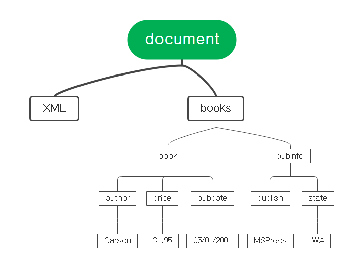
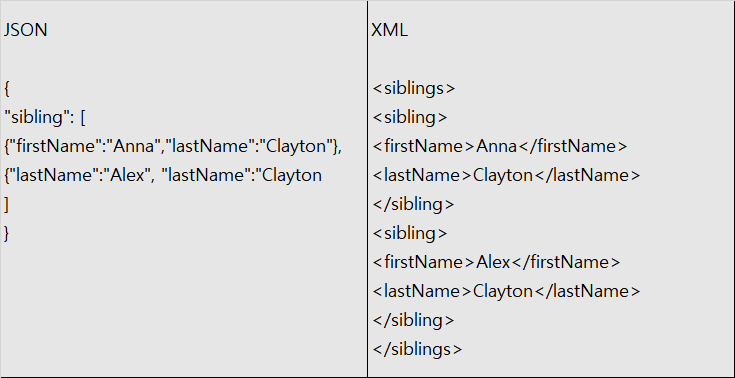

# Chapter 15. XML과 JSON


## 01. XML의 이해


### 1.1 XML의 개념

* XML(eXtensible Markup Language)은 확장적인 마크업 언어라는 뜻으로, 데이터의 구조와 의미를 설명하는 태그를 사용하여 어떤 데이터의 속성과 값을 표현하는 언어이다. 즉, 시작 태그와 종료 태그 사이에 어떤 값이 있고, 그 값은 태그의 이름으로 만들어진 속성에 대한 값이 된다. 사실상 HTML과 같은데, HTML은 XML에서 웹에 필요한 개념만 정의하여 사용할 수 있도록 만들어진 언어이다. HTML은 한정적이지만, XML은 그에 비해 다양한 형태로 데이터를 표현할 수 있는 장점이 있다.
* XML 프로그래밍 언어에서 데이터를 저장하고 불러오는 전통적인 파일 포맷인 XML은 흔히 레거시 시스템(오래전에 구축된 시스템)에서 raw 파일을 저장하는 대표적인 포맷이다.
* 현재 XML은 10년 전보다 그 중요성이 떨어졌다. 가장 큰 이유는 XML 이 데이터베이스보다 좀 더 자유롭게 데이터를 저장하기 위해 만들어졌는데, 이 기능이 최근 많이 사용하는 JSON보다 훨씬 무겁기 때문이다.  그래도 여전히 기존의 오래된 시스템, 흔히 레거시라고 하는 시스템에서는 기기 간 또는 컴퓨터와 스마트폰 등의 다른 기기 간의 정보를 XML로 주고받고 있다.


### 1.2 XML 표현하기

```xml
<?xml version="1.0"?>
<학생>
    <이름>여름</이름>
    <학번>201845123</학번>
    <나이>4</나이>
    <학과>고양이학과</학과>
    <성별>여성</성별>
</학생>
```

* 위의 XML 예시는 학생이라는 정보를 XML로 어떻게 표현했는지 보여 준다. 학생이라는 정보를 표현하기 위해 학생의 이름, 학번, 나이, 학과, 성별 등이 제공되는데, 이를 각각 태그로 표현하고 그 사이의 개별 인스턴스에 대한 정보를 넣으면 된다. 이러한 구조는 Class, Object 개념과 크게 다르지 않으며, 딕셔너리의 형태로도 바꾸어 표현할 수 있다.


### 1.3 XML 문서


* XML로 정보를 표현할 때 가장 기본적인 방법은 트리 형태로 표현하는 것이다. 이는 HTML과 완전히 같으며 모든 태그 기반의 언어가 지닌 공통적인 특징이다.



```xml
<?xml version="1.0"?>
<books>
    <book>
        <author>Carson</author>
        <price format='dollar'>31.95</price>
        <pubdate>05/01/2001</pubdate>
    </book>
    <pubinfo>
        <publish>MSPpress</publish>
        <state>WA</state>
    </pubinfo>
</books>
```

* 상당히 복잡해 보이지만 사실 이 구조는 딕셔너리형의 구조와 같다. 간단히 딕셔너리로 생각하면 다음과 같이 표현할 수 있다.


```json
{books : [{book : {author: carson, price:31.95, pubdate:05/01/2001}}]}
```

* 위와 같은 데이터형을 JSON형이라고 한다.


## 02. JSON의 이해


### 2.1 JSON의 개념

* JSON(JavaScript Object Notation)은 원래 웹 프로그래밍 언어인 자바스크립트의 데이터 객체 표현 방식을 사용하여 데이터 교환의 표준으로 삼은 데이터 표현 언어이다. JSON은 간결한 특성 때문에 기계와 인간이 모두 이해하기 쉽다는 장점이 있다. 특히 XML보다 데이터 용량이 적고 코드로의 전환이 쉽다는 측면에서 XML의 대체제로 가장 많이 활용되고 있다. 대부분 웹 시스템에서 기기 간의 정보 교환을 위해 JSON을 사용하므로, 데이터를 배우는 사람은 반드시 알아야 할 데이터 포맷이다.
* JSON은 파이ㅣ썬의 딕셔너리형과 매우 비슷하여, 키-값의 쌍으로 구성되어 있다. 따라서 딕셔너리형과 같게 이해하면된다.
* JSON은 모바일 사용이 증가하면서 사용되기 시작한 저장 포맷으로, 웹에서 많이 사용하는 자바스크립트의 문법을 활용하여 저장하는 포맷이다. 

```json
{
    'dataTitle':'JSON Tutorial',
    'swiftVersion':2.1
    
    'users':[
    	{
    		'name':'John',
    		'age':25
		},
		{
            'name':'Mark',
            'age':29
        },
		{
            'name':'Sarah'
            'age':22
        }
    ],
}
```


### 2.2 JSON과 XML


* JSON은 XML과 많은 면에서 닮았다. 먼저 데이터 구조가 기본적으로 트리 구조이다. 따라서 XML에서 요소 간의 포함 관계를 가지듯 JSON도 이러한 포함 관계를 가진다. 또한, 태그를 사용하여 키와 값을 구분한 XML처럼 JSON은 키-값의 쌍으로 데이터를 구조화할 수 있다.
* XML과 비교할 때 JSON의 장점은 일단 코드가 간결하고, 코드의 전환이 쉽다는 점이다. 그리고 코드의 간결함 때문에 용량의 절약이라는 가장 큰 장점이 있다.



