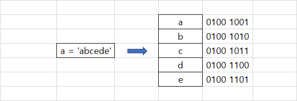

# Chapter 6. 문자열


## 01. 문자열의 이해


### 1.1 문자열의 개념

* 문자열은 시퀀스 자료형이다. 시퀀스 자료형은 리스트와 같이 데이터를 순차적으로 메모리에 저장하는 형식의 데이터 이다.




### 1.2 문자열과 메모리 공간

* 컴퓨터는 문자를 직접 인식하지 못한다.
* 컴퓨터는 문자를 숫자로 변환하여 인식한다.
* 사람들은 문자를 숫자로 변환하기 위한 규칙을 만들었다. 이러한 규칙을 인코딩이라고 한다.
  * 대표적인 ASCII, 한글처리를 위한 CP949, MS949, UTF-8 등 이 있다.
* 일반적으로 이 규칙은 1개의 영문자를 1바이트, 즉 2의 8승 정도의 공간에 저장될 수 있도록 정하였다.
* 이러한 규칙을 이용하여 숫자와 문자를 맵핑하는 것이 바로 운영체제와 인터프리터의 역활 중 하나이다.


### 1.3 문자열의 인덱싱

* 문자열도 시퀀스 자료형이기에 리스트의 특징과 거의 같다.

```python
a = 'abced'

a[0] # a
a[-1] # e
```


### 1.4 문자열의 슬라이싱

```python
a = 'abced'

a[:2] #ab
a[-3:] #ced
```


### 1.5 문자열의 연산

```python
a = '1'
b = '2'

print(a+b) # 12
```


### 1.6 문자의 함수

| 함수명                    | 기능                                                         |
| ------------------------- | ------------------------------------------------------------ |
| len()                     | 문자열의 문자 개수를 반환                                    |
| upper()                   | 대문자로 변환                                                |
| lower()                   | 소문자로 변환                                                |
| title()                   | 각 단어의 앞글자만 대문자로 변환                             |
| capitalize()              | 첫문자를 대문자로 변환                                       |
| count('찾을 문자열')      | '찾을 문자열' 이 몇 개 들어 있는지 개수 반환                 |
| find('찾을 문자열')       | '찾을 문자열' 이 왼쪽 끝부터 시작하여 몇 번째에 있는지 반환  |
| rfind('찾을 문자열')      | find() 함수와 반대로 '찾을 문자열' 이 오른쪽 끝부터 시작하여 몇 번째에 있는지 반환 |
| startswith('찾을 문자열') | '찾을 문자열' 로 시작하는지 여부 반환                        |
| endswith('찾을 문자열')   | '찾을 문자열' 로 끝나는지 여부 반환                          |
| strip()                   | 좌우 공백 삭제                                               |
| rstrip()                  | 오른쪽 공백 삭제                                             |
| lstrip()                  | 왼쪽 공백 삭제                                               |
| split()                   | 문자열을 공백이나 다른 문자로 나누어 리스트로 반환           |
| isdigit()                 | 문자열이 숫자인지 여부 반환                                  |
| islower()                 | 문자열이 소문자인지 여부 반환                                |
| isupper()                 | 문자열이 대문자인지 여부 반환                                |


### 1.7 문자열 표현과 특수문자

| 특수문자  | 기능                    | 특수문자 | 기능        |
| --------- | ----------------------- | -------- | ----------- |
| \\`enter` | 다음 줄과 연속임을 표현 | \\b      | 백 스페이스 |
| \         | \ 문자 자체             | \\n      | 줄 바꾸기   |
| \\'       | ' 문자                  | \\t      | `tab`키     |
| \\"       | " 문자                  | \\e      | `esc` 키    |

```python
다음과 같이 여러 줄을 표현할 수 있다.

a = '''
It's Ok.
I'm Happy.
'''
```


## 02. 문자열 서식 지정


### 2.1 서식지정 개념

print() 함수를 사용하다 보면 어떤 형식에 맞추어 결과를 출력해야 할 일이 있다. 통화단위, % 등 다양한 형식에 맞추어 출력할 일이 생기는데. 이를 서식지 지정이라고 한다.


### 2.2 f - string

* 기본적인 형태

```python
# f'{}'

year = 2022
month = 8
day = 5

a = f'{year}년 {month}월 {day}일'
print(a) 

# 2022년 08월 05일
```

* 변수 간 연산 기능

```python
x = 2
y = 2

a = f'{x}의 {y}제곱은 {x ** y}'
print(a) 

# 2의 2제곱은 4
```


### 2.3 % 서식

* 기본적인 형태

```python
# '%자료형 %(값)'

year = 2022
month = 8
day = 5

print('%d년 %d월 %d일' %(year,month,day)) 

# 2022년 08월 05일
```

* 변수의 자료형에 따른 서식

| 서식 |         설명         |
| :--: | :------------------: |
|  %s  |    문자열(string)    |
|  %c  | 문자 1개(character)  |
|  %d  |    정수(integer)     |
|  %f  | 실수(floating-point) |
|  %o  |        8진수         |
|  %x  |        16진수        |
|  %%  |     문자 % 자체      |


### 2.4 format() 함수

* 기본적인 형태

```python
# '{자료형}'.format(인수)

year = 2022
month = 8
day = 5

print('{}년 {}월 {}일' .format(year,month,day)) 

# 2022년 08월 05일
```


### 2.5 패딩

* 파이썬의 서식 지정 기능에는 여유 공간을 지정하여 글자 배열을 맞추고 소수점 자릿수를 맞추는 패딩기능이 있다.

```python
# f-string

# 소수점 포맷팅
x = 3.14
y = 4

b = f'{x:.2f}의 {y:03d}제곱은 {x ** y:.3f}'
print(b) 

# 3.14의 004제곱은 97.212

# 패딩
a = 'abcde'

print(f'{a:<10}') # 10칸을 주고 왼쪽 정렬
print(f'{a:^10}') # 10칸을 주고 가운데 정렬
print(f'{a:>10}') # 10칸을 주고 왼쪽 정렬

print(f'{a:@<10}') # 10칸을 주고 왼쪽 정렬, 빈칸은 @

# abcde     
#   abcde
#      abcde
# abcde@@@@@
```

```python
# % 

print('%10d' %12) # 10칸을 주고 왼쪽 정렬
print('%-10d' %12) # 10칸을 주고 오른쪽 정렬

print('%10.3f' %1.2345) # 10칸을 주고 왼쪽 정렬, 소수점 셋째자리까지
print('%-10.3f' %1.2345) # 10칸을 주고 왼쪽 정렬, 소수점 셋째자리까지
```

```python
# format()

print('{:>10s}'.format('apple')) # 10칸을 주고 오른쪽 정렬
print('{:<10.3f}'.format(1.23456)) # 10칸을 주고 왼쪽 정렬, 소수점 셋째자리까지
```


### 2.6 네이밍

* 변수명을 서식에 할당할 수 있는 네이밍이라는 기능이 있다.

```python
print('%(name)s'%{'name':'summer'})
print('{name}'.format(name = 'summer'))
```


