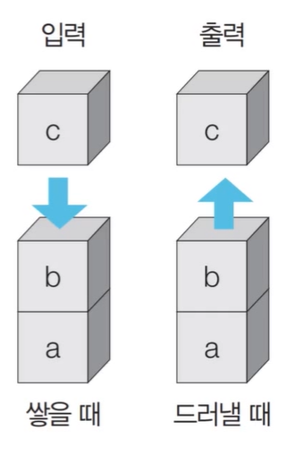
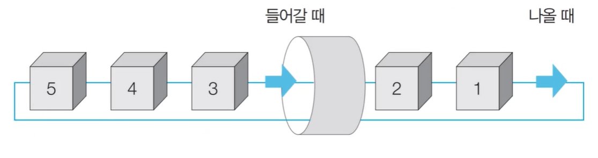
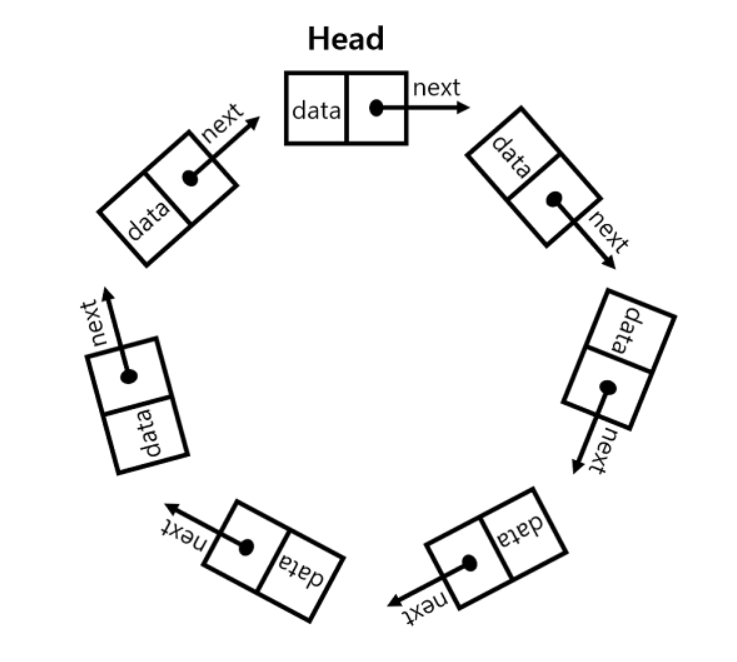

# Chapter 7. 자료구조


## 01. 자료구조의 이해

|    자료구조명    |                             특징                             |
| :--------------: | :----------------------------------------------------------: |
|       스택       |   나중에 들어온 값을 먼저 나갈 수 있도록 해 주는 자료구조    |
|        큐        |    먼저 들어온 값을 먼저 나갈 수 있도록 해 주는 자료구조     |
|       튜플       |    리스트와 같지만, 데이터 변경을 허용하지 않는 자료구조     |
|       세트       | 데이터 중복을 허용하지 않고, 수학의 집합 연산을 지원하는 자료구조 |
|     딕셔너리     | 전화번호부와 같이 키와 값 형태의 데이터를 저장하는 자료구조, 여기서 키값은 다른 데이터와 중복을 허용하지 않음 |
| collections 모듈 | 위에 열거도니 여러 자료구조를 효율적으로 사용할 수 있도록 지원하는 파이썬 내장 모듈 |


## 02. 스택과 큐


### 2.1 스택

* 먼저 들어 온 데이터가 나중에 나가는 형식의 자료구조



```python
a = []

a.append(1) # a = [1]
a.append(2) # a = [1,2]
a.append(3) # a = [1,2,3]
a.append(4) # a = [1,2,3,4]
a.pop() # 4
a.pop() # 3 
```


### 2.2 큐

* 먼저 들어 온 데이터가 먼저 나가는 형식(선입선출)의 자료구조



```python
a = [1,2,3,4,5]
a.append(10) # a = [1,2,3,4,5,10]
a.append(20) # a = [1,2,3,4,5,10,20]
a.pop(0) # 1
a.pop(0) # 2
```


## 03. 튜플과 세트


### 3.1 튜플

* 리스트와 같은 개념이지만, 값을 변경하는 것이 불가능하다.
* 리스트에서 사용하는 연산, 인덱싱, 슬라이싱이 모두 동일하게 적용된다.
* 튜플은 이름이나 학번, 주민등록번호와 같이 변경되지 않아야하는 정보 등에 사용한다.

```python
t = (1,2,3)
print(t+t, t*2) # (1,2,3,1,2,3) (1,2,3,1,2,3)

# 튜플 값을 하나만 선언할 경우
t = (1) # 인터프리터가 t = 1 로 인식
t = (1,) # 튜플로 인식
```


### 3.2 세트

* 세트는 값을 순서 없이 저장하면서 중복을 불허하는 자료형

```python
s = set([1,2,3,1,2,3])
s # {1,2,3}

s.add(1) # {1,2,3}
s.remove(1) # {2,3}
s.update([1,4,5,6,7]) # {1,2,3,4,5,6,7}
s.discard(3) # {1,2,4,5,6,7}
s.clear() # {}
```

* 세트는 수학의 집합과 비슷하다.

```python
s1 = set([1,2,3,4,5])
s2 = set([3,4,5,6,7])

s1.union(s2) # s1과 s2의 합집합 {1,2,3,4,5,6,7}, s1|s2 으로도 가능 
s1.intersection(s2) # s1과 s2의 교집합 {3,4,5}, s1 & s2 으로도 가능
s1.difference(s2) # s1과 s2의 차집합 {1,2}, s1 - s2 으로도 가능

```


## 04. 딕셔너리


### 4.1 딕셔너리

```python
# 딕셔너리 변수 = {키1:값1, 키2:값2, ...}

student_number = {20101001:'atom', 20101002:'jerry'}

# 호출
student_number[20101001] # 'atom'

# 재할당
student_number[20101001] = 'atom2' # 'atom2'

# 데이터 추가
student_number[20101003] = 'tom' # {20101001:'atom2', 20101002:'jerry', 20101003:'tom'}
```


### 4.2 딕셔너리 함수

```python
student_number = {20101001:'atom2', 20101002:'jerry', 20101003:'tom'}
    
# keys()
student_number.keys() # [20101001, 20101002, 20101003]

# values()
student_number.values() # ['atom2', 'jerry', 'tom']

# items() # 키와 값을 쌍으로 보여준다
for i,j in student_number.items(): 
    print(i, j)
    
# 20101001 atom2
# 20101002 jerry
# 20101003 tom
```


## 05. collections 모듈


### 5.1 deque 모듈

* 스택과 큐를 지원하는 모델이다
* 리스트보다 메모리의 효율적 사용과 빠른 속도를 낸다.

```python
from collections import deque

deque_list = deque()
for i in range(5):
    deque_list.append(i)
    
print(deque_list) # deque([0,1,2,3,4])

# 스택
deque_list.pop() # 4
deque_list.pop() # 3
deque_list.pop() # 2
print(deque_list) # deque([0,1])

# 큐
for i in range(5):
    deque_list.appendleft(i)
    
print(deque_list) # deque([4,3,2,1,0])    
```

* deque 모듈은 기 존 리스트와 비교할 때 몇가지 장점이 있다. 먼저 deque는 연결 리스트의 특성을 지원한다.
* 하나의 값에 앞 뒤 요소의 주소값을 저장한다. 



``` python
# rotate()
from collections import deque

deque_list = deque()
for i in range(5):
    deque_list.append(i)
    
print(deque_list) # deque([0,1,2,3,4])    

deque_list.rotate(2) # deque([3,4,0,1,2])
deque_list.rotate(2) # deque([1,2,3,4,0])

# reversed()
print(deque(reversed(deque_list))) # deque([0,4,3,2,1])
```


### 5.2 OrderedDict 모듈

* 순서를 가진 딕셔러니를 지원한다.

``` python
from collections import OrderedDict

d = OrderedDict()
d['x'] = 100
d['y'] = 200
d['z'] = 300
d['l'] = 500

for i,j in d.items():
    print(i, j)
    
# x 100
# y 200
# z 300
# l 500
```

* OrderedDict는 언제 사용할 수 있을까? 가장 많이 사용하는 경우는 딕셔너리로 데이터 처리시 키나 값으로 데이터를 정렬할 때 사용한다.

```python
def sort_by_key(t):
    return t[0]
# 값을 기준으로 정렬하고 싶으면 t[1] 로 바꾸면 된다.

from collections import OrderedDict

d = OrderedDict()
d['x'] = 100
d['y'] = 200
d['z'] = 300
d['l'] = 500

for i,j in OrderedDict(sorted(d.items(), key=sort_by_key)).items():
    print(i, j)
```


### 5.3 defaultdict 모듈

* defaultdict 모듈은 딕셔너리의 변수를 생성할 때 키에 기본값을 지정하는 방법이다. 새로운 키를 생성할 때 별다른 조치 없이 신규 값을 생성할 수 있다.

```python
from collections import defaultdict

d = defauldict(lambda:0) # 기본값 0
print(d['first']) # 0

s = [('yellow',1), ('blue',2), ('yellow',3), ('blue',4), ('red',1)]
d = defaultdict(list) # 기본값을 리스트로 선언
for i,j in s:
    d[i].append(j)
    
print(d.items()) # [('blue',[2,4]), ('red',[1]),('yellow', [1,3])]    
```


### 5.4 Counter 모듈

* Counter 모듈은 시퀀스 자료형의 데이터 값의 개수를 딕셔너리 형태로 반환하는 자료구조

```python
from collections import Counter

text = list('gallahad')
text # ['g','a','l','l','a','h','a','d']

c = Counter(text)
c # Counter({'a':3, 'l':2, 'g':1, 'h':1, 'd':1})
c['a'] #3
```

```python
# elements()
print(list(c.elements())) # ['a','a','a','l','l','g','h','d']

d = Counter(cats=4, dogs=2)
print(list(d.elements())) # ['cats', 'cats', 'cats', 'cats', 'dogs', 'dogs']

# subtreact()
c = Counter(a=4, b=2, c=0, d= -2)
d = Counter(a=1, b=2, c=3, d= 4)
c.subtract(d)
c # Counter({'a':3, 'b':0, 'c':-3, 'd':-6})

# 이외의 사칙연산도 작용함 +, &(교집합), |(합집합) 
```


### 5.5 namedtuple 모듈

* namedtuple 모듈은 튜플의 형태로 데이터 구조체를 저장하는 방법이다.

```python
from collections import namedtuple

Point = namedtuple('Point', ['x','y'])
p = Point(11, y=22)
p # Point(x=11, y=22)
p.x, p.y # (11,22)
point(p[0]+p[1]) # 23 
```


