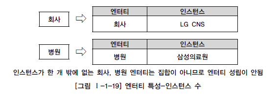
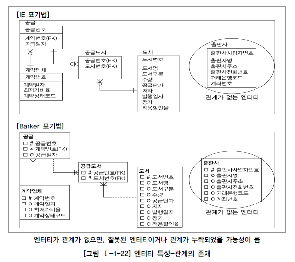

# 엔터티

## 1. 엔터티의 개념

데이터 모델을 이해할 때 가장 명확하게 이해해야 하는 개념 중에 하나가 바로 엔터티(Entity)이다. 이것은 우리말로 실체, 객체라고 번역하기도 하는데 실무적으로 엔터티라는 외래어를 많이 사용하기 때문에 본 가이드에서는 엔터티라는 용어를 그대로 사용하기로 한다.

엔터티에 대해서 데이터 모델과 데이터베이스에 권위자가 정의한 사항은 다음과 같다.

- 변별할 수 있는 사물 - Peter Chen (1976) -
- 데이터베이스 내에서 변별 가능한 객체 - C.J Date (1986) -
- 정보를 저장할 수 있는 어떤 것 - James Martin (1989) -
- 정보가 저장될 수 있는 사람, 장소, 물건, 사건 그리고 개념 등 - Thomas Bruce (1992) -

위 정의들의 공통점은 다음과 같다.

- 엔터티는 사람, 장소, 물건, 사건, 개념 등의 명사에 해당한다.
- 엔터티는 업무상 관리가 필요한 관심사에 해당한다.
- 엔터티는 저장이 되기 위한 어떤 것(Thing)이다.

엔터티란 “업무에 필요하고 유용한 정보를 저장하고 관리하기 위한 집합적인 것(Thing)”으로 설명할 수 있다. 또는, 엔터티는 업무 활동상 지속적인 관심을 가지고 있어야 하는 대상으로서 그 대상들 간에 동질성을 지닌 인스턴스들이나 그들이 행하는 행위의 집합으로 정의할 수 있다. 엔터티는 그 집합에 속하는 개체들의 특성을 설명할 수 있는 속성(Attribute)을 갖는데, 예를 들어 ‘학생’이라는 엔터티는 학번, 이름, 이수학점, 등록일자, 생일, 주소, 전화번호, 전공 등의 속성으로 특징지어질 수 있다. 이러한 속성 가운데에는 엔터티 인스턴스 전체가 공유할 수 있는 공통 속성도 있고, 엔터티 인스턴스 중 일부에만 해당하는 개별 속성도 있을 수 있다.
또한 엔터티는 인스턴스의 집합이라고 말할 수 있고, 반대로 인스턴스라는 것은 엔터티의 하나의 값에 해당한다고 정의할 수 있다. 예를 들어 과목은 수학, 영어, 국어가 존재할 수 있는데 수학, 영어, 국어는 각각이 과목이라는 엔터티의 인스턴스들이라고 할 수 있다. 또한 사건이라는 엔터티에는 사건번호2010-001, 2010-002 등의 사건이 인스턴스가 될 수 있다. 엔터티를 이해할 때 눈에 보이는(Tangible)한 것만 엔터티로 생각해서는 안되며 눈에 보이지 않는 개념 등에 대해서도 엔터티로서 인식을 할 수 있어야 한다. 실제 업무상에는 눈에 보이지 않는 것(Thing)이 엔터티로 도출되는 경우가 많기 때문에 더더욱 주의할 필요가 있다.

## 2. 엔터티와 인스턴스에 대한 내용과 표기법

엔터티를 표현하는 방법은 각각의 표기법에 따라 조금씩 차이는 있지만 대부분 사각형으로 표현된다. 다만 이 안에 표현되는 속성의 표현방법이 조금씩 다를 뿐이다. 엔터티와 엔터티간의 ERD를 그리면 [그림 Ⅰ-1-15]와 같이 표현할 수 있다.

[그림 Ⅰ-1-15]에서 과목, 강사, 사건은 엔터티에 해당하고 수학, 영어는 과목이라는 엔터티의 인스턴스이고 이춘식, 조시형은 강사라는 엔터티의 인스턴스이며 사건번호인 2010-001, 2010-002는 사건 엔터티에 대한 인스턴스에 해당한다.
※ 참고 : 오브젝트 모델링에는 클래스(Class)와 오브젝트(Object)라는 개념이 있다. 클래스는 여러 개의 오브젝트를 포함하는 오브젝트 깡통이다. 이러한 개념은 정보공학의 엔터티가 인스턴스를 포함하는 개념과 비슷하다.
위의 엔터티와 인스턴스를 표현하면 [그림 Ⅰ-1-16]과 같다.

## 3. 엔터티의 특징

엔터티는 다음과 같은 특징을 가지고 있으며 만약 도출된 엔터티가 다음의 성질을 만족하지 못하면 적절하지 않은 엔터티일 확률이 높다.

- 반드시 해당 업무에서 필요하고 관리하고자 하는 정보이어야 한다.(예. 환자, 토익의 응시횟수, …)
- 유일한 식별자에 의해 식별이 가능해야 한다.
- 영속적으로 존재하는 인스턴스의 집합이어야 한다.(‘한 개’가 아니라 ‘두 개 이상’)
- 엔터티는 업무 프로세스에 의해 이용되어야 한다.
- 엔터티는 반드시 속성이 있어야 한다.
- 엔터티는 다른 엔터티와 최소 한 개 이상의 관계가 있어야 한다.

### 가. 업무에서 필요로 하는 정보

엔터티 특징의 첫 번째는 반드시 시스템을 구축하고자 하는 업무에서 필요로 하고 관리하고자 하는 정보여야 한다는 점이다. 예를 들어 환자라는 엔터티는 의료시스템을 개발하는 병원에서는 반드시 필요한 엔터티이지만 일반회사에서 직원들이 병에 걸려 업무에 지장을 준다하더라도 이 정보를 그 회사의 정보로서 활용하지는 않을 것이다. 즉 시스템 구축 대상인 해당업무에서 그 엔터티를 필요로 하는가를 판단하는 것이 중요하다.

사람이 살아가면서 환자는 발생할 수 밖에 없다. 그러나 일반회사의 인사시스템에서는 비록 직원들에 의해서 환자가 발생이 되지만 인사업무 영역에서 환자를 별도로 관리할 필요가 없다. 다른 예로 병원에서는 환자가 해당 업무의 가장 중요한 엔터티가 되어 꼭 관리해야 할 엔터티가 된다. 이와 같이 엔터티를 도출할 때는 업무영역 내에서 관리할 필요가 있는지를 먼저 판단하는 것이 중요하다.

### 나. 식별이 가능해야 함

두 번째는 식별자(Unique Identifier)에 의해 식별이 가능해야 한다는 점이다. 어떤 엔터티이건 임의의 식별자(일련번호)를 부여하여 유일하게 만들 수는 있지만, 엔터티를 도출하는 경우에 각각의 업무적으로 의미를 가지는 인스턴스가 식별자에 의해 한 개씩만 존재하는지 검증해 보아야 한다.
유일한 식별자는 그 엔터티의 인스턴스만의 고유한 이름이다. 두 개 이상의 엔터티를 대변하면 그 식별자는 잘못 설계된 것이다. 예를 들어 직원을 구분할 수 있는 방법은 이름이나 사원번호가 될 수가 있다. 그러나 이름은 동명이인(同名異人)이 될 수 있으므로 유일하게 식별될 수 없다. 사원번호는 회사에 입사한 사람에게 고유하게 부여된 번호이므로 유일한 식별자가 될 수 있는 것이다.

### 다. 인스턴스의 집합

세 번째는 영속적으로 존재하는 인스턴스의 집합이 되어야 한다는 점이다. 엔터티의 특징 중 “한 개”가 아니라 “두 개 이상”이라는 집합개념은 매우 중요한 개념이다. 두 개 이상이라는 개념은 엔터티뿐만 아니라 엔터티간의 관계, 프로세스와의 관계 등 업무를 분석하고 설계하는 동안 설계자가 모든 업무에 대입해보고 검증해?러 개의 인스턴스를 포함한다.

### 라. 업무프로세스에 의해 이용

네 번째는 업무프로세스(Business Process)가 그 엔터티를 반드시 이용해야 한다는 점이다. 첫 번째 정의에서처럼 업무에서 반드시 필요하다고 생각하여 엔터티로 선정하였는데 업무프로세스에 의해 전혀 이용되지 않는다면 업무 분석이 정확하게 안되어 엔터티가 잘못 선정되거나 업무프로세스 도출이 적절하게 이루어지지 않았음을 의미한다. 이러한 경우는 데이터 모델링을 할 때 미처 발견하지 못하다가 프로세스 모델링을 하면서 데이터 모델과 검증을 하거나, 상관 모델링을 할 때 엔터티와 단위프로세스를 교차 점검하면서 문제점이 도출된다.

[그림 Ⅰ-1-20]과 같이 업무프로세스에 의해 CREATE, READ, UPDATE, DELETE 등이 발생하지 않는 고립된 엔터티의 경우는 엔터티를 제거하거나 아니면 누락된 프로세스가 존재하는지 살펴보고 해당 프로세스를 추가해야 한다.

### 마. 속성을 포함

다섯 번째는 엔터티에는 반드시 속성(Attributes)이 포함되어야 한다는 점이다. 속성을 포함하지 않고 엔터티의 이름만 가지고 있는 경우는 관계가 생략되어 있거나 업무 분석이 미진하여 속성정보가 누락되는 경우에 해당한다. 또한 주식별자만 존재하고 일반속성은 전혀 없는 경우도 마찬가지로 적절한 엔터티라고 할 수 없다. 단, 예외적으로 관계엔터티(Associative Entity)의 경우는 주식별자 속성만 가지고 있어도 엔터티로 인정한다.

### 바. 관계의 존재

여섯 번째는 엔터티는 다른 엔터티와 최소 한 개 이상의 관계가 존재해야 한다는 것이다. 기본적으로 엔터티가 도출되었다는 것은 해당 업무내에서 업무적인 연관성(존재적 연관성, 행위적 연관성)을 가지고 다른 엔터티와의 연관의 의미를 가지고 있음을 나타낸다. 그러나 관계가 설정되지 않은 엔터티의 도출은 부적절한 엔터티가 도출되었거나 아니면 다른 엔터티와 적절한 관계를 찾지 못했을 가능성이 크다.

단, 데이터 모델링을 하면서 관계를 생략하여 표현해야 하는 경우는 다음과 같은 통계성 엔터티 도출, 코드성 엔터티 도출, 시스템 처리시 내부 필요에 의한 엔터티 도출과 같은 경우이다.

1) 통계를 위한 엔터티의 경우는 업무진행 엔터티로부터 통계업무만(Read Only)을 위해 별도로 엔터티를 다시 정의하게 되므로 엔터티간의 관계가 생략되는 경우에 해당한다.
2) 코드를 위한 엔터티의 경우 너무 많은 엔터티와 엔터티간의 관계 설정으로 인해 데이터 모델의 읽기효율성(Readability)이 저하되어 도저히 모델링 작업을 진행할 수 없게 된다. 또한 코드성 엔터티는 물리적으로 테이블과 프로그램 구현 이후에도 외부키에 의한 참조무결성을 체크하기 위한 규칙을 데이터베이스 기능에 맡기지 않는 경우가 대부분이기 때문에 논리적으로나 물리적으로 관계를 설정할 이유가 없다.
3) 시스템 처리시 내부 필요에 의한 엔터티(예를 들어, 트랜잭션 로그 테이블 등)의 경우 트랜잭션이 업무적으로 연관된 테이블과 관계 설정이 필요하지만 이 역시 업무적인 필요가 아니고 시스템 내부적인 필요에 의해 생성된 엔터티이므로 관계를 생략하게 된다.

## 4. 엔터티의 분류

엔터티는 엔터티 자신의 성격에 의해 실체유형에 따라 구분하거나 업무를 구성하는 모습에 따라 구분이 되는 발생시점에 의해 분류해 볼 수 있다.

### 가. 유무(有無)형에 따른 분류

일반적으로 엔터티는 유무형에 따라 유형엔터티, 개념엔터티, 사건엔터티로 구분된다.
유형엔터티(Tangible Entity)는 물리적인 형태가 있고 안정적이며 지속적으로 활용되는 엔터티로 업무로부터 엔터티를 구분하기가 가장 용이하다. 예를 들면, 사원, 물품, 강사 등이 이에 해당된다. 개념엔터티(Conceptual Entity)는 물리적인 형태는 존재하지 않고 관리해야 할 개념적 정보로 구분이 되는 엔터티로 조직, 보험상품 등이 이에 해당된다.
사건 엔터티(Event Entity)는 업무를 수행함에 따라 발생되는 엔터티로서 비교적 발생량이 많으며 각종 통계자료에 이용될 수 있다. 주문, 청구, 미납 등이 이에 해당된다.

### 나. 발생시점(發生時點)에 따른 분류

엔터티의 발생시점에 따라 기본/키엔터티(Fundamental Entity, Key Entity), 중심엔터티(Main Entity), 행위엔터티(Active Entity)로 구분할 수 있다.

1) 기본엔터티
기본엔터티란 그 업무에 원래 존재하는 정보로서 다른 엔터티와 관계에 의해 생성되지 않고 독립적으로 생성이 가능하고 자신은 타 엔터티의 부모의 역할을 하게 된다. 다른 엔터티로부터 주식별자를 상속받지 않고 자신의 고유한 주식별자를 가지게 된다. 예를 들어 사원, 부서, 고객, 상품, 자재 등이 기본엔터티가 될 수 있다.

2) 중심엔터티
중심엔터티란 기본엔터티로부터 발생되고 그 업무에 있어서 중심적인 역할을 한다. 데이터의 양이 많이 발생되고 다른 엔터티와의 관계를 통해 많은 행위엔터티를 생성한다. 예를 들어 계약, 사고, 예금원장, 청구, 주문, 매출 등이 될 수 있다.

3) 행위엔터티
행위엔터티는 두 개 이상의 부모엔터티로부터 발생되고 자주 내용이 바뀌거나 데이터량이 증가된다. 분석초기 단계에서는 잘 나타나지 않으며 상세 설계단계나 프로세스와 상관모델링을 진행하면서 도출될 수 있다. 예를 들어 주문목록, 사원변경이력 등이 포함된다.

### 다. 엔터티 분류 방법의 예

[그림 Ⅰ-1-23]은 두 가지 엔터티 분류 방법에 대한 예를 나타낸 것이다.

이 밖에도 엔터티가 스스로 생성될 수 있는지 여부에 따라 독립엔터티인지 의존엔터티인지를 구분할 수도 있다.

## 5. 엔터티의 명명

엔터티를 명명하는 일반적인 기준은 용어를 사용하는 모든 표기법이 다 그렇듯이 첫 번째는 가능하면 현업업무에서 사용하는 용어를 사용한다. 두 번째는 가능하면 약어를 사용하지 않는다. 세 번째는 단수명사를 사용한다. 네 번째는 모든 엔터티에서 유일하게 이름이 부여되어야 한다. 다섯 번째는 엔터티 생성의미대로 이름을 부여한다.
첫 번째에서 네 번째에 해당하는 원칙은 대체적으로 잘 지켜진다. 그러나 다섯 번째 원칙인 “엔터티 생성의미대로 이름을 부여한다.”에 대해서는 적절하지 못한 엔터티명이 부여되는 경우가 빈번하게 발생한다. 중심엔터티에서도 간혹 적절하지 못한 엔터티명을 사용한 경우가 발생되고 행위엔터티의 경우에는 꽤 많은 경우에 적절하지 못한 엔터티명을 사용하는 경우가 발생된다. 예를 들어, 고객이 어떤 제품? 주문목록이라고도 할 수 있고 고객제품이라고 할 수 있다. 만약 고객제품이라고 하면 ‘고객이 주문한 제품’인지 아니면 ‘고객의 제품’인지 의미가 애매모호해질 수 있게 된다. 엔터티의 이름을 업무목적에 따라 생성되는 자연스러운 이름을 부여해야 하는데 이와 상관없이 임의로 이름을 부여하게 되면 프로젝트에서는 커뮤니케이션 오류로 인해 문제를 야기할 수 있게 된다.