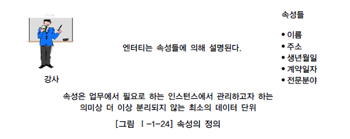

# 속성

## 1. 속성 (Attribute)의 개념

속성이란 사전적인 의미로는 사물(事物)의 성질, 특징 또는 본질적인 성질, 그것이 없다면 실체를 생각할 수 없는 것으로 정의할 수 있다. 본질적 속성이란 어떤 사물 또는 개념에 없어서는 안 될 징표(徵表)의 전부이다. 이 징표는 사물이나 개념이 어떤 것인지를 나타내고 그것을 다른 것과 구별하는 성질이라고 할 수 있다.
이런 사전적인 정의 이외에 데이터 모델링 관점에서 속성을 정의하자면, “업무에서 필요로 하는 인스턴스로 관리하고자 하는 의미상 더 이상 분리되지 않는 최소의 데이터 단위”로 정의할 수 있다. 업무상 관리하기 위한 최소의 의미 단위로 생각할 수 있고, 이것은 엔터티에서 한 분야를 담당하고 있다.

속성의 정의를 정리해 보면 다음과 같다.

- 업무에서 필요로 한다.
- 의미상 더 이상 분리되지 않는다.
- 엔터티를 설명하고 인스턴스의 구성요소가 된다.

의미상 더 이상 분리되지 않는다는 특징을 살펴보면 다음과 같다. 예를 들어 생년월일은 하나로서 의미가 있다. 만약 이것을 생년, 생월, 생일로 구분한다면 이것은 사실상 하나의 속성을 관리목적에 따라 구분했다라고 이해할 수 있다. 이러한 이유로 인해 S/W비용을 산정하는 기능점수(Function Point)를 산정할 때 이렇게 분리된 속성은 하나의 속성(DET)으로 계산하게 된다. 그러나 만약 서로 관련이 없는 이름, 주소를 하나의 속성 ‘이름주소’로 정의하면 어떻게 될까? 이것은 하나의 속성의 두 개의 의미를 갖기 때문에 기본속성으로서 성립하지 않게 된다. 이렇게 정리된 속성은 그냥 값의 의미로서 속성보다는 내역(Description)으로서 속성으로 예를 들어 인적사항이라는 속성으로 정의하여 관리할 수는 있다.

## 2. 엔터티, 인스턴스와 속성, 속성값에 대한 내용과 표기법

### 가. 엔터티, 인스턴스, 속성, 속성값의 관계

엔터티에는 두 개 이상의 인스턴스가 존재하고 각각의 엔터티에는 고유의 성격을 표현하는 속성정보를 두 개 이상 갖는다. 업무에서는 엔터티를 구성하는 특징이 무엇인지 또한 각각의 인스턴스들은 어떤 성격의 데이터로 구성되는지를 파악하는 작업이 필요하다. 분석단계에서 엔터티 내에 존재하는 여러 개의 인스턴스가 가지는 동일한 성격은 무엇인지를 파악하고 이에 이름을 부여하여 엔터티의 속성으로 기술하는 작업이 필요하다. 예를 들면 사원은 이름, 주소, 전화번호, 직책 등을 가질 수 있다. 사원이라는 엔터티에 속한 인스턴스들의 성격을 구체적으로 나타내는 항목이 바로 속성이다. 각각의 인스턴스는 속성의 집합으로 설명될 수 있다. 하나의 속성은 하나의 인스턴스에만 존재할 수 있다. 속성은 관계로 기술될 수 없고 자신이 속성을 가질 수도 없다.
엔터티 내에 있는 하나의 인스턴스는 각각의 속성들의 대해 한 개의 속성값만을 가질 수 있다. 예를 들면 사원의 이름은 홍길동이고 주소는 서울시 강남구이며, 전화번호는 123-4567, 직책은 대리이다. 이름, 주소, 전화번호, 직책은 속성이고 홍길동, 서울시 강남구, 123-4567, 대리는 속성값이다. 그러므로 속성값은 각각의 엔터티가 가지는 속성들의 구체적인 내용이라 할 수 있다.

엔터티, 인스턴스, 속성, 속성값에 대한 관계를 분석하면 다음과 같은 결과를 얻을 수 있다.

- 한 개의 엔터티는 두 개 이상의 인스턴스의 집합이어야 한다.
- 한 개의 엔터티는 두 개 이상의 속성을 갖는다.
- 한 개의 속성은 한 개의 속성값을 갖는다.

속성은 엔터티에 속한 엔터티에 대한 자세하고 구체적인 정보를 나타내며 각각의 속성은 구체적인 값을 갖게 된다.
예를 들어 사원이라는 엔터티에는 홍길동이라는 사람(엔터티)이 있을 수 있다. 홍길동이라는 사람의 이름은 홍길동이고 주소는 서울시 강서구이며 생년월일 1967년 12월 31일이다. 여기에 이름, 주소, 생년월일과 같은 각각의 값을 대표하는 이름들을 속성이라 하고 홍길동, 서울시 강서구, 1967년 12월 31일과 같이 각각의 이름에 대한 구체적인 값을 속성 값(VALUE)이라고 한다.

### 나. 속성의 표기법

속성의 표기법은 엔터티 내에 이름을 포함하여 표현하면 된다.

## 3. 속성의 특징

속성은 다음과 같은 특징을 가지고 있으며 만약 도출된 속성이 다음의 성질을 만족하지 못하면 적절하지 않은 속성일 확률이 높다.

- 엔터티와 마찬가지로 반드시 해당 업무에서 필요하고 관리하고자 하는 정보이어야 한다. (예, 강사의 교재이름)
- 정규화 이론에 근간하여 정해진 주식별자에 함수적 종속성을 가져야 한다.
- 하나의 속성에는 한 개의 값만을 가진다. 하나의 속성에 여러 개의 값이 있는 다중값일 경우 별도의 엔터티를 이용하여 분리한다.

## 4. 속성의 분류

### 가. 속성의 특성에 따른 분류

속성은 업무분석을 통해 바로 정의한 속성을 기본속성(Basic Attribute), 원래 업무상 존재하지는 않지만 설계를 하면서 도출해내는 속성을 설계속성(Designed Attribute), 다른 속성으로부터 계산이나 변형이 되어 생성되는 속성을 파생속성(Derived Attribute)이라고 한다.

1) 기본속성
기본 속성은 업무로부터 추출한 모든 속성이 여기에 해당하며 엔터티에 가장 일반적이고 많은 속성을 차지한다. 코드성 데이터, 엔터티를 식별하기 위해 부여된 일련번호, 그리고 다른 속성을 계산하거나 영향을 받아 생성된 속성을 제외한 모든 속성은 기본속성이다. 주의해야 할 것은 업무로부터 분석한 속성이라도 이미 업무상 코드로 정의한 속성이 많다는 것이다. 이러한 경우도 속성의 값이 원래 속성을 나타내지 못하므로 기본속성이 되지 않는다.

2) 설계속성
설계속성은 업무상 필요한 데이터 이외에 데이터 모델링을 위해, 업무를 규칙화하기 위해 속성을 새로 만들거나 변형하여 정의하는 속성이다. 대개 코드성 속성은 원래 속성을 업무상 필요에 의해 변형하여 만든 설계속성이고 일련번호와 같은 속성은 단일(Unique)한 식별자를 부여하기 위해 모델 상에서 새로 정의하는 설계속성이다.

3) 파생속성
파생속성은 다른 속성에 영향을 받아 발생하는 속성으로서 보통 계산된 값들이 이에 해당된다. 다른 속성에 영향을 받기 때문에 프로세스 설계 시 데이터 정합성을 유지하기 위해 유의해야 할 점이 많으며 가급적 파생속성을 적게 정의하는 것이 좋다.

이러한 분류 방식은 프로젝트에서 엄격하게 분류하여 속성정의서에 나열하는 경우도 있다?? 속성의 정의서의 기록함으로써 향후 속성 값에 대한 검증 시 활용되기도 한다. 파생속성은 그 속성이 가지고 있는 계산방법에 대해서 반드시 어떤 엔터티에 어떤 속성에 의해 영향을 받는지 정의가 되어야 한다.
예를 들어 ‘이자’라는 속성이 존재한다고 하면 이자는 원금이 1,000원이고 예치기간이 5개월이며 이자율이 5.0%에서 계산되는 속성값이다. 그렇다면 이자는 원금이 1,000원에서 2,000원으로 변하여도 영향을 받고 예치기간이 5개월에서 7개월로 증가하여도 값이 변하며 이자율이 5.0%에서 6.0%로 되어도 이자속성이 가지는 값은 변할 것이다. 한 번 값이 변해도 또 다시 영향을 미치는 속성값의 조건이 변한다면 이자의 값은 지속적으로 변경될 것이다.
이와 같이 타 속성에 의해 지속적으로 영향을 받아 자신의 값이 변하는 성질을 가지고 있는 속성이 파생속성이다. 파생속성은 될 수 있으면 꼭 필요한 경우에만 정의하도록 하여 업무로직이 속성내부에 숨지 않도록 하는 것이 좋다. 파생속성을 정의한 경우는 속성정의서에 파생속성이 가지는 업무로직을 기술하여 데이터의 정합성이 유지될 수 있도록 해야 하며 그 파생속성에 원인이 되는 속성을 이용하는 모든 애플리케이션에서는 값을 생성하고, 수정하고 삭제할 때 파생속성도 함께 고려해 주어야 한다. 파생속성은 일반 엔터티에서는 많이 사용하지 않으며 통계관련 엔터티나 배치 작업이 수행되면서 발생되는 엔터티의 경우 많이 이용된다.

### 나. 엔터티 구성방식에 따른 분류

엔터티를 식별할 수 있는 속성을 PK(Primary Key)속성, 다른 엔터티와의 관계에서 포함된 속성을 FK(Foreign Key)속성, 엔터티에 포함되어 있고 PK, FK에 포함되지 않은 속성을 일반속성이라 한다.

또한 속성은 그 안에 세부 의미를 쪼갤 수 있는지에 따라 단순형 혹은 복합형으로 분류할 수 있다. 예를 들면 주소 속성은 시, 구, 동, 번지 등과 같은 여러 세부 속성들로 구성될 수 있는데 이를 복합 속성(Composite Attribute)이라 한다. 또한 나이, 성별 등의 속성은 더 이상 다른 속성들로 구성될 수 없는 단순한 속성이므로 단순 속성(Simple Attribute)이라 한다.
일반적으로 속성은 하나의 값을 가지고 있으나, 그 안에 동일한 성질의 여러 개의 값이 나타나는 경우가 있다. 이 때 속성 하나에 한 개의 값을 가지는 경우를 단일값(Single Value), 그리고 여러 개의 값을 가지는 경우를 다중값(Multi Value) 속성이라 한다. 주민등록번호와 같은 속성은 반드시 하나의 값만 존재하므로 이 속성은 단일값 속성(Single-Valued Attribute)이라 하고, 어떤 사람의 전화번호와 같은 속성은 집, 휴대전화, 회사 전화번호와 같이 여러 개의 값을 가질 수 있다. 자동차의 색상 속성도 차 지붕, 차체, 외부의 색이 다를 수 있다. 이런 속성을 다중값 속성(Multi-Valued Attribute)이라 한다. 다중값 속성의 경우 하나의 엔터티에 포함될 수 없으므로 1차 정규화를 하거나, 아니면 별도의 엔터티를 만들어 관계로 연결해야 한다.

## 5. 도메인(Domain)

각 속성은 가질 수 있는 값의 범위가 있는데 이를 그 속성의 도메인(Domain)이라 한다. 예를 들면 학생이라는 엔터티가 있을 때 학점이라는 속성의 도메인은 0.0에서 4.0 사이의 실수 값이며 주소라는 속성은 길이가 20자리 이내인 문자열로 정의할 수 있다. 여기서 물론 각 속성은 도메인 이외의 값을 갖지 못한다. 따라서 도메인을 좀더 이해하기 쉽게 정리하면, 엔터티 내에서 속성에 대한 데이터타입과 크기 그리고 제약사항을 지정하는 것이라 할 수 있다.

## 6. 속성의 명명(Naming)

C/S(Client/Server) 환경이든 Web 환경이든 속성명이 곧 사용자 인터페이스(User Interface)에 나타나기 때문에 업무와 직결되는 항목이다. 그래서 속성 이름을 정확하게 부여하고 용어의 혼란을 없애기 위해 용어사전이라는 업무사전을 프로젝트에 사용하게 된다. 또한 각 속성이 가지는 값의 종류와 범위를 명확하게 하기 위해 도메인정의를 미리 하여 정의하여 용어사전과 같이 사용한다. 용어사전과 도메인정의를 같이 사용하여 프로젝트를 진행할 경우 용어적 표준과 데이터타입의 일관성을 확보할 수 있게 된다.
속성명을 부여하는 원칙은 [그림 Ⅰ-1-29]와 같다.

- 속성의 이름을 부여할 때는 현업에서 사용하는 이름을 부여하는 것이 가장 중요하다. 아무리 일반적인 용어라 할지라도 그 업무에서 사용되지 않으면 속성의 명칭으로 사용하지 않는 것이 좋다.
- 일반적으로는 서술식의 속성명은 사용하지 말아야 한다. 명사형을 이용하고 수식어가 많이 붙지 않도록 유의하여 작성한다. 수식어가 많으면 의미파악이 힘들고 상세 설계단계에서 물리속성으로 전환하는데 명확한 의미파악이 어렵게 된다. 소유격도 사용하지 않는다.
- 공용화되지 않은 업무에서 사용하지 않는 약어는 사용하지 않는 것이 좋다. 지나치게 약어를 많이 사용하면 업무분석자 내에서도 의사소통이 제약을 받으며 시스템을 운영할 때도 많은 불편을 초래할 수 있다.
- 가능하면 모든 속성의 이름은 유일하게 작성하는 것이 좋다. 물론 대량의 속성을 정의하는 경우 유일하게 작성하는 것이 어려울 수도 있지만 이렇게 하는 것이 나중에 데이터에 대한 흐름을 파악하고 데이터의 정합성을 유지하는데 큰 도움이 된다. 또한 반정규화(테이블통합, 분리, 칼럼의 중복 등)를 적용할 때 속성명의 충돌(Conflict)을 해결하여 안정적으로 반정규화를 적용할 수 있게 된다.

