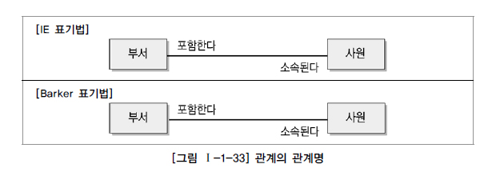
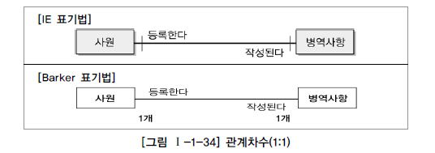

# 관계

## 1. 관계의 개념

### 가. 관계의 정의

관계(Relationship)를 사전적으로 정의하면 상호 연관성이 있는 상태로 말할 수 있다. 이것을 데이터 모델에 대입하여 정의해 보면, “엔터티의 인스턴스 사이의 논리적인 연관성으로서 존재의 형태로서나 행위로서 서로에게 연관성이 부여된 상태”라고 할 수 있다. 관계는 엔터티와 엔터티 간 연관성을 표현하기 때문에 엔터티의 정의에 따라 영향을 받기도 하고, 속성 정의 및 관계 정의에 따라서도 다양하게 변할 수 있다.

### 나. 관계의 패어링

유의해야할 점은 관계는 엔터티 안에 인스턴스가 개별적으로 관계를 가지는 것(패어링)이고 이것의 집합을 관계로 표현한다는 것이다. 따라서 개별 인스턴스가 각각 다른 종류의 관계를 가지고 있다면 두 엔터티 사이에 두 개 이상의 관계가 형성될 수 있다.
각각의 엔터티의 인스턴스들은 자신이 관련된 인스턴스들과 관계의 어커런스로 참여하는 형태를 관계 패어링(Relationship Paring)이라 한다. [그림 Ⅰ-1-31]에서는 강사인 정성철은 이춘식과 황종하에게 강의를 하는 형태로 관계가 표현되어 있고 조시형은 황종하에게 강의를 하는 형태로 되어 있다. 이와 같이 엔터티내에 인스턴스와 인스턴스사이에 관계가 설정되어 있는 어커런스를 관계 패어링이라고 한다. 엔터티는 인스턴스의 집합을 논리적으로 표현하였다면 관계는 관계 패어링의 집합을 논리적으로 표현한 것이다.
최초의 ERD(Chen 모델)에서 관계는 속성을 가질 수 있었으나 요즘 ERD에서는 관계를 위해 속성을 도출하지는 않는다. 관계의 표현에는 이항 관계(Binary Relationship), 삼항 관계(Ternary Relationship), n항 관계가 존재할 수 있는데 실제에 있어서 삼항 관계 이상은 잘 나타나지 않는다.

## 2. 관계의 분류

관계가 존재에 의한 관계와 행위에 의한 관계로 구분될 수 있는 것은 관계를 연결함에 있어 어떤 목적으로 연결되었느냐에 따라 분류하기 때문이다.

[그림 Ⅰ-1-32]에서 왼쪽 편에 있는 모델은 황경빈이란 사원이 DB팀에 소속되어 있는 상태를 나타낸다. ‘소속된다’라는 의미는 행위에 따른 이벤트에 의해 발생되는 의미가 아니고 그냥 황경빈사원이 DB팀에 소속되어 있기 때문에 나타나는 즉 존재의 형태에 의해 관계가 형성되어 있는 것이다.
반면에 오른편에 있는 김경재 고객은 ‘주문한다’라는 행위를 하여 CTA201이라는 주문번호를 생성하였다. 주문 엔터티의 CTA201 주문번호는 김경재 고객이 ‘주문한다’라는 행위에 의해 발생되었기 때문에 두 엔터티 사이의 관계는 행위에 의한 관계가 되는 것이다.
UML(Unified Modeling Language)에는 클래스다이어그램의 관계중 연관관계(Association)와 의존관계(Dependency)가 있다. 이 둘의 차이는 연관관계는 항상 이용하는 관계로 존재적 관계에 해당하고 의존관계는 상대방 클래스의 행위에 의해 관계가 형성될 때 구분하여 표현한다는 것이다. 즉, ERD에서는 존재적 관계와 행위에 의한 관계를 구분하지 않고 표현했다면 클래스다이어그램에서는 이것을 구분하여 연관관계와 의존관계로 표현하고 있는 것이다. 연관관계는 표현방법이 실선으로 표현되고 소스코드에서 멤버변수로 선언하여 사용하게 하고, 의존관계는 점선으로 표현되고 행위를 나타내는 코드인 Operation(Method)에서 파라미터 등으로 이용할 수 있도록 되어 있다.

## 3. 관계의 표기법

관계에서는 표기법이 상당히 복잡하고 여러 가지 의미를 가지고 있다. 다음 3가지 개념과 함께 표기법을 이해할 필요가 있다.

- 관계명(Membership) : 관계의 이름
- 관계차수(Cardinality) : 1:1, 1:M, M:N
- 관계선택사양(Optionality) : 필수관계, 선택관계

### 가. 관계명(Membership)

관계명은 엔터티가 관계에 참여하는 형태를 지칭한다. 각각의 관계는 두 개의 관계명을 가지고 있다. 또한 각각의 관계명에 의해 두 가지의 관점으로 표현될 수 있다.

엔터티에서 관계가 시작되는 편을 관계시작점(The Beginning)이라고 부르고 받는 편을 관계끝점(The End)이라고 부른다. 관계 시작점과 끝점 모두 관계이름을 가져야 하며 참여자의 관점에 따라 관계이름이 능동적(Active)이거나 수동적(Passive)으로 명명된다. 관계명은 다음과 같은 명명규칙에 따라 작성해야 한다.

- 애매한 동사를 피한다. 예를 들면 ‘관계된다’, ‘관련이 있다’, ‘이다’, ‘한다’ 등은 구체적이지 않아 어떤 행위가 있는지 또는 두 참여자간 어떤 상태가 존재하는지 파악할 수 없다.
- 현재형으로 표현한다. 예를 들면 ‘수강을 신청했다’, ‘강의를 할 것이다’라는 식으로 표현해서는 안된다. ‘수강 신청한다’, ‘강의를 한다’로 표현해야 한다.

### 나. 관계차수(Degree/Cardinality)

두 개의 엔터티간 관계에서 참여자의 수를 표현하는 것을 관계차수(Cardinality)라고 한다. 가장 일반적인 관계차수 표현방법은 1:M, 1:1, M:N이다. 가장 중요하게 고려해야 할 사항은 한 개의 관계가 존재하느냐 아니면 두 개 이상의 멤버쉽이 존재하는지를 파악하는 것이 중요하다.
관계차수를 표시하는 방법은 여러 가지 방법이 있지만 Crow’s Foot 모델에서는 선을 이용하여 표현한다. 한 개가 참여하는 경우는 실선을 그대로 유지하고 다수가 참여한 경우는(Many) 까마귀발과 같은 모양으로 그려준다.

1) 1:1(ONE TO ONE) 관계를 표시하는 방법

관계에 참여하는 각각의 엔터티는 관계를 맺는 다른 엔터티의 엔터티에 대해 단지 하나의 관계만을 가지고 있다.

2) 1:M(ONE TO MANY) 관계를 표시하는 방법

관계에 참여하는 각각의 엔터티는 관계를 맺는 다른 엔터티의 엔터티에 대해 하나나 그 이상의 수와 관계를 가지고 있다. 그러나 반대의 방향은 단지 하나만의 관계를 가지고 있다.

3) M:M(MANY TO MANY) 관계를 표시하는 방법

관계엔터티의 엔터티에 대해 하나나 그 이상의 수와 관계를 가지고 있다. 반대의 방향도 동일하게 관계에 참여하는 각각의 엔터티는 관계를 맺는 다른 엔터티의 엔터티에 대해 하나 또는 그 이상의 수와 관계를 가지고 있다. 이렇게 M:N 관계로 표현된 데이터 모델은 이후에 두 개의 주식별자를 상속받은 관계엔터티를 이용하여 3개의 엔터티로 구분하여 표현한다.

### 다. 관계선택사양(Optionality)

요즈음 웬만한 대도시에는 지하철이 많이 운행된다. 만약 지하철 문이 닫히지 않았는데 지하철이 떠난다면 무슨 일이 발생할까? 아마도 어떤 사람은 머리만 지하철 안에 들어오고 몸은 밖에 있는 채로 끌려갈 것이고, 또 어떤 사람은 가방만 지하철에 실어 보내는 사람도 있을 것이고, 지하철과 승강기 사이에 몸이 낄 수도 있을 것이다. 물론 지하철운행과 지하철문의 관계는 이렇게 설계되지 않아 위와 같은 어처구니없는 일은 발생하지 않을 것이다. “반드시 지하철의 문이 닫혀야만 지하철은 출발한다.” 지하철출발과 지하철문닫힘은 필수(Mandatory)적으로 연결 관계가 있는 것이다. 이와 같은 것이 데이터 모델의 관계에서는 필수참여관계(Mandatory)가 된다.
또 지하철 안내방송시스템의 예를 들어보자. 지하철의 출발을 알리는 안내방송은 지하철의 출발과 상관없이 방송해도 아무런 문제가 발생하지 않는다. 물론 정해진 시간에 방송을 하면 승객에게 정보로서 유익하겠지만 꼭 그렇게 할 필요는 없다. 그래서 가끔씩 시스템의 녹음된 여성의 목소리가 아닌 시끄러운 남자 기사가 방송을 하는 경우가 있다. 안내방송시스템이 고장이 나도 지하철운행에는 별로 영향을 주지 않는다. 방송시점도 조금씩 다르게 나타나도 지하철이 출발하는 것과는 밀접하게 연관되지 않는다. 이와 같이 지하철의 출발과 지하철방송과는 정보로서 관련은 있지만 서로가 필수적인(Mandatory) 관계는 아닌 선택적인 관계(Optional)가 되는 것이다.

이와 같은 것이 데이터 모델 관계에서는 선택참여관계(Optional)가 된다. 참여하는 엔터티가 항상 참여하는지 아니면 참여할 수도 있는지를 나타내는 방법이 필수(Mandatory Membership)와 선택참여(Optional Membership)이다.
필수참여는 참여하는 모든 참여자가 반드시 관계를 가지는, 타 엔터티의 참여자와 연결이 되어야 하는 관계이다. 예를 들면 주문서는 반드시 주문목록을 가져야 하며 주문목록이 없는 주문서는 의미가 없으므로 주문서와 주문목록은 필수참여관계가 되는 것이다. 반대로 목록은 주문이 될 수도 있고 주문이 되지 않은 목록이 있을 수도 있으므로 목록과 주문목록과의 관계는 선택참여(Optional Membership)가 되는 것이다. 선택참여된 항목은 물리속성에서 Foreign Key로 연결될 경우 Null을 허용할 수 있는 항목이 된다. 만약 선택참여로 지정해야 할 관계를 필수참여로 잘못 지정하면 애플리케이션에서 데이터가 발생할 때 반드시 한 개의 트랜잭션으로 제어해야 하는 제약사항이 발생한다. 그러므로 설계단계에서 필수참여와 선택참여는 개발시점에 업무 로직과 직접적으로 관련된 부분이므로 반드시 고려되어야 한다.
선택참여관계는 ERD에서 관계를 나타내는 선에서 선택참여하는 엔터티 쪽을 원으로 표시한다. 필수참여는 아무런 표시를 하지 않는다.
만약 관계가 표시된 양쪽 엔터티에 모두 선택참여가 표시된다면, 즉 0:0(Zero to Zero)의 관계가 된다면 그 관계는 잘못될 확률이 많으므로 관계설정이 잘못되었는지를 검토해 보아야 한다.

관계선택사양은 관계를 통한 상대방과의 업무적인 제약조건을 표현하는 것으로서 간단하면서 아주 중요한 표기법이다. 이것을 어떻게 설정했는지에 따라 참조무결성 제약조건의 규칙이 바뀌게 되므로 주의 깊게 모델링을 해야 한다.

## 4. 관계의 정의 및 읽는 방법

### 가. 관계 체크사항

두 개의 엔터티 사이에서 관계를 정의할 때 다음 사항을 체크해 보도록 한다.

- 두 개의 엔터티 사이에 관심있는 연관규칙이 존재하는가?
- 두 개의 엔터티 사이에 정보의 조합이 발생되는가?
- 업무기술서, 장표에 관계연결에 대한 규칙이 서술되어 있는가?
- 업무기술서, 장표에 관계연결을 가능하게 하는 동사(Verb)가 있는가?

### 나. 관계 읽기

데이터 모델을 읽는 방법은 먼저 관계에 참여하는 기준 엔터티를 하나 또는 각(Each)으로 읽고 대상 엔터티의 개수(하나, 하나 이상)를 읽고 관계선택사양과 관계명을 읽도록 한다.

- 기준(Source) 엔터티를 한 개(One) 또는 각(Each)으로 읽는다.
- 대상(Target) 엔터티의 관계참여도 즉 개수(하나, 하나 이상)를 읽는다.
- 관계선택사양과 관계명을 읽는다.

위의 관계를 정의를 한 사항에 대해서 뒷부분만 의문문으로 만들면 바로 관계를 도출하기 위한 질문 문장으로 만들 수 있다. 위의 질문을 업무를 분석하는 자기 스스로에게 질문하거나, 장표나 업무기술서 또는 업무를 잘 알고 있는 업무담당 고객과 대화를 하면서 관계를 완성해 갈 수 있다. 예를 들어, 주문과 제품과 관계를 질문하기 원할 때 “한 주문에 대해서 하나의 제품만을 주문합니까?”라고 할 수도 있고 또는 “한 제품은 하나의 주문에 대해서만 주문을 접수받을 수 있습니까?”라고 질문할 수 있다. 이러한 질문 방법은 엔터티간 관계설정뿐 아니라 업무의 흐름도 분석이 되는 실제 프로젝트에서 효과적인 방법이 된다.

