# 식별자

## 1. 식별자(Identifiers) 개념

엔터티는 인스턴스들의 집합이라고 하였다. 여러 개의 집합체를 담고 있는 하나의 통에서 각각을 구분할 수 있는 논리적인 이름이 있어야 한다. 이 구분자를 식별자(Identifier)라고 한다. 식별자란 하나의 엔터티에 구성되어 있는 여러 개의 속성 중에 엔터티를 대표할 수 있는 속성을 의미하며 하나의 엔터티는 반드시 하나의 유일한 식별자가 존재해야 한다. 보통 식별자와 키(Key)를 동일하게 생각하는 경우가 있는데 식별자라는 용어는 업무적으로 구분이 되는 정보로 생각할 수 있으므로 논리 데이터 모델링 단계에서 사용하고 키는 데이터베이스 테이블에 접근을 위한 매개체로서 물리 데이터 모델링 단계에서 사용한다.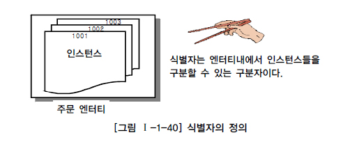

## 2. 식별자의 특징

주식별자인지 아니면 외부식별자인지 등에 따라 특성이 다소 차이가 있다. 먼저 주식별자일 경우 다음과 같은 특징을 갖는다.

- 주식별자에 의해 엔터티내에 모든 인스턴스들이 유일하게 구분되어야 한다.
- 주식별자를 구성하는 속성의 수는 유일성을 만족하는 최소의 수가 되어야 한다.
- 지정된 주식별자의 값은 자주 변하지 않는 것이어야 한다.
- 주식별자가 지정이 되면 반드시 값이 들어와야 한다.

대체식별자의 특징은 주식별자의 특징과 일치하지만 외부식별자는 별도의 특징을 가지고 있다. 외부식별자의 경우 주식별자 특징과 일치하지 않으며 참조무결성 제약조건(Referential Integrity)에 따른 특징을 가지고 있다.

## 3. 식별자 분류 및 표기법

### 가. 식별자 분류

식별자의 종류는 자신의 엔터티 내에서 대표성을 가지는가에 따라 주식별자(Primary Identifier)와 보조식별자(Alternate Identifier)로 구분하고 엔터티 내에서 스스로 생성되었는지 여부에 따라 내부식별자와 외부식별자(Foreign Identifier)로 구분할 수 있다. 또한 단일 속성으로 식별이 되는가에 따라 단일식별자(Single Identifier)와 복합식별자(Composit Identifier)로 구분할 수 있다. 원래 업무적으로 의미가 있던 식별자 속성을 대체하여 일련번호와 같이 새롭게 만든 식별자를 구분하기 위해 본질식별자와 인조식별자로도 구분할 수 있다.

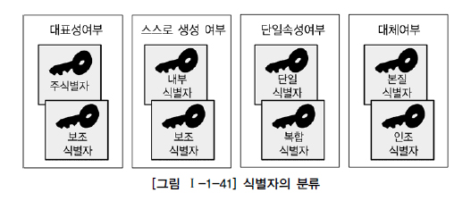

[그림 Ⅰ-1-41]의 식별자에 대한 분류체계를 좀 더 상세하게 설명하면 [표 Ⅰ-1-8]과 같이 표현할 수 있다.

### 나. 식별자 표기법

식별자에 대한 위의 분류방법을 데이터 모델에서 표현하면 [그림 Ⅰ-1-42]와 같이 분류하여 설명할 수 있다.

## 4. 주식별자 도출기준

데이터 모델링 작업에서 중요한 작업 중의 하나가 주식별자 도출작업이다. 주식별자를 도출하기 위한 기준을 정리하면 다음과 같다.

- 해당 업무에서 자주 이용되는 속성을 주식별자로 지정한다.
- 명칭, 내역 등과 같이 이름으로 기술되는 것들은 가능하면 주식별자로 지정하지 않는다.
- 복합으로 주식별자로 구성할 경우 너무 많은 속성이 포함되지 않도록 한다.

### 가. 해당 업무에서 자주 이용되는 속성을 주식별자로 지정하도록 함

예를 들면, 직원이라는 엔터티가 있을 때 유일하게 식별가능한 속성으로는 주민등록번호와 사원번호가 존재할 수 있다. 사원번호가 그 회사에서 직원을 관리할 때 흔히 사용되므로 사원번호를 주식별자로 지정하고 주민등록번호는 보조식별자로 사용할 수 있다.

### 나. 명칭, 내역 등과 같이 이름으로 기술되는 것은 피함

명칭, 내역 등과 같이 이름으로 기술되는 것들은 가능하면 주식별자로 지정하지 않도록 한다. 예를 들어, 한 회사에 부서이름이 100개가 있다고 할 때, 각각의 부서이름은 유일하게 구별될 수 있다고 하여 부서이름을 주식별자로 지정하지 않도록 해야 한다. 만약 부서이름을 주식별자로 선정하면 물리데이터베이스로 테이블을 생성하여 데이터를 읽을 때 항상 부서이름이 WHERE 조건절에 기술되는 현상이 발생된다. 부서이름은 많은 경우 20자 이상이 될 수 있으므로 조건절에 정확한 부서이름을 기술하기는 쉬운 일이 아니다.
이와 같이 명칭이나 내역이 있고 인스턴스들을 식별할 수 있는 다른 구분자가 존재하지 않을 경우는 새로운 식별자를 생성하도록 한다. 보통 일련번호와 코드를 많이 사용한다.

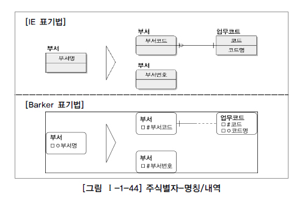

부서명과 같은 경우는 부서코드를 부여하여 코드엔터티에 등록한 후 부서코드로 주식별자를 지정하는 방법과 부서일련번호(부서번호)를 주식별자로 하고 부서명은 보조식별자로 활용하는 두 가지 방법이 있다.

### 다. 속성의 수가 많아지지 않도록 함

주식별자로 선정하기 위한 속성이 복합으로 구성되어 주식별자가 될 수 있을 때 가능하면 주식별자 선정하기 위한 속성의 수가 많지 않도록 해야 한다. 그러나 만약 주식별자로 선정된 속성들이 자신이 가지고 있는 자식엔터티로부터 손자엔터티, 그리고 증손자엔터티까지 계속해서 상속이 되는 속성이고 복잡한 데이터 모델이 구현되어 물리데이터베이스에서 조인으로 인한 성능저하가 예상되는 모습을 가지고 있다면 속성의 반정규화 측면에서 하나의 테이블에 많은 속성이 있는 것이 인정될 수도 있다. 하지만 일반적으로 주식별자의 속성의 개수가 많다는 것(일반적으로 7~8개 이상)은 새로운 인조식별자(Artificial Identifier)를 생성하여 데이터 모델을 구성하는 것이 데이터 모델을 한층 더 단순하게 하고 애플리케이션을 개발할 때 조건절을 단순하게 할 수 있는 방법이 될 수 있다.

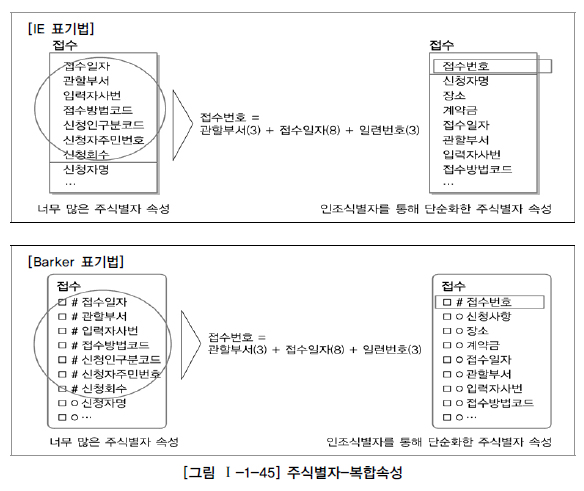

[그림 Ⅰ-1-45]는 왼편의 복잡한 주식별자를 임의의 주식별자를 생성하여 단순화한 예를 보여준다. 왼편 그림에서는 접수라는 엔터티에 어떤 부류의 사람이 특정접수방법에 의해 특정 날짜에 여러 번 신청하는 것을 관할부성에서 접수담당자가 입력한 대로 데이터가 식별될 수 있는 업무 규칙이 있는 경우이다. 접수의 주식별자가 접수일자, 관할부서, 입력자사번, 접수방법코드, 신청인구분코드, 신청자주민번호, 신청회수 등 7개 이상의 복잡한 속성을 가지고 있다. 이러한 모델의 경우 실제 테이블에 Primary Key는 7개가 생성될 것이고 만약 특정 신청인의 계약금 하나만 가져온다고 하더라도 다음과 같이 복잡한 SQL문장을 구사해야 한다.

SELECT 계약금 FROM 접수 WHERE 접수.접수일자 = ‘2010.07.15“ AND 접수.관할부서 = ‘1001’ AND 접수.입력자사번 = ‘AB45588' AND 접수.접수방법코드 = ‘E' AND 접수.신청인구분코드 = ‘01' AND 접수.신청인주민번호 = ‘7007171234567' AND 접수.신청횟수 = ‘1’

이렇게 된 SQL문장을 접수번호라고 하는 인조식별자로 대체했다고 하면 특정신청인의 계약금 조회는 다음과 같이 간단하게 할 수 있다.

SELECT 계약금 FROM 접수 WHERE 접수.접수일자 = ‘100120100715001“

만약 접수 엔터티가 자식과 손자엔터티를 가지고 있고 자식과 손자엔터티에 있는 데이터를 서로 조인하여 가져오고자 한다면 아무리 간단한 SQL문장이라도 쉽게 A4용지 한 페이지는 넘어갈 것이다. 이렇게 모델상에 표현하는 문장의 간편성뿐만 아니라 애플리케이션 구성에 있어서도 복잡한 소스구성을 피하기 위하여 과도한 복합키는 배제하도록 노력해야 한다.

## 5. 식별자관계와 비식별자관계에 따른 식별자

### 가. 식별자관계와 비식별자 관계의 결정

외부식별자(Foreign Identifier)는 자기 자신의 엔터티에서 필요한 속성이 아니라 다른 엔터티와의 관계를 통해 자식 쪽에 엔터티에 생성되는 속성을 외부식별자라 하며 데이터베이스 생성 시에 Foreign Key역할을 한다. 관계와 속성을 정의하고 주식별자를 정의하면 논리적인 관계에 의해 자연스럽게 외부식별자가 도출되지만 중요하게 고려해야 할 사항이 있다. 엔터티에 주식별자가 지정되고 엔터티간 관계를 연결하면 부모쪽의 주식별자를 자식엔터티의 속성으로 내려 보낸다. 이 때 자식엔터티에서 부모엔터티로부터 받은 외부식별자를 자신의 주식별자로 이용할 것인지 또는 부모와 연결이 되는 속성으로서만 이용할 것인지를 결정해야 한다.

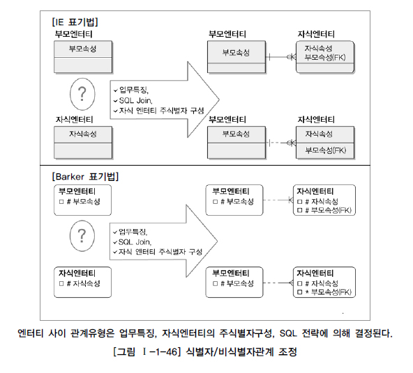

### 나. 식별자관계

부모로부터 받은 식별자를 자식엔터티의 주식별자로 이용하는 경우는 Null값이 오면 안되므로 반드시 부모엔터티가 생성되어야 자기 자신의 엔터티가 생성되는 경우이다. 부모로부터 받은 속성을 자식엔터티가 모두 사용하고 그것만으로 주식별자로 사용한다면 부모엔터티와 자식엔터티의 관계는 1:1의 관계가 될 것이고 만약 부모로부터 받은 속성을 포함하여 다른 부모엔터티에서 받은 속성을 포함하거나 스스로 가지고 있는 속성과 함께 주식별자로 구성되는 경우는 1:M 관계가 된다.

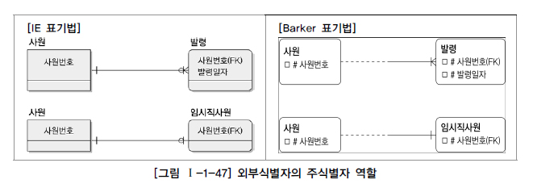

[그림 Ⅰ-1-47]에서 발령엔터티는 반드시 사원엔터티가 있어야 자신도 생성될 수 있고 자신의 주식별자도 부모엔터티의 외부식별자 사원번호와 자신의 속성 발령번호로 이루어져 있음을 알 수 있다. 이 때 사원과 발령의 관계는 1:M 관계이다. 또한 사원과 임시직사원의 관계와 주식별자를 보면, 임시직사원의 주식별자는 사원의 주식별자와 동일하게 이용되는 경우를 볼 수 있다. 1:1 관계에서 이와 같이 나타나며 주식별자가 동일하며 엔터티 통합의 대상이 됨을 알 수 있다. 이와 같이 자식엔터티의 주식별자로 부모의 주식별자가 상속이 되는 경우를 식별자 관계(Identifying Relationship)라고 지칭한다.

### 다. 비식별자관계

부모엔터티로부터 속성을 받았지만 자식엔터티의 주식별자로 사용하지 않고 일반적인 속성으로만 사용하는 경우가 있다. 이과 같은 경우를 비식별자 관계(Non-Identifying Relationship)라고 하며 다음의 네 가지 경우에 비식별자 관계에 의한 외부속성을 생성한다.

1) 자식엔터티에서 받은 속성이 반드시 필수가 아니어도 무방하기 때문에 부모 없는 자식이 생성될 수 있는 경우이다.
2) 엔터티별로 데이터의 생명주기(Life Cycle)를 다르게 관리할 경우이다. 예를 들어 부모엔터티에 인스턴스가 자식의 엔터티와 관계를 가지고 있었지만 자식만 남겨두고 먼저 소멸될 수 있는 경우가 이에 해당된다. 이에 대한 방안으로 물리데이터베이스 생성 시 Foreign Key를 연결하지 않는 임시적인 방법을 사용하기도 하지만 데이터 모델상에서 관계를 비식별자관계로 조정하는 것이 가장 좋은 방법이다.
3) 여러 개의 엔터티가 하나의 엔터티로 통합되어 표현되었는데 각각의 엔터티가 별도의 관계를 가질 때이며 이에 해당된다.

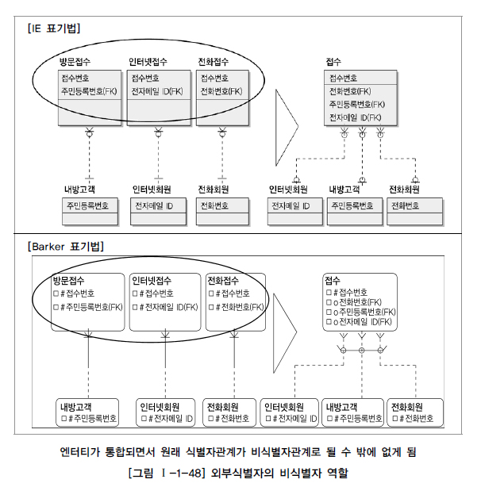

[그림 Ⅰ-1-48]은 접수엔터티가 인터넷접수, 내방접수, 전화접수가 하나로 통합되어 표현되어 있는 경우에 해당되며 통합된 엔터티에 각각의 엔터티가 별도의 관계를 가지고 있고 각각의 관계로부터 받은 주식별자를 접수엔터티의 주식별자로 사용할 수 없는 모습을 보여준다.

4) 자식엔터티에 주식별자로 사용하여도 되지만 자식엔터티에서 별도의 주식별자를 생성하는 것이 더 유리하다고 판단될 때 비식별자 관계에 의한 외부식별자로 표현한다.

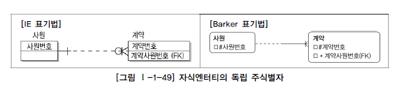

[그림 Ⅰ-1-49]는 계약이 반드시 사원에 의해 이루어져 사원번호와 계약번호로 주식별자를 구성할 수 있지만 계약번호 단독으로도 계약 엔터티의 주식별자를 구성할 수 있으므로 하나만 가지고 있는 것이 더 효율적이라고 판단하여 계약번호만 주식별자로 하고 계약사원번호는 일반속성 외부식별자로서 사용하게 된 경우이다.

### 라. 식별자 관계로만 설정할 경우의 문제점

단지 식별자관계와 비식별자관계에 대한 설정을 고려하지 않은 것이 개발의 복잡성을 증가시키는 요인이 될까?

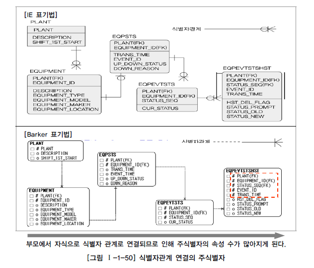

[그림 Ⅰ-1-50]의 데이터 모델은 원시 엔터티이었던 PLANT의 경우 단지 한 개의 속성만이 PK속성이었으나 EQPEVTSTSHST 엔터티의 경우 부모로부터 모두 식별자관계 연결로 인해 PK속성의 개수가 무려 5개나 설정될 수 밖에 없게 된 사례이다.
즉, PLANT 엔터티에는 PK속성의 수가 1개이고 관계가 1:M으로 전개되었으므로 자식엔터티는 PLANT 엔터티의 PK속성의 수 + 1이 성립된다. 물론 1개 이상의 속성의 추가되어야 1:M 관계를 만족할 수 있다. 이와 같은 원리에 의해 1:M 관계의 식별자관계의 PK속성의 수는 다음과 같다.

원 부모엔터티 : 1개 2대 부모엔터티 : 2개 이상 = 원부모 1개 + 추가 1개 이상 + 3대 부모엔터티 : 3개 이상 = 원부모 1개 + 2대 1개 + 추가 1개 이상 3대 부모엔터티 : 3개 이상 = 원부모 1개 + 2대 1개 + 3대 1개 + 추가 1개 이상 4대 부모엔터티 : 4개 이상 = 원부모 1개 + 2대 1개 + 3대 1개 + 4 1개 + 추가 1개 이상 ....

이와 같은 규칙에 의해 지속적으로 식별자 관계를 연결한 데이터 모델의 PK속성의 수는 데이터 모델의 흐름이 길어질수록 증가할 수 밖에 없는 구조를 가지게 된다.
[그림 I-1-50]의 예시 모델에서 EQPEVTSTSHST에 설정된 PK속성을 이용하여 해당 이력의 수리 ITEM과 작업자에 대한 엔터티가 별도로 발생이 가능한 모델은 다음 [그림 Ⅰ-1-51]과 같이 PK속성 수가 많은 데이터 모델을 만들 수밖에 없다.

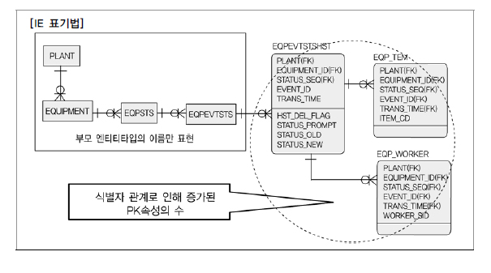

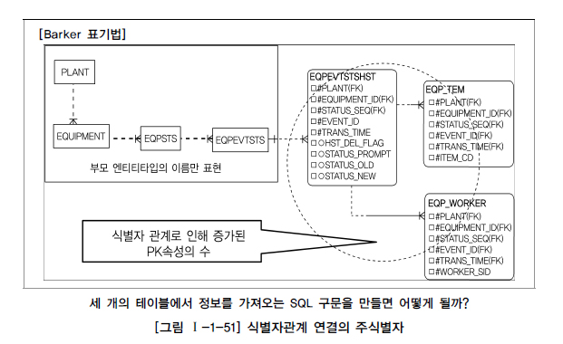

예시 모델의 맨 하위에 있는 EQPEVTSTSHST에서 다시 새로운 엔터티 EQP_ITEM, EQP_WORKER와 관계를 맺고 있을 때 이 세 개의 엔터티에서 정보를 가져오는 SQL구문을 작성해 보자.

SELECT A.EVENT_ID, A.TRANS_TIME, A.HST_DEL_FLAG, A.STATUS_PROMPT, A.STATUS_OLD, A.STATUS_NEW FROM EQPEVTSTSHST A, EQP_ITEM B, EQP_WORKER C WHERE A.PLANT = B.PLANT AND A.EQUIPMENT_ID = B.EQUIPMENT_ID AND A.STATUS_SEQ = B.STATUS_SEQ AND A.EVENT_ID = B.EVENT_ID AND A.TRANS_TIME = B.TRANS_TIME AND B.ITEM_CD = 'A001' AND A.PLANT = C.PLANT AND A.EQUIPMENT_ID = C.EQUIPMENT_ID AND A.STATUS_SEQ = C.STATUS_SEQ AND A.EVENT_ID = C.EVENT_ID AND A.TRANS_TIME = C.TRANS_TIME AND C.WORKER_SID = 'A012008001'

고작 3개 정도의 엔터티를 조인했을 뿐인데 SQL구문의 WHERE절이 매우 길어진 사실을 확인할 수 있다. 실제로 프로젝트에서는 개발자가 개발할 때 당연히 데이터 모델을 참조하면서 엔터티와 관계를 이용하여 개발해야 하는데 생성된 엔터티 스키마 정보만을 보고 개발하는 경우가 많다. 그런데 위와 같이 조인에 참여하는 주식별자속성의 수가 많을 경우 정확하게 조인관계를 설정하지 않고 즉, 누락하여 개발하는 경우가 간혹 발견되기도 한다. 정리하면 식별자 관계만으로 연결된 데이터 모델의 특징은 주식별자 속성이 지속적으로 증가할 수 밖에 없는 구조로서 개발자 복잡성과 오류가능성을 유발시킬 수 있는 요인이 될 수 있다는 사실을 기억해야 한다.

### 마. 비식별자 관계로만 설정할 경우의 문제점

일반적으로 각각의 엔터티에는 중요한 기준 속성이 있는데 이러한 기준속성은 부모엔터티에 있는 PK속성으로부터 상속되어 자식엔터티에 존재하는 경우가 많다. 이러한 속성의 예로 ‘주민등록번호’, ‘사원번호’, ‘주문번호’, ‘목록번호’ 등이 있다. 이런 속성은 부모엔터티를 조회할 때도 당연히 쓰이지만 자식엔터티의 데이터를 조회할 때도 해당 조건이 조회의 조건으로 걸리는 경우가 다수이다. 그런데 데이터 모델링을 전개할 때 각 엔터티 간의 관계를 비식별자 관계로 설정하면 이런 유형의 속성이 자식엔터티로 상속이 되지 않아 자식엔터티에서 데이터를 처리할 때 쓸데없이 부모엔터티까지 찾아가야 하는 경우가 발생된다.

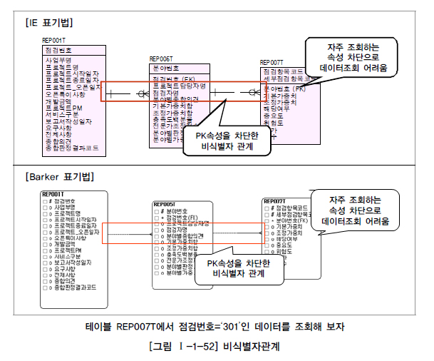

[그림 Ⅰ-1-52]의 예에서는 REP001T, REP005T, REP007T 간의 관계가 비식별자 관계로 연결되면서 점검번호, 분야번호 속성이 관계를 타고 자식엔터티로 내려가는 것을 차단하였다. 이러한 모델에서는 만약 위 모델에 있는 맨 하위에 있는 REP007T 엔터티에서 어떤 점검에 대한 정보를 보려고 하면 불필요한 조인이 다량으로 유발되면서 SQL구문도 길어지고 성능이 저하되는 현상이 발생이 된다.

[표 Ⅰ-1-9]의 조회 패턴을 보면 고작 점검번호=‘301’ 정도로서 간단하면서도 이 업무에서는 가장 근간이 되는 조회의 패턴 정보로 여겨지는 조건이다. 이 조건은 아마도 웬만한 업무처리에는 많이 포함될 것으로 보이는데 단순하게 걸리는 이 하나의 조회 조건도 왼쪽과 같이 비식별자 관계로만 데이터 모델링을 전개하다 보면 SQL구문에 많은 조인이 걸리게 되고 그에 따라 복잡성이 증가하고 성능이 저하되게 되는 것이다.
오른쪽과 같이 식별자관계를 통해 연결하다보면, 부모의 모든 주식별자 속성을 상속받음으로 인해 맨 하위에 있는 자식엔터티에서 바로 조회의 조건을 이용하여 원하는 정보를 가져올 수 있다. 이러한 경우는 당연히 성능과 개발의 용이성 측면에서는 식별자관계가 우위에 있음을 보여준다.
따라서 이 두 가지 경우에 대해서 일정한 규칙을 가지고 데이터 모델링을 하는 기술이 필요하며, 다음에 제시된 고려사항을 데이터 모델링에 반영한다면 효과적인 데이터 모델을 만들어 내는데 유용하게 활용할 수 있다.

### 바. 식별자관계와 비식별자관계 모델링

1) 비식별자관계 선택 프로세스
실제로 프로젝트를 전개할 때 식별자관계와 비식별자관계를 취사선택하여 연결하는 내공은 높은 수준의 기술을 요하고 있다. 특히 식별자관계에서 비식별자관계를 파악하는 기술이 필요한데 다음 흐름(Flow)에 따라 비식별자관계를 선정한다면 합리적으로 관계를 설정하는 모습이 될 수 있다. 기본적으로 식별자관계로 모든 관계가 연결되면서 다음 조건에 해당할 경우 비식별자관계로 조정하면 된다.

여기에서 가장 중요한 요인은 자식엔터티의 독립된 주식별자 구성이 필요한지를 분석하는 부분이다. 독립적으로 주식별자를 구성한다는 의미는 업무적 필요성과 성능상 필요여부를 모두 포함하는 의미로 이해하면 된다.

2) 식별자와 비식별자관계 비교
강한 관계인 식별자관계와 약한 관계인 비식별자관계를 비교하면 [표 Ⅰ-1-10]과 같이 나타낼 수 있다.

3) 식별자와 비식별자를 적용한 데이터 모델
이러한 기준에 의해 식별자와 비식별자 관계가 적절하게 설정된 데이터 모델은 [그림 Ⅰ-1-54]의 사례와 같이 균형감 있게 나타난다.

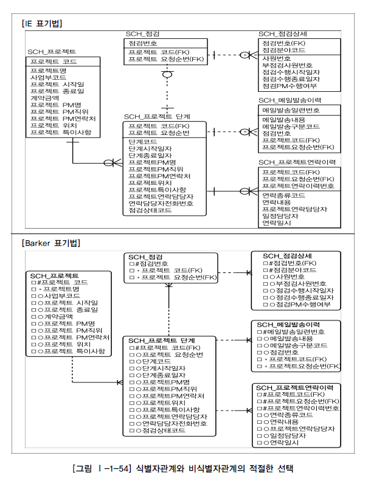

상기 모델은 업무의 특성에 따라 식별자관계와 비식별자관계를 적절하게 선택함으로써 데이터 모델의 균형감을 갖추었다고 볼 수 있다.

