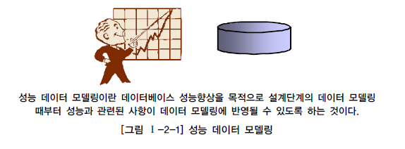
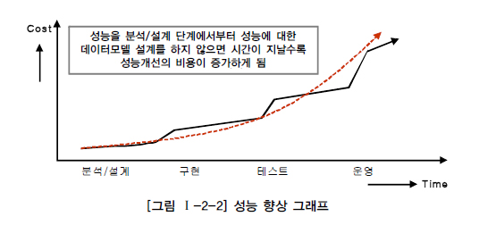

# 성능 데이터 모델링의 개요

## 1. 성능 데이터 모델링의 정의

인프라가 갖추어 지지 않은 환경에서 과연 빠른 속도로 이동할 수 있을까? 길이 굽이굽이 굽어져 있고 곳곳에 신호등이 있는 도로에서 아무리 성능이 좋은 차라고 할지라도 과연 그 길을 빠르게 지날 수 있을까? 데이터베이스에서 기본적으로 설계단계에서부터 성능을 고려하지 않고 설계를 하는 것은 빠르게 지나갈 수 없는 길을 지나가는 차에게 빨리 와달라고 요청하는 것과 다름이 없다.
데이터의 용량의 커질수록 기업의 의사결정의 속도가 빨라질수록 데이터를 처리하는 속도는 빠르게 처리되어야 할 필요성을 반증해 준다. 일반적으로 실무 프로젝트에서 보면 잘못된 테이블 디자인 위에서 개발된 애플리케이션의 성능이 저하되는 경우, 개발자가 구축한 SQL구문에 대해서만 책망을 하는 경우가 많이 있다. 물론 개발자가 SQL구문을 잘못 구성하여 성능이 저하되는 경우도 있지만 근본적으로 디자인이 잘못되어 SQL구문을 잘 못 작성하도록 구성될 수밖에 없는 경우도 빈번하게 발생되고 있음을 기억해야 한다.
성능이 저하되는 데이터 모델의 경우 크게 세 가지 경우를 고려하여 그 성능을 향상시킬 수 있다. 데이터 모델 구조에 의해 성능이 저하될 수도 있고 데이터가 대용량이 됨으로 인해 불가피하게 성능이 저하되어 나타나는 경우도 있다. 또한 인덱스 특성을 충분히 고려하지 않고 인덱스를 생성함으로 인해 성능이 저하되어 나타나는 경우도 있다.
일반적으로 성능이라고 하면 데이터조회의 성능을 의미하곤 한다. 그 이유는 데이터입력/수정/삭제는 일시적이고 빈번하지 않고 단건 처리가 많은 반면 데이터조회의 경우는 반복적이고 빈번하며 여러 건을 처리하는 경우가 많기 때문이다. 이러한 특징은 일반적인 트랜잭션의 성격이 조회의 패턴을 가지고 있다는 것이고 업무에 따라서는 입력/수정/삭제의 성능이 중요한 경우도 있다.
따라서 데이터 모델링을 할 때 어떤 작업 유형에 따라 성능 향상을 도모해야 하는지 목표를 분명하게 해야 정확한 성능향상 모델링을 할 수 있음을 기억해야 한다. 성능 데이터 모델링이란 데이터베이스 성능향상을 목적으로 설계단계의 데이터 모델링 때부터 정규화, 반정규화, 테이블통합, 테이블분할, 조인구조, PK, FK 등 여러 가지 성능과 관련된 사항이 데이터 모델링에 반영될 수 있도록 하는 것으로 정의할 수 있다.

성능 데이터 모델링이 단순히 반정규화만을 의미하지 않음을 주목해야 한다. 성능데이터 모델링은 정규화를 통해서도 수행할 수 있고 인덱스의 특징을 고려해서 칼럼의 순서도 변형할 수 있다. 또한 대량의 데이터특성에 따라 비록 정규화된 모델이라도 테이블을 수직 또는 수평분할하여 적용하는 방법도 있고 논리적인 테이블을 물리적인 테이블로 전환할 때 데이터 처리의 성격에 따라 변환하는 방법도 성능 데이터 모델링의 범주에 포함될 수 있다.

## 2. 성능 데이터 모델링 수행시점

성능 향상을 위한 비용은 프로젝트 수행 중에 있어서 사전에 할수록 비용이 들지 않는다. 특히 분석/설계 단계에서 데이터 모델에 성능을 고려한 데이터 모델링을 수행할 경우 성능저하에 따른 재업무(Rework) 비용을 최소화 할 수 있는 기회를 가지게 된다. 분석/설계단계에서 데이터 모델은 대충하고, 성능이 저하되는 SQL문장을 튜닝하고, 부족한 하드웨어 용량(CPU, Memory 등)을 증설하는 등의 작업은 추가적인 비용을 소진하게 하는 원인이 된다. 특히 데이터의 증가가 빠를수록 성능저하에 따른 성능개선비용은 기하급수적으로 증가하게 된다.

많은 프로젝트에서 분석/설계단계 때부터 치밀하게 성능에 대비한 설계를 하지 않고, 성능이 저하된 결과만을 대상으로 문제발생 시점에 근시안적인 튜닝을 적용하고 있다. 마치 SQL 튜닝이 모든 것인 것처럼 그것이 마법인 것처럼 SQL문장에만 집중하여 튜닝을 하는 프로젝트의 현장이 아직도 많이 있다.
따라서 분석/설계 단계에서 데이터베이스 처리 성능을 향상시킬 수 있는 방법을 주도면밀하게 고려해야 한다. 만약 어떤 트랜잭션이 해당 비즈니스 처리에 핵심적이고 사용자 업무처리에 있어 중요함을 가지고 있고 성능이 저하되면 안되는 특징을 가지고 있다면, 프로젝트 초기에 운영환경에 대비한 테스트 환경을 구현하고 그곳에 트랜잭션을 발생시켜 실제 성능을 테스트해 보아야 한다. 이 때 데이터 모델의 구조도 변경하면서 어떠한 구조가 해당 사이트에 성능상 가장 적절한 구조인지를 검토하여 성능이 좋은 모습으로 디자인하는 전략이 요구된다.

## 3. 성능 데이터 모델링 고려사항

일반적으로 성능 데이터 모델은 다음과 같은 프로세스로 진행하는 것이 데이터 모델링 단계에서 성능을 충분히 고려할 수 있는 방안이 된다.

① 데이터 모델링을 할 때 정규화를 정확하게 수행한다.
② 데이터베이스 용량산정을 수행한다.
③ 데이터베이스에 발생되는 트랜잭션의 유형을 파악한다.
④ 용량과 트랜잭션의 유형에 따라 반정규화를 수행한다.
⑤ 이력모델의 조정, PK/FK조정, 슈퍼타입/서브타입 조정 등을 수행한다.
⑥ 성능관점에서 데이터 모델을 검증한다.

데이터 모델링을 할 때 기본적으로 정규화를 완벽하게 수행해야 한다. 정규화된 모델이 데이터를 주요 관심사별로 분산시키는 효과가 있기 때문에 그 자체로 성능을 향상시키는 효과가 있다. 일단 정규화가 완성된 모델에 대해서 해당 데이터 모델의 각각의 엔터티에 어느 정도 트랜잭션이 들어오는지 살펴볼 필요가 있다. 이 때 가장 좋은 방법이 엔터티에 대한 용량산정을 하는 것이다. 각각의 엔터티(테이블)에 대한 용량산정을 수행하면 어떤 엔터티(테이블)에 데이터가 집중되는지 파악할 수 있다. 이 용량산정은 엔터티별로 데이터가 대용량인지를 구분하게 하기 때문에 테이블에 대한 성능고려를 엄격하게 적용해야 하는지 기준이 될 수 있다.
또한 데이터 모델에 발생되는 트랜잭션의 유형을 파악할 필요가 있다. 트랜잭션의 유형에 대한 파악은 CRUD 매트릭스를 보고 파악하는 것도 좋은 방법이 될 수 있고 객체지향 모델링을 적용한다면 시퀀스 다이어그램을 보면 트랜잭션의 유형을 파악하기에 용이하다. 또한 화면에서 처리된 데이터의 종류들을 보면 이벤트(입력, 수정, 삭제, 조회)에 따라 테이블에 데이터가 어떻게 처리되는지를 유추할 수 있다. 트랜잭션의 유형을 파악하게 되면 SQL문장의 조인관계 테이블에서 데이터조회의 칼럼들을 파악할 수 있게 되어 그에 따라 성능을 고려한 데이터 모델을 설계할 수 있다.
이렇게 파악된 용량산정과 트랜잭션의 유형데이터를 근거로 정확하게 테이블에 대해 반정규화를 적용하도록 한다. 반정규화는 테이블, 속성, 관계에 대해 포괄적인 반정규화의 방법을 적용해야 한다. 또한 대량 데이터가 처리되는 이력모델에 대해 성능고려를 하고 PK/FK의 순서가 인덱스 특성에 따라 성능에 영향을 미치는 영향도가 크기 때문에 반드시 PK/FK를 성능이 우수한 순서대로 칼럼의 순서를 조정해야 한다.
전체적으로 성능에 대한 충분한 고려가 되었는지를 데이터 모델 검토를 통해 다시 한 번 확인하도록 한다. 데이터 모델 검토 시에 일반적인 데이터 모델 규칙만을 검증하지 말고 충분하게 성능이 고려되었는지를 체크리스트에 포함하여 검증하도록 한다.

