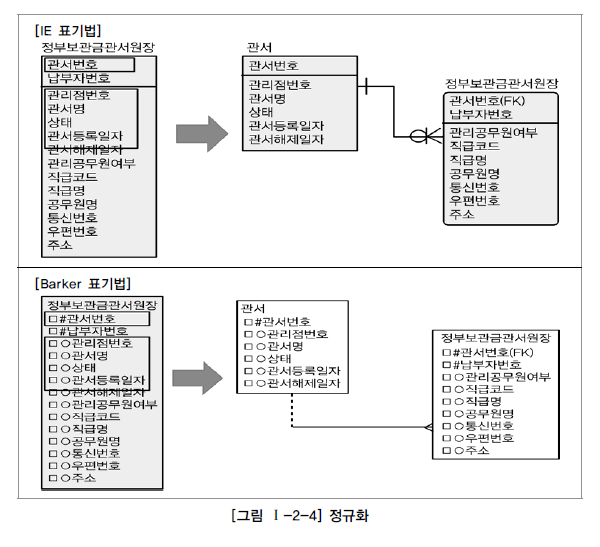
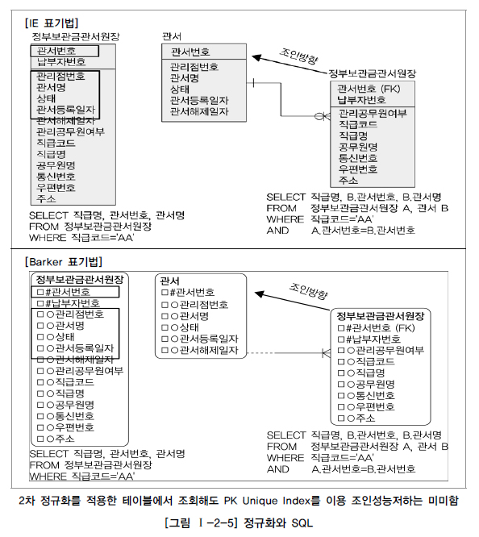
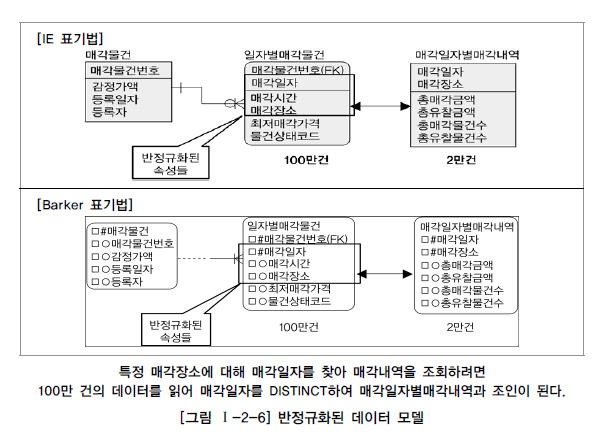
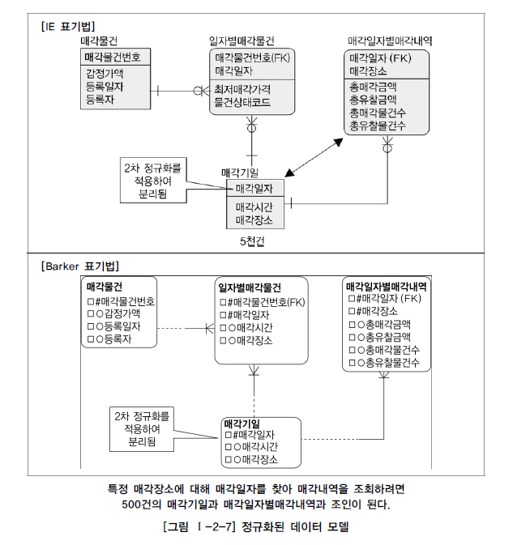
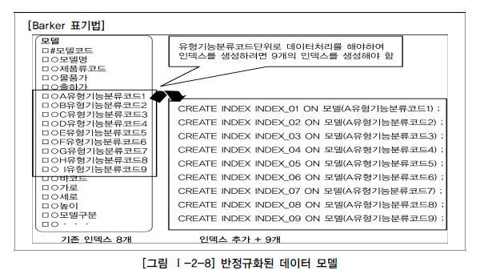
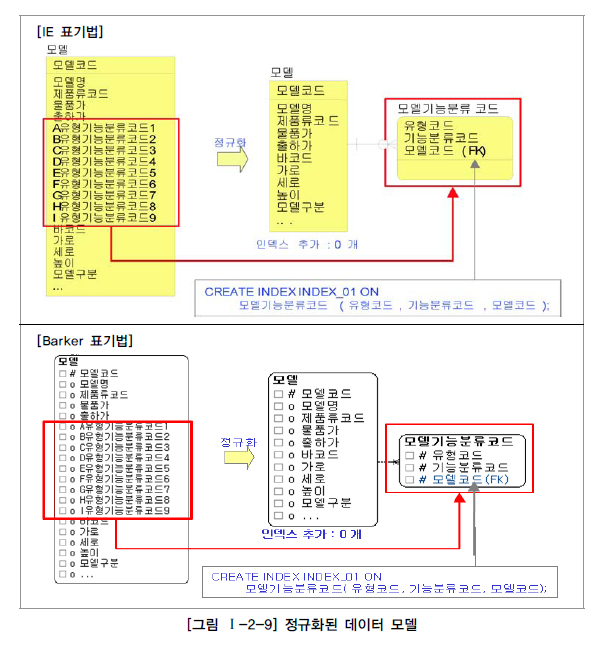
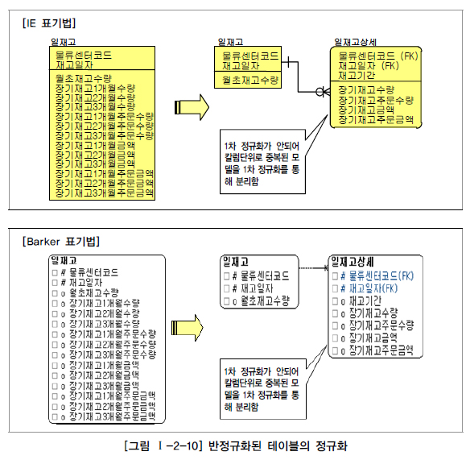
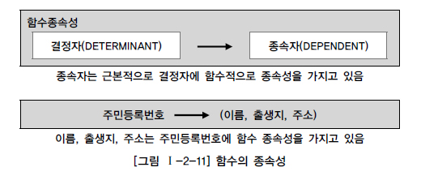

# 정규화와 성능

## 1. 정규화를 통한 성능 향상 전략

데이터 모델링을 하면서 정규화를 하는 것은 기본적으로 데이터에 대한 중복성을 제거하여 주고 데이터가 관심사별로 처리되는 경우가 많기 때문에 성능이 향상되는 특징을 가지고 있다. 물론 엔터티가 계속 발생되므로 SQL문장에서 조인이 많이 발생하여 이로 인한 성능저하가 나타나는 경우도 있지만 이런 부분은 사례별로 유의하여 반정규화를 적용하는 전략이 필요하다.
정규화를 수행하면 항상 조회 성능이 저하되어 나타날까?
데이터처리의 성능이 무엇인지 정확히 구분하여 인식할 필요가 있다. 데이터베이스에서 데이터를 처리할 때 성능이라고 하면 조회 성능과 입력/수정/삭제 성능의 두 부류로 구분된다. 이 두 가지 성능이 모두 우수하면 좋겠지만 데이터 모델을 구성하는 방식에 따라 두 성능이 Trade-Off 되어 나타나는 경우가 많이 있다.
정규화를 수행한다는 것은 데이터를 결정하는 결정자에 의해 함수적 종속을 가지고 있는 일반속성을 의존자로 하여 입력/수정/삭제 이상을 제거하는 것이다. 데이터의 중복속성을 제거하고 결정자에 의해 동일한 의미의 일반속성이 하나의 테이블로 집약되므로 한 테이블의 데이터 용량이 최소화되는 효과가 있다. 따라서 정규화된 테이블은 데이터를 처리할 때 속도가 빨라질 수도 있고 느려질 수도 있는 특성이 있다.

[그림 Ⅰ-2-3]을 보면 정규화 수행 모델은 데이터를 입력/수정/삭제할 때 일반적으로 반정규화된 테이블에 비해 처리 성능이 향상된다. 단 데이터를 조회할 때에는 처리 조건에 따라 조회 성능이 향상될 수도 있고 저하될 수도 있다.
따라서 일반적으로 정규화가 잘 되어 있으면 입력/수정/삭제의 성능이 향상되고 반정규화를 많이 하면 조회의 성능이 향상된다고 인식될 수 있다. 그러나 데이터 모델링을 할 때 반정규화만이 조회 성능을 향상시킨다는 고정관념은 탈피되어야 한다. 정규화를 해서 성능이 저하되기는커녕 정규화를 해야만 성능이 향상되는 경우가 아주 많이 나타나기 때문이다.

## 2. 반정규화된 테이블의 성능저하 사례1

정규화하여 조인이 발생하면 성능이 심각하게 저하되는가? 다음 예를 살펴보면 2차 정규화를 적용한 테이블에 대해서 조인을 하더라도 PK Unique Index를 이용하면 조인 성능 저하는 미미하게 발생된다.

[그림 Ⅰ-2-4]의 왼쪽 그림은 2차 정규화가 안 된 반정규화된 테이블의 모습이고 오른쪽 그림은 부분키 종속을 정규화하여 두 개의 테이블로 분리해 2차 정규화된 테이블의 모습이다.
2차 정규화가 안 된 테이블은 직급명과 함께 반정규화된 관서번호, 관서명을 조회하면 하나의 테이블에서 데이터가 조회가 된다. 2차 정규화된 테이블은 관서번호, 관서명이 관서테이블에만 존재하기 때문에 두 개의 테이블을 조인하여 처리해야 한다.
정부보관금관서원장에서 데이터를 조회하는 것이나, 관서와 정부보관금관서원장을 조인하여 데이터를 조회하나 처리 성능은 사용자가 느끼기에는 거의 차이가 나지 않는다. PK가 걸려있는 방향으로 조인이 걸려 Unique Index를 곧바로 찾아서 데이터를 조회하기 때문에, 하나의 테이블에서 조회하는 작업과 비교했을 때 미미하게 성능 차이가 날 뿐 사용자에게 크게 영향을 줄 만큼 성능이 저하되는 일은 없는 것이다.
게다가 위의 예를 ‘관서등록일자가 2010년 이후 관서를 모두 조회하라’는 SQL 구문을 처리하는 것으로 바꾸면, 2차 정규화된 테이블이 훨씬 빠르다. [그림 Ⅰ-2-5]에서와 같이 왼쪽 테이블에서는 불필요하게 납부자번호만큼 누적된 데이터를 읽어서 결과를 구분하여 보여주어야 하지만 오른쪽은 관서수만큼만 존재하는 데이터를 읽어 곧바로 결과를 보여주기 때문이다. 이렇게 단순한 예만 보아도 정규화를 수행하면 무조건 조회성능이 저하된다는 고정관념이 틀렸다는 것을 알 수 있다.

## 3. 반정규화된 테이블의 성능저하 사례2

두 개의 엔터티가 통합되어 반정규화된 또 다른 경우를 살펴본다. 이 업무에서는 어떤 물건을 매각할 때 매각일자를 정하고 그 일자에 해당하는 매각시간과 매각장소가 결정하는 속성의 성격을 가지고 있다. 즉 매각일자가 결정자가 되고 매각시간과 매각장소가 의존자가 되는 함수적 종속관계가 형성되는 관계이다. 매각일자는 5천 건이 있고 일자별매각물건은 100만 건이 있는 것으로 가정하자.

예를 들어 [그림 Ⅰ-2-6]의 모델에서 ‘서울 7호’에서 매각된 총매각금액, 총유찰금액을 산출하는 조회용 SQL문장을 작성하면 다음과 같다.

SELECT B.총매각금액 , B.총유찰금액 FROM (SELECT DISTINCT 매각일자 FROM 일자별매각물건 WHERE 매각장소 = '서울 7호') A, <== 100만건의 데이터를 읽어 DISTINCT함 매각일자별매각내역 B WHERE A.매각일자 = B.매각일자 AND A.매각장소 = B.매각장소;

대량의 데이터에서 조인 조건이 되는 대상을 찾기 위해 인라인뷰를 사용하기 때문에 성능이 저하된다. 이를 정규화하려면 복합식별자 중에서 일반속성이 주식별자 속성 중 일부에만 종속관계를 가지고 있으므로 2차 정규화의 대상이 된다. 2차 정규화를 적용하면 [그림 Ⅰ-2-7]과 같은 모델이 된다.

2차 정규화를 적용하여 매각일자를 PK로 하고 매각시간과 매각장소는 일반속성이 되었다. 정규화를 적용했기 때문에 매각일자를 PK로 사용하는 매각일자별매각내역과도 관계가 연결된다. 따라서 업무흐름에 따른 적확한 데이터 모델링 표기도 가능해지고, 드라이빙이 된 테이블 이 5천 건의 매각기일 테이블이 되므로 성능도 향상된다.
만약 위의 모델에서 ‘서울 7호’에서 매각된 총매각금액, 총유찰금액을 산출하는 조회용 SQL문장을 작성하면 다음과 같이 나온다.

SELECT B.총매각금액 , B.총유찰금액 FROM 매각기일 A, 매각일자별매각내역 B WHERE A.매각장소 = '서울 7호' <== 5천건의 데이터를 읽음 AND A.매각일자 = B.매각일자 AND A.매각장소 = B.매각장소;

매각기일 테이블이 정규화 되면서 드라이빙이 되는 대상 테이블의 데이터가 5천 건으로 줄어들어 조회 처리가 빨라진다.

## 4. 반정규화된 테이블의 성능저하 사례3

다음 사례는 동일한 속성 형식을 두 개 이상의 속성으로 나열하여 반정규화한 경우에 해당한다. 계층형 데이터베이스를 많이 사용했던 과거 데이터 모델링의 습관이 남아서인지 관계형 데이터베이스에서도 동일한 속성을 한 테이블에 속성1, 속성2, 속성3 데이터 모델링을 하는 경우가 많이 있다.
[그림 Ⅰ-2-8]을 보면, 모델이라고 하는 테이블에 업무적으로 필요한 8개의 인덱스가 이미 생성되어 있다. 데이터는 30만 건이고 온라인 환경의 데이터베이스라고 가정하자. 유형기능분류코드에 따라 데이터를 조회하는 경우가 많이 나타나 인덱스를 생성하려면 유형기능분류코드 각각에 대해 인덱스를 생성해야 하므로 9개나 되는 인덱스를 추가 생성해야 한다.

참고로, 한 테이블에 인덱스가 많아지면 조회 성능은 향상되지만 데이터 입력/수정/삭제 성능은 저하된다. 그래서 일반 업무처리(온라인성 업무)에서는 인덱스 수를 가급적 7~8개가 넘지 않도록 하는 것이 좋다. 그런데 [그림 Ⅰ-2-8]의 모델은 다른 필요한 인덱스 이외에 유형기능분류코드 속성에 해당하는 인덱스를 9개나 추가적으로 생성해야 하므로 실전프로젝트에서는 어쩔 수 없이 인덱스를 생성하지 않거나 A유형기능분류코드1 하나만 인덱스를 생성하는 경우가 생긴다. 이에 따라 A유형기능분류코드1, A유형기능분류코드2, A유형기능분류코드3...을 이용하면 SQL의 성능이 저하되는 경우가 많다.
만약 각 유형코드별로 조건을 부여하여 모델코드와 모델명을 조회하는 SQL문장을 작성한다면 다음과 같이 나온다.

SELECT 모델코드, 모델명 FROM 모델 WHERE ( A유형기능분류코드1 = '01' ) OR ( B유형기능분류코드2 = '02' ) OR ( C유형기능분류코드3 = '07' ) OR ( D유형기능분류코드4 = '01' ) OR ( E유형기능분류코드5 = '02' ) OR ( F유형기능분류코드6 = '07' ) OR ( G유형기능분류코드7 = '03' ) OR ( H유형기능분류코드8 = '09' ) OR ( I유형기능분류코드9 = '09' )

각 유형별로 모두 인덱스가 걸려 있어야 인덱스에 의해 데이터를 찾을 수 있다. 이런 모델은 다음과 같이 정규화를 적용해야 한다.
중복속성에 대한 분리가 1차 정규화의 정의임을 고려하면 모델 테이블은 1차 정규화의 대상이 된다. 로우단위의 대상도 1차 정규화의 대상이 되지만 칼럼 단위로 중복이 되는 경우도 1차 정규화의 대상이 된다. 따라서 모델에 대해 1차 정규화를 적용하면 [그림 Ⅰ-2-9]와 같이 분리될 수 있다.

하나의 테이블에 9개가 반복적으로 나열이 되어 있을 때는 인덱스 생성이 어려웠지만 정규화되어 분리된 이후에는 인덱스 추가 생성이 0개가 되었다. 또한 분리된 테이블 모델기능분류코드에서 PK인덱스를 생성하여 이용함으로써 성능이 향상될 수 있다.
만약 각 유형코드별로 조건을 부여하여 모델코드와 모델명을 조회하는 SQL문장을 작성한다면 다음과 같이 작성된다.

SELECT A.모델코드, A.모델명 FROM 모델 A, 모델기능분류코드 B WHERE ( B.유형코드 = 'A' AND B.기능분류코드 = '01' AND A.모델코드 = B.모델코드 ) OR ( B.유형코드 = 'B' AND B.기능분류코드 = '02' AND A.모델코드 = B.모델코드 ) OR ( B.유형코드 = 'C' AND B.기능분류코드 = '07' AND A.모델코드 = B.모델코드 ) OR ( B.유형코드 = 'D' AND B.기능분류코드 = '01' AND A.모델코드 = B.모델코드 ) OR ( B.유형코드 = 'E' AND B.기능분류코드 = '02' AND A.모델코드 = B.모델코드 ) OR ( B.유형코드 = 'F' AND B.기능분류코드 = '07' AND A.모델코드 = B.모델코드 ) OR ( B.유형코드 = 'G' AND B.기능분류코드 = '03' AND A.모델코드 = B.모델코드 ) OR ( B.유형코드 = 'H' AND B.기능분류코드 = '09' AND A.모델코드 = B.모델코드 ) OR ( B.유형코드 = 'I' AND B.기능분류코드 = '09' AND A.모델코드 = B.모델코드 )

위 SQL구문은 유형코드+기능분류코드+모델코드에 인덱스가 걸려 있으므로 인덱스를 통해 데이터를 조회함으로써 성능이 향상된다.
실전 프로젝트에서도 많은 데이터 모델이 칼럼 단위에서 중복된 경우가 발견된다. 이에 대한 파급효과 계산 없이 무조건 칼럼 단위로 COL1, COL2, COL3... 이런 식으로 데이터 모델링을 하는 것은 근본적으로 SQL문장의 성능을 나쁘게 하는 결과를 초래할 수도 있으므로 인덱스 생성 영향도를 파악한 이후에 적용하는 것이 좋은 방법이 된다

## 5. 반정규화된 테이블의 성능저하 사례4

[그림 Ⅰ-2-10]과 같은 경우도 동일한 사례이다.

일재고와 일재고 상세를 구분함으로써 일재고에 발생되는 트랜잭션의 성능저하를 예방할 수 있게 되었다.

## 6. 함수적 종속성(Functional Dependency)에 근거한 정규화 수행 필요

함수의 종속성(Functional Dependency)은 데이터들이 어떤 기준값에 의해 종속되는 현상을 지칭하는 것이다. 이 때 기준값을 결정자(Determinant)라 하고 종속되는 값을 종속자(Dependent)라고 한다.

[그림 Ⅰ-2-11]에서 보면 사람이라는 엔터티는 주민등록번호, 이름, 출생지, 호주라는 속성이 존재한다. 여기에서 이름, 출생지, 호주라는 속성은 주민등록번호 속성에 종속된다. 만약 어떤 사람의 주민등록번호가 신고되면 그 사람의 이름, 출생지, 호주가 생성되어 단지 하나의 값만을 가지게 된다. 이를 기호로 표시하면, 다음과 같이 표현할 수 있다.

주민등록번호 -> (이름, 출생지, 호주)

즉 “주민등록번호가 이름, 출생지, 호주를 함수적으로 결정한다.”라고 말할 수 있다. 실세계의 데이터들은 대부분 이러한 함수 종속성을 가지고 있다.
함수의 종속성은 데이터가 가지고 있는 근본적인 속성으로 인식되고 있다. 정규화의 궁극적인 목적은 반복적인 데이터를 분리하고 각 데이터가 종속된 테이블에 적절하게(프로세스에 의해 데이터의 정합성이 지켜질 수 있어야 함) 배치되도록 하는 것이므로 이 함수의 종속성을 이용하여 정규화 작업이나 각 오브젝트에 속성을 배치하는 작업에 이용이 되는 것이다.
기본적으로 데이터는 속성간의 함수종속성에 근거하여 정규화되어야 한다. 프로젝트 수행에서 정규화는 선택사항이 아니라 필수사항이다. 데이터의 구조를 함수적 종속관계에 의해 정규화 사상에 맞게 분리하는 것은 마치 건축물을 지을 때 부실공사를 방지하기 위해 하중, 균형, 내구성을 고려한 기본적인 설계를 하는 것과 같다. 정규화 이론은 건축으로 따지면 기본적인 설계 원칙만큼이나 중요한 이론이다.
프로젝트에서 정규화가 적용된 모델을 설계하기 위해서는 정규화에 대한 기본이론을 정확하고 구체적으로 이해하고 있어야 한다. 전문적인 IT프로젝트를 진행하는 설계자가 정규화의 이론을 모르고 데이터 모델링을 설계하는 것은 불가능하다. 눈이 어두운 사람이 감각에 의해 길을 찾아가는 것과 같다. 분명하게 자기가 가는 길을 명확하게 검증받을 수 있도록, 지도를 가지고 길을 가듯이 정규화의 이론을 숙지하고 정보시스템의 근간인 데이터를 설계해야 한다.

