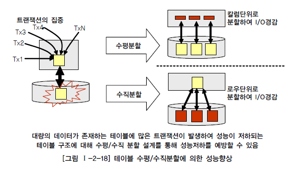
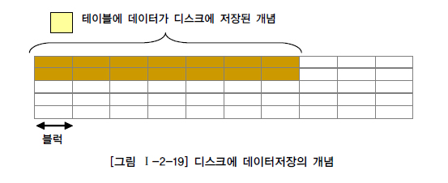
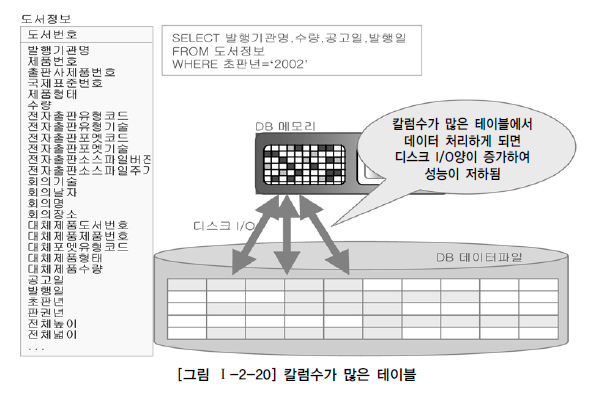
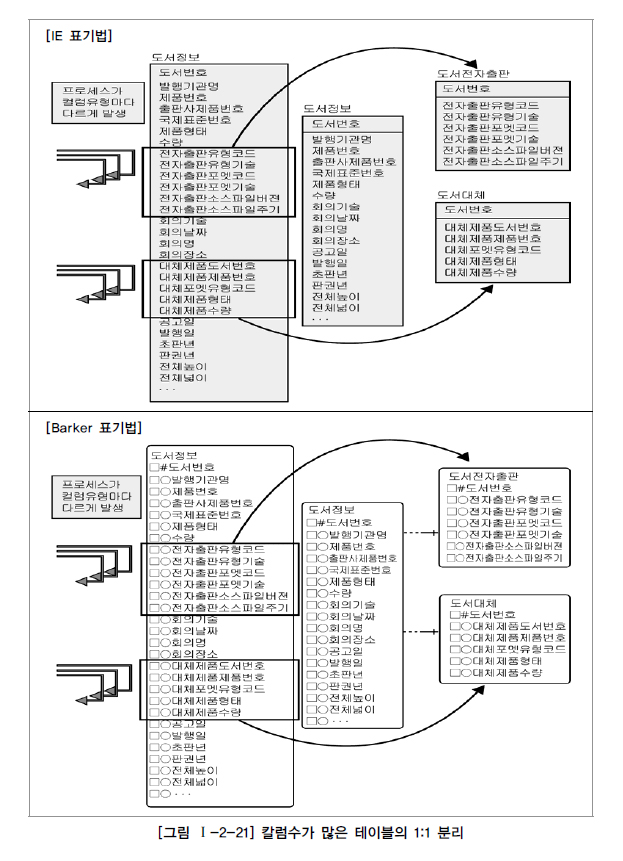
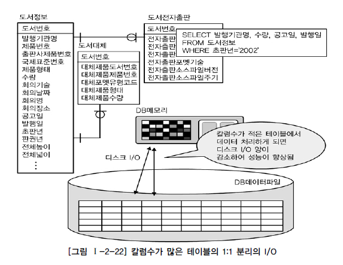
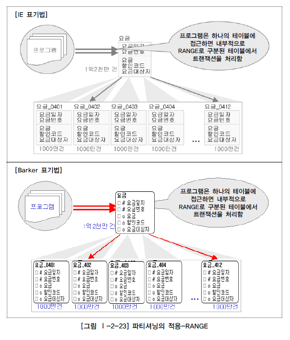

# 대량 데이터에 따른 성능

## 1. 대량 데이터발생에 따른 테이블 분할 개요

아무리 설계가 잘되어 있는 데이터 모델이라고 하더라도 대량의 데이터가 하나의 테이블에 집약되어 있고 하나의 하드웨어 공간에 저장되어 있으면 성능저하를 피하기가 힘들다. 이런 원리는 하나의 고속도로 차선을 넓게 시공하여 건설해도 교통량이 많게 되면 이 넓은 도로가 정체현상을 보이는 것과 비슷한 원리로 이해할 수 있다. 일의 처리되는 양이 한군데에 몰리는 현상은 어떤 업무에 있어서 중요한 업무에 해당되는 데이터가 특정 테이블에 있는 경우에 발생이 되는데 이런 경우 트랜잭션이 분산 처리될 수 있도록 테이블단위에서 분할의 방법을 적용할 필요가 있는 것이다.

한 테이블에 데이터가 대량으로 집중되거나 하나의 테이블에 여러 개의 칼럼이 존재하여 디스크에 많은 블록을 점유하는 경우는 모두 성능저하를 유발할 수 있는 경우이다. 하나의 테이블에 대량의 데이터가 존재하는 경우에는 인덱스의 Tree구조가 너무 커져 효율성이 떨어져 데이터를 처리(입력, 수정, 삭제, 조회)할 때 디스크 I/O를 많이 유발하게 된다. 또한 한 테이블에 많은 수의 칼럼이 존재하게 되면 데이터가 디스크의 여러 블록에 존재하므로 인해 디스크에서 데이터를 읽는 I/O량이 많아지게 되어 성능이 저하되게 된다.
대량의 데이터가 처리되는 테이블에 성능이 저하되는 이유는 SQL문장에서 데이터를 처리하기 위한 I/O의 양이 증가하기 때문이다. 당연하게 데이터의 양이 많아지면 그것을 처리하기 위한 I/O량이 많아질 것이라고 막연하게 생각할 수 있지만, 인덱스를 적절하게 구성하여 이용하게 하면 I/O를 줄일 수 있을 것이라고 생각할 수 있다. 조회조건에 따른 인덱스를 적절하게 이용하면 해당 테이블에 데이터가 아무리 많아도 원하는 데이터만 접근하면 되기 때문에 I/O의 양이 그다지 증가하지 않을 것으로 생각할 수 있다. 그러나 대량의 데이터가 하나의 테이블에 존재하게 되면 인덱스를 생성할 때 인덱스의 크기(용량)가 커지게 되고 그렇게 되면 인덱스를 찾아가는 단계가 깊어지게 되어 조회의 성능에도 영향을 미치게 된다. 인덱스 크기가 커질 경우 조회의 성능에는 영향을 미치는 정도가 작지만 데이터를 입력/수정/삭제하는 트랜잭션의 경우 인덱스의 특성상 일량이 증가하여 더 많이 성능의 저하를 유발하게 된다. 또한 데이터에 대한 범위 조회시 더 많은 I/O 유발할 수 있게 되어 성능저하를 유발할 수 있게 된다.
칼럼이 많아지게 되면 물리적인 디스크에 여러 블록에 데이터가 저장되게 된다. 따라서 데이터를 처리할 때 여러 블록에서 데이터를 I/O해야 하는 즉 SQL문장의 성능이 저하될 수 특징을 가지게 된다. 물론, 테이블에 칼럼이 많아지는 현상은 정규화이론인 함수적 종속성에 근거하여 당연히 하나의 테이블에 설계할 수는 있다. 그러나 대량 데이터를 가진 테이블에서 불필요하게 많은 양의 I/O를 유발하여 성능이 저하되는 경우에는 이것을 기술적으로 분석하여 성능을 향상하는 방법으로 분할할 수 있다.

프로젝트를 수행할 때 때로는 하나의 테이블에 300개 이상의 칼럼을 가지고 있는 경우가 있다. 컴퓨터 화면 하나에는 볼 수가 없어서 스크롤을 하면서 하나의 테이블에 있는 칼럼을 구경해야 할 정도이다. 이렇게 많은 칼럼은 로우체이닝과 로우마이그레이션이 많아지게 되어 성능이 저하된다.
로우 길이가 너무 길어서 데이터 블록 하나에 데이터가 모두 저장되지 않고 두 개 이상의 블록에 걸쳐 하나의 로우가 저장되어 있는 형태가 로우체이닝(Row Chaining) 현상이다. 또한 로우마이그레이션(Row Migration)은 데이터 블록에서 수정이 발생하면 수정된 데이터를 해당 데이터 블록에서 저장하지 못하고 다른 블록의 빈 공간을 찾아 저장하는 방식이다. 로우체이닝과 로우마이그레이션이 발생하여 많은 블록에 데이터가 저장되면 데이터베이스 메모리에서 디스크와 I/O(입력/출력)가 발생할 때 불필요하게 I/O가 많이 발생하여 성능이 저하된다.

## 2. 한 테이블에 많은 수의 칼럼을 가지고 있는 경우

도서정보라고 하는 테이블에 칼럼수가 아주 많은 경우를 생각해 보자. 생략된 칼럼까지 합하면 대략 200개라고 가정한다. 만약 하나의 로우의 길이가 10KByte라고 하고 블록은 2K단위로 쪼개져 있다고 가정한다. 또한 블록에 데이터는 모두 채워진다고 가정하면 대략 하나의 로우는 5블록에 걸쳐 데이터가 저장될 것이다.
이 때 칼럼의 앞쪽에 위치한 발행기관명, 수량, 중간에 위치한 공고일, 발행일에 대한 정보를 가져오려면 물리적으로 칼럼의 값이 블록에 넓게 산재되어 있어 디스크 I/O가 많이 일어나게 된다.

200개의 칼럼을 동시에 조회하여 화면에 보여주는 경우는 드문 사례이다. 만약 200개의 칼럼이 가지고 있는 값을 모두 한 화면에 보여주기 위해서는 화면을 몇 번 스크롤 하면서 보여야 한다. 즉 이렇게 많은 칼럼을 가지고 있는 테이블에 대해서는 트랜잭션이 발생될 때 어떤 칼럼에 대해 집중적으로 발생하는지 분석하여 테이블을 쪼개어 주면 디스크 I/O가 감소하게 되어 성능이 개선되게 된다.

[그림 Ⅰ-2-21]의 데이터 모델을 살펴보자.

도서정보 테이블에는 전자출판유형에 대한 트랜잭션이 독립적으로 발생이 되는 경우가 많고 대체제품에 대한 유형의 트랜잭션이 독립적으로 발생되는 경우가 많이 있어 1:1 관계로 분리하였다. 분리된 테이블은 디스크에 적어진 칼럼이 저장이 되므로 로우마이그레이션과 로우체이닝이 많이 줄어들 수 있다. 따라서 아래와 같이 발행기관명, 수량, 중간에 위치한 공고일, 발행일을 가져오는 동일한 SQL구문에 대해서도 디스크 I/O가 줄어들어 성능이 개선되게 된다.

많은 수의 칼럼을 가지는 데이터 모델 형식도 실전 프로젝트에서 흔히 나타나는 현상이다. 트랜잭션을 분석하여 적절하게 1:1 관계로 분리함으로써 성능향상이 가능하도록 해야 한다.

## 3. 대량 데이터 저장 및 처리로 인해 성능

테이블에 많은 양의 데이터가 예상될 경우 파티셔닝을 적용하거나 PK에 의해 테이블을 분할하는 방법을 적용할 수 있다. Oracle의 경우 크게 LIST PARTITION(특정값 지정), RANGE PARTITION(범위), HASH PARTITION(해쉬적용), COMPOSITE PARTITION(범위와 해쉬가 복합) 등이 가능하다.
데이터량이 몇 천만건을 넘어서면 아무리 서버사양이 훌륭하고 인덱스를 잘 생성해준다고 하더라고 SQL문장의 성능이 나오지 않는다. 이 때는 논리적으로는 하나의 테이블로 보이지만 물리적으로 여러 개의 테이블스페이스에 쪼개어 저장될 수 있는 구조의 파티셔닝을 적용하도록 한다.

### 가. RANGE PARTITION 적용

다음은 요금테이블에 PK가 요금일자+요금번호로 구성되어 있고 데이터건수가 1억2천만 건인 대용량 테이블의 경우이다. 하나의 테이블로는 너무 많은 데이터가 존재하므로 인해 성능이 느린 경우에 해당된다. 이 때 요금의 특성상 항상 월단위로 데이터 처리를 하는 경우가 많으므로 PK인 요금일자의 년+월을 이용하여 12개의 파티션 테이블을 만들었다. 하나의 파티션 테이블당 평균 1,000만 건의 데이터가 있다고 가정한다.

SQL문장을 처리할 때는 마치 하나의 테이블처럼 보이는 요금 테이블을 이용하여 처리하면 되지만 DBMS 내부적으로는 SQL WHERE 절에 비교된 요금일자에 의해 각 파티션에 있는 정보를 찾아가므로 평균 1,000만 건의 데이터가 있는 곳을 찾아도 되어 성능이 개선될 수 있다.
가장 많이 사용하는 파티셔닝의 기준이 RANGE PARTITION이다. 대상 테이블이 날자 또는 숫자값으로 분리가 가능하고 각 영역별로 트랜잭션이 분리된다면 RANGE PARTITION을 적용한다. 또한 RANGE PARTITION은 데이터보관주기에 따라 테이블에 데이터를 쉽게 지우는 것이 가능하므로(파티션 테이블을 DROP하면 되므로) 데이터보관주기에 다른 테이블관리가 용이하다.

### 나. LIST PARTITION 적용

지점, 사업소, 사업장, 핵심적인 코드값 등으로 PK가 구성되어 있고 대량의 데이터가 있는 테이블이라면 값 각각에 의해 파티셔닝이 되는 LIST PARTITION을 적용할 수 있다.

[그림 Ⅰ-2-24]의 예는 고객이라고 하는 테이블에 데이터가 1억 건이 있는데 하나의 테이블에서 데이터를 처리하기에는 SQL문장의 성능이 저하되어 지역을 나타내는 사업소코드별로 LIST PARTITION을 적용한 예이다.

LIST PARTITION은 대용량 데이터를 특정값에 따라 분리 저장할 수는 있으나 RANGE PARTITION과 같이 데이터 보관주기에 따라 쉽게 삭제하는 기능은 제공될 수 없다.

### 다. HASH PARTITION 적용

기타 HASH PARTITION은 지정된 HASH 조건에 따라 해슁 알고리즘이 적용되어 테이블이 분리되며 설계자는 테이블에 데이터가 정확하게 어떻게 들어갔는지 알 수 없다. 역시 성능향상을 위해 사용하며 데이터 보관주기에 따라 쉽게 삭제하는 기능은 제공될 수 없다.
데이터량이 대용량이 되면 파티셔닝의 적용은 필수적으로 파티셔닝 기준을 나눌 수 있는 조건에 따라 적절한 파티셔닝을 방법을 선택하여 성능을 향상 시키도록 한다.

## 4. 테이블에 대한 수평분할/수직분할의 절차

테이블에 대한 수평분할/수직분할에 대한 결정은 다음의 4가지 원칙을 적용하면 된다.

1) 데이터 모델링을 완성한다.
2) 데이터베이스 용량산정을 한다.
3) 대량 데이터가 처리되는 테이블에 대해서 트랜잭션 처리 패턴을 분석한다.
4) 칼럼 단위로 집중화된 처리가 발생하는지, 로우단위로 집중화된 처리가 발생되는지 분석하여 집중화된 단위로 테이블을 분리하는 것을 검토한다.

용량산정은 어느 테이블에 데이터의 양이 대용량이 되는지 분석하는 것이다. 특정 테이블의 용량이 대용량인 경우 칼럼의 수가 너무 많은 지 확인한다. 칼럼의 수가 많은 경우 트랜잭션의 특성에 따라 테이블을 1:1 형태로 분리할 수 있는지 검증하면 된다. 칼럼의 수가 적지만 데이터용량이 많아 성능저하가 예상이 되는 경우 테이블에 대해 파티셔닝 전략을 고려하도록 한다. 이 때 임의로 파티셔닝할 것인지 데이터가 발생되는 시간에 따라 파티셔닝을 할 것인지를 설명된 기준에 따라 적용하면 된다.

