# 데이터베이스 구조와 성능

## 1. 슈퍼타입/서브타입 모델의 성능고려 방법

### 가. 슈퍼/서브타입 데이터 모델의 개요

Extended ER모델이라고 부르는 이른바 슈퍼/서브타입 데이터 모델은 최근에 데이터 모델링을 할 때 자주 쓰이는 모델링 방법이다. 이 모델이 자주 쓰이는 이유는 업무를 구성하는 데이터의 특징을 공통과 차이점의 특징을 고려하여 효과적으로 표현할 수 있기 때문이다. 즉, 공통의 부분을 슈퍼타입으로 모델링하고 공통으로부터 상속받아 다른 엔터티와 차이가 있는 속성에 대해서는 별도의 서브엔터티로 구분하여 업무의 모습을 정확하게 표현하면서 물리적인 데이터 모델로 변환을 할 때 선택의 폭을 넓힐 수 있는 장점이 있다. 이러한 장점 때문에 많은 프로젝트에서 슈퍼/서브타입을 활용한 데이터 모델의 사례가 증가하고 있다.
당연히 슈퍼/서브타입의 데이터 모델은 논리적인 데이터 모델에서 이용되는 형태이고 분석/설계단계를 구분하자면, 분석단계에서 많이 쓰이는 모델이다. 따라서 물리적인 데이터 모델을 설계하는 단계에서는 슈퍼/서브타입 데이터 모델을 일정한 기준에 의해 변환을 해야 한다. 그런데 실제로 프로젝트 현장에서는 이것을 변환하는 방법에 대해 정확한 노하우가 없기 때문에 막연하게 1:1로 변환하거나 아니면 하나의 테이블로 구성해 버리는 현상이 나타난다.
물리적인 데이터 모델이 성능을 고려한 데이터 모델이 되어야 한다는 점을 고려하면 이렇게 막연하게 슈퍼/서브타입을 아무런 기준없이 변환하는 것 자체가 성능이 저하될 수 있는 위험이 있음을 기억해야 한다.

### 나. 슈퍼/서브타입 데이터 모델의 변환

성능을 고려한 슈퍼타입과 서브타입의 모델 변환의 방법을 알아보면 [그림 Ⅰ-2-25]와 같다.

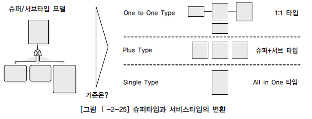

슈퍼/서브타입에 대한 변환을 잘못하면 성능이 저하되는 이유는 트랜잭션 특성을 고려하지 않고 테이블이 설계되었기 때문이다. 이것을 3가지 경우의 수로 정리하면 설명하면 다음과 같다. 1) 트랜잭션은 항상 일괄로 처리하는데 테이블은 개별로 유지되어 Union연산에 의해 성능이 저하될 수 있다. 2) 트랜잭션은 항상 서브타입 개별로 처리하는데 테이블은 하나로 통합되어 있어 불필요하게 많은 양의 데이터가 집약되어 있어 성능이 저하되는 경우가 있다. 3) 트랜잭션은 항상 슈퍼+서브 타입을 공통으로 처리하는데 개별로 유지되어 있거나 하나의 테이블로 집약되어 있어 성능이 저하되는 경우가 있다.

해당 테이블에 발생되는 성능이 중요한 트랜잭션이 빈번하게 처리되는 기준에 따라 테이블을 설계해야 이러한 성능저하 현상을 예방할 수 있음을 기억해야 한다. 슈퍼/서브타입을 성능을 고려한 물리적인 데이터 모델로 변환하는 기준은 데이터 양과 해당 테이블에 발생되는 트랜잭션의 유형에 따라 결정된다.

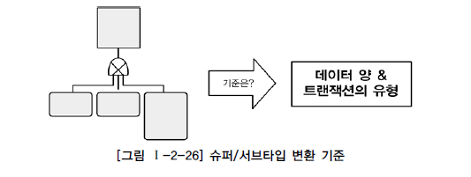

데이터의 양은 데이터량이 소량일 경우 성능에 영향을 미치지 않기 때문에 데이터처리의 유연성을 고려하여 가급적 1:1 관계를 유지하는 것이 바람직하다. 그러나 데이터용량이 많아지는 경우 그리고 해당 업무적인 특징이 성능에 민감한 경우는 트랜잭션이 해당 테이블에 어떻게 발생되는지에 따라 3가지 변환방법을 참조하여 상황에 맞게 변환하도록 해야 한다.

### 다. 슈퍼/서브 타입 데이터 모델의 변환기술

논리적인 데이터 모델에서 설계한 슈퍼타입/서브타입 모델을 물리적인 데이터 모델로 전환할 때 주로 어떤 유형의 트랜잭션이 발생하는지 검증해야 한다. 물론 데이터량이 아주 작다면, 예를 들어 10만 건도 되지 않는다면 그리고 시스템을 운영하는 중에도 증가하지 않는다면 트랜잭션의 성격을 고려하지 않고 전체를 하나의 테이블로 묶어도 좋은 방법이다.
그러나 데이터량이 많이 존재하고 지속적으로 증가하는 양도 많다면 슈퍼타입/서브타입에 대해 물리적인 데이터 모델로 변환하는 세 가지 유형에 대해 세심하게 적용을 해야 한다.

1) 개별로 발생되는 트랜잭션에 대해서는 개별 테이블로 구성
업무적으로 발생되는 트랜잭션이 슈퍼타입과 서브타입 각각에 대해 발생하는 것이다.
[그림 Ⅰ-2-27]의 업무화면을 보면 공통으로 처리하는 슈퍼타입테이블인 당사자 정보를 미리 조회하고 원하는 내용을 클릭하면 거기에 따라서 서브타입인 세부적인 정보 즉 이해관계인, 매수인, 대리인에 대한 내용을 조회하는 형식이다. 즉 슈퍼타입이 각 서브타입에 대해 기준역할을 하는 형식으로 사용할 때 이러한 유형의 트랜잭션이 발생이 된다.

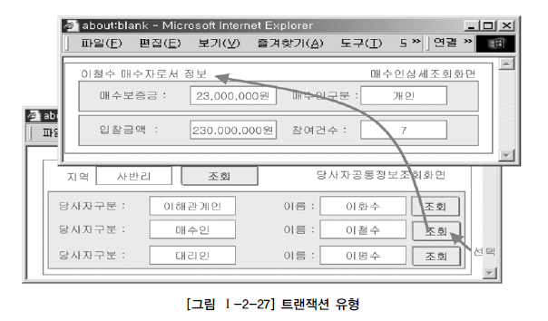

위와 같이 슈퍼타입과 서브타입각각에 대해 독립적으로 트랜잭션이 발생이 되면 슈퍼타입에도 꼭 필요한 속성만을 가지게 하고 서브타입에도 꼭 필요한 속성 및 자신이 타입에 맞는 데이터만 가지게 하기 위해서 모두 분리하여 1:1 관계를 갖도록 한다.
실전프로젝트에서는 데이터량이 대용량으로 존재하는 경우에 공통으로 이용하는 슈퍼타입의 속성의 수가 너무 많아져 디스크 I/O가 많아지는 것을 방지하기 위해 위와 같이 각각을 1:1 관계로 가져가는 경우도 있다.

2) 슈퍼타입+서브타입에 대해 발생되는 트랜잭션에 대해서는 슈퍼타입+서브타입 테이블로 구성
만약 대리인이 10만 건, 매수인 500만 건, 이해관계인 500만 건의 데이터가 존재한다고 가정하고 슈퍼타입과 서브타입이 모두 하나의 테이블로 통합되어 있다고 가정하자. 매수인, 이해관계인에 대한 정보는 배제하고 10만 건뿐인 대리인에 대한 데이터만 처리할 경우 다른 테이블과 같이 데이터가 1천10만 건이 저장되어 있는 곳에서 처리해야 하므로 불필요한 성능저하 현상이 유발된다. 즉 대리인에 대한 처리가 개별적으로 많이 발생하는데 매수인과 이해관계인의 데이터까지 포함되어 있으므로 최대 10만 건을 읽어 처리할 수 있는 업무가 최대 1천10만 건을 읽어 처리하는 경우가 발생될 수 있다.
이와 같이 슈퍼타입과 서브타입을 묶어 트랜잭션이 발생하는 업무특징을 가지고 있을 때에는 다음 데이터 모델과 같이 슈퍼타입+각서브타입을 하나로 묶어 별도의 테이블로 구성하는 것이 효율적이다.
업무적인 특성상 실전 프로젝트에서 슈퍼타입/서브타입모델은 위와 같이 각각이 슈퍼타입+서브타입으로 묶여 구성하는 경우가 많다.

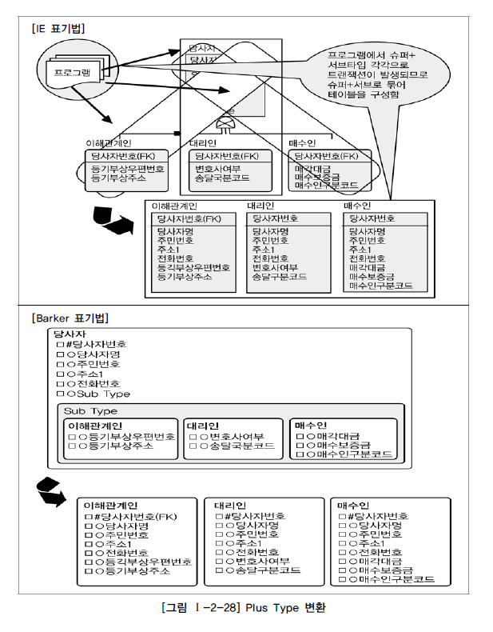

3) 전체를 하나로 묶어 트랜잭션이 발생할 때는 하나의 테이블로 구성
대리인 10만 건, 매수인 500만 건, 이해관계인 500만 건의 데이터가 존재한다고 하더라고 데이터를 처리할 때 대리인, 매수인, 이해관계인을 항상 통합하여 처리한다고 하면 테이블을 개별로 분리해야 불필요한 조인을 유발하거나 불필요한 UNION ALL과 같은 SQL구문이 작성되어 성능이 저하된다. 비록 슈퍼타입과 서브타입의 테이블들을 하나로 묶었을 때 각각의 속성별로 제약사항(NULL/NOT NULL, 기본값, 체크값)을 정확하게 지정하지 못할지라도 대용량이고 성능향상이 필요하다면 하나의 테이블로 묶어서 만들어 준다.

3가지 전개 방식이 아주 간단한 원리 같은데 이것도 실전 프로젝트에서 적용하면 쉽지 않은 경우가 많이 나타난다. 때로는 각각의 유형이 혼합되어 있는 경우도 있다. 혼합된 트랜잭션 유형이 있는 경우는 많이 발생하는 트랜잭션 유형에 따라 구성하면 된다.

### 라. 슈퍼/서브타입 데이터 모델의 변환타입 비교

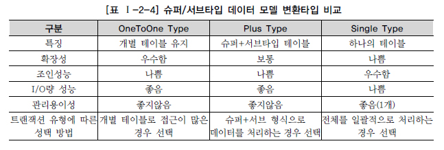

[표 Ⅰ-2-4]와 같이 각 성능이 좋을 수도 나쁠 수도 있기 때문에 변환모델의 선택은 철저하게 데이터베이스에 발생되는 트랜잭션의 유형에 따라 선택을 해야 한다.

## 2. 인덱스 특성을 고려한 PK/FK 데이터베이스 성능향상

### 가. PK/FK 칼럼 순서와 성능개요

가. PK/FK 칼럼 순서와 성능개요 데이터를 조회할 때 가장 효과적으로 처리될 수 있도록 접근경로를 제공하는 오브젝트가 바로 인덱스이다. 일반적으로 데이터베이스 테이블에서는 균형 잡힌 트리구조의 B*Tree구조를 많이 사용한다. 우리는 B*Tree구조의 내부 알고리즘까지는 알 필요가 없더라도 그 구조를 이용할 때 정렬되어 있는 특징으로 인해 데이터베이스 설계에 이 특징에 따라 설계에 반영해야 할 요소에 대해서는 반드시 알고 있어야 좋은 데이터 모델을 만들어 낼 수 있게 된다.
프로젝트에서 PK/FK설계는 업무적 의미로도 매우 중요한 의미를 가지고 있지만 데이터를 접근할 때 경로를 제공하는 성능의 측면에서도 중요한 의미를 가지고 있기 때문에 성능을 고려한 데이터베이스 설계가 될 수 있도록 설계단계 말에 칼럼의 순서를 조정할 필요가 있다.
일반적으로 프로젝트에서는 PK/FK 칼럼 순서의 중요성을 인지하지 못한 채로 데이터 모델링이 되어 있는 그 상태대로 바로 DDL을 생성함으로써 데이터베이스 데이터처리 성능에 문제를 유발하는 경우가 빈번하게 발생이 된다.

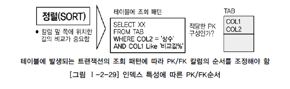

간단한 것 같지만 실전 프로젝트에서는 아주 중요한 내용이 바로 PK순서이다. 성능저하 현상이 많은 부분이 PK가 여러 개의 속성으로 구성된 복합식별자 일 때 PK순서에 대해 별로 고려하지 않고 데이터 모델링을 한 경우에 해당된다.<>br 특히 물리적인 데이터 모델링 단계에서는 스스로 생성된 PK순서 이외에 다른 엔터티로부터 상속받아 발생되는 PK순서까지 항상 주의하여 표시하도록 해야 한다. PK는 해당 해당테이블의 데이터를 접근할 가장 빈번하게 사용되는 유일한 인덱스(Unique Index)를 모두 자동 생성한다. PK순서를 결정하는 기준은 인덱스 정렬구조를 이해한 상태에서 인덱스를 효율적으로 이용할 수 있도록 PK순서를 지정해야 한다. 즉 인덱스의 특징은 여러 개의 속성이 하나의 인덱스로 구성되어 있을 때 앞쪽에 위치한 속성의 값이 비교자로 있어야 인덱스가 좋은 효율을 나타낼 수 있다. 앞쪽에 위치한 속성 값이 가급적 ‘=’ 아니면 최소한 범위 ‘BETWEEN’ ‘< >’가 들어와야 인덱스를 이용할 수 있는 것이다.
데이터 모델링 때 결정한 PK순서와는 다르게 DDL문장을 통해 PK순서를 다르게 생성할 수도 있다. 그러나 대부분의 프로젝트에서는 데이터 모델의 PK 순서에 따라 그대로 PK를 생성한다. 만약 다르게 생성한다고 하더라도 데이터 모델과 데이터베이스 테이블의 구조가 다른 것처럼 보여 유지보수에 어려움이 많을 것이다. 또한 FK라고 하더라도 데이터를 조회할 때 조인의 경로를 제공하는 역할을 수행하므로 FK에 대해서는 반드시 인덱스를 생성하도록 하고 인덱스 칼럼의 순서도 조회의 조건을 고려하여 접근이 가장 효율적인 칼럼 순서대로 인덱스를 생성하도록 주의해야 한다.

### 나. PK칼럼의 순서를 조정하지 않으면 성능이 저하 이유

먼저 데이터 모델링에서 엔터티를 설계하면 그에 따라 DDL이 생성이 되고 생성된 DDL에 따라 인덱스가 생성된다. 이 때 우리가 알아야 할 구조는 인덱스의 정렬구조에 해당된다.
[그림 Ⅰ-2-30]은 인덱스의 정렬구조가 생성되는 구조를 보여주고 있다.

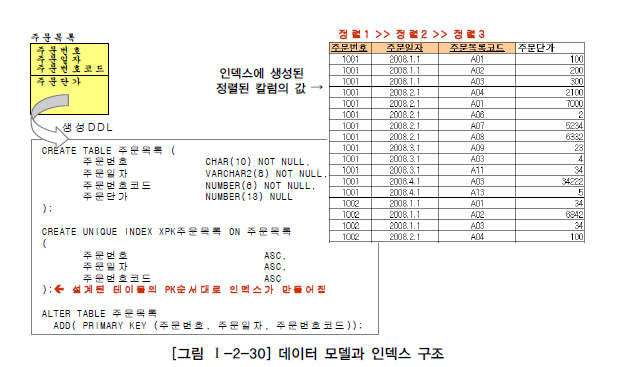

[그림 Ⅰ-2-30]에서 보면 테이블에서 데이터 모델의 PK순서에 따라 DDL이 그대로 생성이 되고 테이블의 데이터가 주문번호가 가장먼저 정렬되고 그에 따라 주문일자가 정렬이 되고 마지막으로 주문목록코드가 정렬되는 것을 알 수 있다. 이러한 정렬 구조로 인해 데이터를 접근하는 트랜잭션의 조건에 따라 다른 인덱스 접근방식을 보여주게 된다.
위와 같은 인덱스의 정렬 구조에서 SQL구문의 조건에 따라 인덱스를 처리하는 범위가 달라지게 된다. 맨 앞에 있는 인덱스 칼럼에 대해 조회 조건이 들어올 때 데이터를 접근하는 방법은 [그림 Ⅰ-2-31]과 같다.

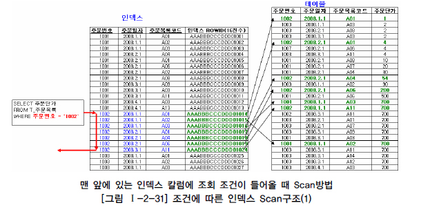

인덱스의 정렬된 첫 번째 칼럼에 비교가 되었기 때문에 순차적으로 데이터를 찾아가게 된다. 맨 앞에 있는 칼럼이 제외된 상태에서 데이터를 조회 할 경우 데이터를 비교하는 범위가 매우 넓어지게 되어 성능 저하를 유발하게 된다.

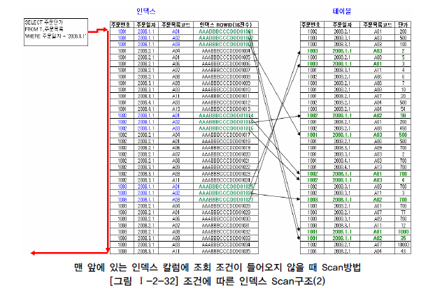

[그림 Ⅰ-2-32]의 예에서는 주문번호에 대한 비교값이 들어오지 않으므로 인해 인덱스 전체를 읽어야만 원하는 데이터를 찾을 수 있게 된다. 이러한 이유로 인덱스를 읽고 테이블 블록에서 읽어 처리하는데 I/O가 많이 발생하게 되므로 옵티마이저는 차라리 테이블에 가서 전체를 읽는 방식으로 처리하게 된다.
이러한 모습으로 인덱스의 정렬구조를 이해한 상태에서 인덱스에 접근하는 접근유형을 비교해보면 어떠한 인덱스를 태워야 하는지 어떠한 조건이 들어와야 데이터를 처리하는 양을 줄여 성능을 향상시킬 수 있는지 알 수 있게 된다.
정리하면, PK의 순서를 인덱스 특징에 맞게 고려하지 않고 바로 그대로 생성하게 되면, 테이블에 접근하는 트랜잭션의 특징에 효율적이지 않은 인덱스가 생성되어 있으므로 인덱스의 범위를 넓게 이용하거나 Full Scan을 유발하게 되어 성능이 저하된다고 정리할 수 있다.
다음은 실전 프로젝트에서 발생되는 예를 통해 PK나 FK의 성능저하 사항을 알아보도록 한다.

### 다. PK순서를 잘못 지정하여 성능이 저하된 경우 - 간단한 오류

입시마스터라는 테이블의 PK는 수험번호+년도+학기로 구성되어 있고 전형과목실적 테이블은 입시마스터 테이블에서 상속받은 수험번호+년도+학기에 전형과목코드로 PK가 구성되어 있는 복합식별자 구조의 테이블이다. 입시마스터에는 200만 건의 데이터가 있고 학사는 4학기로 구성되어 있고 데이터는 5년간 보관되어 있다. 그러므로 한 학기당 평균 2만 건의 데이터가 있다고 가정하자.

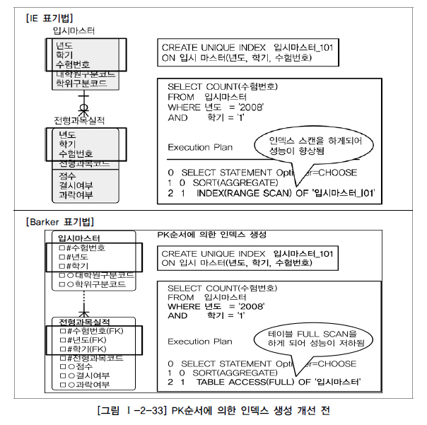

이 테이블 구조에서 다음과 같은 SQL구문이 실행되면 입시마스터 테이블에 있는 인덱스 입시마스터_I01을 이용할 수 있을까?

SELECT COUNT(수험번호) FROM 입시마스터 WHERE 년도 = '2008' AND 학기 = '1'

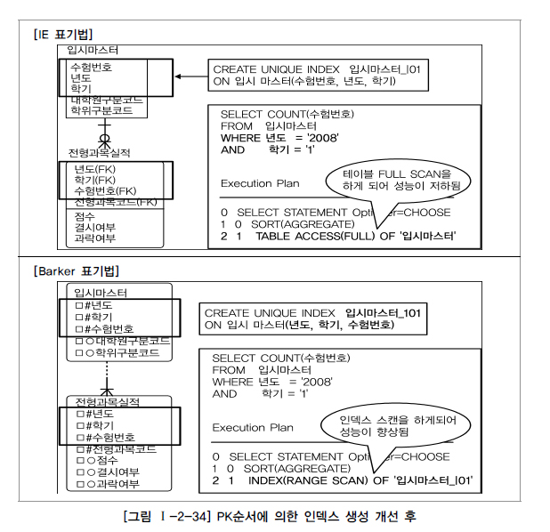

입시마스터_I01 인덱스가 수험번호+년도+학기 중 수험번호에 대한 값이 WHERE절에 들어오지 않으므로 FULL TABLE SCAN이 발생, 200만 건의 데이터를 모두 읽게 되어 성능이 저하되었다.
입시마스터 테이블에 데이터를 조회할 때 년도와 학기에 대한 내용이 빈번하게 들어오므로 [그림 Ⅰ-2-34]와 같이 PK순서를 변경함으로써 인덱스를 이용 가능하도록 할 수 있다. 즉, 생성된 인덱스가 정상적으로 이용이 되어 평균 2만 건의 데이터를 처리함으로써 성능이 개선된 모습이다.

### 라. PK순서를 잘못 지정하여 성능이 저하된 경우 - 복잡한 오류

현금출급기실적의 PK는 거래일자+사무소코드? SQL문장에서는 조회를 할 때 사무소코드가 ‘=’로 들어오고 거래일자에 대해서는 ‘BETWEEN’ 조회를 하고 있다. 이 때 SQL은 정상적으로 인덱스를 이용할 수 있지만 인덱스 효율이 떨어져 성능이 저하되는 경우에 해당된다.

해당 테이블에 발생하는 SQL은 다음과 같이 작성되었다.

SELECT 건수, 금액 FROM 현금출급기실적 WHERE 거래일자 BETWEEN '20040701' AND '20040702' AND 사무소코드 = '000368'

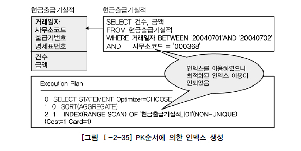

실행계획을 분석해 보면 인덱스가 정상적으로 이용되었기 때문에 SQL문장은 튜닝이 잘된 것으로 착각할 수 있다. 문제는 인덱스를 이용하기는 하는데 얼마나 효율적으로 이용하는지 검증이 필요하다. 아래 그림은 거래일자+사무소코드 순서로 인덱스를 구성한 경우와 사무소코드+거래일자 순서로 인덱스를 구성한 경우 데이터를 처리하는 범위의 차이를 보여주는 그림이다. 거래일자+사무소코드로 구성된 그림을 보면 BETWEEN 비교를 한 거래일자 ‘20040701’이 인덱스의 앞에 위치하기 때문에 범위가 넓어졌고 사무소코드+거래일자로 구성된 인덱스의 경우 ‘=’비교를 한 사무소코드 ‘000368’이 인덱스 앞에 위치하여 범위가 좁아졌다.

그러므로 이 경우 인덱스순서를 고려하여 데이터 모델의 PK순서를 거래일자+사무소코드+출급기번호+명세표번호에서 사무소코드+거래일자+출급기번호+명세표번호로 수정하여 성능을 개선할 수 있다. 물론 테이블의 PK구조를 그대로 둔 상태에서 인덱스만 하나 더 만들어도 성능은 개선될 수 있다. 이 때 이미 만들어진 PK 인덱스가 전혀 사용되지 않는다면 입력, 수정, 삭제시 불필요한 인덱스로 인해 더 성능이 저하되어 좋지 않다. 최적화된 인덱스 생성을 위해 PK순서변경을 통한 인덱스 생성이 바람직하다.
그러면 테이블의 PK의 속성이 A, B가 있을 때 A+B형태로도 빈번하게 조회가 되고 B+A로도 빈번하게 조회되는 경우에는 어떻게 할 것인가? 이 때는 좀 더 자주 이용되는 조회의 형태대로 PK순서를 구성하여 이용하게 하고 순서를 바꾼 인덱스를 추가로 생성하는 것이 필요하다.

## 3. 물리적인 테이블에 FK제약이 걸려있지 않을 경우 인덱스 미생성으로 성능저하

물리적인 테이블에 FK를 사용하지 않아도 데이터 모델 관계에 의해 상속받은 FK속성들은 SQL WHERE 절에서 조인으로 이용되는 경우가 많이 있으므로 FK 인덱스를 생성해야 성능이 좋은 경우가 빈번하다.
다음 그림은 학사기준과 수강신청에 대한 데이터 모델이다. 물리적인 테이블에는 두 테이블사이에 FK 참조무결성 관계가 걸려 있지 않는다고 가정한다. 또한 학사기준에는 데이터가 5만 건이 있고 수강신청에 데이터가 500만 건이 있다고 가정하자.

비록 수강신청 테이블에 있는 학사기준번호가 SQL WHERE 절에 비교자로 들어오지는 않았지만 수강신청 테이블에서 상속받은 학사기준번호에 대해 인덱스를 생성하지 않으므로 인해 학사기준과 수강신청 테이블이 조인이 되면서 500만 건의 수강신청 테이블이 FULL TABLE SCAN이 발생되어 성능이 저하되었다. 이 때는 수강신청 테이블에 FK 인덱스를 생성하여 성능을 개선할 수 있다.

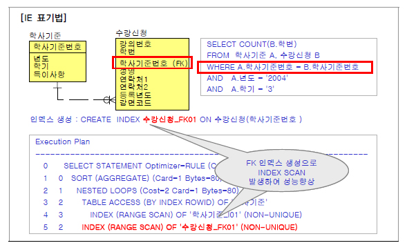

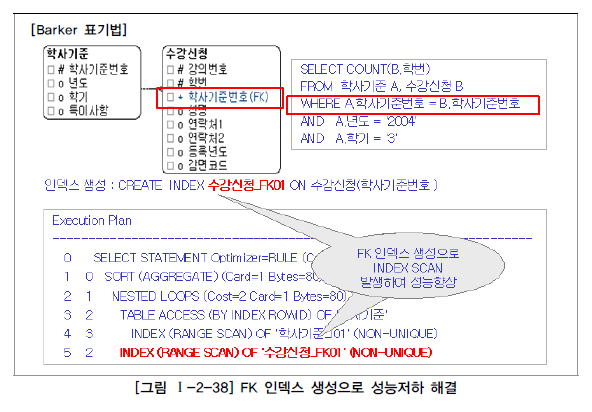

비록 물리적으로 학사기준과 수강신청이 연결되어 있지 않다고 하더라도 학사기준으로부터 상속받은 FK에 대해 FK인덱스를 생성함으로써 SQL문장이 조인이 발생할 때 성능저하를 예방할 수 있다.
FK인덱스를 적절하게 설계하여 구축하지 않았을 경우 개발초기에는 데이터량이 얼마 되지 않아 성능저하가 나타나지 않다가 시스템을 오픈하고 데이터량이 누적될수록 SQL성능이 나빠짐으로 인해 데이터베이스서버에 심각한 장애현상을 초래하는 경우가 많이 있다.
그러므로 물리적인 테이블에 FK 제약 걸었을 때는 반드시 FK인덱스를 생성하도록 하고 FK제약이 걸리지 않았을 경우에는 FK인덱스를 생성하는 것을 기본정책으로 하되 발생되는 트랜잭션에 의해 거의 활용되지 않았을 때에만 FK 인덱스를 지우는 방법으로 하는 것이 적절한 방법이 된다.

