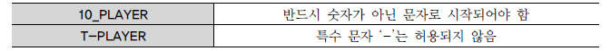

# DDL

## 1. 데이터 유형

데이터 유형은 데이터베이스의 테이블에 특정 자료를 입력할 때, 그 자료를 받아들일 공간을 자료의 유형별로 나누는 기준이라고 생각하면 된다. 즉 특정 칼럼을 정의할 때 선언한 데이터 유형은 그 칼럼이 받아들일 수 있는 자료의 유형을 규정한다. 따라서 선언한 유형이 아닌 다른 종류의 데이터가 들어오려고 하면 데이터베이스는 에러를 발생시킨다. 예를 들어 선수의 몸무게 정보를 모아놓은 공간에 ‘박지성’이라는 문자가 입력되었을 때, 숫자가 의미를 가지는 칼럼 정보에 문자가 입력되었으니 잘못된 데이터라고 판단할 수 있는 것이다. 또한 데이터 유형과 더불어 지정한 크기(SIZE)도 중요한 기능을 제공한다. 즉 선언 당시에 지정한 데이터의 크기를 넘어선 자료가 입력되는 상황도 에러를 발생시키는 중요한 요인이기 때문이다. 데이터베이스에서 사용하는 데이터 유형은 다양한 형태로 제공된다. 벤더별로 SQL 문장의 차이는 적어지고 있지만, 데이터 유형과 내장형 함수 부분에서는 차이가 많은 편이다. 물론 데이터베이스 내부의 구조적인 차이점은 더 크지만 본 가이드 범위를 벗어나므로 여기서는 언급하지 않는다. 숫자 타입을 예를 들어 보면 ANSI/ISO 기준에서는 NUMERIC Type의 하위 개념으로 NUMERIC, DECIMAL, DEC, SMALLINT, INTEGER, INT, BIGINT, FLOAT, REAL, DOUBLE PRECISION을 소개하고 있다. SQL Server와 Sybase는 ANSI/ISO 기준의 하위 개념에 맞추어서 작은 정수형, 정수형, 큰 정수형, 실수형 등 여러 숫자 타입을 제공하고 있으며, 추가로 MONEY, SMALLMONEY 등의 숫자 타입도 가지고 있다. 반면, Oracle은 숫자형 타입에 대해서 NUMBER 한 가지 숫자 타입의 데이터 유형만 지원한다. 사용자 입장에서는 데이터 유형이나 내장형 함수까지 표준화가 되면 편리하겠지만, 벤더별 특화된 기능마다 장단점이 있으므로 사용자가 여러 상황을 고려해서 판단할 문제이다. 그리고 벤더에서 ANSI/ISO 표준을 사용할 때는 기능을 중심으로 구현하므로, 일반적으로 표준과 다른(ex: NUMERIC → NUMBER, WINDOW FUNCTION → ANALYTIC/RANK FUNCTION) 용어를 사용하는 것은 현실적으로 허용이 된다. 테이블의 칼럼이 가지고 있는 대표적인 4가지 데이터 유형을 정리하였다. 아래 4가지 유형 외에도 ANSI/ISO에서는 Binary String Type, Binary Large Object String Type, National Character String Type, Boolean Type 등의 다양한 유형을 표시하고 있다.

문자열 유형의 경우, CHAR 유형과 VARCHAR 유형 중 어느 유형을 지정하는지에 대한 문제가 자주 논의된다. 중요한 것은 저장 영역과 문자열의 비교 방법이다. VARCHAR 유형은 가변 길이이므로 필요한 영역은 실제 데이터 크기뿐이다. 그렇기 때문에 길이가 다양한 칼럼과, 정의된 길이와 실제 데이터 길이에 차이가 있는 칼럼에 적합하다. 저장 측면에서도 CHAR 유형보다 작은 영역에 저장할 수 있으므로 장점이 있다. 또 하나는 비교 방법의 차이이다. CHAR에서는 문자열을 비교할 때 공백(BLANK)을 채워서 비교하는 방법을 사용한다. 공백 채우기 비교에서는 우선 짧은 쪽의 끝에 공백을 추가하여 2개의 데이터가 같은 길이가 되도록 한다. 그리고 앞에서부터 한 문자씩 비교한다. 그렇기 때문에 끝의 공백만 다른 문자열은 같다고 판단된다. 그에 반해 VARCHAR 유형에서는 맨 처음부터 한 문자씩 비교하고 공백도 하나의 문자로 취급하므로 끝의 공백이 다르면 다른 문자로 판단한다.

예) CHAR 유형'AA' = 'AA '

예) VARCHAR 유형 'AA' ≠ 'AA '

가장 많이 사용하는 VARCHAR 유형에 대하여 예를 들어 설명하면, 영문 이름이 VARCHAR(40)으로 40바이트가 지정되더라도 실제 ‘PARK,JISUNG’으로 데이터가 입력되는 경우 11바이트의 공간만을 차지한다. 주민등록번호나 사번처럼 자료들이 고정된 길이의 문자열을 가지지 않는다면 데이터 유형은 VARCHAR 유형을 적용하는 것이 바람직하다. 예를 들자면, 팀이나 운동장의 주소는 정확히 얼마의 문자 길이를 사용할지 예측할 수 없는 경우가 대표적이다. CHAR가 아닌 VARCHAR, NUMERIC 유형에서 정의한 길이나 자릿수의 의미는 해당 데이터 유형이 가질 수 있는 최대한의 한계값을 정의한 것이라고 보아야 한다. 문자열(CHAR와 VARCHAR)에 대한 최대 길이와 NUMBER 칼럼의 정밀도(Precision)를 지정하는 것은 테이블 설계시 반드시 고려해야 할 중요 요소이다. 잘못된 판단은 추후 ALTER TABLE 명령으로 정정할 수는 있지만 데이터가 입력된 상황이라면 처리 과정이 쉽지 않다.

## 2. CREATE TABLE

테이블은 일정한 형식에 의해서 생성된다. 테이블 생성을 위해서는 해당 테이블에 입력될 데이터를 정의하고, 정의한 데이터를 어떠한 데이터 유형으로 선언할 것인지를 결정해야 한다.

### 가. 테이블과 칼럼 정의

테이블에 존재하는 모든 데이터를 고유하게 식별할 수 있으면서 반드시 값이 존재하는 단일 칼럼이나 칼럼의 조합들(후보키) 중에 하나를 선정하여 기본키 칼럼으로 지정한다. 선수 테이블을 예로 들면 ‘선수ID’ 칼럼이 기본키로 적당할 것이다. 기본키는 단일 칼럼이 아닌 여러 개의 칼럼으로도 만들어질 수 있다. 그리고 테이블과 테이블 간에 정의된 관계는 기본키(PRIMARY KEY)와 외부키(FOREIGN KEY)를 활용해서 설정하도록 한다. 선수 테이블에 선수의 소속팀 정보가 같이 존재한다고 가정하면, 특정 팀의 이름이 변경되었을 경우 그 팀에 소속된 선수 데이터를 일일이 찾아서 수정을 하거나, 또한 팀이 해체되었을 경우 선수 관련 정보까지 삭제되는 수정/삭제 이상(Anomaly) 현상이 발생할 수 있다. 이런 이상 현상을 방지하기 위해 팀 정보를 관리하는 팀 테이블을 별도로 분리해서 팀ID와 팀 이름을 저장하고, 선수 테이블에서는 팀ID를 외부키로 참조하게 한다. 데이터 모델링 및 정규화에 대한 내용은 업무를 개선시킬 수 있는 고급 SQL을 작성하는데 필요한 내용이므로 이 부분도 기본적인 내용은 학습할 것을 권고한다.

- 아래는 선수 정보와 함께 K-리그와 관련 있는 다른 데이터들도 같이 살펴본 내용이다.

- K-리그와는 별개로 회사의 부서와 사원 테이블의 칼럼들도 정리한다.

### 나. CREATE TABLE

테이블을 생성하는 구문 형식은 다음과 같다.

CREATE　TABLE　테이블이름 ( 칼럼명1 DATATYPE [DEFAULT 형식], 칼럼명2 DATATYPE [DEFAULT 형식], 칼럼명2 DATATYPE [DEFAULT 형식] ) ;

다음은 테이블 생성 시에 주의해야 할 몇 가지 규칙이다.

\- 테이블명은 객체를 의미할 수 있는 적절한 이름을 사용한다. 가능한 단수형을 권고한다. - 테이블 명은 다른 테이블의 이름과 중복되지 않아야 한다. - 한 테이블 내에서는 칼럼명이 중복되게 지정될 수 없다. - 테이블 이름을 지정하고 각 칼럼들은 괄호 "( )" 로 묶어 지정한다. - 각 칼럼들은 콤마 ","로 구분되고, 테이블 생성문의 끝은 항상 세미콜론 ";"으로 끝난다. - 칼럼에 대해서는 다른 테이블까지 고려하여 데이터베이스 내에서는 일관성 있게 사용하는 것이 좋다.(데이터 표준화 관점) - 칼럼 뒤에 데이터 유형은 꼭 지정되어야 한다. - 테이블명과 칼럼명은 반드시 문자로 시작해야 하고, 벤더별로 길이에 대한 한계가 있다. - 벤더에서 사전에 정의한 예약어(Reserved word)는 쓸 수 없다. - A-Z, a-z, 0-9, _, $, # 문자만 허용된다. - 테이블명이 잘못된 사례

한 테이블 안에서 칼럼 이름은 달라야 하지만, 다른 테이블의 칼럼 이름과는 같을 수 있다. 예를 들면 선수 테이블의 TEAM_ID, 팀 테이블의 TEAM_ID는 같은 칼럼 이름을 가지고 있다. 실제 DBMS는 팀 테이블의 TEAM_ID를 PC나 UNIX의 디렉토리 구조처럼 ‘DB명+DB사용자명+테이블명+칼럼명’처럼 계층적 구조를 가진 전체 경로로 관리하고 있다. 이처럼 같은 이름을 가진 칼럼들은 기본키와 외래키의 관계를 가지는 경우가 많으며, 향후 테이블 간의 조인 조건으로 주로 사용되는 중요한 연결고리 칼럼들이다.

[예제] 다음 조건의 형태로 선수 테이블을 생성한다.

테이블명 : PLAYER 테이블 설명 : K-리그 선수들의 정보를 가지고 있는 테이블 칼럼명 : PLAYER_ID (선수ID) 문자 고정 자릿수 7자리,PLAYER_NAME (선수명) 문자 가변 자릿수 20자리,TEAM_ID (팀ID) 문자 고정 자릿수 3자리,E_PLAYER_NAME (영문선수명) 문자 가변 자릿수 40자리,NICKNAME (선수별명) 문자 가변 자릿수 30자리,JOIN_YYYY (입단년도) 문자 고정 자릿수 4자리,POSITION (포지션) 문자 가변 자릿수 10자리,BACK_NO (등번호) 숫자 2자리,NATION (국적) 문자 가변 자릿수 20자리,BIRTH_DATE (생년월일) 날짜,SOLAR (양/음) 문자 고정 자릿수 1자리,HEIGHT (신장) 숫자 3자리,WEIGHT (몸무게) 숫자 3자리, 제약조건 : 기본키(PRIMARY KEY) → PLAYER_ID (제약조건명은 PLAYER_ID_PK) 값이 반드시 존재 (NOT NULL) → PLAYER_NAME, TEAM_ID

[예제] Oracle CREATE TABLE PLAYER ( PLAYER_ID CHAR(7) NOT NULL, PLAYER_NAME VARCHAR2(20) NOT NULL, TEAM_ID CHAR(3) NOT NULL, E_PLAYER_NAME VARCHAR2(40), NICKNAME VARCHAR2(30), JOIN_YYYY CHAR(4), POSITION VARCHAR2(10), BACK_NO NUMBER(2), NATION VARCHAR2(20), BIRTH_DATE DATE, SOLAR CHAR(1), HEIGHT NUMBER(3), WEIGHT NUMBER(3), CONSTRAINT PLAYER_PK PRIMARY KEY (PLAYER_ID), CONSTRAINT PLAYER_FK FOREIGN KEY (TEAM_ID) REFERENCES TEAM(TEAM_ID) ); 테이블이 생성되었다.

[예제] SQL Server CREATE TABLE PLAYER ( PLAYER_ID CHAR(7) NOT NULL, PLAYER_NAME VARCHAR(20) NOT NULL, TEAM_ID CHAR(3) NOT NULL, E_PLAYER_NAME VARCHAR(40), NICKNAME VARCHAR(30), JOIN_YYYY CHAR(4), POSITION VARCHAR(10), BACK_NO TINYINT, NATION VARCHAR(20), BIRTH_DATE DATE, SOLAR CHAR(1), HEIGHT SMALLINT, WEIGHT SMALLINT, CONSTRAINT PLAYER_PK PRIMARY KEY (PLAYER_ID), CONSTRAINT PLAYER_FK FOREIGN KEY (TEAM_ID) REFERENCES TEAM(TEAM_ID) ); 테이블이 생성되었다.

테이블 생성 예제에서 추가적인 주의 사항 몇 가지를 확인하면 다음과 같다.

\- 테이블 생성시 대/소문자 구분은 하지 않는다. 기본적으로 테이블이나 칼럼명은 대문자로 만들어진다. - DATETIME 데이터 유형에는 별도로 크기를 지정하지 않는다. - 문자 데이터 유형은 반드시 가질 수 있는 최대 길이를 표시해야 한다. - 칼럼과 칼럼의 구분은 콤마로 하되, 마지막 칼럼은 콤마를 찍지 않는다. - 칼럼에 대한 제약조건이 있으면 CONSTRAINT를 이용하여 추가할 수 있다.

제약조건은 PLAYER_NAME, TEAM_ID 칼럼의 데이터 유형 뒤에 NOT NULL을 정의한 사례와 같은 칼럼 LEVEL 정의 방식과, PLAYER_PK PRIMARY KEY, PLAYER_FK FOREIGN KEY 사례처럼 테이블 생성 마지막에 모든 제약조건을 기술하는 테이블 LEVEL 정의 방식이 있다. 하나의 SQL 문장 내에서 두 가지 방식은 혼용해서 사용할 수 있으며, 같은 기능을 가지고 있다.

### 다. 제약조건(CONSTRAINT)

제약조건(CONSTRAINT)이란 사용자가 원하는 조건의 데이터만 유지하기 위한 즉, 데이터의 무결성을 유지하기 위한 데이터베이스의 보편적인 방법으로 테이블의 특정 칼럼에 설정하는 제약이다. 테이블을 생성할 때 제약조건을 반드시 기술할 필요는 없지만, 이후에 ALTER TABLE을 이용해서 추가, 수정하는 경우 데이터가 이미 입력된 경우라면 처리 과정이 쉽지 않으므로 초기 테이블 생성 시점부터 적합한 제약 조건에 대한 충분한 검토가 있어야 한다.

- 제약조건의 종류

- NULL 의미

NULL(ASCII 코드 00번)은 공백(BLANK, ASCII 코드 32번)이나 숫자 0(ZERO, ASCII 48)과는 전혀 다른 값이며, 조건에 맞는 데이터가 없을 때의 공집합과도 다르다. ‘NULL’은 ‘아직 정의되지 않은 미지의 값’이거나 ‘현재 데이터를 입력하지 못하는 경우’를 의미한다.

- DEFAULT 의미

데이터? 기본값(DEFAULT)을 사전에 설정할 수 있다. 데이터 입력시 명시된 값을 지정하지 않은 경우에 NULL 값이 입력되고, DEFAULT 값을 정의했다면 해당 칼럼에 NULL 값이 입력되지 않고 사전에 정의된 기본 값이 자동으로 입력된다.

[예제] 다음 조건의 형태로 팀 테이블을 생성한다.

테이블명 : TEAM 테이블 설명 : K-리그 선수들의 소속팀에 대한 정보를 가지고 있는 테이블 칼럼명 : TEAM_ID (팀 고유 ID) 문자 고정 자릿수 3자리,REGION_NAME (연고지 명) 문자 가변 자릿수 8자리,TEAM_NAME (한글 팀 명) 문자 가변 자릿수 40자리,E-TEAM_NAME (영문 팀 명) 문자 가변 자릿수 50자리 ,ORIG_YYYY (창단년도) 문자 고정 자릿수 4자리,STADIUM_ID (구장 고유 ID) 문자 고정 자릿수 3자리,ZIP_CODE1 (우편번호 앞 3자리) 문자 고정 자릿수 3자리,ZIP_CODE2 (우편번호 뒷 3자리) 문자 고정 자릿수 3자리,ADDRESS (주소) 문자 가변 자릿수 80자리,DDD (지역번호) 문자 가변 자릿수 3자리,TEL (전화번호) 문자 가변 자릿수 10자리,FAX (팩스번호) 문자 가변 자릿수 10자리,HOMEPAGE (홈페이지) 문자 가변 자릿수 50자리OWNER (구단주) 문자 가변 자릿수 10자리, 제약조건 : 기본 키(PRIMARY KEY) → TEAM_ID (제약조건명은 TEAM_ID_PK) NOT NULL → REGION_NAME, TEAM_NAME, STADIUM_ID (제약조건명은 미적용)

[예제] Oracle CREATE TABLE TEAM ( TEAM_ID CHAR(3) NOT NULL, REGION_NAME VARCHAR2(8) NOT NULL, TEAM_NAME VARCHAR2(40) NOT NULL, E_TEAM_NAME VARCHAR2(50), ORIG_YYYY CHAR(4), STADIUM_ID CHAR(3) NOT NULL, ZIP_CODE1 CHAR(3), ZIP_CODE2 CHAR(3), ADDRESS VARCHAR2(80), DDD VARCHAR2(3), TEL VARCHAR2(10), FAX VARCHAR2(10), HOMEPAGE VARCHAR2(50), OWNER VARCHAR2(10), CONSTRAINT TEAM_PK PRIMARY KEY (TEAM_ID), CONSTRAINT TEAM_FK FOREIGN KEY (STADIUM_ID) REFERENCES STADIUM(STADIUM_ID) ); 테이블이 생성되었다.

[예제] SQL Server CREATE TABLE TEAM ( TEAM_ID CHAR(3) NOT NULL, REGION_NAME VARCHAR(8) NOT NULL, TEAM_NAME VARCHAR(40) NOT NULL, E_TEAM_NAME VARCHAR(50), ORIG_YYYY CHAR(4), STADIUM_ID CHAR(3) NOT NULL, ZIP_CODE1 CHAR(3), ZIP_CODE2 CHAR(3), ADDRESS VARCHAR(80), DDD VARCHAR(3), TEL VARCHAR(10), FAX VARCHAR(10), HOMEPAGE VARCHAR(50), OWNER VARCHAR(10), CONSTRAINT TEAM_PK PRIMARY KEY (TEAM_ID), CONSTRAINT TEAM_FK FOREIGN KEY (STADIUM_ID) REFERENCES STADIUM(STADIUM_ID) ); 테이블이 생성되었다.

### 라. 생성된 테이블 구조 확인

테이블을 생성한 후 테이블의 구조가 제대로 만들어졌는지 확인할 필요가 있다. Oracle의 경우 “DESCRIBE 테이블명;” 또는 간략히 “DESC 테이블명;”으로 해당 테이블에 대한 정보를 확인할 수 있다. SQL Server의 경우 “sp_help ‘dbo.테이블명’”으로 해당 테이블에 대한 정보를 확인할 수 있다.

[예제] 선수(PLAYER) 테이블의 구조를 확인한다.

[실행 결과] Oracle DESCRIBE PLAYER; 칼럼 NULL 가능 데이터 유형 ------------------ ----------- -------------- PLAYER_ID NOT NULL CHAR(7) PLAYER_NAME NOT NULL VARCHAR2(20) TEAM_ID NOT NULL CHAR(3) E_PLAYER_NAME VARCHAR2(40) NICKNAME VARCHAR2(30) JOIN_YYYY CHAR(4) POSITION VARCHAR2(10) BACK_NO NUMBER(2) NATION VARCHAR2(20) BIRTH_DATE DATE SOLAR CHAR(1) HEIGHT NUMBER(3) WEIGHT NUMBER(3)

[실행 결과] SQL Server exec sp_help 'dbo.PLAYER' go 칼럼이름 데이터 유형 길이 NULL 가능 --------------- ------------ ------ -------- PLAYER_ID CHAR(7) 7 NO PLAYER_NAME VARCHAR(20) 20 NO TEAM_ID CHAR(3) 3 NO E_PLAYER_NAME VARCHAR(40) 40 YES NICKNAME VARCHAR(30) 30 YES JOIN_YYYY CHAR(4) 4 YES POSITION VARCHAR(10) 10 YES BACK_NO TINYINT 1 YES NATION VARCHAR(20) 20 YES BIRTH_DATE DATE 3 YES SOLAR CHAR(1) 1 YES HEIGHT SMALLINT 2 YES WEIGHT SMALLINT 2 YES

### 마. SELECT 문장을 통한 테이블 생성 사례

다음 절에서 배울 DML 문장 중에 SELECT 문장을 활용해서 테이블을 생성할 수 있는 방법(CTAS: Create Table ~ As Select ~)이 있다. 기존 테이블을 이용한 CTAS 방법을 이용할 수 있다면 칼럼별로 데이터 유형을 다시 재정의 하지 않아도 되는 장점이 있다. 그러나 CTAS 기법 사용시 주의할 점은 기존 테이블의 제약조건 중에 NOT NULL만 새로운 복제 테이블에 적용이 되고, 기본키, 고유키, 외래키, CHECK 등의 다른 제약 조건은 없어진다는 점이다. 제약 조건을 추가하기 위해서는 뒤에 나오는 ALTER TABLE 기능을 사용해야 한다. SQL Server에서는 Select ~ Into ~ 를 활용하여 위와 같은 결과를 얻을 수 있다. 단, 칼럼 속성에 Identity를 사용했다면 Identity 속성까지 같이 적용이 된다.

[예제] 선수(PLAYER) 테이블과 같은 내용으로 TEAM_TEMP라는 복사 테이블을 만들어 본다.

[예제] Oracle CREATE TABLE TEAM_TEMP AS SELECT * FROM TEAM; 테이블이 생성되었다.

[실행 결과] Oracle DESC TEAM_TEMP; 칼럼 NULL 가능 데이터 유형 -------------- -------- ----------- TEAM_ID NOT NULL CHAR(3) REGION_NAME NOT NULL VARCHAR2(4) TEAM_NAME NOT NULL VARCHAR2(40) E_TEAM_NAME VARCHAR2(50) ORIG_YYYY CHAR(4) STADIUM_ID NOT NULL CHAR(3) ZIP_CODE1 CHAR(3) ZIP_CODE2 CHAR(3) ADDRESS VARCHAR2(80) DDD VARCHAR2(3) TEL VARCHAR2(10) FAX VARCHAR2(10) HOMEPAGE VARCHAR2(50) OWNER VARCHAR2(10)

[예제] SQL Server SELECT * INTO TEAM_TEMP FROM TEAM; (1개 행이 영향을 받음)

[실행 결과] SQL Server exec sp_help 'dbo.TEAM_TEMP' go 칼럼이름 데이터 유형 길이 NULL 가능 ------------ -------- ----- --------- TEAM_ID CHAR(3) 3 NO REGION_NAME VARCHAR(8) 8 NO TEAM_NAME VARCHAR(40) 40 NO E_TEAM_NAME VARCHAR(50) 50 YES ORIG_YYYY CHAR(4) 4 YES STADIUM_ID CHAR(3) 3 NO ZIP_CODE1 CHAR(3) 3 YES ZIP_CODE2 CHAR(3) 3 YES ADDRESS VARCHAR(80) 80 YES DDD VARCHAR(3) 3 YES TEL VARCHAR(10) 10 YES FAX VARCHAR(10) 10 YES HOMEPAGE VARCHAR(50) 50 YES OWNER VARCHAR(10) 10 YES

## 3. ALTER TABLE

한 번 생성된 테이블은 특별히 사용자가 구조를 변경하기 전까지 생성 당시의 구조를 유지하게 된다. 처음의 테이블 구조를 그대로 유지하는 것이 최선이지만, 업무적인 요구 사항이나 시스템 운영상 테이블을 사용하는 도중에 변경해야 할 일들이 발생할 수도 있다. 이 경우 주로 칼럼을 추가/삭제하거나 제약조건을 추가/삭제하는 작업을 진행하게 된다.

### 가. ADD COLUMN

다음은 기존 테이블에 필요한 칼럼을 추가하는 명령이다.

ALTER TABLE 테이블명 ADD 추가할 칼럼명 데이터 유형;

주의할 것은 새롭게 추가된 칼럼은 테이블의 마지막 칼럼이 되며 칼럼의 위치를 지정할 수는 없다.

[예제] PLAYER 테이블에 ADDRESS(데이터 유형은 가변 문자로 자릿수 80자리로 설정한다.) 칼럼을 추가한다.

[예제] Oracle ALTER TABLE PLAYER ADD (ADDRESS VARCHAR2(80)); 테이블이 변경되었다.

[실행 결과] Oracle DESC PLAYER; 칼럼 NULL 가능 데이터 유형 -------------- ---------- ------------- PLAYER_ID NOT NULL CHAR(7) PLAYER_NAME NOT NULL VARCHAR2(20) TEAM_ID NOT NULL CHAR(3) E_PLAYER_NAME VARCHAR2(40) NICKNAME VARCHAR2(30) JOIN_YYYY CHAR(4) POSITION VARCHAR2(10) BACK_NO NUMBER(2) NATION VARCHAR2(20) BIRTH_DATE DATE SOLAR CHAR(1) HEIGHT NUMBER(3) WEIGHT NUMBER(3) ADDRESS VARCHAR2(80) ☜ 추가된 열

[예제] SQL Server ALTER TABLE PLAYER ADD ADDRESS VARCHAR(80); 명령이 완료되었다.

[실행 결과] SQL Server exec sp_help 'dbo.PLAYER' go 칼럼이름 데이터 유형 길이 NULL 가능 ----------- ---------- ----- ------- PLAYER_ID CHAR(7) 7 NO PLAYER_NAME VARCHAR(20 20 NO TEAM_ID CHAR(3) 3 NO E_PLAYER_NAME VARCHAR(40) 40 YES NICKNAME VARCHAR(30) 30 YES JOIN_YYYY CHAR(4) 4 YES POSITION VARCHAR(10) 10 YES BACK_NO TINYINT 1 YES NATION VARCHAR(20) 20 YES BIRTH_DATE DATE 3 YES SOLAR CHAR(1) 1 YES HEIGHT SMALLINT 2 YES WEIGHT SMALLINT 2 YES ADDRESS VARCHAR(80) 80 YES ☜ 추가된 열

### 나. DROP COLUMN\

DROP COLUMN은 테이블에서 필요 없는 칼럼을 삭제할 수 있으며, 데이터가 있거나 없거나 모두 삭제 가능하다. 한 번에 하나의 칼럼만 삭제 가능하며, 칼럼 삭제 후 최소 하나 이상의 칼럼이 테이블에 존재해야 한다. 주의할 부분은 한 번 삭제된 칼럼은 복구가 불가능하다. 다음은 테이블의 불필요한 칼럼을 삭제하는 명령이다.

ALTER TABLE 테이블명 DROP COLUMN 삭제할 칼럼명;

[예제] 앞에서 PLAYER 테이블에 새롭게 추가한 ADDRESS 칼럼을 삭제한다.

[예제] Oracle ALTER TABLE PLAYER DROP COLUMN ADDRESS; 테이블이 변경되었다.

[예제] SQL Server ALTER TABLE PLAYER DROP COLUMN ADDRESS; 명령이 완료되었다.

실행 결과에서 삭제된 칼럼 ADDRESS가 존재하지 않는 것을 확인할 수 있다.

[실행 결과] Oracle DESC PLAYER; 칼럼 NULL 가능 데이터 유형 -------------- --------- ----------- PLAYER_ID NOT NULL CHAR(7) PLAYER_NAME NOT NULL VARCHAR2(20) TEAM_ID NOT NULL CHAR(3) E_PLAYER_NAME VARCHAR2(40) NICKNAME VARCHAR2(30) JOIN_YYYY CHAR(4) POSITION VARCHAR2(10) BACK_NO NUMBER(2) NATION VARCHAR2(20) BIRTH_DATE DATE SOLAR CHAR(1) HEIGHT NUMBER(3) WEIGHT NUMBER(3)

[실행 결과] SQL Server exec sp_help 'dbo.PLAYER' go 칼럼이름 데이터 유형 길이 NULL 가능 -------------- ---------- ----- -------- PLAYER_ID CHAR(7) 7 NO PLAYER_NAME VARCHAR(20) 20 NO TEAM_ID CHAR(3) 3 NO E_PLAYER_NAME VARCHAR(40) 40 YES NICKNAME VARCHAR(30) 30 YES JOIN_YYYY CHAR(4) 4 YES POSITION VARCHAR(10) 10 YES BACK_NO TINYINT 1 YES NATION VARCHAR(20) 20 YES BIRTH_DATE DATE 3 YES SOLAR CHAR(1) 1 YES HEIGHT SMALLINT 2 YES WEIGHT SMALLINT 2 YES

### 다. MODIFY COLUMN

테이블에 존재하는 칼럼에 대해서 ALTER TABLE 명령을 이용해 칼럼의 데이터 유형, 디폴트(DEFAULT) 값, NOT NULL 제약조건에 대한 변경을 포함할 수 있다. 다음은 테이블의 칼럼에 대한 정의를 변경하는 명령이다.

[Oracle] ALTER TABLE 테이블명 MODIFY (칼럼명1 데이터 유형 [DEFAULT 식] [NOT NULL], 칼럼명2 데이터 유형 …);

[SQL Server] ALTER TABLE 테이블명 ALTER (칼럼명1 데이터 유형 [DEFAULT 식] [NOT NULL], 칼럼명2 데이터 유형 …);

칼럼을 변경할 때는 몇 가지 사항을 고려해서 변경해야 한다.

\- 해당 칼럼의 크기를 늘릴 수는 있지만 줄이지는 못한다. 이는 기존의 데이터가 훼손될 수 있기 때문이다. - 해당 칼럼이 NULL 값만 가지고 있거나 테이블에 아무 행도 없으면 칼럼의 폭을 줄일 수 있다. - 해당 칼럼이 NULL 값만을 가지고 있으면 데이터 유형을 변경할 수 있다. - 해당 칼럼의 DEFAULT 값을 바꾸면 변경 작업 이후 발생하는 행 삽입에만 영향을 미치게 된다. - 해당 칼럼에 NULL 값이 없을 경우에만 NOT NULL 제약조건을 추가할 수 있다.

[예제] TEAM 테이블의 ORIG_YYYY 칼럼의 데이터 유형을 CHAR(4)→VARCHAR2(8)으로 변경하고, 향후 입력되는 데이터의 DEFAULT 값으로 '20020129'을 적용하고, 모든 행의 ORIG_YYYY 칼럼에 NULL이 없으므로 제약조건을 NULL → NOT NULL로 변경한다.

[예제] Oracle ALTER TABLE TEAM_TEMP MODIFY (ORIG_YYYY VARCHAR2(8) DEFAULT '20020129' NOT NULL); 테이블이 변경되었다.

[예제] SQL Server ALTER TABLE TEAM_TEMP ALTER COLUMN ORIG_YYYY VARCAHR(8) NOT NULL; 명령이 완료되었다. ALTER TABLE TEAM_TEMP ADD CONSTRAINT DF_ORIG_YYYY DEFAULT '20020129' FOR ORIG_YYYY; 명령이 완료되었다.

실행 결과에서 테이블 구조의 변경 사항을 확인할 수 있다.

[실행 결과] Oracle DESC TEAM_TEMP; 칼럼 NULL 가능 데이터 유형 ----------------- --------- ---------- TEAM_ID NOT NULL CHAR(3) REGION_NAME NOT NULL VARCHAR2(4) TEAM_NAME NOT NULL VARCHAR2(40) E_TEAM_NAME VARCHAR2(50) ORIG_YYYY NOT NULL VARCHAR2(8) ☜ 기본값 '20020129' STADIUM_ID NOT NULL CHAR(3) ZIP_CODE1 CHAR(3) ZIP_CODE2 CHAR(3) ADDRESS VARCHAR2(80) DDD VARCHAR2(3) TEL VARCHAR2(10) FAX VARCHAR2(10) HOMEPAGE VARCHAR2(50) OWNER VARCHAR2(10)

[실행 결과] SQL Server exec sp_help 'dbo.TEAM_TEMP' go 칼럼이름 데이터 유형 길이 NULL 가능 -------------- --------- ----- ---------- TEAM_ID CHAR(3) 3 NO REGION_NAME VARCHAR(8) 8 NO TEAM_NAME VARCHAR(40) 40 NO E_TEAM_NAME VARCHAR(50) 50 YES ORIG_YYYY CHAR(4) 4 YES STADIUM_ID CHAR(3) 3 NO ZIP_CODE1 CHAR(3) 3 YES ZIP_CODE2 CHAR(3) 3 YES ADDRESS VARCHAR(80) 80 YES DDD VARCHAR(3) 3 YES TEL VARCHAR(10) 10 YES FAX VARCHAR(10) 10 YES HOMEPAGE VARCHAR(50) 50 YES OWNER VARCHAR(10) 10 YES constraint_type constraint_name constraint_keys ----------------------- ------------ ------------- DEFAULT on column ORIG_YYYY DF_ORIG_YYYY ('20020129')

- RENAME COLUMN

아래는 테이블을 생성하면서 만들어졌던 칼럼명을 어떤 이유로 불가피하게 변경해야 하는 경우에 유용하게 쓰일 수 있는 RENAME COLUMN 문구이다.

ALTER TABLE 테이블명 RENAME COLUMN 변경해야 할 칼럼명 TO 새로운 칼럼명; /div>

RENAME COLUMN으로 칼럼명이 변경되면, 해당 칼럼과 관계된 제약조건에 대해서도 자동으로 변경되는 장점이 있지만, ADD/DROP COLUMN 기능처럼 ANSI/ISO에 명시되어 있는 기능이 아니고 Oracle 등 일부 DBMS에서만 지원하는 기능이다.

ALTER TABLE PLAYER RENAME COLUMN PLAYER_ID TO TEMP_ID; 테이블이 변경되었다. ALTER TABLE PLAYER RENAME COLUMN TEMP_ID TO PLAYER_ID; 테이블이 변경되었다.

SQL Server에서는 sp_rename 저장 프로시저를 이용하여 칼럼 이름을 변경할 수 있다.

sp_rename 변경해야 할 칼럼명, 새로운 칼럼명, 'COLUMN';

sp_rename 'dbo.TEAM_TEMP.TEAM_ID', 'TEAM_TEMP_ID', 'COLUMN'; 주의: 엔터티 이름 부분을 변경하면 스크립트 및 저장 프로시저를 손상시킬 수 있다.

### 라. DROP CONSTRAINT

테이블 생성 시 부여했던 제약조건을 삭제하는 명령어 형태는 다음과 같다.

ALTER TABLE 테이블명 DROP CONSTRAINT 제약조건명;

[예제] PLAYER 테이블의 외래키 제약조건을 삭제한다.

[예제] Oracle ALTER TABLE PLAYER DROP CONSTRAINT PLAYER_FK; 테이블이 변경되었다.

[예제] SQL Server ALTER TABLE PLAYER DROP CONSTRAINT PLAYER_FK; 명령이 완료되었다.

### 마. ADD CONSTRAINT

테이블 생성 시 제약조건을 적용하지 않았다면, 생성 이후에 필요에 의해서 제약조건을 추가할 수 있다. 다음은 특정 칼럼에 제약조건을 추가하는 명령어 형태이다.

ALTER TABLE 테이블명 ADD CONSTRAINT 제약조건명 제약조건 (칼럼명);

[예제] PLAYER 테이블에 TEAM 테이블과의 외래키 제약조건을 추가한다. 제약조건명은 PLAYER_FK로 하고, PLAYER 테이블의 TEAM_ID 칼럼이 TEAM 테이블의 TEAM_ID를 참조하는 조건이다.

[예제] Oracle ALTER TABLE PLAYER ADD CONSTRAINT PLAYER_FK FOREIGN KEY (TEAM_ID) REFERENCES TEAM(TEAM_ID); 테이블이 변경되었다.

[예제] SQL Server ALTER TABLE PLAYER ADD CONSTRAINT PLAYER_FK FOREIGN KEY (TEAM_ID) REFERENCES TEAM(TEAM_ID); 명령이 완료되었다.

[예제] PLAYER 테이블이 참조하는 TEAM 테이블을 제거해본다.

[예제] Oracle DROP TABLE TEAM; ERROR: 외래 키에 의해 참조되는 고유/기본 키가 테이블에 있다. ※ 테이블은 삭제되지 않음

[예제] SQL Server DROP TABLE TEAM; ERROR: 엔터티 'TEAM'은 FOREIGN KEY 제약 조건을 참조하므로 삭제할 수 없다. ※ 테이블은 삭제되지 않음

[예제] PLAYER 테이블이 참조하는 TEAM 테이블의 데이터를 삭제해본다.

[예제] Oracle DELETE TEAM WHERE TEAM_ID = 'K10'; ERROR: 무결성 제약조건(SCOTT.PLAYER_FK)이 위배되었다. 자식 레코드가 발견되었다. ※ 데이터는 삭제되지 않음

[예제] SQL Server DELETE TEAM WHERE TEAM_ID = 'K10'; ERROR: FOREIGN KEY 제약 조건을 참조하므로 삭제할 수 없다. ※ 데이터는 삭제되지 않음

위와 같이 참조 제약조건을 추가하면 PLAYER 테이블의 TEAM_ID 칼럼이 TEAM 테이블의 TEAM_ID 칼럼을 참조하게 된다. 참조 무결성 옵션에 따라서 만약 TEAM 테이블이나 TEAM 테이블의 데이터를 삭제하려 할 경우 외부(PLAYER 테이블)에서 참조되고 있기 때문에 삭제가 불가능하게 제약을 할 수 있다. 즉, 외부키(FK)를 설정함으로써 실수에 의한 테이블 삭제나 필요한 데이터의 의도하지 않은 삭제와 같은 불상사를 방지하는 효과를 볼 수 있다.

## 4. RENAME TABLE

RENAME 명령어를 사용하여 테이블의 이름을 변경할 수 있다.

RENAME 변경전 테이블명 TO 변경후 테이블명;

SQL Server에서는 sp_rename을 이용하여 테이블 이름을 변경할 수 있다.

sp_rename 변경전 테이블명, 변경후 테이블명;

[예제] RENAME 문장을 이용하여 TEAM 테이블명을 다른 이름으로 변경하고, 다시 TEAM 테이블로 변경한다.

[예제] Oracle RENAME TEAM TO TEAM_BACKUP; 테이블 이름이 변경되었다. RENAME TEAM_BACKUP TO TEAM; 테이블 이름이 변경되었다.

[예제] SQL Server sp_rename 'dbo.TEAM','TEAM_BACKUP'; 주의: 엔터티 이름 부분을 변경하면 스크립트 및 저장 프로시저를 손상시킬 수 있다. sp_rename 'dbo.TEAM_BACKUP','TEAM'; 주의: 엔터티 이름 부분을 변경하면 스크립트 및 저장 프로시저를 손상시킬 수 있다.

## 5. DROP TABLE

테이블을 잘못 만들었거나 테이블이 더 이상 필요 없을 경우 해당 테이블을 삭제해야 한다. 다음은 불필요한 테이블을 삭제하는 명령이다.

DROP TABLE 테이블명 [CASCADE CONSTRAINT];

DROP 명령어를 사용하면 테이블의 모든 데이터 및 구조를 삭제한다. CASCADE CONSTRAINT 옵션은 해당 테이블과 관계가 있었던 참조되는 제약조건에 대해서도 삭제한다는 것을 의미한다. SQL Server에서는 CASCADE 옵션이 존재하지 않으며 테이블을 삭제하기 전에 참조하는 FOREIGN KEY 제약 조건 또는 참조하는 테이블을 먼저 삭제해야 한다.

[예제] PLAYER 테이블을 제거한다.

[예제] Oracle DROP TABLE PLAYER; 테이블이 삭제되었다. DESC PLAYER; ERROR: 설명할 객체를 찾을 수 없다.

[예제] SQL Server DROP TABLE PLAYER; 명령이 완료되었다. exec sp_help 'dbo.PLAYER'; 메시지 15009, 수준 16, 상태 1, 프로시저 sp_help, 줄 66 데이터베이스 ‘northwind'에 엔터티 'dbo.player'이(가) 없거나 이 작업에 적합하지 않다.

## 6. TRUNCATE TABLE

TRUNCATE TABLE은 테이블 자체가 삭제되는 것이 아니고, 해당 테이블에 들어있던 모든 행들이 제거되고 저장 공간을 재사용 가능하도록 해제한다. 테이블 구조를 완전히 삭제하기 위해서는 DROP TABLE을 실행하면 된다.

TRUNCATE TABLE PLAYER;

[예제] TRUNCATE TABLE을 사용하여 해당 테이블의 모든 행을 삭제하고 테이블 구조를 확인한다.

[예제] Oracle TRUNCATE TABLE TEAM; 테이블이 트렁케이트되었다.

[예제] SQL Server TRUNCATE TABLE TEAM; 명령이 완료되었다.

[실행 결과] Oracle DESC TEAM; 칼럼 NULL 가능 데이터 유형 ----------------- ---------- --------- TEAM_ID NOT NULL CHAR(3) REGION_NAME NOT NULL VARCHAR2(4) TEAM_NAME NOT NULL VARCHAR2(40) E_TEAM_NAME VARCHAR2(50) ORIG_YYYY CHAR(4) STADIUM_ID NOT NULL CHAR(3) ZIP_CODE1 CHAR(3) ZIP_CODE2 CHAR(3) ADDRESS VARCHAR2(80) DDD VARCHAR2(3) TEL VARCHAR2(10) FAX VARCHAR2(10) HOMEPAGE VARCHAR2(50) OWNER VARCHAR2(10)

[실행 결과] SQL Server exec sp_help 'dbo.TEAM' go 칼럼이름 데이터 유형 길이 NULL 가능 ---------------- ---------- ----- --------- TEAM_ID CHAR(3) 3 NO REGION_NAME VARCHAR(8) 8 NO TEAM_NAME VARCHAR(40) 40 NO E_TEAM_NAME VARCHAR(50) 50 YES ORIG_YYYY CHAR(4) 4 YES STADIUM_ID CHAR(3) 3 NO ZIP_CODE1 CHAR(3) 3 YES ZIP_CODE2 CHAR(3) 3 YES ADDRESS VARCHAR(80) 80 YES DDD VARCHAR(3) 3 YES TEL VARCHAR(10) 10 YES FAX VARCHAR(10) 10 YES HOMEPAGE VARCHAR(50) 50 YES OWNER VARCHAR(10) 10 YES

[예제] DROP TABLE을 사용하여 해당 테이블을 제거하고 테이블 구조를 확인한다.

[예제] Oracle DROP TABLE TEAM; 테이블이 삭제되었다. DESC TEAM; ERROR: 설명할 객체를 찾을 수 없다.

[예제] SQL Server DROP TABLE TEAM; 명령이 완료되었다. exec sp_help 'dbo.TEAM'; 메시지 15009, 수준 16, 상태 1, 프로시저 sp_help, 줄 66 데이터베이스 'northwind'에 엔터티 'dbo.TEAM'이(가) 없거나 이 작업에 적합하지 않다.

DROP TABLE의 경우는 테이블 자체가 없어지기 때문에 테이블 구조를 확인할 수 없다. 반면 TRUNCATE TABLE의 경우는 테이블 구조는 그대로 유지한 체 데이터만 전부 삭제하는 기능이다. TRUNCATE는 데이터 구조의 변경 없이 테이블의 데이터를 일괄 삭제하는 명령어로 DML로 분류할 수도 있지만 내부 처리 방식이나 Auto Commit 특성 등으로 인해 DDL로 분류하였다. 테이블에 있는 데이터를 삭제하는 명령어는 TRUNCATE TABLE 명령어 이외에도 다음 DML 절에서 살펴볼 DELETE 명령어가 있다. 그러나 DELETE와 TRUNCATE는 처리하는 방식 자체가 다르다. 테이블의 전체 데이터를 삭제하는 경우, 시스템 활용 측면에서는 DELETE TABLE 보다는 시스템 부하가 적은 TRUNCATE TABLE을 권고한다. 단, TRUNCATE TABLE의 경우 정상적인 복구가 불가능하므로 주의해야 한다.

