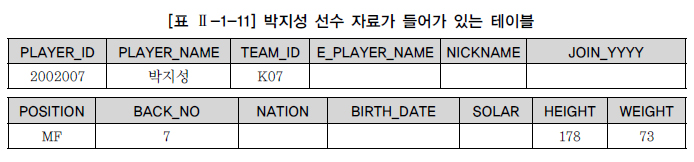
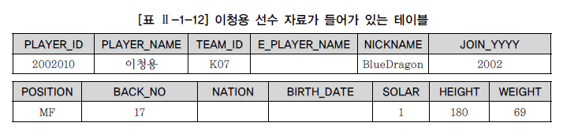
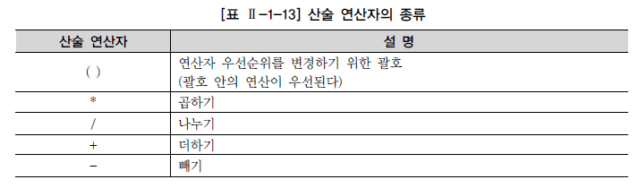

# DML

앞 절에서 테이블을 생성하고 생성된 테이블의 구조를 변경하는 명령어에 대해서 알아보았다. 지금부터는 만들어진 테이블에 관리하기를 원하는 자료들을 입력, 수정, 삭제, 조회하는 DML(DATA MANIPULATION LANGUAGE) 사용 방법을 알아본다.

## 1. INSERT

테이블에 데이터를 입력하는 방법은 두 가지 유형이 있으며 한 번에 한 건만 입력된다.

▶ INSERT INTO 테이블명 (COLUMN_LIST)VALUES (COLUMN_LIST에 넣을 VALUE_LIST); ▶ INSERT INTO 테이블명VALUES (전체 COLUMN에 넣을 VALUE_LIST);

해당 칼럼명과 입력되어야 하는 값을 서로 1:1로 매핑해서 입력하면 된다. 해당 칼럼의 데이터 유형이 CHAR나 VARCHAR2 등 문자 유형일 경우 『 ' 』(SINGLE QUOTATION)로 입력할 값을 입력한다. 숫자일 경우 『 ' 』(SINGLE QUOTATION)을 붙이지 않아야 한다. 첫 번째 유형은 테이블의 칼럼을 정의할 수 있는데, 이때 칼럼의 순서는 테이블의 칼럼 순서와 매치할 필요는 없으며, 정의하지 않은 칼럼은 Default로 NULL 값이 입력된다. 단, Primary Key나 Not NULL 로 지정된 칼럼은 NULL이 허용되지 않는다. 두 번째 유형은 모든 칼럼에 데이터를 입력하는 경우로 굳이 COLUMN_LIST를 언급하지 않아도 되지만, 칼럼의 순서대로 빠짐없이 데이터가 입력되어야 한다.

[예제] 선수 테이블에 박지성 선수의 데이터를 일부 칼럼만 입력한다.

[예제] ▶ 테이블명 : PLAYER INSERT INTO PLAYER (PLAYER_ID, PLAYER_NAME, TEAM_ID, POSITION, HEIGHT, WEIGHT, BACK_NO) VALUES ('2002007', '박지성', 'K07', 'MF', 178, 73, 7); 1개의 행이 만들어졌다.

[표 Ⅱ-1-11]은 데이터베이스 내에 있는 PLAYER 테이블에 박지성 선수 정보가 입력되어 있는 것을 나타낸 것이다. INSERT 문장에서 BACK_NO가 마지막에 정의가 되었더라도 테이블에는 칼럼 순서대로 데이터가 입력되었다. 칼럼명이 정의되지 않은 경우 NULL 값이 입력되었다.

[예제] 해당 테이블에 이청용 선수의 데이터를 입력해본다.

[예제] INSERT INTO PLAYER VALUES ('2002010','이청용','K07','','BlueDragon','2002','MF','17',NULL, NULL,'1',180,69); 1개의 행이 만들어졌다.

데이터를 입력하는 경우 정의되지 않은 미지의 값인 E_PLAYER_NAME은 두 개의 『 '' 』SINGLE QUOTATION을 붙여서 표현하거나, NATION이나 BIRTH_DATE의 경우처럼 NULL이라고 명시적으로 표현할 수 있다.

## 2. UPDATE

입력한 정보 중에 잘못 입력되거나 변경이 발생하여 정보를 수정해야 하는 경우가 발생할 수 있다. 다음은 UPDATE 문장의 기본 형태이다. UPDATE 다음에 수정되어야 할 칼럼이 존재하는 테이블명을 입력하고 SET 다음에 수정되어야 할 칼럼명과 해당 칼럼에 수정되는 값으로 수정이 이루어진다.

UPDATE 테이블명 SET 수정되어야 할 칼럼명 = 수정되기를 원하는 새로운 값;

[예제] 선수 테이블의 백넘버를 일괄적으로 99로 수정한다.

[예제] UPDATE PLAYER SET BACK_NO = 99; 480개의 행이 수정되었다.

[예제] 선수 테이블의 포지션을 일괄적으로 ‘MF’로 수정한다.

[예제] UPDATE PLAYER SET POSITION = 'MF'; 480개의 행이 수정되었다.

## 3. DELETE

테이블의 정보가 필요 없게 되었을 경우 데이터 삭제를 수행한다. 다음은 DELETE 문장의 기본적인 형태이다. DELETE FROM 다음에 삭제를 원하는 자료가 저장되어 있는 테이블명을 입력하고 실행한다. 이때 FROM 문구는 생략이 가능한 키워드이며, 뒤에서 배울 WHERE 절을 사용하지 않는다면 테이블의 전체 데이터가 삭제된다.

DELETE [FROM] 삭제를 원하는 정보가 들어있는 테이블명;

[예제] 선수 테이블의 데이터를 전부 삭제한다.

[예제] DELETE FROM PLAYER; 480개의 행이 삭제되었다.

참고로 데이터베이스는 DDL 명령어와 DML 명령어를 처리하는 방식에 있어서 차이를 보인다. DDL(CREATE, ALTER, RENAME, DROP) 명령어인 경우에는 직접 데이터베이스의 테이블에 영향을 미치기 때문에 DDL 명령어를 입력하는 순간 명령어에 해당하는 작업이 즉시(AUTO COMMIT) 완료된다. 하지만 DML(INSERT, UPDATE, DELETE, SELECT) 명령어의 경우, 조작하려는 테이블을 메모리 버퍼에 올려놓고 작업을 하기 때문에 실시간으로 테이블에 영향을 미치는 것은 아니다. 따라서 버퍼에서 처리한 DML 명령어가 실제 테이블에 반영되기 위해서는 COMMIT 명령어를 입력하여 TRANSACTION을 종료해야 한다. 그러나 SQL Server의 경우는 DML의 경우도 AUTO COMMIT으로 처리되기 때문에 실제 테이블에 반영하기 위해 COMMIT 명령어를 입력할 필요가 없다. 테이블의 전체 데이터를 삭제하는 경우, 시스템 활용 측면에서는 삭제된 데이터를 로그로 저장하는 DELETE TABLE 보다는 시스템 부하가 적은 TRUNCATE TABLE을 권고한다. 단, TRUNCATE TABLE의 경우 삭제된 데이터의 로그가 없으므로 ROLLBACK이 불가능하므로 주의해야 한다. 그러나 SQL Server의 경우 사용자가 임의적으로 트랜잭션을 시작한 후 TRUNCATE TABLE을 이용하여 데이터를 삭제한 이후 오류가 발견되어, 다시 복구를 원할 경우 ROLLBACK 문을 이용하여 테이블 데이터를 원 상태로 되돌릴 수 있다. 트랜잭션과 COMMIT, ROLLBACK에 대해서는 다음 절에서 설명한다.

## 4. SELECT

사용자가 입력한 데이터는 언제라도 조회가 가능하다. 앞에서 입력한 자료들을 조회해보는 SQL 문은 다음과 같다. (별도 제공한 SQL SCRIPT를 통해 모든 테이블의 데이터를 새롭게 생성한 후, 이후 본 가이드 내용을 진행하기 바STINCT] 보고??들이 있는 테이블명; - ALL : Default 옵션이므로 별도로 표시하지 않아도 된다. 중복된 데이터가 있어도 모두 출력한다. - DISTINCT : 중복된 데이터가 있는 경우 1건으로 처리해서 출력한다.

[예제] 조회하기를 원하는 칼럼명을 SELECT 다음에 콤마 구분자(,)로 구분하여 나열하고, FROM 다음에 해당 칼럼이 존재하는 테이블명을 입력하여 실행시킨다. 입력한 선수들의 데이터를 조회한다.

[예제] SELECT PLAYER_ID, PLAYER_NAME, TEAM_ID, POSITION, HEIGHT, WEIGHT, BACK_NO FROM PLAYER;

[실행 결과] PLAYER_ID PLAYER_NAME TEAM_ID POSITION BACK_NO HEIGHT WEIGHT -------- ---------- ------ ------ ------- ----- ------ 2007155 정경량 K05 MF 19 173 65 2010025 정은익 K05 MF 35 176 63 2012001 레오마르 K05 MF 5 183 77 2008269 명재용 K05 MF 7 173 63 2007149 변재섭 K05 MF 11 170 63 2012002 보띠 K05 MF 10 174 68 2011123 비에라 K05 MF 21 176 73 2008460 서동원 K05 MF 22 184 78 2010019 안대현 K05 MF 25 179 72 2010018 양현정 K05 MF 14 176 72 2010022 유원섭 K05 MF 37 180 77 2012008 김수철 K05 MF 34 171 68 2012013 임다한 K05 DF 39 181 67 ： ： ： ： ： ： ： 480개의 행이 선택되었다.

- DISTINCT 옵션

[예제 및 실행 결과] SELECT ALL POSITION FROM PLAYER; ALL은 생략 가능한 키워드이므로 아래 SQL 문장도 같은 결과를 출력한다, SELECT POSITION FROM PLAYER; 480개의 행이 선택되었다.

[예제] SELECT DISTINCT POSITION FROM PLAYER;

[실행 결과] Oracle POSITION -------- GK DF FW MF 5개의 행이 선택되었다.

실행 결과를 보면 480개의 행이 모두 출력된 것이 아니라 포지션의 종류인 4개의 행과 포지션 데이터가 아직 미정인 NULL까지 5건의 데이터만 출력이 되었다.

- WILDCARD 사용하기

입력한 정보들을 보기위해 PLAYER 테이블에서 보고 싶은 정보들이 있는 칼럼들을 선택하여 조회해보는 것이다. 해당 테이블의 모든 칼럼 정보를 보고 싶을 경우에는 와일드카드로 애스터리스크(*)를 사용하여 조회할 수 있다.

SELECT * FROM 테이블명;

[예제] 입력한 선수들의 정보를 모두 조회한다.

[예제] SELECT * FROM PLAYER;

[실행 결과] PLAYER_ID PLAYER_NAME TEAM_ID E_PLAYER_NAME NICKNAME JOIN_YYYY POSITION BACK_NO NATION BIRTH_DATE SOLAR HEIGHT WEIGHT -------- ---------- ------ ---------------- -------- -------- ------- ------- ------ ---------- ----- ------ ------ 2007155 정경량 K05 JEONG, KYUNGRYANG 2006 MF 19 1983-12-22 1 173 65 2010025 정은익 K05 MF 35 1991-03-09 1 176 63 2012001 레오마르 K05 Leomar Leiria 레오 2012 MF 5 1981-06-26 1 183 77 2008269 명재용 K05 MYUNG, JAEYOENG 2007 MF 7 1983-02-26 2 173 63 2007149 변재섭 K05 BYUN, JAESUB 작은탱크 2007 MF 11 1985-09-17 2 170 63 2012002 보띠 K05 Raphael JoseBotti Zacarias Sena Botti 2012 MF 10 1991-02-23 1 174 68 2011123 비에라 K05 Vieira 2011 MF 21 1984-02-25 1 176 73 2008460 서동원 K05 SEO, DONGWON 2008 MF 22 1985-08-14 1 184 78 2010019 안대현 K05 AN, DAEHYUN 2010 MF 25 1987-08-20 1 179 72 2010018 양현정 K05 YANG, HYUNJUNG 2010 MF 14 1987-07-25 1 176 72 2010022 유원섭 K05 YOU, WONSUOB 앙마 2010 MF 37 1991-05-24 1 180 77 2012008 김수철 K05 KIM, SUCHEUL 2012 MF 34 1989-05-26 1 171 68 2012013 임다한 K05 LIM, DAHAN 달마 2012 DF 39 1989-07-21 1 181 67 ：：：：：：：：：：：：： 480개의 행이 선택되었다.

실행 결과 화면을 보면 칼럼 레이블(LABLE)이 맨 위에 보이고, 레이블 밑에 점선이 보인다. 실질적인 자료는 다음 줄부터 시작된다. 레이블은 기본적으로 대문자로 보이고, 첫 라인에 보이는 레이블의 정렬은 다음과 같다.

\- 좌측 정렬 : 문자 및 날짜 데이터 - 우측 정렬 : 숫자 데이터

본 가이드에서는 가독성을 위해 일부 칼럼의 좌정렬, 우정렬을 무시한 경우가 있으니 참고하기 바란다.

- ALIAS 부여하기

조회된 결과에 일종의 별명(ALIAS, ALIASES)을 부여해서 칼럼 레이블을 변경할 수 있다. 칼럼 별명(ALIAS)에 대한 사항을 정리하면 다음과 같다.

\- 칼럼명 바로 뒤에 온다. - 칼럼명과 ALIAS 사이에 AS, as 키워드를 사용할 수도 있다. (option) - 이중 인용부호(Double quotation)는 ALIAS가 공백, 특수문자를 포함할 경우와 대소문자 구분이 필요할 경우 사용된다.

[예제] 입력한 선수들의 정보를 칼럼 별명을 이용하여 출력한다.

[예제] SELECT PLAYER_NAME AS 선수명, POSITION AS 위치, HEIGHT AS 키, WEIGHT AS 몸무게 FROM PLAYER; 칼럼 별명에서 AS를 꼭 사용하지 않아도 되므로, 아래 SQL은 위 SQL과 같은 결과를 출력한다. SELECT PLAYER_NAME 선수명, POSITION 위치, HEIGHT 키, WEIGHT 몸무게 FROM PLAYER;

[실행 결과] 선수명 위치 키 몸무게 ----- --- -- ---- 정경량 MF 173 65 정은익 MF 176 63 레오마르 MF 183 77 명재용 MF 173 63 변재섭 MF 170 63 보띠 MF 174 68 비에라 MF 176 73 서동원 MF 184 78 안대현 MF 179 72 양현정 MF 176 72 유원섭 MF 180 77 김수철 MF 171 68 임다한 DF 181 67 ：：：： 480개의 행이 선택되었다.

[예제] 칼럼 별명을 적용할 때 별명 중간에 공백이 들어가는 경우 『" " 』를 사용해야 한다. SQL Server의 경우『" "』, 『' 』', 『[ ]』와 같이 3가지의 방식으로 별명을 부여할 수 있다.

[예제] SELECT PLAYER_NAME "선수 이름", POSITION "그라운드 포지션", HEIGHT "키", WEIGHT "몸무게" FROM PLAYER;

[실행 결과] 선수 이름 그라운드 포지션 키 몸무게 ------ ----------- -- ---- 정경량 MF 173 65 정은익 MF 176 63 레오마르 MF 183 77 명재용 MF 173 63 변재섭 MF 170 63 보띠 MF 174 68 비에라 MF 176 73 서동원 MF 184 78 안대현 MF 179 72 양현정 MF 176 72 유원섭 MF 180 77 김수철 MF 171 68 임다한 DF 181 67 ：：：： 480개의 행이 선택되었다.

## 5. 산술 연산자와 합성 연산자

- 산술 연산자

산술 연산자는 NUMBER와 DATE 자료형에 대해 적용되며 일반적으로 수학에서의 4칙 연산과 동일하다. 그리고 우선순위를 위한 괄호 적용이 가능하다. 일반적으로 산술 연산을 사용하거나 특정 함수를 적용하게 되면 칼럼의 LABEL이 길어지게 되고, 기존의 칼럼에 대해 새로운 의미를 부여한 것이므로 적절한 ALIAS를 새롭게 부여하는 것이 좋다. 그리고 산술 연산자는 수학에서와 같이 (), *, /, +, - 의 우선순위를 가진다.

[예제] 선수들의 키에서 몸무게를 뺀 값을 알아본다.

[예제] SELECT PLAYER_NAME 이름, HEIGHT - WEIGHT "키-몸무게" FROM PLAYER;

[실행 결과] 이름 키-몸무게 --- ------- 정경량 108.00 정은익 113.00 레오마르 106.00 명재용 110.00 변재섭 107.00 보띠 106.00 비에라 103.00 서동원 106.00 안대현 107.00 양현정 104.00 유원섭 103.00 김수철 103.00 임다한 114.00 … … 480개의 행이 선택되었다.

[예제] 선수들의 키와 몸무게를 이용해서 BMI(Body Mass Index) 비만지수를 측정한다. ※ 예제에서 사용된 ROUND( ) 함수는 반올림을 위한 내장 함수로써 6절에서 학습한다

[예제] SELECT PLAYER_NAME 이름, ROUND(WEIGHT/((HEIGHT/100)*(HEIGHT/100)),2) "BMI 비만지수" FROM PLAYER;

[실행 결과] 이름 BMI 비만지수 정경량 21.72 정은익 20.34 레오마르 22.99 명재용 21.05 변재섭 21.80 보띠 22.46 비에라 23.57 서동원 23.04 안대현 22.47 양현정 23.24 유원섭 23.77 김수철 23.26 임다한 20.45 … … 480개의 행이 선택되었다.

- 합성(CONCATENATION) 연산자

문자와 문자를 연결하는 합성(CONCATENATION) 연산자를 사용하면 별도의 프로그램 도움 없이도 SQL 문장만으로도 유용한 리포트를 출력할 수 있다. 합성(CONCATENATION) 연산자의 특징은 다음과 같다.

\- 문자와 문자를 연결하는 경우 2개의 수직 바(||)에 의해 이루어진다. (Oracle) - 문자와 문자를 연결하는 경우 + 표시에 의해 이루어진다. (SQL Server) - 두 벤더 모두 공통적으로 CONCAT (string1, string2) 함수를 사용할 수 있다. - 칼럼과 문자 또는 다른 칼럼과 연결시킨다. - 문자 표현식의 결과에 의해 새로운 칼럼을 생성한다.

[예제] 다음과 같은 선수들의 출력 형태를 만들어 본다.

출력 형태) 선수명 선수, 키 cm, 몸무게 kg 예) 박지성 선수, 176 cm, 70 kg

[예제] Oracle SELECT PLAYER_NAME || '선수,' || HEIGHT || 'cm,' || WEIGHT || 'kg' 체격정보 FROM PLAYER;

[예제] SQL Server SELECT PLAYER_NAME +'선수, '+ HEIGHT +'cm, '+ WEIGHT +'kg'체격정보 FROM PLAYER;

[실행 결과] 체격정보 정경량선수,173cm,65kg 정은익선수,176cm,63kg 레오마르선수,183cm,77kg 명재용선수,173cm,63kg 변재섭선수,170cm,63kg 보띠선수,174cm,68kg 비에라선수,176cm,73kg 서동원선수,184cm,78kg 안대현선수,179cm,72kg 양현정선수,176cm,72kg 유원섭선수,180cm,77kg 김수철선수,171cm,68kg 임다한선수,181cm,67kg … 480개의 행이 선택되었다.