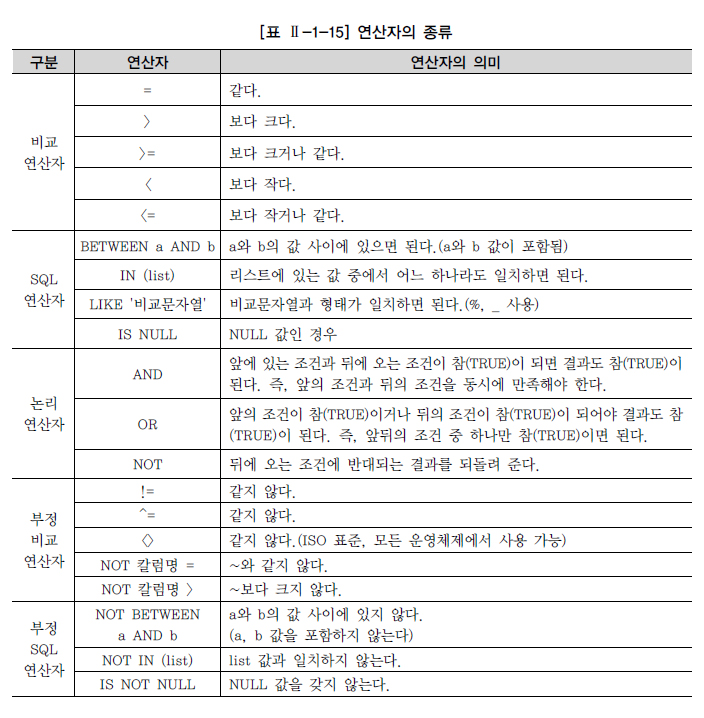
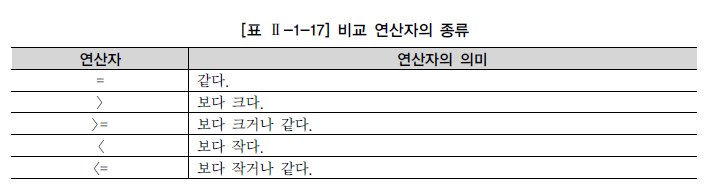
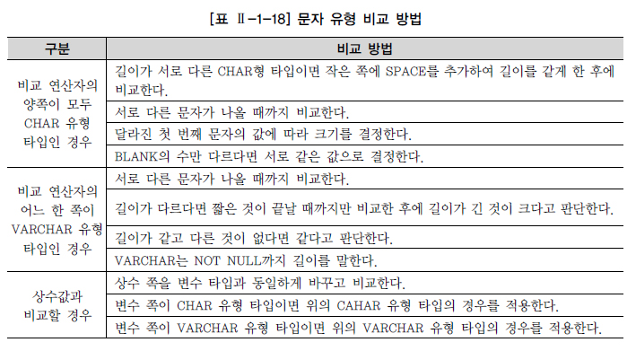
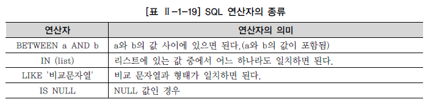
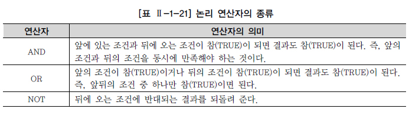
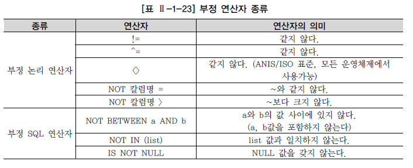

# WHERE 절

## 1. WHERE 조건절 개요

자료를 검색할 때 SELECT 절과 FROM 절만을 사용하여 기본적인 SQL 문장을 구성한다면, 테이블에 있는 모든 자료들이 결과로 출력되어 실제로 원하는 자료를 확인하기 어려울 수 있다. 사용자들은 자신이 원하는 자료만을 검색하기 위해서 SQL 문장에 WHERE 절을 이용하여 자료들에 대하여 제한할 수 있다. WHERE 절에는 두 개 이상의 테이블에 대한 조인 조건을 기술하거나 결과를 제한하기 위한 조건을 기술할 수도 있다. WHERE 절의 JOIN 조건에 대해서는 1장 9절에서 설명하고 FROM 절의 JOIN에 대해서는 2장 1절에서 설명하도록 한다. 현실의 데이터베이스는 많은 사용자나 프로그램들이 동시에 접속하여 다량의 트랜잭션을 발생하고 있다. WHERE 조건절을 사용하지 않고 필요 없는 많은 자료들을 데이터베이스로부터 요청하는 SQL 문장은 대량의 데이터를 검색하기 위해 데이터베이스가 설치되어 있는 서버의 CPU나 MEMORY와 같은 시스템 자원(Resources)들을 과다하게 사용한다. 또한 많은 사용자들의 QUERY에 대해 바로바로 처리를 해주지 못하게 되고, 또한 검색된 많은 자료들이 네트워크를 통해서 전달됨으로써 문제점들을 발생시킨다. 이런 문제점을 방지하기 위해 WHERE 절에 조건이 없는 FTS(Full Table Scan) 문장은 SQL 튜닝의 1차적인 검토 대상이 된다. (FTS가 무조건 나쁜 것은 아니며 병렬 처리 등을 이용해 유용하게 사용하는 경우도 많다.) 기본적인 SQL 문장은 Oracle의 경우 필수적으로 SELECT 절과 FROM 절로 이루어져 있다. SQL Server, Sybase 문장은 SELECT 목록에 상수, 변수 및 산술식(열 이름 없이)만 포함되는 경우는 FROM 절이 필요 없지만, 테이블의 칼럼이 사용된 경우는 FROM 절이 필요하다. WHERE 절은 조회하려는 데이터에 특정 조건을 부여할 목적으로 사용하기 때문에 FROM 절 뒤에 오게 된다.

SELECT [DISTINCT/ALL] 칼럼명 [ALIAS명] FROM 테이블명 WHERE 조건식;

WHERE 절은 FROM 절 다음에 위치하며, 조건식은 아래 내용으로 구성된다.

\- 칼럼(Column)명 (보통 조건식의 좌측에 위치) - 비교 연산자 - 문자, 숫자, 표현식 (보통 조건식의 우측에 위치) - 비교 칼럼명 (JOIN 사용시)

## 2. 연산자의 종류

WHERE 절에 조건식을 사용할 때, 사용되는 비교 연산자에 대해서 살펴본다. 연산자에 대해서 알아보기 전에 위에서 나왔던 조건을 조금 더 복잡하게 바꾸어 본다.

K-리그 일부 선수들의 이름과 포지션, 백넘버를 알고 싶다. 조건은 소속팀이 삼성블루윙즈이거나 전남드래곤즈에 소속된 선수들 중에서 포지션이 미드필더(MF:Mid Fielder) 이면서, 키는 170 센티미터 이상, 180 이하여야 한다.

위의 요구 조건을 모두 만족하는 Query 문장을 구성하기 위해서는 다양한 연산자들을 사용해야만 한다. WHERE 절에 사용되는 연산자는 3가지 종류가 있다.

\- 비교 연산자 (부정 비교 연산자 포함) - SQL 연산자 (부정 SQL 연산자 포함) - 논리 연산자

연산자의 우선순위를 살펴보면 다음과 같다.

\- 괄호로 묶은 연산이 제일 먼저 연산 처리된다. - 연산자들 중에는 부정 연산자(NOT)가 먼저 처리되고, - 비교 연산자(=,>,>=,<,<=), SQL 비교 연산자(BETWEEN a AND b, IN (list), LIKE, IS NULL)가 처리되고, - 논리 연산자 중에서는 AND, OR의 순으로 처리된다.

만일 이러한 연산에 있어서 연산자들의 우선순위를 염두에 두지 않고 WHERE 절을 작성한다면 테이블에서 자기가 원하는 자료를 찾지 못하거나, 혹은 틀린 자료인지도 모른 채 사용할 수도 있다. 실수하기 쉬운 비교 연산자와 논리 연산자의 경우 괄호를 사용해서 우선순위를 표시하는 것을 권고한다.

## 3. 비교 연산자

비교 연산자의 종류는 [표 Ⅱ-1-17]과 같으며, 비교 연산자들을 적절히 사용하여 다양한 조건을 구성할 수 있다.

앞의 요구 사항을 다음과 같이 비교 연산자를 적용하여 표현할 수 있다.

소속팀이 삼성블루윙즈이거나 전남드래곤즈에 소속된 선수들이어야 하고, 포지션이 미드필더(MF:Midfielder)이어야 한다. 키는 170 센티미터 이상이고 180 이하여야 한다.

1) 소속팀코드 = 삼성블루윙즈팀 코드(K02) 2) 소속팀코드 = 전남드래곤즈팀 코드(K07) 3) 포지션 = 미드필더 코드(MF) 4) 키 >= 170 센티미터 5) 키 <= 180 센티미터

각각의 예를 보면 비교 연산자로 소속팀, 포지션, 키와 같은 칼럼(Column)들을 특정한 값들과 조건을 비교하는데 사용되는 것을 알 수 있다.

[예제] 첫 번째 요구 사항인 소속팀이 삼성블루윙즈라는 조건을 WHERE 조건절로 옮겨서 SQL 문장을 완성하여 실행한다.

[예제 및 실행 결과] SELECT PLAYER_NAME 선수이름, POSITION 포지션, BACK_NO 백넘버, HEIGHT 키 FROM PLAYER WHERE TEAM_ID = K02; WHERE TEAM_ID = K02 * 3행에 오류: ERROR: 열명이 부적합하다.

실행 결과는 “열(COLUMN)명이 부적합하다.”라는 에러 메시지를 보이고 SQL 문장의 세 번째 줄에 오류가 있다고 나와 있다. TEAM_ID라는 팀명의 데이터 타입은 CHAR(3)인데 비교 연산자 오른쪽에 K02의 값을 작은따옴표(' ')나 큰따옴표(" ")와 같은 인용 부호로 묶어서 처리하지 않았기 때문에 발생하는 에러이다. CHAR 변수나 VARCHAR2와 같은 문자형 타입을 가진 칼럼을 특정 값과 비교하기 위해서는 인용 부호(작은따옴표, 큰따옴표)로 묶어서 비교 처리를 해야 한다. 하지만 NUMERIC과 같은 숫자형 형태의 값은 인용부호를 사용하지 않는다.

[예제] 첫 번째 요구 사항을 수정하여 다시 실행한다.

[예제] SELECT PLAYER_NAME 선수이름, POSITION 포지션, BACK_NO 백넘버, HEIGHT 키 FROM PLAYER WHERE TEAM_ID = 'K02' ;

[실행 결과] 선수이름 포지션 백넘버 키 ------ ---- ---- ---- 김성환 DF 5 183 가비 MF 10 177 강대희 MF 26 174 고종수 MF 22 176 고창F 4 175 정준 MF 44 170 정진우 DF 7 179 데니스 FW 11 176 서정원 FW 14 173 ：：：： 49개의 행이 선택되었다.

[예제] 세 번째 요구 사항인 포지션이 미드필더(MF)인 조건을 WHERE 조건절로 옮겨서 SQL 문장을 완성하여 실행한다.

[예제] SELECT PLAYER_NAME 선수이름, POSITION 포지션, BACK_NO 백넘버, HEIGHT 키 FROM PLAYER WHERE POSITION = 'MF';

[실행 결과] 선수이름 포지션 백넘버 키 ------ ---- ---- --- 가비 MF 10 177 강대희 MF 26 174 고종수 MF 22 176 고창현 MF 8 170 정기범 MF 28 173 정동현 MF 25 175 정두현 MF 4 175 정준 MF 44 170 오규찬 MF 24 178 윤원일 MF 45 176 장성철 MF 27 176 ：：：： 162개의 행이 선택되었다.

추가적으로 문자 유형간의 비교 조건이 발생하는 경우는 [표 Ⅱ-1-18]과 같이 처리한다.

[예제] 네 번째 요구 사항인 "키가 170 센티미터 이상"인 조건도 WHERE 절로 옮겨서 SQL 문장을 완성하여 실행한다.

[예제] SELECT PLAYER_NAME 선수이름, POSITION 포지션, BACK_NO 백넘버, HEIGHT 키 FROM PLAYER WHERE HEIGHT >= 170;

[실행 결과] 선수이름 포지션 백넘버 키 ------ ---- ---- --- 김성환 DF 5 183 가비 MF 10 177 강대희 MF 26 174 고종수 MF 22 176 고창현 MF 8 170 정기범 MF 28 173 정동현 MF 25 175 정두현 MF 4 175 정준 MF 44 170 정진우 DF 7 179 데니스 FW 11 176 ：：：： 439개의 행이 선택되었다.

문자 유형 칼럼의 경우 WHERE TEAM_ID = K02 사례에서 ' ' 표시가 없는 경우 에러가 발생하였지만, 숫자 유형 칼럼의 경우 숫자로 변환이 가능한 문자열(Alpha Numeric)과 비교되면 상대 타입을 숫자 타입으로 바꾸어 비교한다. 예를 들면 [예제]의 WHERE HEIGHT >= 170 조건을 WHERE HEIGHT >= '170' 이라고 표현하더라도, HEIGHT라는 칼럼이 숫자 유형의 변수이므로 내부적으로 ‘170’이라는 문자열을 숫자 유형 170으로 바꾸어 처리한다.

## 4. SQL 연산자

SQL 연산자는 SQL 문장에서 사용하도록 기본적으로 예약되어 있는 연산자로서 모든 데이터 타입에 대해서 연산이 가능한 4가지 종류가 있다.

앞의 요구 사항을 다음과 같이 비교 연산자와 SQL 비교 연산자를 적용하여 표현할 수 있다.

1) 소속팀코드 IN (삼성블루윙즈 코드(K02), 전남드래곤즈 코드(K07)) 2) 포지션 LIKE 미드필더(MF) 3) 키 BETWEEN 170 센티미터 AND 180 센티미터

- IN (list) 연산자

[예제] 소속팀 코드와 관련된 IN (list) 형태의 SQL 비교 연산자를 사용하여 WHERE 절에 사용한다.

[예제] SELECT PLAYER_NAME 선수이름, POSITION 포지션, BACK_NO 백넘버, HEIGHT 키 FROM PLAYER WHERE TEAM_ID IN ('K02','K07');

[실행 결과] 선수이름 포지션 백넘버 키 ------ ---- ---- --- 데니스 FW 11 176 서정원 FW 14 173 손대호 DF 17 186 오규찬 MF 24 178 윤원일 MF 45 176 김동욱 MF 40 176 김회택 DF 서현옥 DF 정상호 DF 최철우 DF 정영광 GK 41 185 ：：：： 100개의 행이 선택되었다.

[예제] 사원 테이블에서 JOB이 MANAGER이면서 20번 부서에 속하거나, JOB이 CLERK이면서 30번 부서에 속하는 사원의 정보를 IN 연산자의 다중 리스트를 이용해 출력하라.

[예제] SELECT ENAME, JOB, DEPTNO FROM EMP WHERE (JOB, DEPTNO) IN (('MANAGER',20),('CLERK',30));

[실행 결과] ENAME JOB DEPTNO ------ -------- ------ JONES MANAGER 20 JAMES CLERK 30 2개의 행이 선택되었다.

사용자들이 잘 모르고 있는 다중 리스트를 이용한 IN 연산자는 SQL 문장을 짧게 만들어 주면서도 성능 측면에서도 장점을 가질 수 있는 매우 유용한 연산자이므로 적극적인 사용을 권고한다. 다만, 아래 SQL 문장과는 다른 결과가 나오게 되므로 용도를 구분해서 사용해야 한다.

[예제] SELECT ENAME, JOB, DEPTNO FROM EMP WHERE JOB IN ('MANAGER','CLERK') AND DEPTNO IN (20,30);

[실행 결과] ENAME JOB DEPTNO ------ ------- ------ SMITH CLERK 20 JONES MANAGER 20 BLAKE MANAGER 30 ADAMS CLERK 20 JAMES CLERK 30 5개의 행이 선택되었다.

- LIKE 연산자

[예제] 요구 사항의 두 번째 조건에 대해서 LIKE 연산자를 WHERE 절에 적용해서 실행한다.

[예제] SELECT PLAYER_NAME 선수이름, POSITION 포지션, BACK_NO 백넘버, HEIGHT 키 FROM PLAYER WHERE POSITION LIKE 'MF';

[예제] SELECT PLAYER_NAME 선수이름, POSITION 포지션, BACK_NO 백넘버, HEIGHT 키 FROM PLAYER WHERE POSITION LIKE 'MF';

[실행 결과] 선수이름 포지션 백넘버 키 ------ ----- ----- --- 가비 MF 10 177 강대희 MF 26 174 고종수 MF 22 176 고창현 MF 8 170 정기범 MF 28 173 정동현 MF 25 175 정두현 MF 4 175 정준 MF 44 170 ：：：： 162개의 행이 선택되었다.

LIKE의 사전적 의미는 ‘~와 같다’이다. 따라서 위와 같은 경우라면 비교 연산자인 ‘=’을 사용해서 작성해도 같은 결과를 얻을 수 있을 것이다. 그러나 만약 “장”씨 성을 가진 선수들을 조회할 경우는 어떻게 할까? 이런 문제를 해결하기 위해서 LIKE 연산자에서는 와일드카드(WildCard)를 사용할 수 있다. 와일드카드(WildCard)란 한 개 혹은 0개 이상의 문자를 대신해서 사용하기 위한 특수 문자를 의미하며, 이를 조합하여 사용하는 것도 가능하므로 SQL 문장에서 사용하는 스트링(STRING) 값으로 용이하게 사용할 수 있다.

[예제] “장”씨 성을 가진 선수들의 정보를 조회하는 WHERE 절을 작성한다.

[예제] SELECT PLAYER_NAME 선수이름, POSITION 포지션, BACK_NO 백넘버, HEIGHT 키 FROM PLAYER WHERE PLAYER_NAME LIKE '장%';

[실행 결과] 선수이름 포지션 백넘버 키 ------ ---- ---- --- 장성철 MF 27 176 장윤정 DF 17 173 장서연 FW 7 180 장재우 FW 12 172 장대일 DF 7 184 장기봉 FW 12 180 장철우 DF 7 172 장형석 DF 36 181 장경진 DF 34 184 장성욱 MF 19 174 장철민 MF 24 179 장경호 MF 39 174 장동현 FW 39 178 13개의 행이 선택되었다.

- BETWEEN a AND b 연산자

[예제] 세 번째로 키가 170 센티미터 이상 180센티미터 이하인 선수들의 정보를 BETWEEN a AND b 연산자를 사용하여 WHERE 절을 완성한다.

[예제] SELECT PLAYER_NAME 선수이름, POSITION 포지션, BACK_NO 백넘버, HEIGHT 키 FROM PLAYER WHERE HEIGHT BETWEEN 170 AND 180; BETWEEN a AND b는 범위에서 'a'와 'b'의 값을 포함하는 범위를 말하는 것이다.

[실행 결과] 선수이름 포지션 백넘버 키 ------ ---- ---- --- 장철우 DF 7 172 홍광철 DF 4 172 강정훈 MF 38 175 공오균 MF 22 177 정국진 MF 16 172 정동선 MF 9 170 최경규 MF 10 177 최내철 MF 24 177 배성재 MF 28 178 샴 MF 25 174 김관우 MF 8 175 ：：：： 259개의 행이 선택되었다.

- IS NULL 연산자

NULL(ASCII 00)은 값이 존재하지 않는 것으로 확정되지 않은 값을 표현할 때 사용한다. 따라서 어떤 값보다 크거나 작지도 않고 ‘ ’(공백, ASCII 32)이나 0(Zero, ASCII 48)과 달리 비교 자체가 불가능한 값인 것이다. 연산 관련 NULL의 특성은 다음과 같다.

\- NULL 값과의 수치연산은 NULL 값을 리턴한다. - NULL 값과의 비교연산은 거짓(FALSE)을 리턴한다. - 어떤 값과 비교할 수도 없으며, 특정 값보다 크다, 적다라고 표현할 수 없다.

따라서 NULL 값의 비교는 비교 연산자인 “=”, “>”, “>=”, “<”, “=”를 통해서 비교할 수도 없고, 만일 비교 연산을 하게 되면 결과는 거짓(FALSE)을 리턴하고, 수치 연산자(+,-,*,/ 등)를 통해서 NULL 값과 연산을 하게 되면 NULL 값을 리턴한다. NULL 값의 비교 연산은 IS NULL, IS NOT NULL 이라는 정해진 문구를 사용해야 제대로 된 결과를 얻을 수 있다.

[예제 및 실행 결과] SELECT PLAYER_NAME 선수이름, POSITION 포지션, BACK_NO 백넘버, HEIGHT 키 FROM PLAYER WHERE POSITION = NULL; 선택된 레코드가 없다.

[예제]의 실행 결과로 “선택된 레코드가 없다.”라는 메시지가 출력되었다. 앞에서 살펴본 대로 WHERE 절에서 POSITION = NULL을 사용했는데 문법 에러가 나지는 않았지만 WHERE 절의 조건이 거짓(FALSE)이 되어 WHERE 절의 조건을 만족하는 데이터를 한건도 얻지 못하게 된 것으로 의미 없는 SQL이 되고 말았다.

[예제] POSITION 칼럼(Column) 값이 NULL 값인지를 판단하기 위해서는 IS NULL을 사용하여 다음과 같이 SQL 문장을 수정하여 실행한다.

[예제] SELECT PLAYER_NAME 선수이름, POSITION 포지션, TEAM_ID FROM PLAYER WHERE POSITION IS NULL;

[실행 결과] 선수이름 포지션 TEAM_ID ------ ----- ------- 정학범 K08 안익수 K08 차상광 K08 3개의 행이 선택되었다.

## 5. 논리 연산자

논리 연산자는 비교 연산자나 SQL 비교 연산자들로 이루어진 여러 개의 조건들을 논리적으로 연결시키기 위해서 사용되는 연산자라고 생각하면 된다. [표 Ⅱ-1-21]울 보고 실제로 적용되는 예를 통해 사용방법을 이해한다.

[예제] 예를 들어 “소속이 삼성블루윙즈”인 조건과 “키가 170 센티미터 이상”인 조건을 연결해 보면 “소속이 삼성블루윙즈이고 키가 170 센티미터 이상인 조건을 가진 선수들의 자료를 조회”하는 것이 되는 것이다.

[예제] SELECT PLAYER_NAME 선수이름, POSITION 포지션, BACK_NO 백넘버, HEIGHT 키 FROM PLAYER WHERE TEAM_ID = 'K02' AND HEIGHT >= 170;

[실행 결과] 선수이름 포지션 백넘버 키 ------ ---- ---- --- 김반코비 MF 47 185 김선우 FW 33 174 김여성 MF 36 179 김용우 FW 27 175 김종민 MF 30 174 박용훈 MF 9 175 김만근 FW 34 177 김재민 MF 35 180 김현두 MF 12 176 이성용 DF 20 173 하태근 MF 29 182 ：：：： 45개의 행이 선택되었다

[예제] “소속이 삼성블루윙즈이거나 전남드래곤즈”인 조건을 SQL 비교 연산자로, “포지션이 미드필더(MF)”인 조건을 비교 연산자로 비교한 결과를 논리 연산bg_gray>[예제] SELECT PLAYER_NAME 선수이름, POSITION 포지션, BACK_NO 백넘버, HEIGHT 키 FROM PLAYER WHERE TEAM_ID IN ('K02','K07') AND POSITION = 'MF';

[실행 결과] 선수이름 포지션 백넘버 키 ------ ---- ----- --- 노병준 MF 22 177 최종우 MF 43 176 조진원 MF 9 176 실바 MF 45 173 윤용구 MF 15 168 김반 MF 14 174 김영수 MF 30 175 임관식 MF 29 172 이정호 MF 23 176 하기윤 MF 32 180 김반코비 MF 47 185 ：：：： 40개의 행이 선택되었다.

실행 결과를 보면 소속이 (삼성블루윙즈이거나 전남드래곤즈이고) 포지션이 미드필더(MF)인 선수들의 데이터가 조회되었음을 확인할 수 있다

[예제] 요구 사항을 하나씩 하나씩 AND, OR 같은 논리 연산자를 사용하여 DBMS가 이해할 수 있는 SQL 형식으로 질문을 변경한다. 요구 사항을 순서대로 논리적인 조건을 적용한다.

소속팀이 삼성블루윙즈이거나 전남드래곤즈에 소속된 선수들이어야 하고, 포지션이 미드필더(MF:Midfielder)이어야 한다. 키는 170 센티미터 이상이고 180 이하여야 한다. 1) 소속팀이 삼성블루윙즈 OR 소속팀이 전남드래곤즈 2) AND 포지션이 미드필더 3) AND 키는 170 센티미터 이상 4) AND 키는 180 센티미터 이하

[예제] SELECT PLAYER_NAME 선수이름, POSITION 포지션, BACK_NO 백넘버, HEIGHT 키 FROM PLAYER WHERE TEAM_ID = 'K02' OR TEAM_ID = 'K07' AND POSITION = 'MF' AND HEIGHT >= 170 AND HEIGHT <= 180;

[실행 결과] 선수이름 포지션 백넘버 키 ------ ----- ---- ---- 김성환 DF 5 183 가비 MF 10 177 강대희 MF 26 174 고종수 MF 22 176 고창현 MF 8 170 정기범 MF 28 173 정동현 MF 25 175 정두현 MF 4 175 정준 MF 44 170 정진우 DF 7 179 데니스 FW 11 176 ：：：： 66개의 행이 선택되었다.

실행 결과의 내용을 보면 포지션이 미드필더(MF: MidFielder)가 아닌 선수들의 명단이 출력되었다. 원하는 데이터는 삼성블루윙즈이거나 전남드래곤즈 중 포지션이 미드필더(MF: Midfielder)인 선수들에 대한 자료만 요청했는데 포지션이 DF나 FW인 선수가 같이 출력된 것이다. [예제]에서 “소속팀 코드가 삼성블루윙즈(K02) 이거나 전남드래곤즈(K07)”라는 조건을 만족하고 “포지션이 미드필더(MF)”인 조건을 동시에 만족해야 하는데, 위의 SQL 문장에서는 괄호가 누락됨으로서 OR 논리 연산자보다 AND 논리 연산자를 먼저 실행하기 때문에 잘못된 결과를 나타낸 것이다. 논리 연산자들이 여러 개가 같이 사용되었을 때의 처리 우선순위는 ( ), NOT, AND, OR의 순서대로 처리된다.

[예제] 잘못된 결과를 보여 준 SQL 문장을 괄호를 사용하여 다시 적용한다.

[예제] SELECT PLAYER_NAME 선수이름, POSITION 포지션, BACK_NO 백넘버, HEIGHT 키 FROM PLAYER WHERE (TEAM_ID = 'K02' OR TEAM_ID = 'K07') AND POSITION = 'MF' AND HEIGHT >= 170 AND HEIGHT <= 180;

[실행 결과] 선수이름 포지션 백넘버 키 ------ ---- ---- --- 가비 MF 10 177 강대희 MF 26 174 고종수 MF 22 176 고창현 MF 8 170 정기범 MF 28 173 정동현 MF 25 175 정두현 MF 4 175 정준 MF 44 170 오규찬 MF 24 178 윤원일 MF 45 176 김동욱 MF 40 176 ：：：： 33개의 행이 선택되었다.

[예제] IN (list)와 BETWEEN a AND b 연산자를 활용하여 같은 결과를 출력하는 SQL 문장을 작성한다. 두개의 SQL 문장은 DBMS 내부적으로 같은 프로세스를 거쳐 수행되므로 당연히 실행 결과도 같다.

[예제] SELECT PLAYER_NAME 선수이름, POSITION 포지션, BACK_NO 백넘버, HEIGHT 키 FROM PLAYER WHERE WHERE TEAM_ID IN ('K02','K07') AND POSITION = 'MF' AND HEIGHT BETWEEN 170 AND 180 ; ： 33개의 행이 선택되었다.

앞서 살펴본 SQL 비교 연산자인 ‘IN’과 논리 연산자인 ‘OR’은 결과도 같고 내부적으로 처리하는 방법도 같다. 즉, 소속팀이 삼성블루윙즈이거나 전남드래곤즈인 선수들을 조회할 때 WHERE 절에 TEAM_ID = ‘K02’ OR TEAM_ID = ‘K07’라는 논리 연산자 조건과 TEAM_ID IN (‘K02’,‘K07’)라는 SQL 연산자 조건은 같은 기능이다. 그리고 “HEIGHT >= 170 AND HEIGHT <= 180” 라는 비교 연산자 조건과 “HEIGHT BETWEEN 170 AND 180”이라는 SQL 비교 연산자 조건도 결과도 같고 내부적으로 처리되는 방법도 같은 기능이다.

## 6. 부정 연산자

비교 연산자, SQL 비교 연산자에 대한 부정 표현을 부정 논리 연산자, 부정 SQL 연산자로 구분할 수 있다.

[예제] 삼성블루윙즈 소속인 선수들 중에서 포지션이 미드필더(MF:Midfielder)가 아니고, 키가 175 센티미터 이상 185 센티미터 이하가 아닌 선수들의 자료를 찾아본다.

[예제] SELECT PLAYER_NAME 선수이름, POSITION 포지션, BACK_NO 백넘버, HEIGHT 키 FROM PLAYER WHERE TEAM_ID = 'K02' AND NOT POSITION = 'MF' AND NOT HEIGHT BETWEEN 175 AND 185;

[예제] Oracle 위의 SQL과 아래 SQL은 같은 내용을 나타내는 SQL이다. SELECT PLAYER_NAME 선수이름, POSITION 포지션, BACK_NO 백넘버, HEIGHT 키 FROM PLAYER WHERE TEAM_ID = 'K02' AND POSITION <> 'MF' AND HEIGHT NOT BETWEEN 175 AND 185;

[실행 결과] 선수이름 포지션 백넘버 키 ------ ----- ----- --- 서정원 FW 14 173 손대호 DF 17 186 김선우 FW 33 174 이성용 DF 20 173 미트로 FW 19 192 최호진 GK 31 190 정유진 DF 37 188 손승준 DF 32 186 8개의 행이 선택되었다.

[예제] 국적(NATION) 칼럼의 경우 내국인들은 별도 데이터를 입력하지 않았다. 국적 칼럼이 NULL이 아닌 선수와 국적을 표시하라.

[예제] SELECT PLAYER_NAME 선수이름, NATION 국적 FROM PLAYER WHERE NATION IS NOT NULL;

[실행 결과] 선수이름 국적 ------ ------ 가비 루마니아 데니스 러시아 우르모브 유고 이고르 브라질 디디 브라질 하리 콜롬비아 빅토르 나이지리아 콜리 세네갈 김징요 브라질 미트로 보스니아 산드로 브라질 안드레 브라질 뚜따 브라질 마르코 브라질 히카르도 브라질 끌레베르 브라질 에디 브라질 마르코스 브라질 알리송 브라질 파울링뇨 브라질 제프유 미국 롤란 리투아니아 셀라하틴 김탈리아 올리베 브라질 김리네 브라질 쟈스민 크로아티아 코샤 브라질 27개의 행이 선택되었다.

## 7. ROWNUM, TOP 사용

- ROWNUM

Oracle의 ROWNUM은 칼럼과 비슷한 성격의 Pseudo Column으로써 SQL 처리 결과 집합의 각 행에 대해 임시로 부여되는 일련번호이며, 테이블이나 집합에서 원하는 만큼의 행만 가져오고 싶을 때 WHERE 절에서 행의 개수를 제한하는 목적으로 사용한다.

건의 행만 가져오고 싶을 때는 - SELECT PLAYER_NAME FROM PLAYER WHERE ROWNUM = 1; 이나 - SELECT PLAYER_NAME FROM PLAYER WHERE ROWNUM <= 1; 이나 - SELECT PLAYER_NAME FROM PLAYER WHERE ROWNUM < 2; 처럼 사용할 수 있다.

두 건 이상의 N 행을 가져오고 싶을 때는 ROWNUM = N; 처럼 사용할 수 없으며 - SELECT PLAYER_NAME FROM PLAYER WHERE ROWNUM <= N; 이나 - SELECT PLAYER_NAME FROM PLAYER WHERE ROWNUM<n+1; 처럼="" 출력되는="" 행의="" 한계를="" 지정할="" 수="" 있다.="" p=""></n+1;>

추가적인 ROWNUM의 용도로는 테이블 내의 고유한 키나 인덱스 값을 만들 수 있다. - UPDATE MY_TABLE SET COLUMN1 = ROWNUM;

- TOP 절

SQL Server는 TOP 절을 사용하여 결과 집합으로 출력되는 행의 수를 제한할 수 있다. TOP 절의 표현식은 다음과 같다.

TOP (Expression) [PERCENT] [WITH TIES]

\- Expression : 반환할 행의 수를 지정하는 숫자이다. - PERCENT : 쿼리 결과 집합에서 처음 Expression%의 행만 반환됨을 나타낸다. - WITH TIES : ORDER BY 절이 지정된 경우에만 사용할 수 있으며, TOP N(PERCENT)의 마지막 행과 같은 값이 있는 경우 추가 행이 출력되도록 지정할 수 있다.

한 건의 행만 가져오고 싶을 때는 - SELECT TOP(1) PLAYER_NAME FROM PLAYER; 처럼 사용할 수 있다.

두 건 이상의 N 행을 가져오고 싶을 때는 - SELECT TOP(N) PLAYER_NAME FROM PLAYER; 처럼 출력되는 행의 개수를 지정할 수 있다.

SQL 문장에서 ORDER BY 절이 사용되지 않으면 Oracle의 ROWNUM과 SQL Server의 TOP 절은 같은 기능을 하지만, ORDER BY 절이 같이 사용되면 기능의 차이가 발생한다. 이 부분은 1장 8절 ORDER BY 절에서 설명하도록 한다.