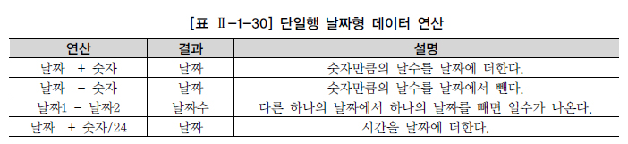
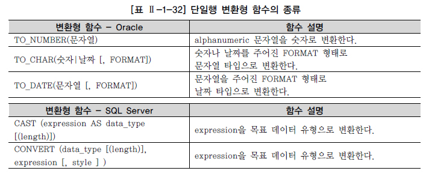

# 함수

## 1. 내장 함수(BUILT-IN FUNCTION) 개요

함수는 다양한 기준으로 분류할 수 있는데, 벤더에서 제공하는 함수인 내장 함수(Built-in Function)와 사용자가 정의할 수 있는 함수(User Defined Function)로 나눌 수 있다. 본 절에서는 각 벤더에서 제공하는 데이터베이스를 설치하면 기본적으로 제공되는 SQL 내장 함수에 대해 설명한다. 내장 함수는 SQL을 더욱 강력하게 해주고 데이터 값을 간편하게 조작하는데 사용된다. 내장 함수는 벤더별로 가장 큰 차이를 보이는 부분이지만, 핵심적인 기능들은 이름이나 표현법이 다르더라도 대부분의 데이터베이스가 공통적으로 제공하고 있다. 내장 함수는 다시 함수의 입력 값이 단일행 값이 입력되는 단일행 함수(Single-Row Function)와 여러 행의 값이 입력되는 다중행 함수(Multi-Row Function)로 나눌 수 있다. 다중행 함수는 다시 집계 함수(Aggregate Function), 그룹 함수(Group Function), 윈도우 함수(Window Function)로 나눌 수 있는데, 집계 함수는 다음 절에서, 그룹 함수는 2장 5절에서, 윈도우 함수는 2장 6절에서 설명하도록 하고 본 절에서는 단일행 함수에 대해서만 설명한다. 함수는 입력되는 값이 아무리 많아도 출력은 하나만 된다는 M:1 관계라는 중요한 특징을 가지고 있다. 단일행 함수의 경우 단일행 내에 있는 하나의 값 또는 여러 값이 입력 인수로 표현될 수 있다. 다중행 함수의 경우도 여러 레코드의 값들을 입력 인수로 사용하는 것이다.

함수명 (칼럼이나 표현식 [, Arg1, Arg2, ... ])

단일행 함수는 처리하는 데이터의 형식에 따라서 문자형, 숫자형, 날짜형, 변환형, NULL 관련 함수로 나눌 수 있다. 벤더에서 제공하는 내장 함수는 상당히 종류가 많고 벤더별로 사용법이 틀린 경우가 많아, 본 절에서는 Oracle과 SQL Server에서 공통으로 사용하는 중요 함수 위주로 설명을 한다. 함수에 대한 자세한 내용이나 버전에 따른 변경 내용은 벤더에서 제공하는 매뉴얼을 참조하기 바란다. 아래 함수의 예에서 SUBSTR / SUBSTRING으로 표시한 것은 같은 기능을 하지만 다르게 표현되는 Oracle 내장 함수와 SQL Server 내장 함수를 순서대로 표현한 것이다.

단일행 함수의 중요한 특징은 다음과 같다.

\- SELECT, WHERE, ORDER BY 절에 사용 가능하다. - 각 행(Row)들에 대해 개별적으로 작용하여 데이터 값들을 조작하고, 각각의 행에 대한 조작 결과를 리턴한다. - 여러 인자(Argument)를 입력해도 단 하나의 결과만 리턴한다. - 함수의 인자(Arguments)로 상수, 변수, 표현식이 사용 가능하고, 하나의 인수를 가지는 경우도 있지만 여러 개의 인수를 가질 수도 있다. - 특별한 경우가 아니면 함수의 인자(Arguments)로 함수를 사용하는 함수의 중첩이 가능하다.

## 2. 문자형 함수

문자형 함수는 문자 데이터를 매개 변수로 받아들여서 문자나 숫자 값의 결과를 돌려주는 함수이다. 몇몇 문자형 함수의 경우는 결과를 숫자로 리턴하는 함수도 있다.

- 문자형 함수들이 적용되었을 때 리턴되는 값을 예를 들어 설명한다.

[예제] ‘SQL Expert’라는 문자형 데이터의 길이를 구하는 문자형 함수를 사용한다.

[예제 및 실행 결과] Oracle SELECT LENGTH('SQL Expert') FROM DUAL; LENGTH('SQL Expert') --------------- 10

예제 및 실행 결과를 보면 함수에 대한 결과 값을 마치 테이블에서 값을 조회했을 때와 비슷하게 표현한다. Oracle은 SELECT 절과 FROM 절 두 개의 절을 SELECT 문장의 필수 절로 지정하였으므로 사용자 테이블이 필요 없는 SQL 문장의 경우에도 필수적으로 DUAL이라는 테이블을 FROM 절에 지정한다. DUAL 테이블의 특성은 다음과 같다.

\- 사용자 SYS가 소유하며 모든 사용자가 액세스 가능한 테이블이다. - SELECT ~ FROM ~ 의 형식을 갖추기 위한 일종의 DUMMY 테이블이다. - DUMMY라는 문자열 유형의 칼럼에 'X'라는 값이 들어 있는 행을 1건 포함하고 있다.

[예제 및 실행 결과] Oracle DESC DUAL; 칼럼 NULL 가능 데이터 유형 ---------------- -------- ----------- DUMMY VARCHAR2(1)

[예제 및 실행 결과] Oracle SELECT * FROM DUAL; DUMMY ----- X 1개의 행이 선택되었다.

반면 Sybase나 SQL Server의 경우에는 SELECT 절만으로도 SQL 문장이 수행 가능하도록 정의하였기 때문에 DUAL이란 DUMMY 테이블이 필요 없다. 그러나 Sybase나 SQL Server의 경우에도 사용자 테이블의 칼럼을 사용할 때는 FROM 절이 필수적으로 사용되어야 한다.

[예제] ‘SQL Expert’라는 문자형 데이터의 길이를 구하는 문자형 함수를 사용한다.

[예제 및 실행 결과] Oracle SELECT LEN('SQL Expert') AS ColumnLength; ColumnLength ---------- 10

[예제] 선수 테이블에서 CONCAT 문자형 함수를 이용해 축구선수란 문구를 추가한다.

[예제] SELECT CONCAT(PLAYER_NAME, ' 축구선수') 선수명 FROM PLAYER; CONCAT 함수는 Oracle의 '||' 합성 연산자와 같은 기능이다. SELECT PLAYER_NAME || ' 축구선수' AS 선수명 FROM PLAYER;

SQL Server에서 위의 예제와 같은 결과를 얻으려면 아래와 같이 수행하면 된다.

[예제] SQL Server SELECT PLAYER_NAME + ' 축구선수' AS 선수명 FROM PLAYER;

[실행 결과] PLAYER_ID 선수명 --------- ------------ 2011075 김성환 축구선수 2012123 가비 축구선수 2010089 강대희 축구선수 2007051 고종수 축구선수 2012015 고창현 축구선수 2009089 정기범 축구선수 2009083 정동현 축구선수 2011071 정두현 축구선수 2012025 정준 축구선수 2007040 정진우 축구선수 2007069 데니스 축구선수 2007274 서정원 축구선수 480개의 행이 선택되었다.

실행 결과를 보면 실제적으로 함수가 모든 행에 대해 적용되어 ‘~ 축구선수’라는 각각의 결과로 출력되었다. 특별한 제약 조건이 없다면 함수는 여러 개 중첩하여 사용이 가능하다. 함수 내부에 다른 함수를 사용하며 안쪽에 위치해 있는 함수부터 실행되어 그 결과 값이 바깥쪽의 함수에 인자(Argument)로 사용되는 것이다.

함수3 (함수2 (함수1 (칼럼이나 표현식 [, Arg1]) [, Arg2]) [, Arg3 ])

[예제] 경기장의 지역번호와 전화번호를 합친 번호의 길이를 구하시오. 연결연산자의 결과가 LENGTH(SQL Server는 LEN 사용) 함수의 인수가 된다.

[예제] Oracle SELECT STADIUM_ID, DDD||TEL as TEL, LENGTH(DDD||TEL) as T_LEN FROM STADIUM;

[예제] SQL Server SELECT STADIUM_ID, DDD+TEL a s TEL, LEN(DDD+TEL) as T_LEN FROM STADIUM;

[실행 결과] STADIUM_ID TEL T_LEN --------- ---------- ----- D03 063273-1763 11 B02 031753-3956 11 C06 054282-2002 11 D01 061792-5600 11 B05 022128-2973 11 B01 031666-0496 11 C05 0556644-8468 12 C04 052220-2468 11 D02 042252-2002 11 B04 031259-2150 11 A02 0622468-8642 12 C02 051247-5771 11 A03 033459-3631 11 A04 0643631-2460 12 A05 053602-2011 11 F01 054 3 F02 051 3 F03 031 3 F04 055 3 F05 031 3 20개의 행이 선택되었다.

## 3. 숫자형 함수

숫자형 함수는 숫자 데이터를 입력받아 처리하고 숫자를 리턴하는 함수이다.

- 숫자형 함수들이 적용되었을 때 리턴되는 값을 예를 들어 설명한다.

[예제] 소수점 이하 한 자리까지 반올림 및 내림하여 출력한다.

[예제] SQL Server SELECT ENAME, ROUND(SAL/12,1), TRUNC(SAL/12,1) FROM EMP;

[실행 결과] ENAME ROUND(SAL/12,1) TRUNC(SAL/12,1) -------- ------------- ------------- SMITH 66.7 66.6 ALLEN 133.3 133.3 WARD 104.2 104.1 JONES 247.9 247.9 MARTIN 104.2 104.1 BLAKE 237.5 237.5 CLARK 204.2 204.1 SCOTT 250 250 KING 416.7 416.6 TURNER 125 125 ADAMS 91.7 91.6 JAMES 79.2 79.1 FORD 250 250 MILLER 108.3 108.3 14개의 행이 선택되었다.

[예제] 정수 기준으로 반올림 및 올림하여 출력한다.

[예제] SQL Server SELECT ENAME, ROUND(SAL/12), CEILING(SAL/12) FROM EMP;

[실행 결과] ENAME ROUND(SAL/12) CEILING(SAL/12) -------- ------------ -------------- SMITH 67 67 ALLEN 133 134 WARD 104 105 JONES 248 248 MARTIN 104 105 BLAKE 238 238 CLARK 204 205 SCOTT 250 250 KING 417 417 TURNER 125 125 ADAMS 92 92 JAMES 79 80 FORD 250 250 MILLER 108 109 14개의 행이 선택되었다.

## 4. 날짜형 함수

날짜형 함수는 DATE 타입의 값을 연산하는 함수이다. Oracle의 TO_NUMBER(TO_CHAR( )) 함수의 경우 변환형 함수로 구분할 수도 있으나 SQL Server의 YEAR, MONTH,DAY 함수와 매핑하기 위하여 날짜형 함수에서 설명한다. EXTRACT/DATEPART는 같은 기능을 하는 Oracle 내장 함수와 SQL Server 내장 함수를 표현한 것이다

DATE 변수가 데이터베이스에 어떻게 저장되는지 살펴보면, 데이터베이스는 날짜를 저장할 때 내부적으로 세기(Century), 년(Year), 월(Month), 일(Day), 시(Hours), 분(Minutes), 초(Seconds)와 같은 숫자 형식으로 변환하여 저장한다. 날짜는 여러 가지 형식으로 출력이 되고 날짜 계산에도 사용되기 때문에 그 편리성을 위해서 숫자형으로 저장하는 것이다. 데이터베이스는 날짜를 숫자로 저장하기 때문에 덧셈, 뺄셈 같은 산술 연산자로도 계산이 가능하다. 즉, 날짜에 숫자 상수를 더하거나 뺄 수 있다.

[예제] Oracle의 SYSDATE 함수와 SQL Server의 GETDATE( ) 함수를 사용하여 데이터베이스에서 사용하는 현재의 날짜 데이터를 확인한다. 날짜 데이터는 시스템 구성에 따라 다양하게 표현될 수 있으므로 사용자마다 다른 결과가 나올 수 있다.

[예제 및 실행 결과] Oracle SELECT SYSDATE FROM DUAL; SYSDATE -------- 12/07/18

[예제 및 실행 결과] SQL Server SELECT GETDATE() AS CURRENTTIME; CURRENTTIME ----------------------- 2012-07-18 13:10:02.047

[예제] 사원(EMP) 테이블의 입사일자에서 년, 월, 일 데이터를 각각 출력한다. 아래 4개의 SQL 문장은 같은 기능을 하는 SQL 문장이다.

[예제] Oracle 함?도, EXTRACT(MONTH FROM HIREDATE) 입사월, EXTRACT(DAY FROM HIREDATE) 입사일 FROM EMP;

[예제] Oracle 함수 SELECT ENAME, HIREDATE, TO_NUMBER(TO_CHAR(HIREDATE,'YYYY')) 입사년도, TO_NUMBER(TO_CHAR(HIREDATE,'MM')) 입사월, TO_NUMBER(TO_CHAR(HIREDATE,'DD')) 입사일 FROM EMP; TO_NUMBER 함수 제외시 문자형으로 출력됨 (ex: 01,02,03,...)

[예제] SQL Server 함수 SELECT ENAME, HIREDATE, DATEPART(YEAR, HIREDATE) 입사년도, DATEPART(MONTH, HIREDATE) 입사월, DATEPART(DAY, HIREDATE) 입사일 FROM EMP;

[예제] SQL Server 함수 SELECT ENAME, HIREDATE, YEAR(HIREDATE) 입사년도, MONTH(HIREDATE) 입사월, DAY(HIREDATE) 입사일 FROM EMP;

[실행 결과] ENAME HIREDATE 입사년도 입사월 입사일 ------- ---------- ------- ------ ------ SMITH 1980-12-17 1980 12 17 ALLEN 1981-02-20 1981 2 20 WARD 1981-02-22 1981 2 22 JONES 1981-04-02 1981 4 2 MARTIN 1981-09-28 1981 9 28 BLAKE 1981-05-01 1981 5 1 CLARK 1981-06-09 1981 6 9 SCOTT 1987-07-13 1987 7 13 KING 1981-11-17 1981 11 17 TURNER 1981-09-08 1981 9 8 ADAMS 1987-07-13 1987 7 13 JAMES 1981-12-03 1981 12 3 FORD 1981-12-03 1981 12 3 MILLER 1982-01-23 1982 1 23 14개의 행이 선택되었다.

## 5. 변환형 함수

변환형 함수는 특정 데이터 타입을 다양한 형식으로 출력하고 싶을 경우에 사용되는 함수이다. 변환형 함수는 크게 두 가지 방식이 있다.

암시적 데이터 유형 변환의 경우 성능 저하가 발생할 수 있으며, 자동적으로 데이터베이스가 알아서 계산하지 않는 경우가 있어 에러를 발생할 수 있으므로 명시적인 데이터 유형 변환 방법을 사용하는 것이 바람직하다.

명시적 데이터 유형 변환에 사용되는 대표적인 변환형 함수는 다음과 같다.

변환형 함수를 사용하여 출력 형식을 지정할 때, 숫자형과 날짜형의 경우 상당히 많은 포맷이 벤더별로 제공된다. 벤더별 데이터 유형과 함께 데이터 출력의 포맷 부분은 벤더의 고유 항목이 많으므로 매뉴얼을 참고하기 바라며, 아래는 대표적인 사례 몇 가지만 소개한다. [예제] 날짜를 정해진 문자 형태로 변형한다.

[예제 및 실행 결과] Oracle SELECT TO_CHAR(SYSDATE, 'YYYY/MM/DD') 날짜, TO_CHAR(SYSDATE, 'YYYY. MON, DAY') 문자형 FROM DUAL; 날자 문자형 --------- ---------------- 2012-07-19 2012. 7월 , 월요일

[예제 및 실행 결과] SQL Server SELECT CONVERT(VARCHAR(10),GETDATE(),111) AS CURRENTDATE CURRNETDATE ---------- 2012/07/19

[예제] 금액을 달러와 원화로 표시한다.

[예제 및 실행 결과] Oracle SELECT TO_CHAR(123456789/1200,'$999,999,999.99') 환율반영달러, TO_CHAR(123456789,'L999,999,999') 원화 FROM DUAL; 환율반영달러 원화 ------------ ---------- $102,880.66 \123,456,789 두 번째 칼럼의 L999에서 L은 로칼 화폐 단위를 의미한다.

[예제] 팀(TEAM) 테이블의 ZIP 코드1과 ZIP 코드2를 숫자로 변환한 후 두 항목을 더한 숫자를 출력한다.

[예제] Oracle SELECT TEAM_ID, TO_NUMBER(ZIP_CODE1,'999') + TO_NUMBER(ZIP_CODE2,'999') 우편번호합 FROM TEAM;

[실행 결과] Oracle TEAM_ID 우편번호합 --------- -------- K05 750 K08 592 K03 840 K07 554 K09 359 K04 838 K11 333 K01 742 K10 331 K02 660 K12 869 K06 620 K13 777 K14 1221 K15 1665 15개의 행이 선택되었다.

[예제 및 실행 결과] SQL Server SELECT TEAM_ID, CAST(ZIP_CODE1 AS INT) + CAST(ZIP_CODE2 AS INT) 우편번호합 FROM TEAM;

[실행 결과] SQL Server TEAM_ID 우편번호합 ------- ------- K05 750 K08 592 K03 840 K07 554 K09 359 K04 838 K11 333 K01 742 K10 331 K02 660 K12 869 K06 620 K13 777 K14 1221 K15 1665 15개의 행이 선택되었다.

## 6. CASE 표현

CASE 표현은 IF-THEN-ELSE 논리와 유사한 방식으로 표현식을 작성해서 SQL의 비교 연산 기능을 보완하는 역할을 한다. ANSI/ISO SQL 표준에는 CASE Expression이라고 표시되어 있는데, 함수와 같은 성격을 가지고 있으며 Oracle의 Decode 함수와 같은 기능을 하므로 단일행 내장 함수에서 같이 설명을 한다.

[예제] 일반 프로그램의 IF-THEN-ELSE-END 로직과 같다. IF SAL > 2000 THEN REVISED_SALARY = SAL ELSE REVISED_SALARY = 2000 END-IF.

[예제] 같은 기능을 하는 CASE 표현이다. SELECT ENAME, CASE WHEN SAL > 2000 THEN SAL ELSE 2000 END REVISED_SALARY FROM EMP;

[실행 결과] ENAME REVISED_SALARY -------- ------------- SMITH 2000 ALLEN 2000 WARD 2000 JONES 2975 MARTIN 2000 BLAKE 2850 CLARK 2450 SCOTT 3000 KING 5000 TURNER 2000 ADAMS 2000 JAMES 2000 FORD 3000 MILLER 2000 14개의 행이 선택되었다.

CASE 표현을 하기 위해서는 조건절을 표현하는 두 가지 방법이 있고, Oracle의 경우 DECODE 함수를 사용할 수도 있다.

IF-THEN-ELSE 논리를 구현하는 CASE Expressions은 Simple Case Expression과 Searched Case Expression 두 가지 표현법 중에 하나를 선택해서 사용하게 된다.

CASE SIMPLE_CASE_EXPRESSION 조건 or SEARCHED_CASE_EXPRESSION 조건 ELSE 표현절 END

첫 번째 SIMPLE_CASE_EXPRESSION은 CASE 다음에 바로 조건에 사용되는 칼럼이나 표현식을 표시하고, 다음 WHEN 절에서 앞에서 정의한 칼럼이나 표현식과 같은지 아닌지 판단하는 문장으로 EQUI(=) 조건만 사용한다면 SEARCHED_CASE_EXPRESSION보다 간단하게 사용할 수 있는 장점이 있다. Oracle의 DECODE 함수와 기능면에서 동일하다.

CASE EXPR WHEN COMPARISON_EXPR THEN RETURN_EXPR ELSE 표현절 END

[예제] 부서 정보에서 부서 위치를 미국의 동부, 중부, 서부로 구분하라.

[예제] SELECT LOC, CASE LOC WHEN 'NEW YORK' THEN 'EAST' WHEN 'BOSTON' THEN 'EAST' WHEN 'CHICAGO' THEN 'CENTER' WHEN 'DALLAS' THEN 'CENTER' ELSE 'ETC' END as AREA FROM DEPT;

[실행 결과] LOC AREA --------- -------- NEW YORK EAST DALLAS CENTER CHICAGO CENTER BOSTON EAST 4개의 행이 선택되었다.

두 번째 SEARCHED_CASE_EXPRESSION은 CASE 다음에는 칼럼이나 표현식을 표시하지 않고, 다음 WHEN 절에서 EQUI(=) 조건 포함 여러 조건(>, >=, <, <=)을 이용한 조건절을 사용할 수 있기 때문에 SIMPLE_CASE_EXPRESSION보다 훨씬 다양한 조건을 적용할 수 있는 장점이 있다.

CASE WHEN CONDITION THEN RETURN_EXPR ELSE 표현절 END

[예제] 사원 정보에서 급여가 3000 이상이면 상등급으로, 1000 이상이면 중등급으로, 1000 미만이면 하등급으로 분류하라.

[예제] SELECT ENAME, CASE WHEN SAL >= 3000 THEN 'HIGH' WHEN SAL >= 1000 THEN 'MID' ELSE 'LOW' END AS SALARY_GRADE FROM EMP;

[실행 결과] ENAME SALARY_GRADE -------- ------------- SMITH LOW ALLEN MID WARD MID JONES MID MARTIN MID BLAKE MID CLARK MID SCOTT HIGH KING HIGH TURNER MID ADAMS MID JAMES LOW FORD HIGH MILLER MID 14개의 행이 선택되었다.

CASE 표현은 함수의 성질을 가지고 있으므로, 다른 함수처럼 중첩해서 사용할 수 있다

[예제] 사원 정보에서 급여가 2000 이상이면 보너스를 1000으로, 1000 이상이면 5000으로, 1000 미만이면 0으로 계산한다.

[예제] SELECT ENAME, SAL, CASE WHEN SAL >= 2000 THEN 1000 ELSE (CASE WHEN SAL >= 1000 THEN 500 ELSE 0 END) END as BONUS FROM EMP;

[실행 결과] ENAME SAL BONUS --------- ---- ------ SMITH 800 0 ALLEN 1600 500 WARD 1250 500 JONES 2975 1000 MARTIN 1250 500 BLAKE 2850 1000 CLARK 2450 1000 SCOTT 3000 1000 KING 5000 1000 TURNER 1500 500 ADAMS 1100 500 JAMES 950 0 FORD 3000 1000 MILLER 1300 500 14개의 행이 선택되었다.

## 7. NULL 관련 함수

### 가. NVL/ISNULL 함수

다시 한 번 NULL에 대한 특성을 정리한다.

\- 널 값은 아직 정의되지 않은 값으로 0 또는 공백과 다르다. 0은 숫자이고, 공백은 하나의 문자이다. - 테이블을 생성할 때 NOT NULL 또는 PRIMARY KEY로 정의되지 않은 모든 데이터 유형은 널 값을 포함할 수 있다. - 널 값을 포함하는 연산의 경우 결과 값도 널 값이다. 모르는 데이터에 숫자를 더하거나 빼도 결과는 마찬가지로 모르는 데이터인 것과 같다. - 결과값을 NULL이 아닌 다른 값을 얻고자 할 때 NVL/ISNULL 함수를 사용한다. NULL 값의 대상이 숫자 유형 데이터인 경우는 주로 0(Zero)으로, 문자 유형 데이터인 경우는 블랭크보다는 ‘x’ 같이 해당 시스템에서 의미 없는 문자로 바꾸는 경우가 많다.

NVL/ISNULL 함수를 유용하게 사용하는 예는 산술적인 계산에서 데이터 값이 NULL일 경우이다. 칼럼 간 계산을 수행하는 경우 NULL 값이 존재하면 해당 연산 결과가 NULL 값이 되므로 원하는 결과를 얻을 수 없는 경우가 발생한다. 이런 경우는 NVL 함수?산을 해서 원하는 데이터를 얻는다. 관계형 데이터베이스의 중요한 데이터인 NULL을 처리하는 주요 함수는 다음과 같다.

Oracle의 경우 NVL 함수를 사용한다.

NVL (NULL 판단 대상,‘NULL일 때 대체값’)

[예제 및 실행 결과] Oracle SELECT NVL(NULL, 'NVL-OK') NVL_TEST FROM DUAL; NVL_TEST ------- NVL-OK 1개의 행이 선택되었다.

[예제 및 실행 결과] Oracle SELECT NVL('Not-Null', 'NVL-OK') NVL_TEST FROM DUAL; NVL_TEST ------- Not-Null 1개의 행이 선택되었다.

SQL Server의 경우 ISNULL 함수를 사용한다.

ISNULL (NULL 판단 대상,‘NULL일 때 대체값’)

[예제 및 실행 결과] SQL Server SELECT ISNULL(NULL, 'NVL-OK') ISNULL_TEST ; ISNULL_TEST --------- NVL-OK 1개의 행이 선택되었다.

[예제 및 실행 결과] SQL Server SELECT ISNULL('Not-Null', 'NVL-OK') ISNULL_TEST ; ISNULL_TEST --------- Not-Null 1개의 행이 선택되었다.

[예제] 선수 테이블에서 성남 일화천마(K08) 소속 선수의 이름과 포지션을 출력하는데, 포지션이 없는 경우는 '없음'으로 표시한다.

[예제] Oracle SELECT PLAYER_NAME 선수명, POSITION, NVL(POSITION,'없음') 포지션 FROM PLAYER WHERE TEAM_ID = 'K08'

[예제] SQL Server SELEC PLAYER_NAME 선수명, POSITION, ISNULL(POSITION,'없음') 포지션 FROM PLAYER WHERE TEAM_ID = 'K08'

[예제] NVL 함수와 ISNULL 함수를 사용한 SQL 문장은 벤더 공통적으로 CASE 문장으로 표현할 수 있다

[예제] SQL Server SELECT PLAYER_NAME 선수명, POSITION, CASE WHEN POSITION IS NULL THEN '없음' ELSE POSITION END AS 포지션 FROM PLAYER WHERE TEAM_ID = 'K08'

[실행 결과] 선수명 POSITION 포지션 -------- --------- ------ 차경복 DF DF 정학범 없음 안익수 없음 차상광 없음 권찬수 GK GK 정경두 GK GK 정해운 GK GK 양영민 GK GK 가이모토 DF DF 정두영 DF DF 정명휘 DF DF 정영철 DF DF 곽치국 MF MF 정상식 MF MF 서관수 FW FW 김성운 FW FW 김정운 FW FW 장동현 FW FW 45개의 행이 선택되었다.

[예제] 급여와 커미션을 포함한 연봉을 계산하면서 NVL 함수의 필요성을 알아본다.

[예제] SELECT ENAME 사원명, SAL 월급, COMM 커미션, (SAL * 12) + COMM 연봉A, (SAL * 12) + NVL(COMM,0) 연봉B FROM EMP;

[실행 결과] 사원명 월급 커미션 연봉A 연봉B ------- ----- ------ ----- ----- SMITH 800 9600 ALLEN 1600 300 19500 19500 WARD 1250 500 15500 15500 JONES 2975 35700 MARTIN 1250 1400 16400 16400 BLAKE 2850 34200 CLARK 2450 29400 SCOTT 3000 36000 KING 5000 60000 TURNER 1500 0 18000 18000 ADAMS 1100 13200 JAMES 950 11400 FORD 3000 36000 MILLER 1300 15600 14개의 행이 선택되었다.

실행 결과에서 월급에 커미션을 더해서 연봉을 계산하는 산술식이 있을 때 커미션에 NULL 값이 있는 경우 커미션 값에 NVL() 함수를 사용하지 않으면 연봉A의 계산 결과가 NULL이 되어서 잘못 계산한 결과를 확인할 수 있다. 따라서 연봉B 결과와 같이 NVL(COMM,0)처럼 NULL 값을 0으로 변환하여 연봉을 계산해야 하는 것이다. 물론 곱셈을 사용해야 하는 경우에는 NVL(COMM,1)을 해야 한다. 그러나 NVL 함수를 다중행 함수의 인자로 사용하는 경우는 오히려 불필요한 부하를 발생할 수 있으므로 굳이 NVL 함수를 사용할 필요가 없다. 다중행 함수는 입력 값으로 전체 건수가 NULL 값인 경우만 함수의 결과가 NULL이 나오고 전체 건수 중에서 일부만 NULL인 경우는 다중행 함수의 대상에서 제외한다. 예를 들면 100명 중 10명의 성적이 NULL 값일 때 평균을 구하는 다중행 함수 AVG를 사용하면 NULL 값이 아닌 90명의 성적에 대해서 평균값을 구하게 된다. 자세한 내용은 1장 7절에서 추가로 설명한다.

### 나. NULL과 공집합

- 일반적인 NVL/ISNULL 함수 사용

STEP1. 정상적으로 매니저 정보를 가지고 있는 SCOTT의 매니저를 출력한다.

[예제 및 실행 결과] SELECT MGR FROM EMP WHERE ENAME='SCOTT'; MGR ----- 7566 1개의 행이 선택되었다. ☞ 'SCOTT'의 관리자(MGR=Manager)는 7566 사번을 가진 JONES이다.

[예제 및 실행 결과] SELECT MGR FROM EMP WHERE ENAME='KING'; MGR ----- 1개의 행이 선택되었다. ☞ 빈 칸으로 표시되었지만 실 데이터는 NULL이다. ☞ 'KING'은 EMP 테이블에서 사장이므로 MGR(관리자) 필드에 NULL이 입력되어 있다.

[예제 및 실행 결과] SELECT NVL(MGR,9999) MGR FROM EMP WHERE ENAME='KING'; MGR ----- 9999 1개의 행이 선택되었다. ☞ NVL 함수로 NULL을 0으로 변경한다.

- 공집합의 NVL/ISNULL 함수 사용

SELECT 1 FROM DUAL WHERE 1 = 2; 와 같은 조건이 대표적인 공집합을 발생시키는 쿼리이며, 위와 같이 조건에 맞는 데이터가 한 건도 없는 경우를 공집합이라고 하고, NULL 데이터와는 또 다르게 이해해야 한다.

STEP1. 공집합을 발생시키기 위해 사원 테이블에 존재하지 않는 'JSC'라는 이름으로 데이터를 검색한다.

[예제 및 실행 결과] SELECT MGR FROM EMP WHERE ENAME='JSC'; 데이터를 찾을 수 없다. ☞ EMP 테이블에 ENAME이‘JSC’란 사람은 없으므로 공집합이 발생한다.

STEP2. NVL/ISNULL 함수를 이용해 공집합을 9999로 바꾸고자 시도한다.

[예제 및 실행 결과] SELECT NVL(MGR, 9999) MGR FROM EMP WHERE ENAME='JSC'; 데이터를 찾을 수 없다. ☞ 많은 분들이 공집합을 NVL/ISNULL 함수를 이용해서 처리하려고 하는데, 인수의 값이 공집합인 경우는 NVL/ISNULL 함수를 사용해도 역시 공집합이 출력된다. ☞ NVL/ISNULL 함수는 NULL 값을 대상으로 다른 값으로 바꾸는 함수이지 공집합을 대상으로 하지 않는다.

STEP3. 적절한 집계 함수를 찾아서 NVL 함수 대신 적용한다.

[예제 및 실행 결과] SELECT MAX(MGR) MGR FROM EMP WHERE ENAME='JSC'; MGR ----- 1개의 행이 선택되었다. ☞ 빈 칸으로 표시되었지만 실 데이터는 NULL이다. ☞ 다른 함수와 달리 집계 함수와 Scalar Subquery의 경우는 인수의 결과 값이 공집합인 경우에도 NULL을 출력한다.

STEP4. 집계 함수를 인수로 한 NVL/ISNULL 함수를 이용해서 공집합인 경우에도 빈칸이 아닌 9999로 출력하게 한다.

[예제 및 실행 결과] SELECT NVL(MAX(MGR), 9999) MGR FROM EMP WHERE ENAME='JSC'; MGR ----- 9999 1개의 행이 선택되었다. ☞ 공집합의 경우는 NVL 함수를 사용해도 공집합이 출력되므로, 그룹함수와 NVL 함수를 같이 사용해서 처리한다. 예제는 그룹함수를 NVL 함수의 인자로 사용해서 인수의 값이 공집합인 경우에도 원하는 9999라는 값으로 변환한 사례이다.

Oracle의 SQL*PLUS 같이 화면에서 데이터베이스와 직접 대화하는 환경이라면, 화면상에서 “데이터를 찾을 수 없다.”라는 문구로 공집합을 구분할 수 있지만, 다른 개발 언어 내에 SQL 문장이 포함된 경우에는 NULL과 공집합을 쉽게 구분하기 힘들다. 개발자들은 NVL/ISNULL 함수를 사용해야 하는 경우와, 집계 함수를 포함한 NVL/ISNULL 함수를 사용해야 하는 경우와, 1장 7절에서 설명할 NVL/ISNULL 함수를 포함한 집계 함수를 사용하지 않아야 될 경우까지 잘 이해해서 NVL/ISNULL 함수를 정확히 사용해야 한다.

### 다. NULLIF

NULLIF 함수는 EXPR1이 EXPR2와 같으면 NULL을, 같지 않으면 EXPR1을 리턴한다. 특정 값을 NULL로 대체하는 경우에 유용하게 사용할 수 있다.

NULLIF (EXPR1, EXPR2)

[예제] 사원 테이블에서 MGR와 7698이 같으면 NULL을 표시하고, 같지 않으면 MGR를 표시한다.

[예제] SELECT ENAME, EMPNO, MGR, NULLIF(MGR,7698) NUIF FROM EMP;

[예제] NULLIF 함수를 CASE 문장으로 표현할 수 있다. SELECT ENAME, EMPNO, MGR, CASE WHEN MGR = 7698 THEN NULL ELSE MGR END NUIF FROM EMP;

[실행 결과] ENAME EMPNO MGR NUIF ------- ------- ----- ---- SMITH 7369 7902 7902 ALLEN 7499 7698 WARD 7521 7698 JONES 7566 7839 7839 MARTIN 7654 7698 BLAKE 7698 7839 7839 CLARK 7782 7839 7839 SCOTT 7788 7566 7566 KING 7839 TURNER 7844 7698 ADAMS 7876 7788 7788 JAMES 7900 7698 FORD 7902 7566 7566 MILLER 7934 7782 7782 14개의 행이 선택되었다.

실행 결과를 보면 MGR의 값이 7698이란 상수가 같은 경우 NUIF칼럼에 NULL이 표시되었다. KING이 속한 행의 NUIF 칼럼에 NULL이 표시된 것은 원래 MGR 데이터가 NULL이었기 때문이다.

### 라. 기타 NULL 관련 함수 (COALESCE)

COALESCE 함수는 인수의 숫자가 한정되어 있지 않으며, 임의의 개수 EXPR에서 NULL이 아닌 최초의 EXPR을 나타낸다. 만일 모든 EXPR이 NULL이라면 NULL을 리턴한다.

COALESCE (EXPR1, EXPR2, …)

[예제] 사원 테이블에서 커미션을 1차 선택값으로, 급여를 2차 선택값으로 선택하되 두 칼럼 모두 NULL인 경우는 NULL로 표시한다.

[예제] SELECT ENAME, COMM, SAL, COALESCE(COMM, SAL) COAL FROM EMP;

[예제] COALESCE 함수는 두개의 중첩된 CASE 문장으로 표현할 수 있다. SELECT ENAME, COMM, SAL, CASE WHEN COMM IS NOT NULL THEN COMM ELSE (CASE WHEN SAL IS NOT NULL THEN SAL ELSE NULL END) END COAL FROM EMP;

[실행 결과] ENAME COMM SAL COAL ------- ------- ------ ------ SMITH 800 800 ALLEN 300 1600 300 WARD 500 1250 500 JONES 2975 2975 MARTIN 1400 1250 1400 BLAKE 2850 2850 CLARK 2450 2450 SCOTT 3000 3000 KING 5000 5000 TURNER 0 1500 0 ADAMS 1100 1100 JAMES 950 950 FORD 3000 3000 MILLER 1300 1300 14개의 행이 선택되었다.