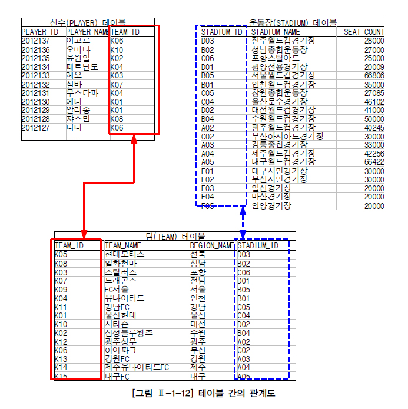
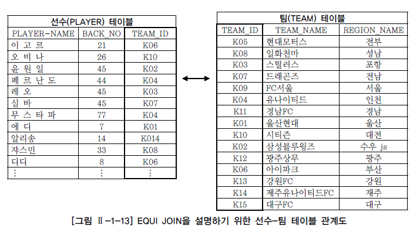
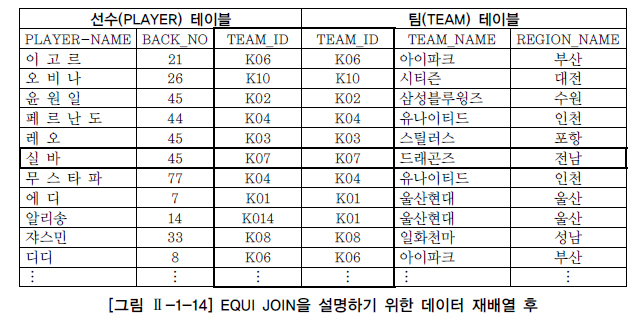
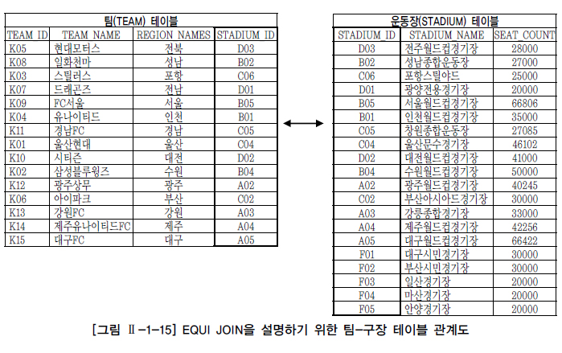
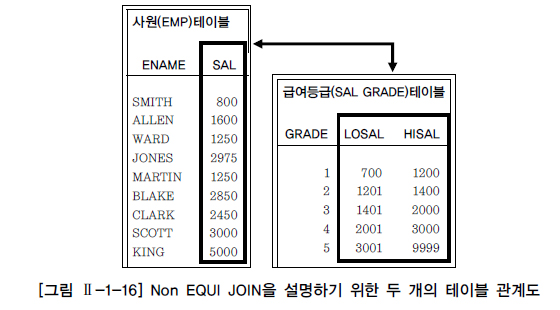
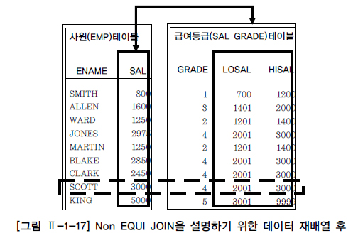

# 조인(JOIN)

## 1. JOIN 개요

지금까지는 하나의 테이블에서 데이터를 출력하는 것을 살펴보았다. 하지만, 이것은 일상생활에서 발생하는 다양한 조건을 만족하는 SQL 문장을 작성하기에는 부족하다. 예를 들어, [그림 Ⅱ-1-12]와 같이 선수들의 소속팀에 대한 정보나 프로 축구팀의 전용구장에 대한 정보 등 다른 정보가 들어있는 두 개 이상의 테이블과 연결 또는 결합하여 데이터를 출력하는 경우가 아주 많이 발생한다. 두 개 이상의 테이블 들을 연결 또는 결합하여 데이터를 출력하는 것을 JOIN이라고 하며, 일반적으로 사용되는 SQL 문장의 상당수가 JOIN이라고 생각하면 JOIN의 중요성을 이해하기 쉬울 것이다. JOIN은 관계형 데이터베이스의 가장 큰 장점이면서 대표적인 핵심 기능이라고 할 수 있다. 일반적인 경우 행들은 PRIMARY KEY(PK)나 FOREIGN KEY(FK) 값의 연관에 의해 JOIN이 성립된다. 하지만 어떤 경우에는 이러한 PK, FK의 관계가 없어도 논리적인 값들의 연관만으로 JOIN이 성립 가능하다. 선수라는 테이블과 팀이라는 테이블이 있는 경우, 선수 테이블을 기준으로 필요한 데이터를 검색하고 이 데이터와 연관된 팀 테이블의 특정 행을 찾아오는 과정이 JOIN을 이용하여 데이터를 검색하는 과정으로 볼 수 있는 것이다. 팀과 운동장 테이블도 조인 조건을 통해 필요한 데이터를 조합해서 가져올 수 있으며, 하나의 SQL 문장에서 선수, 팀, 운동장 등 여러 테이블을 조인해서 사용할 수도 있다. 다만 한 가지 주의할 점은 FROM 절에 여러 테이블이 나열되더라도 SQL에서 데이터를 처리할 때는 단 두 개의 집합 간에만 조인이 일어난다는 것이다. FROM 절에 A, B, C 테이블이 나열되었더라도 특정 2개의 테이블만 먼저 조인 처리되고, 2개의 테이블이 조인되어서 처리된 새로운 데이터 집합과 남은 한 개의 테이블이 다음 차례로 조인되는 것이다. 이순서는 4개 이상의 테이블이 사용되더라도 같은 프로세스를 반복한다. 예를 들어 A, B, C, D 4개의 테이블을 조인하고자 할 경우 옵티마이저는 ( ( (A JOIN D) JOIN C) JOIN B)와 같이 순차적으로 조인을 처리하게 된다. 먼저 A와 D 테이블을 조인 처리하고, 그 결과 집합과 C 테이블을 다음 순서에 조인 처리하고, 마지막으로 3개의 테이블을 조인 처리한 집합과 B 테이블을 조인 수행하게 된다. 이때 테이블의 조인 순서는 옵티마이저에 의해서 결정되고 과목3의 주요 튜닝 포인트가 된다. [그림 Ⅱ-1-12]는 선수와 팀, 팀과 운동장 테이블 간의 관계를 설명한 것이다. 경기일정결과 테이블은 복잡성을 피하기 위해 설명상 제외하였다.

## 2. EQUI JOIN

EQUI(등가) JOIN은 두 개의 테이블 간에 칼럼 값들이 서로 정확하게 일치하는 경우에 사용되는 방법으로 대부분 PK ↔ FK의 관계를 기반으로 한다. 그러나 일반적으로 테이블 설계 시에 나타난 PK ↔ FK의 관계를 이용하는 것이지 반드시 PK ↔ FK의 관계로만 EQUI JOIN이 성립하는 것은 아니다. 이 기능은 계층형(Hierarchical)이나 망형(Network) 데이터베이스와 비교해서 관계형 데이터베이스의 큰 장점이다. JOIN의 조건은 WHERE 절에 기술하게 되는데 “=” 연산자를 사용해서 표현한다. 다음은 EQUI JOIN의 대략적인 형태이다.

SELECT 테이블1.칼럼명, 테이블2.칼럼명, ... FROM 테이블1, 테이블2 WHERE 테이블1.칼럼명1 = 테이블2.칼럼명2; → WHERE 절에 JOIN 조건을 넣는다.

같은 내용을 ANSI/ISO SQL 표준 방식으로 표현하면 아래와 같다. ON 절에 대해서는 2장 1절에서 자세히 다룬다.

SELECT 테이블1.칼럼명, 테이블2.칼럼명, ... FROM 테이블1 INNER JOIN 테이블2 ON 테이블1.칼럼명1 = 테이블2.칼럼명2; → ON 절에 JOIN 조건을 넣는다.

[예제] 선수 테이블과 팀 테이블에서 선수 이름과 소속된 팀의 이름을 출력하시오.

[예제] SELECT PLAYER.PLAYER_NAME 선수명, TEAM.TEAM_NAME 소속팀명 FROM PLAYER, TEAM WHERE PLAYER.TEAM_ID = TEAM.TEAM_ID; 또는 INNER JOIN을 명시하여 사용할 수도 있다. SELECT PLAYER.PLAYER_NAME 선수명, TEAM.TEAM_NAME 소속팀명 FROM PLAYER INNER JOIN TEAM ON PLAYER.TEAM_ID = TEAM.TEAM_ID;

위 SQL을 보면 SELECT 구문에 단순히 칼럼명이 오지 않고 “테이블명.칼럼명”처럼 테이블명과 칼럼명이 같이 나타난다. 이렇게 특정 칼럼에 접근하기 위해 그 칼럼이 어느 테이블에 존재하는 칼럼인지를 명시하는 것은 두 가지 이유가 있다. 먼저 모든 테이블에 칼럼들이 유일한 이름을 가진다면 상관없지만, JOIN에 사용되는 두 개의 테이블에 같은 칼럼명이 존재하는 경우에는 DBMS의 옵티마이저는 어떤 칼럼을 사용해야 할지 모르기 때문에 파싱 단계에서 에러가 발생된다. 두 번째는 개발자나 사용자가 조회할 데이터가 어느 테이블에 있는 칼럼을 말하는 것인지 쉽게 알 수 있게 하므로 SQL에 대한 가독성이나 유지보수성을 높이는 효과가 있다. 하나의 SQL 문장 내에서 유일하게 사용하는 칼럼명이라면 칼럼명 앞에 테이블 명을 붙이지 않아도 되지만, 현재 두 집합에서 유일하다고 하여 미래에도 두 집합에서 유일하다는 보장은 없기 때문에 향후 발생할 오류를 방지하고 일관성을 위해 유일한 칼럼도 출력할 칼럼명 앞에 테이블명을 붙여서 사용하는 습관을 기르는 것을 권장한다. 조인 조건에 맞는 데이터만 출력하는 INNER JOIN에 참여하는 대상 테이블이 N개라고 했을 때, N개의 테이블로부터 필요한 데이터를 조회하기 위해 필요한 JOIN 조건은 대상 테이블의 개수에서 하나를 뺀 N-1개 이상이 필요하다. 즉 FROM 절에 테이블이 3개가 표시되어 있다면 JOIN 조건은 3-1=2개 이상이 필요하며, 테이블이 4개가 표시되어 있다면 JOIN 조건은 4-1=3개 이상이 필요하다. (옵티마이저의 발전으로 옵티마이저가 일부 JOIN 조건을 실행계획 수립 단계에서 추가할 수도 있지만, 예외적인 사항이다.) JOIN 조건은 WHERE 절에 기술하며, JOIN은 두 개 이상의 테이블에서 필요한 데이터를 출력하기 위한 가장 기본적인 조건이다. FROM 절에 조인 조건을 명시하는 또 다른 방법은 2장 1절에서 설명한다. (JOIN 조건이 없는 CROSS JOIN도 2장 1절에서 설명한다.) 위 예제는 테이블1과 테이블2 이름을 가진 두개 테이블에 2 - 1 = 1인 한 개의 JOIN 조건(PLAYER.TEAM_ID = TEAM.TEAM_ID)을 WHERE 절에 기술한 것이다.

### 가. 선수-팀 EQUI JOIN 사례

[그림 Ⅱ-1-13]과 같이 선수(PLAYER) 테이블과 팀(TEAM) 테이블에서 K-리그 소속 선수들의 이름, 백넘버와 그 선수가 소속되어 있는 팀명 및 연고지를 알고 싶다는 요구사항을 확인한다.

이 질의를 해결하기 위해 테이블 간의 관계를 이해할 필요가 있다. 우선 선수(PLAYER) 테이블과 팀(TEAM) 테이블에 있는 데이터와 이들 간의 관계를 나타내는 그림을 통해서?. 위와 같이 선수들의 정보가 들어 있는 선수(PLAYER) 테이블이 있고, 팀의 정보가 들어 있는 팀(TEAM) 테이블이 있다. 그런데 선수(PLAYER) 테이블에 있는 소속팀코드(TEAM_ID) 칼럼이 팀(TEAM) 테이블의 팀코드(TEAM_ID)와 PK(팀 테이블의 팀코드)와 FK(선수 테이블의 소속팀 코드)의 관계에 있다. 선수들과 선수들이 소속해 있는 팀명 및 연고지를 알아보기 위해서 선수 테이블의 소속팀코드를 기준으로 팀 테이블에 들어 있는 데이터를 다음과 같이 순서를 바꾸어 주면 아래 [그림 Ⅱ-1-14]와 같이 바꿀 수 있다.

[그림 Ⅱ-1-14]의 실바 선수를 예로 들면 백넘버는 45번이고, 소속팀코드는 K07번이다. K07번 팀코드의 팀명은 드래곤즈이고 연고지는 전남이라는 결과를 얻을 수 있게 된다.

[예제] [그림 Ⅱ-1-14]의 데이터를 출력하기 위한 SELECT SQL 문장을 작성한다.

[예제] SELECT PLAYER.PLAYER_NAME, PLAYER.BACK_NO, PLAYER.TEAM_ID, TEAM.TEAM_NAME, TEAM.REGION_NAME FROM PLAYER, TEAM WHERE PLAYER.TEAM_ID = TEAM.TEAM_ID; 또는 INNER JOIN을 명시하여 사용할 수도 있다. SELECT PLAYER.PLAYER_NAME, PLAYER.BACK_NO, PLAYER.TEAM_ID, TEAM.TEAM_NAME, TEAM.REGION_NAME FROM PLAYER INNER JOIN TEAM ON PLAYER.TEAM_ID = TEAM.TEAM_ID;

[실행 결과] PLAYER_NAME BACK_NO TEAM_ID TEAM_NAME REGION_NAME ----------- ------- ------- ---------- ----------- 이고르 21 K06 아이파크 부산 오비나 26 K10 시티즌 대전 윤원일 45 K02 삼성블루윙즈 수원 페르난도 44 K04 유나이티드 인천 레오 45 K03 스틸러스 포항 실바 45 K07 드래곤즈 전남 무스타파 77 K04 유나이티드 인천 에디 7 K01 울산현대 울산 알리송 14 K01 울산현대 울산 쟈스민 33 K08 일화천마 성남 디디 8 K06 아이파크 부산 480개 항이 선택되었다.

위 예제를 확인하면 JOIN 대상이 되는 테이블명이 조회하고자 하는 칼럼 앞에 반복해서 나오는 것을 알 수 있다. 긴 테이블명을 계속 되풀이해서 입력하다보면 개발 생산성이 떨어지는 문제점과 함께 개발자의 실수가 발생할 가능성이 높아지는 문제가 있다. 그래서 SELECT 절에서 칼럼에 대한 ALIAS를 사용하는 것처럼 FROM 절의 테이블에 대해서도 ALIAS를 사용할 수 있다. 조회할 칼럼명 앞에 테이블명을 명시적으로 기술하는 것이 이론적으로는 가장 좋은 방법일 수 있지만, 테이블명이 길고 SQL의 복잡도가 높아지면 오히려 가독성이 떨어지기 때문에 테이블명 대신 ALIAS를 주로 사용한다. 단일 테이블을 사용하는 SQL 문장에서는 필요성은 없지만 사용하더라도 에러는 발생하지 않으며, 여러 테이블을 사용하는 조인을 이용하는 경우는 매우 유용하게 사용할 수 있다.

[예제] 칼럼과 테이블에 ALIAS를 적용하여 위 SQL을 수정한다. 실행 결과는 ALIAS 적용 전과 같음을 확인 할 수 있다.

[예제] SELECT P.PLAYER_NAME 선수명, P.BACK_NO 백넘버, P.TEAM_ID 팀코드, T.TEAM_NAME 팀명, T.REGION_NAME 연고지 FROM PLAYER P, TEAM T WHERE P.TEAM_ID = T.TEAM_ID; 또는 INNER JOIN을 명시하여 사용할 수도 있다. SELECT P.PLAYER_NAME 선수명, P.BACK_NO 백넘버, P.TEAM_ID 팀코드, T.TEAM_NAME 팀명, T.REGION_NAME 연고지 FROM PLAYER P INNER JOIN TEAM T ON P.TEAM_ID = T.TEAM_ID;

[실행 결과] 선수명 백넘버 팀코드 팀명 연고지 -------- ----- ----- -------- ----- 이고르 21 K06 아이파크 부산 오비나 26 K10 시티즌 대전 윤원일 45 K02 삼성블루윙즈 수원 페르난도 44 K04 유나이티드 인천 레오 45 K03 스틸러스 포항 실바 45 K07 드래곤즈 전남 무스타파 77 K04 유나이티드 인천 에디 7 K01 울산현대 울산 알리송 14 K01 울산현대 울산 쟈스민 33 K08 일화천마 성남 디디 8 K06 아이파크 부산 … … … … … 480개 항이 선택되었다.

### 나. 선수-팀 WHERE 절 검색 조건 사례

지금까지는 EQUI JOIN에 대한 JOIN 조건만을 다루었는데, 추가로 WHERE 절에서 JOIN 조건 이외의 검색 조건에 대한 제한 조건을 덧붙여 사용할 수 있다. 즉, EQUI JOIN의 최소한의 연관 관계를 위해서 테이블 개수 - 1개의 JOIN 조건을 WHERE 절에 명시하고, 부수적인 제한 조건을 논리 연산자를 통하여 추가로 입력하는 것이 가능하다.

[예제] 위 SQL 문장의 WHERE 절에 포지션이 골키퍼인(골키퍼에 대한 포지션 코드는 ‘GK’임) 선수들에 대한 데이터만을 백넘버 순으로 출력하는 SQL문을 만들어 본다.

[예제] SELECT P.PLAYER_NAME 선수명, P.BACK_NO 백넘버, T.REGION_NAME 연고지, T.TEAM_NAME 팀명 FROM PLAYER P, TEAM T WHERE P.TEAM_ID = T.TEAM_ID AND P.POSITION = 'GK' ORDER BY P.BACK_NO; 또는 INNER JOIN을 명시하여 사용할 수도 있다. SELECT P.PLAYER_NAME 선수명, P.BACK_NO 백넘버, T.REGION_NAME 연고지, T.TEAM_NAME 팀명 FROM PLAYER P INNER JOIN TEAM T ON P.TEAM_ID = T.TEAM_ID WHERE P.POSITION = 'GK' ORDER BY P.BACK_NO;

[실행 결과] 선수명 백넘버 연고지 팀명 ------- ---- ----- ---- 최종문 1 전남 드래곤즈 정병지 1 포항 스틸러스 박유석 1 부산 아이파크 김승준 1 대전 시티즌 이현 1 인천 유나이티드 김운재 1 수원 삼성블루윙즈 정해운 1 성남 일화천마 권정혁 1 울산 울산현대 최동석 1 서울 FC서울 김창민 1 전북 현대모터스 김용발 18 전북 현대모터스 한동진 21 인천 유나이티드 이은성 21 대전 시티즌 김준호 21 포항 스틸러스 조범철 21 수원 삼성블루윙즈 백민철 21 서울 FC서울 권찬수 21 성남 일화천마 서동명 21 울산 울산현대 강성일 30 대전 시티즌 김대희 31 포항 스틸러스 남현우 31 인천 유나이티드 정지혁 31 부산 아이파크 양영민 31 성남 일화천마 염동균 31 전남 드래곤즈 이무림 31 울산 울산현대 최관민 31 전북 현대모터스 최호진 31 수원 삼성블루윙즈 우태식 31 서울 FC서울 김정래 33 전남 드래곤즈 최창주 40 울산 울산현대 정용대 40 부산 아이파크 정경진 41 부산 아이파크 정광수 41 수원 삼성블루윙즈 정경두 41 성남 일화천마 허인무 41 포항 스틸러스 정영광 41 전남 드래곤즈 조의손 44 서울 FC서울 정이섭 45 전북 현대모터스 양지원 45 울산 울산현대 선원길 46 강원 강원FC 최주호 51 포항 스틸러스 최동우 60 전북 현대모터스 김충호 60 인천 유나이티드 43개 항이 선택되었다.

JOIN 조건을 기술할 때 주의해야 할 사항이 한 가지 있다. 만약 테이블에 대한 ALIAS를 적용해서 SQL 문장을 작성했을 경우, WHERE 절과 SELECT 절에는 테이블명이 아닌 테이블에 대한 ALIAS를 사용해야 한다는 점이다. 그러나, 권장 사항은 아니지만 하나의 SQL 문장 내에서 유일하게 사용하는 칼럼명이라면 칼럼명 앞에 ALIAS를 붙이지 않아도 된다.

[예제] 위 SQL 문장에서 FROM 절에서 테이블에 대한 ALIAS를 정의했는데, SELECT 절이나 WHERE 절에서 테이블명을 사용한다면 DBMS의 옵티마이저가 칼럼명이 부적합하다는 에러를 파싱 단계에서 발생시킨다. (SQL 문장의 파싱 순서는 FROM 절, WHERE 절, SELECT 절, ORDER BY 절 순서이다.)

[예제 및 실행 결과] SELECT PLAYER.PLAYER_NAME 선수명, P.BACK_NO 백넘버, T.REGION_NAME 연고지, T.TEAM_NAME 팀명 FROM PLAYER P, TEAM T WHERE P.TEAM_ID = T.TEAM_ID AND P.POSITION = 'GK' ORDER BY P.BACK_NO; SELECT PLAYER.PLAYER_NAME 선수명, P.BACK_NO 백넘버, * 1행에 오류: ERROR: 열명이 부적합하다.

### 다. 팀-구장 EQUI JOIN 사례

[예제] 이번에는 [그림 Ⅱ-1-15]에 나와 있는 팀(TEAM) 테이블과 구장(STADIUM) 테이블의 관계를 이용해서 소속팀이 가지고 있는 전용구장의 정보를 팀의 정보와 함께 출력하는 SQL문을 작성한다.

[예제] SELECT TEAM.REGION_NAME, TEAM.TEAM_NAME, TEAM.STADIUM_ID, STADIUM.STADIUM_NAME, STADIUM.SEAT_COUNT FROM TEAM, STADIUM WHERE TEAM.STADIUM_ID = STADIUM.STADIUM_ID; 또는 INNER JOIN을 명시하여 사용할 수도 있다. SELECT TEAM.REGION_NAME, TEAM.TEAM_NAME, TEAM.STADIUM_ID, STADIUM.STADIUM_NAME, STADIUM.SEAT_COUNT FROM TEAM INNER JOIN STADIUM ON TEAM.STADIUM_ID = STADIUM.STADIUM_ID; 위 SQL문과 ALIAS를 사용한 아래 SQL문은 같은 결과를 얻을 수 있다. SELECT T.REGION_NAME, T.TEAM_NAME, T.STADIUM_ID, S.STADIUM_NAME, S.SEAT_COUNT FROM TEAM T, STADIUM S WHERE T.STADIUM_ID = S.STADIUM_ID; 또는 INNER JOIN을 명시하여 사용할 수도 있다. SELECT T.REGION_NAME, T.TEAM_NAME, T.STADIUM_ID, S.STADIUM_NAME, S.SEAT_COUNT FROM TEAM T INNER JOIN STADIUM S ON T.STADIUM_ID = S.STADIUM_ID; 중복이 되지 않는 칼럼의 경우 ALIAS를 사용하지 않아도 되므로, 아래 SQL 문은 위 SQL문과 같은 결과를 얻을 수 있다. 그러나 같은 이름을 가진 중복 칼럼의 경우는 테이블명이나 ALIAS가 필수 조건이다. SELECT REGION_NAME, TEAM_NAME, T.STADIUM_ID, STADIUM_NAME, SEAT_COUNT FROM TEAM T, STADIUM S WHERE T.STADIUM_ID = S.STADIUM_ID;

[실행 결과] REGION_NAME TEAM_NAME STADIUM_ID STADIUM_NAME SEAT_COUNT ----------- ------------ --------- ------------ ---------- 전북 현대모터스 D03 전주월드컵경기장 28000 성남 일화천마 B02 성남종합운동장 27000 포항 스틸러스 C06 포항스틸야드 25000 전남 드래곤즈 D01 광양전용경기장 20009 서울 FC서울 B05 서울월드컵경기장 66806 인천 유나이티드 B01 인천월드컵경기장 35000 경남 경남FC C05 창원종합운동장 27085 울산 울산현대 C04 울산문수경기장 46102 대전 시티즌 D02 대전월드컵경기장 41000 수원 삼성블루윙즈 B04 수원월드컵경기장 50000 광주 광주상무 A02 광주월드컵경기장 40245 부산 아이파크 C02 부산아시아드경기장 30000 강원 강원FC A03 강릉종합경기장 33000 제주 제주유나이티드FC A04 제주월드컵경기장 42256 대구 대구FC A05 대구월드컵경기장 66422 15개의 행이 선택되었다.

## 3. Non EQUI JOIN

Non EQUI(비등가) JOIN은 두 개의 테이블 간에 칼럼 값들이 서로 정확하게 일치하지 않는 경우에 사용된다. Non EQUI JOIN의 경우에는 “=” 연산자가 아닌 다른(Between, >, >=, <, <= 등) 연산자들을 사용하여 JOIN을 수행하는 것이다. 두 개의 테이블이 PK-FK로 연관관계를 가지거나 논리적으로 같은 값이 존재하는 경우에는 “=” 연산자를 이용하여 EQUI JOIN을 사용한다. 그러나 두 개의 테이블 간에 칼럼 값들이 서로 정확하게 일치하지 않는 경우에는 EQUI JOIN을 사용할 수 없다. 이런 경우 Non EQUI JOIN을 시도할 수 있으나 데이터 모델에 따라서 Non EQUI JOIN이 불가능한 경우도 있다. 다음은 Non EQUI JOIN의 대략적인 형태이다. 아래 BETWEEN a AND b 조건은 Non EQUI JOIN의 한 사례일 뿐이다.

SELECT 테이블1.칼럼명, 테이블2.칼럼명, ... FROM 테이블1, 테이블2 WHERE 테이블1.칼럼명1 BETWEEN 테이블2.칼럼명1 AND 테이블2.칼럼명2;

[예제] Non EQUI JOIN에 대한 샘플은 K-리그 관련 테이블로 구현되지 않으므로, 사원(EMP) 테이블과 가상의 급여등급(SAL_GRADE) 테이블로 설명을 하도록 한다. 어떤 사원이 받고 있는 급여가 어느 등급에 속하는 등급인지 알고 싶다는 요구사항에 대한 Non EQUI JOIN의 사례는 다음과 같다.

[예제] SELECT E.ENAME, E.JOB, E.SAL, S.GRADE FROM EMP E, SALGRADE S WHERE E.SAL BETWEEN S.LOSAL AND S.HISAL;

테이블 간의 관계를 설명하기 위해 먼저 사원(EMP) 테이블과 급여등급(SALGRADE) 테이블에 있는 데이터와 이들 간의 관계를 나타내는 [그림 Ⅱ-1-16]을 가지고 실제적인 데이터들이 어떻게 연결되는지 설명한다. 급여등급(SALGRADE) 테이블에는 1급(700 이상 ~ 1200 이하), 2급(1201 이상 ~ 1400 이하), 3급(1401 이상 ~ 2000 이하), 4급(2001 이상 ~ 3000 이하), 5급(3001 이상 ~ 9999 이하)으로 구분한 5개의 급여등급이 존재한다고 가정한다.

사원(EMP) 테이블에서 사원들의 급여가 급여등급(SALGRADE) 테이블의 등급으로 표시되기 위해서는 “=” 연산자로 JOIN을 이용할 수가 없다. 그래서 사원들과 사원들의 급여가 급여등급 테이블의 어느 급여등급에 해당되는지 알아보기 위해서 사원 테이블에 들어 있는 데이터를 기준으로 급여등급 테이블의 어느 등급에 속하는지 1:1로 해당하는 값들을 나열해 보면 아래 [그림 Ⅱ-1-17]과 같이 바꿀 수 있다.

[그림 Ⅱ-1-17]을 보면 SCOTT라는 사원을 예로 들어 급여는 3,000달러($)이고, 3,000달러($)는 급여등급 테이블에서 2,001 ~ 3,000달러($) 사이의 4급에 해당하는 급여등급이라는 값을 얻을 수 있다.

[예제] 사원 14명 모두에 대해 아래 SQL로 급여와 급여등급을 알아본다.

[예제] SELECT E.ENAME 사원명, E.SAL 급여, S.GRADE 급여등급 FROM EMP E, SALGRADE S WHERE E.SAL BETWEEN S.LOSAL AND S.HISAL;

[실행 결과] 사원명 급여 급여등급 ------ ---- ------ SMITH 800 1 JAMES 950 1 ADAMS 1100 1 WARD 1250 2 MARTIN 1250 2 MILLER 1300 2 TURNER 1500 3 ALLEN 1600 3 CLARK 2450 4 BLAKE 2850 4 JONES 2975 4 SCOTT 3000 4 FORD 3000 4 KING 5000 5 14개의 행이 선택되었다.

앞에서도 언급했지만 BETWEEN a AND b와 같은 SQL 연산자 뿐만 아니라 “=” 연산자가 아닌 “>”나 “<”와 같은 다른 연산자를 사용했을 경우에도 모두 Non EQUI JOIN에 해당한다. 단지 BETWEEN SQL 연산자가 Non EQUI JOIN을 설명하기 쉽기 때문에 예를 들어 설명한 것에 불과하며, 데이터 모델에 따라서 Non EQUI JOIN이 불가능한 경우도 있다. /p>

## 4. 3개 이상 TABLE JOIN

JOIN을 처음 설명할 때 나왔던 [그림 Ⅱ-1-12]를 보면서 세 개의 테이블에 대한 JOIN을 구현해 보도록 한다. [그림 Ⅱ-1-12]에서는 선수 테이블, 팀 테이블, 운동장 테이블을 예로 들었다. 선수들 별로 홈그라운드 경기장이 어디인지를 출력하고 싶다고 했을 때, 선수 테이블과 운동장 테이블이 서로 관계가 없으므로 중간에 팀 테이블이라는 서로 연관관계가 있는 테이블을 추가해서 세 개의 테이블을 JOIN 해야만 원하는 데이터를 얻을 수 있다.

[예제] 앞의 예제에서 보았듯이 선수 테이블의 소속팀코드(TEAM_ID)가 팀 테이블의 팀코드(TEAM_ID)와 PK-FK의 관계가 있다는 것을 알 수 있고, 운동장 테이블의 운동장코드(STADIUM_ID)와 팀 테이블의 전용구장코드(STADIUM_ID)가 PK-FK 관계인 것을 생각하며 다음 SQL을 작성한다. 세 개의 테이블에 대한 JOIN이므로 WHERE 절에 2개 이상의 JOIN 조건이 필요하다.

[예제] [예제] SELECT P.PLAYER_NAME 선수명, P.POSITION 포지션, T.REGION_NAME 연고지, T.TEAM_NAME 팀명, S.STADIUM_NAME 구장명 FROM PLAYER P, TEAM T, STADIUM S WHERE P.TEAM_ID = T.TEAM_ID AND T.STADIUM_ID = S.STADIUM_ID ORDER BY 선수명; 또는 INNER JOIN을 명시하여 사용할 수도 있다. SELECT P.PLAYER_NAME 선수명, P.POSITION 포지션, T.REGION_NAME 연고지, T.TEAM_NAME 팀명, S.STADIUM_NAME 구장명 FROM PLAYER P INNER JOIN TEAM T ON P.TEAM_ID = T.TEAM_ID INNER JOIN STADIUM S ON T.STADIUM_ID = S.STADIUM_ID ORDER BY 선수명;

[실행 결과] 선수명 포지션 연고지 팀명 구장명 ------ ----- ----- --------- ------------- 가비 MF 수원 삼성블루윙즈 수원월드컵경기장 가이모토 DF 성남 일화천마 성남종합운동장 강대희 MF 수원 삼성블루윙즈 수원월드컵경기장 강성일 GK 대전 시티즌 대전월드컵경기장 강용 DF 포항 스틸러스 포항스틸야드 강정훈 MF 대전 시티즌 대전월드컵경기장 강철 DF 전남 드래곤즈 광양전용경기장 고관영 MF 전북 현대모터스 전주월드컵경기장 고규억 DF 광주 광주상무 광주월드컵경기장 고민기 FW 전북 현대모터스 전주월드컵경기장 고병운 DF 포항 스틸러스 포항스틸야드 고종수 MF 수원 삼성블루윙즈 수원월드컵경기장 고창현 MF 수원 삼성블루윙즈 수원월드컵경기장 공오균 MF 대전 시티즌 대전월드컵경기장 곽경근 FW 인천 유나이티드 인천월드컵경기장 곽기훈 FW 울산 울산현대 울산문수경기장 곽기훈 FW 울산 울산현대 울산문수경기장 곽치국 MF 성남 일화천마 성남종합운동장 … … … … … 480개의 행이 선택되었다.

지금까지 JOIN에 대한 기본적인 사용법을 확인해 보았는데, JOIN이 필요한 기본적인 이유는 과목1에서 배운 정규화에서부터 출발한다. 정규화란 불필요한 데이터의 정합성을 확보하고 이상현상(Anomaly) 발생을 피하기 위해, 테이블을 분할하여 생성하는 것이다. 사실 데이터웨어하우스 모델처럼 하나의 테이블에 모든 데이터를 집중시켜놓고 그 테이블로부터 필요한 데이터를 조회할 수도 있다. 그러나 이렇게 됐을 경우, 가장 중요한 데이터의 정합성에 더 큰 비용을 지불해야 하며, 데이터를 추가, 삭제, 수정하는 작업 역시 상당한 노력이 요구될 것이다. 성능 측면에서도 간단한 데이터를 조회하는 경우에도 규모가 큰 테이블에서 필요한 데이터를 찾아야 하기 때문에 오히려 검색 속도가 떨어질 수도 있다. 테이블을 정규화하여 데이터를 분할하게 되면 위와 같은 문제는 자연스럽게 해결 된다. 그렇지만 특정 요구조건을 만족하는 데이터들을 분할된 테이블로부터 조회하기 위해서는 테이블 간에 논리적인 연관관계가 필요하고 그런 관계성을 통해서 다양한 데이터들을 출력할 수 있는 것이다. 그리고, 이런 논리적인 관계를 구체적으로 표현하는 것이 바로 SQL 문장의 JOIN 조건인 것이다. 관계형 데이터베이스의 큰 장점이면서, SQL 튜닝의 중요 대상이 되는 JOIN을 잘못 기술하게 되면 시스템 자원 부족이나 과다한 응답시간 지연을 발생시키는 중요 원인이 되므로 JOIN 조건은 신중하게 작성해야 한다.