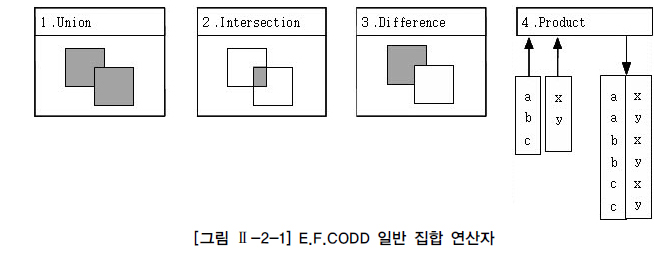

# 표준 조인

## 1. STANDARD SQL 개요

1970년: Dr. E.F.Codd 관계형 DBMS(Relational DB) 논문 발표 1974년: IBM SQL 개발 1979년: Oracle 상용 DBMS 발표 1980년: Sybase SQL Server 발표 (이후 Sybase ASE로 개명) 1983년: IBM DB2 발표 1986년: ANSI/ISO SQL 표준 최초 제정 (SQL-86, SQL1) 1992년: ANSI/ISO SQL 표준 개정 (SQL-92, SQL2) 1993년: MS SQL Server 발표 (Windows OS, Sybase Code 활용) 1999년: ANSI/ISO SQL 표준 개정 (SQL-99, SQL3) 2003년: ANSI/ISO SQL 표준 개정 (SQL-2003) 2008년: ANSI/ISO SQL 표준 개정 (SQL-2008)

국내뿐만 아니라 전 세계적으로 많이 사용되고 있는 관계형 데이터베이스의 경우 오브젝트 개념을 포함한 여러 새로운 기능들이 꾸준히 개발되고 있으며, 현재 기업형 DBMS는 순수 관계형 데이터베이스가 아닌 객체 지원 기능이 포함된 객체관계형(Object Relational) 데이터베이스를 대부분 사용하고 있다. 현재 우리가 사용하는 많은 시스템의 두뇌 역할을 하는 관계형 데이터베이스를 유일하게 접속할 수 있는 언어가 바로 SQL이다. 사용자와 개발자 입장에서는 SQL의 진화 및 변화가 가장 큰 관심 내용인데, 초창기 SQL의 기본 기능을 정리했던 최초의 SQL-86 표준과 관계형 DBMS의 폭발적인 전성기를 주도했던 ANSI/ISO SQL2 세대를 지나면서 많은 기술적인 발전이 있었다. 그러나, ANSI/ISO SQL2의 경우 표준 SQL에 대한 명세가 부족한 부분이 있었고, DBMS 벤더 별로 문법이나 사용되는 용어의 차이가 너무 커져서 상호 호환성이나 SQL 학습 효율이 많이 부족한 문제가 발생하였다. 이에 향후 SQL에서 필요한 기능을 정리하고 호환 가능한 여러 기준을 제정한 것이 1999년에 정해진 ANSI/ISO SQL3이다. 이후 가장 먼저 ANSI/ISO SQL3의 기능을 시현한 것이 Oracle의 8i/9i 버전이라고 할 수 있다. 참고로 2003년에 ANSI/ISO SQL 기준이 소폭 추가 개정되었고 현재 사용되는 데이터베이스는 대부분 SQL-2003 표준을 기준으로 하고 있다. 다른 벤더의 DBMS도 2006년 이후 발표된 버전에서 ANSI/ISO SQL-99와 SQL-2003의 핵심적인 기능은 만족스러운 수준으로 구현된 것으로 평가 받고 있다. 마지막으로 2008년에 진행된 추가 개정 내용은 아직 사용자 레벨에 큰 영향을 미치지 않고 있다. 아직도 벤더별로 일부 기능의 개발이 진행 중인 경우도 있고 벤더별 특이한 기술 용어는 여전히 호환이 안 되고 있지만, ANSI/ISO SQL 표준을 통해 STANDARD JOIN을 포함한 많은 기능이 상호 벤치마킹하고 발전하면서 DBMS 간에 평준화를 이루어 가고 있다고 볼 수 있다. 예를 들면, IBM DB2나 SYBASE ASE DBMS는 과거 버전부터 CASE 기능이나 FULL OUTER JOIN 기능을 지원하였지만, Oracle DBMS는 양쪽(FULL) OUTER JOIN의 경우 (+) 표시를 이용한 두 개의 SQL 문장을 UNION 오퍼레이션으로 처리하거나, CASE 기능을 구현하기 위해 DECODE 함수를 복잡하게 구현해야 하는 불편함이 있었다. 이런 불편 사항은 Oracle에서 표준 SQL에 포함된 CASE 기능과 FULL OUTER JOIN 기능을 추가함으로써 문제가 해결되었다.(참고로, Oracle DECODE 함수가 CASE 기능보다 장점도 있으므로 Oracle 사용자는 요구사항에 따라 DECODE나 CASE 함수를 선택할 수 있다.) 결과적으로 사용자 입장에서는 ANSI/ISO SQL의 새로운 기능들을 사용함으로써 보다 쉽게 데이터를 추출하거나 SQL 튜닝의 효과를 함께 얻을 수 있게 되었다. 대표적인 ANSI/ISO 표준 SQL의 기능은 다음 내용을 포함한다.

\- STANDARD JOIN 기능 추가 (CROSS, OUTER JOIN 등 새로운 FROM 절 JOIN 기능들) - SCALAR SUBQUERY, TOP-N QUERY 등의 새로운 SUBQUERY 기능들 - ROLLUP, CUBE, GROUPING SETS 등의 새로운 리포팅 기능 - WINDOW FUNCTION 같은 새로운 개념의 분석 기능들

### 가. 일반 집합 연산자

현재 사용하는 SQL의 많은 기능이 관계형 데이터베이스의 이론을 수립한 E.F.Codd 박사의 논문에 언급이 되어 있다. 논문에 언급된 8가지 관계형 대수는 다시 각각 4개의 일반 집합 연산자와 순수 관계 연산자로 나눌 수 있으며, 관계형 데이터베이스 엔진 및 SQL의 기반 이론이 되었다. 일반 집합 연산자를 현재의 SQL과 비교하면,

\1. UNION 연산은 UNION 기능으로, 2. INTERSECTION 연산은 INTERSECT 기능으로, 3. DIFFERENCE 연산은 EXCEPT(Oracle은 MINUS) 기능으로, 4. PRODUCT 연산은 CROSS JOIN 기능으로 구현되었다.

첫 번째, UNION 연산은 수학적 합집합을 제공하기 위해, 공통 교집합의 중복을 없애기 위한 사전 작업으로 시스템에 부하를 주는 정렬 작업이 발생한다. 이후 UNION ALL 기능이 추가되었는데, 특별한 요구 사항이 없다면 공통집합을 중복해서 그대로 보여 주기 때문에 정렬 작업이 일어나지 않는 장점을 가진다. 만일 UNION과 UNION ALL의 출력 결과가 같다면, 응답 속도 향상이나 자원 효율화 측면에서 데이터 정렬 작업이 발생하지 않는 UNION ALL을 사용하는 것을 권고한다. 두 번째, INTERSECTION은 수학의 교집합으로써 두 집합의 공통집합을 추출한다. 세 번째, DIFFERENCE는 수학의 차집합으로써 첫 번째 집합에서 두 번째 집합과의 공통집합을 제외한 부분이다. 대다수 벤더는 EXCEPT를, Oracle은 MINUS 용어를 사용한다. (SQL 표준에는 EXCEPT로 표시되어 있으며, 벤더에서 SQL 표준 기능을 구현할 때 다른 용어를 사용하는 것은 현실적으로 허용되고 있다.) 네 번째, PRODUCT의 경우는 CROSS(ANIS/ISO 표준) PRODUCT라고 불리는 곱집합으로, JOIN 조건이 없는 경우 생길 수 있는 모든 데이터의 조합을 말한다. 양쪽 집합의 M*N 건의 데이터 조합이 발생하며, CARTESIAN(수학자 이름) PRODUCT라고도 표현한다.

### 나. 순수 관계 연산자

순수 관계 연산자는 관계형 데이터베이스를 구현하기 위해 새롭게 만들어진 연산자이다. 순수 관계 연산자를 현재의 SQL 문장과 비교하면 다음과 같다.

\5. SELECT 연산은 WHERE 절로 구현되었다. 6. PROJECT 연산은 SELECT 절로 구현되었다. 7. (NATURAL) JOIN 연산은 다양한 JOIN 기능으로 구현되었다. 8. DIVIDE 연산은 현재 사용되지 않는다.

다섯 번째, SELECT 연산은 SQL 문장에서는 WHERE 절의 조건절 기능으로 구현이 되었다. (SELECT 연산과 SELECT 절의 의미가 다름을 유의하자.) 여섯 번째, PROJECT 연산은 SQL 문장에서는 SELECT 절의 칼럼 선택 기능으로 구현이 되었다. 일곱 번째, JOIN 연산은 WHERE 절의 INNER JOIN 조건과 함께 FROM 절의 NATURAL JOIN, INNER JOIN, OUTER JOIN, USING 조건절, ON 조건절 등으로 가장 다양하게 발전하였다. 여덟 번째, DIVIDE 연산은 나눗셈과 비슷한 개념으로 왼쪽의 집합을 ‘XZ’로 나누었을 때, 즉 ‘XZ’를 모두 가지고 있는 ‘A’가 답이 되는 기능으로 현재 사용되지 않는다. 관계형 데이터베이스의 경우 요구사항 분석, 개념적 데이터 모델링, 논리적 데이터 모델링, 물리적 데이터 모델링 단계를 거치게 되는데, 이 단계에서 엔터티 확정 및 정규화 과정, 그리고 M:M (다대다) 관계를 분해하는 절차를 거치게 된다. 특히 정규화 과정의 경우 데이터 정합성과 데이터 저장 공간의 절약을 위해 엔터티를 최대한 분리하는 작업으로, 일반적으로 3차 정규형이나 보이스코드 정규형까지 진행하게 된다. 이런 정규화를 거치면 하나의 주제에 관련 있는 엔터티가 여러 개로 나누어지게 되고, 이 엔터티들이 주로 테이블이 되는데 이렇게 흩어진 데이터를 연결해서 원하는 데이터를 가져오는 작업이 바로 JOIN이라고 할 수 있다. 관계형 데이터베이스에 있어서 JOIN은 SQL의 가장 중요한 기능이므로 충분히 이해할 필요가 있다.

## 2. FROM 절 JOIN 형태

ANSI/ISO SQL에서 표시하는 FROM 절의 JOIN 형태는 다음과 같다.

\- INNER JOIN - NATURAL JOIN - USING 조건절 - ON 조건절 - CROSS JOIN - OUTER JOIN

ANSI/ISO SQL에서 규정한 JOIN 문법은 WHERE 절을 사용하던 기존 JOIN 방식과 차이가 있다. 사용자는 기존 WHERE 절의 검색 조건과 테이블 간의 JOIN 조건을 구분 없이 사용하던 방식을 그대로 사용할 수 있으면서, 추가된 선택 기능으로 테이블 간의 JOIN 조건을 FROM 절에서 명시적으로 정의할 수 있게 되었다. INNER JOIN은 WHERE 절에서부터 사용하던 JOIN의 DEFAULT 옵션으로 JOIN 조건에서 동일한 값이 있는 행만 반환한다. DEFAULT 옵션이므로 생략이 가능하지만, CROSS JOIN, OUTER JOIN과는 같이 사용할 수 없다. NATURAL JOIN은 INNER JOIN의 하위 개념으로 NATURAL JOIN은 두 테이블 간의 동일한 이름을 갖는 모든 칼럼들에 대해 EQUI(=) JOIN을 수행한다. NATURAL INNER JOIN이라고도 표시할 수 있으며, 결과는 NATURAL JOIN과 같다. 새로운 SQL JOIN 문장 중에서 가장 중요하게 기억해야 하는 문장은 ON 조건절을 사용하는 경우이다. 과거 WHERE 절에서 JOIN 조건과 데이터 검증 조건이 같이 사용되어 용도가 불분명한 경우가 발생할 수 있었는데, WHERE 절의 JOIN 조건을 FROM 절의 ON 조건절로 분리하여 표시함으로써 사용자가 이해하기 쉽도록 한다. ON 조건절의 경우 NATURAL JOIN처럼 JOIN 조건이 숨어 있지 않고, 명시적으로 JOIN 조건을 구분할 수 있고, NATURAL JOIN이나 USING 조건절처럼 칼럼명이 똑같아야 된다는 제약 없이 칼럼명이 상호 다르더라도 JOIN 조건으로 사용할 수 있으므로 앞으로 가장 많이 사용될 것으로 예상된다. 다만, FROM 절에 테이블이 많이 사용될 경우 다소 복잡하게 보여 가독성이 떨어지는 단점이 있다. 그런 측면에서 SQL Server의 경우 ON 조건절만 지원하고 NATURAL JOIN과 USING 조건절을 지원하지 않고 있는 것으로 보인다. 본 가이드는 ANSI/ISO SQL 기준에 NATURAL JOIN과 USING 조건절이 표시되어 있으므로 이 부분도 설명을 하도록 한다.

## 3. INNER JOIN

INNER JOIN은 OUTER(외부) JOIN과 대비하여 내부 JOIN이라고 하며 JOIN 조건에서 동일한 값이 있는 행만 반환한다. INNER JOIN 표시는 그 동안 WHERE 절에서 사용하던 JOIN 조건을 FROM 절에서 정의하겠다는 표시이므로 USING 조건절이나 ON 조건절을 필수적으로 사용해야 한다.

[예제] 사원 번호와 사원 이름, 소속부서 코드와 소속부서 이름을 찾아본다.

[예제] WHERE 절 JOIN 조건 SELECT EMP.DEPTNO, EMPNO, ENAME, DNAME FROM EMP, DEPT WHERE EMP.DEPTNO = DEPT.DEPTNO; 위 SQL과 아래 SQL은 같은 결과를 얻을 수 있다. FROM 절 JOIN 조건 SELECT EMP.DEPTNO, EMPNO, ENAME, DNAME FROM EMP INNER JOIN DEPT ON EMP.DEPTNO = DEPT.DEPTNO; INNER는 JOIN의 디폴트 옵션으로 아래 SQL문과 같이 생략 가능하다. SELECT EMP.DEPTNO, EMPNO, ENAME, DNAME FROM EMP JOIN DEPT ON EMP.DEPTNO = DEPT.DEPTNO;

[실행 결과] DEPTNO EMPNO ENAME DNAME ------ ----- ------ --------- 20 7369 SMITH RESEARCH 30 7499 ALLEN SALES 30 7521 WARD SALES 20 7566 JONES RESEARCH 30 7654 MARTIN SALES 30 7698 BLAKE SALES 10 7782 CLARK ACCOUNTING 20 7788 SCOTT RESEARCH 10 7839 KING ACCOUNTING 30 7844 TURNER SALES 20 7876 ADAMS RESEARCH 30 7900 JAMES SALES 20 7902 FORD RESEARCH 10 7934 MILLER ACCOUNTING 14개의 행이 선택되었다.

위에서 사용한 ON 조건절에 대해서는 뒤에서 추가 설명하도록 한다.

## 4. NATURAL JOIN

NATURAL JOIN은 두 테이블 간의 동일한 이름을 갖는 모든 칼럼들에 대해 EQUI(=) JOIN을 수행한다. NATURAL JOIN이 명시되면, 추가로 USING 조건절, ON 조건절, WHERE 절에서 JOIN 조건을 정의할 수 없다. 그리고, SQL Server에서는 지원하지 않는 기능이다.

[예제] 사원 번호와 사원 이름, 소속부서 코드와 소속부서 이름을 찾아본다.

[예제] SELECT DEPTNO, EMPNO, ENAME, DNAME FROM EMP NATURAL JOIN DEPT;

[실행 결과] DEPTNO EMPNO ENAME DNAME ------ ------ ------ ------ 20 7369 SMITH RESEARCH 30 7499 ALLEN SALES 30 7521 WARD SALES 20 7566 JONES RESEARCH 30 7654 MARTIN SALES 30 7698 BLAKE SALES 10 7782 CLARK ACCOUNTING 20 7788 SCOTT RESEARCH 10 7839 KING ACCOUNTING 30 7844 TURNER SALES 20 7876 ADAMS RESEARCH 30 7900 JAMES SALES 20 7902 FORD RESEARCH 10 7934 MILLER ACCOUNTING 14개의 행이 선택되었다.

위 SQL은 별도의 JOIN 칼럼을 지정하지 않았지만, 두 개의 테이블에서 DEPTNO라한 것이다. JOIN에 사용된 칼럼들은 같은 데이터 유형이어야 하며, ALIAS나 테이블 명과 같은 접두사를 붙일 수 없다.

[예제] SELECT EMP.DEPTNO, EMPNO, ENAME, DNAME FROM EMP NATURAL JOIN DEPT; ERROR: NATURAL JOIN에 사용된 열은 식별자를 가질 수 없음

NATURAL JOIN은 JOIN이 되는 테이블의 데이터 성격(도메인)과 칼럼명 등이 동일해야 하는 제약 조건이 있다. 간혹 모델링 상의 부주의로 인해 동일한 칼럼명이더라도 다른 용도의 데이터를 저장하는 경우도 있으므로 주의해서 사용해야 한다.

[예제] 아래 '*' 와일드카드처럼 별도의 칼럼 순서를 지정하지 않으면 NATURAL JOIN의 기준이 되는 칼럼 들이 다른 칼럼보다 먼저 출력된다. (ex: DEPTNO가 첫 번째 칼럼이 된다.) 이때 NATURAL JOIN은 JOIN에 사용된 같은 이름의 칼럼을 하나로 처리한다.

[예제] SELECT * FROM EMP NATURAL JOIN DEPT;

[실행 결과] DEPTNO EMPNO ENAME JOB MGR HIREDATE SAL COMM DNAME LOC ----- ----- ----- -------- --- -------- ---- ---- --------- ------ 20 7369 SMITH CLERK 7902 1980-12-17 800 RESEARCH DALLAS 30 7499 ALLEN SALESMAN 7698 1981-02-20 1600 300 SALES CHICAGO 30 7521 WARD SALESMAN 7698 1981-02-22 1250 500 SALES CHICAGO 20 7566 JONES MANAGER 7839 1981-04-02 2975 RESEARCH DALLAS 30 7654 MARTIN SALESMAN 7698 1981-09-28 1250 1400 SALES CHICAGO 30 7698 BLAKE MANAGER 7839 1981-05-01 2850 SALES CHICAGO 10 7782 CLARK MANAGER 7839 1981-06-09 2450 ACCOUNTING NEW YORK 20 7788 SCOTT ANALYST 7566 1987-07-13 3000 RESEARCH DALLAS 10 7839 KING PRESIDENT 1981-11-17 5000 ACCOUNTING NEW YORK 30 7844 TURNER SALESMAN 7698 1981-09-08 1500 SALES CHICAGO 20 7876 ADAMS CLERK 7788 1987-07-13 1100 RESEARCH DALLAS 30 7900 JAMES CLERK 7698 1981-12-03 950 0 SALES CHICAGO 20 7902 FORD ANALYST 7566 1981-12-03 3000 RESEARCH DALLAS 10 7934 MILLER CLERK 7782 1982-01-23 1300 ACCOUNTING NEW YORK 14개의 행이 선택되었다.

[예제] 반면, INNER JOIN의 경우 첫 번째 테이블, 두 번째 테이블의 칼럼 순서대로 데이터가 출력된다. 이때 NATURAL JOIN은 JOIN에 사용된 같은 이름의 칼럼을 하나로 처리하지만, INNER JOIN은 별개의 칼럼으로 표시한다.

[예제] SELECT * FROM EMP INNER JOIN DEPT ON EMP.DEPTNO = DEPT.DEPTNO;

[실행 결과] EMPNO ENAME JOB MGR HIREDATE SAL COMM DEPTNO DEPTNO DNAME LOC ---- ----- ------ --- ------- --- ---- ----- ----- -------- ----- 7369 SMITH CLERK 7902 1980-12-17 800 20 20 RESEARCH DALLAS 7499 ALLEN SALESMAN 7698 1981-02-20 1600 300 30 30 SALES CHICAGO 7521 WARD SALESMAN 7698 1981-02-22 1250 500 30 30 SALES CHICAGO 7566 JONES MANAGER 7839 1981-04-02 2975 20 20 RESEARCH DALLAS 7654 MARTIN SALESMAN 7698 1981-09-28 1250 1400 30 30 SALES CHICAGO 7698 BLAKE MANAGER 7839 1981-05-01 2850 30 30 SALES CHICAGO 7782 CLARK MANAGER 7839 1981-06-09 2450 10 10 ACCOUNTING NEW YORK 7788 SCOTT ANALYST 7566 1987-07-13 3000 20 20 RESEARCH DALLAS 7839 KING PRESIDENT 1981-11-17 5000 10 10 ACCOUNTING NEW YORK 7844 TURNER SALESMAN 7698 1981-09-08 1500 0 30 30 SALES CHICAGO 7876 ADAMS CLERK 7788 1987-07-13 1100 20 20 RESEARCH DALLAS 7900 JAMES CLERK 7698 1981-12-03 950 30 30 SALES CHICAGO 7902 FORD ANALYST 7566 1981-12-03 3000 20 20 RESEARCH DALLAS 7934 MILLER CLERK 7782 1982-01-23 1300 10 10 ACCOUNTING NEW YORK 14개의 행이 선택되었다.

[예제] NATURAL JOIN과 INNER JOIN의 차이를 자세히 설명하기 위해 DEPT_TEMP 테이블을 임시로 만든다.

[예제] Oracle CREATE TABLE DEPT_TEMP AS SELECT * FROM DEPT;

[예제] SQL Server SELECT * INTO DEPT_TEMP FROM DEPT;

[예제] UPDATE DEPT_TEMP SET DNAME = 'R&D' WHERE DNAME = 'RESEARCH'; UPDATE DEPT_TEMP SET DNAME = 'MARKETING' WHERE DNAME = 'SALES'; SELECT * FROM DEPT_TEMP;

[실행 결과] DEPTNO DNAME LOC -------- ---------- --------- 10 ACCOUNTING NEW YORK 20 R&D DALLAS 30 MARKETING CHICAGO 40 OPERATIONS BOSTON 4개의 행이 선택되었다.

부서번호 20과 30의 DNAME이 'R&D'와 'MARKETING'으로 변경된 것을 확인할 수 있다.

[예제] 세 개의 칼럼명이 모두 같은 DEPT와 DEPT_TEMP 테이블을 NATURAL [INNER] JOIN으로 수행한다.

[예제] SELECT * FROM DEPT NATURAL INNER JOIN DEPT_TEMP; INNER는 DEFAULT 옵션으로 아래와 같이 생략? 수 있다. SELECT * FROM DEPT NATURAL JOIN DEPT_TEMP;

[실행 결과] DEPTNO DNAME LOC ------ ---------- ---------- 10 ACCOUNTING NEW YORK 40 OPERATIONS BOSTON 2개의 행이 선택되었다.

위 SQL의 경우 DNAME의 내용이 바뀐 부서번호 20, 30의 데이터는 실행 결과에서 제외된 것을 알 수 있다.

[예제] 다음에는 같은 조건이지만 출력 칼럼에서 차이가 나는 일반적인 INNER JOIN을 수행한다.

[예제] SELECT * FROM DEPT JOIN DEPT_TEMP ON DEPT.DEPTNO = DEPT_TEMP.DEPTNO AND DEPT.DNAME = DEPT_TEMP.DNAME AND DEPT.LOC = DEPT_TEMP.LOC; 위 SQL과 아래 SQL은 같은 결과를 얻을 수 있다. SELECT * FROM DEPT, DEPT_TEMP WHERE DEPT.DEPTNO = DEPT_TEMP.DEPTNO AND DEPT.DNAME = DEPT_TEMP.DNAME AND DEPT.LOC = DEPT_TEMP.LOC;

[실행 결과] DEPTNO DNAME LOC DEPTNO DNAME LOC ------ ---------- -------- ------ ---------- ------ 10 ACCOUNTING NEW YORK 10 ACCOUNTING NEW YORK 40 OPERATIONS BOSTON 40 OPERATIONS BOSTON 2개의 행이 선택되었다.

위 SQL의 경우 DNAME의 내용이 바뀐 부서번호 20, 30의 경우는 결과에서 제외된 것을 알 수 있다. 차이가 나는 부분은 NATURAL JOIN은 JOIN에 사용된 같은 이름의 칼럼을 하나로 처리하지만, INNER JOIN의 경우는 2개의 칼럼으로 표시된다.

## 5. USING 조건절

NATURAL JOIN에서는 모든 일치되는 칼럼들에 대해 JOIN이 이루어지지만, FROM 절의 USING 조건절을 이용하면 같은 이름을 가진 칼럼들 중에서 원하는 칼럼에 대해서만 선택적으로 EQUI JOIN을 할 수가 있다. 다만, 이 기능은 SQL Server에서는 지원하지 않는다.

[예제] 세 개의 칼럼명이 모두 같은 DEPT와 DEPT_TEMP 테이블을 DEPTNO 칼럼을 이용한 [INNER] JOIN의 USING 조건절로 수행한다.

[예제] SELECT * FROM DEPT JOIN DEPT_TEMP USING (DEPTNO);

[실행 결과] DEPTNO DNAME LOC DNAME LOC ------ ---------- --------- ---------- --------- 10 ACCOUNTING NEW YORK ACCOUNTING NEW YORK 20 RESEARCH DALLAS R&D DALLAS 30 SALES CHICAGO MARKETING CHICAGO 40 OPERATIONS BOSTON OPERATIONS BOSTON 4개의 행이 선택되었다.

위 SQL의 '*' 와일드카드처럼 별도의 칼럼 순서를 지정하지 않으면 USING 조건절의 기준이 되는 칼럼이 다른 칼럼보다 먼저 출력된다. (ex: DEPTNO가 첫 번째 칼럼이 된다.) 이때 USING JOIN은 JOIN에 사용된 같은 이름의 칼럼을 하나로 처리한다.

[예제] USING 조건절을 이용한 EQUI JOIN에서도 NATURAL JOIN과 마찬가지로 JOIN 칼럼에 대해서는 ALIAS나 테이블 이름과 같은 접두사를 붙일 수 없다. (DEPT.DEPTNO → DEPTNO)

[예제] 잘못된 사례: SELECT DEPT.DEPTNO, DEPT.DNAME, DEPT.LOC, DEPT_TEMP.DNAME, DEPT_TEMP.LOC FROM DEPT JOIN DEPT_TEMP USING (DEPTNO); ERROR: USING 절의 열 부분은 식별자를 가질 수 없음 바른 사례: SELECT DEPTNO, DEPT.DNAME, DEPT.LOC, DEPT_TEMP.DNAME, DEPT_TEMP.LOC FROM DEPT JOIN DEPT_TEMP USING (DEPTNO);

[실행 결과] DEPTNO DNAME LOC DNAME LOC ------- --------- --------- ----------- -------- 10 ACCOUNTING NEW YORK ACCOUNTING NEW YORK 20 RESEARCH DALLAS R&D DALLAS 30 SALES CHICAGO MARKETING CHICAGO 40 OPERATIONS BOSTON OPERATIONS BOSTON 4개의 행이 선택되었다.

[예제] 이번에는 DEPT와 DEPT_TEMP 테이블의 일부 데이터 내용이 변경되었던 DNAME 칼럼을 조인 조건으로 [INNER] JOIN의 USING 조건절을 수행한다.

[예제] SELECT * FROM DEPT JOIN DEPT_TEMP USING (DNAME);

[실행 결과] DNAME DEPTNO LOC DEPTNO LOC ---------- ------ --------- ------- --------- ACCOUNTING 10 NEW YORK 10 NEW YORK OPERATIONS 40 BOSTON 40 BOSTON 2개의 행이 선택되었다.

위 SQL의 경우 DNAME의 내용이 바뀐 부서번호 20, 30의 경우는 결과에서 제외된 것을 알 수 있다. 그리고 USING에 사용된 DNAME이 첫 번째 칼럼으로 출력된 것과 함께, JOIN 조건에 참여하지 않은 DEPTNO와 LOC가 2개의 칼럼으로 표시된 것을 알 수 있다.

[예제] 이번에는 세 개의 칼럼명이 모두 같은 DEPT와 DEPT_TEMP 테이블을 LOC와 DEPTNO 2개 칼럼을 이용한 [INNER] JOIN의 USING 조건절로 수행한다.

[예제] SELECT * FROM DEPT JOIN DEPT_TEMP USING (LOC, DEPTNO);

[실행 결과] LOC DEPTNO DNAME DNAME -------- ------ ---------- ---------- NEW YORK 10 ACCOUNTING ACCOUNTING DALLAS 20 RESEARCH R&D CHICAGO 30 SALES MARKETING BOSTON 40 OPERATIONS OPERATIONS 4개의 행이 선택되었다.

USING에 사용된 LOC, DEPTNO가 첫 번째, 두 번째 칼럼으로 출력되고, JOIN 조건에 참여하지 않은 DNAME 칼럼은 2개의 칼럼으로 표시된 것을 알 수 있다.

[예제] 이번에는 DEPTNO, DNAME 2개의 칼럼을 이용한 [INNER] JOIN의 USING 조건절로 수행한다.

[예제] SELECT * FROM DEPT JOIN DEPT_TEMP USING (DEPTNO, DNAME);

[실행 결과] DEPTNO DNAME LOC LOC ------ ---------- -------- -------- 10 ACCOUNTING NEW YORK NEW YORK 40 OPERATIONS BOSTON BOSTON 2개의 행이 선택되었다.

위 SQL의 경우 DNAME의 내용이 바뀐 부서번호 20, 30의 경우는 결과에서 제외된 것을 알 수 있다. 그리고 USING에 사용된 DEPTNO, DNAME이 첫 번째, 두 번째 칼럼으로 출력된 것과 함께, JOIN 조건에 참여하지 않은 LOC가 2개의 칼럼으로 표시된 것을 알 수 있다

## 6. ON 조건절

JOIN 서술부(ON 조건절)와 비 JOIN 서술부(WHERE 조건절)를 분리하여 이해가 쉬우며, 칼럼명이 다르더라도 JOIN 조건을 사용할 수 있는 장점이 있다.

[예제] 사원 테이블과 부서 테이블에서 사원 번호와 사원 이름, 소속부서 코드, 소속부서 이름을 출력한다.

[예제] SELECT E.EMPNO, E.ENAME, E.DEPTNO, D.DNAME FROM EMP E JOIN DEPT D ON (E.DEPTNO = D.DEPTNO);

[실행 결과] EMPNO ENAME DEPTNO DNAME ----- ------- ------ ----------- 7369 SMITH 20 RESEARCH 7499 ALLEN 30 SALES 7521 WARD 30 SALES 7566 JONES 20 RESEARCH 7654 MARTIN 30 SALES 7698 BLAKE 30 SALES 7782 CLARK 10 ACCOUNTING 7788 SCOTT 20 RESEARCH 7839 KING 10 ACCOUNTING 7844 TURNER 30 SALES 7876 ADAMS 20 RESEARCH 7900 JAMES 30 SALES 7902 FORD 20 RESEARCH 7934 MILLER 10 ACCOUNTING 14개의 행이 선택되었다.

NATURAL JOIN의 JOIN 조건은 기본적으로 같은 이름을 가진 모든 칼럼들에 대한 동등 조건이지만, 임의의 JOIN 조건을 지정하거나, 이름이 다른 칼럼명을 JOIN 조건으로 사용하거나, JOIN 칼럼을 명시하기 위해서는 ON 조건절을 사용한다. ON 조건절에 사용된 괄호는 옵션 사항이다. USING 조건절을 이용한 JOIN에서는 JOIN 칼럼에 대해서 ALIAS나 테이블 명과 같은 접두사를 사용하면 SYNTAX 에러가 발생하지만, 반대로 ON 조건절을 사용한 JOIN의 경우는 ALIAS나 테이블 명과 같은 접두사를 사용하여 SELECT에 사용되는 칼럼을 논리적으로 명확하게 지정해주어야 한다. (DEPTNO → E.DEPTNO) ON 조건절은 WHERE 절의 JOIN 조건과 같은 기능을 하면서도, 명시적으로 JOIN의 조건을 구분할 수 있으므로 가장 많이 사용될 것으로 예상된다. 다만, FROM 절에 테이블이 많이 사용될 경우 다소 복잡하게 보여 가독성이 떨어지는 단점이 있다.

### 가. WHERE 절과의 혼용

[예제] ON 조건절과 WHERE 검색 조건은 충돌 없이 사용할 수 있다. 부서코드 30인 부서의 소속 사원 이름 및 소속 부서 코드, 부서 코드, 부서 이름을 찾아본다.

[예제] SELECT E.ENAME, E.DEPTNO, D.DEPTNO, D.DNAME FROM EMP E JOIN DEPT D ON (E.DEPTNO = D.DEPTNO) WHERE E.DEPTNO = 30;

[실행 결과] ENAME DEPTNO DEPTNO DNAME ------- ------ ------ ------ ALLEN 30 30 SALES WARD 30 30 SALES MARTIN 30 30 SALES BLAKE 30 30 SALES TURNER 30 30 SALES JAMES 30 30 SALES 6개의 행이 선택되었다.

### 나. ON 조건절 + 데이터 검증 조건 추가

ON 조건절에 JOIN 조건 외에도 데이터 검색 조건을 추가할 수는 있으나, 검색 조건 목적인 경우는 WHERE 절을 사용할 것을 권고한다. (다만, 아우터 조인에서 조인의 대상을 제한하기 위한 목적으로 사용되는 추가 조건의 경우는 ON 절에 표기되어야 한다.)

[예제] 매니저 사원번호가 7698번인 사원들의 이름 및 소속 부서 코드, 부서 이름을 찾아본다.

[예제] SELECT E.ENAME, E.MGR, D.DEPTNO, D.DNAME FROM EMP E JOIN DEPT D ON (E.DEPTNO = D.DEPTNO AND E.MGR = 7698); 위 SQL과 아래 SQL은 같은 결과를 얻을 수 있다. SELECT E.ENAME, E.MGR, D.DEPTNO, D.DNAME FROM EMP E JOIN DEPT D ON (E.DEPTNO = D.DEPTNO) WHERE E.MGR = 7698;

[실행 결과] ENAME MGR DEPTNO DNAME ------- ---- ------ ------ ALLEN 7698 30 SALES WARD 7698 30 SALES MARTIN 7698 30 SALES TURNER 7698 30 SALES JAMES 7698 30 SALES 5개의 행이 선택되었다.

### 다. ON 조건절 예제

[예제] 팀과 스타디움 테이블을 스타디움ID로 JOIN하여 팀이름, 스타디움ID, 스타디움 이름을 찾아본다.

[예제] SELECT TEAM_NAME, TEAM.STADIUM_ID, STADIUM_NAME FROM TEAM JOIN STADIUM ON TEAM.STADIUM_ID = STADIUM.STADIUM_ID ORDER BY STADIUM_ID;; 위 SQL은 STADIUM_ID라는 공통된 칼럼이 있기 때문에 아래처럼 USING 조건절로 구현할 수도 있다. SELECT TEAM_NAME, STADIUM_ID, STADIUM_NAME FROM TEAM JOIN STADIUM USING (STADIUM_ID) ORDER BY STADIUM_ID; 위 SQL은 고전적인 방식인 WHERE 절의 INNER JOIN으로 구현할 수도 있다. SELECT TEAM_NAME, TEAM.STADIUM_ID, STADIUM_NAME FROM TEAM, STADIUM WHERE TEAM.STADIUM_ID = STADIUM.STADIUM_ID ORDER BY STADIUM_ID

[실행 결과] TEAM_NAME STADIUM_ID STADIUM_NAME ------------- --------- ------------- 광주상무 A02 광주월드컵경기장 강원FC A03 강릉종합경기장 제주유나이티드FC A04 제주월드컵경기장 대구FC A05 대구월드컵경기장 유나이티드 B01 인천월드컵경기장 일화천마 B02 성남종합운동장 삼성블루윙즈 B04 수원월드컵경기장 FC서울 B05 서울월드컵경기장 아이파크 C02 부산아시아드경기장 울산현대 C04 울산문수경기장 경남FC C05 창원종합운동장 스틸러스 C06 포항스틸야드 드래곤즈 D01 광양전용경기장 시티즌 D02 대전월드컵경기장 15개의 행이 선택되었다.

[예제] 팀과 스타디움 테이블을 팀ID로 JOIN하여 팀이름, 팀ID, 스타디움 이름을 찾아본다. STADIUM에는 팀ID가 HOMETEAM_ID라는 칼럼으로 표시되어 있다.

[예제] SELECT TEAM_NAME, TEAM_ID, STADIUM_NAME FROM TEAM JOIN STADIUM ON TEAM.TEAM_ID = STADIUM.HOMETEAM_ID ORDER BY TEAM_ID; 위 SQL은 고전적인 방식인 WHERE 절의 INNER JOIN으로 구현할 수도 있다. SELECT TEAM_NAME, TEAM_ID, STADIUM_NAME FROM TEAM, STADIUM WHERE TEAM.TEAM_ID = STADIUM.HOMETEAM_ID ORDER BY TEAM_ID; 위 SQL은 TEAM_ID와 HOMETEAM_ID라는 다른 이름의 칼럼을 사용하기 때문에 USING 조건절을 사용할 수는 없다.

[실행 결과] TEAM_NAME TEAM_ID STADIUM_NAME ----------- ------- ------------- 울산현대 K01 울산문수경기장 삼성블루윙즈 K02 수원월드컵경기장 스틸러스 K03 포항스틸야드 유나이티드 K04 인천월드컵경기장 현대모터스 K05 전주월드컵경기장 아이파크 K06 부산아시아드경기장 드래곤즈 K07 광양전용경기장 일화천마 K08 성남종합운동장 FC서울 K09 서울월드컵경기장 시티즌 K10 대전월드컵경기장 경남FC K11 창원종합운동장 광주상무 K12 광주월드컵경기장 강원FC K13 강릉종합경기장 제주유나이티드FC K14 제주월드컵경기장 15개의 행이 선택되었다.

### 라. 다중 테이블 JOIN

[예제] 사원과 DEPT 테이블의 소속 부서명, DEPT_TEMP 테이블의 바뀐 부서명 정보를 출력한다.

[예제] SELECT E.EMPNO, D.DEPTNO, D.DNAME, T.DNAME New_DNAME FROM EMP E JOIN DEPT D ON (E.DEPTNO = D.DEPTNO) JOIN DEPT_TEMP T ON (E.DEPTNO = T.DEPTNO); 위 SQL은 고전적인 방식인 WHERE 절의 INNER JOIN으로 구현할 수도 있다. SELECT E.EMPNO, D.DEPTNO, D.DNAME, T.DNAME New_DNAME FROM EMP E, DEPT D, DEPT_TEMP T WHERE E.DEPTNO = D.DEPTNO AND E.DEPTNO = T.DEPTNO;

[실행 결과] EMPNO DEPTNO DNAME NEW_DNAME ------ ------ --------- ----------- 7369 20 RESEARCH R&D 7499 30 SALES MARKETING 7521 30 SALES MARKETING 7566 20 RESEARCH R&D 7654 30 SALES MARKETING 7698 30 SALES MARKETING 7782 10 ACCOUNTING ACCOUNTING 7788 20 RESEARCH R&D 7839 10 ACCOUNTING ACCOUNTING 7844 30 SALES MARKETING 7876 20 RESEARCH R&D 7900 30 SALES MARKETING 7902 20 RESEARCH R&D 7934 10 ACCOUNTING ACCOUNTING 14개의 행이 선택되었다.

[예제] GK 포지션의 선수별 연고지명, 팀명, 구장명을 출력한다.

[예제] SELECT P.PLAYER_NAME 선수명, P.POSITION 포지션, T.REGION_NAME 연고지명, T.TEAM_NAME 팀명, S.STADIUM_NAME 구장명 FROM PLAYER P JOIN TEAM T ON P.TEAM_ID = T.TEAM_ID JOIN STADIUM S ON T.STADIUM_ID = S.STADIUM_ID WHERE P.POSITION = 'GK' ORDER BY 선수명; 위 SQL은 고전적인 방식인 WHERE 절의 INNER JOIN으로 구현할 수도 있다. SELECT P.PLAYER_NAME 선수명, P.POSITION 포지션, T.REGION_NAME 연고지명, T.TEAM_NAME 팀명, S.STADIUM_NAME 구장명 FROM PLAYER P, TEAM T, STADIUM S WHERE P.TEAM_ID = T.TEAM_ID AND T.STADIUM_ID = S.STADIUM_ID AND P.POSITION = 'GK' ORDER BY 선수명;

[실행 결과] 선수명 포지션 연고지명 팀명 구장명 ----- ---- ------ -------- ---------- 강성일 GK 대전 시티즌 대전월드컵경기장 권정혁 GK 울산 울산현대 울산문수경기장 권찬수 GK 성남 일화천마 성남종합운동장 김대희 GK 포항 스틸러스 포항스틸야드 김승준 GK 대전 시티즌 대전월드컵경기장 김용발 GK 전북 현대모터스 전주월드컵경기장 김운재 GK 수원 삼성블루윙즈 수원월드컵경기장 김정래 GK 전남 드래곤즈 광양전용경기장 김준호 GK 포항 스틸러스 포항스틸야드 김창민 GK 전북 현대모터스 전주월드컵경기장 김충호 GK 인천 유나이티드 인천월드컵경기장 남현우 GK 인천 유나이티드 인천월드컵경기장 박유석 GK 부산 아이파크 부산아시아드경기장 43개의 행이 선택되었다.

[예제] 홈팀이 3점 이상 차이로 승리한 경기의 경기장 이름, 경기 일정, 홈팀 이름과 원정팀 이름 정보를 출력한다.

[예제] SELECT ST.STADIUM_NAME, SC.STADIUM_ID, SCHE_DATE, HT.TEAM_NAME, AT.TEAM_NAME, HOME_SCORE, AWAY_SCORE FROM SCHEDULE SC JOIN STADIUM ST ON SC.STADIUM_ID = ST.STADIUM_ID JOIN TEAM HT ON SC.HOMETEAM_ID = HT.TEAM_ID JOIN TEAM AT ON SC.AWAYTEAM_ID = AT.TEAM_ID WHERE HOME_SCORE > = AWAY_SCORE +3; 위 SQL은 고전적인 방식인 WHERE 절의 INNER JOIN으로 구현할 수도 있다. SELECT ST.STADIUM_NAME, SC.STADIUM_ID, SCHE_DATE, HT.TEAM_NAME, AT.TEAM_NAME, HOME_SCORE, AWAY_SCORE FROM SCHEDULE SC, STADIUM ST, TEAM HT, TEAM AT WHERE HOME_SCORE> = AWAY_SCORE +3 AND SC.STADIUM_ID = ST.STADIUM_ID AND SC.HOMETEAM_ID = HT.TEAM_ID AND SC.AWAYTEAM_ID = AT.TEAM_ID; FROM 절에 4개의 테이블이 JOIN에 참여하였으며, HOME TEAM과 AWAY TEAM의 팀 이름을 구하기 위해 TEAM 테이블을 HT와 AT 두 개의 ALIAS로 구분하였다.

[실행 결과] STADIUM_NAME STADIUM_ID SCHE_DATE TEAM_NAME TEAM_NAME HOME_SCORE AWAY_SCORE ------------ --------- -------- --------- --------- --------- --------- 서울월드컵경기장 B05 20120714 FC서울 삼성블루윙즈 3 0 부산아시아드경기장 C02 20120727 아이파크 시티즌 3 0 울산문수경기장 C04 20120803 울산현대 스틸러스 3 0 성남종합운동장 B02 20120317 일화천마 유나이티드 6 0 창원종합운동장 C05 20120427 경남FC 아이파크 5 2 5개의 행이 선택되었다.

## 7. CROSS JOIN

CROSS JOIN은 E.F.CODD 박사가 언급한 일반 집합 연산자의 PRODUCT의 개념으로 테이블 간 JOIN 조건이 없는 경우 생길 수 있는 모든 데이터의 조합을 말한다. 두 개의 테이블에 대한 CARTESIAN PRODUCT 또는 CROSS PRODUCT와 같은 표현으로, 결과는 양쪽 집합의 M*N 건의 데이터 조합이 발생한다. (아래 56건의 데이터는 EMP 14건 * DEPT 4건의 데이터 조합 건수이다.)

[예제] 사원 번호와 사원 이름, 소속부서 코드와 소속부서 이름을 찾아본다.

[예제] SELECT ENAME, DNAME FROM EMP CROSS JOIN DEPT ORDER BY ENAME;

[실행 결과] ENAME DNAME -------- --------- ADAMS SALES ADAMS RESEARCH ADAMS OPERATIONS ADAMS ACCOUNTING ALLEN OPERATIONS ALLEN RESEARCH ALLEN ACCOUNTING ALLEN SALES BLAKE SALES BLAKE OPERATIONS BLAKE RESEARCH BLAKE ACCOUNTING CLARK SALES CLARK RESEARCH CLARK OPERATIONS CLARK ACCOUNTING 56개의 행이 선택되었다.

[예제] NATURAL JOIN의 경우 WHERE 절에서 JOIN 조건을 추가할 수 없지만, CROSS JOIN의 경우 WHERE 절에 JOIN 조건을 추가할 수 있다. 그러나, 이 경우는 CROSS JOIN이 아니라 INNER JOIN과 같은 결과를 얻기 때문에 CROSS JOIN을 사용하는 의미가 없어지므로 권고하지 않는다.

[예제] SELECT ENAME, DNAME FROM EMP CROSS JOIN DEPT WHERE EMP.DEPTNO = DEPT.DEPTNO; 위 SQL과 아래 SQL은 같은 결과를 얻을 수 있다. SELECT ENAME, DNAME FROM EMP INNER JOIN DEPT WHERE EMP.DEPTNO = DEPT.DEPTNO;

[실행 결과] ENAME DNAME ------- --------- SMITH RESEARCH ALLEN SALES WARD SALES JONES RESEARCH MARTIN SALES BLAKE SALES CLARK ACCOUNTING SCOTT RESEARCH KING ACCOUNTING TURNER SALES ADAMS RESEARCH JAMES SALES FORD RESEARCH MILLER ACCOUNTING 14개의 행이 선택되었다.

정상적인 데이터 모델이라면 CROSS PRODUCT가 필요한 경우는 많지 않지만, 간혹 튜닝이나 리포트를 작성하기 위해 고의적으로 사용하는 경우가 있을 수 있다. 그리고 데이터웨어하우스의 개별 DIMENSION(차원)을 FACT(사실) 칼럼과 JOIN하기 전에 모든 DIMENSION의 CROSS PRODUCT를 먼저 구할 때 유용하게 사용할 수 있다.

## 8. OUTER JOIN

INNER(내부) JOIN과 대비하여 OUTER(외부) JOIN이라고 불리며, JOIN 조건에서 동일한 값이 없는 행도 반환할 때 사용할 수 있다.

[그림 Ⅱ-2-3]은 TAB1 테이블이 TAB2 테이블을 JOIN 하되, TAB2의 JOIN 데이터가 있는 경우는 TAB2의 데이터를 함께 출력하고, TAB2의 JOIN 데이터가 없는 경우에도 TAB1의 모든 데이터를 표시하고 싶은 경우이다. TAB1의 모든 값에 대해 TAB2의 데이터가 반드시 존재한다는 보장이 없는 경우 OUTER JOIN을 사용하여 해결이 가능하다. 과거 OUTER JOIN을 위해 Oracle은 JOIN 칼럼 뒤에 ‘(+)’를 표시하였고, Sybase는 비교 연산자의 앞이나 뒤에 ‘(+)’를 표시했었는데, JOIN 조건과 WHERE 절 검색 조건이 불명확한 단점, IN이나 OR 연산자 사용시 에러 발생, ‘(+)’ 표시가 누락된 칼럼 존재시 OUTER JOIN 오류 발생, FULL OUTER JOIN 미지원 등 불편함이 많았다. STANDARD JOIN을 사용함으로써 OUTER JOIN의 많은 문제점을 해결할 수 있고, 대부분의 관계형 DBMS 간에 호환성을 확보할 수 있으므로 명시적인 OUTER JOIN을 사용할 것을 적극적으로 권장한다. 추가로 OUTER JOIN 역시 JOIN 조건을 FROM 절에서 정의하겠다는 표시이므로 USING 조건절이나 ON 조건절을 필수적으로 사용해야 한다. 그리고, LEFT/RIGHT OUTER JOIN의 경우에는 기준이 되는 테이블이 조인 수행시 무조건 드라이빙 테이블이 된다. 옵티마이저는 이 원칙에 위배되는 다른 실행계획을 고려하지 않는다.

### 가. LEFT OUTER JOIN

조인 수행시 먼저 표기된 좌측 테이블에 해당하는 데이터를 먼저 읽은 후, 나중 표기된 우측 테이블에서 JOIN 대상 데이터를 읽어 온다. 즉, Table A와 B가 있을 때(Table 'A'가 기준이 됨), A와 B를 비교해서 B의 JOIN 칼럼에서 같은 값이 있을 때 그 해당 데이터를 가져오고, B의 JOIN 칼럼에서 같은 값이 없는 경우에는 B 테이블에서 가져오는 칼럼들은 NULL 값으로 채운다. 그리고 LEFT JOIN으로 OUTER 키워드를 생략해서 사용할 수 있다.

[예제] STADIUM에 등록된 운동장 중에는 홈팀이 없는 경기장도 있다. STADIUM과 TEAM을 JOIN 하되 홈팀이 없는 경기장의 정보도 같이 출력하도록 한다.

[예제] SELECT STADIUM_NAME, STADIUM.STADIUM_ID, SEAT_COUNT, HOMETEAM_ID, TEAM_NAME FROM STADIUM LEFT OUTER JOIN TEAM ON STADIUM.HOMETEAM_ID = TEAM.TEAM_ID ORDER BY HOMETEAM_ID; OUTER는 생략 가능한 키워드이므로 아래 SQL은 같은 결과를 얻을 수 있다. SELECT STADIUM_NAME, STADIUM.STADIUM_ID, SEAT_COUNT, HOMETEAM_ID, TEAM_NAME FROM STADIUM LEFT JOIN TEAM ON STADIUM.HOMETEAM_ID = TEAM.TEAM_ID ORDER BY HOMETEAM_ID;

[실행 결과] STADIUM_NAME STADIUM_ID SEAT_COUNT HOMETEAM_ID TEAM_NAME ------------ --------- ---------- ----------- ---------- 울산문수경기장 C04 46102 K01 울산현대 수원월드컵경기장 B04 50000 K02 삼성블루윙즈 포항스틸야드 C06 25000 K03 스틸러스 인천월드컵경기장 B01 35000 K04 유나이티드 전주월드컵경기장 D03 28000 K05 현대모터스 부산아시아드경기장 C02 30000 K06 아이파크 광양전용경기장 D01 20009 K07 드래곤즈 성남종합운동장 B02 27000 K08 일화천마 서울월드컵경기장 B05 66806 K09 FC서울 대전월드컵경기장 D02 41000 K10 시티즌 창원종합운동장 C05 27085 K11 경남FC 광주월드컵경기장 A02 40245 K12 광주상무 강릉종합경기장 A03 33000 K13 강원FC 제주월드컵경기장 A04 42256 K14 제주유나이티드FC 대구월드컵경기장 A05 66422 K15 대구FC 안양경기장 F05 20000 마산경기장 F04 20000 일산경기장 F03 20000 부산시민경기장 F02 30000 대구시민경기장 F01 30000 20개의 행이 선택되었다.

INNER JOIN이라면 홈팀이 배정된 15개의 경기장만 출력 되었겠지만, LEFT OUTER JOIN을 사용하였기 때문에 홈팀이 없는 대구시민경기장, 부산시민경기장, 일산경기장, 마산경기장, 안양경기장의 정보까지 추가로 출력되었다.

### 나. RIGHT OUTER JOIN

조인 수행시 LEFT JOIN과 반대로 우측 테이블이 기준이 되어 결과를 생성한다. 즉, TABLE A와 B가 있을 때(TABLE 'B'가 기준이 됨), A와 B를 비교해서 A의 JOIN 칼럼에서 같은 값이 있을 때 그 해당 데이터를 가져오고, A의 JOIN 칼럼에서 같은 값이 없는 경우에는 A 테이블에서 가져오는 칼럼들은 NULL 값으로 채운다. 그리고 RIGHT JOIN으로 OUTER 키워드를 생략해서 사용할 수 있다.

[예제] DEPT에 등록된 부서 중에는 사원이 없는 부서도 있다. DEPT와 EMP를 조인하되 사원이 없는 부서 정보도 같이 출력하도록 한다.

[예제] SELECT E.ENAME, D.DEPTNO, D.DNAME FROM EMP E RIGHT OUTER JOIN DEPT D ON E.DEPTNO = D.DEPTNO; OUTER는 생략 가능한 키워드이므로 아래 SQL은 같은 결과를 얻을 수 있다. SELECT E.ENAME, D.DEPTNO, D.DNAME, D.LOC FROM EMP E RIGHT JOIN DEPT D ON E.DEPTNO = D.DEPTNO;

[실행 결과] ENAME DEPTNO DNAME LOC ----- ------ ---------- -------- CLARK 10 ACCOUNTING NEW YORK KING 10 ACCOUNTING NEW YORK MILLER 10 ACCOUNTING NEW YORK JONES 20 RESEARCH DALLAS FORD 20 RESEARCH DALLAS ADAMS 20 RESEARCH DALLAS SMITH 20 RESEARCH DALLAS SCOTT 20 RESEARCH DALLAS WARD 30 SALES CHICAGO TURNER 30 SALES CHICAGO ALLEN 30 SALES CHICAGO JAMES 30 SALES CHICAGO BLAKE 30 SALES CHICAGO MARTIN 30 SALES CHICAGO 40 OPERATIONS BOSTON 15개의 행이 선택되었다.

INNER JOIN이라면 사원 정보와 함께 사원이 배정된 3개의 부서 정보와 14명의 사원 정보만 출력 되었겠지만, RIGHT OUTER JOIN을 사용하였기 때문에 사원이 배정되지 않은 부서번호 40의 OPERATIONS 부서의 LOC 정보까지 출력되었다.

### 다. FULL OUTER JOIN

조인 수행시 좌측, 우측 테이블의 모든 데이터를 읽어 JOIN하여 결과를 생성한다. 즉, TABLE A와 B가 있을 때(TABLE 'A', 'B' 모두 기준이 됨), RIGHT OUTER JOIN과 LEFT OUTER JOIN의 결과를 합집합으로 처리한 결과와 동일하다. 단, UNION ALL이 아닌 UNION 기능과 같으므로 중복되는 데이터는 삭제한다. (UNION ALL과 UNION에 대해서는 다음 절에서 설명하도록 한다.) 그리고 FULL JOIN으로 OUTER 키워드를 생략해서 사용할 수 있다.

[예제] DEPT 테이블과 DEPT_TEMP 테이블의 FULL OUTER JOIN 사례를 만들기 위해 DEPT_TEMP의 DEPTNO를 수정한다. 결과적으로 DEPT_TEMP 테이블의 새로운 DEPTNO 데이터는 DETP 테이블의 DEPTNO와 2건은 동일하고 2건은 새로운 DEPTNO가 생성된다.

[예제] UPDATE DEPT_TEMP SET DEPTNO = DEPTNO + 20; SELECT * FROM DEPT_TEMP;

[실행 결과] DEPTNO DNAME LOC ------ ---------- ---------- 30 ACCOUNTING NEW YORK 40 R&D DALLAS 50 MARKETING CHICAGO 60 OPERATIONS BOSTON 4개의 행이 선택되었다.

[예제] DEPTNO 기준으로 DEPT와 DEPT_TEMP 데이터를 FULL OUTER JOIN으로 출력한다. 예제에 사용된 UNION(중복 데이터는 제거됨)은 다음 절에서 설명하도록 한다.

[예제] SELECT * FROM DEPT FULL OUTER JOIN DEPT_TEMP ON DEPT.DEPTNO = DEPT_TEMP.DEPTNO; OUTER는 생략 가능한 키워드이므로 아래 SQL은 같은 결과를 얻을 수 있다. SELECT * FROM DEPT FULL JOIN DEPT_TEMP ON DEPT.DEPTNO = DEPT_TEMP.DEPTNO; 위 SQL과 아래 SQL은 같은 결과를 얻을 수 있다. SELECT L.DEPTNO, L.DNAME, L.LOC, R.DEPTNO, R.DNAME, R.LOC FROM DEPT L LEFT OUTER JOIN DEPT_TEMP R ON L.DEPTNO = R.DEPTNO UNION SELECT L.DEPTNO, L.DNAME, L.LOC, R.DEPTNO, R.DNAME, R.LOC FROM DEPT L RIGHT OUTER JOIN DEPT_TEMP R ON L.DEPTNO = R.DEPTNO;

[실행 결과] DEPTNO DNAME LOC DEPTNO DNAME LOC ------ ---------- -------- ------ ----------- ------ 10 ACCOUNTING NEW YORK 20 RESEARCH DALLAS 30 SALES CHICAGO 30 ACCOUNTING NEW YORK 40 OPERATIONS BOSTON 40 R&D DALLAS 50 MARKETING CHICAGO 60 OPERATIONS BOSTON 6개의 행이 선택되었다.

INNER JOIN이라면 부서번호가 동일한 30, 40 부서의 2개 정보만 출력되었겠지만, FULL OUTER JOIN을 사용하였기 때문에 DEPT 테이블에만 있는 부서번호 10, 20의부서와 DEPT_TEMP 테이블에만 있는 부서번호 50, 60의 부서 정보까지 같이 출력되었다.

## 9. INNER vs OUTER vs CROSS JOIN 비교

첫 번째, INNER JOIN의 결과는 다음과 같다. 양쪽 테이블에 모두 존재하는 키 값이 B-B, C-C 인 2건이 출력된다. 두 번째, LEFT OUTER JOIN의 결과는 다음과 같다. TAB1을 기준으로 키 값 조합이 B-B, C-C, D-NULL, E-NULL 인 4건이 출력된다. 세 번째, RIGHT OUTER JOIN의 결과는 다음과 같다. TAB2를 기준으로 키 값 조합이 NULL-A, B-B, C-C 인 3건이 출력된다. 네 번째, FULL OUTER JOIN의 결과는 다음과 같다. 양쪽 테이블을 기준으로 키 값 조합이 NULL-A, B-B, C-C, D-NULL, E-NULL 인 5건이 출력된다. 다섯 번째, CROSS JOIN의 결과는 다음과 같다. JOIN 가능한 모든 경우의 수를 표시하지만 단, OUTER JOIN은 제외한다. 양쪽 테이블 TAB1과 TAB2의 데이터를 곱한 개수인 4 * 3 = 12건이 추출됨 키 값 조합이 B-A, B-B, B-C, C-A, C-B, C-C, D-A, D-B, D-C, E-A, E-B, E-C 인 12건이 출력된다.