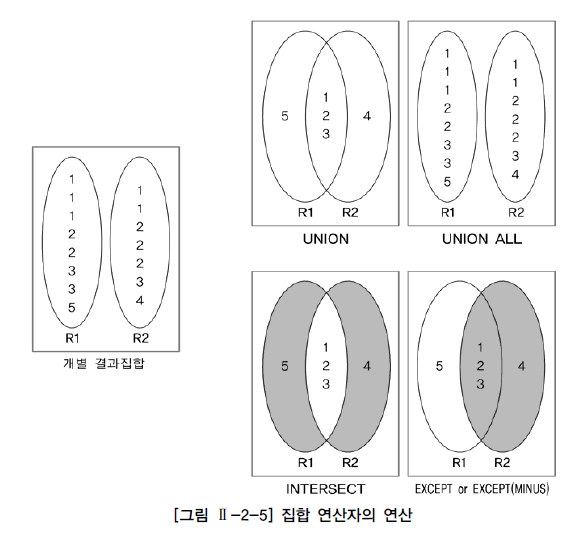

# 집합 연산자

두 개 이상의 테이블에서 조인을 사용하지 않고 연관된 데이터를 조회하는 방법 중에 또 다른 방법이 있는데 그 방법이 바로 집합 연산자(Set Operator)를 사용하는 방법이다. 기존의 조인에서는 FROM 절에 검색하고자 하는 테이블을 나열하고, WHERE 절에 조인 조건을 기술하여 원하는 데이터를 조회할 수 있었다. 하지만 집합 연산자는 여러 개의 질의의 결과를 연결하여 하나로 결합하는 방식을 사용한다. 즉, 집합 연산자는 2개 이상의 질의 결과를 하나의 결과로 만들어 준다. 일반적으로 집합 연산자를 사용하는 상황은 서로 다른 테이블에서 유사한 형태의 결과를 반환하는 것을 하나의 결과로 합치고자 할 때와 동일 테이블에서 서로 다른 질의를 수행하여 결과를 합치고자 할 때 사용할 수 있다. 이외에도 튜닝관점에서 실행계획을 분리하고자 하는 목적으로도 사용할 수 있다. 집합 연산자를 사용하기 위해서는 다음 제약조건을 만족해야 한다. SELECT 절의 칼럼 수가 동일하고 SELECT 절의 동일 위치에 존재하는 칼럼의 데이터 타입이 상호 호환 가능(반드시 동일한 데이터 타입일 필요는 없음)해야 한다. 그렇지 않으면 데이터베이스가 오류를 반환한다.

집합 연산자는 개별 SQL문의 결과 집합에 대해 합집합(UNION/UNION ALL), 교집합(INTERSECT), 차집합(EXCEPT)으로 집합간의 관계를 가지고 작업을 한다.

집합 연산자를 가지고 연산한 결과는 [그림 Ⅱ-2-5]와 같다. [그림 Ⅱ-2-5]의 왼쪽에 존재하는 R1, R2는 각각의 SQL문을 실행해서 생성된 개별 결과 집합을 의미한다. [그림 Ⅱ-2-5]에서 보면 알 수 있듯이 UNION ALL을 제외한 다른 집합 연산자에서는 SQL문의 결과 집합에서 먼저 중복된 건을 배제하는 작업을 수행한 후에 집합 연산을 적용한다(논리적인 관점의 처리임). UNION 연산에서 R1 = {1, 2, 3, 5}, R2 = {1, 2, 3, 4}가 되고, 이것의 합집합(R1 ∪ R2)의 결과는 {1, 2, 3, 4, 5}이다. UNION ALL 연산은 중복에 대한 배제 없이 2개의 결과 집합을 단순히 합친 것과 동일한 결과이다. UNION ALL의 결과는 {1, 1, 1, 2, 2, 3, 3, 5, 1, 1, 2, 2, 2, 3, 4}이다. INTERSECT 연산에서 R1 = {1, 2, 3, 5}, R2 = {1, 2, 3, 4}가 되어, 이것의 교집합(R1 ∩ R2)의 결과는 {1, 2, 3}이다. EXCEPT 연산에서는 R1 = {1, 2, 3, 5}, R2 = {1, 2, 3, 4}가 되고, 이것의 차집합(R1 R2)의 결과는 {5}이다. EXCEPT 연산에서는 순서가 중요하다. 만약 순서가 바뀌어서 R2 R1의 차집합이었다면 결과는 {4}가 된다. 집합 연산자를 사용하여 만들어지는 SQL문의 형태는 다음과 같다.

SELECT 칼럼명1, 칼럼명2, ... FROM 테이블명1 [WHERE 조건식 ] [[GROUP BY 칼럼(Column)이나 표현식 [HAVING 그룹조건식 ] ] 집합 연산자 SELECT 칼럼명1, 칼럼명2, ... FROM 테이블명2 [WHERE 조건식 ] [[GROUP BY 칼럼(Column)이나 표현식 [HAVING 그룹조건식 ] ] [ORDER BY 1, 2 [ASC또는 DESC ] ; SELECT PLAYER_NAME 선수명, BACK_NO 백넘버 FROM PLAYER WHERE TEAM_ID = 'K02' UNION SELECT PLAYER_NAME 선수명, BACK_NO 백넘버 FROM PLAYER WHERE TEAM_ID = 'K07' ORDER BY 1;

집합 연산자는 사용상의 제약조건을 만족한다면 어떤 형태의 SELECT문이라도 이용할 수 있다. 집합 연산자는 여러 개의 SELECT문을 연결하는 것에 지나지 않는다. ORDER BY는 집합 연산을 적용한 최종 결과에 대한 정렬 처리이므로 가장 마지막 줄에 한번만 기술한다. 아래 질문에 대해 집합 연산자를 사용하여 처리하는 방법을 알아보자.

[집합 연산자를 연습하기 위한 질문]

1) K-리그 소속 선수들 중에서 소속이 삼성블루윙즈팀인 선수들과전남드레곤즈팀인 선수들에 대한 내용을 모두보고 싶다. 2) K-리그 소속 선수들 중에서 소속이 삼성블루윙즈팀인 선수들과 포지션이 골키퍼(GK)인 선수들을 모두 보고 싶다. 3) K-리그 소속 선수들에 대한 정보 중에서 포지션별 평균키와 팀별 평균키를 알고 싶다. 4) K-리그 소속 선수를 중에서 소속이 삼성블루윙즈팀이면서 포지션이 미드필더(MF)가 아닌 선수들의 정보를 보고 싶다. 5) K-리그 소속 선수들 중에서 소속이 삼성블루윙즈팀이면서 포지션이 골키퍼(GK)인 선수들의 정보를 보고 싶다.

SQL문을 작성하기에 전에 [집합 연산자를 연습하기 위한 질문]을 다음과 같이 집합 연산자를 사용 형태로 해석할 수 있다.

[질문을 집합 연산의 개념으로 해석한 결과]

1) K-리그 소속 선수 중 소속이 삼성블루윙즈팀인 선수들의 집합과K-리그 소속 선수 중 소속이 전남드레곤즈팀인 선수들의 집합의 합집합 2) K-리그 소속 선수 중 소속이 삼성블루윙즈팀인 선수들의 집합과K-리그 소속 선수 중 포지션이 골키퍼(GK)인 선수들의 집합의 합집합 3) K-리그 소속 선수 중 포지션별 평균키에 대한 집합과K-리그 소속 선수 중 팀별 평균키에 대한 집합의 합집합 4) K-리그 소속 선수 중 소속이 삼성블루윙즈팀인 선수들의 집합과K-리그 소속 선수 중 포지션이 미드필더(MF))인 선수들의 집합의 차집합 5) K-리그 소속 선수 중 소속이 삼성블루윙즈팀인 선수들의 집합과K-리그 소속 선수 중 포지션이 골키퍼(GK)인 선수들의 집합의 교집합

위의 결과를 집합 연산자를 사용하여 SQL문을 작성하고 그 결과를 확인해 보도록 하자. 먼저 첫 번째 질문에 대한 SQL문을 작성하고 실행해 보자.

[질문1] 1) K-리그 소속 선수들 중에서 소속이 삼성블루윙즈팀인 선수들과전남드레곤즈팀인 선수들에 대한 내용을 모두보고 싶다. 1) K-리그 소속 선수 중 소속이 삼성블루윙즈팀인 선수들의 집합과K-리그 소속 선수 중 소속이 전남드레곤즈팀인 선수들의 집합의 합집합

[예제] SELECT TEAM_ID 팀코드, PLAYER_NAME 선수명, POSITION 포지션, BACK_NO 백넘버, HEIGHT 키 FROM PLAYER WHERE TEAM_ID = 'K02' UNION SELECT TEAM_ID 팀코드, PLAYER_NAME 선수명, POSITION 포지션, BACK_NO 백넘버, HEIGHT 키 FROM PLAYER WHERE TEAM_ID = 'K07'

[실행 결과] 팀코드 선수명 포지션 백넘버 키 ---- ---- ---- ---- -- K02 가비 MF 10 177 K02 강대희 MF 26 174 K02 고종수 MF 22 176 K02 고창현 MF 8 170 K02 김강진 DF 43 181 K07 강철 DF 3 178 K07 김반 MF 14 174 K07 김영수 MF 30 175 K07 김정래 GK 33 185 K07 김창원 DF 5 183 100개의 행이 선택되었다.

첫 번째 질문에 대한 SQL문에서 삼성 블루윙즈팀인 선수들과 전남 드레곤즈팀의 선수들의 합집합이라는 것은 WHERE 절에 IN 또는 OR 연산자로도 변환이 가능하다. 다만 IN 또는 OR 연산자를 사용할 경우에는 결과의 표시 순서가 달라질 수 있다. 집합이라는 관점에서는 결과가 표시되는 순서가 틀렸다고 두 집합이 서로 다르다고 말할 수 없다. 만약, 결과의 동일한 표시 순서를 원한다면 ORDER BY절을 사용해서 명시적으로 정렬 순서를 정의하는 것이 바람직하다. 첫 번째 질문에 대한 SQL문을 IN 또는 OR 연산자를 사용한 SQL문으로 변경해 보고 결과의 표시 순서가 다름을 확인해 보자.

[예제] (비교) SELECT TEAM_ID 팀코드, PLAYER_NAME 선수명, POSITION 포지션, BACK_NO 백넘버, HEIGHT 키 FROM PLAYER WHERE TEAM_ID = 'K02' OR TEAM_ID = 'K07'; SELECT TEAM_ID 팀코드, PLAYER_NAME 선수명, POSITION 포지션, BACK_NO 백넘버, HEIGHT 키 FROM PLAYER WHERE TEAM_ID IN ('K02', 'K07');

[실행 결과] 팀 선수명 포지션 백넘버 키 ---- ----- ---- ----- --- K07 김회택 TM K07 서현옥 TC K07 정상호 TC K07 최철우 TC K07 정영광 GK 41 185 K02 정호 TM K02 왕선재 TC K02 코샤 TC K02 윤성효 TC K02 정광수 GK 41 182 100개의 행이 선택되다.

두 번째 질문에 대해 SQL문을 작성하고 결과를 확인해 보자.

[질문2] 2) K-리그 소속 선수들 중에서 소속이 삼성블루윙즈팀인 선수들과 포지션이 골키퍼(GK)인 선수들을 모두 보고 싶다. 2) K-리그 소속 선수 중 소속이 삼성블루윙즈팀인 선수들의 집합과K-리그 소속 선수 중 포지션이 골키퍼(GK)인 선수들의 집합의 합집합

[예제] SELECT TEAM_ID 팀코드, PLAYER_NAME 선수명, POSITION 포지션, BACK_NO 백넘버, HEIGHT 키 FROM PLAYER WHERE TEAM_ID = 'K02' UNION SELECT TEAM_ID 팀코드, PLAYER_NAME 선수명, POSITION 포지션, BACK_NO 백넘버, HEIGHT 키 FROM PLAYER WHERE POSITION = 'GK';

[실행 결과] 팀코드 선수명 포지션 백넘버 키 ---- ----- ----- ---- -- K01 권정혁 GK 1 195 K01 서동명 GK 21 196 K01 양지원 GK 45 181 K01 이무림 GK 31 185 K01 최창주 GK 40 187 K02 가비 MF 10 177 K02 강대희 MF 26 174 K02 고종수 MF 22 176 K02 고창현 MF 8 170 K02 김강진 DF 43 181 88개의 행이 선택되었다.

두 번째 질문에 대한 실행 결과는 첫 번째 실행 결과와 비교해 보면 집합의 대상만 차이가 날뿐 다른 점은 없다. 마찬가지로 두 번째 질문에 대해 OR 연산자를 사용한 SQL문으로 변경하면 다음과 같다. 여기서는 서로 다른 칼럼에 조건을 사용했기 때문에 IN 연산자를 사용할 수 없다.

[예제] (비교) SELECT TEAM_ID 팀코드, PLAYER_NAME 선수명, POSITION 포지션, BACK_NO 백넘버, HEIGHT 키 FROM PLAYER WHERE TEAM_ID = 'K02' OR POSITION = 'GK';

만약, 두 번째 질문에 대한 SQL문에서 UNION이라는 집합 연산자 대신에 UNION ALL이라는 집합 연산자를 사용하면 어떻게 될지 한번 수행해 보자.

[예제] SELECT TEAM_ID 팀코드, PLAYER_NAME 선수명, POSITION 포지션, BACK_NO 백넘버, HEIGHT 키 FROM PLAYER WHERE TEAM_ID = 'K02' UNION ALL SELECT TEAM_ID 팀코드, PLAYER_NAME 선수명, POSITION 포지션, BACK_NO 백넘버, HEIGHT 키 FROM PLAYER WHERE POSITION = 'GK';

[실행 결과] 팀코드 선수명 포지션 백넘버 키 ---- ----- ---- ---- --- K02 정호 TM K02 왕선재 TC K02 코샤 TC K02 윤성효 TC K02 정광수 GK 41 182 K04 남현우 GK 31 180 K04 김충호 GK 60 185 K04 이현 GK 1 192 K04 한동진 GK 21 183 K10 강성일 GK 30 182 92개의 행이 선택되었다.

수행 결과에서 알 수 있듯이 결과 건수가 UNION은 88건이었으나 UNION ALL은 92건으로 결과 건수가 늘어났다. 두 SQL문의 결과가 서로 다르다. 결과가 다른 이유는 UNION은 결과에서 중복이 존재할 경우 중복을 제외시키지만 UNION ALL은 각각의 질의 결과를 단순히 결합시켜 줄 뿐 중복된 결과를 제외시키지 않기 때문이다. 이와 같이 결과 집합에 중복이 존재하면 UNION과 UNION ALL의 결과는 달라진다. UNION ALL에서 중복된 결과들을 확인해 보고자 할 때는 ORDER BY절을 사용하면 용이하다. 아래 SQL문을 통해 중복된 결과를 확인해 보자.

[예제] SELECT TEAM_ID 팀코드, PLAYER_NAME 선수명, POSITION 포지션, BACK_NO 백넘버, HEIGHT 키 FROM PLAYER WHERE TEAM_ID = 'K02' UNION ALL SELECT TEAM_ID 팀코드, PLAYER_NAME 선수명, POSITION 포지션, BACK_NO 백넘버, HEIGHT 키 FROM PLAYER WHERE POSITION = 'GK' ORDER BY 1, 2, 3, 4, 5;

[실행 결과] 팀코드 선수명 포지션 백넘버 키 ---- ---- ---- ---- --- K02 김운재 GK 1 182 K02 김운재 GK 1 182 K02 정광수 GK 41 182 K02 정광수 GK 41 182 K02 조범철 GK 21 185 K02 조범철 GK 21 185 K02 최호진 GK 31 190 K02 최호진 GK 31 190 92개의 행이 선택되었다.

결과에서 삼성블루윙즈팀(K02)에서 포지션이 골키퍼(GK)인 사람이 중복 표시되째 질문에 대한 SQL문을 작성하고 결과를 확인해 보자.

[질문3] 3) K-리그 소속 선수들에 대한 정보 중에서 포지션별 평균키와 팀별 평균키를 알고 싶다. 3) K-리그 소속 선수 중 포지션별 평균키에 대한 집합과K-리그 소속 선수 중 팀별 평균키에 대한 집합의 합집합

[예제] SELECT 'P' 구분코드, POSITION 포지션, AVG(HEIGHT) 평균키 FROM PLAYER GROUP BY POSITION UNION SELECT 'T' 구분코드, TEAM_ID 팀명, AVG(HEIGHT) 평균키 FROM PLAYER GROUP BY TEAM_ID ORDER BY 1;

[실행 결과] 구분코드 포지션 평균키 ------ ----- -------- P DF 180.409 P FW 179.91 P GK 186.256 P MF 176.309 P TC 178.833 T K01 180.089 T K02 179.067 T K03 179.911 T K04 180.511 T K05 180.422 23개의 행이 선택되었다.

세 번째 질문에서는 평균키에 대한 값들의 합집합을 구하는 것이다. 합집합을 구하기 위해 SQL문에서 그룹함수를 사용했다. 그룹함수도 집합 연산자에서 사용이 가능하다는 것을 알 수 있다. 또한 실제로 테이블에는 존재하지 않지만 결과 행을 구분하기 위해 SELECT 절에 칼럼('구분코드')을 추가할 수 있다는 것을 알 수 있다. 이와 같이 목적을 위해 SELECT 절에 임의의 칼럼을 추가하는 것은 다른 모든 SQL문에서 적용 가능하다. 집합 연산자의 결과를 표시할 때 HEADING 부분은 첫 번째 SQL문에서 사용된 HEADING이 적용된다는 것을 알 수 있다. SQL문에서 첫 번째 SELECT 절에서는 '포지션' HEADING을 사용하였고 두 번째 SELECT 절에서는 '팀명' HEADING을 사용하였다. 그러나 결과에는 '포지션' HEADING으로 표시되었다.

네 번째 질문인 삼성 블루윙즈팀인 집합과 포지션이 미드필더(MF)인 선수들의 차집합에 대한 SQL문을 작성하고 결과를 확인해 보자.

[질문4] 4) K-리그 소속 선수를 중에서 소속이 삼성블루윙즈팀이면서 포지션이 미드필더(MF)가 선수들의 정보를 보고 싶다. 4) K-리그 소속 선수 중 소속이 삼성블루윙즈팀인 선수들의 집합과K-리그 소속 선수 중 포지션이 미드필더(MF))인 선수들의 집합의 차집합

[예제] Oracle SELECT TEAM_ID 팀코드, PLAYER_NAME 선수명, POSITION 포지션, BACK_NO 백넘버, HEIGHT 키 FROM PLAYER WHERE TEAM_ID = 'K02' MINUS SELECT TEAM_ID 팀코드, PLAYER_NAME 선수명, POSITION 포지션, BACK_NO 백넘버, HEIGHT 키 FROM PLAYER WHERE POSITION = 'MF' ORDER BY 1, 2, 3, 4, 5;

SQL Server에서는 MINUS대신 EXCEPT를 사용할 수 있다.

[실행 결과] 팀코드 선수명 포지션 백넘버 키 ---- ------- ----- ---- -- K02 김강진 DF 43 181 K02 김관희 FW 39 180 K02 김만근 FW 34 177 K02 김병국 DF 2 183 K02 김병근 DF 3 175 K02 왕선재 TC K02 윤성효 TC K02 윤화평 FW 42 182 K02 이성용 DF 20 173 K02 정광수 GK 41 182 31개의 행이 선택되었다.

차집합은 앞의 집합의 결과에서 뒤의 집합의 결과를 빼는 것이다. 이번 SQL문은 삼성블루윙즈팀의 선수들 중에서 포지션이 미드필더(MF)인 선수들의 정보를 빼는 것이다. 해당 SQL문은 다른 형태의 SQL문으로 변경 가능하다. EXCEPT 연산자의 앞에 오는 SQL문의 조건은 만족하고 뒤에 오는 SQL문의 조건은 만족하지 않는 SQL문과 동일한 결과를 얻을 수 있다. 그러므로 EXCEPT 연산자를 사용하지 않고 논리 연산자를 이용하여 동일한 결과의 SQL문을 작성할 수 있다. SQL문을 실행하여 결과가 동일한지 직접 확인해 보자.

[예제] SELECT TEAM_ID 팀코드, PLAYER_NAME 선수명, POSITION 포지션, BACK_NO 백넘버, HEIGHT 키 FROM PLAYER WHERE TEAM_ID = 'K02' AND POSITION <> 'MF' ORDER BY 1, 2, 3, 4, 5;

MINUS 연산자는 NOT EXISTS 또는 NOT IN 서브쿼리를 이용한 SQL문으로도 변경 가능하다. (NOT EXISTS와 NOT IN에 대한 설명은 제5절 서브쿼리에서 참고)

[예제] SELECT TEAM_ID 팀코드, PLAYER_NAME 선수명, POSITION 포지션, BACK_NO 백넘버, HEIGHT 키 FROM PLAYER X WHERE X.TEAM_ID = 'K02' AND NOT EXISTS (SELECT 1 FROM PLAYER Y WHERE Y.PLAYER_ID = X.PLAYER_ID AND POSITION = 'MF') ORDER BY 1, 2, 3, 4, 5; SELECT TEAM_ID 팀코드, PLAYER_NAME 선수명, POSITION 포지션, BACK_NO 백넘버, HEIGHT 키 FROM PLAYER WHERE TEAM_ID = 'K02' AND PLAYER_ID NOT IN (SELECT PLAYER_ID FROM PLAYER WHERE POSITION = 'MF') ORDER BY 1, 2, 3, 4, 5;

이제 마지막으로 삼성블루윙즈팀이면서 포지션이 골키퍼인 선수들인 교집합을 얻기 위한 SQL문을 작성해 보자.

[질문 5] 5) K-리그 소속 선수들 중에서 소속이 삼성블루윙즈팀이면서 포지션이 골키퍼(GK)인 선수들의 정보를 보고 싶다. 5) K-리그 소속 선수 중 소속이 삼성블루윙즈팀인 선수들의 집합과K-리그 소속 선수 중 포지션이 골키퍼(GK)인 선수들의 집합의 교집합

[예제] SELECT TEAM_ID 팀코드, PLAYER_NAME 선수명, POSITION 포지션, BACK_NO 백넘버, HEIGHT 키 FROM PLAYER WHERE TEAM_ID = 'K02' INTERSECT SELECT TEAM_ID 팀코드, PLAYER_NAME 선수명, POSITION 포지션, BACK_NO 백넘버, HEIGHT 키 FROM PLAYER WHERE POSITION = 'GK' ORDER BY 1, 2, 3, 4, 5;

[실행 결과] 팀코드 선수명 포지션 백넘버 키 ---- ------ ----- ---- -- K02 김운재 GK 1 182 K02 정광수 GK 41 182 K02 조범철 GK 21 185 K02 최호진 GK 31 190 4개의 행이 선택되었다.

교집합의 결과는 소속이 삼성 블루윙즈팀인 선수의 집합이면서 포지션이 골키퍼인 집합인 두 개의 조건을 만족하는 집합이다. 이것은 INTERSECT 연산자의 앞에 오는 SQL문의 조건은 만족하면서 뒤의 SQL문의 조건을 만족하는 것과 동일한 결과를 얻을 수 있다. 다음과 같이 INTERSECT 연산자를 사용하지 않고도 논리 연산자만으로 결과가 동일한 SQL문을 작성할 수 있다. SQL문을 실행하여 결과가 동일한지 직접 확인해 보자.

[예제] SELECT TEAM_ID 팀코드, PLAYER_NAME 선수명, POSITION 포지션, BACK_NO 백넘버, HEIGHT 키 FROM PLAYER WHERE TEAM_ID = 'K02' AND POSITION = 'GK' ORDER BY 1, 2, 3, 4, 5;

INTERSECT 연산자는 EXISTS 또는 IN 서브쿼리를 이용한 SQL문으로 변경 가능하다. (EXISTS와 IN에 대한 설명은 제5절 서브쿼리에서 참고)

[예제] SELECT TEAM_ID 팀코드, PLAYER_NAME 선수명, POSITION 포지션, BACK_NO 백넘버, HEIGHT 키 FROM PLAYER X WHERE X.TEAM_ID = 'K02' AND EXISTS (SELECT 1 FROM PLAYER Y WHERE Y.PLAYER_ID = X.PLAYER_ID AND Y.POSITION = 'GK') ORDER BY 1, 2, 3, 4, 5;

[예제] SELECT TEAM_ID 팀코드, PLAYER_NAME 선수명, POSITION 포지션, BACK_NO 백넘버, HEIGHT 키 FROM PLAYER WHERE TEAM_ID = 'K02' AND PLAYER_ID IN (SELECT PLAYER_ID FROM PLAYER WHERE POSITION = 'GK') ORDER BY 1, 2, 3, 4, 5;