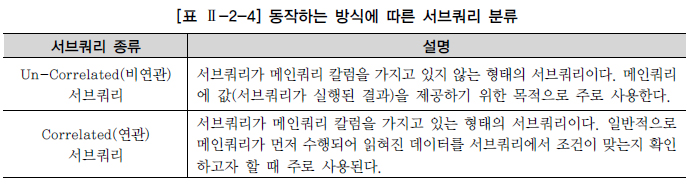

# 서브쿼리

서브쿼리(Subquery)란 하나의 SQL문안에 포함되어 있는 또 다른 SQL문을 말한다. 서브쿼리는 알려지지 않은 기준을 이용한 검색을 위해 사용한다. 서브쿼리는 [그림 Ⅱ-2-12]와 같이 메인쿼리가 서브쿼리를 포함하는 종속적인 관계이다.

조인은 조인에 참여하는 모든 테이블이 대등한 관계에 있기 때문에 조인에 참여하는 모든 테이블의 칼럼을 어느 위치에서라도 자유롭게 사용할 수 있다. 그러나 서브쿼리는 메인쿼리의 칼럼을 모두 사용할 수 있지만 메인쿼리는 서브쿼리의 칼럼을 사용할 수 없다. 질의 결과에 서브쿼리 칼럼을 표시해야 한다면 조인 방식으로 변환하거나 함수, 스칼라 서브쿼리(Scalar Subquery) 등을 사용해야 한다. 조인은 집합간의 곱(Product)의 관계이다. 즉, 1:1 관계의 테이블이 조인하면 1(= 1 * 1) 레벨의 집합이 생성되고, 1:M 관계의 테이블을 조인하면 M(= 1 * M) 레벨의 집합이 생성된다. 그리고 M:N 관계의 테이블을 조인하면 MN(= M * N) 레벨의 집합이 결과로서 생성된다. 예를 들어, 조직(1)과 사원(M) 테이블을 조인하면 결과는 사원 레벨(M)의 집합이 생성된다. 그러나 서브쿼리는 서브쿼리 레벨과는 상관없이 항상 메인쿼리 레벨로 결과 집합이 생성된다. 예를 들어, 메인쿼리로 조직(1), 서브쿼리로 사원(M) 테이블을 사용하면 결과 집합은 조직(1) 레벨이 된다. SQL문에서 서브쿼리 방식을 사용해야 할 때 잘못 판단하여 조인 방식을 사용하는 경우가 있다. 예를 들어, 결과는 조직 레벨이고 사원 테이블에서 체크해야 할 조건이 존재한다고 가정하자. 이런 상황에서 SQL문을 작성할 때 조인을 사용한다면 결과 집합은 사원(M) 레벨이 될 것이다. 이렇게 되면 원하는 결과가 아니기 때문에 SQL문에 DISTINCT를 추가해서 결과를 다시 조직(1) 레벨로 만든다. 이와 같은 상황에서는 조인 방식이 아니라 서브쿼리 방식을 사용해야 한다. 메인쿼리로 조직을 사용하고 서브쿼리로 사원 테이블을 사용하면 결과 집합은 조직 레벨이 되기 때문에 원하는 결과가 된다.

서브쿼리를 사용할 때 다음 사항에 주의해야 한다.

① 서브쿼리를 괄호로 감싸서 사용한다. ② 서브쿼리는 단일 행(Single Row) 또는 복수 행(Multiple Row) 비교 연산자와 함께 사용 가능하다. 단일 행 비교 연산자는 서브쿼리의 결과가 반드시 1건 이하이어야 하고 복수 행 비교 연산자는 서브쿼리의 결과 건수와 상관 없다. ③ 서브쿼리에서는 ORDER BY를 사용하지 못한다. ORDER BY절은 SELECT절에서 오직 한 개만 올 수 있기 때문에 ORDER BY절은 메인쿼리의 마지막 문장에 위치해야 한다.

서브쿼리가 SQL문에서 사용이 가능한 곳은 다음과 같다.

\- SELECT 절 - FROM 절 - WHERE 절 - HAVING 절 - ORDER BY 절 - INSERT문의 VALUES 절 - UPDATE문의 SET 절

서브쿼리의 종류는 동작하는 방식이나 반환되는 데이터의 형태에 따라 분류할 수 있다. 동작하는 방식에 따라 서브쿼리를 분류하면 [표 Ⅱ-2-4]와 같이 두 가지로 나눌 수 있다.

서브쿼리는 메인쿼리 안에 포함된 종속적인 관계이기 때문에 논리적인 실행순서는 항상 메인쿼리에서 읽혀진 데이터에 대해 서브쿼리에서 해당 조건이 만족하지를 확인하는 방식으로 수행되어야 한다. 그러나 실제 서브쿼리의 실행순서는 상황에 따라 달라질 수 있다. 반환되는 데이터의 형태에 따라 서브쿼리는 [표 Ⅱ-2-5]와 같이 세가지로 분류된다.

## 1. 단일 행 서브 쿼리

서브쿼리가 단일 행 비교 연산자(=, <, <=, >, >=, <>)와 함께 사용할 때는 서브쿼리의 결과 건수가 반드시 1건 이하이어야 한다. 만약, 서브쿼리의 결과 건수가 2건 이상을 반환하면 SQL문은 실행시간(Run Time) 오류가 발생한다. 이런 종류의 오류는 컴파일 할 때(Compile Time)는 알 수 없는 오류이다. 단일 행 서브쿼리의 예로 '정남일' 선수가 소속된 팀의 선수들에 대한 정보를 표시하는 문제를 가지고 설명해 보면 다음과 같다.

[그림 Ⅱ-2-13]은 2개의 SQL문으로 구성되어 있다. 정남일 선수의 소속팀을 알아내는 SQL문(서브쿼리 부분)과 이 결과를 이용해서 해당 팀에 소속된 선수들의 정보를 출력하는 SQL문(메인쿼리 부분)으로 구성된다. 정남일 선수가 소속된 팀의 선수들에 대한 정보를 표시하는 문제를 서브쿼리 방식의 SQL문으로 작성하면 다음과 같다.

[예제] SELECT PLAYER_NAME 선수명, POSITION 포지션, BACK_NO 백넘버 FROM PLAYER WHERE TEAM_ID = (SELECT TEAM_ID FROM PLAYER WHERE PLAYER_NAME = '정남일') ORDER BY PLAYER_NAME;

[실행 결과] 선수명 포지션 백넘버 ------- ----- ----- 강철 DF 3 김반 MF 14 김영수 MF 30 김정래 GK 33 김창원 DF 5 김회택 TM 꼬레아 FW 16 노병준 MF 22 51개의 행이 선택되었다.

정남일 선수의 소속팀을 알아내는 서브쿼리가 먼저 수행되어 정남일 선수의 소속팀 코드가 반환된다. 메인쿼리는서브쿼리에서 반환된 결과를 이용해서 조건을 만족하는 선수들의 정보를 출력한다. 만약, 정남일 선수가 동명이인이었다면 2건 이상의 결과가 반환되어 SQL문은 오류가 발생될 것이다. 테이블 전체에 하나의 그룹함수를 적용할 때는 그 결과값이 1건이 생성되기 때문에 단일 행 서브쿼리로서 사용 가능하다. 선수들 중에서 키가 평균 이하인 선수들의 정보를 출력하는 문제를 가지고 그룹함수를 사용한 서브쿼리를 알아보도록 한다.

[그림 Ⅱ-2-14]는 2개의 SQL문으로 구성되어 있다. 선수들의 평균키를 알아내는 SQL문(서브쿼리 부분)과 이 결과를 이용해서 키가 평균 이하의 선수들의 정보를 출력하는 SQL문(메인쿼리 부분)으로 구성된다. [그림 Ⅱ-2-14]를 SQL문으로 작성하면 다음과 같다.

[예제] SELECT PLAYER_NAME 선수명, POSITION 포지션, BACK_NO 백넘버 FROM PLAYER WHERE HEIGHT <= (SELECT AVG(HEIGHT) FROM PLAYER) ORDER BY PLAYER_NAME;

[실행 결과] 선수명 포지션 백넘버 ------- ------ ----- 가비 MF 10 강대희 MF 26 강용 DF 2 강정훈 MF 38 강철 DF 3 고규억 DF 29 고민기 FW 24 고종수 MF 22 228개의 행이 선택되었다.

## 2. 다중 행 서브쿼리

서브쿼리의 결과가 2건 이상 반환될 수 있다면 반드시 다중 행 비교 연산자(IN, ALL, ANY, SOME)와 함께 사용해야 한다. 그렇지 않으면 SQL문은 오류를 반환한다. 다중 행 비교 연산자는 다음과 같다.

[예제] SELECT REGION_NAME 연고지명, TEAM_NAME 팀명, E_TEAM_NAME 영문팀명 FROM TEAM WHERE TEAM_ID IN (SELECT TEAM_ID FROM PLAYER WHERE PLAYER_NAME = '정현수') ORDER BY TEAM_NAME;

[실행 결과] 연고지명 팀명 영문팀명 ------ ----- ----------------------- 전남 드래곤즈 CHUNNAM DRAGONS FC 성남 일화천마 SEONGNAM ILHWA CHUNMA FC 2개의 행이 선택되었다.

실행 결과를 보면 '정현수'란 이름을 가진 선수가 두 명이 존재한다. 소속팀은 각각 전남 드래곤즈팀(K07)과 성남 일화천마팀(K08)이다. 본 예제에서는 동명이인에 대한 내용을 예로 들었지만, 서브쿼리의 실행 결과가 2건 이상이 나오는 모든 경우에 다중 행 비교 연산자를 사용해야 한다.

## 3. 다중 칼럼 서브쿼리

다중 칼럼 서브쿼리는 서브쿼리의 결과로 여러 개의 칼럼이 반환되어 메인쿼리의 조건과 동시에 비교되는 것을 의미한다. 소속팀별 키가 가장 작은 사람들의 정보를 출력하는 문제를 가지고 다중 칼럼 서브쿼리를 알아보도록 한다. 소속팀별 키가 가장 작은 사람들의 정보는 GROUP BY를 이용하여 찾을 수 있으므로 다음과 같이 SQL문을 작성할 수 있다.

[예제] SELECT TEAM_ID 팀코드, PLAYER_NAME 선수명, POSITION 포지션, BACK_NO 백넘버, HEIGHT 키 FROM PLAYER WHERE (TEAM_ID, HEIGHT) IN (SELECT TEAM_ID, MIN(HEIGHT) FROM PLAYER GROUP BY TEAM_ID) ORDER BY TEAM_ID, PLAYER_NAME;

[실행 결과] 팀코드 선수명 포지션 백넘버 키 ----- -------- ------ ---- --- K01 마르코스 FW 44 170 K01 박정수 MF 8 170 K02 고창현 MF 8 170 K02 정준 MF 44 170 K03 김중규 MF 42 170 19개의 행이 선택되었다.

SQL문의 실행 결과를 보면 서브쿼리의 결과값으로 소속팀코드(TEAM_ID)와 소속팀별 가장 작은 키를 의미하는 MIN(HEIGHT)라는 두 개의 칼럼을 반환했다. 메인쿼리에서는 조건절에 TEAM_ID와 HEIGHT 칼럼을 괄호로 묶어서 서브쿼리 결과와 비교하여 원하는 결과를 얻었다. 실행 결과에서 보면 하나 팀에서 키가 제일 작은 선수 한 명씩만 반환된 것이 아니라 같은 팀에서 여러 명이 반환된 것을 확인할 수 있다. 이것은 동일 팀 내에서 조건(팀별 가장 작은 키)을 만족하는 선수가 여러 명이 존재하기 때문이다. 그러나 이 기능은 SQL Server에서는 지원되지 않는 기능이다.

## 4. 연관 서브쿼리

연관 서브쿼리(Correlated Subquery)는 서브쿼리 내에 메인쿼리 칼럼이 사용된 서브쿼리이다. 선수 자신이 속한 팀의 평균 키보다 작은 선수들의 정보를 출력하는 SQL문을 연관 서브쿼리를 이용해서 작성해 보면 다음과 같다

[예제] SELECT T.TEAM_NAME 팀명, M.PLAYER_NAME 선수명, M.POSITION 포지션, M.BACK_NO 백넘버, M.HEIGHT 키 FROM PLAYER M, TEAM T WHERE M.TEAM_ID = T.TEAM_ID AND M.HEIGHT < ( SELECT AVG(S.HEIGHT) FROM PLAYER S WHERE S.TEAM_ID = M.TEAM_ID AND S.HEIGHT IS NOT NULL GROUP BY S.TEAM_ID ) ORDER BY 선수명;

[실행 결과] 팀명 선수명 포지션 백넘버 키 -------- ----- ----- ----- -- 삼성블루윙즈 가비 MF 10 177 삼성블루윙즈 강대희 MF 26 174 스틸러스 강용 DF 2 179 시티즌 강정훈 MF 38 175 드래곤즈 강철 DF 3 178 현대모터스 고관영 MF 32 180 현대모터스 고민기 FW 24 178 삼성블루윙즈 고종수 MF 22 176 224의 행이 선택되었다.

예를 들어, 가비 선수는 삼성블루윙즈팀 소속이므로 삼성블루윙즈팀 소속의 평균키를 구하고 그 평균키와 가비 선수의 키를 비교하여 적을 경우에 선수에 대한 정보를 출력한다. 만약, 평균키 보다 선수의 키가 크거나 같으면 조건에 맞지 않기 때문에 해당 데이터는 출력되지 않는다. 이와 같은 작업을 메인쿼리에 존재하는 모든 행에 대해서 반복 수행한다. EXISTS 서브쿼리는 항상 연관 서브쿼리로 사용된다. 또한 EXISTS 서브쿼리의 특징은 아무리 조건을 만족하는 건이 여러 건이더라도 조건을 만족하는 1건만 찾으면 추가적인 검색을 진행하지 않는다. 다음은 EXISTS 서브쿼리를 사용하여 '20120501' 부터 '20120502' 사이에 경기가 있는 경기장을 조회하는 SQL문이다.

[예제] SELECT STADIUM_ID ID, STADIUM_NAME 경기장명 FROM STADIUM A WHERE EXISTS (SELECT 1 FROM SCHEDULE X WHERE X.STADIUM_ID = A.STADIUM_ID AND X.SCHE_DATE BETWEEN '20120501' AND '20120502')

[실행 결과] ID 경기장명 --- --------------------------------- B01 인천월드컵경기장 B04 수원월드컵경기장 B05 서울월드컵경기장 C02 부산아시아드경기장 4개의 행이 선택되었다.

## 5. 그밖에 위치에서 사용하는 서브쿼리

### 가. SELECT 절에 서브쿼리 사용하기

다음은 SELECT 절에서 사용하는 서브쿼리인 스칼라 서브쿼리(Scalar Subquery)에 대해서 알아본다. 스칼라 서브쿼리는 한 행, 한 칼럼(1 Row 1 Column)만을 반환하는 서브쿼리를 말한다. 스칼라 서브쿼리는 칼럼을 쓸 수 있는 대부분의 곳에서 사용할 수 있다. 선수 정보와 해당 선수가 속한 팀의 평균 키를 함께 출력하는 예제로 스칼라 서브쿼리를 설명하면 다음과 같다.

[그림 Ⅱ-2-15]는 2개의 SQL문으로 구성되어 있다. 선수들의 정보를 출력하는 SQL문(메인쿼리 부분)과 해당 선수의 소속팀별 평균키를 알아내는 SQL문(서브쿼리 부분)으로 구성된다. 여기서 선수의 소속팀별 평균키를 알아내는 스칼라 서브쿼리는 메인쿼리의 결과 건수만큼 반복수행 된다. [그림 Ⅱ-2-15]를 SQL문으로 작성하면 다음과 같다.

[예제] SELECT PLAYER_NAME 선수명, HEIGHT 키, (SELECT AVG(HEIGHT) FROM PLAYER X WHERE X.TEAM_ID = P.TEAM_ID) 팀평균키 FROM PLAYER P

[실행 결과] 선수명 키 팀평균키 ------- ---- ------------- 가비 177 179.067 가이모토 182 178.854 강대희 174 179.067 강성일 182 177.485 강용 179 179.911 강정훈 175 177.485 강철 178 178.391 고관영 180 180.422 480개의 행이 선택되었다.

스칼라 서브쿼리 또한 단일 행 서브쿼리이기 때문에 결과가 2건 이상 반환되면 SQL문은 오류를 반환한다.

### 나. FROM 절에서 서브쿼리 사용하기

FROM 절에서 사용되는 서브쿼리를 인라인 뷰(Inline View)라고 한다. FROM 절에는 테이블 명이 오도록 되어 있다. 그런데 서브쿼리가 FROM 절에 사용되면 어떻게 될까? 서브쿼리의 결과가 마치 실행 시에 동적으로 생성된 테이블인 것처럼 사용할 수 있다. 인라인 뷰는 SQL문이 실행될 때만 임시적으로 생성되는 동적인 뷰이기 때문에 데이터베이스에 해당 정보가 저장되지 않는다. 그래서 일반적인 뷰를 정적 뷰(Static View)라고 하고 인라인 뷰를 동적 뷰(Dynamic View)라고도 한다. 뷰에 대해서는 뒤에서 좀더 설명하기로 한다. 인라인 뷰는 테이블 명이 올 수 있는 곳에서 사용할 수 있다. 서브쿼리의 칼럼은 메인쿼리에서 사용할 수 없다고 했다. 그러나 인라인 뷰는 동적으로 생성된 테이블이다. 인라인 뷰를 사용하는 것은 조인 방식을 사용하는 것과 같다. 그렇기 때문에 인라인 뷰의 칼럼은 SQL문 자유롭게 참조할 수 있다. K-리그 선수들 중에서 포지션이 미드필더(MF)인 선수들의 소속팀명 및 선수 정보를 출력하고자 한다. 인라인 뷰를 활용해서 SQL문을 만들어 보자.

[예제] SELECT T.TEAM_NAME 팀명, P.PLAYER_NAME 선수명, P.BACK_NO 백넘버 FROM (SELECT TEAM_ID, PLAYER_NAME, BACK_NO FROM PLAYER WHERE POSITION = 'MF') P, TEAM T WHERE P.TEAM_ID = T.TEAM_ID ORDER BY 선수명;

[실행 결과] 팀명 선수명 백넘버 --------- ------- ----- 삼성블루윙즈 가비 10 삼성블루윙즈 강대희 26 시티즌 강정훈 38 현대모터스 고관영 32 삼성블루윙즈 고종수 22 삼성블루윙즈 고창현 8 시티즌 공오균 22 일화천마 곽치국 32 162개의 행이 선택되었다.

SQL문을 보면 선수들 중에서 포지션이 미드필더(MF) 선수들을 인라인 뷰를 통해서 추출하고 인라인 뷰의 결과와 TEAM 테이블과 조인해서 팀명(TEAM_NAME)을 출력하고 있다. 인라인 뷰에서는 ORDER BY절을 사용할 수 있다. 인라인 뷰에 먼저 정렬을 수행하고 정렬된 결과 중에서 일부 데이터를 추출하는 것을 TOP-N 쿼리라고 한다. TOP-N 쿼리를 수행하기 위해서는 정렬 작업과 정렬 결과 중에서 일부 데이터만을 추출할 수 있는 방법이 필요하다. Oracle에서는 ROWNUM이라는 연산자를 통해서 결과로 추출하고자 하는 데이터 건수를 제약할 수 있다.

[예제] Oracle SELECT PLAYER_NAME 선수명, POSITION 포지션, BACK_NO 백넘버, HEIGHT 키 FROM (SELECT PLAYER_NAME, POSITION, BACK_NO, HEIGHT FROM PLAYER WHERE HEIGHT IS NOT NULL ORDER BY HEIGHT DESC) WHERE ROWNUM <= 5;

[예제] SQL Server SELECT TOP(5) PLAYER_NAME AS 선수명, POSITION AS 포지션, BACK_NO AS 백넘버, HEIGHT AS 키 FROM PLAYER WHERE HEIGHT IS NOT NULL ORDER BY HEIGHT DESC

[실행 결과] 선수명 포지션 백넘버 키 -------- ----- --- --- 서동명 GK 21 196 권정혁 GK 1 195 김석 FW 20 194 정경두 GK 41 194 이현 GK 1 192 5개의 행이 선택되었다.

당 SQL문의 인라인 뷰에서 선수의 키를 내림차순으로 정렬(가장 키가 큰 선수부터 출력)한 후 메인쿼리에서 ROWNUM을 사용해서 5명의 선수의 정보만을 추출하였다. 이것은 모든 선수들 중에서 가장 키가 큰 5명의 선수를 출력한 것이다. 만약, 다른 선수 중에서 키가 192인 선수가 더 존재하더라도 해당 SQL문에서는 데이터가 출력되지 않는다. 이런 데이터까지 추출하고자 한다면 분석함수의 RANK관련 함수를 사용해야 한다.

### 다. HAVING 절에서 서브쿼리 사용하기

HAVING 절은 그룹함수와 함께 사용될 때 그룹핑된 결과에 대해 부가적인 조건을 주기 위해서 사용한다. 평균키가 삼성 블루윙즈팀의 평균키보다 작은 팀의 이름과 해당 팀의 평균키를 구하는 SQL문을 작성하면 다음과 같다.

[예제] SELECT P.TEAM_ID 팀코드, T.TEAM_NAME 팀명, AVG(P.HEIGHT) 평균키 FROM PLAYER P, TEAM T WHERE P.TEAM_ID = T.TEAM_ID GROUP BY P.TEAM_ID, T.TEAM_NAME HAVING AVG(P.HEIGHT) < (SELECT AVG(HEIGHT) FROM PLAYER WHERE TEAM_ID ='K02')

[실행 결과] 팀코드 팀명 평균키 ---- ----------- ------ K13 강원FC 173.667 K15 대구FC 175.333 K11 경남FC 176.333 K14 제주유나이티드FC 169.5 K12 광주상무 173.5 K07 드래곤즈 178.391 K08 일화천마 178.854 K10 시티즌 177.485 8개의 행이 선택되었다.

### 라. UPDATE문의 SET 절에서 사용하기

현재 TEAM 테이블에는 STADIUM_NAME 칼럼이 없다. TEAM 테이블에 STADIUM_NAME을 추가(ALTER TABLE ADD COLUMN)하였다고 가정하자. TEAM 테이블에 추가된 STADIUM_NAME의 값을 STADIUM 테이블을 이용하여 변경하고자 할 때 다음과 같이 SQL문을 작성할 수 있다.

UPDATE TEAM A SET A.STADIUM_NAME = (SELECT X.STADIUM_NAME FROM STADIUM X WHERE X.STADIUM_ID = A.STADIUM_ID);

서브쿼리를 사용한 변경 작업을 할 때 서브쿼리의 결과가 NULL을 반환할 경우 해당 컬럼의 결과가 NULL이 될 수 있기 때문에 주의해야 한다.

### 마. INSERT문의 VALUES절에서 사용하기

PLAYER 테이블에 '홍길동'이라는 선수를 삽입하고자 한다. 이때 PLAYER_ID의 값을 현재 사용중인 PLAYER_ID에 1을 더한 값으로 넣고자 한다. 다음과 같이 SQL문을 SQL문을 작성할 수 있다.

INSERT INTO PLAYER(PLAYER_ID, PLAYER_NAME, TEAM_ID) VALUES((SELECT TO_CHAR(MAX(TO_NUMBER(PLAYER_ID))+1) FROM PLAYER), '홍길동', 'K06');

## 6. 뷰(View)

테이블은 실제로 데이터를 가지고 있는 반면, 뷰(View)는 실제 데이터를 가지고 있지 않다. 뷰는 단지 뷰 정의(View Definition)만을 가지고 있다. 질의에서 뷰가 사용되면 뷰 정의를 참조해서 DBMS 내부적으로 질의를 재작성(Rewrite)하여 질의를 수행한다. 뷰는 실제 데이터를 가지고 있지 않지만 테이블이 수행하는 역할을 수행하기 때문에 가상 테이블(Virtual Table)이라고도 한다. 뷰는 [표 Ⅱ-2-7]과 같은 장점을 갖는다.

뷰는 다음과 같이 CREATE VIEW문을 통해서 생성할 수 있다.

CREATE VIEW V_PLAYER_TEAM AS SELECT P.PLAYER_NAME, P.POSITION, P.BACK_NO, P.TEAM_ID, T.TEAM_NAME FROM PLAYER P, TEAM T WHERE P.TEAM_ID = T.TEAM_ID;

해당 뷰는 선수 정보와 해당 선수가 속한 팀명을 함께 추출하는 것이다. 뷰의 명칭은 'V_PLAYER_TEAM'이다. 뷰는 테이블뿐만 아니라 이미 존재하는 뷰를 참조해서도 생성할 수 있다.

CREATE VIEW V_PLAYER_TEAM_FILTER AS SELECT PLAYER_NAME, POSITION, BACK_NO, TEAM_NAME FROM V_PLAYER_TEAM WHERE POSITION IN ('GK', 'MF');

V_PLAYER_TEAM_FILTER 뷰는 이미 앞에서 생성했던 V_PLAYER_TEAM 뷰를 기반으로 해서 생성된 뷰다. V_PLAYER_TEAM_FILTER 뷰는 선수 포지션이 골키퍼(GK), 미드필더(MF)인 선수만을 추출하고자 하는 뷰이다.(뷰를 포함하는 뷰를 잘못 생성하는 경우 성능상의 문제를 유발할 수 있으므로, 뷰와 SQL의 수행원리를 잘 이해하고 사용하기 바란다) 뷰를 사용하기 위해서는 해당 뷰의 이름을 이용하면 된다. 뷰를 사용하는 방법은 다음과 같다.

[예제] SELECT PLAYER_NAME, POSITION, BACK_NO, TEAM_ID, TEAM_NAME FROM V_PLAYER_TEAM WHERE PLAYER_NAME LIKE '황%'

[실행 결과] PLAYER_NAME POSITION BACK_NO TEAM ID TEAM_NAME ----------- ------- ------- ------- --------- 황철민 MF 35 K06 아이파크 황승주 DF 98 K05 현대모터스 황연석 FW 16 K08 일화천마 3개의 행이 선택되었다.

이것은 V_PLAYER_TEAM 뷰에서 성이 '황'씨인 선수만을 추출하는 SQL문이다. 결과로서 3건이 추출되었다. 뷰를 사용하는 경우에는 DBMS가 내부적으로 SQL문을 다음과 같이 재작성한다.

SELECT PLAYER_NAME, POSITION, BACK_NO, TEAM_ID, TEAM_NAME FROM (SELECT P.PLAYER_NAME, P.POSITION, P.BACK_NO, P.TEAM_ID, T.TEAM_NAME FROM PLAYER P, TEAM T WHERE P.TEAM_ID = T.TEAM_ID) WHERE PLAYER_NAME LIKE '황%'

이것은 앞에서 설명했던 인라인 뷰와 유사한 모습임을 알 수 있다. 이와 같은 형태로 사용되기 때문에 뷰는 데이터를 저장하지 않고도 데이터를 조회할 수 있다. 뷰를 제거하기 위해서는 DROP VIEW문을 사용한다.

DROP VIEW V_PLAYER_TEAM; DROP VIEW V_PLAYER_TEAM_FILTER;