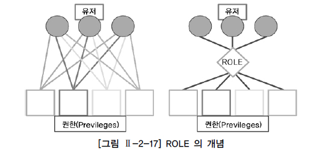

# DCL

## 1. DCL 개요

지금까지 살펴본 SQL 문장을 분류하면 테이블 생성과 조작에 관련된 명령어(DDL)와, 데이터를 조작하기 위한 명령어(DML), 그리고 TRANSACTION을 제어하기 위한 명령어(TCL)이다. 추가로, 이런 명령어들 이외에도 유저를 생성하고 권한을 제어할 수 있는 DCL(DATA CONTROL LANGUAGE) 명령어가 있다.

## 2. 유저와 권한

다른 부서 간에 또는 다른 회사 간에 데이터를 공유하기 위해 데이터베이스를 오픈해야 하는 경우가 가끔 발생한다. 물론 데이터베이스를 오픈하는 것 자체가 문제가 될 수 있다. 즉, 운영 시스템에서 사용하던 유저를 오픈하면 데이터의 손실 우려가 너무 커지게 되는 것이다. 이런 경우에 새로운 유저를 생성하고, 생성한 유저에게 공유할 테이블이나 기타 오브젝트에 대한 접근 권한만을 부여한다면 문제는 쉽게 해결할 수 있다. 일반적으로 회원제 웹사이트를 방문하여 서비스를 이용하려면 먼저 회원 가입을 해야 한다. 유저 아이디, 패스워드, 기타 개인정보를 입력하고 약관에 동의하면 회원 가입이 된다. 그리고 유저 아이디와 패스워드로 로그인하면 웹사이트의 서비스를 이용할 수 있게 된다. 그러나 영화나 유료 게임과 같은 특정 컨텐츠를 이용하려면 ‘권한이 없다’라는 메시지를 볼 수 있다. 여기서 유저 아이디와 패스워드를 유저라 할 수 있고, 유료 서비스에 대한 결재 여부를 권한이라 할 수 있다. 대부분의 데이터베이스는 데이터 보호와 보안을 위해서 유저와 권한을 관리하고 있는데, 예를 들어 Oracle을 설치하면 기본적으로 제공되는 유저들인 SYS, SYSTEM, SCOTT 유저에 대해서 [표 Ⅱ-2-8]을 통해서 간단하게 알아본다.

[표 Ⅱ-2-8] Oracle에서 제공하는 유저들

| 유저   | 역할                                                         |
| :----- | :----------------------------------------------------------- |
| SCOTT  | Oracle 테스트용 샘플 유저 Default 패스워드 : TIGER           |
| SYS    | DBA ROLE을 부여받은 유저                                     |
| SYSTEM | 데이터베이스의 모든 시스템 권한을 부여받은 DBA 유저 Oracle 설치 완료 시에 패스워드 설정 |

Oracle과 SQL Server의 사용자에 대한 아키텍처는 다른 면이 많다. Oracle은 유저를 통해 데이터베이스에 접속을 하는 형태이다. 즉, 아이디와 비밀번호 방식으로 인스턴스에 접속을 하고 그에 해당하는 스키마에 오브젝트 생성 등의 권한을 부여받게 된다. SQL Server는 인스턴스에 접속하기 위해 로그인이라는 것을 생성하게 되며, 인스턴스 내에 존재하는 다수의 데이터베이스에 연결하여 작업하기 위해 유저를 생성한 후 로그인과 유저를 매핑해 주어야 한다. 더 나아가 특정 유저는 특정 데이터베이스 내의 특정 스키마에 대해 권한을 부여받을 수 있다. SQL Server 로그인은 두 가지 방식으로 가능하다. 첫 번째, Windows 인증 방식으로 Windows에 로그인한 정보를 가지고 SQL Server에 접속하는 방식이다. Microsoft Windows 사용자 계정을 통해 연결되면 SQL Server는 운영 체제의 Windows 보안 주체 토큰을 사용하여 계정 이름과 암호가 유효한지 확인한다. 즉, Windows에서 사용자 ID를 확인한다. SQL Server는 암호를 요청하지 않으며 ID의 유효성 검사를 수행하지 않는다. Windows 인증은 기본 인증 모드이며 SQL Server 인증보다 훨씬 더 안전하다. Windows 인증은 Kerberos 보안 프로토콜을 사용하고, 암호 정책을 적용하여 강력한 암호에 대해 적합한 복잡성 수준을 유지하도록 하며, 계정 잠금 및 암호 만료를 지원한다. SQL Server가 Windows에서 제공하는 자격 증명을 신뢰하므로 Windows 인증을 사용한 연결을 트러스트된 연결이라고도 한다. 두 번째, 혼합 모드(Windows 인증 또는 SQL 인증) 방식으로 기본적으로 Windows 인증으로도 SQL Server에 접속 가능하며, Oracle의 인증과 같은 방식으로 사용자 아이디와 비밀번호로 SQL Server에 접속하는 방식이다. SQL 인증을 사용할 때는 강력한 암호(숫자+문자+특수문자 등을 혼합하여 사용)를 사용해야 한다. 예를 들어, 아래 [그림 Ⅱ-1-16]을 보면 SCOTT이라는 LOGIN 이름으로 인스턴스 INST1에 접속을 하여 미리 매핑되어 있는 SCOTT이라는 유저를 통해 PRODUCT라는 스키마에 속해 있는 ITEM이라는 테이블의 데이터를 액세스하고 있다.

### 가. 유저 생성과 시스템 권한 부여

유저를 생성하고 데이터베이스에 접속한다. 하지만 데이터베이스에 접속했다고 해서 테이블, 뷰, 인덱스 등과 같은 오브젝트(OBJECT)를 생성할 수는 없다. 사용자가 실행하는 모든 DDL 문장(CREATE, ALTER, DROP, RENAME 등)은 그에 해당하는 적절한 권한이 있어야만 문장을 실행할 수 있다. 이러한 권한을 시스템 권한이라고 하며 약 100개 이상의 종류가 있다. 일반적으로 시스템 권한은 일일이 유저에게 부여되지 않는다. 100개 이상의 시스템 권한을 일일이 사용자에게 설정하는 것은 너무 복잡하고, 특히 유저로부터 권한을 관리하기가 어렵기 때문이다. 그래서 롤(ROLE)을 이용하여 간편하고 쉽게 권한을 부여하게 된다. 롤에 대한 자세한 설명은 차후에 하도록 하고 먼저 유저를 생성하고 권한을 부여한다. 새로운 유저를 생성하려면 일단 유저 생성 권한(CREATE USER)이 있어야 한다.

[예제] SCOTT 유저로 접속한 다음 PJS 유저(패스워드: KOREA7)를 생성해 본다.

[예제] Oracle CONN SCOTT/TIGER 연결되었다. CREATE USER PJS IDENTIFIED BY KOREA7; CREATE USER PJS IDENTIFIED BY KOREA7; * 1행에 오류: ERROR: 권한이 불충분하다

현재 SCOTT 유저는 유저를 생성할 권한을 부여받지 못했기 때문에 권한이 불충분하다는 오류가 발생한다. Oracle의 DBA 권한을 가지고 있는 SYSTEM 유저로 접속하면 유저 생성 권한(CREATE USER)을 다른 유저에게 부여할 수 있다.

[예제] SCOTT 유저에게 유저생성 권한(CREATE USER)을 부여한 후 다시 PJS 유저를 생성한다.

[예제 및 실행 결과] Oracle GRANT CREATE USER TO SCOTT; 권한이 부여되었다. CONN SCOTT/TIGER 연결되었다. CREATE USER PJS IDENTIFIED BY KOREA7; 사용자가 생성되었다.

SQL Server는 유저를 생성하기 전 먼저 로그인을 생성해야 한다. 로그인을 생성할 수 있는 권한을 가진 로그인은 기본적으로 sa이다.

[예제] sa로 로그인을 한 후 SQL 인증을 사용하는 PJS라는 로그인(패스워드: KOREA7)을 생성해 본다. 로그인 후 최초로 접속할 데이터베이스는 AdventureWorks 데이터베이스로 설정한다.

[예제 및 실행 결과] SQL Server CREATE LOGIN PJS WITH PASSWORD='KOREA7', DEFAULT_DATABASE=AdventureWorks

SQL Server에서의 유저는 데이터베이스마다 존재한다. 그러므로 유저를 생성하기 위해서는 생성하고자 하는 유저가 속할 데이터베이스로 이동을 한 후 처리해야 한다.

[예제 및 실행 결과] SQL Server USE ADVENTUREWORKS; GO CREATE USER PJS FOR LOGIN PJS WITH DEFAULT_SCHEMA = dbo;

[예제] 생성된 PJS 유저로 로그인한다.

[예제 및 실행 결과] Oracle CONN PJS/KOREA7; 오류: ERROR: 사용자 PJS는 CREATE SESSION 권한을 가지고 있지 않음; 로그온이 거절되었다.

PJS 유저가 생성됐지만 아무런 권한도 부여받지 못했기 때문에 로그인을 하면 CREATE SESSION 권한이 없다는 오류가 발생한다. 유저가 로그인을 하려면 CREATE SESSION 권한을 부여받아야 한다.

[예제] PJS 유저가 로그인할 수 있도록 CREATE SESSION 권한을 부여한다.

[예제 및 실행 결과] Oracle CONN SCOTT/TIGER 연결되었다. GRANT CREATE SESSION TO PJS; 권한이 부여되었다. CONN PJS/KOREA7 연결되었다.

[예제] PJS 유저로 테이블을 생성한다.

[예제 및 실행 결과] Oracle SELECT * FROM TAB; 선택된 레코드가 없다. CREATE TABLE MENU ( MENU_SEQ NUMBER NOT NULL, TITLE VARCHAR2(10) ); CREATE TABLE MENU ( * 1행에 오류: ERROR: 권한이 불충분하다.

[예제 및 실행 결과] SQL Server CREATE TABLE MENU ( MENU_SEQ INT NOT NULL, TITLE VARCHAR(10) ); 데이터베이스 ‘AdventureWorks'에서 CREATE TABLE 사용 권한이 거부되었다.

PJS 유저는 로그인 권한만 부여되었기 때문에 테이블을 생성하려면 테이블 생성 권한(CREATE TABLE)이 불충분하다는 오류가 발생한다.(Oracle, SQL Server)

[예제] SYSTEM 유저를 통하여 PJS 유저에게 CREATE TABLE 권한을 부여한 후 다시 테이블을 생성한다.

[예제 및 실행 결과] Oracle CONN SYSTEM/MANAGER 연결되었다. GRANT CREATE TABLE TO PJS; 권한이 부여되었다. CONN PJS/KOREA7 연결되었다. CREATE TABLE MENU ( MENU_SEQ NUMBER NOT NULL, TITLE VARCHAR2(10) ); 테이블이 생성되었다.

[예제 및 실행 결과] SQL Server GRANT CREATE TABLE TO PJS; 권한이 부여되었다. 스키마에 권한을 부여한다. GRANT Control ON SCHEMA::dbo TO PJS 권한이 부여되었다. PJS로 로그인한다. CREATE TABLE MENU ( MENU_SEQ INT NOT NULL, TITLE VARCHAR(10) ); 테이블이 생성되었다.

### 나. OBJECT에 대한 권한 부여

앞에서 PJS 유저를 생성하여 로그인하고 테이블을 만드는 과정에서 몇 가지의 권한에 대해서 살펴보았다. 이제는 특정 유저가 소유한 객체(OBJECT) 권한에 대해 알아본다. 오브젝트 권한은 특정 오브젝트인 테이블, 뷰 등에 대한 SELECT, INSERT, DELETE, UPDATE 작업 명령어를 의미한다. [표 Ⅱ-2-9]는 오브젝트 권한과 오브젝트와의 관계를 보여 주고 있다.

[표 Ⅱ-2-9] 오브젝트 권한과 오브젝트와의 관계 (Oracle 사례)

| 객체권한   | 테이블 | VIEWS | SEQUENCE | PROCEDURE |
| :--------- | :----- | :---- | :------- | :-------- |
| ALTER      | O      |       | O        |           |
| DELETE     | O      | O     |          |           |
| EXECUTE    |        |       |          | O         |
| INDEX      | O      |       |          |           |
| INSERT     | O      | O     |          |           |
| REFERENCES | O      |       |          |           |
| SELECT     | O      | O     | O        |           |
| UPDATE     | O      | O     |          |           |

[표 Ⅱ-2-10] 오브젝트 권한과 오브젝트와의 관계 (SQL Server 사례)

| 객체권한   | 테이블 | VIEWS | FUNCTION | PROCEDURE |
| :--------- | :----- | :---- | :------- | :-------- |
| ALTER      | O      |       | O        |           |
| DELETE     | O      | O     | O        |           |
| EXECUTE    |        |       |          | O         |
| INDEX      | O      |       |          |           |
| INSERT     | O      | O     |          |           |
| REFERENCES | O      |       |          |           |
| SELECT     | O      | O     | O        |           |
| UPDATE     | O      | O     |          |           |

앞에서 PJS 유저가 생성한 MENU 테이블을 SCOTT 유저를 통해서 조회하면 어떻게 될까? SCOTT, PJS 뿐만 아니라 모든 유저는 각각 자신이 생성한 테이블 외에 다른 유저의 테이블에 접근하려면 해당 테이블에 대한 오브젝트 권한을 소유자로부터 부여받아야 한다. 우리가 남의 집에 방문했을 때 집주인의 허락 없이는 집에 들어갈 수 없는 것과 같은 이치이다. SQL Server도 같은 방식으로 동작한다. 한 가지 다른 점은 위에서 언급했듯이 유저는 단지 스키마에 대한 권한만을 가진다. 다시 말하면 테이블과 같은 오브젝트는 유저가 소유하는 것이 아니고 스키마가 소유를 하게 되며 유저는 스키마에 대해 특정한 권한을 가지는 것이다. 먼저 SCOTT 유저로 접속하여 PJS.MENU 테이블을 조회한다. 다른 유저가 소유한 객체에 접근하기 위해서는 객체 앞에 객체를 소유한 유저의 이름을 붙여서 접근해야 한다. SQL Server는 객체 앞에 소유한 유저의 이름을 붙이는 것이 아니고 객체가 속한 스키마 이름을 붙여야 한다.

[예제 및 실행 결과] Oracle CONN SCOTT/TIGER 연결되었다. SELECT * FROM PJS.MENU; SELECT * FROM PJS.MENU * 1행에 오류: ERROR: 테이블 또는 뷰가 존재하지 않는다.

[예제 및 실행 결과] SQL Server SCOTT로 로그인한다. SELECT * FROM dbo.MENU; 개체이름 ‘dbo.MENU'이(가) 잘못되었다.

SCOTT 유저는 PJS 유저로부터 MENU 테이블을 SELECT할 수 있는 권한을 부여받지 못했기 때문에 MENU 테이블을 조회할 수 없다.

[예제] PJS 유저로 접속하여 SCOTT 유저에게 MENU 테이블을 SELECT 할 수 있는 권한을 부여한다.

[예제 및 실행 결과] Oracle CONN PJS/KOREA7 연결되었다. INSERT INTO MENU VALUES (1, '화이팅'); 1개의 행이 만들어졌다. COMMIT; 커밋이 완료되었다. GRANT SELECT ON MENU TO SCOTT; 권한이 부여되었다.

[예제 및 실행 결과] SQL Server PJS로 로그인한다. INSERT INTO MENU VALUES (1, '화이팅'); 1개의 행이 만들어졌다. GRANT SELECT ON MENU TO SCOTT; 권한이 부여되었다.

다시 한 번 SCOTT 유저로 접속하여 PJS.MENU 테이블을 조회한다. 이제 PJS.MENU 테이블을 SELECT하면 테이블 자료를 볼 수 있다. SCOTT 유저는 PJS.MENU 테이블을 SELECT하는 권한만 부여 받았기 때문에 UPDATE, INSERT, DELETE와 같은 다른 작업을 할 수 없다. 오브젝트 권한은 SELECT, INSERT, DELETE, UPDATE 등의 권한을 따로따로 관리한다.

[예제] PJS.MENU 테이블에 UPDATE를 시도한다.

[예제 및 실행 결과] Oracle CONN SCOTT/TIGER 연결되었다. SELECT * FROM PJS.MENU; MENU_SEQ TITLE -------- -------- 1 화이팅 UPDATE PJS.MENU SET TITLE = '코리아' WHERE MENU_SEQ = 1; UPDATE PJS.MENU * 1행에 오=text>

[예제 및 실행 결과] SQL Server SCOTT으로 로그인한다. SELECT * FROM PJS.MENU; MENU_SEQ TITLE -------- ---------- 1 화이팅 UPDATE PJS.MENU SET TITLE = '코리아' WHERE MENU_SEQ = 1; 개체 ‘MENU', 데이터베이스 ’AdventureWorks', 스키마 ‘dbo'에 대한 UPDATE 권한이 거부되었다.

권한이 부족하여 UPDATE를 할 수 없다는 오류가 나타난다. PJS 유저에게 UPDATE 권한을 부여한 후 다시 시도하면 업데이트가 가능하다.

## 3. Role을 이용한 권한 부여

유저를 생성하면 기본적으로 CREATE SESSION, CREATE TABLE, CREATE PROCEDURE 등 많은 권한을 부여해야 한다. 데이터베이스 관리자는 유저가 생성될 때마다 각각의 권한들을 유저에게 부여하는 작업을 수행해야 하며 간혹 권한을 빠뜨릴 수도 있으므로 각 유저별로 어떤 권한이 부여되었는지를 관리해야 한다. 하지만 관리해야 할 유저가 점점 늘어나고 자주 변경되는 상황에서는 매우 번거로운 작업이 될 것이다. 이와 같은 문제를 줄이기 위하여 많은 데이터베이스에서 유저들과 권한들 사이에서 중개 역할을 하는 ROLE을 제공한다. 데이터베이스 관리자는 ROLE을 생성하고, ROLE에 각종 권한들을 부여한 후 ROLE을 다른 ROLE이나 유저에게 부여할 수 있다. 또한 ROLE에 포함되어 있는 권한들이 필요한 유저에게는 해당 ROLE만을 부여함으로써 빠르고 정확하게 필요한 권한을 부여할 수 있게 된다. [그림 Ⅱ-2-17]에서는 유저들과 권한들 사이 간 ROLE의 역할을 보여 주고 있다. 왼쪽 그림은 권한을 직접 유저에게 할당할 때를 나타내는 것이며, 오른쪽 그림은 ROLE에 권한을 부여한 후 ROLE을 유저들에게 부여하는 것을 나타내고 있다.

ROLE에는 시스템 권한과 오브젝트 권한을 모두 부여할 수 있으며, ROLE은 유저에게 직접 부여될 수도 있고, 다른 ROLE에 포함하여 유저에게 부여될 수도 있다.

[예제] JISUNG 유저에게 CREATE SESSION과 CREATE TABLE 권한을 가진 ROLE을 생성한 후 ROLE을 이용하여 다시 권한을 할당한다. 권한을 취소할 때는 REVOKE를 사용한다.

[예제 및 실행 결과] Oracle CONN SYSTEM/MANAGER 연결되었다. REVOKE CREATE SESSION, CREATE TABLE FROM JISUNG; 권한이 취소되었다. CONN JISUNG/KOREA7 ERROR: 사용자 JISUNG은 CREATE SESSION 권한을 가지고 있지 않음. 로그온이 거절되었다.

[예제 및 실행 결과] SQL Server sa로 로그인한다. REVOKE CREATE TABLE FROM PJS; 권한이 취소되었다. PJS로 로그인한다. CREATE TABLE MENU ( MENU_SEQ INT NOT NULL, TITLE VARCHAR(10) ); 데이터베이스 ‘AdventureWorks'에서 CREATE TABLE사용 권한이 거부되었다.

[예제] 이제 LOGIN_TABLE이라는 ROLE을 만들고, 이 ROLE을 이용하여 JISUNG 유저에게 권한을 부여한다.

[예제 및 실행 결과] Oracle CONN SYSTEM/MANAGER 연결되었다. CREATE ROLE LOGIN_TABLE; 롤이 생성되었다. GRANT CREATE SESSION, CREATE TABLE TO LOGIN_TABLE; 권한이 부여되었다. GRANT LOGIN_TABLE TO JISUNG; 권한이 부여되었다. CONN JISUNG/KOREA7 연결되었다. CREATE TABLE MENU2( MENU_SEQ NUMBER NOT NULL, TITLE VARCHAR2(10)); 테이블이 생성되었다.

이와 같이 ROLE을 만들어 사용하는 것이 권한을 직접 부여하는 것보다 빠르고 안전하게 유저를 관리할 수 있는 방법이다. Oracle에서는 기본적으로 몇 가지 ROLE을 제공하고 있다. 그 중 가장 많이 사용하는 ROLE은 CONNECT와 RESOURCE이다. 참조를 위해 [표 Ⅱ-2-11]은 CONNECT와 RESOURCE ROLE에 부여된 권한 목록을 정리한 것이다. CONNECT는 CREATE SESSION과 같은 로그인 권한이 포함되어 있고, RESOURCE는 CREATE TABLE과 같은 오브젝트의 생성 권한이 포함되어 있다. 일반적으로 유저를 생성할 때 CONNECT와 RESOURCE ROLE을 사용하여 기본 권한을 부여한다.

[표 Ⅱ-2-11] CONNECT ROLE과 RESOURCE ROLE에 포함된 권한 목록 (Oracle 사례)

| CONNECT              | RESOURCE             |
| :------------------- | :------------------- |
| ALTER SESSION        | CREATE CLUSTER       |
| CREATE CLUSTER       | CREATE INDEXTYPE     |
| CREATE DATABASE LINK | CREATE OPERATOR      |
| CREATE MENU_SEQUENCE | CREATE PROCEDURE     |
| CREATE SESSION       | CREATE MENU_SEQUENCE |
| CREATE SYNONYM       | CREATE TABLE         |
| CREATE TABLE         | CREATE TRIGGER       |
| CREATE VIEW          | CREATE               |

유저를 삭제하는 명령어는 DROP USER이고, CASCADE 옵션을 주면 해당 유저가 생성한 오브젝트를 먼저 삭제한 후 유저를 삭제한다.

[예제] 앞에서 MENU라는 테이블을 생성했기 때문에 CASCADE 옵션을 사용하여 JISUNG 유저를 삭제한 후, 유저 재생성 및 기본적인 ROLE을 부여한다.

[예제 및 실행 결과] Oracle CONN SYSTEM/MANAGER 연결되었다. DROP USER JISUNG CASCADE; 사용자가 삭제되었다. ☞ JISUNG 유저가 만든 MENU 테이블도 같이 삭제되었다. CREATE USER JISUNG IDENTIFIED BY KOREA7; 사용자가 생성되었다. GRANT CONNECT, RESOURCE TO JISUNG; 권한이 부여되었다. CONN JISUNG/KOREA7 연결되었다. CREATE TABLE MENU ( MENU_SEQ NUMBER NOT NULL, TITLE VARCHAR2(10)); 테이블이 생성되었다.

SQL Server에서는 위와 같이 ROLE을 생성하여 사용하기보다는 기본적으로 제공되는 ROLE에 멤버로 참여하는 방식으로 사용한다. 특정 로그인이 멤버로 참여할 수 있는 서버 수준 역할(ROLE)은 [표 Ⅱ-2-12]와 같다.

데이터베이스에 존재하는 유저에 대해서는 아래와 같은 데이터베이스 역할의 멤버로 참여할 수 있다.

SQL Server에서는 Oracle과 같이 Role을 자주 사용하지 않는다. 대신 위에서 언급한 서버 수준 역할 및 데이터베이스 수준 역할을 이용하여 로그인 및 사용자 권한을 제어한다. 인스턴스 수준의 작업이 필요한 경우 서버 수준 역할을 부여하고 그보다 작은 개념인 데이터베이스 수준의 권한이 필요한 경우 데이터베이스 수준의 역할을 부여하면 된다. 즉, 인스턴스 수준을 요구하는 로그인에는 서버 수준 역할을, 데이터베이스 수준을 요구하는 사용자에게는 데이터베이스 수준 역할을 부여한다.