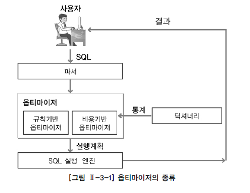
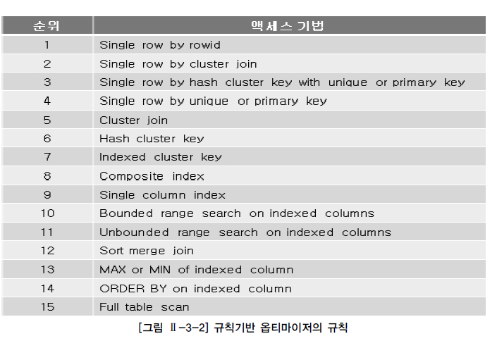
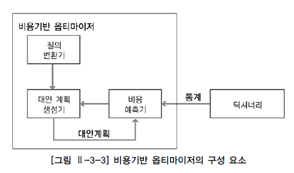
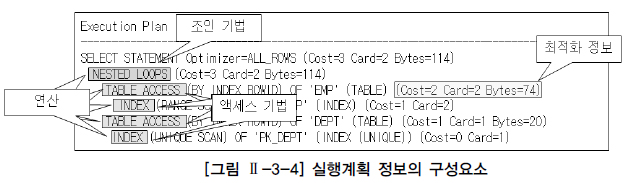

# 옵티마이저와 실행계획

## 1. 옵티마이저

옵티마이저(Optimizer)는 사용자가 질의한 SQL문에 대해 최적의 실행 방법을 결정하는 역할을 수행한다. 이러한 최적의 실행 방법을 실행계획(Execution Plan)이라고 한다. 관계형 데이터베이스는 궁극적으로 SQL문을 통해서만 데이터를 처리할 수 있다. JAVA, C등과 같은 프로그램 언어와는 달리 SQL은 사용자의 요구사항만 기술할 뿐 처리과정에 대한 기술은 하지 않는다. 그러므로 사용자의 요구사항을 만족하는 결과를 추출할 수 있는 다양한 실행 방법이 존재할 수 있다. 다양한 실행 방법들 중에서 최적의 실행 방법을 결정하는 것이 바로 옵티마이저의 역할이다. 관계형 데이터베이스는 옵티마이저가 결정한 실행 방법대로 실행 엔진이 데이터를 처리하여 결과 데이터를 사용자에게 전달할 뿐이다. 옵티마이저가 선택한 실행 방법의 적절성 여부는 질의의 수행 속도에 가장 큰 영향 미치게 된다. 이런 의미에서 관계형 데이터베이스에서 진정한 프로그래머는 옵티마이저라고 할 수 있다. 최적의 실행 방법 결정이라는 것은 어떤 방법으로 처리하는 것이 최소 일량으로 동일한 일을 처리할 수 있을지 결정하는 것이다. 그러나 이러한 결정을 옵티마이저는 실제로 SQL문을 처리해보지 않은 상태에서 결정해야 하는 어려움이 있다. 옵티마이저가 최적의 실행 방법을 결정하는 방식에 따라 [그림 Ⅱ-3-1]과 같이 규칙기반 옵티마이저(RBO, Rule Based Optimizer)와 비용기반 옵티마이저(CBO, Cost Based Optimizer)로 구분할 수 있다.

현재 대부분의 관계형 데이터베이스는 비용기반 옵티마이저만을 제공한다. 비록 규칙기반 옵티마이저를 제공하더라도 신규 기능들에 대해서는 더 이상 지원하지 않는다. 다만 하위 버전 호환성을 위해서만 규칙기반 옵티마이저가 남아 있을 뿐이다. 그렇지만 규칙기반 옵티마이저의 규칙은 보편 타당성에 근거한 것들이다. 이러한 규칙을 알고 있는 것은 옵티마이저의 최적화 작업을 이해하는데 도움이 된다.

### 가. 규칙기반 옵티마이저

규칙기반 옵티마이저는 규칙(우선 순위)을 가지고 실행계획을 생성한다. 실행계획을 생성하는 규칙을 이해하면 누구나 실행계획을 비교적 쉽게 예측할 수 있다. 규칙기반 옵티마이저가 실행계획을 생성할 때 참조하는 정보에는 SQL문을 실행하기 위해서 이용 가능한 인덱스 유무와 (유일, 비유일, 단일, 복합 인덱스)종류, SQL문에서 사용하는 연산자(=, <, <>, LIKE, BETWEEN 등)의 종류 그리고 SQL문에서 참조하는 객체(힙 테이블, 클러스터 테이블 등)의 종류 등이 있다. 이러한 정보에 따라 우선 순위(규칙)가 정해져 있고, 이 우선 순위를 기반으로 실행계획을 생성한다. 결과적으로 규칙기반 옵티마이저는 우선 순위가 높은 규칙이 적은 일량으로 해당 작업을 수행하는 방법이라고 판단하는 것이다. [그림 Ⅱ-3-2]는 Oracle의 규칙기반 옵티마이저의 15가지 규칙이다. 순위의 숫자가 낮을수록 높은 우선 순위이다.

규칙기반 옵티마이저의 우선 순위 규칙 중에서 주요한 규칙에 대해서만 간략히 설명한다.

규칙 1. Single row by rowid : ROWID를 통해서 테이블에서 하나의 행을 액세스하는 방식이다. ROWID는 행이 포함된 데이터 파일, 블록 등의 정보를 가지고 있기 때문에 다른 정보를 참조하지 않고도 바로 원하는 행을 액세스할 수 있다. 하나의 행을 액세스하는 가장 빠른 방법이다.

규칙 4. Single row by unique or primary key : 유일 인덱스(Unique Index)를 통해서 하나의 행을 액세스하는 방식이다. 이 방식은 인덱스를 먼저 액세스하고 인덱스에 존재하는 ROWID를 추출하여 테이블의 행을 액세스한다.

칙 8. Composite index : 복합 인덱스에 동등(‘=’ 연산자) 조건으로 검색하는 경우이다. 예를 들어, 만약 A+B 칼럼으로 복합 인덱스가 생성되어 있고, 조건절에서 WHERE A=10 AND B=1 형태로 검색하는 방식이다. 복합 인덱스 사이의 우선 순위 규칙은 다음과 같다. 인덱스 구성 칼럼의 개수가 더 많고 해당 인덱스의 모든 구성 칼럼에 대해 ‘=’로 값이 주어질 수록 우선순위가 더 높다. 예를 들어, A+B로 구성된 인덱스와 A+B+C로 구성된 인덱스가 각각 존재하고 조건절에서 A, B, C 칼럼 모두에 대해 ‘=’로 값이 주어진다면 A+B+C 인덱스가 우선 순위가 높다. 만약 조건절에서 A, B 칼럼에만 ‘=’로 값이 주어진다면 A+B는 인덱스의 모든 구성 칼럼에 대해 값이 주어지고 A+B+C 인덱스 입장에서는 인덱스의 일부 칼럼에 대해서만 값이 주어졌기 때문에 A+B 인덱스가 우선 순위가 높게 된다.

규칙 9. Single column index : 단일 칼럼 인덱스에 ‘=’ 조건으로 검색하는 경우이다. 만약 A 칼럼에 단일 칼럼 인덱스가 생성되어 있고, 조건절에서 A=10 형태로 검색하는 방식이다.

규칙 10. Bounded range search on indexed columns : 인덱스가 생성되어 있는 칼럼에 양쪽 범위를 한정하는 형태로 검색하는 방식이다. 이러한 연산자에는 BETWEEN, LIKE 등이 있다. 만약 A 칼럼에 인덱스가 생성되어 있고, A BETWEEN ‘10’ AND ‘20’ 또는 A LIKE '1%' 형태로 검색하는 방식이다.

규칙 11. Unbounded range search on indexed columns : 인덱스가 생성되어 있는 칼럼에 한쪽 범위만 한정하는 형태로 검색하는 방식이다. 이러한 연산자에는 >, >=, <, <= 등이 있다. 만약 A 칼럼에 인덱스가 생성되어 있고, A > '10' 또는 A < '20' 형태로 검색하는 방식이다.

규칙 15. Full table scan : 전체 테이블을 액세스하면서 조건절에 주어진 조건을 만족하는 행만을 결과로 추출한다.

규칙기반 옵티마이저는 인덱스를 이용한 액세스 방식이 전체 테이블 액세스 방식보다 우선 순위가 높다. 따라서 규칙기반 옵티마이저는 해당 SQL문에서 이용 가능한 인덱스가 존재한다면 전체 테이블 액세스 방식보다는 항상 인덱스를 사용하는 실행계획을 생성한다. 규칙기반 옵티마이저가 조인 순서를 결정할 때는 조인 칼럼 인덱스의 존재 유무가 중요한 판단의 기준이다. 조인 칼럼에 대한 인덱스가 양쪽 테이블에 모두 존재한다면 앞에서 설명한 규칙에 따라 우선 순위가 높은 테이블을 선행 테이블(Driving Table)로 선택한다. 한쪽 조인 칼럼에만 인덱스가 존재하는 경우에는 인덱스가 없는 테이블을 선행 테이블로 선택해서 조인을 수행한다. 조인 칼럼에 모두 인덱스가 존재하지 않으면 FROM 절의 뒤에 나열된 테이블을 선행 테이블로 선택한다. 만약 조인 테이블의 우선 순위가 동일하다면 FROM 절에 나열된 테이블의 역순으로 선행 테이블을 선택한다. 규칙기반 옵티마이저의 조인 기법의 선택은 다음과 같다. 양쪽 조인 칼럼에 모두 인덱스가 없는 경우에는 Sort Merge Join을 사용하고 둘 중하나라도 조인 칼럼에 인덱스가 존재한다면 일반적으로 NL Join을 사용한다.

다음 SQL문을 이용해서 규칙기반 옵티마이저의 최적화 과정을 알아보자.

SELECT ENAME FROM EMP WHERE JOB = 'SALESMAN' AND SAL BETWEEN 3000 AND 6000 INDEX --------------------------------- EMP_JOB : JOB EMP_SAL : SAL PK_EMP : EMPNO (UNIQUE)

조건절에서 JOB 칼럼의 조건은 ‘=’, SAL 칼럼의 조건은 ‘BETWEEN’으로 값이 주어졌고 각각의 칼럼에 단일 칼럼 인덱스가 존재한다. 우선 순위 규칙에 따라 JOB 조건은 규칙 9의 단일 칼럼 인덱스를 만족하고 SAL 조건은 규칙 10의 인덱스상의 양쪽 한정 검색을 만족한다. 따라서 우선 순위가 높은 EMP_JOB 인덱스를 이용해서 조건을 만족하는 행에 대해 EMP 테이블을 액세스하는 방식을 선택할 것이다. 다음은 규칙기반 옵티마이저가 생성한 실행계획이다.

Execution Plan ------------------------------------------------------------ SELECT STATEMENT Optimizer=CHOOSE TABLE ACCESS (BY INDEX ROWID) OF 'EMP' INDEX (RANGE SCAN) OF 'EMP_JOB' (NON-UNIQUE)

### 나. 비용기반 옵티마이저

규칙기반 옵티마이저는 조건절에서 ‘=’ 연산자와 'BETWEEN' 연산자가 사용되면 규칙에 따라 ‘=’ 칼럼의 인덱스를 사용하는 것이 보다 적은 일량 즉, 보다 적은 처리 범위로 작업을 할 것이라고 판단한다. 그러나 실제로는 ‘BETWEEN’ 칼럼을 사용한 인덱스가 보다 일량이 적을 수 있다. 단순한 몇 개의 규칙만으로 현실의 모든 사항을 정확히 예측할 수는 없다. 비용기반 옵티마이저는 이러한 규칙기반 옵티마이저의 단점을 극복하기 위해서 출현하였다. 비용기반 옵티마이저는 SQL문을 처리하는데 필요한 비용이 가장 적은 실행계획을 선택하는 방식이다. 여기서 비용이란 SQL문을 처리하기 위해 예상되는 소요시간 또는 자원 사용량을 의미한다. 비용기반 옵티마이저는 비용을 예측하기 위해서 규칙기반 옵티마이저가 사용하지 않는 테이블, 인덱스, 칼럼 등의 다양한 객체 통계정보와 시스템 통계정보 등을 이용한다. 통계정보가 없는 경우 비용기반 옵티마이저는 정확한 비용 예측이 불가능해져서 비효율적인 실행계획을 생성할 수 있다. 그렇기 때문에 정확한 통계정보를 유지하는 것은 비용기반 최적화에서 중요한 요소이다.

[그림 Ⅱ-3-3]과 같이 비용기반 옵티마이저는 질의 변환기, 대안 계획 생성기, 비용 예측기 등의 모듈로 구성되어 있다. 질의 변환기는 사용자가 작성한 SQL문을 처리하기에 보다 용이한 형태로 변환하는 모듈이다. 대안 계획 생성기는 동일한 결과를 생성하는 다양한 대안 계획을 생성하는 모듈이다. 대안 계획은 연산의 적용 순서 변경, 연산 방법 변경, 조인 순서 변경 등을 통해서 생성된다. 동일한 결과를 생성하는 가능한 모든 대안 계획을 생성해야 보다 나은 최적화를 수행할 수 있다. 그러나 대안 계획의 생성이 너무 많아지면 최적화를 수행하는 시간이 그만큼 오래 걸린 수 있다. 그래서 대부분의 상용 옵티마이저들은 대안 계획의 수를 제약하는 다양한 방법을 사용한다. 이러한 현실적인 제약으로 인해 생성된 대안 계획들 중에서 최적의 대안 계획이 포함되지 않을 수도 있다. 비용 예측기는 대안 계획 생성기에 의해서 생성된 대안 계획의 비용을 예측하는 모듈이다. 대안 계획의 정확한 비용을 예측하기 위해서 연산의 중간 집합의 크기 및 결과 집합의 크기, 분포도 등의 예측이 정확해야 한다. 보다 나은 예측을 위해 옵티마이저는 정확한 통계정보를 필요로 한다. 또한 대안 계획을 구성하는 각 연산에 대한 비용 계산식이 정확해야 한다. 앞에서 규칙기반 옵티마이저는 항상 인덱스를 사용할 수 있다면 전체 테이블 스캔 보다는 인덱스를 사용하는 실행계획을 생성한다고 했다. 그렇지만 비용기반 옵티마이저는 인덱스를 사용하는 비용이 전체 테이블 스캔 비용보다 크다고 판단되면 전체 테이블 스캔을 수행하는 방법으로 실행계획을 생성할 수도 있다. 비용기반 옵티마이저는 통계정보, DBMS 버전, DBMS 설정 정보 등의 차이로 인해 동일 SQL문도 서로 다른 실행계획이 생성될 수 있다. 또한 비용기반 옵티마이저의 다양한 한계들로 인해 실행계획의 예측 및 제어가 어렵다는 단점이 있다.

## 2. 실행계획

실행계획(Execution Plan)이란 SQL에서 요구한 사항을 처리하기 위한 절차와 방법을 의미한다. 실행계획을 생성한다는 것은 SQL을 어떤 순서로 어떻게 실행할 지를 결정하는 작업이다. 동일한 SQL에 대해 결과를 낼 수 있는 다양한 처리 방법(실행계획)이 존재할 수 있지만 각 처리 방법마다 실행 시간(성능)은 서로 다를 수 있다. 옵티마이저는 다양한 처리 방법들 중에서 가장 효율적인 방법을 찾아준다. 즉, 옵티마이저는 최적의 실행계획을 생성해 준다. 생성된 실행계획을 보는 방법은 데이터베이스 벤더마다 서로 다르다. 실행계획에서 표시되는 내용 및 형태도 약간씩 차이는 있지만 실행계획이 SQL 처리를 위한 절차와 방법을 의미한다는 기본적인 사항은 모두 동일하다. 실행계획을 보고 SQL이 어떻게 실행되는지 정확히 이해할 수 있다면 보다 향상된 SQL의 이해 및 활용이 가능하다. Oracle의 실행계획 형태는 [그림 Ⅱ-3-4]와 같다. 실행계획을 구성하는 요소에는 조인 순서(Join Order), 조인 기법(Join Method), 액세스 기법(Access Method), 최적화 정보(Optimization Information), 연산(Operation) 등이 있다

조인 순서는 조인작업을 수행할 때 참조하는 테이블의 순서이다. 예를 들어, FROM 절에 A, B 두 개의 테이블이 존재할 때 조인 작업을 위해 먼저 A 테이블을 읽고 B 테이블을 읽는 작업을 수행한다면 조인 순서는 A → B이다. [그림 Ⅱ-3-4]에서 조인 순서는 EMP → DEPT이다. 논리적으로 가능한 조인 순서는 n! 만큼 존재한다. 여기서는 n은 FROM 절에 존재하는 테이블 수이다. 그러나 현실적으로 옵티마이저가 적용 가능한 조인 순서는 이보다는 적거나 같다. 조인 기법은 두 개의 테이블을 조인할 때 사용할 수 있는 방법으로서 여기에는 NL Join, Hash Join, Sort Merge Join 등이 있다. [그림 Ⅱ-3-4]에서 조인 기법은 NL Join을 사용하고 있다. 액세스 기법은 하나의 테이블을 액세스할 때 사용할 수 있는 방법이다. 여기에는 인덱스를 이용하여 테이블을 액세스하는 인덱스 스캔(Index Scan)과 테이블 전체를 모두 읽으면서 조건을 만족하는 행을 찾는 전체 테이블 스캔(Full Table Scan) 등이 있다. [그림 Ⅱ-3-4]에서 액세스 기법은 인덱스 스캔을 사용하고 있다. 최적화 정보는 옵티마이저가 실행계획의 각 단계마다 예상되는 비용 사항을 표시한 것이다. 실행계획에 비용 사항이 표시된다는 것은 비용기반 최적화 방식으로 실행계획을 생성했다는 것을 의미한다. 최적화 정보에는 Cost, Card, Bytes가 있다. Cost는 상대적인 비용 정보이고 Card는 Cardinality의 약자로서 주어진 조건을 만족한 결과 집합 혹은 조인 조건을 만족한 결과 집합의 건수를 의미한다. Bytes는 결과 집합이 차지하는 메모리 양을 바이트로 표시한 것이다. 이러한 비용 정보는 실제로 SQL을 실행하고 얻은 결과가 아니라 통계 정보를 바탕으로 옵티마이저가 계산한 예상치이다. 만약 이러한 비용 사항이 실행계획에 표시되지 않았다면 이것은 규칙기반 최적화 방식으로 실행계획을 생성한 것이다. [그림 Ⅱ-3-4] 실행계획의 예에서는 비용 정보가 표시되어 있으므로 비용기반 최적화 방식으로 생성된 실행계획이다. 연산(Operation)은 여러 가지 조작을 통해서 원하는 결과를 얻어내는 일련의 작업이다. 연산에는 조인 기법(NL Join, Hash Join, Sort Merge Join 등), 액세스 기법(인덱스 스캔, 전체 테이블 스캔 등), 필터, 정렬, 집계, 뷰 등 다양한 종류가 존재한다. 예를 들어, SQL에서 정렬을 목적으로 ORDER BY를 수행했다면 정렬 연산이 표시되다.

## 3. SQL 처리 흐름도

SQL 처리 흐름도(Access Flow Diagram)란 SQL의 내부적인 처리 절차를 시각적으로 표현한 도표이다. 이것은 실행계획을 시각화한 것이다. [그림 Ⅱ-3-5]와 같이 액세스 처리 흐름도에는 SQL문의 처리를 위해 어떤 테이블을 먼저 읽었는지(조인 순서), 테이블을 읽기 위해서 인덱스 스캔을 수행했는지 또는 테이블 전체 스캔을 수행했는지(액세스 기법)과 조인 기법 등을 표현할 수 있다. 예를 들어, [그림 Ⅱ-3-5]에서 조인 순서는 TAB1 → TAB2이다. 여기서 TAB1을 Outer Table 또는 Driving Table이라고 하고, TAB2를 Inner Table 또는 Lookup Table이라고 한다. 테이블의 액세스 방법은 TAB1은 테이블 전체 스캔을 의미하고 TAB2는 I01_TAB2 이라는 인덱스를 통한 인덱스 스캔을 했음을 표시한 것이다. 조인 방법은 NL Join을 수행했음을 표시한 것이다. [그림 Ⅱ-3-5]에서 TAB1에 대한 액세스는 스캔(Scan) 방식이고 조인시도 및 I01_TAB2 인덱스를 통한 TAB2 액세스는 랜덤(Random) 방식이다. 대량의 데이터를 랜덤 방식으로 액세스하게 되면 많은 I/O가 발생하여 성능상 좋지 않다.

성능적인 관점을 살펴보기 위해서 SQL 처리 흐름도에 일량을 함께 표시할 수 있다. [그림 Ⅱ-3-5]에서 건수(액세스 건수, 조인 시도 건수, 테이블 액세스 건수, 성공 건수)라고 표시된 곳에 SQL 처리를 위해 작업한 건수 또는 처리 결과 건수 등의 일량을 함께 표시할 수 있다. 이것을 통해 어느 부분에서 비효율이 발생하고 있는지에 대한 힌트를 얻을 수 있다.

다음은 [그림 Ⅱ-3-5]가 다음 SQL문에 대한 SQL 처리 흐름도라는 가정으로 설명한다.

SELECT … FROM TAB1 A, TAB2 B WHERE A.KEY = B.KEY AND A.COL1 = :condition1 AND B.COL2 = :condition2

[그림 Ⅱ-3-5]에서 액세스 건수는 SQL 처리를 위해 TAB1을 액세스한 건수이다. 여기서는 TAB1의 A.COL1 칼럼에 이용 가능한 인덱스가 존재하지 않아 전체 테이블 스캔을 수행했음을 의미한다. 따라서 액세스 건수는 TAB1 테이블의 총 건수와 동일하다. 조인 시도 건수는 TAB1을 액세스한 후 즉, 테이블에서 읽은 해당 건에 대해 A.COL1 = :condition1 조건을 만족한 건만이 TAB2와 조인을 시도한다. 즉, TAB1을 액세스한 후 A.COL1 = :condition1 조건을 만족하지 않는다면 더 이상 조인 작업을 진행할 필요가 없다. 따라서 조인 시도 건수는 TAB1에 주어진 조건인 A.COL1 = :condition1을 만족한 건수가 된다. 테이블 액세스 건수는 B.KEY 칼럼만으로 구성된 인덱스(B.KEY 칼럼만으로 구성된 인덱스라고 가정함)인 I01_TAB2에서 B.KEY = A.KEY (TAB1은 이미 읽혀졌기 때문에 A.KEY 값은 상수임) 조건을 만족한 건만이 TAB2 테이블을 액세스한다. 즉, 조인 시도한 건들 중에서 B.KEY = A.KEY 조건까지 만족한 건과 같다. 성공 건수는 SQL 실행을 통해 사용자에게 답으로서 보여지는 결과 건수이다. TAB2 테이블을 액세스해서 B.COL2 = :condition2 조건까지 만족해야 비로서 사용자에게 보여질 수 있다.