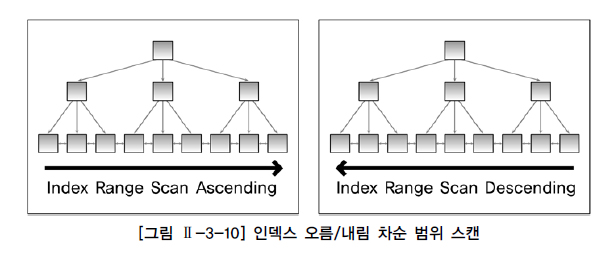

# 인덱스 기본

## 1. 인덱스 특징과 종류

인덱스는 원하는 데이터를 쉽게 찾을 수 있도록 돕는 책의 찾아보기와 유사한 개념이다. 인덱스는 테이블을 기반으로 선택적으로 생성할 수 있는 구조이다. 테이블에 인덱스를 생성하지 않아도 되고 여러 개를 생성해도 된다. 인덱스의 기본적인 목적은 검색 성능의 최적화이다. 즉, 검색 조건을 만족하는 데이터를 인덱스를 통해 효과적으로 찾을 수 있도록 돕는다. 그렇지만 Insert, Update, Delete 등과 같은 DML 작업은 테이블과 인덱스를 함께 변경해야 하기 때문에 오히려 느려질 수 있다는 단점이 존재한다.

### 가. 트리 기반 인덱스

DBMS에서 가장 일반적인 인덱스는 B-트리 인덱스이다.

[그림 Ⅱ-3-6]과 같이 B-트리 인덱스는 브랜치 블록(Branch Block)과 리프 블록(Leaf Block)으로 구성된다. 브랜치 블록 중에서 가장 상위에서 있는 블록을 루트 블록(Root Block)이라고 한다. 브랜치 블록은 분기를 목적으로 하는 블록이다. 브랜치 블록은 다음 단계의 블록을 가리키는 포인터를 가지고 있다. 리프 블록은 트리의 가장 아래 단계에 존재한다. 리프 블록은 인덱스를 구성하는 칼럼의 데이터와 해당 데이터를 가지고 있는 행의 위치를 가리키는 레코드 식별자(RID, Record Identifier/Rowid)로 구성되어 있다. 인덱스 데이터는 인덱스를 구성하는 칼럼의 값으로 정렬된다. 만약 인덱스 데이터의 값이 동일하면 레코드 식별자의 순서로 저장된다. 리프 블록은 양방향 링크(Double Link)를 가지고 있다. 이것을 통해서 오름 차순(Ascending Order)과 내림 차순(Descending Order) 검색을 쉽게 할 수 있다. B-트리 인덱스는 ‘=’로 검색하는 일치(Exact Match) 검색과 ‘BETWEEN’, ‘>’ 등과 같은 연산자로 검색하는 범위(Range) 검색 모두에 적합한 구조이다. [그림 Ⅱ-3-7]은 브랜치 브록이 3개의 포인터로 구성된 B-트리 인덱스의 예이다. 인덱스에서 원하는 값을 찾는 과정은 다음과 같다.

1단계. 브랜치 블록의 가장 왼쪽 값이 찾고자 하는 값보다 작거나 같으면 왼쪽 포인터로 이동 2단계. 찾고자 하는 값이 브랜치 블록의 값 사이에 존재하면 가운데 포인터로 이동 3단계. 오른쪽에 있는 값보다 크면 오른쪽 포인터로 이동

이 과정을 리프 블록을 찾을 때까지 반복한다. 리프 블록에서 찾고자 하는 값이 존재하면 해당 값을 찾은 것이고, 해당 값이 없으면 해당 값은 존재하지 않아 검색에 실패하게 된다.

예를 들어, [그림 Ⅱ-3-7]에서 37을 찾고자 한다면 루트 블록에서 50보다 작으므로 왼쪽 포인터로 이동한다. 37는 왼쪽 브랜치 블록의 11과 40 사이의 값이므로 가운데 포인터로 이동한다. 이동한 결과 해당 블록이 리프 블록이므로 37이 블록 내에 존재하는지 검색한다. 본 예에서는 리프 블록에 37이 존재한다. 검색하고자 하는 값을 찾은 것이다. 만약, SQL문에서 다른 칼럼이 더 필요하면 리프 블록에 존재하는 레코드 식별자를 이용해서 테이블을 액세스한다. 만약, 37과 50사이의 모든 값을 찾고자 한다면(BETWEEN 37 AND 50) 위와 동일한 방법으로 리프 블록에서 37을 찾고 50보다 큰 값을 만날 때까지 오른쪽으로 이동하면서 인덱스를 읽는다. 이것은 인덱스 데이터가 정렬되어 있고 리프 블록이 양방향 링크로 연결되어 있기 때문에 가능하다. 인덱스를 경유해서 반환된 결과 데이터는 인덱스 데이터와 동일한 순서로 갖게 되는 특징을 갖는다. 인덱스를 생성할 때 동일 칼럼으로 구성된 인덱스를 중복해서 생성할 수 없다. 그렇지만 인덱스 구성 칼럼은 동일하지만 칼럼의 순서가 다르면 서로 다른 인덱스로 생성할 수 있다. 예를 들어, JOB+SAL 칼럼 순서의 인덱스와 SAL+JOB 칼럼 순서의 인덱스를 별도의 인덱스를 생성할 수 있다. 인덱스의 칼럼 순서는 질의의 성능에 중요한 영향을 미치는 요소이다. Oracle에서 트리 기반 인덱스에는 B-트리 인덱스 외에도 비트맵 인덱스(Bitmap Index), 리버스 키 인덱스(Reverse Key Index), 함수기반 인덱스(FBI, Function-Based Index) 등이 존재한다.

### 나. SQL Server의 클러스터형 인덱스

SQL Server의 인덱스 종류는 저장 구조에 따라 클러스터형(clustered) 인덱스와 비클러스터형(nonclustered) 인덱스로 나뉜다. 여기서는 클러스터형 인덱스에 대해서만 설명하기로 한다. 클러스터형 인덱스는 두 가지 중요한 특징이 있다.

첫째, 인덱스의 리프 페이지가 곧 데이터 페이지다. 따라서 테이블 탐색에 필요한 레코드 식별자가 리프 페이지에 없다(인덱스 키 칼럼과 나머지 칼럼을 리프 페이지에 같이 저장하기 때문에 테이블을 랜덤 액세스할 필요가 없다). 클러스터형 인덱스의 리프 페이지를 탐색하면 해당 테이블의 모든 칼럼 값을 곧바로 얻을 수 있다. 흔히 클러스터형 인덱스를 사전에 비유한다. 예를 들어, 영한사전은 알파벳 순으로 정렬되어 있으며 각 단어 바로 옆에 한글 설명이 붙어 있다. 전문서적 끝 부분에 있는 찾아보기(=색인)가 페이지 번호만 알려주는 것과 비교하면 그 차이점을 알 수 있다. 둘째, 리프 페이지의 모든 로우(=데이터)는 인덱스 키 칼럼 순으로 물리적으로 정렬되어 저장된다. 테이블 로우는 물리적으로 한 가지 순서로만 정렬될 수 있다. 그러므로 클러스터형 인덱스는 테이블당 한 개만 생성할 수 있다.(전화번호부 한 권을 상호와 인명으로 동시에 정렬할 수 없는 것과 마찬가지다.)

[그림 Ⅱ-3-8]은 Employee ID, Last Name, First Name, Hire Date로 구성된 Employees 테이블에 대해 Employee ID에 기반한 클러스터형 인덱스를 생성한 모습이다. B-트리 구조를 편의상, 삼각형 모양을 왼쪽으로 90도 돌려서 나타냈다.

[그림 Ⅱ-3-8]에 표시된 것처럼, 리프 블록에 인덱스 키 칼럼 외에도 테이블의 나머지 칼럼이 모두 함께 있다.

## 2. 전체 테이블 스캔과 인덱스 스캔

### 가. 전체 테이블 스캔

전체 테이블 스캔 방식으로 데이터를 검색한다는 것은 테이블에 존재하는 모든 데이터를 읽어 가면서 조건에 맞으면 결과로서 추출하고 조건에 맞지 않으면 버리는 방식으로 검색한다.

Oracle의 경우 [그림 Ⅱ-3-9]와 같이 검색 조건에 맞는 데이터를 찾기 위해서 테이블의 고수위 마크(HWM, High Water Mark) 아래의 모든 블록을 읽는다. 고수위 마크는 테이블에 데이터가 쓰여졌던 블록 상의 최상위 위치(현재는 지워져서 데이터가 존재하지 않을 수도 있음)를 의미한다. 전체 테이블 스캔 방식으로 데이터를 검색할 때 고수기 때문에 모든 결과를 찾을 때까지 시간이 오래 걸릴 수 있다. 이와 같이 전체 테이블 스캔 방식은 테이블에 존재하는 모든 블록의 데이터를 읽는다. 그러나 이것은 결과를 찾기 위해 꼭 필요해서 모든 블록을? 모든 블록을 읽은 것이다. 따라서 이렇게 읽은 블록들은 재사용성이 떨어진다. 그래서 전체 테이블 스캔 방식으로 읽은 블록들은 메모리에서 곧 제거될 수 있도록 관리된다.

옵티마이저가 연산으로서 전체 테이블 스캔 방식을 선택하는 이유는 일반적으로 다음과 같다.

1) SQL문에 조건이 존재하지 않는 경우

SQL문에 조건이 존재하지 않는다는 것은 테이블에 존재하는 모든 데이터가 답이 된다는 것이다. 그렇기 때문에 테이블의 모든 블록을 읽으면서 무조건 결과로서 반환하면 된다.

2) SQL문의 주어진 조건에 사용 가능한 인덱스가 존재하는 않는 경우

사용 가능한 인덱스가 존재하지 않는다면 데이터를 액세스할 수 있는 방법은 테이블의 모든 데이터를 읽으면서 주어진 조건을 만족하는지를 검사하는 방법뿐이다. 또한 주어진 조건에 사용 가능한 인덱스는 존재하나 함수를 사용하여 인덱스 칼럼을 변형한 경우에도 인덱스를 사용할 수 없다.

3) 옵티마이저의 취사 선택

조건을 만족하는 데이터가 많은 경우, 결과를 추출하기 위해서 테이블의 대부분의 블록을 액세스해야 한다고 옵티마이저가 판단하면 조건에 사용 가능한 인덱스가 존재해도 전체 테이블 스캔 방식으로 읽을 수 있다.

4) 그 밖의 경우

병렬처리 방식으로 처리하는 경우 또는 전체 테이블 스캔 방식의 힌트를 사용한 경우에 전체 테이블 스캔 방식으로 데이터를 읽을 수 있다.

### 나. 인덱스 스캔

여기서는 데이터베이스에서 주로 사용되는 트리 기반 인덱스를 중심으로 설명한다. 인덱스 스캔은 인덱스를 구성하는 칼럼의 값을 기반으로 데이터를 추출하는 액세스 기법이다. 인덱스의 리프 블록은 인덱스 구성하는 칼럼과 레코드 식별자로 구성되어 있다. 따라서 검색을 위해 인덱스의 리프 블록을 읽으면 인덱스 구성 칼럼의 값과 테이블의 레코드 식별자를 알 수 있다. 인덱스에 존재하지 않는 칼럼의 값이 필요한 경우에는 현재 읽은 레코드 식별자를 이용하여 테이블을 액세스해야 한다. 그러나 SQL문에서 필요로 하는 모든 칼럼이 인덱스 구성 칼럼에 포함된 경우 테이블에 대한 액세스는 발생하지 않는다. 인덱스는 인덱스 구성 칼럼의 순서로 정렬되어 있다. 인덱스의 구성 칼럼이 A+B라면 먼저 칼럼 A로 정렬되고 칼럼 A의 값이 동일할 경우에는 칼럼 B로 정렬된다. 그리고 칼럼 B까지 모두 동일하면 레코드 식별자로 정렬된다. 인덱스가 구성 칼럼으로 정렬되어 있기 때문에 인덱스를 경유하여 데이터를 읽으면 그 결과 또한 정렬되어 반환된다. 따라서 인덱스의 순서와 동일한 정렬 순서를 사용자가 원하는 경우에는 정렬 작업을 하지 않을 수 있다. 인덱스 스캔 중에서 자주 사용되는 인덱스 유일 스캔(Index Unique Scan), 인덱스 범위 스캔(Index Range Scan), 인덱스 역순 범위 스캔(Index Range Scan Descending)에 대해 간단히 설명하면 다음과 같다. 제공되는 인덱스 스캔 방식은 데이터베이스 벤더마다 다를 수 있다.

1) 인덱스 유일 스캔은 유일 인덱스(Unique Index)를 사용하여 단 하나의 데이터를 추출하는 방식이다. 유일 인덱스는 중복을 허락하지 않는 인덱스이다. 유일 인덱스 구성 칼럼에 모두 '='로 값이 주어지면 결과는 최대 1건이 된다. 인덱스 유일 스캔은 유일 인덱스 구성 칼럼에 대해 모두 ‘=’로 값이 주어진 경우에만 가능한 인덱스 스캔 방식이다.

2) 인덱스 범위 스캔은 인덱스를 이용하여 한 건 이상의 데이터를 추출하는 방식이다. 유일 인덱스의 구성 칼럼 모두에 대해 ‘=’로 값이 주어지지 않은 경우와 비유일 인덱스(Non-Unique Index)를 이용하는 모든 액세스 방식은 인덱스 범위 스캔 방식으로 데이터를 액세스하는 것이다. [그림 Ⅱ-3-10]의 왼쪽 그림과 같은 방식으로 인덱스를 읽는다.

### 다. 전체 테이블 스캔과 인덱스 스캔 방식의 비교

3) 인덱스 역순 범위 스캔은 [그림 Ⅱ-3-10]의 오른쪽 그림과 같이 인덱스의 리프 블록의 양방향 링크를 이용하여 내림 차순으로 데이터를 읽는 방식이다. 이 방식을 이용하여 최대값(Max Value)을 쉽게 찾을 수 있다. 이 또한 인덱스 범위 스캔의 일종이다.

이외에도 인덱스 전체 스캔(Index Full Scan), 인덱스 고속 전체 스캔(Fast Full Index Scan), 인덱스 스킵 스캔(Index Skip Scan) 등이 존재한다.

### 라. 규칙기반 옵티마이저

데이터를 액세스하는 방법은 크게 두 가지로 나눠 볼 수 있다. 인덱스를 경유해서 읽는 인덱스 스캔 방식과 테이블의 전체 데이터를 모두 읽으면서 데이터를 추출하는 전체 테이블 스캔 방식이다. 인덱스 스캔 방식은 사용 가능한 적절한 인덱스가 존재할 때만 이용할 수 있는 스캔 방식이지만 전체 테이블 스캔 방식은 인덱스의 존재 유무와 상관없이 항상 이용 가능한 스캔 방식이다. 앞에서 설명한 것처럼 옵티마이저는 인덱스가 존재하더라도 전체 테이블 스캔 방식을 취사 선택할 수 있다. [그림 Ⅱ-3-11]은 전체 테이블 스캔과 인덱스 스캔에 대한 SQL 처리 흐름도 표현의 예이다.

인덱스 스캔은 인덱스에 존재하는 레코드 식별자를 이용해서 검색하는 데이터의 정확한 위치를 알고서 데이터를 읽는다. 그렇기 때문에 인덱스 스캔 방식에서는 불필요하게 다른 블록을 더 읽을 필요가 없다. 따라서 한번의 I/O 요청에 한 블록씩 데이터를 읽는다. 그러나 전체 테이블 스캔은 데이터를 읽을 때 한번의 I/O 요청으로 여러 블록을 한꺼번에 읽는다. 어차피 테이블의 모든 데이터를 읽을 것이라면 한 번 읽기 작업을 할 때 여러 블록을 함께 읽는 것이 효율적이다. 대용량 데이터 중에서 극히 일부의 데이터를 찾을 때, 인덱스 스캔 방식은 인덱스를 이용해 몇 번의 I/O만으로 원하는 데이터를 쉽게 찾을 수 있다. 그러나 전체 테이블 스캔은 테이블의 모든 데이터를 읽으면서 원하는 데이터를 찾아야 하기 때문에 비효율적인 검색을 하게 된다. 그러나 반대로 테이블의 대부분의 데이터를 찾을 때는 한 블록씩 읽는 인덱스 스캔 방식 보다는 어차피 대부분의 데이터를 읽을 거라면 한번에 여러 블록씩 읽는 전체 테이블 스캔 방식이 유리할 수 있다.