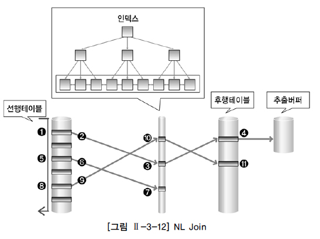
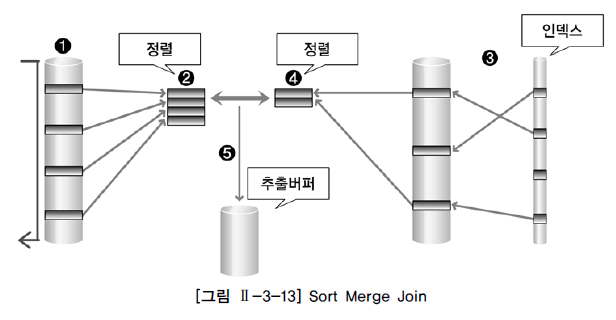
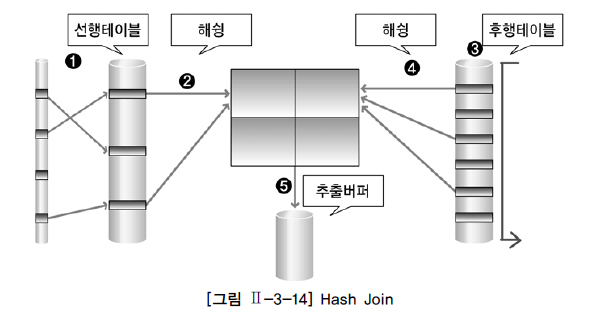

# 조인 수행 원리

조인이란 두 개 이상의 테이블을 하나의 집합으로 만드는 연산이다. SQL문에서 FROM 절에 두 개 이상의 테이블이 나열될 경우 조인이 수행된다. 조인 연산은 두 테이블 사이에서 수행된다. FROM 절에 A, B, C라는 세 개의 테이블이 존재하더라도 세 개의 테이블이 동시에 조인이 수행되는 것은 아니다. 세 개의 테이블 중에서 먼저 두 개의 테이블에 대해 조인이 수행된다. 그리고 먼저 수행된 조인 결과와 나머지 테이블 사이에서 조인이 수행된다. 이러한 작업은 FROM 절에 나열된 모든 테이블을 조인할 때까지 반복 수행한다. 예를 들어, A, B, C 세 개의 테이블을 조인할 때를 가정으로 설명하면 다음과 같다. 먼저 A와 B 두 테이블을 먼저 조인하면 해당 조인 결과와 나머지 C 테이블을 조인한다(A → B → C). 만약, A와 C 테이블을 먼저 조인한다면 해당 조인 결과와 나머지 B 테이블을 조인한다(A → C → B). 테이블 또는 조인 결과를 이용하여 조인을 수행할 때 조인 단계별로 다른 조인 기법을 사용할 수 있다. 예를 들어, A와 B 테이블을 조인할 때는 NL Join 기법을 사용하고 해당 조인 결과와 C 테이블을 조인할 때는 Hash Join 기법을 사용할 수 있다. 조인 기법은 두 개의 테이블을 조인할 때 사용할 수 있는 방법이다. 여기서는 조인 기법 중에서 자주 사용되는 NL Join, Hash Join, Sort Merge Join에 대해서 조인 원리를 간단하게 설명한다.

## 1. NL Join

NL Join은 프로그래밍에서 사용하는 중첩된 반복문과 유사한 방식으로 조인을 수행한다. 반복문의 외부에 있는 테이블을 선행 테이블 또는 외부 테이블(Outer Table)이라고 하고, 반복문의 내부에 있는 테이블을 후행 테이블 또는 내부 테이블(Inner Table)이라고 한다.

FOR 선행 테이블 읽음 → 외부 테이블(Outer Table) FOR 후행 테이블 읽음 → 내부 테이블(Inner Table) (선행 테이블과 후행 테이블 조인)

먼저 선행 테이블의 조건을 만족하는 행을 추출하여 후행 테이블을 읽으면서 조인을 수행한다. 이 작업은 선행 테이블의 조건을 만족하는 모든 행의 수만큼 반복 수행한다. NL Join에서는 선행 테이블의 조건을 만족하는 행의 수가 많으면(처리 주관 범위가 넓으면), 그 만큼 후행 테이블의 조인 작업은 반복 수행된다. 따라서 결과 행의 수가 적은(처리 주관 범위가 좁은) 테이블을 조인 순서상 선행 테이블로 선택하는 것이 전체 일량을 줄일 수 있다. NL Join은 랜덤 방식으로 데이터를 액세스하기 때문에 처리 범위가 좁은 것이 유리하다.

NL Join의 작업 방법은 다음과 같다.

① 선행 테이블에서 주어진 조건을 만족하는 행을 찾음 ② 선행 테이블의 조인 키 값을 가지고 후행 테이블에서 조인 수행 ③ 선행 테이블의 조건을 만족하는 모든 행에 대해 1번 작업 반복 수행

[그림 Ⅱ-3-12]의 예를 이용하여 NL Join의 수행 방식을 알아보도록 하자. [그림 Ⅱ-3-12]에서 인덱스는 B-트리 인덱스의 리프 블록만을 그린 것임을 표현한 것이다.

① 선행 테이블에서 조건을 만족하는 첫 번째 행을 찾음 → 이때 선행 테이블에 주어진 조건을 만족하지 않는 경우 해당 데이터는 필터링 됨 ② 선행 테이블의 조인 키를 가지고 후행 테이블에 조인 키가 존재하는지 찾으러 감 → 조인 시도 ③ 후행 테이블의 인덱스에 선행 테이블의 조인 키가 존재하는지 확인 → 선행 테이블의 조인 값이 후행 테이블에 존재하지 않으면 선행 테이블 데이터는 필터링 됨 (더 이상 조인 작업을 진행할 필요 없음) ④ 인덱스에서 추출한 레코드 식별자를 이용하여 후행 테이블을 액세스 → 인덱스 스캔을 통한 테이블 액세스 후행 테이블에 주어진 조건까지 모두 만족하면 해당 행을 추출버퍼에 넣음 ⑤ ~ ⑪ 앞의 작업을 반복 수행함

추출버퍼는 SQL문의 실행결과를 보관하는 버퍼로서 일정 크기를 설정하여 추출버퍼에 결과가 모두 차거나 더 이상 결과가 없어서 추출버퍼를 채울 것이 없으면 결과를 사용자에게 반환한다. 추출버퍼는 운반단위, Array Size, Prefetch Size라고도 한다. [그림 Ⅱ-3-12]에서 만약 선행 테이블에 사용 가능한 인덱스가 존재한다면 인덱스를 통해 선행 테이블을 액세스할 수 있다. (여기서는 사용할 인덱스가 없음을 가정으로 설명한 것임) NL Join 기법은 조인이 성공하면 바로 조인 결과를 사용자에게 보여 줄 수 있다. 그래서 결과를 가능한 빨리 화면에 보여줘야 하는 온라인 프로그램에 적당한 조인 기법이다.

## 2. Sort Merge Join

Sort Merge Join은 조인 칼럼을 기준으로 데이터를 정렬하여 조인을 수행한다. NL Join은 주로 랜덤 액세스 방식으로 데이터를 읽는 반면 Sort Merge Join은 주로 스캔 방식으로 데이터를 읽는다. Sort Merge Join은 랜덤 액세스로 NL Join에서 부담이 되던 넓은 범위의 데이터를 처리할 때 이용되던 조인 기법이다. 그러나 Sort Merge Join은 정렬할 데이터가 많아 메모리에서 모든 정렬 작업을 수행하기 어려운 경우에는 임시 영역(디스크)을 사용하기 때문에 성능이 떨어질 수 있다. 일반적으로 대량의 조인 작업에서 정렬 작업을 필요로 하는 Sort Merge Join 보다는 CPU 작업 위주로 처리하는 Hash Join이 성능상 유리하다. 그러나 Sort Merge Join은 Hash Join과는 달리 동등 조인 뿐만 아니라 비동등 조인에 대해서도 조인 작업이 가능하다는 장점이 있다.

Sort Merge Join의 동작은 [그림 Ⅱ-3-13]과 같다.

① 선행 테이블에서 주어진 조건을 만족하는 행을 찾음 ② 선행 테이블의 조인 키를 기준으로 정렬 작업을 수행 ① ~ ②번 작업을 선행 테이블의 조건을 만족하는 모든 행에 대해 반복 수행 ③ 후행 테이블에서 주어진 조건을 만족하는 행을 찾음 ④ 후행 테이블의 조인 키를 기준으로 정렬 작업을 수행 ③ ~ ④번 작업을 후행 테이블의 조건을 만족하는 모든 행에 대해 반복 수행 ⑤ 정렬된 결과를 이용하여 조인을 수행하며 조인에 성공하면 추출버퍼에 넣음

Sort Merge Join은 조인 칼럼의 인덱스를 사용하지 않기 때문에 조인 칼럼의 인덱스가 존재하지 않을 경우에도 사용할 수 있는 조인 기법이다. Sort Merge Join에서 조인 작업을 위해 항상 정렬 작업이 발생하는 것은 아니다. 예를 들어, 조인할 테이블 중에서 이미 앞 단계의 작업을 수행하는 도중에 정렬 작업이 미리 수행되었다면 조인을 위한 정렬 작업은 발생하지 않을 수 있다.

## 3. Hash Join

Hash Join은 해슁 기법을 이용하여 조인을 수행한다. 조인을 수행할 테이블의 조인 칼럼을 기준으로 해쉬 함수를 수행하여 서로 동일한 해쉬 값을 갖는 것들 사이에서 실제 값이 같은지를 비교하면서 조인을 수행한다. Hash Join은 NL Join의 랜덤 액세스 문제점과 Sort Merge Join의 문제점인 정렬 작업의 부담을 해결 위한 대안으로 등장하였다.

Hash Join의 동작은 [그림 Ⅱ-3-14]와 같다.

① 선행 테이블에서 주어진 조건을 만족하는 행을 찾음 ② 선행 테이블의 조인 키를 기준으로 해쉬 함수를 적용하여 해쉬 테이블을 생성 → 조인 칼럼과 SELECT 절에서 필요로 하는 칼럼도 함께 저장됨 ① ~ ②번 작업을 선행 테이블의 조건을 만족하는 모든 행에 대해 반복 수행 ③ 후행 테이블에서 주어진 조건을 만족하는 행을 찾음 ④ 후행 테이블의 조인 키를 기준으로 해쉬 함수를 적용하여 해당 버킷을 찾음 → 조인 키를 이용해서 실제 조인될 데이터를 찾음 ⑤ 조인에 성공하면 추출버퍼에 넣음 ③ ~ ⑤번 작업을 후행 테이블의 조건을 만족하는 모든 행에 대해서 반복 수행

Hash Join은 조인 칼럼의 인덱스를 사용하지 않기 때문에 조인 칼럼의 인덱스가 존재하지 않을 경우에도 사용할 수 있는 조인 기법이다. Hash Join은 해쉬 함수를 이용하여 조인을 수행하기 때문에 '='로 수행하는 조인 즉, 동등 조인에서만 사용할 수 있다. 해쉬 함수를 적용한 값은 어떤 값으로 해슁될 지 알 수 없다. 해쉬 함수가 적용될 때 동일한 값은 항상 같은 값으로 해슁됨이 보장된다. 그러나 해쉬 함수를 적용할 때 보다 큰 값이 항상 큰 값으로 해슁되고 작은 값이 항상 작은 값으로 해슁된다는 보장은 없다. 그렇기 때문에 Hash Join은 동등 조인에서만 사용할 수 있다. [그림 Ⅱ-3-14]와 같이 Hash Join은 조인 작업을 수행하기 위해 해쉬 테이블을 메모리에 생성해야 한다. 생성된 해쉬 테이블의 크기가 메모리에 적재할 수 있는 크기보다 더 커지면 임시 영역(디스크)에 해쉬 테이블을 저장한다. 그러면 추가적인 작업이 필요해 진다. 그렇기 때문에 Hash Join을 할 때는 결과 행의 수가 적은 테이블을 선행 테이블로 사용하는 것이 좋다. 선행 테이블의 결과를 완전히 메모리에 저장할 수 있다면 임시 영역에 저장하는 작업이 발생하지 않기 때문이다. Hash Join에서는 선행 테이블을 이용하여 먼저 해쉬 테이블을 생성한다고 해서 선행 테이블을 Build Input이라고도 하며, 후행 테이블은 만들어진 해쉬 테이블에 대해 해쉬 값의 존재여부를 검사한다고 해서 Prove Input이라고도 한다.