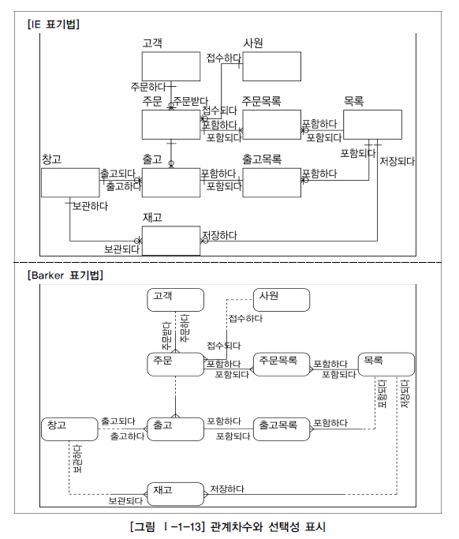

# 데이터 모델의 이해

## 1. 모델링

### 가. 모델링의 정의

 

### 나. 모델링의 특징

1. **추상화(모형화, 가설적)**는 현실세계를 일정한 형식에 맞추어 표현을 한다는 의미로 정리할 수 있다. 

2. **단순화**는 복잡한 현실세계를 약속된 규약에 의해 제한된 표기법이나 언어로 표현하여 쉽게 이해할 수 있도록 하는 개념을 의미한다. 

3. **명확화**는 누구나 이해하기 쉽게 하기 위해 대상에 대한 애매모호함을 제거하고 정확(正確)하게 현상을 기술하는 것을 의미한다.

## 2. 데이터 모델링

### 가. 데이터 모델링의 필요성

1. 업무정보를 구성하는 기초가 되는 정보들에 대해 일정한 표기법에 의해 표현한다.

2. 분석된 모델을 가지고 실제 데이터베이스를 생성하여 개발 및 데이터관리에 사용하기 위한 것이다. 

3. 데이터 모델링 자체로서 업무를 설명하고 분석하는 부분에도 매우 중요한 의미를 가지고 있다.

### 나. 데이터 모델링의 유의점

1. **중복(Duplication)** 

   데이터 모델은 같은 데이터를 사용하는 사람, 시간, 그리고 장소를 파악하는데 도움을 준다. 이러한 지식 응용은 데이터베이스가 여러 장소에 같은 정보를 저장하는 잘못을 하지 않도록 한다.

2. **비유연성(Inflexibility)** 

   데이터 모델을 어떻게 설계했느냐에 따라 사소한 업무변화에도 데이터 모델이 수시로 변경됨으로써 유지보수의 어려움을 가중시킬 수 있다. 데이터의 정의를 데이터의 사용 프로세스와 분리함으로써 데이터 모델링은 데이터 혹은 프로세스의 작은 변화가 애플리케이션과 데이터베이스에 중대한 변화를 일으킬 수 있는 가능성을 줄인다.

3. **비일관성(Inconsistency)** 

   데이터의 중복이 없더라도 비일관성은 발생한다. 예를 들어 신용 상태에 대한 갱신 없이 고객의 납부 이력 정보를 갱신하는 것이다. 개발자가 다른 데이터와 모순된다는 고려 없이 일련의 데이터를 수정할 수 있기 때문이다. 데이터 모델링을 할 때 데이터와 데이터간 상호 연관 관계에 대한 명확한 정의는 이러한 위험을 사전에 예방할 수 있도록 해준다.

### 다. 데이터 모델링의 3단계 진행

### 라. 데이터독립성

ANSI/SPARC의 3단계 구성의 데이터독립성 모델은 외부단계와 개념적 단계, 내부적 단계로 구성된 서로 간섭되지 않는 모델을 제시하고 있다.

## 3. ERD

### 가. 데이터 모델 표기법

데이터 모델에 대한 표기법으로 1976년 피터첸(Peter Chen)이 Entity-relationship model(E-R Model)이라는 표기법을 만들었다. 엔터티를 사각형으로 표현하고 관계를 마름모 속성을 타원형으로 표현하는 이 표기법은 데이터 모델링에 대한 이론을 배울 때 많이 활용되고 있다. 데이터베이스 설계에 대해 우리나라 대학에서는 주로 이 Chen의 모델 표기법을 통해 배우고 있다. [표 Ⅰ-1-6]은 엔터티와 속성 그리고 관계에 대한 다양한 표기법을 설명한 것이다

### 나. ERD모델링

1. 일반적으로 ERD를 작성하는 방법은 엔터티 도출 → 엔터티 배치 → 관계 설정 → 관계명 기술의 흐름으로 작업을 진행한다.

2. 일반적으로 사람의 눈은 왼쪽에서 오른쪽, 위 쪽에서 아래쪽으로 이동하는 경향이 있다. 따라서 데이터 모델링에서도 가장 중요한 엔터티를 왼쪽상단에 배치하고 이것을 중심으로 다른 엔터티를 나열하면서 전개하면 사람의 눈이 따라가기에 편리한 데이터 모델링을 전개할 수 있다. 

3. ERD 관계석서를 보고 서로 관련있는 엔터티간에 관계를 설정하도록 한다.

4) ERD 관계명의 표시 관계설정이 완료되면 연결된 관계에 관계이름을 부여하도록 한다. 관계이름은 현재형을 사용하고 지나치게 포괄적인 용어(예, 이다, 가진다 등)는 사용하지 않도록 한다.

5) ERD 관계 관계차수와 선택성 표시

- IE 표기법

