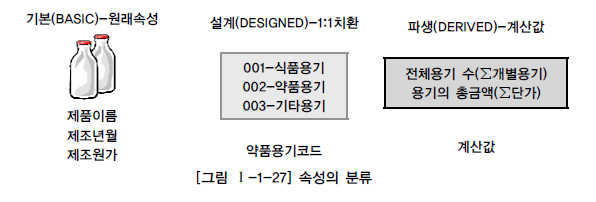
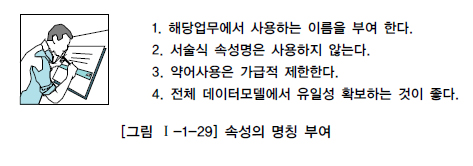

# 속성

## 1. 속성

업무에서 필요로 하는 인스턴스로 관리하고자 하는 의미상 더 이상 분리되지 않는 최소의 데이터 단위

## 2. 엔터티, 인스턴스, 속성, 속성값의 관계

- 한 개의 엔터티는 두 개 이상의 인스턴스의 집합이어야 한다.
- 한 개의 엔터티는 두 개 이상의 속성을 갖는다.
- 한 개의 속성은 한 개의 속성값을 갖는다.

## 3. 속성의 분류

1. 기본속성
   기본 속성은 업무로부터 추출한 모든 속성이 여기에 해당하며 엔터티에 가장 일반적이고 많은 속성을 차지한다. 

2. 설계속성
   설계속성은 업무상 필요한 데이터 이외에 데이터 모델링을 위해, 업무를 규칙화하기 위해 속성을 새로 만들거나 변형하여 정의하는 속성이다. 

3. 파생속성
   파생속성은 다른 속성에 영향을 받아 발생하는 속성으로서 보통 계산된 값들이 이에 해당된다. 

## 4. 도메인(Domain)

엔터티 내에서 속성에 대한 데이터타입과 크기 그리고 제약사항을 지정하는 것이라 할 수 있다.

## 5. 속성의 명명(Naming)

