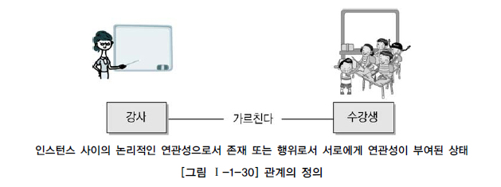
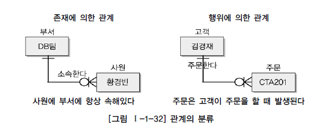

# 관계

## 1. 관계

## 2. 관계의 분류

관계가 **존재에 의한 관계**와 **행위에 의한 관계**로 구분될 수 있는 것은 관계를 연결함에 있어 어떤 목적으로 연결되었느냐에 따라 분류하기 때문이다.

- ERD에서는 존재적 관계와 행위에 의한 관계를 구분하지 않고 표현한다.
- UML(Unified Modeling Language)에는 클래스다이어그램의 관계중 연관관계(Association)와 의존관계(Dependency)가 있다. 
-  클래스다이어그램에서는 연관관계와 의존관계를 점선/실선으로 구분하여 표현한다. 

## 3. 관계의 표기법

관계에서는 표기법이 상당히 복잡하고 여러 가지 의미를 가지고 있다. 다음 3가지 개념과 함께 표기법을 이해할 필요가 있다.

- 관계명(Membership) : 관계의 이름
- 관계차수(Cardinality) : 1:1, 1:M, M:N
- 관계선택사양(Optionality) : 필수관계, 선택관계

## 4. 관계의 정의

두 개의 엔터티 사이에서 관계를 정의할 때 다음 사항을 체크해 보도록 한다.

- 두 개의 엔터티 사이에 관심있는 연관규칙이 존재하는가?
- 두 개의 엔터티 사이에 정보의 조합이 발생되는가?
- 업무기술서, 장표에 관계연결에 대한 규칙이 서술되어 있는가?
- 업무기술서, 장표에 관계연결을 가능하게 하는 동사(Verb)가 있는가?

