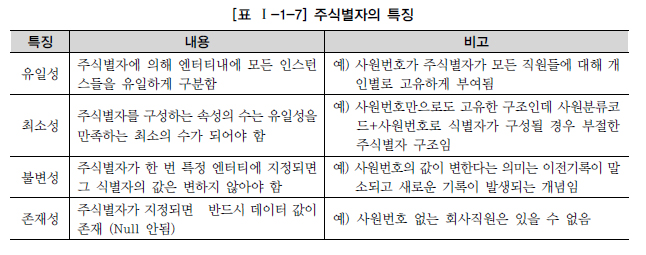
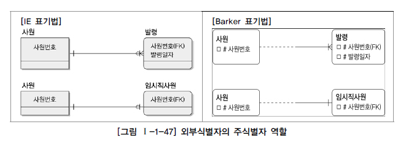
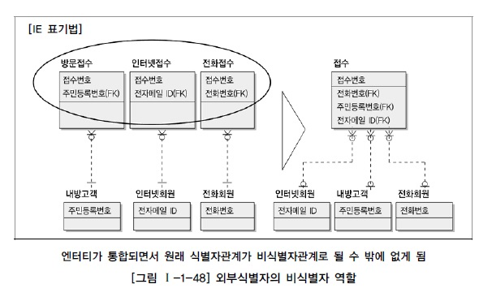
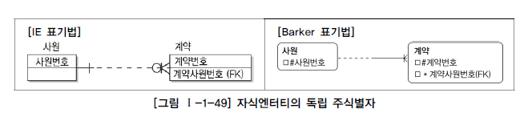
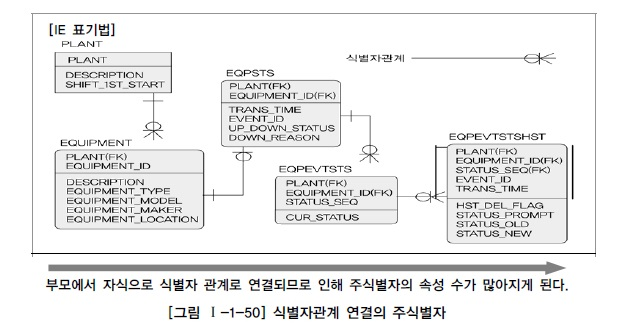
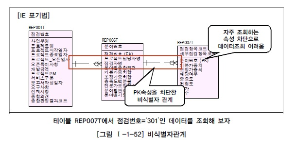
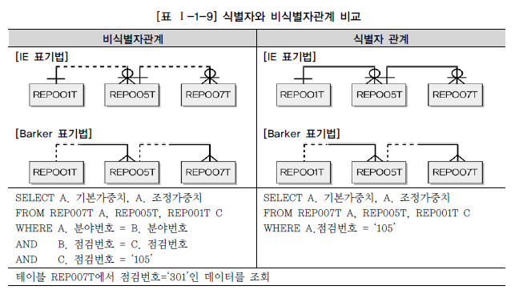
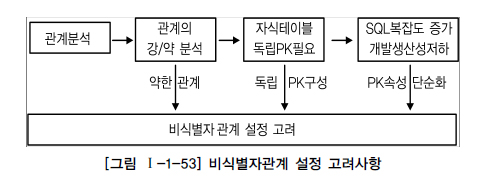

# 식별자

## 1. 식별자(Identifiers)

## 2. 식별자의 특징

## 3. 식별자 분류

## 4. 주식별자 도출기준

데이터 모델링 작업에서 중요한 작업 중의 하나가 주식별자 도출작업이다. 주식별자를 도출하기 위한 기준을 정리하면 다음과 같다.

- 해당 업무에서 자주 이용되는 속성을 주식별자로 지정한다.
- 명칭, 내역 등과 같이 이름으로 기술되는 것들은 가능하면 주식별자로 지정하지 않는다.
- 복합으로 주식별자로 구성할 경우 너무 많은 속성이 포함되지 않도록 한다.

## 5. 식별자관계와 비식별자관계

### 가. 식별자관계

부모로부터 받은 식별자를 자식엔터티의 주식별자로 이용하는 경우는 Null값이 오면 안되므로 반드시 부모엔터티가 생성되어야 자기 자신의 엔터티가 생성되는 경우이다. 부모로부터 받은 속성을 자식엔터티가 모두 사용하고 그것만으로 주식별자로 사용한다면 부모엔터티와 자식엔터티의 관계는 1:1의 관계가 될 것이고 만약 부모로부터 받은 속성을 포함하여 다른 부모엔터티에서 받은 속성을 포함하거나 스스로 가지고 있는 속성과 함께 주식별자로 구성되는 경우는 1:M 관계가 된다.

### 나. 비식별자관계

부모엔터티로부터 속성을 받았지만 자식엔터티의 주식별자로 사용하지 않고 일반적인 속성으로만 사용하는 경우가 있다. 이과 같은 경우를 비식별자 관계(Non-Identifying Relationship)라고 하며 다음의 네 가지 경우에 비식별자 관계에 의한 외부속성을 생성한다.

1. 자식엔터티에서 받은 속성이 반드시 필수가 아니어도 무방하기 때문에 부모 없는 자식이 생성될 수 있는 경우이다.
2. 엔터티별로 데이터의 생명주기(Life Cycle)를 다르게 관리할 경우이다. 예를 들어 부모엔터티에 인스턴스가 자식의 엔터티와 관계를 가지고 있었지만 자식만 남겨두고 먼저 소멸될 수 있는 경우가 이에 해당된다. 이에 대한 방안으로 물리데이터베이스 생성 시 Foreign Key를 연결하지 않는 임시적인 방법을 사용하기도 하지만 데이터 모델상에서 관계를 비식별자관계로 조정하는 것이 가장 좋은 방법이다.
3.  여러 개의 엔터티가 하나의 엔터티로 통합되어 표현되었는데 각각의 엔터티가 별도의 관계를 가질 때이며 이에 해당된다.

4. 자식엔터티에 주식별자로 사용하여도 되지만 자식엔터티에서 별도의 주식별자를 생성하는 것이 더 유리하다고 판단될 때 비식별자 관계에 의한 외부식별자로 표현한다.

### 다. 식별자 관계로만 설정할 경우의 문제점

식별자 관계만으로 연결된 데이터 모델의 특징은 주식별자 속성이 지속적으로 증가할 수 밖에 없는 구조로서 개발자 복잡성과 오류가능성을 유발시킬 수 있는 요인이 될 수 있다는 사실을 기억해야 한다.

### 라. 비식별자 관계로만 설정할 경우의 문제점

[그림 Ⅰ-1-52]의 예에서는 REP001T, REP005T, REP007T 간의 관계가 비식별자 관계로 연결되면서 점검번호, 분야번호 속성이 관계를 타고 자식엔터티로 내려가는 것을 차단하였다. 이러한 모델에서는 만약 위 모델에 있는 맨 하위에 있는 REP007T 엔터티에서 어떤 점검에 대한 정보를 보려고 하면 불필요한 조인이 다량으로 유발되면서 SQL구문도 길어지고 성능이 저하되는 현상이 발생이 된다.

### 마. 식별자관계와 비식별자관계 모델링

1. 비식별자관계 선택 프로세스

2. 식별자와 비식별자관계 비교

.

