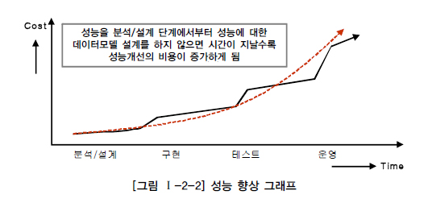

# 성능 데이터 모델링의 개요

## 1. 성능 데이터 모델링

## 2. 성능 데이터 모델링 수행시점

성능 향상을 위한 비용은 프로젝트 수행 중에 있어서 사전에 할수록 비용이 들지 않는다. 특히 분석/설계 단계에서 데이터 모델에 성능을 고려한 데이터 모델링을 수행할 경우 성능저하에 따른 재업무(Rework) 비용을 최소화 할 수 있는 기회를 가지게 된다. 분석/설계단계에서 데이터 모델은 대충하고, 성능이 저하되는 SQL문장을 튜닝하고, 부족한 하드웨어 용량(CPU, Memory 등)을 증설하는 등의 작업은 추가적인 비용을 소진하게 하는 원인이 된다. 특히 데이터의 증가가 빠를수록 성능저하에 따른 성능개선비용은 기하급수적으로 증가하게 된다.

## 3. 성능 데이터 모델링 고려사항

일반적으로 성능 데이터 모델은 다음과 같은 프로세스로 진행하는 것이 데이터 모델링 단계에서 성능을 충분히 고려할 수 있는 방안이 된다.

1. 데이터 모델링을 할 때 정규화를 정확하게 수행한다.
2.  데이터베이스 용량산정을 수행한다.
3.  데이터베이스에 발생되는 트랜잭션의 유형을 파악한다.
4.  용량과 트랜잭션의 유형에 따라 반정규화를 수행한다.
5.  이력모델의 조정, PK/FK조정, 슈퍼타입/서브타입 조정 등을 수행한다.
6.  성능관점에서 데이터 모델을 검증한다.

