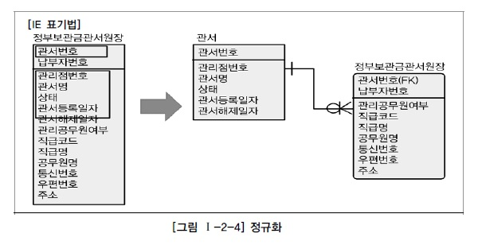
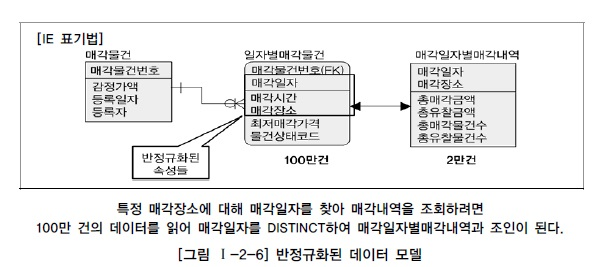
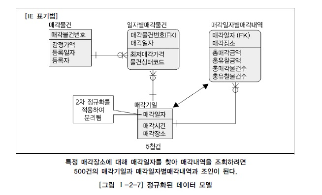
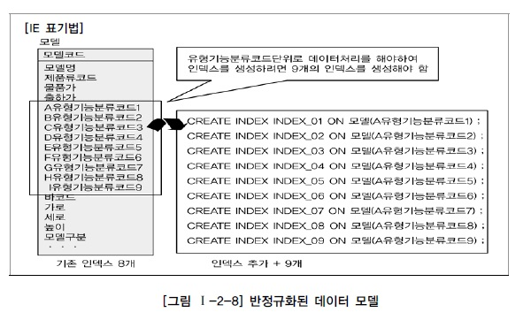
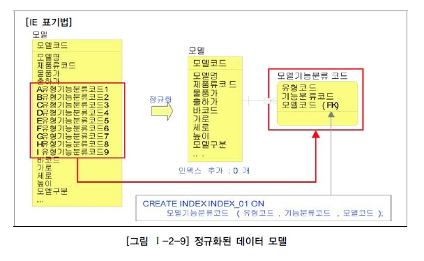
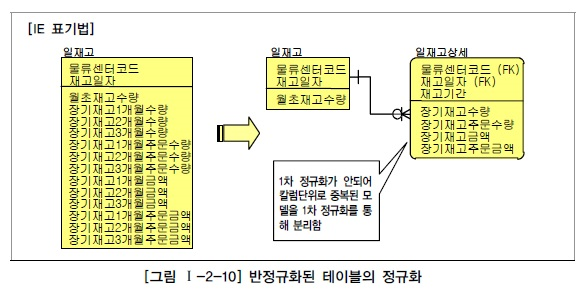

# 정규화와 성능

## 1. 정규화를 통한 성능 향상 전략

일반적으로 정규화가 잘 되어 있으면 입력/수정/삭제의 성능이 향상되고 반정규화를 많이 하면 조회의 성능이 향상된다고 인식될 수 있다. 그러나 데이터 모델링을 할 때 반정규화만이 조회 성능을 향상시킨다는 고정관념은 탈피되어야 한다. 정규화를 해서 성능이 저하되기는커녕 정규화를 해야만 성능이 향상되는 경우가 아주 많이 나타나기 때문이다.

## 2. 반정규화된 테이블의 성능저하 사례1

- 2차 정규화 필요

## 3. 반정규화된 테이블의 성능저하 사례2

- 2차 정규화 필요

## 4. 반정규화된 테이블의 성능저하 사례3

- 1차 정규화 필요

## 5. 반정규화된 테이블의 성능저하 사례4

- 1차 정규화 필요

