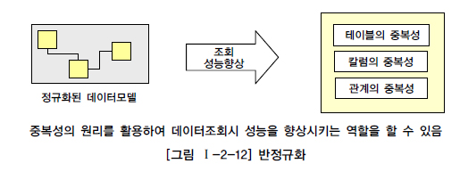
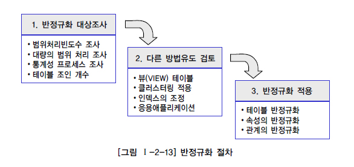
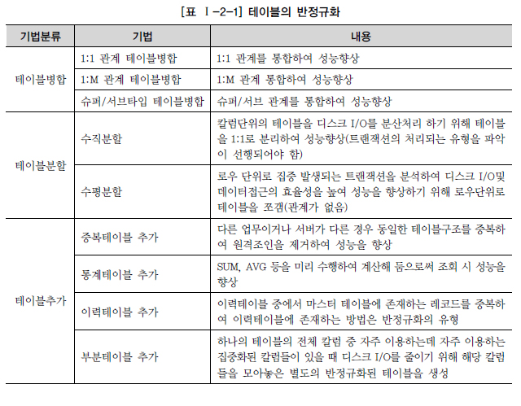
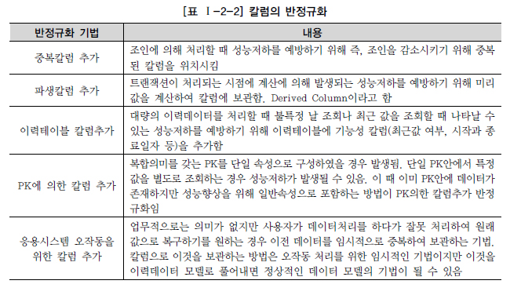
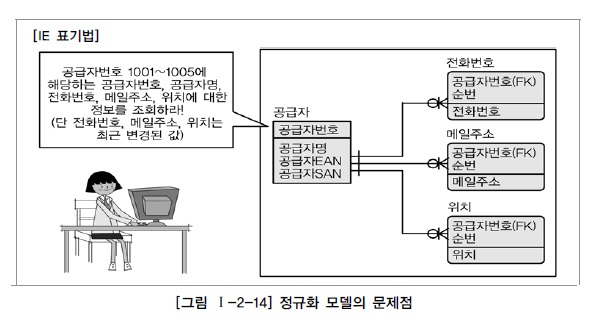
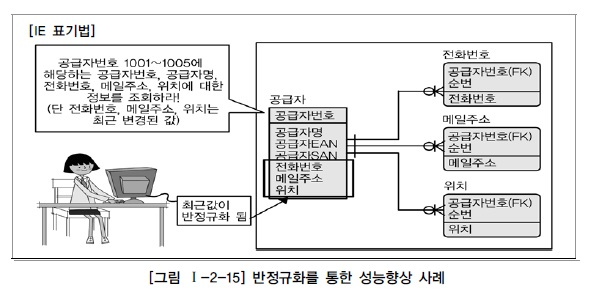

# 반정규화와 성능

## 1. 반정규화를 통한 성능향상 전략

### 가. 반정규화

### 나. 반정규화의 적용방법

## 2. 반정규화의 기법

넓은 의미에서 반정규화를 고려할 때 성능을 향상시키기 위한 반정규화는 여러 가지가 나타날 수 있다.

### 가. 테이블 반정규화

### 나. 칼럼 반정규화

## 3. 정규화가 잘 정의된 데이터 모델에서 성능이 저하될 수 있는 경우

