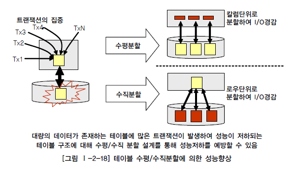
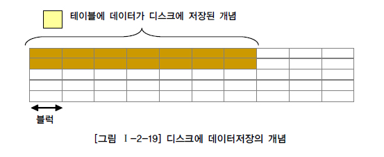

# 대량 데이터에 따른 성능

## 1. 대량 데이터발생에 따른 테이블 분할 개요

프로젝트를 수행할 때 때로는 하나의 테이블에 300개 이상의 칼럼을 가지고 있는 경우가 있다. 컴퓨터 화면 하나에는 볼 수가 없어서 스크롤을 하면서 하나의 테이블에 있는 칼럼을 구경해야 할 정도이다. 이렇게 많은 칼럼은 로우체이닝과 로우마이그레이션이 많아지게 되어 성능이 저하된다.
로우 길이가 너무 길어서 데이터 블록 하나에 데이터가 모두 저장되지 않고 두 개 이상의 블록에 걸쳐 하나의 로우가 저장되어 있는 형태가 **로우체이닝(Row Chaining) 현상**이다. 또한 **로우마이그레이션(Row Migration)**은 데이터 블록에서 수정이 발생하면 수정된 데이터를 해당 데이터 블록에서 저장하지 못하고 다른 블록의 빈 공간을 찾아 저장하는 방식이다. 로우체이닝과 로우마이그레이션이 발생하여 많은 블록에 데이터가 저장되면 데이터베이스 메모리에서 디스크와 I/O(입력/출력)가 발생할 때 불필요하게 I/O가 많이 발생하여 성능이 저하된다.

## 2. 한 테이블에 많은 수의 칼럼을 가지고 있는 경우

많은 칼럼을 가지고 있는 테이블에 대해서는 트랜잭션이 발생될 때 어떤 칼럼에 대해 집중적으로 발생하는지 분석하고 적절하게 1:1 관계 테이블을 분리함으로써 성능향상이 가능하도록 해야 한다.

## 3. 파티셔닝

데이터량이 몇 천만건을 넘어서면 아무리 서버사양이 훌륭하고 인덱스를 잘 생성해준다고 하더라고 SQL문장의 성능이 나오지 않는다. 이 때는 논리적으로는 하나의 테이블로 보이지만 물리적으로 여러 개의 테이블스페이스에 쪼개어 저장될 수 있는 구조의 **파티셔닝**을 적용하도록 한다.

