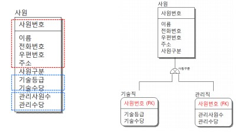
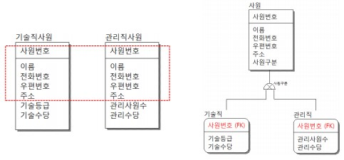
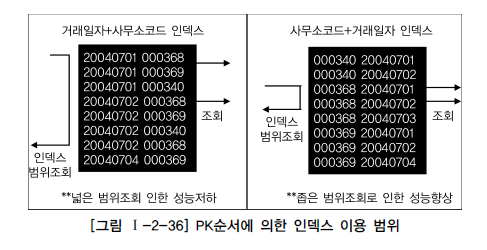
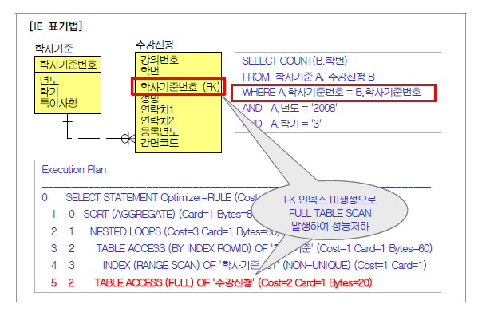
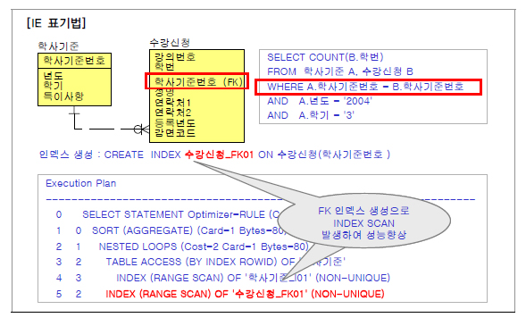

# 데이터베이스 구조와 성능

## 1. 슈퍼타입/서브타입 모델의 성능고려 방법

### 가. 슈퍼/서브타입 데이터 모델

#### 슈퍼-서브타입 도출되는 과정 1

#### 슈퍼-서브타입 도출되는 과정 2

### 나. 슈퍼/서브타입 데이터 모델의 변환

슈퍼/서브타입에 대한 변환을 잘못하면 성능이 저하되는 이유는 트랜잭션 특성을 고려하지 않고 테이블이 설계되었기 때문이다. 이것을 3가지 경우의 수로 정리하면 설명하면 다음과 같다. 

1. 트랜잭션은 항상 일괄로 처리하는데 테이블은 개별로 유지되어 Union연산에 의해 성능이 저하될 수 있다. 

2. 트랜잭션은 항상 서브타입 개별로 처리하는데 테이블은 하나로 통합되어 있어 불필요하게 많은 양의 데이터가 집약되어 있어 성능이 저하되는 경우가 있다. 

3. 트랜잭션은 항상 슈퍼+서브 타입을 공통으로 처리하는데 개별로 유지되어 있거나 하나의 테이블로 집약되어 있어 성능이 저하되는 경우가 있다.

## 2. 인덱스 특성을 고려한 PK/FK 데이터베이스 성능향상

### 가. PK/FK 칼럼 순서와 성능개요

### 나. PK칼럼의 순서를 조정하지 않으면 성능이 저하 이유

## 3. 물리적인 테이블에 FK제약이 걸려있지 않을 경우 인덱스 미생성으로 성능저하

.

비록 물리적으로 학사기준과 수강신청이 연결되어 있지 않다고 하더라도 학사기준으로부터 상속받은 FK에 대해 FK인덱스를 생성함으로써 SQL문장이 조인이 발생할 때 성능저하를 예방할 수 있다.
FK인덱스를 적절하게 설계하여 구축하지 않았을 경우 개발초기에는 데이터량이 얼마 되지 않아 성능저하가 나타나지 않다가 시스템을 오픈하고 데이터량이 누적될수록 SQL성능이 나빠짐으로 인해 데이터베이스서버에 심각한 장애현상을 초래하는 경우가 많이 있다.
그러므로 물리적인 테이블에 FK 제약 걸었을 때는 반드시 FK인덱스를 생성하도록 하고 FK제약이 걸리지 않았을 경우에는 FK인덱스를 생성하는 것을 기본정책으로 하되 발생되는 트랜잭션에 의해 거의 활용되지 않았을 때에만 FK 인덱스를 지우는 방법으로 하는 것이 적절한 방법이 된다.

