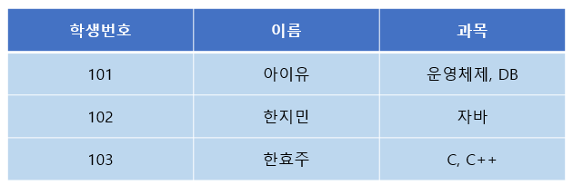
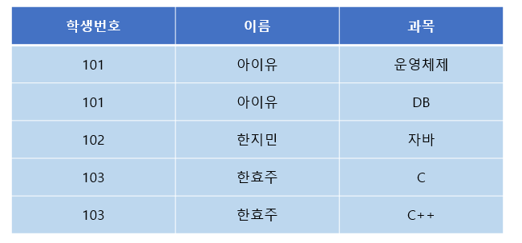
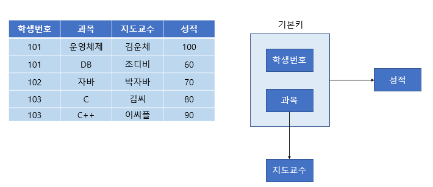
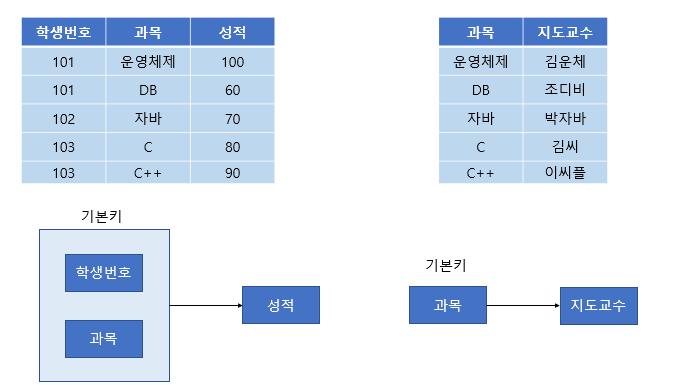
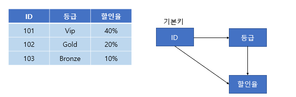
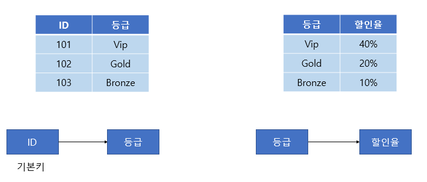
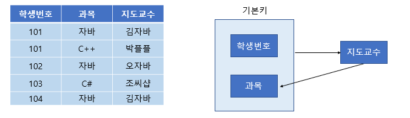
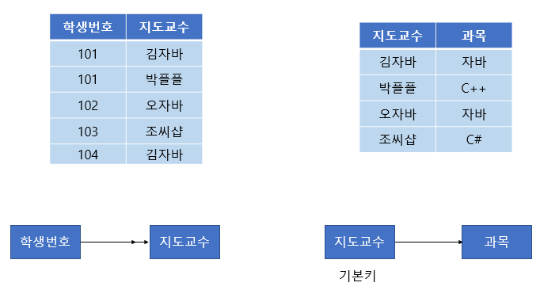
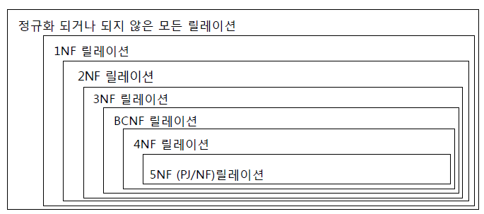

# 정규화

## 제1 정규형 (1NF)

제1 정규형은 다음과 같은 규칙들을 만족해야 한다.

> 1. 각 컬럼이 하나의 속성만을 가져야 한다.
> 2. 하나의 컬럼은 같은 종류나 타입(type)의 값을 가져야 한다.
> 3. 각 컬럼이 유일한(unique) 이름을 가져야 한다.
> 4. 칼럼의 순서가 상관없어야 한다.

 

조금 복잡해보이지만, 간단하게 예시를 들면 이해가 빠르다. 아래 테이블을 살펴보자.

1번 규칙을 불만족하므로 이를 고치기 위해서는 아래와 같이 분해하면 된다.

## 제2 정규형 (2NF)

> 1. 1정규형을 만족해야 한다.
> 2. 모든 컬럼이 부분적 종속(Partial Dependency)이 없어야 한다. == 모든 칼럼이 완전 함수 종속을 만족해야 한다.

부분적 종속이란 기본키 중에 특정 컬럼에만 종속되는 것이다. 

완전 함수 종속이란 기본키의 부분집합이 결정자가 되어선 안된다는 것이다. ( 비슷한 말이다 )

위와 같은 테이블과 FD 다이어그램을 보자.

성적의 특정 값을 알기 위해서는 학생 번호+과목이 있어야 한다. (ex : 102번의 자바 성적 70 )

하지만 특정 과목의 지도교수는 과목명만 알면 지도교수가 누군지 알 수 있다. (ex : 자바의 지도교수 박자바)

 

위 테이블에서 기본키는 (학생 번호, 과목)으로 복합키이다. 

그런데 이때 지도교수 칼럼은 (학생 번호, 과목)에 종속되지 않고 (과목) 에만 종속되는 부분적 종속이다. 

 

따라서 제2 정규화를 만족하지 않으므로 아래와 같이 분해해야 한다

## 제3 정규형 (3NF)

> 1. 2 정규형을 만족해야 한다.
> 2. 기본키를 제외한 속성들 간의 이행 종속성 (Transitive Dependency)이 없어야 한다.

이행 종속성이란 A->B, B->C 일 때 A->C 가 성립하면 이행 종속이라고 한다. 

위와 같은 테이블을 보자. ID를 알면 등급을 알 수 있다. 등급을 알면 할인율을 알 수 있다. 따라서 ID를 알면 할인율을 알 수 있다. 따라서 이행 종속성이 존재하므로 제 3 정규형을 만족하지 않는다.

 

3정규형을 만족하기 위해서는 아래와 같이 분해해야 한다.

## BCNF (Boyce-Codd Normal Form)

BCNF는 제 3정규형을 좀 더 강화한 버전으로 다음과 같은 규칙을 만족해야 한다.

> 1. 3정규형을 만족해야 한다.
> 2.  모든 결정자가 후보키 집합에 속해야 한다.

모든 결정자가 후보키 집합에 속해야 한다는 뜻은, 후보키 집합에 없는 칼럼이 결정자가 되어서는 안 된다는 뜻이다.

위와 같은 테이블을 보자. (학생 번호, 과목)이 기본키로 지도교수를 알 수 있다. 하지만 같은 과목을 다른 교수가 가르칠 수도 있어서 과목-> 지도교수 종속은 성립하지 않는다. 하지만 지도교수가 어떤 과목을 가르치는지는 알 수 있으므로 지도교수-> 과목 종속이 성립한다.

 

이처럼 후보키 집합이 아닌 칼럼이 결정자가 되어버린 상황을 BCNF를 만족하지 않는다고 한다. 

(참고로 위 테이블은 제3 정규형까지는 만족하는 테이블이다 )

 

BCNF를 만족하기 위해서는 아래와 같이 분해하면 된다.

## 제4 정규형 이상~

보통 정규화는 BCNF 까지만 하는 경우가 많다. 그 이상 정규화를 하면 정규화의 단점이 나타날 수도 있다.