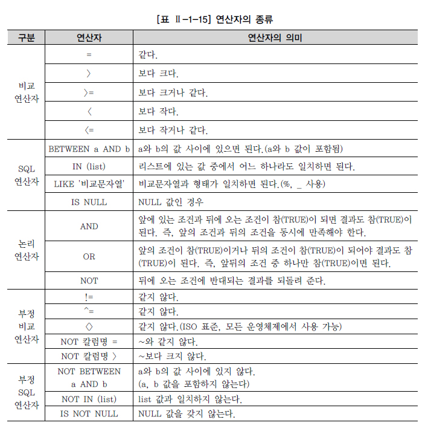
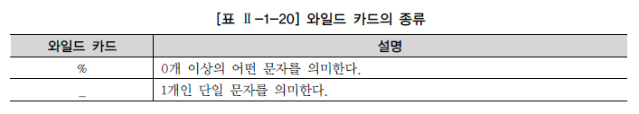

# WHERE 절


## 1. WHERE 조건절

자료를 검색할 때 SELECT 절과 FROM 절만을 사용하여 기본적인 SQL 문장을 구성한다면, 테이블에 있는 모든 자료들이 결과로 출력되어 실제로 원하는 자료를 확인하기 어려울 수 있다. 사용자들은 자신이 원하는 자료만을 검색하기 위해서 SQL 문장에 WHERE 절을 이용하여 자료들에 대하여 제한할 수 있다. 

```sql
SELECT [DISTINCT/ALL] 칼럼명[ALIAS명] FROM 테이블명 WHERE 조건식;
```


## 2. 연산자의 종류




- LIKE 연산자



[예제] “장”씨 성을 가진 선수들의 정보를 조회하는 WHERE 절을 작성한다.

```sql
SELECT PLAYER_NAME 선수이름, POSITION 포지션, BACK_NO 백넘버, HEIGHT 키 
FROM PLAYER WHERE PLAYER_NAME LIKE '장%';
```


- NULL 연산
  - NULL 값과의 수치연산은 NULL 값을 리턴한다. 
  - NULL 값과의 비교연산은 거짓(FALSE)을 리턴한다. 
  - NULL은 어떤 값과 비교할 수도 없으며, 특정 값보다 크다, 적다라고 표현할 수 없다.


## 3. ROWNUM, TOP 사용

- ROWNUM

Oracle의 ROWNUM은 칼럼과 비슷한 성격의 Pseudo Column으로써 SQL 처리 결과 집합의 각 행에 대해 임시로 부여되는 일련번호이며, 테이블이나 집합에서 원하는 만큼의 행만 가져오고 싶을 때 WHERE 절에서 행의 개수를 제한하는 목적으로 사용한다.

```sql
1건의 행을 들고 오고 싶을때
SELECT PLAYER_NAME FROM PLAYER WHERE ROWNUM = 1;
```


추가적인 ROWNUM의 용도로는 테이블 내의 고유한 키나 인덱스 값을 만들 수 있다. 

```sql
UPDATE MY_TABLE SET COLUMN1 = ROWNUM;
```


- TOP 절

SQL Server는 TOP 절을 사용하여 결과 집합으로 출력되는 행의 수를 제한할 수 있다. TOP 절의 표현식은 다음과 같다.

```sql
한 건의 행을 가지고 올때
SELECT TOP(1) PLAYER_NAME FROM PLAYER;
```

SQL 문장에서 ORDER BY 절이 사용되지 않으면 Oracle의 ROWNUM과 SQL Server의 TOP 절은 같은 기능을 하지만, ORDER BY 절이 같이 사용되면 기능의 차이가 발생한다. 이 부분은 1장 8절 ORDER BY 절에서 설명하도록 한다.