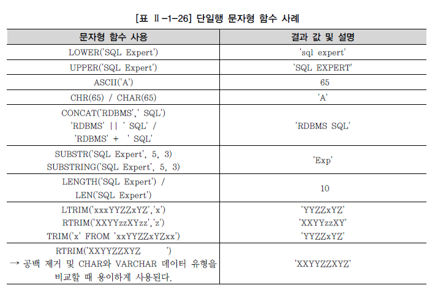
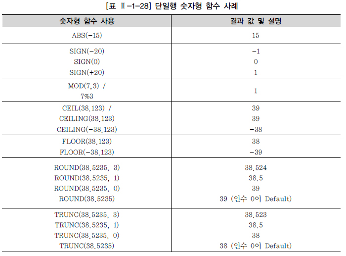

# 함수


## 1. 내장 함수(BUILT-IN FUNCTION) 

내장 함수는 함수의 입력되는 행의 수에 따라 다음에 같이 분류

- 단일 행 값이 입력되는 **단일행 함수(Single-Row Function)** 
- 여러 행의 값이 입력되는 **다중행 함수(Multi-Row Function)**
  - 다중행 함수는 집계 함수(Aggregate Function), 그룹 함수(Group Function), 윈도우 함수(Window Function)로 나눌 수 있다. 


함수는 입력되는 값이 아무리 많아도 출력은 하나만 된다는 M:1 관계라는 중요한 특징을 가지고 있다. 단일행 함수의 경우 단일행 내에 있는 하나의 값 또는 여러 값이 입력 인수로 표현될 수 있다. 다중행 함수의 경우도 여러 레코드의 값들을 입력 인수로 사용하는 것이다.


단일행 함수의 중요한 특징은 다음과 같다.

- SELECT, WHERE, ORDER BY, UPDATE의 SET 절에 사용 가능하다. 
- 각 행(Row)들에 대해 개별적으로 작용하여 데이터 값들을 조작하고, 각각의 행에 대한 조작 결과를 리턴한다. 
- 여러 인자(Argument)를 입력해도 단 하나의 결과만 리턴한다. 
- 함수의 인자(Arguments)로 상수, 변수, 표현식이 사용 가능하고, 하나의 인수를 가지는 경우도 있지만 여러 개의 인수를 가질 수도 있다. 
- 특별한 경우가 아니면 함수의 인자(Arguments)로 함수를 사용하는 함수의 중첩이 가능하다.


## 2. 문자형 함수





```sql
SELECT LENGTH('SQL Expert') FROM DUAL;
10
```

Oracle은 SELECT 절과 FROM 절 두 개의 절을 SELECT 문장의 필수 절로 지정하였으므로 사용자 테이블이 필요 없는 SQL 문장의 경우에도 필수적으로 DUAL이라는 테이블을 FROM 절에 지정한다. DUAL 테이블의 특성은 다음과 같다.

- 사용자 SYS가 소유하며 모든 사용자가 액세스 가능한 테이블이다. 

- SELECT ~ FROM ~ 의 형식을 갖추기 위한 일종의 DUMMY 테이블이다. 
- DUMMY라는 문자열 유형의 칼럼에 'X'라는 값이 들어 있는 행을 1건 포함하고 있다.

반면 Sybase나 SQL Server의 경우에는 SELECT 절만으로도 SQL 문장이 수행 가능하도록 정의하였기 때문에 DUAL이란 DUMMY 테이블이 필요 없다. 


## 3. 숫자형 함수





## 4. 날짜형 함수


날짜는 여러 가지 형식으로 출력이 되고 날짜 계산에도 사용되기 때문에 그 편리성을 위해서 숫자형으로 저장하는 것이다. 즉, 날짜에 숫자 상수를 더하거나 뺄 수 있다.


## 5. 변환형 함수

변환형 함수는 특정 데이터 타입을 다양한 형식으로 출력하고 싶을 경우에 사용되는 함수이다. 변환형 함수는 크게 두 가지 방식이 있다.

암시적 데이터 유형 변환의 경우 성능 저하가 발생할 수 있으며, 자동적으로 데이터베이스가 알아서 계산하지 않는 경우가 있어 에러를 발생할 수 있으므로 명시적인 데이터 유형 변환 방법을 사용하는 것이 바람직하다.

명시적 데이터 유형 변환에 사용되는 대표적인 변환형 함수는 다음과 같다.


## 6. CASE 표현

CASE 표현은 IF-THEN-ELSE 논리와 유사한 방식으로 표현식을 작성해서 SQL의 비교 연산 기능을 보완하는 역할을 한다.

CASE 표현을 하기 위해서는 조건절을 표현하는 두 가지 방법이 있고, Oracle의 경우 DECODE 함수를 사용할 수도 있다.


CASE Expressions은 Simple Case Expression과 Searched Case Expression 두 가지 표현법 중에 하나를 선택해서 사용하게 된다.


Simple Case Expression은 = 조건만 사용한다면 추천하는 방법이다. Oracle의 DECODE 함수와 기능면에서 동일하다.

```sql
[예제] 부서 정보에서 부서 위치를 미국의 동부, 중부, 서부로 구분하라.

SELECT LOC, CASE LOC WHEN 'NEW YORK' THEN 'EAST' 
					 WHEN 'BOSTON' THEN 'EAST' 
					 WHEN 'CHICAGO' THEN 'CENTER' 
					 WHEN 'DALLAS' THEN 'CENTER' 
					 ELSE 'ETC'
             END as AREA 
FROM DEPT;
```


SEARCHED_CASE_EXPRESSION은 CASE 다음에는 칼럼이나 표현식을 표시하지 않고, 다음 WHEN 절에서 EQUI(=) 조건 포함 여러 조건(>, >=, <, <=)을 이용한 조건절을 사용할 수 있기 때문에 SIMPLE_CASE_EXPRESSION보다 훨씬 다양한 조건을 적용할 수 있는 장점이 있다.

```sql
[예제] 사원 정보에서 급여가 3000 이상이면 상등급으로, 1000 이상이면 중등급으로, 1000 미만이면 하등급으로 분류하라.

SELECT ENAME, CASE WHEN SAL >= 3000 THEN 'HIGH' 
				   WHEN SAL >= 1000 THEN 'MID'
				   ELSE 'LOW'
			   END AS SALARY_GRADE FROM EMP;
```


## 7. NULL 관련 함수


### 가. NVL/ISNULL 함수


Oracle의 경우 NVL 함수를 사용한다.

```sql
NVL (NULL 판단 대상,‘NULL일 때 대체값’)

SELECT NVL(NULL, 'NVL-OK') NVL_TEST FROM DUAL;
```


### 나. NULL과 공집합

SELECT 1 FROM DUAL WHERE 1 = 2; 와 같은 조건이 대표적인 공집합을 발생시키는 쿼리이며, 위와 같이 조건에 맞는 데이터가 한 건도 없는 경우를 공집합이라고 하고, NULL 데이터와는 또 다르게 이해해야 한다.


STEP1. 공집합을 발생시키기 위해 사원 테이블에 존재하지 않는 'JSC'라는 이름으로 데이터를 검색한다.

```sql
SELECT MGR FROM EMP WHERE ENAME='JSC'
데이터를 찾을 수 없다. 
☞ EMP 테이블에 ENAME이‘JSC’란 사람은 없으므로 공집합이 발생한다.
```


STEP2. NVL/ISNULL 함수를 이용해 공집합을 9999로 바꾸고자 시도한다.

```sql
SELECT NVL(MGR, 9999) MGR FROM EMP WHERE ENAME='JSC'; 데이터를 찾을 수 없다. 
☞ 많은 분들이 공집합을 NVL/ISNULL 함수를 이용해서 처리하려고 하는데, 인수의 값이 공집합인 경우는 NVL/ISNULL 함수를 사용해도 역시 공집합이 출력된다. 
☞ NVL/ISNULL 함수는 NULL 값을 대상으로 다른 값으로 바꾸는 함수이지 공집합을 대상으로 하지 않는다.
```


### 다. NULLIF

NULLIF 함수는 EXPR1이 EXPR2와 같으면 NULL을, 같지 않으면 EXPR1을 리턴한다. 특정 값을 NULL로 대체하는 경우에 유용하게 사용할 수 있다.

```sql
NULLIF (EXPR1, EXPR2)

[예제] 사원 테이블에서 MGR와 7698이 같으면 NULL을 표시하고, 같지 않으면 MGR를 표시한다.

SELECT ENAME, EMPNO, MGR, NULLIF(MGR,7698) NUIF FROM EMP;
```


### 라. COALESCE

COALESCE 함수는 인수의 숫자가 한정되어 있지 않으며, 임의의 개수 EXPR에서 NULL이 아닌 최초의 EXPR을 나타낸다. 만일 모든 EXPR이 NULL이라면 NULL을 리턴한다.

```sql
COALESCE (EXPR1, EXPR2, …)

[예제] 사원 테이블에서 커미션을 1차 선택값으로, 급여를 2차 선택값으로 선택하되 두 칼럼 모두 NULL인 경우는 NULL로 표시한다.

SELECT ENAME, COMM, SAL, COALESCE(COMM, SAL) COAL FROM EMP;
```

```sql
COALESCE 함수는 두개의 중첩된 CASE 문장으로 표현할 수 있다.

SELECT ENAME, COMM, SAL, CASE WHEN COMM IS NOT NULL THEN COMM ELSE (CASE WHEN SAL IS NOT NULL THEN SAL ELSE NULL END) END COAL 
FROM EMP;
```

