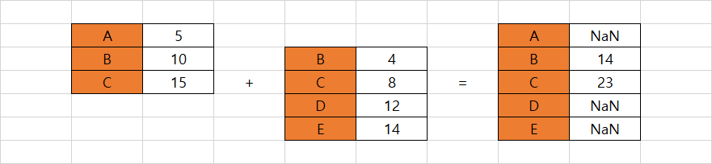

# Chapter 01. Series 객체


* Series는 참조점이 있는 1차원 배열

* Series와 리스트 비교

|  /   |                Series                |                리스트                |
| :--: | :----------------------------------: | :----------------------------------: |
| 특징 | 동일한 유형의 데이터만 담을 수 있다. | 다양한 유형의 데이터를 담을 수 있다. |
| 예시 |           [1, 2, 3, 4, 5]            |      [1, 2.0,  [3, 4], 'five']       |


## 01. Series


### 1.1 클래스 및 인스턴스

```python
import pandas as pd
import numpy as np

pd.Series()
```

```
Series([], dtype: float64)
```


### 1.2 data 매개변수

* data 매개변수는 기본 파이썬 자료구조 및 다른 라이브러리의 객체를 포함하여 다양한 입력을 허용한다
  * 딕셔너리, 튜플, 넘파이 등 입력 가능
  * 세트는 순서가 없는 고유한 값의 모음이라서 입력 불가능

```python
ice_cream_flavors = [
    'Chcolate',
    'VAnilla',
    'Strawberry',
    'Rum Raisin',
]
```

```python
# 다음 두 줄을 결과가 동일합니다
pd.Series(ice_cream_flavors)
pd.Series(data = ice_cream_flavors)
```

```
0      Chcolate
1       VAnilla
2    Strawberry
3    Rum Raisin
dtype: object
```


### 1.3 index 매개변수

* 인덱스에 레이블을 전달하지 않으면 기본적으로 숫자 인덱스를 사용한다
* 인덱스 레이블은 문자열, 튜플, 날짜와 시간 등 불변 데이터 유형이라면 어떤 것으로도 지정 가능하다

* 인덱스 레이블을 할당할 경우, Series는 위치와 인덱스 레이블을 모두 할당한다
* 레이블과 Series의 길이가 동일해야 한다
* 파이썬의 딕셔너리와 다르게 Series의 인덱스는 중복을 허용한다

```python
ice_cream_flavors = [
    'Chcolate',
    'VAnilla',
    'Strawberry',
    'Rum Raisin',
]

days_of_week = ('Monday', 'Wednesday', 'Friday', 'Wednesday')
```

```python
# 다음 두 줄을 결과가 동일합니다
pd.Series(ice_cream_flavors, days_of_week)
pd.Series(data = ice_cream_flavors, index = days_of_week)
```

```
Monday         Chcolate
Wednesday       VAnilla
Friday       Strawberry
Wednesday    Rum Raisin
dtype: object
```


### 1.4 dtype 매개변수


#### 1. dtype

* dtype은 Series 값의 데이터 유형을 보여준다
* 문자열이나 복잡한 객체(예를 들어 중첩된 자료구조)의 경우 dtype:object를 표시한다

```
Monday         Chcolate
Wednesday       VAnilla
Friday       Strawberry
Wednesday    Rum Raisin
dtype: object
```


#### 2. dtype 매개변수

* dtype 매개변수를 사용하면 강제로 다른 유형으로 변환할 수 있다

```python
lucky_numbers = [4,8,15,16,23,42]
pd.Series(lucky_numbers, dtype = 'float')
```

```
0     4.0
1     8.0
2    15.0
3    16.0
4    23.0
5    42.0
dtype: float64
```


### 1.5 nan

* 판다스는 파일을 가져오다가 결측값을 발견하면 넘파이의 nan 객체로 결측값을 대체한다. nan은 숫자가 아니라는 의미의 'not a number'의 약어이며 정의되지 않은 값을 나타내는 포괄적인 용어이다
* 판다스는 nan 값을 발견하면 숫자 값을 정수에서 부동소수점으로 자동 변환한다

```python
temperatures = [94, 88, np.nan, 91]
pd.Series(data = temperatures)
```

```
0    94.0
1    88.0
2     NaN
3    91.0
dtype: float64
```


## 02. Series의 속성


### (예시)

```python
# diet
Cereal              125
Chocolate Bar       406
Ice Cream Sundae    342
dtype: int64
```


```python
diet.values
```

```
array([125, 406, 342], dtype=int64)
```


### (정리)

|     속성     |                       설명                        |
| :----------: | :-----------------------------------------------: |
|    index     |                   인덱스를 반환                   |
|    values    |                     값을 반환                     |
|    dtype     |                데이터 유형을 반환                 |
|     size     |                 값의 개수를 반환                  |
|    shape     |                차원을 튜플로 반환                 |
|  is_unique   |     모든 Series 값이 고유한 경우, True를 반환     |
| is_monotonic | 각 Seies 값이 자신의 이전 값보다 크면 True를 반환 |


## 03. 수학 연산


### 3.1 통계연산


### (예시)

```python
# numbers

0    1.0
1    2.0
2    3.0
3    NaN
4    4.0
5    5.0
dtype: float64
```


```python
numbers.count()
```

```
5
```


### (정리1)

|   메서드   |             설명             |
| :--------: | :--------------------------: |
|  count()   | null이 아닌 값의 개수를 반환 |
|   mean()   |             평균             |
|   std()    |           표준편차           |
|  median()  |            중앙값            |
|   min()    |     가장 작은 값을 반환      |
|   max()    |      가장 큰 값을 반환       |
| describe() |      통계값을 요약 반환      |


### (정리 2)

|    메서드    |                       설명                       |
| :----------: | :----------------------------------------------: |
|    sum()     |             Series의 값을 모두 더함              |
|  product()   |             Series의 값을 모두 곱함              |
|   cumsum()   |           Series의 값을 누적 합을 반환           |
| pct_change() | 한 Series 값에서 다음 값 까지의 변동 비율을 반환 |

|  매개변수   |              입력              |               설명                | 적용 가능 메서드    |
| :---------: | :----------------------------: | :-------------------------------: | ------------------- |
|   skipna    |             False              |       결측값을 강제로 포함        | sum(), product() 등 |
|  min_count  |               3                | 계산을 하기 위한 최소 개수를 설정 | sum(), product() 등 |
| fill_method | 'pad'(정방향), 'bfill'(역방향) |   결측값에 대해서 정방향 채우기   | pct_change()        |


### (정리 3)

|  메서드   |           설명            |
| :-------: | :-----------------------: |
| unique()  |     고유한 값을 반환      |
| nunique() |  고유한 값의 개수를 반환  |
| sample()  | 임의의 값을 선택해서 반환 |


### 3.2 산술연산

* 대부분의 수학적 메서드는 기본적으로 결측값을 무시한다
* 시리즈는 다음과 같은 산술 연산이 가능하다
  * 더하기(+), 빼기(-), 곱하기(*), 나누기(/), 몫(//), 나머지(%)

```python
# s1

A     5.0
B     NaN
C    15.0
dtype: float64
```


```python
s1 + 3
```

```
A     8.0
B     NaN
C    18.0
dtype: float64
```


### 3.3 브로드캐스팅

* 브로드 캐스팅은 배열과 하나의 숫자와의 조합으로 이루어진 산술 연산을 수행하는 기능이다. 숫자 하나와 배열의 원소별 계산이 각각 한 번씩 수행된다
  * 브로드캐스팅은 산술 연산이 가능한 이유이다
* Series와 Series 사이에 브로드 캐스팅은 공유 인덱스를 기반으로 이루어진다
  * 연산 중 필요한 경우 nan을 넣는다
  * NaN 값을 사용하는 모든 산술 연산은 항상 NaN이 된다

```python
s1 = pd.Series(data = [5, 10, 15], index = ['A', 'B', 'C'])

s2 = pd.Series(data = [4, 8, 12, 14], index = ['B', 'C', 'D', 'E'])
```


```python
s1 + s2
```

```
A     NaN
B    14.0
C    23.0
D     NaN
E     NaN
dtype: float64
```

