# Chapter 01. 판다스

## 01. 경쟁 제품과 비교

### 1.1 판다스와 엑셀 비교

|      |                            판다스                            |                         엑셀                          |
| :--: | :----------------------------------------------------------: | :---------------------------------------------------: |
| 특징 | 대규모 데이터를 처리하는데 엑셀보다 뛰어난 성능 엑셀보다는 복잡하지만 유연성이 뛰어남 | 100만행의 데이터 제한  판다스보다 낮은 진입 장벽 |

### 1.2 판다스와 경쟁 도구 비교

|      |                 파이썬                  |         R          |
| :--: | :-------------------------------------: | :----------------: |
| 특징 | 여러 기술 영역을 사용하는 범용적인 언어 | 통계에 특화된 언어 |

|  제품  |                             특징                             |
| :----: | :----------------------------------------------------------: |
| 판다스 |   오픈소스를 기반으로 유연성이 뛰어남, 데이터 분석에 중점    |
|  SAS   |           유료  판다스와는 다른 용도로 사용됨           |
|  SQL   | 관계형 데이터스와 통신하는 언어 데이터 생성 및 관리를 중점 |

## 02. 판다스 간단히 둘러보기

### 2.1 데이터셋 가져오기

* 데이터셋 가져오기
* Rank(순위), Title(제목), Studio(제작사), Gross(총 수익), Year(개봉연도)

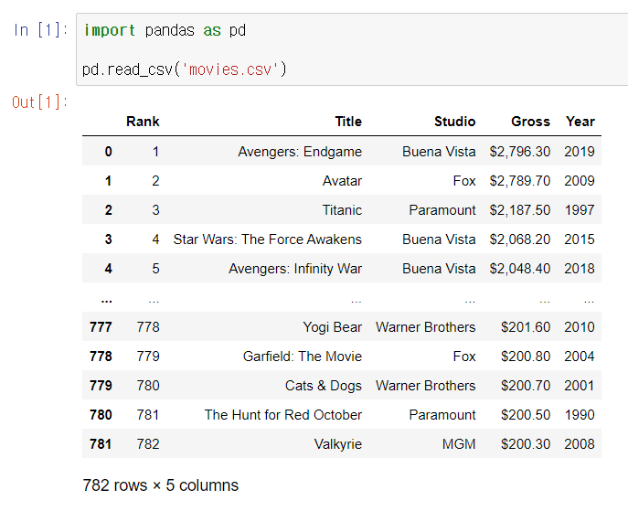

+ Title을 인덱스로 가져오기

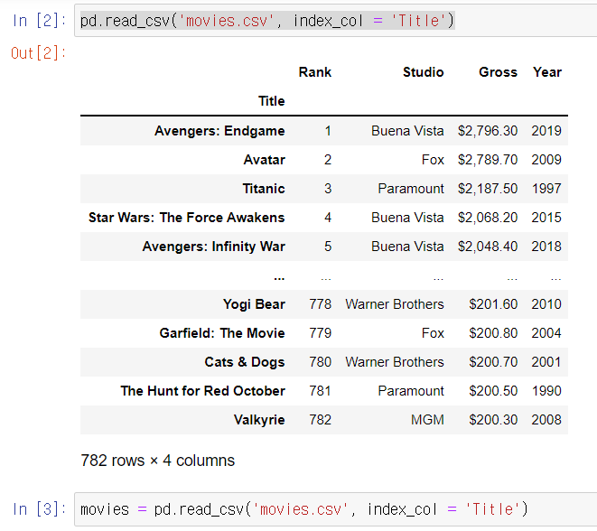

### 2.2 DataFrame 조작

* head()는 첫 행부터 n행까지 추출
* tail()은 n행부터 마지막행까지 추출

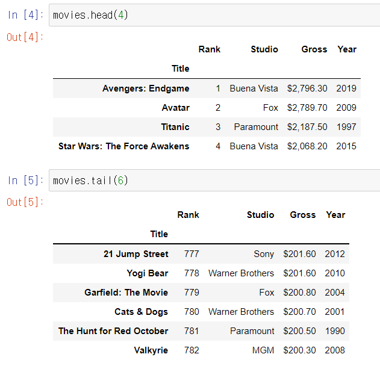

* len()는 몇개의 행이 있는지 확인
* shape는 행과 열 수 확인
* size는 총 셸의 수 확인
* dtypes는 열의 데이터 유형 확인

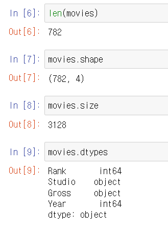

* iloc[]는 인덱스 위치(숫자)로 행을 추출
* loc[]는 인덱스 레이블로 행을 추출
* 각 행에 대한 식별자가 있는 Series 객체로 반환

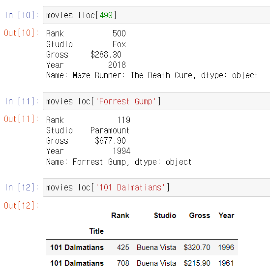

* 가장 최근에 개봉한 영화 다섯편을 보고싶다면?
* Studio 열의 값을 기준으로 영화를 정렬한 다음 Year 열의 값을 기준으로 정렬
* 영화 제목을 알파벳 순으로 보고싶다면? 인덱스를 기준으로 정렬

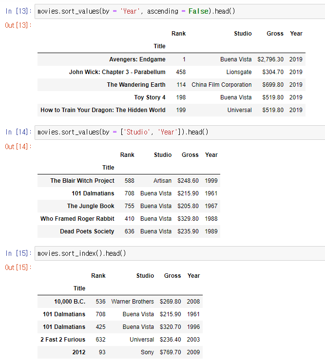

### 2.3 Series의 값 계산

* 가장 많은 영화 제작사를 찾으려면?

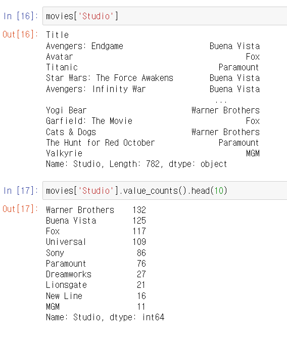

### 2.4 하나 이상의 기준으로 열 필터링

* 유니버셜 스튜디오에서 제작한 영화만 보고 싶다면?

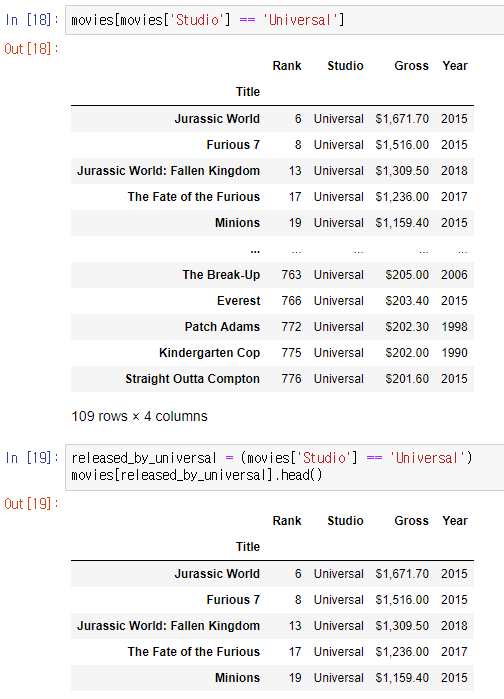

* 유니버셜에서 제작하고 또는 2015년에 개봉한 영화

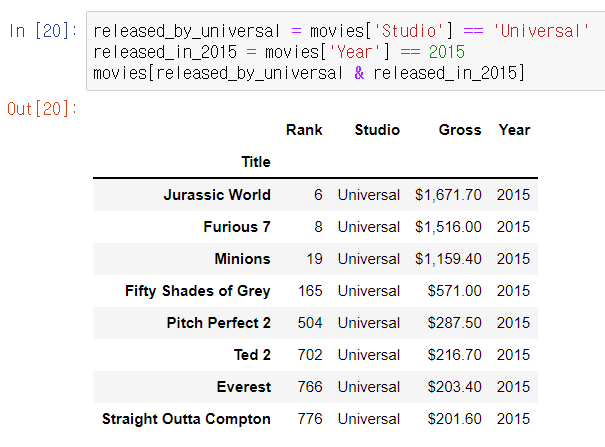

* 유니버셜에서 제작하고 또는 2015년에 개봉한 영화

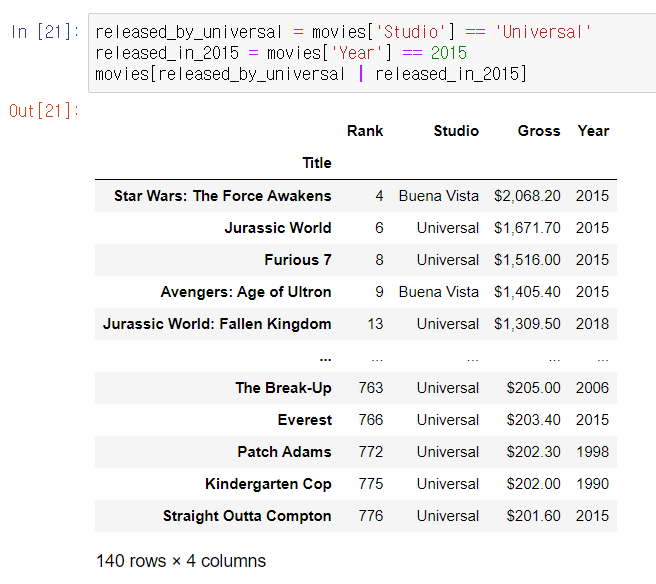

* 1975년 이전에 개봉한 영화

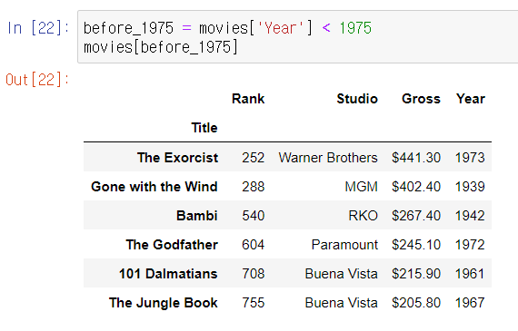

* 1983~1986 사이에 개봉한 영화

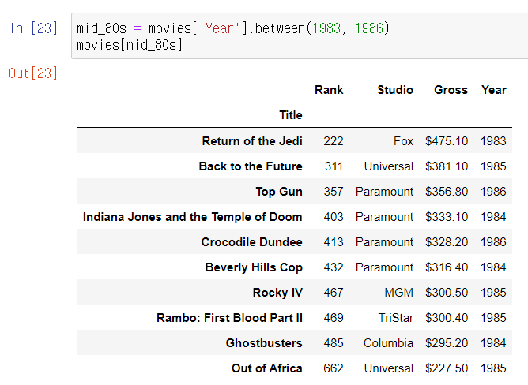

* 제목에 'dark'라는 단어가 있는 모든 영화

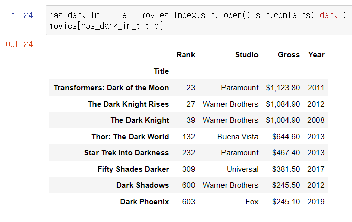

### 2.5 데이터 그룹화

* 어떤 제작사가 총 수익이 가장 높은지 알아보자

* Gross 열의 값이 텍스트로 저장되있기에 우선 $, , 기호를 제거 후 float형으로 변환

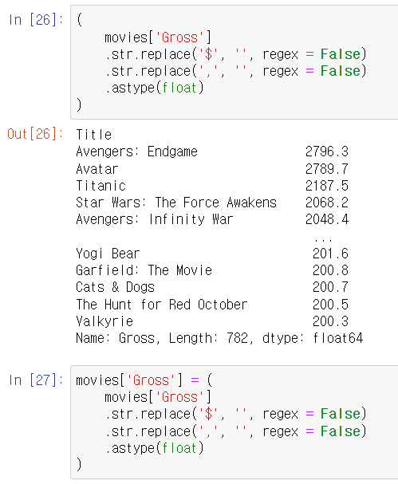

* 영화의 평균 흥행 수익

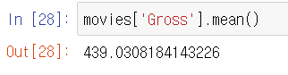

* 제작사를 식별하고 각 제작사에 속한 영화를 버킷으로 지정
* Studio 열의 값을 기반으로 DataFrame의 행을 그룹화
* 제작사 당 영화 수
* 제작사의 영화수 별로 정렬

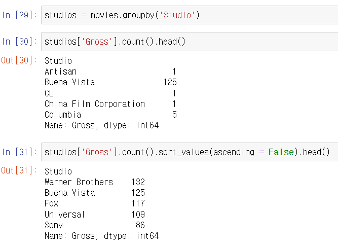

* 제작사별 Gross 열의 값을 추가합니다. 판다스는 각 제작사에 속한 영화의 하위 집합을 식별하고 각 하위 집합의 Gross 값을 가져와 합산
* 수익이 가장 높은 제작사

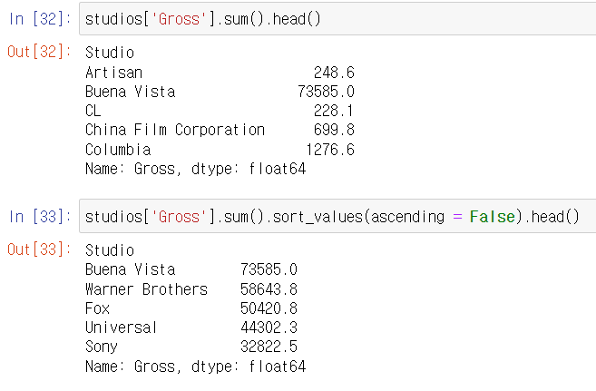