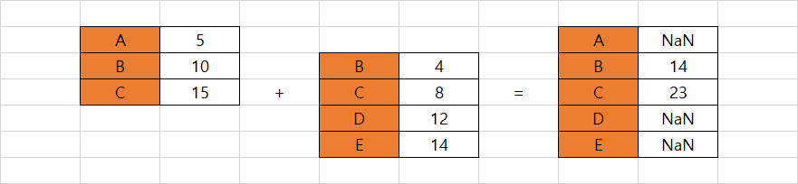

# Chapter 02. Series 객체


* Series는 레이블이 있는 1차원 배열
* Series와 리스트 비교

|  /   |                Series                |                리스트                |
| :--: | :----------------------------------: | :----------------------------------: |
| 특징 | 동일한 유형의 데이터만 담을 수 있다. | 다양한 유형의 데이터를 담을 수 있다. |
| 예시 |           [1, 2, 3, 4, 5]            |      [1, 2.0,  [3, 4], 'five']       |


* Series는 값에 접근할 때 하나의 참조점(레이블 또는 위치)를 사용하기 때문에 1차원 배열이다
* Series는 리스트와 같이 일렬로 놓인 순서에 따라 값을 저장합니다.  또한 딕셔너리와 같이 각 값에 키/레이블을 할당합니다. Series는 파이썬의 기본 자료구조가 가진 장점을 갖추고 있습니다.


## 01. Series의 개요


```python
import pandas as pd
import numpy as np
```


### 1.1 클래스 및 인스턴스

```python
pd.Series()

# Series([], dtype: float64)
```


### 1.2 Series 값 채우기


* Series 생성자는 data, index, dtype, name, copy, fastpath의 6가지 매개변수를 정의합니다.
* 자세한 설명은 pd.Series()를 입력하고 괄호 안에 `Shift` + `Tab` 을 눌러 설명서 모달을 참고

```python
ice_cream_flavors = [
    'Chcolate',
    'VAnilla',
    'Strawberry',
    'Rum Raisin',
]

# 다음 두 줄을 결과가 동일합니다
pd.Series(ice_cream_flavors)
pd.Series(data = ice_cream_flavors)
```

```
0      Chcolate
1       VAnilla
2    Strawberry
3    Rum Raisin
dtype: object
```


### 1.3 Series 인덱스 사용자 정의

* 인덱스에 따로 레이블을 전달하지 않으면 기본적으로 숫자 인덱스를 사용합니다
* 인덱스 레이블은 문자열, 튜플, 날짜와 시간 등 불변 데이터 유형이라면 어떤 것으로도 지정 가능

* 인덱스 레이블을 할당할 경우, Series는 위치와 인덱스 레이블을 모두 할당합니다
* 레이블과 같은 길이가 동일해야 합니다.
* 파이썬의 딕셔너리와 다르게 Series의 인덱스는 중복을 허용합니다.
* 중복 인덱스가 가능하지만 고유 인덱스를 사용하면 속도가 더 빠르므로 중복을 피하는 것이 좋습니다.

```python
ice_cream_flavors = [
    'Chcolate',
    'VAnilla',
    'Strawberry',
    'Rum Raisin',
]

days_of_week = ('Monday', 'Wednesday', 'Friday', 'Wednesday')

# 다음 두 줄을 결과가 동일합니다
pd.Series(ice_cream_flavors, days_of_week)
pd.Series(data = ice_cream_flavors, index = days_of_week)
```

```
Monday         Chcolate
Wednesday       VAnilla
Friday       Strawberry
Wednesday    Rum Raisin
dtype: object
```


* dtype문은 Series 값의 데이터 유형을 보여줍니다.
* 문자열이나 복잡한 객체(예를 들어 중첩된 자료구조)의 경우 dtype:object를 표시합니다.

```python
bunch_of_bools = [True, False, False]
pd.Series(bunch_of_bools)

# 0     True
# 1    False
# 2    False
# dtype: bool

stock_prices = [985.32, 950.44]
time_of_day = ['Open', 'Close']
pd.Series(data = stock_prices, index = time_of_day)

# 0     4
# 1     8
# 2    15
# 3    16
# 4    23
# 5    42
# dtype: int64
```


* 생성자의 dtype 매개변수를 사용하면 강제로 다른 유형으로 변활할 수 있다.

```python
lucky_numbers = [4,8,15,16,23,42]
pd.Series(lucky_numbers, dtype = 'float')
```

```
0     4.0
1     8.0
2    15.0
3    16.0
4    23.0
5    42.0
dtype: float64
```


### 1.4 결측값이 있는 Series 생성

* 판다스는 파일을 가져오다가 결측값을 발견하면 넘파이의 nan 객체로 결측값을 대체합니다. nan은 숫자가 아니라는 의미의 'not a number'의 약어이며 정의되지 않은 값을 나타내는 포괄적인 용어입니다. 즉, nan은 null 또는 부재를 나타내는 플레이스홀더(placeholder)객체입니다

```python
temperatures = [94, 88, np.nan, 91]
pd.Series(data = temperatures)
```

```
0    94.0
1    88.0
2     NaN
3    91.0
dtype: float64
```

* 판다스는 nan 값을 발견하면 숫자 값을 정수에서 부동소수점으로 자동 변환합니다


## 02. 파이썬 객체에서 Series 생성

* Series 생성자의 data 매개변수는 기본 파이썬 자료구조 및 다른 라이브러리의 객체를 포함하여 다양한 입력을 허용합니다


* 딕셔너리

```python
calorie_info = {
    'Cereal': 125,
    'Chocolate Bar': 406,
    'Ice Cream Sundae': 342
}

diet = pd.Series(calorie_info)
diet
```

```
Cereal              125
Chocolate Bar       406
Ice Cream Sundae    342
dtype: int64
```


* 튜플

```python
pd.Series(data = ('Red', 'Green', 'Blue'))
```

```
0      Red
1    Green
2     Blue
dtype: object
```

```python
# 튜플을 저장하는 Series를 생성하려면 튜플을 리스트로 감싸야 한다
rgb_colors = [(120,41,26), (196,165,45)]
pd.Series(data = rgb_colors)
```

```
0     (120, 41, 26)
1    (196, 165, 45)
dtype: object
```


* 세트
* 세트(집합)은 순서가 없는 고유한 값의 모음인데, 리스트와 같은 순서 개념이나 딕셔너리와 같은 연관개념이 없어서 판다스는 집합의 값을 저장하는 순서를 가정할 수 없다. 따라서 다음과 같은 결과를 출력한다.

```python
my_set = {'Ricky', 'Bobby'}
pd.Series(my_set)

# TypeError: 'set' type is unordered
```

```python
# 세트를 Series에 전달하기 위해 자료구조를 변경해야 합니다.
pd.Series(list(my_set))
```

```
0    Bobby
1    Ricky
dtype: object
```


* 넘파이 ndarray 객체

```python
random_data = np.random.randint(1,101,10)
random_data

# array([49,  5, 20, 96, 79, 30, 13, 12, 74,  1])

pd.Series(random_data)

# 0    49
# 1     5
# 2    20
# 3    96
# 4    79
# 5    30
# 6    13
# 7    12
# 8    74
# 9     1
# dtype: int32
```


## 03. Series의 속성


```python
calorie_info = {
    'Cereal': 125,
    'Chocolate Bar': 406,
    'Ice Cream Sundae': 342
}

diet = pd.Series(calorie_info)
diet
```

```
Cereal              125
Chocolate Bar       406
Ice Cream Sundae    342
dtype: int64
```


* values 속성으로 값을 저장하는 ndarray 객체에 접근할 수 있다.

```python
diet.values

# array([125, 406, 342], dtype=int64)

type(diet.values)

# numpy.ndarray
```

* 판다스는 다른 라이브러리의 객체, 즉 넘파이의 ndarray를 사용하여 Series의 값을 저장합니다. 이것이 넘파이가 판다스에 종속적이 이유입니다.


* index 속성은 Series 레이블을 저장하는 index 객체를 반환합니다.

```python
diet.index

# Index(['Cereal', 'Chocolate Bar', 'Ice Cream Sundae'], dtype='object')

type(diet.index)

# pandas.core.indexes.base.Index
```


* dtype은 Series값의 데이터 유형을 반환합니다

```python
diet.dtype

# dtype('int64')
```


* size 속성은 Series의 값의 개수를 반환합니다

```python
diet.size

# 3
```


* shape 속성은 판다스 자료구조의 차원을 포함하는 튜플을 반환합니다

```python
diet.shape

# (3,)
```


* 모든 Series 값이 고유한 경우 is_unique 속성은 True를 반환합니다

```python
diet.is_unique

# True

pd.Series(data = [3, 3]).is_unique

# False
```


* 각 Seies 값이 자신의 이전 값보다 크면 is_monotonic 속성은 True를 반환합니다. 값 사이의 차이가 같은 필요는 없습니다.

```python
pd.Series(data = [1, 3, 6]).is_monotonic

# True

pd.Series(data = [1, 6, 3]).is_monotonic

# False
```


## 04. 첫 번째 행과 마지막 행 검색

* 파이썬 객체에는 속성과 메서드가 있습니다. 속성은 객체에 속하는 데이터 조각으로 자료구조가 자체적으로 나타낼 수 있는 특성 또는 세부사항입니다.
* 반면에 메서드는 객체에 속하는 기능으로 객체에서 수행할 수 있는 작업이나 명령입니다. 메서드는 일반적으로 객체 속성의 일부를 분석, 계산하거나 조작합니다. 속성은 객체의 상태를 정의하고 메서드는 객체의 동작을 정희합니다.


```python
values = range(0, 500, 5)
nums = pd.Series(data = values)
nums
```

```
0       0
1       5
2      10
3      15
4      20
     ... 
95    475
96    480
97    485
98    490
99    495
Length: 100, dtype: int64
```


* head 메서드는 단일 인수 메서드로 추출할 행의 수를 설정하는 인수 n을 설정할 수 있습니다.

* 함수와 마찬가지로 메서드는 매개변수에 대한 기본 인수를 정의할 수 있습니다. head 메서드의 n 매개변수는 기본 인수가 5입니다. 명시적으로 n에 인수를 전달하지 않으면 판다스는 5개의 행을 반환합니다.

```python
# 아래의 두 줄을 결과가 동일합니다.
nums.head(3)
nums.head(n = 3)
```

```
0     0
1     5
2    10
dtype: int64
```


* tail 메서드는 맨 아래 또는 끝에 있는 행을 반환합니다.
* tail 메서드 또한 기본 인수가 5입니다.

```python
nums.tail()
```

```
95    475
96    480
97    485
98    490
99    495
dtype: int64
```


## 05. 수학 연산


### 5.1 통계 연산

```python
numbers = pd.Series([1, 2, 3, np.nan, 4, 5])
numbers
```

```
0    1.0
1    2.0
2    3.0
3    NaN
4    4.0
5    5.0
dtype: float64
```


* count 메서드는 null이 아닌 값의 개수를 계산합니다.

```python
numbers.count()

# 5
```


* sum 메서드는 Series의 값을 모두 더합니다.

```python
numbers.sum()

# 15.0
```


* 대부분의 수학적 메서드는 기본적으로 결측값을 무시합니다. skipna 매개변수에 False 인수를 전달하면 결측값을 강제로 포함시킬 수 있습니다. 

```python
numbers.sum(skipna = False)

# nan
```

* 인덱스 3에 있는 알 수 없는 nan 값을 누적 합계에 더할 수 없기 때문에 nan을 반환합니다.


* sum 메서드의 min_count 매개변수는 판다스가 합을 계산하기 위해 Series가 보유해야 하는 유효한 값의 최소 개수를 설정합니다.

```python
numbers.sum(min_count = 3)

# 15.0

numbers.sum(min_count = 6)

# nan
```


* product 메서드는 Series의 값을 모두 곱합니다.
* product 메서드도 skipna 및 min_count 매개변수를 가집니다.

```python
numbers.product()

# 120.0

numbers.product(skipna = False)

# nan

numbers.product(min_count = 3)

# 120.0
```


* cumsum 메서드는 값의 누적 합계를 값으로 가지는 새 Series를 반환합니다. 각 인덱스 위치는 해당 인덱스의 값과 이전 인덱스까지 누적된 값의 합계를 더한 값을 가리킵니다.

```python
numbers

# 0    1.0
# 1    2.0
# 2    3.0
# 3    NaN
# 4    4.0
# 5    5.0
# dtype: float64
```

```python
numbers.cumsum()

# 0     1.0
# 1     3.0
# 2     6.0
# 3     NaN
# 4    10.0
# 5    15.0
# dtype: float64
```

```python
numbers.cumsum(skipna = False)

# 0    1.0
# 1    3.0
# 2    6.0
# 3    NaN
# 4    NaN
# 5    NaN
# dtype: float64
```


* pct_change 메서드는 한 Series 값에서 다음 값 까지의 변동 비율을 반환합니다. 판다스는 각 인덱스에서 현재 인덱스 값에서 이전 인덱스 값을 뺀 다음에 결과를 이전 인덱스 값으로 나눕니다. 판다스는 두 인덱스에 유효한 값이 있는 경우에만 변동 비율을 계산합니다.
* pct_change 메서드는 결측값에 대해서 정방향 채우기(foward-fill) 전략을 기본값으로 사용합니다. 이 전략을 사용하여 판다스는 nan 을 마지막 유효한 값으로 대체합니다.

```python
numbers

# 0    1.0
# 1    2.0
# 2    3.0
# 3    NaN
# 4    4.0
# 5    5.0
# dtype: float64
```

```python
numbers.pct_change()

# 0         NaN
# 1    1.000000
# 2    0.500000
# 3    0.000000
# 4    0.333333
# 5    0.250000
# dtype: float64
```


* fill_method 매개변수는 pct_change가 NaN 값을 대체하는 방법을 사용자 정의합니다.
* 역방향 채우기(back-fill)는 nan 값을 다음 유효한 관측값으로 대체합니다

```python
# 아래 세 줄은 결과가 동일합니다
numbers.pct_change()
numbers.pct_change(fill_method = 'pad')
numbers.pct_change(fill_method = 'ffill')

# 0         NaN
# 1    1.000000
# 2    0.500000
# 3    0.000000
# 4    0.333333
# 5    0.250000
# dtype: float64
```

```python
# 아래 세 줄은 결과가 동일합니다
numbers.pct_change(fill_method = 'bfill')
numbers.pct_change(fill_method = 'backfill')

# 0         NaN
# 1    1.000000
# 2    0.500000
# 3    0.333333
# 4    0.000000
# 5    0.250000
# dtype: float64
```


* mean 메서드는 Series 값의 평균을 반환합니다.

```python
numbers.mean()

# 3.0
```


* median 메서드는 정렬된 Series 값에서 가운데 숫자를 반환합니다.

```python
numbers.median()

# 3.0
```


* std 메서드는 데이터 변동의 척도인 표준편차를 반환합니다.

```python
numbers.std()

# 1.5811388300841898
```


* max 및 min 메서드는 Series에서 가장 큰 값과 가장 작은 값을 검색합니다.

```python
numbers.max()

# 5.0

numbers.min()

# 1.0
```


* 판다스는 문자열 Series를 알파벳순으로 정렬합니다. 가장 작은 문자열은 알파벳의 시작 부분에 가장 가까운 문자열이고, 가장 큰 문자열은 알파벳의 끝 부분에 가장 가까운 문자열 입니다.

```python
animals = pd.Series(['koala', 'aardvark', 'zebra'])
animals

# 0       koala
# 1    aardvark
# 2       zebra
# dtype: object
```

```python
animals.max()

# 'zebra'

animals.min()

# 'aardvark'
```


* describe 메서드는 Series 값을 효과적으로 요약하는 메서드이다.

```python
numbers.describe()
```

```
count    5.000000
mean     3.000000
std      1.581139
min      1.000000
25%      2.000000
50%      3.000000
75%      4.000000
max      5.000000
dtype: float64
```


* sample 메서드는 Serie에서 임의의 값을 선택합니다.

```python
numbers.sample(3)
```

```
5    5.0
3    NaN
2    3.0
dtype: float64
```


* unique 메서드는 Series에서 고유한 값의 넘파이 ndarray를 반환합니다.

```python
authors = pd.Series(
    ['Heminway', 'Orwell', 'Dostoesky', 'Fitzgerald', 'Orwell']
)

authors.unique()
```

```
array(['Heminway', 'Orwell', 'Dostoesky', 'Fitzgerald'], dtype=object)
```


* nunique 메서드는 Series에서 고유한 값의 개수를 반환합니다

```python
authors.nunique()

# 4
```


### 5.2 산술 연산

```python
s1 = pd.Series(data = [5, np.nan, 15], index = ['A', 'B', 'C'])
s1
```

```
A     5.0
B     NaN
C    15.0
dtype: float64
```


* 덧셈

```python
# 아래 두 줄은 결과가 동일합니다.
s1 + 3
s1.add(3)
```

```
A     8.0
B     NaN
C    18.0
dtype: float64
```


* 뺄셈

```python
# 아래 세 줄은 결과가 동일합니다.
s1 - 5
s1.sub(5)
s1.subtract(5)
```

```
A     0.0
B     NaN
C    10.0
dtype: float64
```


* 곱셈

```python
# 아래 세 줄은 결과가 동일합니다.
s1 * 2
s1.mul(2)
s1.multiply(2)
```

```
A    10.0
B     NaN
C    30.0
dtype: float64
```


* 나눗셈

```python
# 아래 세 줄은 결과가 동일합니다.
s1 / 2
s1.div(2)
s1.divide(2)
```

```
A    2.5
B    NaN
C    7.5
dtype: float64
```


* 몫

```python
# 아래 두 줄은 결과가 동일합니다.
s1 // 4
s1.floordiv(4)
```

```
A    1.0
B    NaN
C    3.0
dtype: float64
```


* 나머지

```python
# 아래 두 줄은 결과가 동일합니다.
s1 % 3
s1.mod(3)
```

```
A    2.0
B    NaN
C    0.0
dtype: float64
```


### 5.3 브로드캐스팅

* 판다스가 Series 값을 내부적으로 넘파이 ndarray에 저장한다. 판다스는 수학적 계산을 넘파이에게 넘긴다.
* 브로드 캐스팅이라는 용어는 청취하는 모든 수신자에게 동일한 신호르르 전송하는 라디오 방송 타워에서 유래했습니다. s1 + 3은 Series의 각 값에 동일한 연산을 적용하세요 를 의미합니다.


* 2개의 Series를 +연산자를 사용하면 판다스는 동일한 인덱스 위치에 있는 값을 더합니다.

```python
s1 = pd.Series([1, 2, 3], index = ['A', 'B', 'C'])
s2 = pd.Series([4, 5, 6], index = ['A', 'B', 'C'])
```

```python
s1 + s2

# A    5
# B    7
# C    9
# dtype: int64
```


* 판다스가 공유 인덱스 레이블을 사용하여 데이터를 정렬하는 방법에 대한 또 다른 예

```python
s1 = pd.Series(data = [3, 6, np.nan, 12])
s2 = pd.Series(data = [2, 6, np.nan, 12])
```

```python
# 다음 두 줄은 결과가 동일합니다.
s1 == s2
s1.eq(s2)

# 0    False
# 1     True
# 2    False
# 3     True
# dtype: bool
```

```python
# 다음 두 줄은 결과가 동일합니다.
s1 != s2
s1.ne(s2)

# 0     True
# 1    False
# 2     True
# 3    False
# dtype: bool
```


* Series 사이의 비교 연산은 인덱스가 다를 때 더 까다로워집니다. 한 인덱스 레이블의 개수가 더 많거나 적고 혹은 레이블 자체가 일치하지 않을 수 있습니다.

```python
s1 = pd.Series(
    data = [5, 10, 15], index = ['A', 'B', 'C']
)

s2 = pd.Series(
    data = [4, 8, 12, 14], index = ['B', 'C', 'D', 'E']
)
```

```python
s1 + s2

# A     NaN
# B    14.0
# C    23.0
# D     NaN
# E     NaN
# dtype: float64
```

* 판다스는 B, C  레이블에 있는 값을 더하고 나머지 인덱스에 대해 NaN값을 반환합니다. 참고로 NaN 값을 사용하는 모든 산술 연산은 항상 NaN이 됩니다.

* 요약하면 판다스는 두 Series에서 공유 인덱스 레이블을 나란히 놓고 필요한 경우 NaN을 넣어 데이터를 나열합니다.




## 06. Series를 파이썬의 내장 함수에 전달

* 파이썬의 개발자 커뮤니티는 코드베이스 전반에 걸쳐 일관성을 보장하기 위해 특정 디자인 원칙을 중심으로 뭉치는 것을 좋합니다. 한 가지 예로 라이브러리 객체와 파이썬의 내장 함수는 원활하게 통합됩니다. 판다스도 예외는 아닙니다. Series를 파이썬의 내장 함수에 전달할 수 있으며 예측 가능한 결과를 얻을 수 있습니다.

```python
cities = pd.Series(
    data = ['San Francisco', 'Los Angeles', 'Las Vegas', np.nan]
)
```

```python
len(cities)

# 4
```

```python
type(cities)

# pandas.core.series.Series
```


* dir 함수는 객체의 속성과 메서드를 문자열로 리스트에 담아 반환합니다.

```python
dir(cities)
```

```
['T',
 '_AXIS_LEN',
 '_AXIS_ORDERS',
 '_AXIS_REVERSED',
 '_AXIS_TO_AXIS_NUMBER',
 '_HANDLED_TYPES',
 '__abs__',
 ...
 ]
```


* Series를 리스트화 및 딕셔너리화로 변환하기

```python
list(cities)

# ['San Francisco', 'Los Angeles', 'Las Vegas', nan]
```

```python
dict(cities)

# {0: 'San Francisco', 1: 'Los Angeles', 2: 'Las Vegas', 3: nan}
```


* 포함 여부 확인하기

```python
cities

# 0    San Francisco
# 1      Los Angeles
# 2        Las Vegas
# 3              NaN
# dtype: object
```

```python
'Las Vegas' in cities

# False

2 in cities

# True
```

```python
'Las Vegas' in cities.values

# True
```


* 미포함 여부 확인하기

```python
100 not in cities

# True

'Paris' not in cities.values

# True
```

