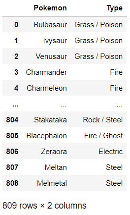

# Chapter 02. Series 메서드


## 데이터셋

- 포켓몬(pokemon)

```python
Pokemon
Bulbasaur      Grass / Poison
Ivysaur        Grass / Poison
Venusaur       Grass / Poison
Charmander               Fire
Charmeleon               Fire
                    ...      
Stakataka        Rock / Steel
Blacephalon      Fire / Ghost
Zeraora              Electric
Meltan                  Steel
Melmetal                Steel
Name: Type, Length: 809, dtype: object
```


- 구글 주가(google)

```python
Date
2004-08-19      49.98
2004-08-20      53.95
2004-08-23      54.50
2004-08-24      52.24
2004-08-25      52.80
               ...   
2019-10-21    1246.15
2019-10-22    1242.80
2019-10-23    1259.13
2019-10-24    1260.99
2019-10-25    1265.13
Name: Close, Length: 3824, dtype: float64
```


- 독립전쟁 기록(battles)

```python
Start Date
1774-09-01    Massachusetts
1774-12-14    New Hampshire
1775-04-19    Massachusetts
1775-04-19    Massachusetts
1775-04-20         Virginia
                  ...      
1782-09-11         Virginia
1782-09-13              NaN
1782-10-18              NaN
1782-12-06              NaN
1783-01-22         Virginia
Name: State, Length: 232, dtype: object
```


## 01. 데이터셋 가져오기


### 1.1 read_csv 메서드

- 데이터셋의 열 개수와 관계없이 read_csv 메서드는 2차원 자료구조인 DataFrame으로 가져온다
- 데이터셋을 가져올 때 판다스는 각 열에 가장 적합한 데이터 유형을 유추한다

- 판다스에게 값을 날짜/시간으로 처리하도록 지시하지 않으면 기본적으로 값을 문자열로 가져옵니다. 문자열은 모든 값을 나타낼 수 있다

### (예시)

```python
import pandas as pd

# 다음 두 줄은 결과가 동일합니다.
pd.read_csv(filepath_or_buffer = 'pokemon.csv')
pd.read_csv('pokemon.csv')
```



### (예시 2)

```python
battles = pd.read_csv(
    'revolutionary_war.csv',
    index_col = 'Start Date',
    parse_dates = ['Start Date'],
    usecols = ['State', 'Start Date'],
    squeeze = True
)

battles
```

```
Start Date
1774-09-01    Massachusetts
1774-12-14    New Hampshire
1775-04-19    Massachusetts
1775-04-19    Massachusetts
1775-04-20         Virginia
                  ...      
1782-09-11         Virginia
1782-09-13              NaN
1782-10-18              NaN
1782-12-06              NaN
1783-01-22         Virginia
Name: State, Length: 232, dtype: object
```


### (정리)

|      매개변수      |                      설명                      |
| :----------------: | :--------------------------------------------: |
| filepath_or_buffer |               csv 파일 경로 입력               |
|     index_col      |                 인덱스 열 설정                 |
|      squeeze       |         DataFrame을 Series로 강제 변환         |
|    parse_dates     | 문자열 리스트를 인수로 받아 날짜/시간으로 변환 |
|      usecols       |  판다스가 가져와야 하는 열 목록을 인자로 입력  |


### 1.2 데이터셋 요약


### (예시)

```python
battles.head()
```

```
Start Date
1774-09-01    Massachusetts
1774-12-14    New Hampshire
1775-04-19    Massachusetts
1775-04-19    Massachusetts
1775-04-20         Virginia
```


### (정리)

| 메서드      | 설명                        |
| ----------- | --------------------------- |
| head(n = 5) | 맨 위에서 5개의 행을 반환   |
| tail(n = 5) | 맨 아래에서 5개의 행을 반환 |


## 02. Series 정렬


### 2.1 sort 메서드


### (예시)

```python
google.sort_values().head()
```

```
Date
2004-09-03      49.82
2004-09-01      49.94
2004-08-19      49.98
2004-09-02      50.57
2004-09-07      50.60
Name: Close, Length: 3824, dtype: float64
```


### (정리)

|    메서드     |          설명          |
| :-----------: | :--------------------: |
| sort_index()  | 인덱스를 기준으로 정렬 |
| sort_values() |   값을 기준으로 정렬   |

|  매개변수   |      입력       |              설명               |
| :---------: | :-------------: | :-----------------------------: |
|  ascending  | True (오름차순) |        정렬 순서를 설정         |
| na_position |     'last'      | 결측값을 어디에 배치할지를 결정 |


### 2.2 dropna 메서드

- dropna 메서드는 결측값이 모두 제거된 Series를 반환한다.


### (예시)

```python
battles.dropna().sort_values()
```

```
tart Date
1781-09-06    Connecticut
1779-07-05    Connecticut
1777-04-27    Connecticut
1777-09-03       Delaware
1777-05-17        Florida
                 ...     
1781-07-06       Virginia
1781-07-01       Virginia
1781-06-26       Virginia
1781-04-25       Virginia
1783-01-22       Virginia
Name: State, Length: 162, dtype: object
```


### 2.3 nsmallest와 nlargest 메서드


### (예시) 

```python
# 다음 두 줄은 결과가 동일합니다.
google.nlargest(n = 5)
google.nlargest()
```

```
Date
2019-04-29    1287.58
2019-04-26    1272.18
2018-07-26    1268.33
2019-10-25    1265.13
2019-04-23    1264.55
Name: Close, dtype: float64
```


### (정리)

|  메서드   |              설명              |
| :-------: | :----------------------------: |
| nsmallest | Series에서 가장 작은 값을 반환 |
| nlargest  |  Series에서 가장 큰 값을 반환  |


### 2.4 Series 덮어쓰기

- 모든 메서드는 새로운 Series를 반환한다. 원본 Series 객체는 원본을 유지하고 있다

- inplace 매개변수는 기존 객체를 수정하는 매개변수이다
- 기존 객체를 수정하는 inplace 매개변수를 사용하는 것 보다 새로운 변수에 할당하는 것이 오류를 줄이는 습관이다


### (예시)

```python
# 다음 두 줄은 결과가 동일합니다.
battles.sort_values(inplace = True)
battles = battles.sort_values()
```


## 03. value_counts 메서드


### 3.1 value_counts 메서드

- value_counts 메서드는 각 Series 값의 발생 횟수를 계산한다

- value_counts 메서드는 기본적으로 NaN 값을 제외한다


### (예시)

```python
pokemon.value_counts()
```

```
Normal                65
Water                 61
Grass                 38
Psychic               35
Fire                  30
                      ..
Fire / Psychic         1
Normal / Ground        1
Psychic / Fighting     1
Dark / Ghost           1
Fire / Ghost           1
Name: Type, Length: 159, dtype: int64
```


### (정리)

| 매개변수  | 입력 |          설명           |
| :-------: | :--: | :---------------------: |
| normalize | True | 각 고유값의 빈도를 반환 |
|   round   |  2   |      소수점 반올림      |


### 3.2 그룹화

- bin 매개변수는 버킷을 정하고 그룹화하는 변수이다

* bin 매개변수가 있는 value_counts 메서드는 반개구간을 반환한다
* 폐구간에는 두 끝점이 모두 포함된다. 예를 들어 [5,10]은 5 이상, 10이하의 구간을 나타낸다
* 개구간은 두 끝점을 모두 제외한다. 예를 들어 (5,10)은 5보다 크고 10보다 작은 구간을 나타낸다


### (예시1)

```python
buckets = [0, 200, 400, 600, 800, 1000, 1200, 1400]
google.value_counts(bins = buckets).sort_index()
```

```
(-0.001, 200.0]      595
(200.0, 400.0]      1568
(400.0, 600.0]       575
(600.0, 800.0]       380
(800.0, 1000.0]      207
(1000.0, 1200.0]     406
(1200.0, 1400.0]      93
Name: Close, dtype: int64
```


### (예시2)

```python
google.value_counts(bins = 6, sort = False)
```

```
(48.581, 256.113]      1204
(256.113, 462.407]     1104
(462.407, 668.7]        507
(668.7, 874.993]        380
(874.993, 1081.287]     292
(1081.287, 1287.58]     337
Name: Close, dtype: int64
```


## 04. apply 메서드

- apply 메서드는 각 Series 값에 대해 한 번씩 함수를 호출하고 함수 호출의 반환 값으로 구성된 새 Series를 반환한다
- apply 메서드는 사용자 정의 함수도 허용한다


### (예시1)

```python
round(99.2)

# 99

round(99.49)

# 99 

round(99.5)

# 100
```

```python
# 다음 두 줄을 결과가 동일합니다.
google.apply(func = round)
google.apply(round)
```

```
Date
2004-08-19      50
2004-08-20      54
2004-08-23      54
2004-08-24      52
2004-08-25      53
              ... 
2019-10-21    1246
2019-10-22    1243
2019-10-23    1259
2019-10-24    1261
2019-10-25    1265
Name: Close, Length: 3824, dtype: int64
```


### (예시2)

```python
def single_or_multi(pokemon_type):
    if '/' in pokemon_type:
        return 'Multi'
    
    return 'Single'
```

```python
pokemon.apply(single_or_multi)
```

```
Pokemon
Bulbasaur       Multi
Ivysaur         Multi
Venusaur        Multi
Charmander     Single
Charmeleon     Single
                ...  
Stakataka       Multi
Blacephalon     Multi
Zeraora        Single
Meltan         Single
Melmetal       Single
Name: Type, Length: 809, dtype: object
```

