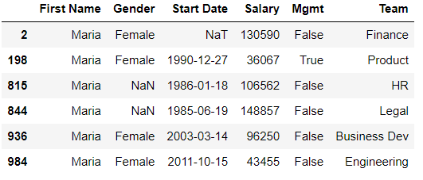
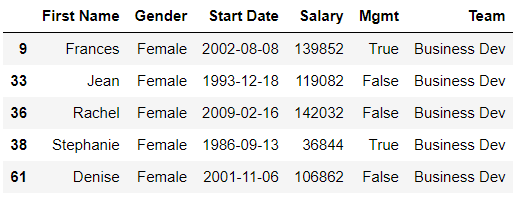
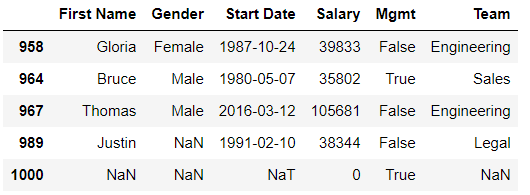
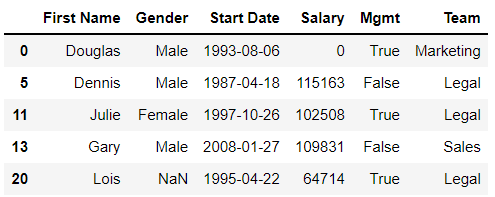
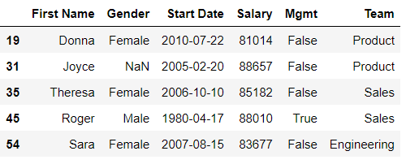
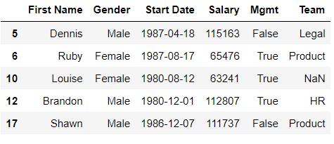
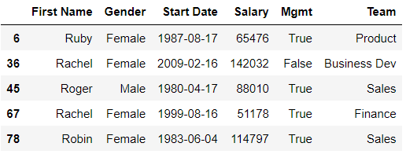
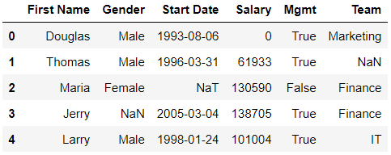
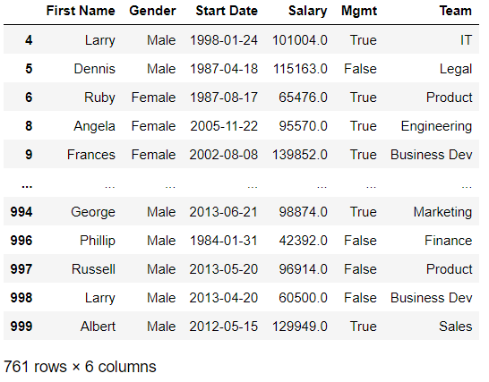
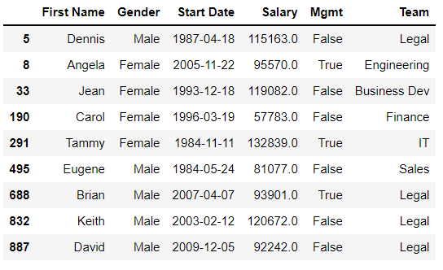

# Chapter 04. DataFrame 필터링


## 01. 데이터셋 최적화

- 일단 데이터셋을 가져올 때마다 각 열이 데이터를 가장 최적의 유형으로 저장하는지 확인해야한다. 가장 적은 메모리를 사용하거나 가장 많은 유틸리티를 제공하는 데이터 유형이 최적의 데이터 유형이다


### 데이터셋

- 가상 회사의 직원 정보(employees)


### 4.1 info 메서드


### (예시)

- info 메서드는 메모리 사용량과 각 열의 데이터 유형을 확인할 수 있다

```python
employees.info()
```

```
<class 'pandas.core.frame.DataFrame'>
RangeIndex: 1001 entries, 0 to 1000
Data columns (total 6 columns):
 #   Column      Non-Null Count  Dtype  
---  ------      --------------  -----  
 0   First Name  933 non-null    object 
 1   Gender      854 non-null    object 
 2   Start Date  999 non-null    object 
 3   Salary      999 non-null    float64
 4   Mgmt        933 non-null    object 
 5   Team        957 non-null    object 
dtypes: float64(1), object(5)
memory usage: 47.0+ KB
```


### 4.2 데이터 유형 변환

### (예시1)

- 문자열을 날짜/시간으로 변환하기
- 메모리 사용량에는 크게 변화가 없으나 많은 시간 관련 메서드를 사용할 수 있다

```python
employees = pd.read_csv('employees.csv', parse_dates = ['Start Date'])
employees.info()
```

```
<class 'pandas.core.frame.DataFrame'>
RangeIndex: 1001 entries, 0 to 1000
Data columns (total 6 columns):
 #   Column      Non-Null Count  Dtype         
---  ------      --------------  -----         
 0   First Name  933 non-null    object        
 1   Gender      854 non-null    object        
 2   Start Date  999 non-null    datetime64[ns]
 3   Salary      999 non-null    float64       
 4   Mgmt        933 non-null    object        
 5   Team        957 non-null    object        
dtypes: datetime64[ns](1), float64(1), object(4)
memory usage: 47.0+ KB
```


### (예시2)

- astype 메서드는 Series의 값을 다른 데이터 유형으로 변환한다

- 관리자 여부(Mgmt)를 bool형으로 변환하자

```python
employees['Mgmt'] = employees['Mgmt'].astype(bool)
employees.info()
```

```
<class 'pandas.core.frame.DataFrame'>
RangeIndex: 1001 entries, 0 to 1000
Data columns (total 6 columns):
 #   Column      Non-Null Count  Dtype         
---  ------      --------------  -----         
 0   First Name  933 non-null    object        
 1   Gender      854 non-null    object        
 2   Start Date  999 non-null    datetime64[ns]
 3   Salary      999 non-null    float64       
 4   Mgmt        1001 non-null   bool          
 5   Team        957 non-null    object        
dtypes: bool(1), datetime64[ns](1), float64(1), object(3)
memory usage: 40.2+ KB
```


### (예시3)

- 연봉(Salary) 을 정수로 변환하자 
- (문제점) 원본 파일의 연봉 열의 값은 정수이나 판다스가 NaN값을 처리하기 위해 부동소수점으로 변환했다

- fillna 메서드는 Series의 null 값을 사용자가 전달한 인수로 대체한다

```python
employees['Salary'] = employees['Salary'].fillna(0).astype(int)
employees.info()
```

```
<class 'pandas.core.frame.DataFrame'>
RangeIndex: 1001 entries, 0 to 1000
Data columns (total 6 columns):
 #   Column      Non-Null Count  Dtype         
---  ------      --------------  -----         
 0   First Name  933 non-null    object        
 1   Gender      854 non-null    object        
 2   Start Date  999 non-null    datetime64[ns]
 3   Salary      1001 non-null   int32         
 4   Mgmt        1001 non-null   bool          
 5   Team        957 non-null    object        
dtypes: bool(1), datetime64[ns](1), int32(1), object(3)
memory usage: 36.3+ KB
```


### (예시4)

- 판다스에는 범주형(category)이라는 특별한 데이터 유형이 있다. 이 유형은 전체 개수에 비해 소수의 고유값으로 구성된 열에 적용하기 좋다. 일상에서 흔히 접할 수 있는 성별, 요일, 혈액형, 행성이나 소득층과 같이 값이 제한적인 데이터를 예로 들 수 있다. 판다스는 전체 행에 걸쳐 중복된 내용을 저장하지 않고 각 범주 값의 복사본 하나만 저장한다.

```python
employees.nunique()
```

```
First Name    200
Gender          2
Start Date    971
Salary        995
Mgmt            2
Team           10
dtype: int64
```


- 성별(Gender)과 팀(Team) 열은 범주형 값을 저장하기에 적합한 후보이다

```python
employees['Gender'] = employees['Gender'].astype('category')
employees['Team'] = employees['Team'].astype('category')
employees.info()
```

```
<class 'pandas.core.frame.DataFrame'>
RangeIndex: 1001 entries, 0 to 1000
Data columns (total 6 columns):
 #   Column      Non-Null Count  Dtype         
---  ------      --------------  -----         
 0   First Name  933 non-null    object        
 1   Gender      854 non-null    category      
 2   Start Date  999 non-null    datetime64[ns]
 3   Salary      1001 non-null   int32         
 4   Mgmt        1001 non-null   bool          
 5   Team        957 non-null    category      
dtypes: bool(1), category(2), datetime64[ns](1), int32(1), object(1)
memory usage: 23.1+ KB
```


## 02. 단일 조건으로 필터링

- Series를 비교 연산자와 결합하면 판다스는  불리언 Series를 반환한다(브로드 캐스팅)

```python
employees['First Name'] == 'Maria'
```

```
0       False
1       False
2        True
3       False
4       False
        ...  
996     False
997     False
998     False
999     False
1000    False
Name: First Name, Length: 1001, dtype: bool
```


### (예시)

- 판다스 대괄호 사이에 불리언을 입력하면 True 값의 행만 필터링한다

```python
employees[employees['First Name'] == 'Maria']
```




- 복잡하다면 변수에 할당하는 방식도 있다

```python
marias = employees['First Name'] == 'Maria'
employees[marias]
```


## 03. 다중 조건으로 필터링


### 3.1 AND 조건

* 앰퍼샌드(&)는 AND 논리를 나타낸다

| 조건 1 | 조건 2 | 평가  |
| :----: | :----: | :---: |
|  True  |  True  | True  |
|  True  | False  | False |
| False  |  True  | False |
| False  | False  | False |


### (예시)

- 비즈니스 개발 팀에서 일하는 모든 여성 직원을 찾아보자

```python
is_female =  employees['Gender'] == 'Female'
in_biz_dev = employees['Team'] == 'Business Dev'
employees[is_female & in_biz_dev].head()
```




### 3.2 OR 조건

- 파이프(|)기호는 OR 논리를 나타낸다

| 조건 1 | 조건 2 | 평가  |
| :----: | :----: | :---: |
|  True  |  True  | True  |
|  True  | False  | True  |
| False  |  True  | True  |
| False  | False  | False |


### (예시)

- 연봉(Salary)이 $40,000 미만이거나 입사일(Start Date)이 2015년 1월 1일 이후인 모든 직원을 찾아보자

```python
earning_below_40k = employees['Salary'] < 40000
started_after_2015 = employees['Start Date'] > '2015-01-01'
employees[earning_below_40k | started_after_2015].tail()
```




## 04. 조건별 필터링


### 4.1 isin 메서드

- isin 메서드에 반복가능한 요소(리스트, 튜플, Series 등)를 인수로 넣어 불리언 Series를 반환받을 수 있다


### (예시)

- 영업, 법률, 마케팅팀에 속하는 직원을 추출해보자
- 많은 변수를 할당하는 방법은 복잡하다

```python
# 1
sales = employees['Team'] == 'Sales'
legal = employees['Team'] == 'Legal'
mktg = employees['Team'] == 'Marketing'
employees[sales | legal | mktg]
```

```python
# 2
all_star_teams = ['Sales', 'Legal', 'Marketing']
on_all_star_teams = employees['Team'].isin(all_star_teams)
employees[on_all_star_teams].head()
```




### 4.2 between 메서드

- between 메서드는 숫자나 날짜를 다룰 때 범위에 속하는 값을 구할때 사용한다


### (예시1)

- $80,000에서 $90,000 사이의 연봉을 받는 직원을 추출해보자
- 기존의 방법보다 간결하다

```python
# 1
higher_than_80 = employees['Salary'] >= 80000
lower_than_90 = employees['Salary'] < 90000
employees[higher_than_80 & lower_than_90].head()
```

```python
# 2
between_80k_and_90k = employees['Salary'].between(80000, 90000)
employees[between_80k_and_90k].head()
```




### (예시2)

* 메서드의 첫 번째 및 두 번째 인수에 대한 키워드 매개변수는 각각 left와 right이다
* 1980년대에 기업에 입사한 직원을 찾아보자

```python
eighties_folk = employees['Start Date'].between(
    left = '1980-01-01',
    right = '1990-01-01'
)
employees[eighties_folk].head()
```




### (예시3)

- 이름이 문자'R'로 시작하는 직원을 필터링 해보자. R을 하한으로 지정하여 범위에 포함하고 S로 상한으로 지정하여 범위에서 제외한다

```python
name_start_with_r = employees['First Name'].between('R', 'S')
employees[name_start_with_r].head()
```




### 4.3 isnull과 notnull 메서드


### (예시)

- First Name 열의 값이 존재하는 직원을 추출해보자

```python
has_name = employees['First Name'].notnull()
employees[has_name].head()
```




### (정리)

|  메서드   |                           설명                           |
| :-------: | :------------------------------------------------------: |
| isnull()  | 행의 값이 누락되면 True 값을 가지는 불리언 Series를 반환 |
| notnull() | 행의 값이 존재하면 True 값을 가지는 불리언 Series를 반환 |


### 4.4 null 값 다루기


### (예시)

- dropna 메서드는 값이 NaN인 DataFrame 행을 제거한다. 행에 NaN 값이 하나라도 있다면 해당 행을 제거한다

```python
employees.dropna()
```




### (정리)

| 매개변수 |    입력    |                  설명                  |
| :------: | :--------: | :------------------------------------: |
|   how    |   'all'    |       모든 값이 누락된 행을 제거       |
|  subset  | ['Gender'] |             특정 열을 지정             |
|  thresh  |     4      | 행을 유지하기 위한 최소 null이 아닌 값 |


## 05. 중복처리


### 5.1 duplicated 메서드

- duplicated 메서드는 열에서 중복값을 식별하는 불리언 Series를 반환한다. 판다스는 Series를 순회하며 이전에 한번이라도 본 적이 있는 값이라면 True를 반환한다


### (예시)

```python
employees['Team'].duplicated().head()
```

```
0    False
1    False
2    False
3     True
4    False
Name: Team, dtype: bool
```


### (정리)

| 매개변수 |  입력  |                        설명                        |
| :------: | :----: | :------------------------------------------------: |
|   keep   | 'last' | 마지막으로 나타나는 값을 중복되지 않을 것으로 표시 |


### 5.2 drop_duplicated 메서드

- drop_duplicated 메서드는 중복 제거 작업을 편리하게 수행할 수 있는 메서드이다. 기본적으로 이 메서드는 행의 모든 값이 일치하는 행을 제거한다
- subset 매개변수에 고유값을 가져야하는  열 목록을 전달하면 특정 열에 대한 중복을 제거할 수 있다


### (예시)

- 다음은 동일한 값을 가진 행이 2개 이상이라면 해당 행을 제거하는 예시이다

```python
employees.drop_duplicates(subset = ['First Name'], keep = False)
```




### (정리)

| 매개변수 |      입력      |             설명              |
| :------: | :------------: | :---------------------------: |
|   keep   |     'last'     | 마지막으로 나타나는 값을 유지 |
|          |     False      |  중복값이 있는 모든 행 제거   |
|  subset  | ['First Name'] |        특정 열을 지정         |

