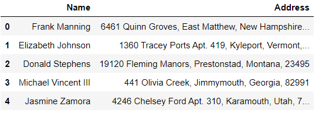
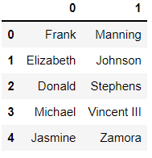
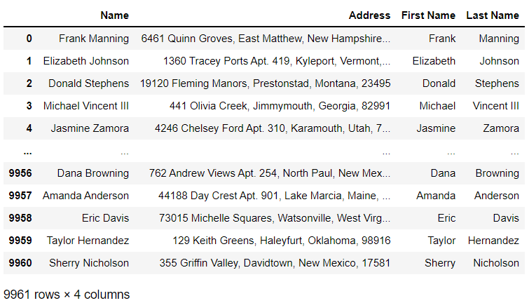
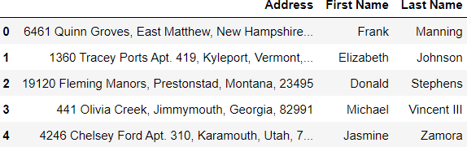

# Chapter 05. 텍스트 데이터 다루기

- 데이터를 정리하는 과정을 랭글링(wrangling) 또는 먼징(munging)이라고 한다


## 데이터셋

- 시카고 지역 식당의 검사목록(inspections)


## 01. 대소문자 변환과 공백

- Series 객체의 str 속성을 사용하면 강력한 문자열 처리 메서드를 제공하는 StringMethods 객체에 접근할 수 있다


### (예시)

```python
inspections['Name'].str.strip().head()
```

```
0    MARRIOT MARQUIS CHICAGO
1                 JETS PIZZA
2                  ROOM 1520
3    MARRIOT MARQUIS CHICAGO
4                 CHARTWELLS
Name: Name, dtype: object
```


### (정리)

|    메서드    |                   설명                   |
| :----------: | :--------------------------------------: |
|   lstrip()   |    문자열의 시작 부분에서 공백을 제거    |
|   rstrip()   |        문자열 끝에서 공백을 제거         |
|   strip()    |     문자열의 양쪽 끝에서 공백을 제거     |
|   lower()    |    문자열의 모든 문자를 소문자로 변환    |
|   upper()    |    문자열의 모든 문자를 대문자로 변환    |
| capitalize() | 각 문자열의 첫 번째 문자를 대문자로 변환 |
|   title()    |  각 단어의 첫 번째 문자를 대문자로 변환  |


## 02. 문자열 치환

- replace 메서드는 문자열 치환하는 메서드이다.  첫번째 매개변수인 to_place로 검색할 값을 지정하고, 두번째 매개변수인 value로 각 항목을 대체할 항목을 지정한다


### (예시)

- 'All'을 Rank4로 치환하기

```python
inspections['Risk'].replace('All', 'Rank4')
```


## 03. 문자열 슬라이싱


### (예시1)

- slice 메서드를 사용하는 방식

```python
inspections['Risk'].str.slice(5, 6).head()
```

```
0    1
1    2
2    3
3    1
4    1
Name: Risk, dtype: object
```


### (예시2)

- 파이썬의 리스트 슬라이싱 구문

```python
inspections['Risk'].str[5:6].head()
```

```
0    1
1    2
2    3
3    1
4    1
Name: Risk, dtype: object
```


## 04. 불리언 메서드

- StringMethods 객체에는 불리언 Series를 반환하는 메서드도 있다. 이러한 메서드는 DataFrame을 필터링할 때 특히 유용하다
- 문자열을 검색할때는 대소문자를 구분하자


### (예시)

- contains 메서드는 각 Series 값에 하위 문자열이 포함되어 있는지 확인한다

```python
inspections['Name'].str.lower().str.contains('pizza').head()
```

```
0    False
1     True
2    False
3    False
4    False
Name: Name, dtype: bool
```


### (정리)

|    메서드    |                       설명                        |
| :----------: | :-----------------------------------------------: |
|  contains()  | 각 Series 값에 하위 문자열이 포함되어 있는지 확인 |
| startswith() |          문자열이 인수로 시작하는지 확인          |
|  endswith()  |        문자열이 문자열의 끝에 있는지 확인         |


## 05. 문자열 분할


### 데이터셋

- 가상의 고객과 집주소(customer)




### 5.1 문자열 분할


### (예시1)

* Name에서 이름과 성을 구분하자

```python
customers['Name'].str.len().head()
```

```
0    13
1    17
2    15
3    19
4    14
Name: Name, dtype: int64
```


```python
# 다음 두 줄은 결과가 동일합니다
customers['Name'].str.split(pat = ' ').head()
customers['Name'].str.split(' ').head()
```

```
0           [Frank, Manning]
1       [Elizabeth, Johnson]
2         [Donald, Stephens]
3    [Michael, Vincent, III]
4          [Jasmine, Zamora]
Name: Name, dtype: object
```


* MD, Jr 과 같은 접미사때문에 세 단어 이상으로 구성되는  문제 발생

```python
customers['Name'].str.split(' ').str.len().head()
```

```
0    2
1    2
2    2
3    3
4    2
Name: Name, dtype: int64
```

* 모든 리스트가 동일한 개수의 요소를 가지도록 분할하는 개수를 제한할 수 있다. 분할의 최대 임계값을 1로 설정하면 판다스는 첫 번째 공백에서 문자열을 분할하고 중지한다

```python
customers['Name'].str.split(pat = ' ', n = 1).head()
```

```
0          [Frank, Manning]
1      [Elizabeth, Johnson]
2        [Donald, Stephens]
3    [Michael, Vincent III]
4         [Jasmine, Zamora]
Name: Name, dtype: object
```


### (예시2)

* 분할한 이름과 성을 새로운 열로 구성하기
* get을 사용하여 인덱스 위치를 기반으로 각 행의 리스트에서 값을 가져올 수 있다

```python
customers['Name'].str.split(pat = ' ', n = 1).str.get(0).head()
```

```
0        Frank
1    Elizabeth
2       Donald
3      Michael
4      Jasmine
Name: Name, dtype: object
```


* 2개의 독립적인 Series를 얻기 위해 get 메서드를 두 번 호출해야하는 것도 좋지만 split 메서드는 expand 매개변수에 인수로 True를 전달하면 이 메서드는 리스트 Series 대신 새로운 DataFrame을 반환한다

```pyrhon
customers['Name'].str.split(pat = ' ', n = 1, expand = True).head()
```



* 기존 DataFrame에 연결하기

```python
customers[['First Name', 'Last Name']] = customers['Name'].str.split(pat = ' ', n = 1, expand = True)

customers
```




### (정리)

| 메서드  |               설명                |
| :-----: | :-------------------------------: |
|  len()  |    각 행의 문자열 길이를 반환     |
| split() | 각 행의 문자열을 패턴에 따라 분할 |
|  get()  |   각 행의 리스트에서 값을 반환    |

| 매개변수 | 입력 |                    설명                    |
| :------: | :--: | :----------------------------------------: |
|    n     |  1   |   첫번째 공백에서 문자열을 분할하고 중지   |
|  expand  | True | 리스트 Series 대신 새로운 DataFrame을 반환 |


### 5.2 drop 메서드


### (예시)

* drop 메서드를 사용하면 열을 삭제할 수 있다. 열 이름을 매개변수 labels에 전달하고 매개변수 axis에 'columns'를 인수로 전달한다

```python
customers = customers.drop(labels = 'Name', axis = 'columns')
customers.head()
```




## 06. 정규표현식에 대한 참고사항

* 판다스가 대부분의 문자열 메서드에서 정규 표현식 인수를 지원한다


### (예시)

```python
customers['Street'].head()
```

```
0             6461 Quinn Groves
1    1360 Tracey Ports Apt. 419
2          19120 Fleming Manors
3              441 Olivia Creek
4    4246 Chelsey Ford Apt. 310
Name: Street, dtype: object
```

```python
customers['Street'].str.replace('\d{4,}', '*', regex = True)
```

```
1         * Tracey Ports Apt. 419
2                * Fleming Manors
3                441 Olivia Creek
4         * Chelsey Ford Apt. 310
                  ...            
9956    762 Andrew Views Apt. 254
9957         * Day Crest Apt. 901
9958           * Michelle Squares
9959             129 Keith Greens
9960           355 Griffin Valley
Name: Street, Length: 9961, dtype: object
```

