# Chapter 07. MultiIndex Data Frame


* 1차원 Series와 2차원 DataFrame에서 차원은 차원의 수를 말하는데. 차원의 수는 자료구조에서 값을 추출할 때 필요한 참조점의 개수 입니다
* 판다스는 MultiIndex를 사용하여 다차원의 데이터 셋을 지원합니다.


## 01. MultiIndex 객체

```python
import pandas as pd
```

```python
address = [
    ('8809 Flair Square', 'Toddside', 'IL', '37206' ),
    ('9901 Austin Street', 'Toddside', 'IL', '37206'),
    ('905 Hogan Quarter', 'Franklin', 'IL', '37206')
]

# 도로명, 도시, 주, 우편번호
```


* MultiIndex 객체는 각 레이블이 여러 데이터 조각을 저장할 수  있는 인덱스라고 이해하면 됩니다
* 다음은 튜플 리스트를 넘겨 from_tuples 클래스 메서드를 호출하는 예제 입니다

```python
# 다음 두 줄은 결과가 동일합니다
pd.MultiIndex.from_tuples(address)
pd.MultiIndex.from_tuples(tuples = address)
```

```
MultiIndex([( '8809 Flair Square', 'Toddside', 'IL', '37206'),
            ('9901 Austin Street', 'Toddside', 'IL', '37206'),
            ( '905 Hogan Quarter', 'Franklin', 'IL', '37206')],
           )
```


* 같은 위치에 있는 튜플 값의 모음을 판다스 용어로 MultiIndex 레벨이라고 합니다.
* 첫번째 레벨은 '8809 Flair Square',  '9901 Austin Street', '905 Hogan Quarter'
* 두번째 레벨은 'Toddside',  'Toddside', 'Franklin'


* MultiIndex 레벨에 이름 할당하기

```python
row_index =pd.MultiIndex.from_tuples(
    tuples = address,
    names = ['Street', 'City', 'State', 'Zip']
)
row_index
```

```
MultiIndex([( '8809 Flair Square', 'Toddside', 'IL', '37206'),
            ('9901 Austin Street', 'Toddside', 'IL', '37206'),
            ( '905 Hogan Quarter', 'Franklin', 'IL', '37206')],
           names=['Street', 'City', 'State', 'Zip'])
```


* 요약하자면 MultiIndex는 각 레이블이 여러 값을 보유하는 컨테이너입니다. 레벨은 레이블에 동일한 위치에 있는 값으로 구성됩니다.
* MultiIndex를 DataFrame에 연결하기

```python
data = [
    ['A', 'B+'],
    ['C+', 'C'],
    ['D-', 'A']
]

columns = ['Schools', 'Cost of Living']

area_grades = pd.DataFrame(
    data = data, index = row_index, columns = columns
)

area_grades
```

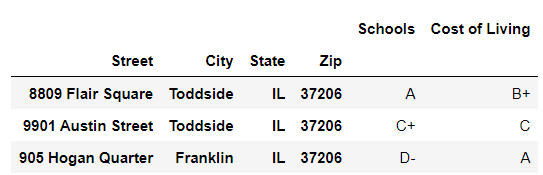

```python
area_grades.columns
```

```
Index(['Schools', 'Cost of Living'], dtype='object')
```


* 열 축에 MultiIndex 연결하기

```python
columns_index = pd.MultiIndex.from_tuples([
    ('Culture', 'Restaurants'),
    ('Culture', 'Museums'),
    ('Services', 'Police'),
    ('Services', 'Schools')
])
columns_index
```

```
MultiIndex([( 'Culture', 'Restaurants'),
            ( 'Culture',     'Museums'),
            ('Services',      'Police'),
            ('Services',     'Schools')],
           )
```

```python
data = [
    ['C-', 'B+', 'B-', 'A'],
    ['D+', 'C', 'A', 'C+'],
    ['A-', 'A', 'D+', 'F']
]
```

```python
pd.DataFrame(
    data = data, index = row_index, columns = columns_index
)
```

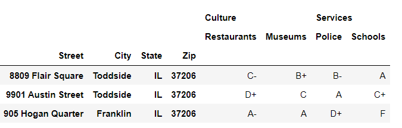


## 02. MultiIndex DataFrame

* neighborhoods.csv 원본 몇 행

```
,,,Culture,Culture,Services,Services
,,,Restaurants,Museums,Police,Schools
State,City,Street,,,,
MO,Fisherborough,244 Tracy View,C+,F,D-,A+
```


* 그대로 가져오게 되면 

```python
neighborhoods = pd.read_csv('neighborhoods.csv')
neighborhoods.head()
```

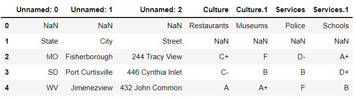

* CSV를 가져올 때 판다스는 파일의 첫 번째 행에 열 이름이 있겠다고 가정하며 이것을 헤더라고 합니다. 헤더에 값이 없으면 판다스는 해당 열에 'Unnamed' 라는 이름을 할당합니다.
* 오른쪽에 있는 4개의 열은 이름이 중복되는 문제가 있습니다. 따라서 판다스는 인덱스 3의 열에 Culture라는 이름을 할당하고 그 다음 열에 Culture.1이라는 이름을 할당합니다
* 0행에서 처음 3개의 열은 모두 NaN값을 가집니다. 1행의 마지막 4개 열도 모두 NaN 값을 가집니다. CSV는 다중 레벨 행 인덱스와 다중 레벨 열 인덱스를 의도했지만 read_csv 함수의 매개변수에 지정된 기본 인수는 이를 인식하지 못합니다. 다행히 몇 가지 read_csv의 매개변수에 인수를 변경하면 이 문제를 해결할 수 있습니다


* 먼저 가장 왼쪽에 있는 3개의 열이 DataFrame의 인덱스 역활을 해야 한다고 판다스에게 알려주어야 합니다. DataFrame의 인덱스에 있어야 하는 열의 인덱스(또는 숫자 위치)를 나타내는 숫자 리스트를 매개변수 index_col에 전달하세여. index_col에 여러 값이 있는 리스트를 전달하면 판드스는 DataFrame에 대한 MultiIndex를 자동으로 생성합니다

```python
neighborhoods = pd.read_csv(
    'neighborhoods.csv',
    index_col = [0, 1, 2]
)
neighborhoods.head()
```

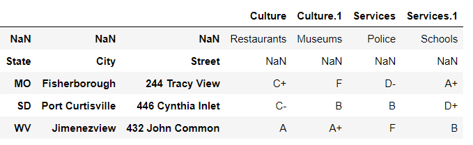


* 다음으로 DataFrame의 헤더에 사용할  데이터셋 행을 판다스에게 알려주어야 합니다. read_csv 함수는 첫 번째 행만 헤더라고 생각합니다. 하지만 데이터 셋에서는 처음 두 행이 헤더를 나타냅니다.

```python
neighborhoods = pd.read_csv(
    'neighborhoods.csv',
    index_col = [0, 1, 2],
    header = [0, 1]
)
neighborhoods.head()
```

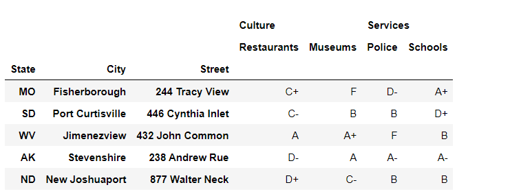


* 판다스는 각 열의 이름을 2개의 요소를 가진 튜플로 출력합니다.
* 행 레이블은 3개의 요소를 가진 튜플로 출력합니다

```python
neighborhoods.info()
```

```
<class 'pandas.core.frame.DataFrame'>
MultiIndex: 251 entries, ('MO', 'Fisherborough', '244 Tracy View') to ('NE', 'South Kennethmouth', '346 Wallace Pass')
Data columns (total 4 columns):
 #   Column                  Non-Null Count  Dtype 
---  ------                  --------------  ----- 
 0   (Culture, Restaurants)  251 non-null    object
 1   (Culture, Museums)      251 non-null    object
 2   (Services, Police)      251 non-null    object
 3   (Services, Schools)     251 non-null    object
dtypes: object(4)
memory usage: 27.2+ KB
```


* 행 인덱스에 접근하면 튜플을 확인할 수 있다

```python
neighborhoods.index
```

```
MultiIndex([('MO',      'Fisherborough',        '244 Tracy View'),
            ('SD',   'Port Curtisville',     '446 Cynthia Inlet'),
            ('WV',        'Jimenezview',       '432 John Common'),
            ('AK',        'Stevenshire',        '238 Andrew Rue'),
            ('ND',     'New Joshuaport',       '877 Walter Neck'),
            ('ID',         'Wellsville',   '696 Weber Stravenue'),
            ('TN',          'Jodiburgh',    '285 Justin Corners'),
            ('DC',   'Lake Christopher',   '607 Montoya Harbors'),
            ('OH',          'Port Mike',      '041 Michael Neck'),
            ('ND',         'Hardyburgh', '550 Gilmore Mountains'),
            ...
            ('AK',          'Scottstad',      '114 Jones Garden'),
            ('IA',    'Port Willieport',  '320 Jennifer Mission'),
            ('ME',         'Port Linda',        '692 Hill Glens'),
            ('KS',         'Kaylamouth',       '483 Freeman Via'),
            ('WA',     'Port Shawnfort',    '691 Winters Bridge'),
            ('MI',      'North Matthew',      '055 Clayton Isle'),
            ('MT',            'Chadton',     '601 Richards Road'),
            ('SC',          'Diazmouth',     '385 Robin Harbors'),
            ('VA',         'Laurentown',     '255 Gonzalez Land'),
            ('NE', 'South Kennethmouth',      '346 Wallace Pass')],
           names=['State', 'City', 'Street'], length=251)
```


* 열 인덱스도 마찬가지

```python
neighborhoods.columns
```

```
MultiIndex([( 'Culture', 'Restaurants'),
            ( 'Culture',     'Museums'),
            ('Services',      'Police'),
            ('Services',     'Schools')],
           )
```


* names 속성을 사용하면 인덱스 이름 리스트에 접근할 수 있습니다.

```python
neighborhoods.index.names
```

```
FrozenList(['State', 'City', 'Street'])
```


* 판다스는 MultiIndex 내의 각 중첩 레벨에 순서를 할당합니다.
  * state 레벨의 인덱스 위치는 0 입니다
  * City 레벨의 인덱스 위치는 1 입니다
  * Street 레벨의 인덱스 위치는 2 입니다.
* get_level_values 메서드는 주어진 MultiIndex 레벨에서 Index 객체를 추출합니다

```python
# 다음 두 줄은 결과가 동일합니다
neighborhoods.index.get_level_values(1)
neighborhoods.index.get_level_values('City')
```

```
Index(['Fisherborough', 'Port Curtisville', 'Jimenezview', 'Stevenshire',
       'New Joshuaport', 'Wellsville', 'Jodiburgh', 'Lake Christopher',
       'Port Mike', 'Hardyburgh',
       ...
       'Scottstad', 'Port Willieport', 'Port Linda', 'Kaylamouth',
       'Port Shawnfort', 'North Matthew', 'Chadton', 'Diazmouth', 'Laurentown',
       'South Kennethmouth'],
      dtype='object', name='City', length=251)
```


* CSV가 이름을 제공하지 않았기 때문에 열의 MultiIndex 레벨에는 이름이 없습니다

```python
neighborhoods.columns.names
```

```
FrozenList([None, None])
```

```python
neighborhoods.columns.names = ['Category', 'Subcategory']
neighborhoods.columns.names
```

```
FrozenList(['Category', 'Subcategory'])
```


* 레벨의 이름은 출력 결과의 열 헤더 왼쪽에서 확인할 수 있습니다.

```python
neighborhoods.head(3)
```

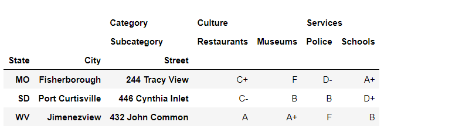


* 레벨 이름은 할당했으므로 get_level_values 메서드를 사용하여 열의 MultiIndex에서 인덱스를 검색할 수 있습니다

```python
# 다음 두 줄은 결과가 동일합니다
neighborhoods.columns.get_level_values(0)
neighborhoods.columns.get_level_values('Category')
```

```
Index(['Culture', 'Culture', 'Services', 'Services'], dtype='object', name='Category')
```


* 인덱스는 작업에 따라 축을 전환할 수 있습니다

```python
neighborhoods.head(1)
```

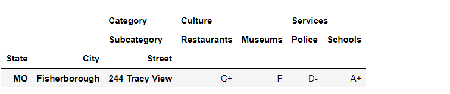

```python
neighborhoods.nunique()
```

```
Category  Subcategory
Culture   Restaurants    13
          Museums        13
Services  Police         13
          Schools        13
dtype: int64
```


## 03. MultiIndex 정렬

* 판다스는 State 레벨을 먼저 정렬한 다음 City 레벨 값을 정렬하고 마지막으로 Street 레벨의 값을 정렬합니다

```python
neighborhoods.sort_index()
```

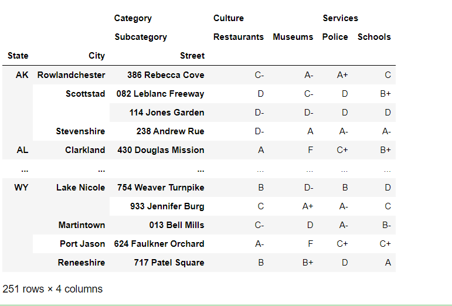


* 역순으로 정렬

```python
neighborhoods.sort_index(ascending = False).head()
```

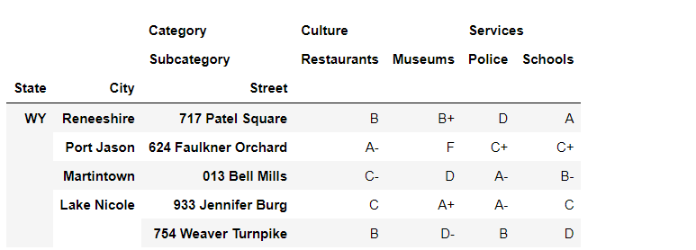


* 각 레벨의 정렬 순서를 서로 다르게 지정하고 싶으면 ascending에 불리언 리스트를 전달하면 됩니다

```python
neighborhoods.sort_index(ascending = [True, False, True]).head()
```

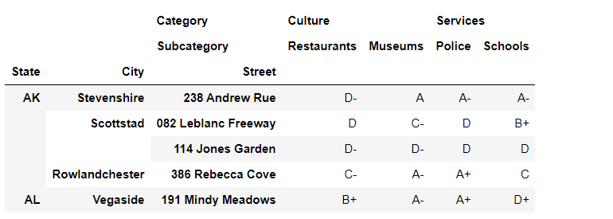


* MutiIndex 레벨 자체를 정렬할 수도 있습니다. 두번째 MultiIndex 레벨인 City의 값을 기준으로 행을 정렬한다고 가정하겠습니다. 판다스는 정렬할 때 나머지 레벨을 무시합니다.

```python
# 다음 두 줄은 결과가 동일합니다
neighborhoods.sort_index(level = 1)
neighborhoods.sort_index(level = 'City')
```

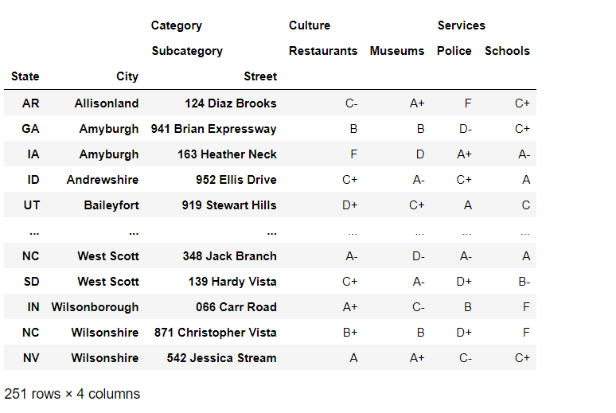


* level 매개변수에는 레벨의 리스트도 넣을 수 있습니다. 다음은 City 레벨의 값을 먼저 정렬한 다음 Street 레벨의 값을 정렬하는 예제입니다. State 레벨의 값은 정렬에 전혀 영향을 미치지 않습니다.

```python
# 다음 두 줄은 결과가 동일합니다
neighborhoods.sort_index(level = [1, 2]).head()
neighborhoods.sort_index(level = ['City', 'Street']).head()
```

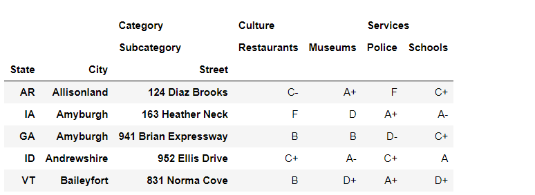


* ascending과 level 매개변수를 함께 사용할 수도 있습니다.  다음 예제에서는 City 레벨을 오름차순으로 정렬하고 Street 레벨을 내림차순으로 정렬하여 두 Street 열의 순서를 바꿉니다.

```python
neighborhoods.sort_index(
    level = ['City', 'Street'], ascending = [True, False]
). head()
```

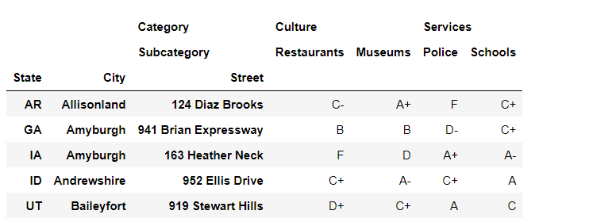


* axis 매개변수에 인수를 넣어 sort_index 메서드를 호출하면 열의 MultiIndex도 정렬할 수 있습니다. 매개변수의 기본 인수는 행 인덱스를 나태내는 0 입니다. 열을 정렬하려면 숫자 1 또는 문자열 'columns'를 전달하면 됩니다. 다음은 Category 레벨을 먼저 정렬하고 Subcategory 레벨을 두 번째로 정렬하는 예제입니다. Culture 레벨에서 Museums가 Restorants 앞에 옵니다. Service에서는 Police가 Schools 앞에 옵니다

```python
# 다음 두 줄은 결과가 동일합니다
neighborhoods.sort_index(axis = 1).head(3)
neighborhoods.sort_index(axis = 'columns').head(3)
```

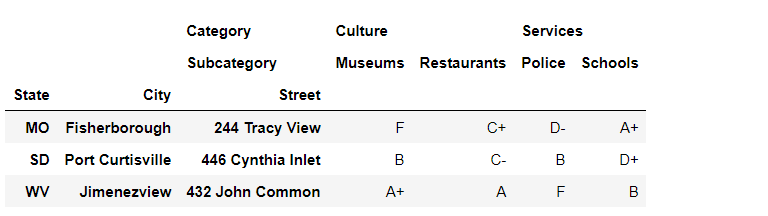


* level 및 ascending 매개변수를 axis 매개변수와 함께 사용하면 열의 정렬 순서를 추가로 사용자 정의할 수 있습니다.

```python
neighborhoods.sort_index(
    axis = 1, level = 'Subcategory', ascending =False
).head(3)
```


* 정리하고 다음 절로

```python
neighborhoods = neighborhoods.sort_index(ascending = True)
```

```python
neighborhoods.head(3)
```

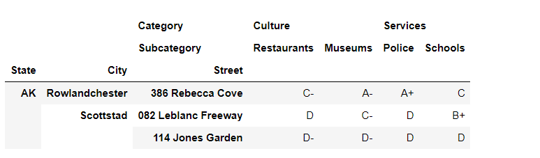


## 04. MultiIndex 행과 열 선택

* 참고

```python
data = [
    [1, 2],
    [3, 4]
]

df = pd.DataFrame(
    data = data,
    index = ['A', 'B'],
    columns = ['X', 'Y']
)

df
```

```
	X	Y
A	1	2
B	3	4
```

```python
df['X']
```

```
A    1
B    3
Name: X, dtype: int64
```


### 4.1 하나 이상의 열 추출

* 대괄호 안에 하나의 값만 전달하면 판다스는 열 MultiIndex의 가장 바깥쪽 레벨에서 해당 값을 찾습니다. 다음은 Category 레벨에서 유효한 값인 Services를 검색하는 예제입니다

```python
neighborhoods['Services']
```

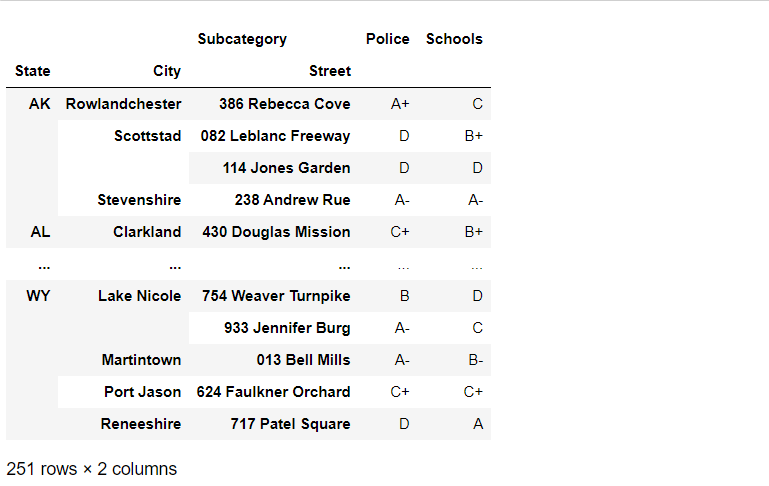

* 새 DataFrame에는 Category 레벨이 없습니다. Police와 Schools라는 두 가지 값이 있는 일반 인덱스만 있습니다. 이 DataFrame의 두 열은 Services 값에 해당하는 하위 범주이기 때문에 더 이상 MultiIndex가 필요하지 않습니다. Services가 선택되었기 때문에 Category 레벨은 변동 가능성이 없으므로 결과에 포함할 필요가 없습니다.


* 대괄호 안에 넣은 값이 열 MultiIndex의 가장 바깥쪽 레벨에 없으면 판다스는 KeyError 예외를 발생시킵니다.

```python
neighborhoods['Schools']
```

```
KeyError
```


* 특정 Category를 선택한 다음 그 안에 있는 Subcategory를 선택하려면 튜플을 사용하면 열의 MultiIndex에서 여러 레벨에 걸쳐 값을 지정할 수 있습니다.

```python
neighborhoods[('Services', 'Schools')]
```

```
State  City            Street              
AK     Rowlandchester  386 Rebecca Cove         C
       Scottstad       082 Leblanc Freeway     B+
                       114 Jones Garden         D
       Stevenshire     238 Andrew Rue          A-
AL     Clarkland       430 Douglas Mission     B+
                                               ..
WY     Lake Nicole     754 Weaver Turnpike      D
                       933 Jennifer Burg        C
       Martintown      013 Bell Mills          B-
       Port Jason      624 Faulkner Orchard    C+
       Reneeshire      717 Patel Square         A
Name: (Services, Schools), Length: 251, dtype: object
```

* 이 방법을 사용하면 열 인덱스가 없는 Series를 반환합니다. 다시 한번 말하자면 MultiIndex 레벨에 대한 값을 제공하면 해당 레벨은 결과에 포함할 필요가 없습니다.


* DataFrame에서 여러 개의 열을 추출하려면 튜플의 리스트를 대괄호 안에 넣으세요. 

```python
neighborhoods[[('Services', 'Schools'), ('Culture', 'Museums')]]
```

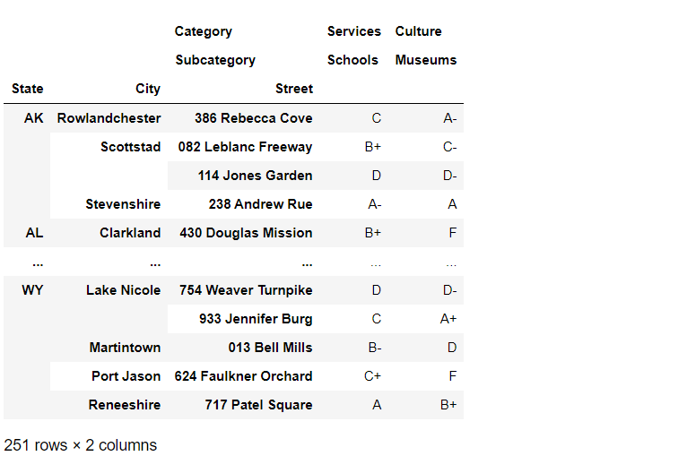

* 코드를 단순화

```python 
columns = [
    ('Services', 'Schools'),
    ('Culture', 'Museums')
]

neighborhoods[columns]
```

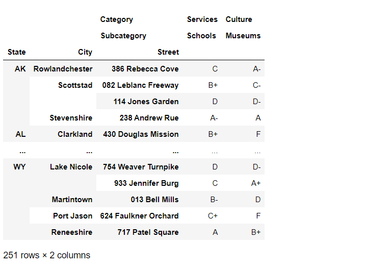


### 4.2 loc으로 하나 이상의 행 추출

* 각 레벨에서 선택할 값을 알고 있다면 대괄호 안에 튜플을 넣을 수 있습니다

```python
neighborhoods.loc[('TX', 'Kingchester', '534 Gordon Falls')]
```

```
Category  Subcategory
Culture   Restaurants     C
          Museums        D+
Services  Police          B
          Schools         B
Name: (TX, Kingchester, 534 Gordon Falls), dtype: object
```


* 대괄호 안에 단일 레이블을 넣으면 판다스는 가장 바깥쪽 MutiIndex 레벨에서 해당 레이블을 찾습니다

```python
neighborhoods.loc['CA']
```

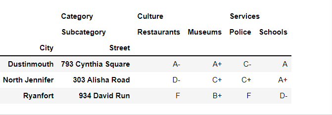


* 일반적으로 대괄호의 두 번째 인수는 추출하려는 열을 나타내지만 MultiIndex의 다음 레벨에서 찾을 값을 나타내기도 합니다. 다시 한번 말하자면 판다스는 레벨이 하나 적은 DataFrame을 반환합니다.

```python
neighborhoods.loc['CA', 'Dustinmouth']
```

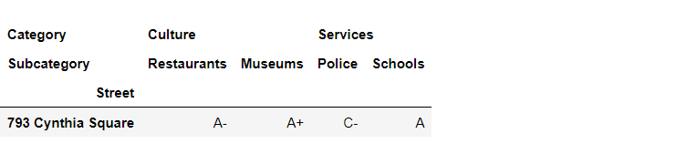


* loc에 두 번째 인수로 추출할 열을 지정할 수도 있습니다. 다음은 행의 MultiIndex에서 State 값이 'CA'이고 열 MultiIndex에서 Category 값이 'Culture'인 행을 추출하는 예제입니다.

```python
neighborhoods.loc['CA', 'Culture']
```

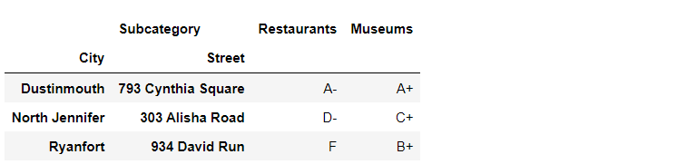

* 이전 두 예제를 보면 loc의 두 번째 인수는 행 MultiIndex의 두 번째 레벨 값을 나타내거나 열 MultiIndex의 첫 번째 레벨 값을 나타냅니다. 인수가 나타내는 대상이 모호하기 때문에 이러한 구문은 지양하는 것이 좋습니다.


* 판다스 문서에서는 불확실성을 없애고자 다음과 같은 인덱싱 기법을 사용할 것을 권장합니다. 인덱싱 기법이란 loc의 첫번째 인수로 행 인덱스 레이블을 사용하고 두번째 인수로 열 인덱스 레이블을 사용하는 기법을 의미합니다. 행이나 열의 인덱스 레이블을 여러 개 지정해야 하는 경우에는 튜플을 사용합니다. 이 표준에 따르면 행 레벨의 값을 튜플로 나타내고 열 레벨의 값도 튜플로 나타내야 합니다. 표준에 따라 State 값이 'CA'이고 City 값이 'Dustinmouth'인 행을 선택하는 표준 방법은 다음과 같습니다.

```python
neighborhoods.loc[('CA', 'Dustinmouth')]
```

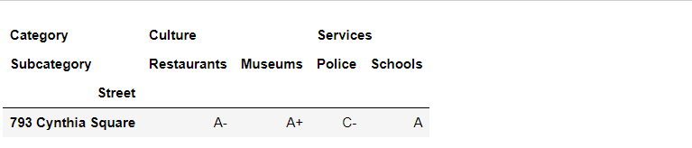


* loc의 두번째 인수가 항상 대상의 열 인덱스 레이블을 나타내기 때문에 이러한 구문이 훨씬 간단하고 일관성 있습니다. 다음은 State가 'CA' 이고 City가 'Dustinmouth'인 Service 열을 가져오는 예제입니다. 'Service'를 튜플에 넣어 loc의 두번째 인수로 전달합니다. 파이썬에서 요소가 하나인 튜플을 나타낼 때는 요소 뒤에 쉼표를 붙여야 합니다.

```python
neighborhoods.loc[('CA', 'Dustinmouth'), ('Services',)]
```

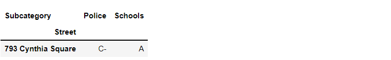

* 여기서 주목할 점이 있습니다. 판다스는 접근자의 인수 유형(리스트 또는 튜플)을 구분합니다. 리스트는 여러 키를 나타내고 튜플은 하나의 다중 레벨 키의 구성 요소를 나타냅니다.


* 열의 MultiIndex에 있는 여러 레벨 값을 튜플로 묶어 loc의 두 번째 인수로 전달할 수 있습니다. 다음 예제에서는 다음과 같이 행과 열의 레벨을 지정합니다.
  * 행의 MultiIndex 레벨에서 'CA'와 'Dustinmouth' 선택
  * 열의 MultiIndex 레벨에서 'Services'와 'Schools' 선택
* 'Services'와 'Schools'를 하나의 튜플로 묶으면 판다스가  이 조합을 하나의 레이블을 구성하는 요소로 이해합니다. 'Services'는 Category 레벨의 값이고 'Schools'는 Subcategory 레벨의 값입니다.

```python
neighborhoods.loc[('CA', 'Dustinmouth'), ('Services', 'Schools')]
```

```
Street
793 Cynthia Square    A
Name: (Services, Schools), dtype: object
```


* 연속된 행을 선택하는 방법도 있습니다. 파이썬의 리스트 슬라이싱 구문을 사용할 수 있습니다. 다음은 State 값이 'NE'와 'NH' 사이인 모든 연속된 행을 가져오는 예제입니다. 판다스 슬라이싱에서 끝점은 결과에 포함됩니다.

```python
neighborhoods['NE':'NH']
```

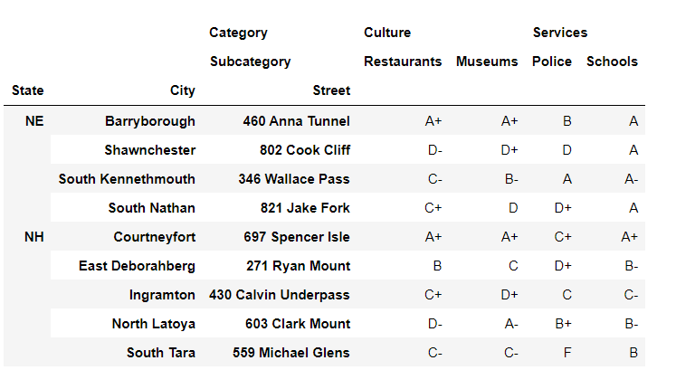


* 리스트 슬라이싱 구문은 튜플 인수와 결합하여 사용할 수 있습니다.
  * State 레벨의 값이 'NE'이고 City 레벨의 값이 'Shawnchester'인 행부터
  * State 레벨의 값이 'NH'이고 City 레벨의 값이 'North Latoya'인 행까지

```python
neighborhoods.loc[('NE', 'Shawnchester'):('NH', 'North Latoya')]
```

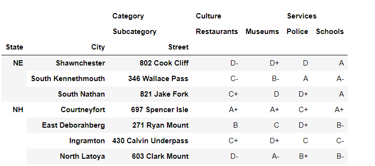


* 이 구문을 사용할 때는 주의해야 합니다. 괄호나 쉼표를 하나만 누락해도 예외가 발생할 수 있습니다. 튜플을 변수에 할당하고 추출 구문을 작은 단위로 나누면 코드를 단순화 할 수 있습니다. 다음 예제는 이전 예제와 결과가 동일하지만 가독성이 훨씬 높습니다.

```python
start = ('NE', 'Shawnchester')
end = ('NH', 'North Latoya')
neighborhoods.loc[start:end]
```

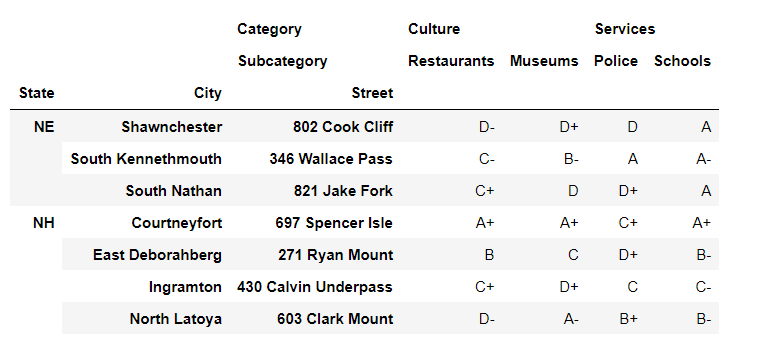


* 모든 레벨에 대한 튜플 값을 제공할 필요는 없습니다. 다음은 두 번째 튜플에 City 레벨의 값이 없는 예제입니다.

```python
neighborhoods.loc[('NE', 'Shawnchester'):('NH')]
```

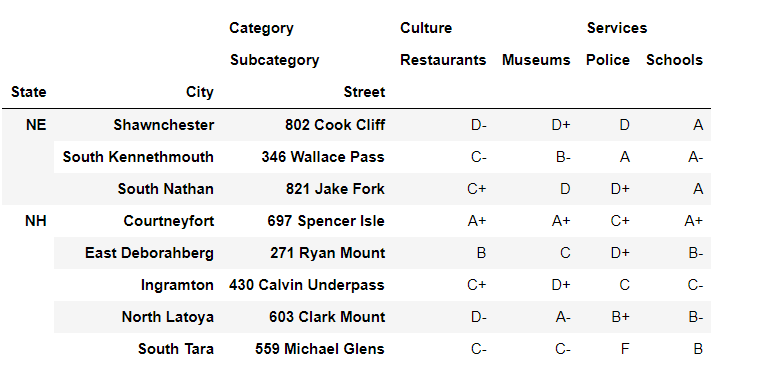


### 4.3 iloc으로 하나 이상의 행 추출


* iloc 접근자는 인덱스 위치에 따라 행과 열을 추출합니다

```python
neighborhoods.iloc[25]
```

```
Category  Subcategory
Culture   Restaurants    A+
          Museums         A
Services  Police         A+
          Schools        C+
Name: (CT, East Jessicaland, 208 Todd Knolls), dtype: object
```


* 행 및 열 인덱스를 나타내는 2개의 인수를 iloc에 전달할 수 있습니다.

```python
neighborhoods.iloc[25, 2]
```

```
'A+'
```


* 행의 인덱스 위치를 리스트에 넣어 iloc에 전달하면 여러 행을 가져올 수 있습니다

```python
neighborhoods.iloc[[25, 30]]
```

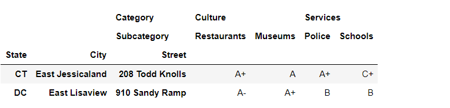


* loc과 iloc은 슬라이싱에서 차이가 있습니다. iloc으로 인덱스 슬라이싱을 할 때 끝점은 결과에 포함되지 않습니다.

```python
neighborhoods.iloc[25:30]
```

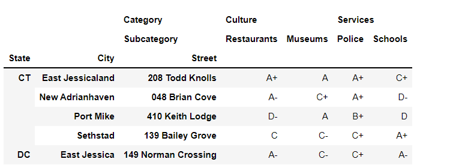


* 열 슬라이싱도 동일한 규칙을 따릅니다. 다음은 위치 1에서 3까지의 열을 가져오는 예제 입니다. 

```python
neighborhoods.iloc[25:30, 1:3]
```

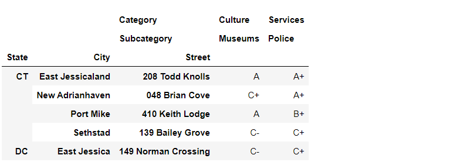


* 판다스는 음수 슬라이스도 허용합니다. 다음은 마지막에서 네번째 행에서 시작하는 행과 마지막에서 두번째 열에서 시작하는 열을 가져오는 예제입니다.

```python
neighborhoods.iloc[-4:, -2:]
```

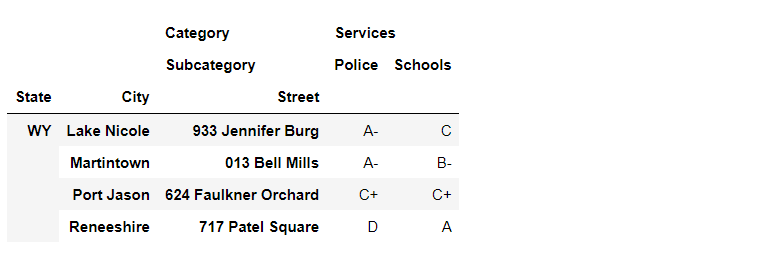

* 판다스는 DataFrmae의 각 행에 주어진 인덱스 레벨의 값이 아니라 인덱스 위치를 할당합니다. 따라서 iloc으로는 연속적인 MultiIndex 레벨에 걸쳐 인덱싱할 수 없습니다.


## 05. 단면 추출

* xs 메서드에 하나의 MultiIndex 레벨에 대한 값을 넘기면 행을 추출할 수 있습니다. 찾고자 하는 값을 key 매개변수로 전달하고 값을 찾을 인덱스 레벨의 이름이나 숫자 위치를 level 매개변수로 전달할 수 있습니다.

```python
# 다음 두 줄은 결과가 동일합니다
neighborhoods.xs(key = 'Lake Nicole', level = 1)
neighborhoods.xs(key = 'Lake Nicole', level = 'City')
```

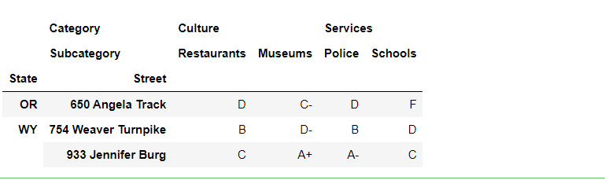


* axis 매개변수의 인수로 'columns'를 전달하여 동일한 추출 기법을 열에 적용할 수 있습니다. 다음은 열의 MultiIndex에 있는 Subcategory 레벨에서 'Museums' 키가 있는 열을 선택하는 예제입니다.

```python
neighborhoods.xs(
    axis = 'columns', key = 'Museums', level = 'Subcategory'
).head()
```

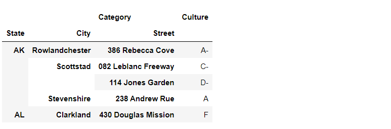


* xs 메서드를 사용하여 비연속적인 MultiIndex 레벨에 걸쳐 키를 찾을 수 있습니다. 키를 튜플로 전달하면 됩니다. City 값에 상관없이 Street 값이 '238 Andrew Rue'이고 State값이 'AK'인 행을 찾는다고 가정하겠습니다.

```python
# 다음 두 줄을 결과가 동일합니다
neighborhoods.xs(
    key = ('AK', '238 Andrew Rue'), level = ['State', 'Street']
)

neighborhoods.xs(
    key = ('AK', '238 Andrew Rue'), level = [0, 2]
)
```

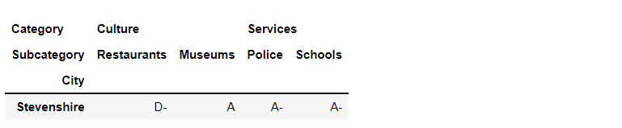


## 06. 인덱스 조작


* 이 장의 시작 부분에서 read_csv 함수의 매개변수를 변경하여 neighborhoods 데이터셋을 실습하기 편한 형태로 변환했었죠, 판다스를 사용하면 기존 DataFrame의 인덱스를 조작할 수 도 있습니다.


### 6.1 인덱스 재설정

```python
neighborhoods.head()
```

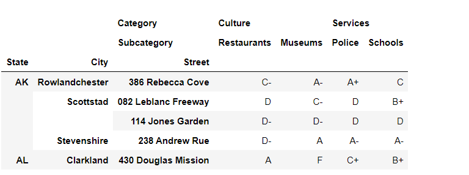


* reorder_levels 메서드는 MultiIndex 레벨을 지정된 순서로 정렬합니다. 원하는 순서로 레벨 리스트를 구성하여 order 매개변수에 전달하면 됩니다. 다음은 City와 State 레벨의 위치를 바꾼 예제입니다.

```python
new_order = ['City', 'State', 'Street']
neighborhoods.reorder_levels(order = new_order).head()
```

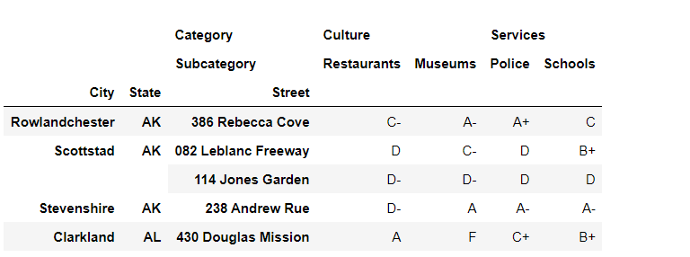


* 매개변수 order에 정수 리스트를 전달할 수도 있습니다. 각 숫자는 MultiIndex 레벨의 현재 인덱스 위치를 나타내야 합니다. 예를 들어 State가 새 MultiIndex의 첫 번째 레벨이 되도록 하려면 현재 MultiIndex에서 State 레벨의 인덱스 위치인 1을 리스트의 첫번째 요소로 넣어야 합니다.

```python
neighborhoods.reorder_levels(order = [1, 0, 2]).head()
```

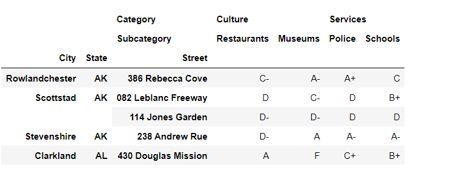


* 인덱스를 없애고 싶다면 어떨까요? 다른 열 조합을 인덱스 레이블로 설정하고 싶을 수도 있겠죠. reset_index 메서드는 이전 MultiIndex 레벨을 열로 통합하는 새 DataFrame을 반환합니다.

```python
neighborhoods.reset_index().tail()
```

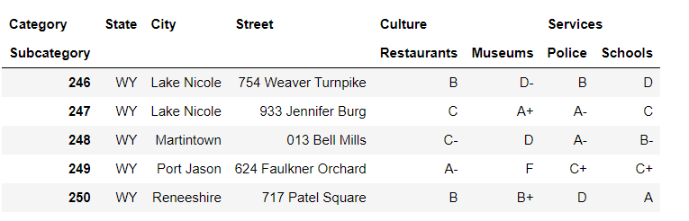

* 3개의 새로운 열(State, City, Street)은 열 MultiIndex의 가장 바깥쪽 레벨인 Category의 새로운 값이 됩니다. 열 간의 일관성을 보장하기 위해, 즉 Category와 Subcategory의 값을 튜플로 만들기 위해 판다스는 3개의 새로운 열의 Subcategory 값으로 빈 문자열을 할당합니다.


* 3개의 열을 다른 MultiIndex 레벨에 추가할 수도 있습니다. 레벨의 인덱스 위치 또는 이름을 reset_index 메서드의 col_level 매개변수로 전달합니다. 다음은 State, City, Street 열을 MultiIndex의 Subcategory 레벨로 통합하는 예제입니다.

```python
# 다음 두 줄은 결과가 동일합니다
neighborhoods.reset_index(col_level = 1).tail()
neighborhoods.reset_index(col_level = 'Subcategory').tail()
```

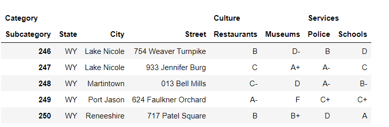


* 이제 판다스는 Subcategory 레벨에 속하는 State, City, Street의 상위 레벨 Category에 빈 문자열을 할당합니다. col_fill 매개변수에 인수를 전달하면 빈 문자열을 원하는 값으로 바꿀 수 있습니다. 다음은 3개의 새로운 열의 상위 레벨로 Adress를 지정하는 예제입니다. 이제 바깥쪽 Category 레벨은 Address, Culture, Service라는 세 가지 고유한 값을 가집니다.

```python
neighborhoods.reset_index(
    col_fill = 'Address', col_level = 'Subcategory'
).tail()
```

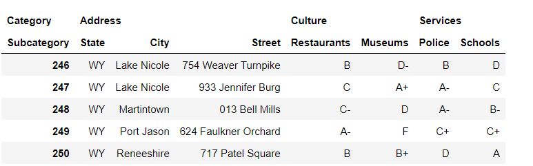


* reset_index을 매개변수 없이 호출하면 모든 인덱스 레벨을 일반 열로 반환합니다. 또한 level 매개변수에 이름은 전달하여 하나의 인덱스 레벨을 열로 옮길 수 있습니다. 다음은 Street 레벨을 MultiIndex에서 일반 DataFrame 열로 옮기는 예제입니다.

```python
neighborhoods.reset_index(level = 'Street').tail()
```


* 여러 인덱스 레벨을 리스트로 전달하여 열로 옮길 수도 있습니다.

```python
neighborhoods.reset_index(level = ['Street', 'City']).tail()
```

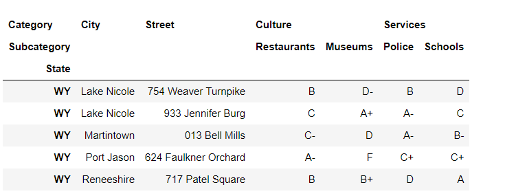


* MultiIndex에서 레벨을 제거하는 방법도 있을까요? reset_index 메서드의 drop 매개변수 값을 True로 전달하면 판다스는 지정된 레벨을 추가하는 대신 삭제합니다. 다음의 reset_index 예제는 Street 레벨을 제거합니다

```python
neighborhoods.reset_index(level = 'Street', drop = True).tail()
```

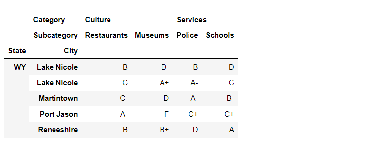


* 다음 절 실습을 위해서 인덱스를 재설정

```python
neighborhoods = neighborhoods.reset_index()
```


### 6.2 인덱스 설정

```python
neighborhoods.head(3)
```

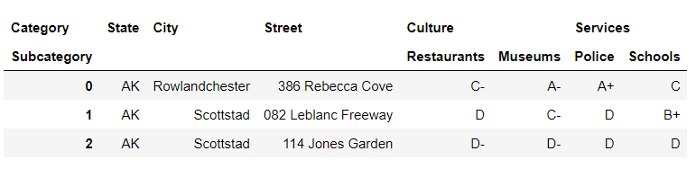


* set_index 메서드는 하나 이상의 DataFrame 열을 새로운 인덱스로 설정합니다. keys 매개변수에 사용할 열을 전달합니다.

```python
neighborhoods.set_index(keys = 'City').head()
```

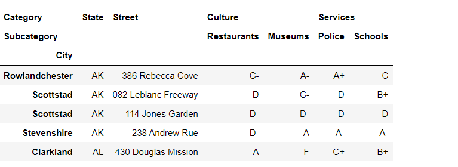


* 마지막 4개 열 중 하나를 인덱스로 사용하려면 어떻게 해야 할까요? 다음 예제에서는 각 MultiIndex 레벨에서 대상으로 지정할 값을 담은 튜플을 keys 매개변수로 넘깁니다.

```python
neighborhoods.set_index(keys = ('Culture', 'Museums')).head()
```

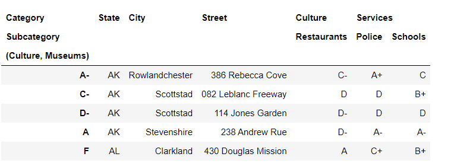


* 행 축에 MultiIndex를 생성하려면 여러 열이 있는 리스트를 Keys 매개변수로 전달합니다.

```python
neighborhoods.set_index(keys = ['State', 'City']).head()
```

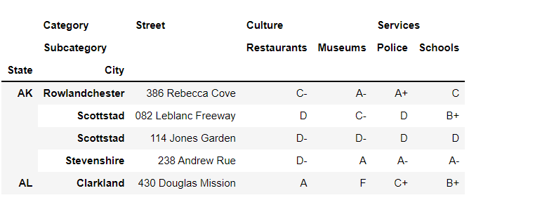

