# Chapter 07. 피벗


## 01. 넓은 데이터와 좁은 데이터


### 1.1 넓은 데이터


- 넓은 데이터셋은 값을 추가할 때 가로로 확장된다

- Monday(월요일)이 weekday의 유형인 점과 다르게 100은 Miami 유형이 아니다. 데이터셋이 도시의 종류를 열 헤더에 저장하기 때문에 도시라는 변수는 눈에 띄지 않는다

- 넓은 데이터셋은 장점은 전체 그림을 볼 때 유용하다. Monday와 Tuesday에 각 도시의 기온이 어땠는지 살펴보고 싶다면 이 데이터셋이 보기 편하다
- 넓은 데이터셋의 단점은 열을 추가할수록 작업하기 더 어려워진다


### 1.2 좁은 데이터


- 좁은 데이터셋은 값을 추가할 때 세로로 확장된다
- 좁은 데이터의 장점은 기존 데이터를 조작하고 새로운 레코드를 추가하기 쉽다. 그리고 각 변수는 별개의 열로 분리된다
- 좁은 데이터의 단점은 전체 그림을 볼 때 어렵다.  예를 들어 각 도시의 Monday에 기온이 어땠는지 파악하기 어렵다.


## 02. 피벗 테이블


### 데이터셋

- 가상 기업의 비지니스 거래목록(sales)

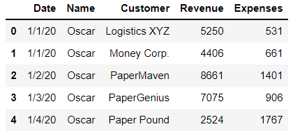


### 2.1 pivot_table 메서드

- 피벗 테이블은 열의 값을 집계하고 다른 열의 값을 사용하여 결과를 그룹화한다. 집계(aggregate)라는 단어는 여러 값을 요약하는 계산을 나타낸다. 예를 들어 평균, 합계, 중앙값 및 개수가 집계에 포함된다.

- 피벗 테이블은 다음과 같이 4단계를 거쳐 생성할 수 있다.
  - 1. 값을 집계할 열을 선택한다
    2. 열에 적용할 집계 연산을 선택한다
    3. 값이 집계된 데이터를 범주로 그룹화할 열을 선택한다
    4. 그룹을 행 축, 열 축 또는 두 축 모두에 배치할지 여부를 결정한다

- 날짜별 수익을 합산하고 각 영업 사원이 일일 총계에 기여한 금액을 확인해보자


### (예시1)

- 값을 집계할 열을 선택한다


- 기본 집계 연산은 평균이다

```python
# 다음 두 줄의 코드는 결과가 동일합니다
sales.pivot_table(index = 'Date')
sales.pivot_table(index = 'Date', aggfunc = 'mean')
```

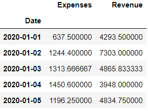


### (예시2)

- 열에 적용할 집계 연산을 선택한다

```python
sales.pivot_table(index = 'Date', aggfunc = 'sum')
```

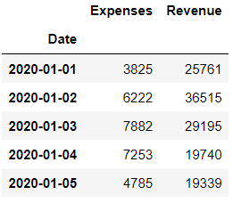


### (예시3)

- 값이 집계된 데이터를 범주로 그룹화할 열을 선택한다

- values 매개변수로 집계할 DataFrame의 열을 지정할 수 있다

```python
sales.pivot_table(
    index = 'Date', values = 'Revenue', aggfunc = 'sum'
)
```

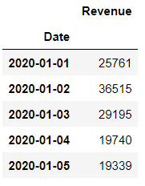


### (예시4)

- 그룹을 행 축, 열 축 또는 두 축 모두에 배치할지 여부를 결정한다

```python
sales.pivot_table(
    index = 'Date',
    columns = 'Name',
    values = 'Revenue',
    aggfunc = 'sum'
)
```

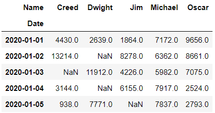


- 추가작업

```python
sales.pivot_table(
    index = 'Date',
    columns = 'Name',
    values = 'Revenue',
    aggfunc = 'sum',
    fill_value = 0,
    margins = True,
    margins_name = 'Total'
)
```

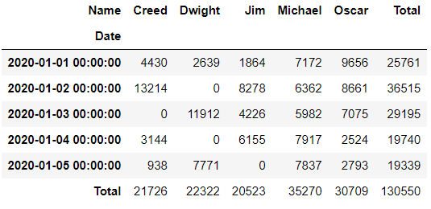


### (정리)

|   매개변수   |               설명               |
| :----------: | :------------------------------: |
|    index     | 인덱스 레이블을 구성할 열을 지정 |
|   aggfunc    |         집계 함수를 지정         |
|    values    |         집계할 열을 지정         |
|   columns    |          열 헤더를 지정          |
|  fill_value  |      NaN을 특정 값으로 대체      |
|   margins    |      각 행과 열에 대한 합계      |
| margins_name |     margins에 대한 이름 지정     |


- aggfunc 매개변수에 적용할 수 있는 몇 가지 추가 옵션

|  인수  |                설명                 |
| :----: | :---------------------------------: |
|  max   |         그룹에서 가장 큰 값         |
|  min   |        그룹에서 가장 작은 값        |
|  std   |     그룹에 있는 값의 표준 편차      |
| median |   그룹에 있는 값의 중앙값(중간점)   |
|  size  | 그룹에 있는 값의 개수(count와 동일) |


### 2.2 피벗 테이블의 추가 예시


### (예시1)

- 집계 함수 리스트를 aggfunc 매개변수에 전달할 수도 있다

```python
sales.pivot_table(
    index = 'Date',
    columns = 'Name',
    values = 'Revenue',
    aggfunc = ['sum', 'count'],
    fill_value = 0
)
```

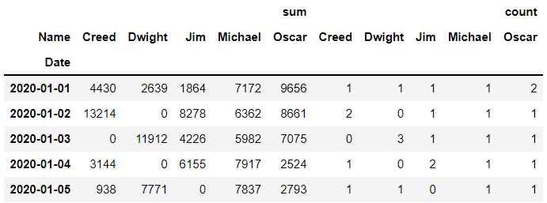


### (예시2)

- aggfunc 매개변수에 딕셔너리를 전달하여 열별로 서로 다른 집계를 적용할 수 있다

```python
sales.pivot_table(
    index = 'Date',
    columns = 'Name',
    values = ['Revenue', 'Expenses'],
    fill_value = 0,
    aggfunc = {'Revenue':'min', 'Expenses':'min'}
)
```

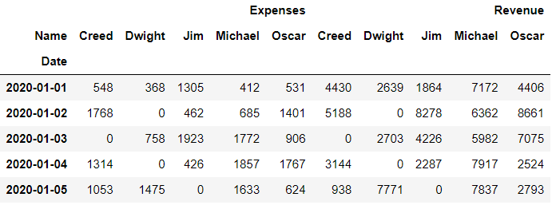


### (예시3)

- index 매개변수에 열 리스트를 전달하여 단일 축에 여러 그룹을 쌓을 수도 있다

```python
sales.pivot_table(
    index = ['Name', 'Date'], values = 'Revenue', aggfunc = 'sum'
).head(10)
```

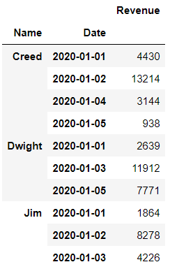


## 03. 스택과 언스택


### 3.1 스택


### 데이터셋

- by_name_and_date


### (예시)

- stack 메서드는 인덱스 레벨을 열 축에서 행 축으로 이동한다

```python
by_name_and_date.stack().head(7)
```

```
Name    Date      
Creed   2020-01-01     4430.0
        2020-01-02    13214.0
        2020-01-04     3144.0
        2020-01-05      938.0
Dwight  2020-01-01     2639.0
        2020-01-03    11912.0
        2020-01-05     7771.0
dtype: float64
```


### 3.2 언스택


### 데이터셋

- sales_by_customer

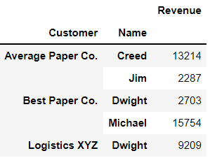


### (예시)

- stack 메서드는 인덱스 레벨을 행 축에서 열 축으로 이동한다

- unstack 메서드는 행 인덱스의 가장 안쪽 레벨부터 열 인덱스로 옮긴다.

```python
sales_by_customer.unstack()
```

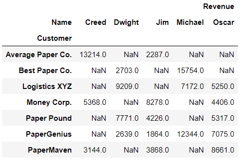


## 04. 피벗 해제

- melt 메서드로 DataFrame을 피벗 해제한다. 피벗 해제는 멜팅이라고도 하며 멜팅은 넓은 데이터셋을 좁은 데이터셋으로 변환하는 과정을 의미한다


### 데이터셋

- 지역별 비디오 게임 판매목록(video_game_sales)
- 41.94는 NA(북미)의 유형이나 NA의 측정값이 아니다. NA열의 실제 변수 데이터는 판매량이다. 그러므로 이 데이터셋은 좁은 데이터셋이다

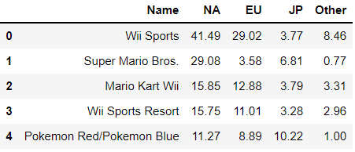


### (예시1)

```python
video_game_sales.melt(id_vars = 'Name', value_vars = 'NA').head()
```

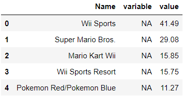


### (예시2)

```python
regional_sales_columns = ['NA', 'EU', 'JP', 'Other']
```

```python
video_game_sales_by_region = video_game_sales.melt(
    id_vars = "Name", 
    value_vars = regional_sales_columns,
    var_name = "Region",
    value_name = "Sales"
)

video_game_sales_by_region.head()
```

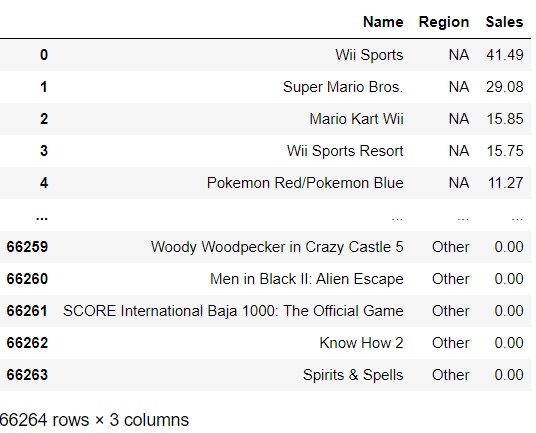


### (정리)

|  매개변수  |                  설명                  |
| :--------: | :------------------------------------: |
|  id_vars   |      데이터를 집계하는 열을 설정       |
| value_vars | 피벗 해제되어 새 열에 저장될 열을 설정 |
|  var_name  |            열1 이름을 지정             |
| value_name |            열2 이름을 지정             |


## 05. 값의 분할


### 데이터셋

- 레시피(recipes)

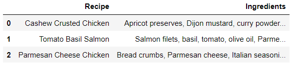


### (예시)

- 재료(Ingredients)의 값을 분할하여 행으로 만들자

```python
recipes['Ingredients'] = recipes['Ingredients'].str.split(',')
recipes
```

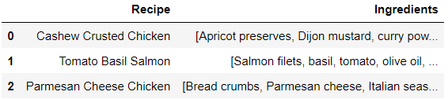


- explode 메서드는 각 리스트 요소를 별도의 행으로 생성한다

```python
recipes.explode('Ingredients')
```

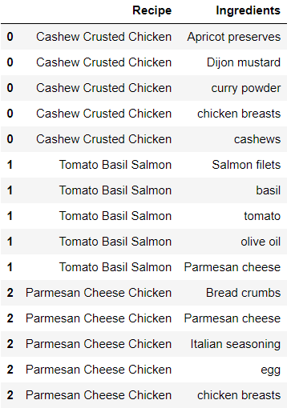