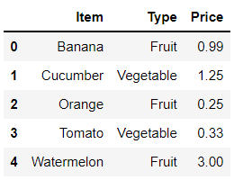
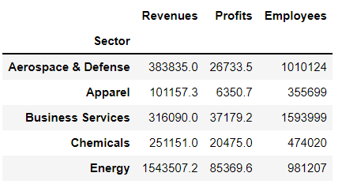

# Chapter 08. 재구성과 피벗


- 한 연구에 따르면 데이터 분석의 80%는 데이터를 정리하고 적절한 형태로 변형하는 것 입니다. 이 장에서는 데이터셋을 원하는 형태로 변형할 수 있도록 새로운 판다스 기술을 소개합니다 먼저 큰 데이터셋을 간결한 피벗 테이블로 요약하는 방법을 살펴봅니다. 그런 다음 집계된 데이터셋을 집계된 데이터셋을 분할하는 방법을 알아보면서 반대로 변환하는 방법도 공부합니다.


## 01. 넓은 데이터와 좁은 데이터

- 넓은 데이터셋은 값을 추가할 때 가로로 확장된다.
- 좁은 데이터셋은 값을 추가할 때 세로로 확장된다.


```
   weekday  Miami New York
0  Monday    100     65
1  Tuesday   105     70
```

- 위의 데이터셋에는 3개의 변수가 있다. (요일, 기온, 도시)
- 위 데이터셋은 하나가 아닌 2개의 열에 동일한 변수(기온)를 저장합니다. Miami와 New York 헤더는 열이 저장하는 데이터의 유형을 나타내지 않습니다. 즉, Monday(월요일)이 Weekday의 유형인 점과 다르게 100은 Miami 유형이 아닙니다. 데이터셋이 도시의 종류를 열 헤더에 저장하기 때문에 도시라는 변수는 눈에 띄지 않습니다.

```
   weekday  Miami New York Chicago  San Francisco
0  Monday    100     65       50        60
1  Tuesday   105     70       58        62
```

- 도시 2개의 기온을 측정하여 데이터셋에 추가한다고 가정할 경우 가로로 확장된다.
- 넓은 데이터셋은 전체 그림을 볼 때 유용합니다. Monday와 Tuesday에 각 도시의 기온이 어땠는지 살펴보고 싶다면 이 데이터셋이 보기 편합니다.
- 넓은 데이터셋의 단점은 열을 추가할수록 작업하기 더 어려워집니다.


```
   Weekday    City   Temperature
0  Monday     Miami     100
1  Monday   New York     65
2  Tuesday    Miami     105
3  Tuesday  New York     70
```

- 좁은 데이터셋을 세로로 확장합니다. 좁은 형식을 사용하면 기존 데이터를 조작하고 새로운 레코드를 추가하기 쉽습니다. 각 변수는 별개의 열로 분리됩니다.

```
   Weekday    City   Temperature
0  Monday     Miami     100
1  Monday   New York     65
2  Tuesday    Miami     105
3  Tuesday  New York     70
...
7  Tuesday San Francisco 62
```

- 각 도시의 Monday에 기온이 어땠는지 파악하기 어렵다. 하지만 대신 기온 값을 Temperature라는 새로운 열로 분리했기 때문에 평균 기온을 계산하기 쉽습니다
- 최적의 데이터셋 저장 형식은 분석가가 데이터셋으로부터 수집하려는 정보에 따라 다릅니다. 판다스는 좁은 형식에서 넓은 형식으로 또는 그 반대로 DataFrame을 변환하는 도구를 제공합니다.


## 02. DataFrame에서 피벗 테이블 생성


- sales_by_employee.csv는 가상 기업의 비즈니스 거래 목록입니다. 각 행은 거래 날짜(Data), 영업 사원의 이름(Name), 고객(Customer), 거래의 수익(Revenue), 비용(Expenses)을 포함합니다.

```python
import pandas as pd

sales = pd.read_csv('sales_by_employee.csv',
                   parse_dates = ['Date'])
sales.tail()
```

```
Date	Name	Customer	Revenue	Expenses
21	2020-01-01	Creed	Money Corp.	4430	548
22	2020-01-02	Creed	Average Paper Co.	8026	1906
23	2020-01-02	Creed	Average Paper Co.	5188	1768
24	2020-01-04	Creed	PaperMaven	3144	1314
25	2020-01-05	Creed	Money Corp.	938	1053
```


### 2.1 pivot_table 메서드

- 피벗 테이블은 열의 값을 집계하고 다른 열의 값을 사용하여 결과를 그룹화합니다. 집계(aggregate)라는 단어는 여러 값을 요약하는 계산을 나타냅니다. 예를 들어 평균, 합계, 중앙값 및 개수가 집계에 포함됩니다. 판다스의 피벗 테이블은 마이크로소프트 엑셀의 피벗 테이블 기능과 유사합니다.

- 날짜별 수익을 합산하고 각 영업 사원이 일일 총계에 기여한 금액을 확인하려면 어떻게 해야할까요?
- 피벗 테이블은 다음과 같이 4단계를 거쳐 생성할 수 있습니다.
  - 1. 값을 집계할 열을 선택합니다.
    2. 열에 적용할 집계 연산을 선택합니다.
    3. 값이 집계된 데이터를 범주로 그룹화할 열을 선택합니다.
    4. 그룹을 행 축, 열 축 또는 두 축 모두에 배치할지 여부를 결정합니다.


- 한 단계씩 진행하겠습니다.
- index 매개변수로 피벗 테이블의 인덱스 레이블을 구성할 열을 지정합니다.
- 판다스는 DataFrame의 모든 숫자 열에 기본 집계 연산인 평균을 적용합니다.

```python
sales.pivot_table(index = 'Date')
```

```
               Expenses	  Revenue
Date		
2020-01-01	637.500000	4293.500000
2020-01-02	1244.400000	7303.000000
2020-01-03	1313.666667	4865.833333
2020-01-04	1450.600000	3948.000000
2020-01-05	1196.250000	4834.750000
```


- aggfunc 매개변수를 사용하여 집계 함수를 선언하겠습니다.

```python
# 다음 두 줄의 코드는 결과가 동일합니다
sales.pivot_table(index = 'Date')
sales.pivot_table(index = 'Date', aggfunc = 'mean')
```

```
               Expenses	  Revenue
Date		
2020-01-01	637.500000	4293.500000
2020-01-02	1244.400000	7303.000000
2020-01-03	1313.666667	4865.833333
2020-01-04	1450.600000	3948.000000
2020-01-05	1196.250000	4834.750000
```

```python
sales.pivot_table(index = 'Date', aggfunc = 'sum')
```

```
          Expenses	Revenue
Date		
2020-01-01	3825	25761
2020-01-02	6222	36515
2020-01-03	7882	29195
2020-01-04	7253	19740
2020-01-05	4785	19339
```


- values 매개변수로 판다스가 집계할 DataFrame의 열을 지정할 수 있습니다.
- 여러 열을 걸쳐 값을 집계하려면 열의 리스트를  values에 전달하면 됩니다.

```python
sales.pivot_table(
    index = 'Date', values = 'Revenue', aggfunc = 'sum'
)
```

```
           Revenue
Date	
2020-01-01	25761
2020-01-02	36515
2020-01-03	29195
2020-01-04	19740
2020-01-05	19339
```


- Name 열의 고유값을 피벗 테이블의 열 헤더로 지정하겠습니다. 메서드를 호출할 때 columns 매개변수에 'Name'을 인수로 전달합니다.

```python
sales.pivot_table(
    index = 'Date',
    columns = 'Name',
    values = 'Revenue',
    aggfunc = 'sum'
)
```

```
Name	Creed	Dwight	Jim	Michael	Oscar
Date					
2020-01-01	4430.0	2639.0	1864.0	7172.0	9656.0
2020-01-02	13214.0	NaN	8278.0	6362.0	8661.0
2020-01-03	NaN	11912.0	4226.0	5982.0	7075.0
2020-01-04	3144.0	NaN	6155.0	7917.0	2524.0
2020-01-05	938.0	7771.0	NaN	7837.0	2793.0
```

- 데이터셋에 NaN이 있다는 점에 주목하세요. NaN은 영업 사원이 주어진 날짜에 대한 Revenue 값을 가지는 행이 없음을 나타냅니다. 하지만 피벗 테이블에는 해당 날짜에 대한 Revenue 값이 있는 나머지 네 명의 영업 사원을 위해 인덱스 레이블이 있어야 합니다. 판다스는  NaN으로 누락된 구멍을 연결합니다. NaN 값이 있으면 정수를 부동소수점 숫자로 강제 변환합니다.


- fill_value 매개변수를 사용하여 모든 피벗 테이블의 NaN을 특정 값으로 대체할 수 있습니다.

```python
sales.pivot_table(
    index = 'Date',
    columns = 'Name',
    values = 'Revenue',
    aggfunc = 'sum',
    fill_value = 0
)
```

```
Name	Creed	Dwight	Jim	Michael	Oscar
Date					
2020-01-01	4430	2639	1864	7172	9656
2020-01-02	13214	0	8278	6362	8661
2020-01-03	0	11912	4226	5982	7075
2020-01-04	3144	0	6155	7917	2524
2020-01-05	938	7771	0	7837	2793
```


- 날짜와 영업 사원의 각 조합에 대한 수입 소계를 구하고 싶다고 가정하겠습니다. margins 매개변수에 인수로  True를 전달하여 각 행과 열에 대한 합계를 구할 수 있습니다.

```python
sales.pivot_table(
    index = 'Date',
    columns = 'Name',
    values = 'Revenue',
    aggfunc = 'sum',
    fill_value = 0,
    margins = True
)
```

```
Name	Creed	Dwight	Jim	Michael	Oscar	All
Date						
2020-01-01 00:00:00	4430	2639	1864	7172	9656	25761
2020-01-02 00:00:00	13214	0	8278	6362	8661	36515
2020-01-03 00:00:00	0	11912	4226	5982	7075	29195
2020-01-04 00:00:00	3144	0	6155	7917	2524	19740
2020-01-05 00:00:00	938	7771	0	7837	2793	19339
All	21726	22322	20523	35270	30709	130550
```

- 행 레이블에 'All'이 추가되면서 날짜값에 시간, 분과 초가 포함됩니다. 판다스는 행 레이블에  'All'이 추가되면서 Data 열에 대해 날짜와 문자열 인덱스 레이블을 모두 지원해야 합니다. 문자열은 날짜 또는 텍스트 값을 모두 나타낼 수 있는 유일한 데이터 유형이기 때문에 라이브러리는 날짜를 나타내는 DatetimeIndex를 문자열을 나타내는 일반 Index로 변환합니다. 날짜/시간 객체를 문자열 표현으로 변환할 때 판다스는 시간을 포함합니다. 또한 시간이 없는 날짜는 하루의 시작인 0시 0분 0초라고 가정합니다.


- margins_name 매개변수를 사용하여 소계 레이블을 사용자 정의할 수 있습니다. 다음은 레이블을 'All'에서 'Total'로 변경하는 예제입니다.

```python
sales.pivot_table(
    index = 'Date',
    columns = 'Name',
    values = 'Revenue',
    aggfunc = 'sum',
    fill_value = 0,
    margins = True,
    margins_name = 'Total'
)
```

```
Name	Creed	Dwight	Jim	Michael	Oscar	Total
Date						
2020-01-01 00:00:00	4430	2639	1864	7172	9656	25761
2020-01-02 00:00:00	13214	0	8278	6362	8661	36515
2020-01-03 00:00:00	0	11912	4226	5982	7075	29195
2020-01-04 00:00:00	3144	0	6155	7917	2524	19740
2020-01-05 00:00:00	938	7771	0	7837	2793	19339
Total	21726	22322	20523	35270	30709	130550
```


### 2.2 피벗 테이블의 추가 기능

- aggfunc 매개변수에 개수를 나타내는 'count'를 인수로 전달하여 날짜와 영업 사원의 각 조합에 대한 거래 행 개수를 계산할 수 있습니다.

```python
sales.pivot_table(
    index = 'Date',
    columns = 'Name',
    values = 'Revenue',
    aggfunc = 'count'
)
```

```
Name	Creed	Dwight	Jim	Michael	Oscar
Date					
2020-01-01	1.0	1.0	1.0	1.0	2.0
2020-01-02	2.0	NaN	1.0	1.0	1.0
2020-01-03	NaN	3.0	1.0	1.0	1.0
2020-01-04	1.0	NaN	2.0	1.0	1.0
2020-01-05	1.0	1.0	NaN	1.0	1.0
```


- aggfunc 매개변수에 적용할 수 있는 몇 가지 추가 옵션은 다음 표와 같습니다.

|  인수  |                설명                 |
| :----: | :---------------------------------: |
|  max   |         그룹에서 가장 큰 값         |
|  min   |        그룹에서 가장 작은 값        |
|  std   |     그룹에 있는 값의 표준 편차      |
| median |   그룹에 있는 값의 중앙값(중간점)   |
|  size  | 그룹에 있는 값의 개수(count와 동일) |


- 집계 함수 리스트를 aggfunc 매개변수에 전달할 수도 있습니다. 피벗 테이블은 열 축에  MutiIndex를 만들고 가장 바깥쪽 레벨에 집계를 저장합니다.  다음은 날짜별 수익 합계와 날짜별 수익 개수를 모두 집계하는 예제입니다.

```python
sales.pivot_table(
    index = 'Date',
    columns = 'Name',
    values = 'Revenue',
    aggfunc = ['sum', 'count'],
    fill_value = 0
)
```




- aggfunc 매개변수에 딕셔너리를 전달하여 열별로 서로 다른 집계를 적용할 수 있습니다. 딕셔너리의 키를 사용하여 DataFrame 열을 식별하고 값을 사용하여 집계를 설정합니다. 다음은 날짜와 영업 사원의 각 조합에 대한 최소 수익과 최대 비용을 추출하는 예제입니다.

```python
sales.pivot_table(
    index = 'Date',
    columns = 'Name',
    values = ['Revenue', 'Expenses'],
    fill_value = 0,
    aggfunc = {'Revenue':'min', 'Expenses':'min'}
)
```


- index 매개변수에 열 리스트를 전달하여 단일 축에 여러 그룹을 쌓을 수도 있습니다. 다음은 행 축에서 영업 사원 및 날짜별로 비용 합계를 집계하는 예제입니다. 판다스는 2레벨 MultiIndex가 있는 DataFrame을 반환합니다.

```python
sales.pivot_table(
    index = ['Name', 'Date'], values = 'Revenue', aggfunc = 'sum'
).head(10)
```


## 03. 인덱스 레벨 스택과 언스택

```python
sales.head()
```

```
Date	Name	Customer	Revenue	Expenses
0	2020-01-01	Oscar	Logistics XYZ	5250	531
1	2020-01-01	Oscar	Money Corp.	4406	661
2	2020-01-02	Oscar	PaperMaven	8661	1401
3	2020-01-03	Oscar	PaperGenius	7075	906
4	2020-01-04	Oscar	Paper Pound	2524	1767
```


- sales를 피벗하여 영업 사원의 이름과 날짜별로 수익을 구성해봅시다.

```python
by_name_and_date = sales.pivot_table(
    index = 'Name',
    columns = 'Date',
    values = 'Revenue',
    aggfunc = 'sum'
)

by_name_and_date.head(2)
```


- 인덱스 레벨을 한 축에서 다른 축으로 이동하고 싶다고 가정하겠습니다.
- stack 메서드는 인덱스 레벨을 열 축에서 행 축으로 이동합니다.
- 판다스는 Name과 Date라는 두 가지 행 레벨을 MultiIndex에 저장합니다. 값의 열이 하나만 남아있기 때문에 판다스는 Series를 반환합니다.

```python
by_name_and_date.stack().head(7)
```

```
Name    Date      
Creed   2020-01-01     4430.0
        2020-01-02    13214.0
        2020-01-04     3144.0
        2020-01-05      938.0
Dwight  2020-01-01     2639.0
        2020-01-03    11912.0
        2020-01-05     7771.0
dtype: float64
```

- DataFrame에 있던 NaN이 결과 Series에서는 보이지 않습니다. 판다스는 행과 열의 구조적인 무결성을 유지하기 위해  by_name_and_date 피벗 테이블에 NaN이 있는 셀을 유지했지만 인덱스 레이블 축을 옮긴 MultiIndex Series에서는 NaN 값을 버릴 수 있습니다.


- unstack 메서드는 인덱스 레벨을 행 축에서 열 축으로 옮깁니다. 다음 피벗 테이블은 고객 및 영업 사원별로 수익을 그룹화합니다. 행 축에는 2레벨 MultiIndex가 있고 열 축에는 일반 인덱스가 있습니다.

```python
sales_by_customer = sales.pivot_table(
    index = ['Customer', 'Name'],
    values = 'Revenue',
    aggfunc = 'sum'
)

sales_by_customer.head()
```


- unstack 메서드는 행 인덱스의 가장 안쪽 레벨을 열 인덱스로 옮깁니다.

```python
sales_by_customer.unstack()
```


## 04. 데이터셋 피벗 해제

- 피벗 테이블은 테이터셋의 값을 집계합니다. 이 절에서는 반대로 집계된 데이터 컬렉션을 집계되지 않은 컬렉션으로 나누는 방법을 소개합니다.


- sales DataFrame에 넓은 형식과 좁은 형식을 적용하겠습니다. 데이터셋이 좁은 형식인지 여부를 파악하는 가장 효과적인 방법은 한 행의 값을 탐색하고 해당 값이 열 헤더가 설명하는 변수의 단일 측정값인지 각 셀을 대상으로 확인하는 것 입니다. 

```python
sales.head(1)
```

```
Date	Name	Customer	Revenue	Expenses
0	2020-01-01	Oscar	Logistics XYZ	5250	531
```

- '2020-01-01'는 'Date', 'Oscar'는 'Name', 'Logistics XYZ'는 'Customer', 5250은 'Revenue', 531은 'Expenses' 입니다. 즉, 행의 각 값이 주어진 변수에 대한 단일 관측값을 나타내므로 sales DataFrame은 좁은 데이터셋입니다. 여러 열에서 변수가 반복되지 않습니다.
- 넓거나 좁은 형식의 데이터를 조작할 때 유연성과 가독성 중 하나를 선택해야 하는 경우가 많습니다.


- video_game_sales.csv 데이터셋은 16,000개 이상의 지역 별 비디오 게임 판매 목록입니다. 각 행은 게임의 이름(Name), 북미(NA), 유럽(EU), 일본(JP), 기타(Other) 지역에서 판매된 단위 수(백만 단위)를 나타냅니다.

```python
video_game_sales = pd.read_csv('video_game_sales.csv')
video_game_sales.head()
```

```
Name	NA	EU	JP	Other
0	Wii Sports	41.49	29.02	3.77	8.46
1	Super Mario Bros.	29.08	3.58	6.81	0.77
2	Mario Kart Wii	15.85	12.88	3.79	3.31
3	Wii Sports Resort	15.75	11.01	3.28	2.96
4	Pokemon Red/Pokemon Blue	11.27	8.89	10.22	1.00
```

```python
video_game_sales.head(1)
```

```
Name	NA	EU	JP	Other
0	Wii Sports	41.49	29.02	3.77	8.46
```

- sales에서와 같은 방법으로 하나의 표본 행을 정해서 각 셀에 올바른 정보가 있는지 확인하겠습니다. 
- 첫번째 셀은 올바른 정보가 들어 있습니다. 'Wii Sports'는 Name을 나타내기 때문입니다. 하지만 다음 4개의 셀이 문제입니다. 41.94는 NA(북미)의 유형이나 NA의 측정값이 아닙니다. NA는 열 전체에 걸쳐 값이 달라지는 변수가 아닙니다. NA열의 실제 변수 데이터는 판매량입니다. NA는 별도의 고유 변수로 해당 판매 수에 대한 지역을 나타냅니다.
- 따라서 video_game_sales는 데이터를 넓은 형식으로 저장한다는 결론을 내릴 수 있습니다. 4개의 열(NA, EU, JP, Other)은 동일한 데이터 요소인 '판매된 단위  수'를 저장합니다. 판매 지역 열을 더 추가하면 데이터셋이 수평으로 확장됩니다. 공통 범주로 여러 열 헤더를 그룹화 할 수 있다면 데이터셋은 데이터를 넓은 형식으로 저장하는 것 입니다.


- 다음과 같은 형식으로 변화하는 것은 video_game_sales DataFrame을 피벗 해제하는 것이라고 할 수 있습니다. 데이터의 집계 요약 형식을 각 열이 하나의 가변 정보 조각을 저장하는 형식으로 변환했습니다.
- 판다스는 melt 메서드로 DataFrame을 피벗 해제합니다. 피벗 해제는 멜팅이라고도 하며 멜팅은 넓은 데이터셋을 좁은 데이터셋으로 변환하는 과정을 의미합니다. melt 메서드는 2개의 기본 매개변수를 가집니다.
  - id_vars 매개변수는 식별자 열, 즉 넓은 데이터셋이 데이터를 집계하는 열을 설정합니다. Name은 video_game_sales의 식별자 열입니다. 데이터셋은 비디오 게임당 판매 수를 집계합니다.
  - value_vars 매개변수는 판다스 값이 피벗 해제되어 새 열에 저장될 열을 설정합니다.
- 다음 예제에서 판다스는 NA 열의 값을 순회하면서 새 DataFrame의 별도 행에 값을 할당합니다. 라이브러리는 새 변수 열의 값으로 이전 열 이름 NA를 저장합니다.

```python
video_game_sales.melt(id_vars = 'Name', value_vars = 'NA').head()
```

```
Name	variable	value
0	Wii Sports	NA	41.49
1	Super Mario Bros.	NA	29.08
2	Mario Kart Wii	NA	15.85
3	Wii Sports Resort	NA	15.75
4	Pokemon Red/Pokemon Blue	NA	11.27
```


```python
regional_sales_columns = ['NA', 'EU', 'JP', 'Other']

video_game_sales.melt(
    id_vars = 'Name', value_vars = regional_sales_columns
)
```

```
Name	variable	value
0	Wii Sports	NA	41.49
1	Super Mario Bros.	NA	29.08
2	Mario Kart Wii	NA	15.85
3	Wii Sports Resort	NA	15.75
4	Pokemon Red/Pokemon Blue	NA	11.27
...	...	...	...
66259	Woody Woodpecker in Crazy Castle 5	Other	0.00
66260	Men in Black II: Alien Escape	Other	0.00
66261	SCORE International Baja 1000: The Official Game	Other	0.00
66262	Know How 2	Other	0.00
66263	Spirits & Spells	Other	0.00
66264 rows × 3 columns
```

```python
video_game_sales_by_region = video_game_sales.melt(
    id_vars = "Name", 
    value_vars = regional_sales_columns,
    var_name = "Region",
    value_name = "Sales"
)

video_game_sales_by_region.head()
```

```
Name	Region	Sales
0	Wii Sports	NA	41.49
1	Super Mario Bros.	NA	29.08
2	Mario Kart Wii	NA	15.85
3	Wii Sports Resort	NA	15.75
4	Pokemon Red/Pokemon Blue	NA	11.27
```


- 좁은 데이터는 넓은 데이터보다 집계하기 쉽습니다. 모든 지역에서 각 비디오 게임의 판매 수 합계를 구하고 싶다고 가정하겠습니다.

```python
video_game_sales_by_region.pivot_table(
    index = 'Name', values = 'Sales', aggfunc = 'sum'
).head()
```

```
                        Sales
Name	
'98 Koshien	0.40
.hack//G.U. Vol.1//Rebirth	0.17
.hack//G.U. Vol.2//Reminisce	0.23
.hack//G.U. Vol.3//Redemption	0.17
.hack//Infection Part 1	1.26
```


## 05. 값의 목록 확장

- 데이터셋이 동일한 셀에 여러 값을 저장하는 경우도 있습니다. 각 행이 하나의 값을 저장하도록 데이터 클라스터를 분할할 수 있습니다.
- recipe.csv 데이터셋은 이름(Recipe)과 재료 목록(Ingredients)을 가집니다. 이때 재료 목록은 쉼표로 구분된 단일 문자열로 저장되어 있습니다.

```python
recipes = pd.read_csv('recipes.csv')
recipes
```

```
Recipe	Ingredients
0	Cashew Crusted Chicken	Apricot preserves, Dijon mustard, curry powder...
1	Tomato Basil Salmon	Salmon filets, basil, tomato, olive oil, Parme...
2	Parmesan Cheese Chicken	Bread crumbs, Parmesan cheese, Italian seasoni...
```


- str.split 메서드를 사용해 봅시다.

```python
recipes['Ingredients'].str.split(',')
```

```
0    [Apricot preserves,  Dijon mustard,  curry pow...
1    [Salmon filets,  basil,  tomato,  olive oil,  ...
2    [Bread crumbs,  Parmesan cheese,  Italian seas...
Name: Ingredients, dtype: object
```


- 기존의 Ingredients 열을 새로운 값으로 덮어쓰겠습니다.

```python
recipes['Ingredients'] = recipes['Ingredients'].str.split(',')
recipes
```

```
Recipe	Ingredients
0	Cashew Crusted Chicken	[Apricot preserves, Dijon mustard, curry pow...
1	Tomato Basil Salmon	[Salmon filets, basil, tomato, olive oil, ...
2	Parmesan Cheese Chicken	[Bread crumbs, Parmesan cheese, Italian seas...
```


- 이제 각 리스트의 값을 여러 행에 분산시키려면 어떻게 해야 할까요? explode 메서드는 각 리스트 요소를 별도의 행으로 생성합니다.
- explode 메서드가 제대로 작동하려면 리스트 Series가 필요합니다.

```python
recipes.explode('Ingredients')
```



