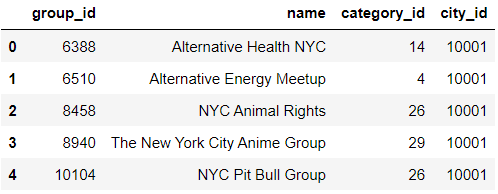
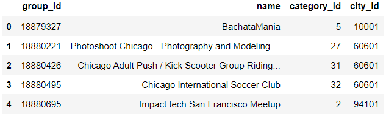
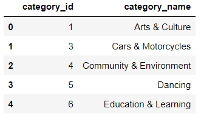
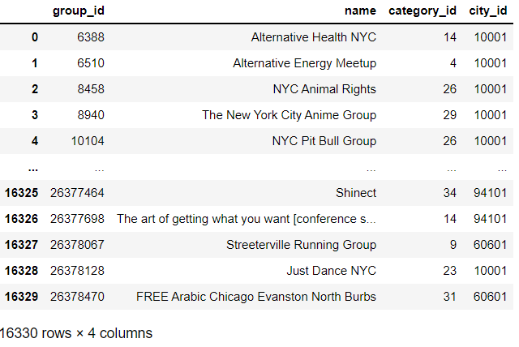
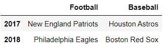
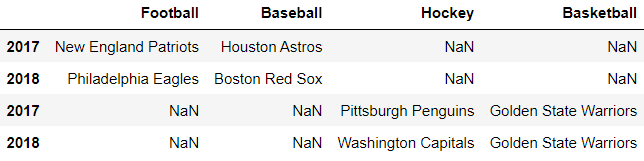
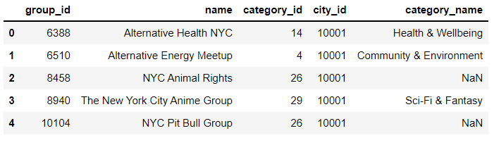

# Chapter 09. GroupBy 객체


* 판다스 라이브러리의 GroupBy 객체는 DataFrame 행을 버킷으로 그룹화하는 저장소 컨테이너입니다. 이 객체는 컬렉션의 각 독립 그룹을 집계하고 분석하는 메서드 집합을 제공합니다. GroupBy 객체를 활용하여 각 그룹의 특정 인덱스 위치에서 행을 추출할 수 있습니다. 또한 행 그룹을 순회하는 편리한 방법도 제공합니다.


## 01. GroupBy 객체 생성

* 간단한 예제를 살펴보고 다음 절에서 기술적인 세부사항을 살펴보겠습니다.
* 슈퍼마켓에 있는 과일과 채소의 가격을 저장하는 DataFrame입니다.

```python
import pandas as pd

food_data = {
    'Item' : ['Banana', 'Cucumber', 'Orange', 'Tomato', 'Watermelon'],
    'Type' : ['Fruit', 'Vegetable', 'Fruit', 'Vegetable', 'Fruit'],
    'Price' : [0.99, 1.25, 0.25, 0.33, 3.00]
}

supermacket = pd.DataFrame(data = food_data)
supermacket
```

```
Item	Type	Price
0	Banana	Fruit	0.99
1	Cucumber	Vegetable	1.25
2	Orange	Fruit	0.25
3	Tomato	Vegetable	0.33
4	Watermelon	Fruit	3.00
```

* supermarket 데이터셋에는 과일('Fruit')과 채소('Vegetable')라는  두 가지 항목 그룹이 있습니다. 이러한 항목 그룹은 그룹 외에도 버킷, 클러스터와 같은 용어로 부르기도 합니다. 여러 개의 행이 같은 범주에 속합니다.
* GroupBy 객체는 열이 공유하는 값을 기반으로 DataFrame 행을 버킷으로 구성합니다. 과일의 평균 가격과 야채의 평균 가격을 구한다고 가정하겠습니다. 'Fruit' 행과 'Vegetable' 행을 별도의 그룹으로 분리할 수 있다면 계산하기 더 쉬울 겁니다.


```python
groups = supermacket.groupby('Type')
groups
```

```
<pandas.core.groupby.generic.DataFrameGroupBy object at 0x00000122A01E8BB0>
```

* 판다스가 그룹을 생성할 때 사용할 값이 있는 열을 인수로 전달해야합니다.
* groupby 메서드는 DataFrameGroupBy라는 새로운 객체를 반환합니다. DataFrameGroupBy 객체는 DataFrame과는 다른 객체입니다.
* Type 열에는 2개의 고유값이 있으므로 GroupBy 객체는 2개의 그룹을 저장합니다.


* get_group 메서드는 그룹 이름을 받아서 해당 행이 있는 DataFrame을 반환합니다.

```python
groups.get_group('Fruit')
```

```
Item	Type	Price
0	Banana	Fruit	0.99
2	Orange	Fruit	0.25
4	Watermelon	Fruit	3.00
```

```python
groups.get_group('Vegetable')
```

```
Item	Type	Price
1	Cucumber	Vegetable	1.25
3	Tomato	Vegetable	0.33
```


* GroupBy 객체는 집계 연산을 탁월하게 수행합니다.

```python
groups.mean()
```

```
         Price
Type	
Fruit	1.413333
Vegetable	0.790000
```


## 02. 데이터셋에서 GroupBy 객체 생성

* 포춘 1000대 기업은 미국에서 가장 큰 1000개 기업의 목록입니다. 각 행은 기업 이름(Company), 매출(Revenues), 이익(Profits), 직원 수(Employees), 부문(Sector), 산업(Industry)를 나타냅니다.

```python
fortune = pd.read_csv('fortune1000.csv')
fortune
```



* 하나의 부문에는 많은 기업이 포함될 수 있습니다. 예를 들어 애플과 아마존 닷컴은 모두 Technology(기술) 부문에 속합니다.
* 산업은 부문의 하위 범주입니다. 예를 들어 'Pipelines'와 'Petroleum Refining' 산업은 'Energy' 부문에 속합니다.


* Sector 열에는 21개의 고유한 값이 있습니다.
* 각 부문에 속한 기업의 평균 매출을 구한다고 가정하겠습니다.
* GroupBy 객체를 사용하기 전에 다른 방법을 사용해보자
* 다음은 Sector 값이 'Rectailing'인 모든 기업을 추출하는 예제입니다.

```python
in_retailing = fortune['Sector'] == 'Retailing'
retail_companies = fortune[in_retailing]
retail_companies.head()
```



* 대괄호를 사용하여 하위 집합에서 Revenues 열을 추출할 수 있습니다.

```python
retail_companies['Revenues'].head()
```

```
0     500343.0
7     177866.0
14    129025.0
22    100904.0
38     71879.0
Name: Revenues, dtype: float64
```

* 마지막으로 Revenues 열에서 mean 메서드를 호출하여 'Retailing' 부문의 평균 매출을 계산할 수 있습니다.

```python
retail_companies['Revenues'].mean()
```

```
21874.714285714286
```

* 위와 같은 예제는 한 부문의 평균 매출을 계산할때 적합합니다. 그러나 포춘에 있는 다른 20개의 부문에도 동일한 논리는 적용하려면 코드를 추가로 많이 작성해야 합니다. 이러한 코드는 확장성이 없습니다. GroupBy 객체는 기본적으로 최상의 솔류션을 제공합니다.


* GroupBy 메서드는 판다스가 그룹화할 때 사용할 값이 있는 열을 인수로 받습니다. 행에 대한 범주형 데이터를 저장하는 열이 그룹화에 적합한 후보입니다. 여러개의 행이 속하는 상위 범주가 있는지 확인하세요. 예를 들어 데이터셋에는 1000개의 고유한 기업이 있지만 부문은 21개의 고유한 값을 가지기 때문에 Sector 열은 집계 분석에 적합합니다.

```python
sectors = fortune.groupby('Sector')
sectors
```

```
<pandas.core.groupby.generic.DataFrameGroupBy object at 0x00000122A025F550>
```

* DataFraneGroupBy 객체는 DataFrame의 번들입니다. 판다스는 내부적으로 'Retailing' 부문에 사용한 추출 과정을 Sector 열의 21개 값 모두에 적용합니다.
* GroupBy 객체를 파이썬의 len 내장 함수에 전달하면 부문의 그룹 개수를 셀 수 있습니다.

```python
len(sectors)
```

```
21
```

* sectors GroupBy 객체에는 21개의 DataFrame이 있습니다. 이 숫자는 nuique 메서드로 확인할 수 있는 fortune의 Sector 열에 있는 고유한 값의 개수와 같습니다.

```python
fortune['Sector'].nunique()
```

```
21
```

* GroupBy 객체의 size 메서드는 그룹과 행 개수를 알파벳 순서로 나열한 리스트로 구성된 Series를 반환합니다.

```python
sectors.size()
```

```
Sector
Aerospace & Defense               25
Apparel                           14
Business Services                 53
Chemicals                         33
Energy                           107
Engineering & Construction        27
Financials                       155
Food &  Drug Stores               12
Food, Beverages & Tobacco         37
Health Care                       71
Hotels, Restaurants & Leisure     26
Household Products                28
Industrials                       49
Materials                         45
Media                             25
Motor Vehicles & Parts            19
Retailing                         77
Technology                       103
Telecommunications                10
Transportation                    40
Wholesalers                       44
dtype: int64
```


## 03. GroupBy 객체의 속성과 메서드

* 21개 부문을 각 부문에 속한 fortune의 행 컬렉션에 연결하는 딕셔너리를 사용하여 GroupBy 객체를 시각화할 수 있습니다. groups 속성은 그룹과 행의 관계를 나타낸 딕셔너리를 저장합니다. 키는 부문의 이름이고 값은 fortune DataFrame에서 행 인덱스 위치를 저장하는 Index객체입니다. 딕셔너리에는 총 21개의 키-값 쌍이 있지만 출력양이 많기 때문에 여기서는 처음 2개의 쌍만 표현하겠습니다.

```python
sectors.groups
```

```
{'Aerospace & Defense': [26, 50, 58, 98, 117, 118, 207, 224, 275, 380, 404, 406, 414, 540, 660, 661, 806, 829, 884, 930, 954, 955, 959, 975, 988], 
'Apparel': [88, 241, 331, 420, 432, 526, 529, 554, 587, 678, 766, 774, 835, 861]
```

* 출력을 보면 인덱스 위치가 26, 50, 58, 98 등인 행이 fortune의 Sector 열에서 'Aerospace & Defense' 값을 갖는다는 것을 알 수 있습니다.
* loc 접근자의 첫번째 인수는 행 인덱스 레이블이고 두번째 인수는 열 인덱스 레이블입니다.
* fortune에서 하나의 행을 추출하여 판다스가 올바른 부문 그룹을 구성했는지 확인해봅시다.

```python
fortune.loc[26,'Sector']
```

```
'Aerospace & Defense'
```


* 각 부문에서 매출 기준으로 가장 높은 성과를 내는 기업을 찾으려면 어떻게 해야 할까요?
* GroupBy 객체의 first 메서드는 fortune의 각 부문에 나열된 첫번째 행을 추출합니다.
* fortune DataFrame은 매출을 기준으로 정렬되어 있기 때문에 각 부문에서 가장 먼저 뽑힌 기업이 해당 부문에서 가장 실적이 좋은 기업니다.

```python
sectors.first()
```



* last 메서드는 fortune에서 각 부문에 속하는 마지막 기업을 추출합니다.
* fortune은 매출을 기준으로 기업을 내림차순으로 정렬하므로 다음 결과는 부문당 매출이 가장 낮은 기업을 나타냅니다.

```python
sectors.last()
```


* GroupBy 객체는 각 부문 그룹의 행에 인덱스 위치를 할당합니다. 'Aerospace & Defense' 부문의 첫번째 fortune 행은 해당 그룹 안에서 인덱스 위치가 0입니다. 마찬가지로 'Aerospace & Defense' 부문의 첫번째 fortune 행은 해당 그룹 안에서 위치가 0입니다. 인덱스 위치는 그룹 간에 독립적입니다.
* nth 메서드는 그룹 안에서 주어진 인덱스 위치로부터 행을 추출합니다. nth 메서드에 인수로 0을 넘기면 각 부문 안에서 첫번째 회사를 반환합니다. 다음 DataFrame은 first 메서드에서 반환한 결과와 동일합니다.

```python
sectors.nth(0)
```


* head 메서드는 각 그룹에서 처음 몇행을 추출합니다
* head(2)는 fortune 내의 각 부문에서 처음 두 행을 추출합니다. 결과는 21개의 고유한 부문을 기준으로 각 부문에 대해 2개씩 행을 가져오기 때문에 총 42개의 행이 있는 DataFrame입니다. GroupBy 객체의 head 메서드와 DataFrame 객체의 head 메서드는 서로 다릅니다. 혼동하지 맙시다.

```
sectors.head(3)
```



* tail 메서드는 각 그룹에서 마지막 몇 행을 추출합니다.

```python
sectors.tail(3)
```


- get_group 메서드를 사용하여 그룹의 모든 행을 추출할 수 있습니다. 이 메서드는 행을 포함하는  DataFrame을 반환합니다. 다음은 'Energy' 부문의 모든 기업을 추출한 예제입니다.

```python
sectors.get_group('Energy').head()
```




## 04. 집계 연산

- GroupBy 객체의 메서드를 호출하여 모든 중첩 그룹에 집계 연산을 적용할 수 있습니다. 기본적으로 판다스는 원본 DataFrame의 모든 숫자 열에 연산을 적용합니다. 다음은 sum 메서드로 fortune DataFrame의 3개의 숫자열(Revenues, Profits, Employees)에 대한 부문별 합계를 계산하는 예제입니다.

```python
sectors.sum().head(10)
```


- 결과가 올바른지 확인해봅시다

```python
sectors.get_group('Aerospace & Defense').head()
```



```python
sectors.get_group('Aerospace & Defense').loc[:,'Revenues'].head()
```

```
26     93392.0
50     59837.0
58     51048.0
98     30973.0
117    25803.0
Name: Revenues, dtype: float64
```

```python
sectors.get_group('Aerospace & Defense').loc[:, 'Revenues'].sum()
```

```
383835.0
```

- sum메서드를 한 번만 호출해도 라이브러리는 sectors GroupBy 객체의 중첩된 모든 DataFrame에 계산 논리는 적용합니다. 최소한의 코드로 모든 열 그룹에 대해 집계 분석을 수행할 수 있습니다.


- 다음은 mean 메서드를 호출하여 부문별 Revenues, Profits, Employees 열의 평균을 계산하는 예제입니다. 다시 말하지만, 판다스는 숫자 열에 대해서만 계산을 적용합니다

```python
sectors.mean().head()
```


- GroupBy 객체 옆에 대괄호를 붙이고 그 사이에 열의 이름을 넣으면 하나의 fortune 열을 대상으로 지정할 수 있습니다.

```python
sectors['Revenues']
```

```
<pandas.core.groupby.generic.SeriesGroupBy object at 0x00000122A03A6190>
```


- 내부적으로 DataFrameGroupBy 객체는 SeriesGroupBy 객체 컬렉션을 저장합니다. SeriesGroupBy 객체로 fortune의 개별 열에 대해 집계 작업을 수행할 수 있습니다. 이때 판다스는 부문별로 결과를 정리합니다. 다음은 부문별 매출 합계를 계산하는 예제입니다.

```python
sectors['Revenues'].sum().head()
```

```
Sector
Aerospace & Defense     383835.0
Apparel                 101157.3
Business Services       316090.0
Chemicals               251151.0
Energy                 1543507.2
Name: Revenues, dtype: float64
```

- 다음은 부문별 평균 직원 수를 계산하는 예제입니다.

```python
sectors['Employees'].mean().head()
```

```
Sector
Aerospace & Defense    40404.960000
Apparel                25407.071429
Business Services      30075.452830
Chemicals              14364.242424
Energy                  9170.158879
Name: Employees, dtype: float64
```

- 다음은 각 부문에 대해 가장 높은 Profits 열 값을 추출하는 예제입니다.

```python
sectors['Profits'].max().head()
```

```
Sector
Aerospace & Defense     8197.0
Apparel                 4240.0
Business Services       6699.0
Chemicals               3000.4
Energy                 19710.0
Name: Profits, dtype: float64
```

- 다음은 부문별 최소 직원 수를 나타내는 예제입니다.

```python
sectors['Employees'].min().head()
```

```
Sector
Aerospace & Defense    5157
Apparel                3700
Business Services      2338
Chemicals              1931
Energy                  593
Name: Employees, dtype: int64
```


- agg 메서드는 딕셔너리를 인수로 받아서 여러 집계 연산을 서로 다른 열에 적용합니다. 각 키-값 쌍에서 키는 DataFrame 열을 나타내고 값은 열에 적용할 집계 연산을 지정합니다. 다음은 각 부문에 대해 가장 낮은 매출과 가장 높은 수익과 직원수의 평균을 구하는 예제입니다.

```python
aggregations = {
    'Revenues' : 'min',
    'Profits' : 'max',
    'Employees' : 'mean'
}

sectors.agg(aggregations).head()
```


## 05. 사용자 정의 연산

- GroupBy 객체의 각 중첩 그룹에 사용자 정의 연산을 적용할 수 있습니다. 이전 절에서 GroupBy 객체의 max 메서드를 사용하여 각 부문의 최대 매출을 구했습니다. 이번에는 각 부문에서 매출이 가장 높은 기업을 찾고 싶다고 가정하겠습니다. fortune이 매출을 기준으로 정렬되어 있기 때문에 first 메서드를 사용하여 부문별 최대 매출 기업을 구할 수 있었지만 만약 fortune이 정렬되어 있지 않다면 어떻게 구해야 할까요?
- DataFrame의 nlargest 메서드는 주어진 열에서 가장 큰 값을 가진 행을 추출합니다.  다음은 Profits 열에서 가장 큰 값을 가진 5개의 행을 찾는 예제입니다

```python
fortune.nlargest( n = 5, columns = 'Profits')
```



- sectors의 각 중첩 DataFrame에서 nlargest 메서드를 호출할 수 있다면 원하는 결과를 얻을 것 입니다. 즉, 각 부문에서 가장 높은 매출을 올리는 기업을 찾을 것입니다.
- GroupBy 객체의 apply 메서드는 함수를 인수로 전달받아 GroupBy 객체의 각 그룹에 대해 함수를 한번씩 호출합니다. 그런 다음 함수의 반환 값을 수집하여 새로운  DataFrame에 할당합니다.

- 먼저 하나의 DataFrame을 인수로 받는 함수를 정의하겠습니다. 이 함수는 Revenues 열에서 가장 큰 값을 가진 DataFrame 행을 반환합니다. 함수의 반환 값은 동적으로 결정됩니다. Revenes열이 있는 모든 DataFrame에 이 함수를 적용할 수 있습니다.

```python
def get_largest_row(df):
    return df.nlargest(1, 'Revenues')
```

```python
sectors.apply(get_largest_row).head()
```


## 06. 다중 열 기반의 그룹화

- 여러 개의 DataFrame 열에 대한 값으로 GroupBy 객체를 만들 수 있습니다. 이 작업은 열 값의 조합으로 그룹을 나타내야 하는 경우에 적합한 솔루션입니다. 다음은 2개의 문자열 리스트를 GroupBy 메서드에 전달하는 예제입니다.

```pyton
sector_and_industry = fortune.groupby(by = ['Sector', 'Industry'])
```

- GroupBy 객체의 size 메서드는 이제 각 내부 그룹의 행 개수가 포함된 MultiIndex Series를 반환합니다.

```python
sector_and_industry.size()
```


- get_group 메서드는 값이 담긴 튜플을 받아 GroupBy 컬렉션에서 중첩된 DataFrame을 추출합니다. 다음은 Sector의 값이 'Business Services'이고 Industry의 값이 'Education'인 행을 추출하는 예제입니다.

```python
sector_and_industry.get_group(('Business Services', 'Education'))
```


- 판다스는 모든 집계 결과를 MultiIndex DataFrame으로 반환합니다. 다음은 먼저 부문별로 그룹화한 다음 산업별로 그룹화한 행을 대상으로 fortune의 숫자열의 합계를 계산하는 예제입니다.

```python
sector_and_industry.sum().head()
```


- 특정 열을 지정할 수 있습니다. GroupBy 객체 옆에 대괄호를 붙이고 그 사이에 열의 이름을 넣습니다. 그런 다음 집계 메서드를 호출합니다. 다음은 각 부문/산업 조합을 가지는 기업의 평균 매출을 계산하는 예제입니다.

```python
sector_and_industry['Revenues'].mean().head()
```

