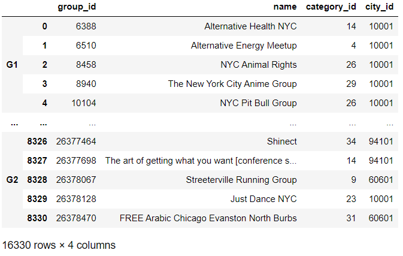
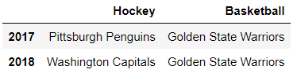
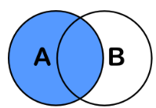
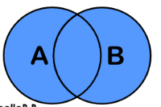
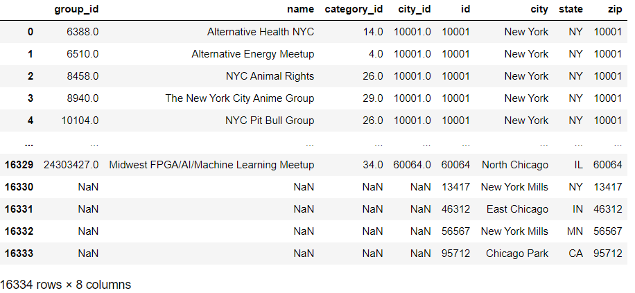
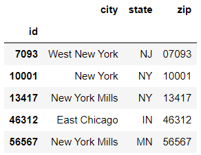

# Chapter 09. 결합과 조인


## 01. 관계형 데이터 베이스

- 모든 데이터를 하나의 테이블에 저장하는것은 어렵다. 이 문제를 해결하고자 여러 테이블에 데이터를 분할한다. 그런 다음 테이블을 서로 연결하여 테이블 사이의 관계를 쉽게 식별하도록 한다.

- PostgreSQL, MySQP, 오라클 같은 데이터베이스를 관계형 데이터베이스 관리 시스템(relational database management system, RDBMS)이라고 한다. RDBM는 데이터 테이블을 분할하고 테이블 사이의 관계를 정의하는 방식을 따른다
- 판다스로도 테이블간에 관계를 정의하고 조인과 같은  SQL 작업을 수행할 수 있다


### 데이터셋

- 가상의 고객정보와 주문정보

- user

|  id  | first_name | last_name |          email           | gender |
| :--: | :--------: | :-------: | :----------------------: | :----: |
|  1   |   Homer    |  Simpson  |   donutfan@simpson.com   |  Male  |
|  2   |    Bart    |  Simpson  | troublemaker@simpson.com |  Male  |

- order

|  id  |   item    | price | quantity | user_id |
| :--: | :-------: | :---: | :------: | :-----: |
|  1   | Donut Box | 4.99  |    4     |    1    |
|  2   | Slingshot | 19.99 |    1     |    2    |


### (정리)

- 관계형 데이터베이스 규칙에 따라 각 레코드에 고유한 숫자 식별자를 할당한다.그리고 id 열에 식별자를 저장한다. id 열의 값을 기본 키(primary key)라고 한다

- 외래 키(foreign key)를 생성하여 두 테이블의 관계를 설정한다. 외래 키는 다른 테이블의 레코드에 대한 참조를 나타낸다
  - orders 테이블의 user_id열은 외래키를 저장한다
  - user_id열은 users 테이블에 있는 레코드에 대한 참조를 나타낸다
  - 외래 키는 데이터의 중복을 방지하는 장점이 있다


## 02. 데이터셋

- 하이킹, 문학, 보드게임과 같은 공통 관심사를 가진 사용자들이 가입하는 온라인 소셜 서비스에서 가져온 데이터


- 그룹1(groups1)


- 그룹2(groups2)


- 카테고리(categories)


- 도시(cities)


## 03. 데이터셋 결합

- 두 데이터셋을 결합하는 가장 간단한 방법은 하나의 DataFrame을 다른 DataFrame의 끝에 추가하여 결합(concatenation)하는 것이다
- concat 함수에 DataFrame 리스트를 objs 매개변수에 전달한다. 판다스는 objs 리스트에 나타나는 순서대로 객체를 연결한다


### (예시1)

```python
pd.concat(objs = [groups1, groups2], ignore_index = True)
```


### (예시2)

```python
pd.concat(objs = [groups1, groups2], keys = ['G1', 'G2'])
```




### (예시3)

- sports_champions_A


- sports_champions_B




```python
pd.concat(objs = [sports_champions_A, sports_champions_B])
```


- 열 축에 걸쳐 결합하려면 1 또는 'columns'를 axis 매개변수로 전달한다

```python
pd.concat(
    objs = [sports_champions_A, sports_champions_C],
    axis = 1
)
pd.concat(
    objs = [sports_champions_A, sports_champions_C],
    axis = 'columns'
)

```


### (정리)

|   매개변수   |        입력        |                설명                |
| :----------: | :----------------: | :--------------------------------: |
|     objs     | [groups1, groups2] |        결합할 데이터를 입력        |
| ignore_index |        True        | 결합한 데이터에 새로운 인덱스 부여 |
|     keys     |    ['G1', 'G2']    |        데이터별 인덱스 부여        |
|     axis     |         1          |        결합할려는 축을 선택        |


## 03. 데이터셋 조인


### 데이터셋

- 그룹(groups)


- 카테고리(categories)


- 도시(cities)


### 3.1 왼쪽 조인

- 결합과 비교하면 조인은 논리적 기준을 적용하여 두 데이터셋 사이에 병합할 행 또는 열을 결정한다는 차이가 있다. 예를 들어 조인은 두 데이터셋 사이에 공통값이 있는 행만 대상으로 지정할 수 있다. 
- 왼쪽 조인은 한 데이터셋의 키를 사용하여 다른 데이터셋의 값을 가져온다. 왼쪽 조인은 분석할 때 하나의 데이터셋에 초점을 맞춰야하는 경우에 적합하다. 이런 경우 기본 데이터셋과 관련된 추가 정보를 제공하는 목적으로 두번째 데이터셋을 가져온다고 가정한다. 아래의 그림을 보면 각 원을 DataFrame이라고 생각하자. 왼쪽 DataFrame이 분석 대상이다.




### (예시)

```python
groups.merge(categories, how = 'left', on = 'category_id').head()
```


### 3.2 내부 조인

- 내부 조인은 두  DataFrame에 모두 존재하는 값을 대상으로 병합한다
- 내부 조인의 경우에는 어느 DataFrame에서 merge 메서드를 호출해도 상관없다. 두 데이터셋의 공통 요소를 식별하기 때문에 호출하는 대상 DataFrame과 상관없이 결과는 동일하다


### (예시)

```python
groups.merge(categories, how = 'inner', on = 'category_id')
```


### 3.3 외부 조인

- 외부 조인은 두 데이터셋의 모든 레코드를 병합한다. 외부 조인에서는 한 쪽에만 존재하는가 여부가 중요하지 않다




### (예시)

- 두 데이터셋 사이에 열의 이름이 다른 경우, on이 아닌 다른 매개변수를 전달해야 한다. left_on과 right_on 매개변수를 사용할 수 있다. 왼쪽 DataFrame의 열 이름을 left_on에 전달하고 오른쪽 DataFrame의 열 이름을 right_on에 전달한다.

```python
groups.merge(
    cities, how = 'outer', left_on = 'city_id', right_on = 'id'
)
```




### 3.4 인덱스 레이블 조인

### (정리)

| 매개변수  | 입력 |                설명                 |
| :-------: | :--: | :---------------------------------: |
|   right   |      |     조인할 데이터프레임을 입력      |
|    how    |      |           조인 유형 선택            |
|    on     |      |           공통 열을 입력            |
|  left_on  |      |   (왼쪽 데이터) 연결시킬 열 입력    |
| right_on  |      |  (오른쪽 데이터) 연결시킬 열 입력   |
| indicator | True | 값이 포함된 데이터 프레임 식별 가능 |


### 3.5 인덱스 레이블 병합


### (예시)

- 그룹(groups)


- 도시(cities) 
  - ID가 인덱스인 데이터




- 조인할려는 열이 인덱스인 경우, right_index 매개변수를 사용한다

```python
groups.merge(
    cities,
    how = 'left',
    left_on = 'city_id',
    right_index = True
)
```


### (정리)

|  매개변수   | 입력 |                     설명                      |
| :---------: | :--: | :-------------------------------------------: |
|    right    |      |          조인할 데이터프레임을 입력           |
|     how     |      |                조인 유형 선택                 |
|     on      |      |                공통 열을 입력                 |
|   left_on   |      |        (왼쪽 데이터) 연결시킬 열 입력         |
|  right_on   |      |       (오른쪽 데이터) 연결시킬 열 입력        |
|  indicator  | True |      값이 포함된 데이터 프레임 식별 가능      |
| left_index  | True |  (왼쪽 데이터) 조인할려는 열이 인덱스인 경우  |
| right_index | True | (오른쪽 데이터) 조인할려는 열이 인덱스인 경우 |