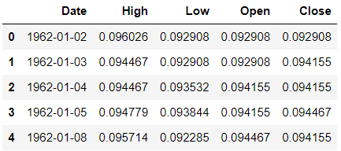

# Chapter 10. 병합, 조인 및 연결

- 비지니스 도메인이 복잡해짐에 따라 모든 데이터를 하나의 컬렉션에 저장하는것이 점점 더 어려워지고 있습니다. 이 문제를 해결하고자 데이터 관리자는 여러 테이블에 데이터를 분할하곤 합니다. 그런 다음 테이블을 서로 연결하여 테이블 사이의 관계를 쉽게 식별하도록 합니다.
- PostgreSQL, MySQP, 오라클 같은 데이터베이스로 작업해본 경험이 있다면 대부분 알겠지만 관계형 데이터베이스 관리 시스템(relational database management system, RDBMS)이 데이터 테이블을 분할하고 테이블 사이의 관계를 정의하는 방식을 따릅니다.데이터베이스는 테이블로 구성됩니다. 테이블은 하나의 도메인 모델에 대한 레코드를 가지며 행과 열로 구성됩니다. 행은 하나의 레코드에 대한 정보를 저장합니다. 열은 각 레코드에 대한 속성을 저장합니다 테이블은 열 키로 연결됩니다. 데이터베이스를 다뤄본 경험이 없다면 테이블이 판다스의 DataFrame과 같다고 생각하면 이해하기 쉬울 것입니다.
- 예제로 생각해보자 여러분이 온라인 판매 사이트를 구축한다고 가정합시다. 웹사이트에 등록된 사용자를 저장할 user 테이블을 만든다고 상상해보세요. 관계형 데이터베이스 규칙에 따라 각 레코드에 고유한 숫자 식별자를 할당합니다.그리고 id 열에 식별자를 저장합니다. id 열의 값은 특정 행의 기본 식별자이기 때문에 기본 키(primary key)라고 합니다. 
- user

|  id  | first_name | last_name |          email           | gender |
| :--: | :--------: | :-------: | :----------------------: | :----: |
|  1   |   Homer    |  Simpson  |   donutfan@simpson.com   |  Male  |
|  2   |    Bart    |  Simpson  | troublemaker@simpson.com |  Male  |

- order

|  id  |   item    | price | quantity | user_id |
| :--: | :-------: | :---: | :------: | :-----: |
|  1   | Donut Box | 4.99  |    4     |    1    |
|  2   | Slingshot | 19.99 |    1     |    2    |

- 데이터베이스 관리자는 외래 키(foreign key)를 생성하여 두 테이블의 관계를 설정합니다. 외래 키는 다른 테이블의 레코드에 대한 참조를 나타냅니다. 키가 현재 테이블의 범위 밖에 있기 때문에 이름에 '외래'라는 단어가 들어갑니다.
- orders 테이블의 각 행은 user_id 열에 주문한 사용자의 ID를 저장합니다 따라서 user_id 열은 외래 키를 저장합니다. 이 열의 값은 다른 테이블인 users 테이블에 있는 레코드에 대한 참조를 나타냅니다. 두 테이블 사이에 설정된 관계로 주문 1을 주문한 사용자의 id가 1이며 이름이 Homer Simpson이라는 것은 알 수 있습니다.
- 외래 키는 데이터의 중복을 방지하는 장점이 있습니다. 예를 들어 orders 테이블은 각 주문에 대해 사용자의 이름, 성 및 이메일을 중복으로 저장할 필요가 없습니다. 대신 해당하는 users 레코드를 나타내는 참조값만 저장하면 됩니다.users와 orders의 항목은 구조 상 따로 존재하지만 필요할 때 연결할 수 있습니다.
- 판다스로 테이블을 결합할 수 있습니다. 라이브러리는 수직과 수평 방향 모두에서 DataFrame을 추가, 연결, 조인, 병합 및 결합할 수 있습니다. 또한 DataFrame 사이에 고유하고 공통 레코드를 식별할 수 있습니다. 내부 조인, 외부 조인, 왼쪽 조인과 같은 SQL 작업을 수행할 수 있습니다. 


## 01.데이터셋 소개

- 이 장의 데이터셋은 하이킹, 문학, 보드게임과 같은 공통 관심사를 가진 사용자들이 가입하는 온라인 소셜 서비스 밋업에서 가져왔습니다. 사용자들은 관심사별로 그룹을 이루며 그룹의 주최자는 그룹 구성원이 참석할 수 있는 온라인 또는 오프라인 이벤드를 예약합니다. 밋업의 도메인에는 그룹, 카테고리 , 도시를 비롯한 여러 데이터 모델이 있습니다.

- 각 그룹에는 ID(group_id), 이름(name), 연결된 카테고리 ID(category_id), 연결된 도시(city_id)

```pytyon
import pandas as pd

groups1 = pd.read_csv('meetup/groups1.csv')
groups1.head()
```



```python
groups2 = pd.read_csv('meetup/groups2.csv')
groups2.head()
```


- 각 그룹에는 외래 키 category_id가 있습니다. category.csv 파일에서 카테고리의 정보를 확인할 수 있습니다.

```python
categories = pd.read_csv('meetup/categories.csv')
categories.head()
```


- 각 그룹에는 외래 키 city_id가 있습니다. city.csv 데이터셋은 도시의 정보를 저장합니다

```python
pd.read_csv('meetup/cities.csv').head()
```


- 도시 데이터셋에는 작은 문제가 있습니다. 우편번호는 다섯 자리 숫자로 구성되어야 하지만 첫 번째 행의 zip값은 네 자리 숫자 7093으로 잘못된 우편번호입니다. CSV에 저장된 실제 값은 07093입니다. 우편번호는 0이 앞에 나올 수 있지만 불행히도 판다스는 우편번호를 정수라고 생각하기 때문에 값의 앞자리에 나열된 0을 제거합니다.
- dtype 매개변수를 read_csv 함수에 추가하여 문제를 해결할 수 있습니다. dtype은 키가 열 이름을 나타내고 값이 해당 열에 할당할 데이터 유형을 나타내는 딕셔너리를 인수로 받습니다.

```python
cities = pd.read_csv(
    'meetup/cities.csv', dtype = {'zip': 'string'}
)
cities.head()
```


## 02. 데이터셋 결합

- 두 데이터셋을 결합하는 가장 간단한 방법은 하나의 DataFrame을 다른 DataFrame의 끝에 추가하여 결합(concatenation)하는 것입니다.
- concat 함수에 DataFrame 리스트를 objs 매개변수에 전달합니다. 판다스는 objs 리스트에 나타나는 순서대로 객체를 연결합니다.

```python
pd.concat(objs = [groups1, groups2])
```


- 연결된 DataFrame은 16,330행 입니다

```python
len(groups1)
```

```
7999
```

```python
len(groups2)
```

```
8331
```

```python
len(group1) + len(groups2)
```

```
16330
```


- 판다스는 연결된 두 DataFrame의 원본 인덱스 레이블을 그대로 유지하기 때문에 연결된 DataFrame에 16,000개가 넘는 해이 있음에도 불구하고 최종 인덱스는 8330으로 출력됩니다. 이 인덱스는 groups1 끝에 덧붙여진 groups2 DataFrame의 마지막 인덱스입니다. 판다스는 groups1과 groups2에 동일한 인덱스 번호가 있는 것을 문제 삼지 않습니다. 그렇기 때문에 결과적으로 연결된 DataFrame에 중복된 인덱스 레이블이 생깁니다.


- 판다스의 표준 숫자 인덱스를 생성하려면 concat 함수의 ignore_index 매개변수에 인수로 True를 전달하면 됩니다. 결합된 DataFrame은 원본 인덱스 레이블을 버립니다.

```python
pd.concat(objs = [groups1, groups2], ignore_index = True)
```


- 인덱스도 중복되지 않게 생성하면서 각 행의 원본  DataFrma을 보존하고 싶다면 어떻게 해야 할까요?  keys 매개변수를 추가하면 됩니다. keys 리스트의 각 문자열을 objs 리스트와 동일한 위치에 있는 DataFrame과 연결합니다. keys와 objs의 리스트 길이는 같아야 합니다. 다음은 groups1 DataFrame에 'G1' 키를 할당하고 groups2 DataFrame에 'G2'키를 할당합니다. concat 함수는 MultiIndex DataFrame을 반환합니다. MultiIndex의 첫번째 레벨을 키를 저장하고 두번째 레벨은 각 DataFrame의 인덱스 레이블을 저장합니다.

```python
pd.concat(objs = [groups1, groups2], keys = ['G1', 'G2'])
```


```python
groups = pd.concat(objs = [groups1, groups2], ignore_index = True)
```


## 03. 결합된 DataFrame의 결측값

- 두 DataFrame을 결합할 때 판다스는 데이터셋이 서로 공유하지 않는 행 레이블과 열 레이블의 교차점에 NaN을 배치합니다.

```python
sports_champions_A = pd.DataFrame(
    data = [
        ['New England Patriots', 'Houston Astros'],
        ['Philadelphia Eagles', 'Boston Red Sox']
    ],
    columns = ['Football', 'Baseball'],
    index = [2017, 2018]
)
sports_champions_A
```


```python
sports_champions_B = pd.DataFrame(
    data = [
        ['New England Patriots', 'St. Louis Blues'],
        ['Kansas City Chiefs', 'Tampa Bay Lightning']
    ],
    columns = ['Football', 'Hockey'],
    index = [2019, 2020]
)
sports_champions_B
```


```python
pd.concat(objs = [sports_champions_A, sports_champions_B])
```


- 기본적으로 판다스는 가로 축에 행을 덧붙입니다. 세로 축에 행을 덧붙이고 싶다면 어떻게 해야할까요?

```python
sports_champions_C = pd.DataFrame(
    data = [
        ['Pittsburgh Penguins', 'Golden State Warriors'],
        ['Washington Capitals', 'Golden State Warriors']
    ],
    columns = ['Hockey', 'Basketball'],
    index = [2017, 2018]
)
sports_champions_C
```


```python
pd.concat(objs = [sports_champions_A, sports_champions_C])
```


- concat 함수에는 axis 매개변수가 있습니다. 열 축에 걸쳐 DataFrame을 결합하려면 1 또는 'columns'를 axis 매개변수로 전달합니다.

```python
pd.concat(
    objs = [sports_champions_A, sports_champions_C],
    axis = 1
)
pd.concat(
    objs = [sports_champions_A, sports_champions_C],
    axis = 'columns'
)

```


## 04. 왼쪽 조인

- 결합과 비교하면 조인은 논리적 기준을 적용하여 두 데이터셋 사이에 병합할 행 또는 열을 결정한다는 차이가 있습니다. 예를 들어 조인은 두 데이터셋 사이에 공통값이 있는 행만 대상으로 지정할 수 있습니다. 
- 왼쪽 조인은 한 데이터셋의 키를 사용하여 다른 데이터셋의 값을 가져옵니다. 엑셀의 VLOOKUP 연산과 동일합니다. 왼쪽 조인은 분석할 때 하나의 데이터셋에 초점을 맞춰야하는 경우에 적합합니다. 이런 경우 기본 데이터셋과 관련된 추가 정보를 제공하는 목적으로 두번째 데이터셋을 가져온다고 가정합니다. 아래의 그림을 보면 각 원을 DataFrame이라고 생각하세요. 왼쪽 DataFrame이 분석 대상 입니다.


```python
groups.head(3)
```


- category_id 열의 외래 키는 categories 데이터셋의 ID를 참조합니다.

```python
categories.head(3)
```


- 그룹별로 왼쪽 조인을 실행하여 각 그룹에 대한 카테고리 정보를 추가하겠습니다. merge 메서드를 사용하여 하나의 DataFrame을 다른 DataFrame에 병합합니다. 메서드의 첫번째 매개변수 right은 DataFrame을 인수로 받습니다. 위 그림을 기준으로 중심이 되는 DataFrame을 왼쪽, 병합되는 대상을 오른쪽 DataFrame이라고 부르겠습니다.  메서드의 how 매개변수에 조인 유형을 나타내는 문자열을 전달할 수 있습니다. 여기서는 왼쪽 조인을 실행하기 위해 왼쪽을 나타내는 'left'를 전달합니다. 또한 두 DataFrame 사이의 값을 연결할 열을 지정해야 합니다. on 매개변수에 'category_id'를 인수로 넘깁니다. DataFrame 사이에 열 이름이 동일한 경우에만 on 매개변수를 사용할 수 있습니다. 

```python
groups.merge(categories, how = 'left', on = 'category_id').head()
```


- 판다스는 groups에서 categories의 category_id 값과 일치하는 값을 찾을때 마다 categories의 열을 가져옵니다. 이때 category_id 열은 하나만 유지됩니다. 라이브러리가 categories에서 groups의 category_id를 찾지 못하면 categories에서 가져온 category_name 열에 NaN 값을 표시합니다.


## 05. 내부 조인

- 내부 조인은 두  DataFrame에 모두 존재하는 값을 대상으로 DataFrame을 병합합니다. 내부 조인은 원의 중에 있는 색상이 겹치는 부분을 대상으로 합니다.


- 내부 조인에서 판다스는 첫번째 DataFrame에만 존재하고 두번째 DataFrame에만 존재하는 값은 제외합니다.

```python
groups.head(3)
```


```python
categories.head(3)
```


- 두 데이터셋에 모두 존재하는 categories를 식별하겠습니다. 기술적인 관점으로 보면 groups와 categories에서 category_id 열의 값이 동일한 행을 대상으로 지정합니다. 내부 조인의 경우에는 어느 DataFrame에서 merge 메서드를 호출해도 상관없습니다. 내부 조인은 두 데이터셋의 공통 요소를 식별하기 때문에 호출하는 대상 DataFrame과 상관없이 결과는 동일합니다.

```python
groups.merge(categories, how = 'inner', on = 'category_id')
```


- 병합된 DataFrame에는 groups와 categories DataFrame의 모든 열이 포함됩니다. category_id 열의 값은 groups와 categories 모두에 존재합니다. 하지만 category_id 열은 결과에서 한번만 나타납니다. category_id의 값이 groups와 categories의 내부 조인 결과에서 동일하기 때문에 열을 중복해서 나타낼 필요가 없습니다.


- 판다스가 올바르게 병합했는지 확인해봅시다.

```python
groups[groups['category_id'] == 14]
```


```python
categories[categories['category_id'] == 14]
```


- 병합된 DataFrame은 두 DataFrame에서 값이 일치하는 category_id당 하나의 행을 생성합니다. groups에는 categories_id가 14인 행이 870개 있으면 categories에는 1개 있습니다. 판다스는 groups의 870개 행을 각각 categories에 있는 하나의 행과 쌍으로 만들어 병합된 DataFrame에는 총 870개의 행이 생성됩니다. 내부 조인은 일치하는 각 값을 대상으로 두 DataFrame의 나머지 값을 조합하여 새로운 행을 생성하기 때문에 병합된 DataFrame은 원본 DataFrame보다 훨씬 클 수 있습니다. 예를 들어 ID가 14인 categories가 3개 있는 경우 판다스는 총 2610(870*3)개의 행을 생성합니다.


## 06. 외부 조인

- 외부 조인은 두 데이터셋의 모든 레코드를 병합합니다. 외부 조인에서는 한 쪽에만 존재하는가 여부가 중요하지 않습니다. 


```python
groups.head(3)
```


```python
cities.head(3)
```


- 외부 조인을 사용하여 groups와 cities를 병합하겠습니다. 결과는 groups에만 있는 도시, cities에만 있는 도시 또는 두 데이터셋에 모두 존재하는 도시를 모두 나타냅니다.
- 지금까지는 데이터셋을 병합할때 공통 열의 이름을 지정했습니다. 데이터셋 사이에 열의 이름이 다른 경우 merge 메서드에 on과 다른 매개변수를 전달해야 합니다. on 매개변수 대신 merge 메서드의 left_on과 right_on 매개변수를 사용할 수 있습니다. 왼쪽 DataFrame의 열 이름을 left_on에 전달하고 오른쪽 DataFrame의 열 이름을 right_on에 전달합니다. 다음은 cities의 도시 정보를 groups DataFrame에 외부 조인하는 예제입니다.

```python
groups.merge(
    cities, how = 'outer', left_on = 'city_id', right_on = 'id'
)
```


- 최종 DataFrame에는 두 데이터셋의 모든 도시 ID가 포함됩니다. 판다스가 city_id와 id 열 사이에서 일치하는 값을 찾으면 두 DataFrame의 열을 하나의 행으로 병합합니다. 처음 다섯 행에서 몇가지 예시를 볼 수 있습니다. city 열은 공통 ID를 저장합니다
- 한 DataFrame에 있는 값이 다른 DataFrame에 없다면 판다스는 city_id 열에 NaN값을 배치합니다. 데이터셋의 마지막 다섯 행에서 몇 가지 예시를 볼 수 있습니다. 결측값은 어느 DataFrame에 값이 없는지와 상관없이 삽입됩니다.


- 값이 어떤 DataFrame에 속하는지 식별하고 싶다면 merge 메서드의 indicator 매개변수에 인수로 True를 전달하세요. 병합된 DataFrame에는 둘 다를 나타내는 'both', 왼쪽에만 존재함을 나타내는 'left_only', 오른쪽에만 존재함을 나타내는 'right_only' 값을 저장하는 _merge 열이 추가됩니다.

```python
groups.merge(
    cities,
    how = 'outer',
    left_on = 'city_id',
    right_on = 'id',
    indicator = True
)
```


- _merge 열을 사용하여 DataFrame 중 하나에만 속하는 행을 필터링 할 수 있습니다.

```python
outer_join = groups.merge(
    cities,
    how = 'outer',
    left_on = 'city_id',
    right_on = 'id',
    indicator = True
)

in_right_only = outer_join['_merge'] == 'right_only'

outer_join[in_right_only].head()
```


## 07. 인덱스 레이블 병합

- 조인하려는 DataFrame이 기본 키를 인덱스에 저장한다고 가정하겠습니다. 이러한 경우에는 DataFrame을 어떻게 조인할 수 있을까요? cities에서 set_index 메서드를 호출하여 id 열을 DataFrame의 인덱스로 설정합시다.

```python
cities.head(3)
```


```python
cities = cities.set_index('id')
cities.head()
```


```python
groups.head(3)
```


- 왼쪽 조인을 사용하여 cities를 groups로 병합하겠습니다. 왼쪽 조인을 하려면 groups의 city_id 열 값을 cities의 인덱스 레이블과 비교해야 합니다. 오른쪽 DataFrame의 인덱스에서 공통 값을 찾도록 새로운 매개변수 right_index에 인수로 True를 전달합니다.

```python
groups.merge(
    cities,
    how = 'left',
    left_on = 'city_id',
    right_index = True
)
```

